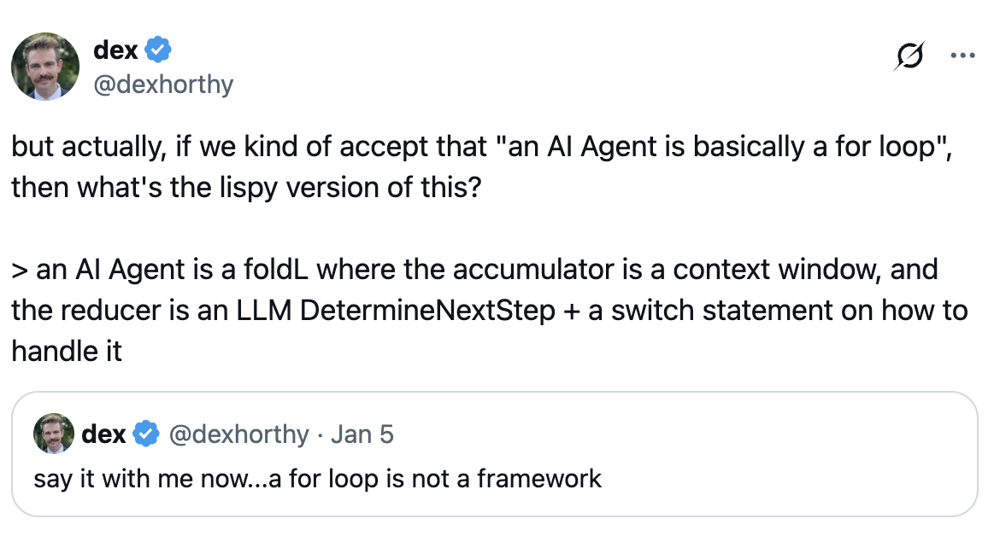

# 12 Factor Agents

## 简介

我试过市面上所有的代理框架——从开箱即用的 crew/langchains，到"极简主义"的 smolagents，再到号称"生产级"的 langraph、griptape 等等。

我和很多非常优秀的创始人聊过，无论是否在 YC 体系内，他们都在用 AI 构建令人印象深刻的产品。他们中的大多数选择自己从零搭建技术栈。我在面向客户的生产级代理中很少看到框架的身影。

我惊讶地发现，市面上大多数号称"AI 代理"的产品其实并没有那么强的自主性。其中很多主要由确定性代码构成，只是在恰到好处的位置点缀了 LLM 调用，让体验显得真正神奇。

代理，至少是优秀的代理，并不遵循"给你一个提示词，给你一堆工具，循环直到达成目标"这种模式。相反，它们主要就是软件。

因此，我试图回答这个问题：

> **我们应该遵循哪些原则来构建基于 LLM 的软件，使其真正足够好、能够交付给生产环境的客户使用？**

