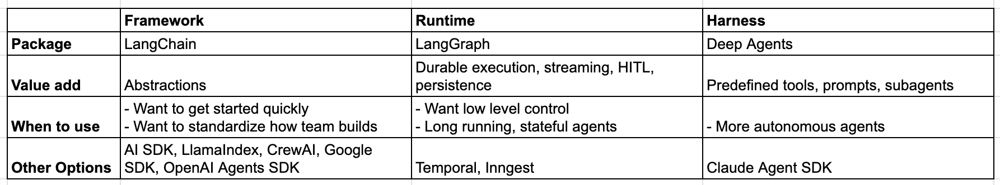

# Agent 框架、运行时与 Harness——天哪！

## Agent 框架 (LangChain)

市面上大多数帮助基于 LLM 进行开发的包，我会将其归类为 agent 框架。它们的主要价值在于提供抽象。这些抽象代表了一种对世界的认知模型，理想情况下应能降低上手门槛。它们还提供了构建应用的标准方式，使开发者能够轻松上手并在不同项目之间切换。对抽象的批评主要集中在：如果设计不当，可能会掩盖底层运作机制，且无法满足高级用例所需的灵活性。

我们将 [LangChain](https://docs.langchain.com/oss/python/langchain/overview?ref=blog.langchain.com) 视为一个 agent 框架。在 1.0 版本的开发过程中，我们花了很多时间思考抽象的设计——包括结构化内容块、agent 循环、中间件（我们认为这为标准 agent 循环增加了灵活性）。我认为属于 agent 框架的其他例子还包括 Vercel 的 AI SDK、CrewAI、OpenAI Agents SDK、Google ADK、LlamaIndex 等等。

## Agent 运行时 (LangGraph)

当需要在生产环境中运行 agent 时，你会需要某种 agent 运行时。这个运行时应提供更多基础设施层面的能力。首先想到的就是[持久化执行](https://docs.langchain.com/oss/python/langgraph/durable-execution?ref=blog.langchain.com)，但我也会将流式传输支持、[human-in-the-loop 支持](https://docs.langchain.com/oss/python/langgraph/interrupts?ref=blog.langchain.com)、线程级持久化和[跨线程持久化](https://docs.langchain.com/oss/python/langgraph/add-memory?ref=blog.langchain.com)等特性归入其中。

在构建 [LangGraph](https://docs.langchain.com/oss/python/langgraph/overview?ref=blog.langchain.com) 时，我们希望从零开始打造一个生产就绪的 agent 运行时。你可以在[这里](https://blog.langchain.com/building-langgraph/)阅读更多关于我们构建 LangGraph 的思考过程。我们认为与此最接近的其他项目是 Temporal、Inngest 和其他持久化执行引擎。

Agent 运行时通常比 agent 框架更底层，可以为 agent 框架提供支撑。例如，LangChain 1.0 就构建在 LangGraph 之上，以利用其提供的 agent 运行时能力。

## Agent Harness (DeepAgents)

[DeepAgents](https://docs.langchain.com/oss/python/deepagents/overview?ref=blog.langchain.com) 是我们正在开发的最新项目。它比 agent 框架层级更高——构建在 LangChain 之上。它加入了默认提示词、对工具调用采用带有明确约定的处理方式、用于规划的工具、文件系统访问能力等等。它不仅仅是一个框架——而是自带完整配套能力。

我们描述 DeepAgents 的另一种方式是将其称为"通用版的 Claude Code"。公平地说，Claude Code 也在尝试成为一个 agent harness——他们发布的 Claude Agent SDK 就是朝这个方向迈出的一步。除了 Claude Agent SDK 之外，我认为目前市面上并没有太多通用型 agent harness。不过也有人认为，所有编程 CLI 工具在某种意义上都是 agent harness，而且可能是通用的。

## 各自的使用场景

让我们总结一下它们之间的差异，并讨论何时使用哪一个：

坦率地说，这些边界其实是模糊的。例如，LangGraph 可能最好被描述为同时兼具运行时和框架的特性。"Agent Harness" 这个词我才刚开始看到被更多人使用（[这个词不是我发明的](https://www.vtrivedy.com/posts/claude-code-sdk-haas-harness-as-a-service?ref=blog.langchain.com)）。我认为目前这些概念都还没有一个特别清晰的定义。

在早期领域开发的乐趣之一，就是建立用来讨论事物的认知模型。我们知道 LangChain 不同于 LangGraph，DeepAgents 又与这两者都不同。我们认为将它们分别描述为框架、运行时和 harness 是一个有意义的区分——但一如既往，我们期待你的反馈！
