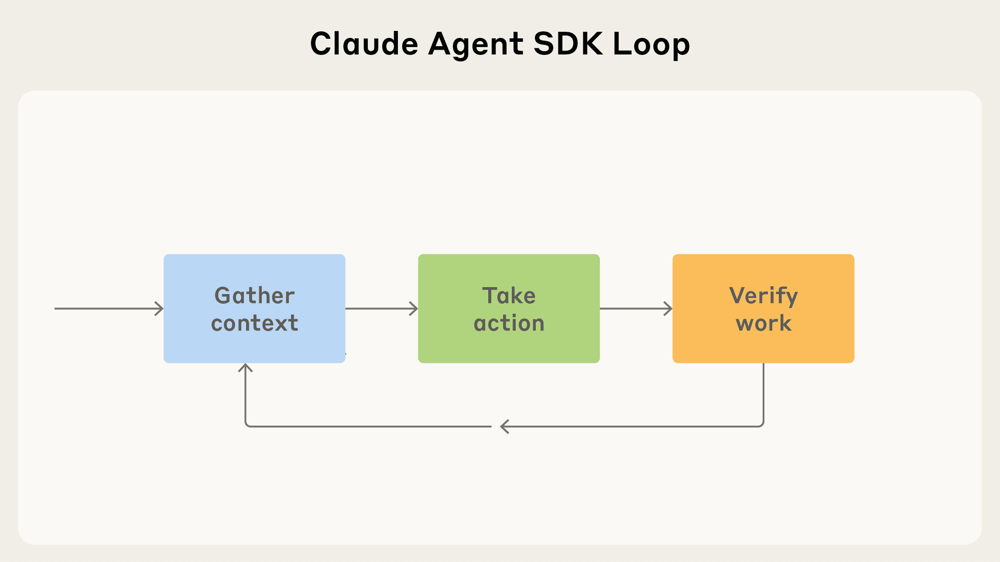
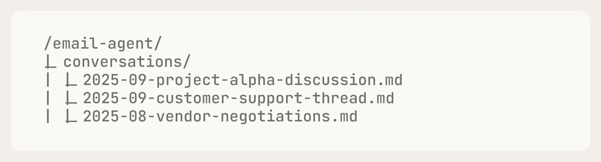
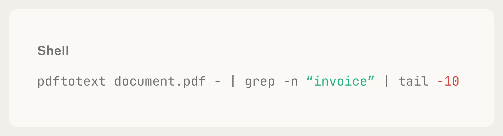
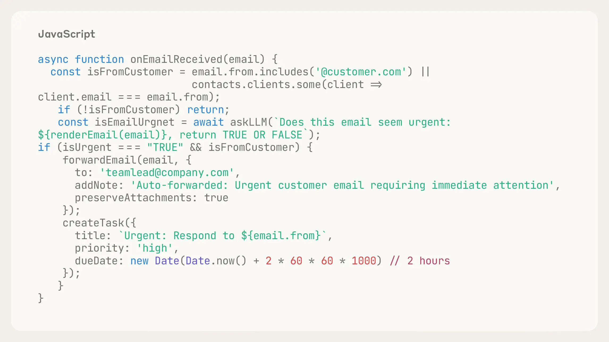
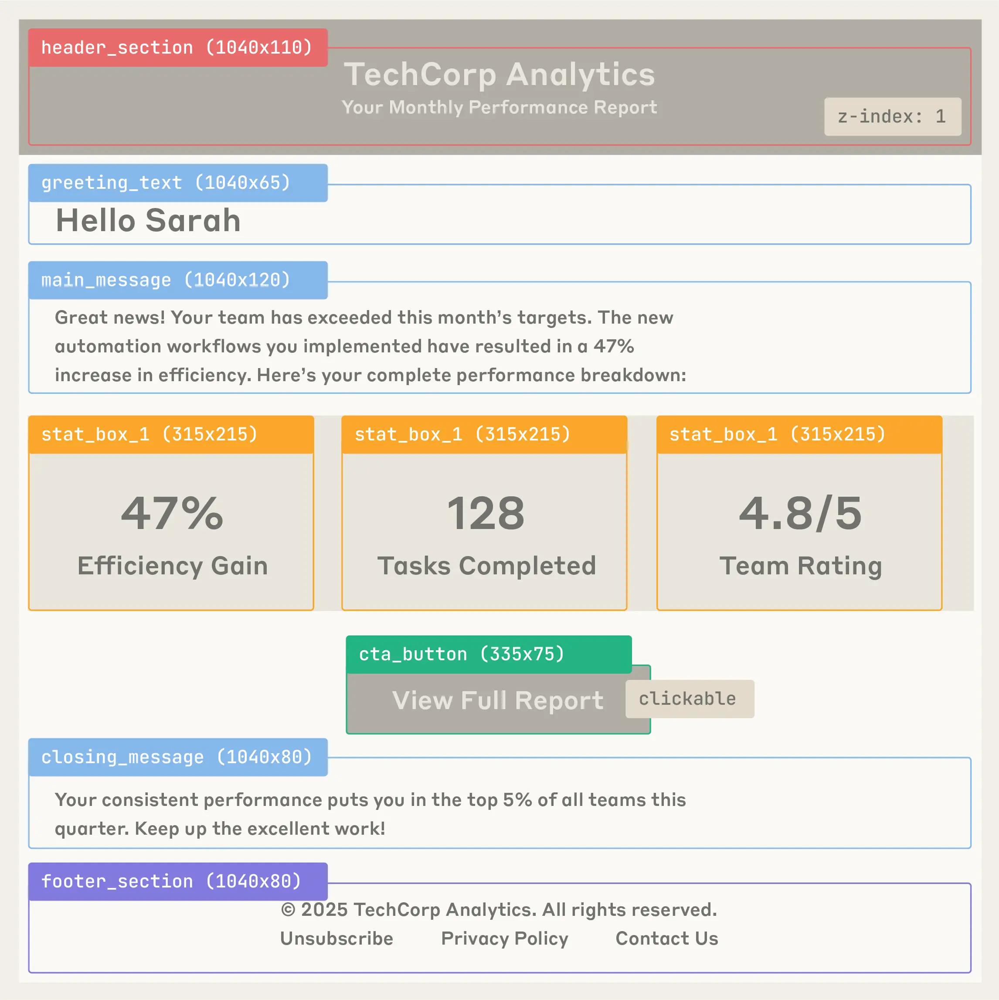

# 使用 Claude Agent SDK 构建代理 | Claude


# 使用 Claude Agent SDK 构建代理

Claude Agent SDK 是一套工具集合，帮助开发者在 Claude Code 之上构建强大的代理。在本文中，我们将介绍如何入门并分享我们的最佳实践。

‍

*     分类 [Claude Code](https://claude.com/blog/category/claude-code) [Agents](https://claude.com/blog/category/agents)
*     产品 Claude Code  Claude Platform
*     日期 2025 年 9 月 29 日
*     阅读时间 5 分钟
*     分享 [复制链接](http://claude.com/blog/building-agents-with-the-claude-agent-sdk#)https://claude.com/blog/building-agents-with-the-claude-agent-sdk

去年，我们与客户一起分享了[构建高效代理](https://www.anthropic.com/engineering/building-effective-agents)的经验。此后，我们发布了 [Claude Code](https://claude.com/product/claude-code)，这是我们最初为提升 Anthropic 内部开发者生产力而构建的代理式编程工具。

在过去几个月里，Claude Code 已远不止于一个编程工具。在 Anthropic，我们[使用它](https://www.anthropic.com/news/how-anthropic-teams-use-claude-code)进行深度研究、视频创作和笔记整理等众多非编程场景。事实上，它已经开始驱动我们几乎所有主要的代理循环。

换言之，驱动 Claude Code 的 agent harness（即 Claude Code SDK）同样可以驱动许多其他类型的代理。为体现这一更广阔的愿景，我们将 Claude Code SDK 更名为 Claude Agent SDK。

在这篇文章中，我们将介绍为什么构建 Claude Agent SDK、如何用它构建你自己的代理，以及分享我们团队在实际部署中总结的最佳实践。

## 给 Claude 一台计算机

Claude Code 背后的[核心设计原则](https://www.youtube.com/watch?v=vLIDHi-1PVU)是：Claude 需要程序员日常使用的同样工具。它需要能够在代码库中查找合适的文件、编写和编辑文件、lint 代码、运行代码、调试、编辑，有时还需要反复执行这些操作直到代码成功运行。

我们发现，通过让 Claude 访问用户的计算机（通过终端），它就拥有了像程序员一样编写代码所需的一切。

但这也使得 Claude Code 中的 Claude 在**非编程**任务上同样出色。通过给它运行 bash 命令、编辑文件、创建文件和搜索文件的工具，Claude 可以读取 CSV 文件、搜索网络、构建可视化、解读指标，以及完成各种其他数字工作——简而言之，就是创建拥有计算机的通用代理。Claude Agent SDK 背后的核心设计原则就是给你的代理一台计算机，让它们像人类一样工作。

## 创建新型代理

我们相信，给 Claude 一台计算机能够解锁构建比以往更高效的代理的能力。例如，借助我们的 SDK，开发者可以构建：

*   **金融代理**：构建能够理解你的投资组合和目标、以及通过访问外部 API、存储数据和运行代码进行计算来帮助评估投资的代理。
*   **个人助理代理**：构建能够帮助你预订旅行和管理日程、以及安排会议、整理简报等的代理，通过连接内部数据源并跨应用追踪上下文。
*   **客户支持代理**：构建能够处理高模糊性用户请求（如客户服务工单）的代理，通过收集和审查用户数据、连接外部 API、向用户发送消息并在需要时升级给人工处理。
*   **深度研究代理**：构建能够在大型文档集合中进行全面研究的代理，通过搜索文件系统、分析和综合多个来源的信息、交叉引用不同文件中的数据，并生成详细报告。

还有更多可能。从本质上讲，SDK 为你提供了构建代理的原语，无论你想自动化什么工作流。

## 构建你的代理循环

在 Claude Code 中，Claude 通常在一个特定的反馈循环中运作：收集上下文 -> 执行操作 -> 验证工作 -> 重复。



代理通常在一个特定的反馈循环中运作：收集上下文 -> 执行操作 -> 验证工作 -> 重复。

这为思考其他代理及其应具备的能力提供了一种有用的方式。为了说明这一点，我们将以如何在 Claude Agent SDK 中构建一个邮件代理为例进行演示。

## 收集上下文

在开发代理时，你需要给它提供的不只是一个提示词：它还需要能够获取和更新自己的上下文。以下是 SDK 中的功能如何帮助你实现这一点。

### **代理式搜索与文件系统**

文件系统代表**可以**被拉入模型上下文的信息。

当 Claude 遇到大文件（如日志或用户上传的文件）时，它会使用 `grep` 和 `tail` 等 bash 脚本来决定如何将这些内容加载到其上下文中。本质上，代理的文件夹和文件结构成为一种[上下文工程](http://anthropic.com/news/context-management)的形式。

我们的邮件代理可能会将之前的对话存储在一个名为"Conversations"的文件夹中。这样当被问及这些对话时，它可以搜索这些历史记录作为自己的上下文。



### **语义搜索**

[语义搜索](https://www.anthropic.com/news/contextual-retrieval)通常比代理式搜索更快，但准确度较低、维护难度更大、且透明度较差。它涉及将相关上下文"分块"，将这些块嵌入为向量，然后通过查询这些向量来搜索概念。鉴于其局限性，我们建议从代理式搜索开始，只有在需要更快的速度或更多变体时才添加语义搜索。

### **子代理**

Claude Agent SDK 默认支持子代理。[子代理](https://docs.claude.com/en/api/agent-sdk/subagents)主要有两个优势。首先，它们支持并行化：你可以启动多个子代理同时处理不同的任务。其次，它们有助于管理上下文：子代理使用自己独立的上下文窗口，只将相关信息返回给编排器，而不是全部上下文。这使得它们非常适合需要筛选大量信息但大部分信息并不有用的任务。

在设计我们的邮件代理时，我们可以给它一个"搜索子代理"能力。邮件代理可以并行启动多个搜索子代理——每个对邮件历史运行不同的查询——并让它们只返回相关摘录而非完整邮件线程。

### **压缩**

当代理长时间运行时，上下文维护变得至关重要。Claude Agent SDK 的压缩功能会在上下文限制接近时自动总结之前的消息，这样你的代理就不会耗尽上下文。该功能基于 Claude Code 的[压缩斜杠命令](https://docs.claude.com/en/docs/claude-code/sdk/sdk-slash-commands#%2Fcompact-compact-conversation-history)构建。

## 执行操作

一旦你收集了上下文，就需要给你的代理灵活的执行方式。

### **工具**

[工具](https://www.anthropic.com/engineering/writing-tools-for-agents)是代理执行的主要构建块。工具在 Claude 的上下文窗口中占据突出位置，是 Claude 在决定如何完成任务时首先考虑的操作。这意味着你应该有意识地设计工具，以最大化上下文效率。你可以在我们的博文[使用代理为代理编写高效工具](https://www.anthropic.com/engineering/writing-tools-for-agents)中查看更多最佳实践。

因此，你的工具应该是你希望代理执行的主要操作。了解如何在 Claude Agent SDK 中制作[自定义工具](https://docs.claude.com/en/api/agent-sdk/custom-tools)。

对于我们的邮件代理，我们可能会定义"`fetchInbox`"或"`searchEmails`"等工具作为代理的主要、最频繁的操作。

### **Bash 与脚本**

Bash 作为一种通用工具非常有用，允许代理使用计算机完成灵活的工作。

在我们的邮件代理中，用户可能在附件中存储了重要信息。Claude 可以编写代码来下载 PDF、将其转换为文本并搜索其中的有用信息，如下所示：



### **代码生成**

Claude Agent SDK 擅长代码生成——这是有充分理由的。代码是精确的、可组合的、且可无限复用的，使其成为需要可靠执行复杂操作的代理的理想输出。

在构建代理时，请思考：哪些任务适合用代码来表达？通常，这个问题的答案能解锁重要的能力。

例如，我们最近在 [Claude.AI](http://claude.ai/redirect/website.v1.bdb29daa-1a07-41ec-87f6-579dc33634bd) 上推出的[文件创建](https://www.anthropic.com/news/create-files)功能完全依赖代码生成。Claude 编写 Python 脚本来创建 Excel 电子表格、PowerPoint 演示文稿和 Word 文档，确保格式一致且功能复杂，这是其他方式难以实现的。

在我们的邮件代理中，我们可能希望允许用户为收到的邮件创建规则。为此，我们可以编写代码在该事件触发时运行：



### **MCP**

[Model Context Protocol](https://modelcontextprotocol.io/)（MCP）提供了与外部服务的标准化集成，自动处理身份验证和 API 调用。这意味着你可以将代理连接到 Slack、GitHub、Google Drive 或 Asana 等工具，而无需编写自定义集成代码或自行管理 OAuth 流程。

对于我们的邮件代理，我们可能想要`搜索 Slack 消息`以了解团队上下文，或者`查看 Asana 任务`以了解是否已有人被分配处理某个客户请求。借助 MCP 服务器，这些集成开箱即用——你的代理只需调用 search_slack_messages 或 get_asana_tasks 等工具，MCP 会处理其余工作。

不断增长的 [MCP 生态系统](https://github.com/modelcontextprotocol/servers)意味着随着预构建集成不断丰富，你可以快速为代理添加新能力，从而专注于代理行为本身。

## 验证你的工作

Claude Code SDK 通过评估自己的工作来完成代理循环。能够检查和改进自身输出的代理从根本上更可靠——它们在错误累积之前就捕捉到问题，在偏离时自我纠正，并在迭代中不断进步。

关键在于为 Claude 提供具体的评估工作的方式。以下是我们发现有效的三种方法：

### **定义规则**

最好的反馈形式是为输出提供明确定义的规则，然后解释哪些规则失败了以及为什么。

[代码 lint](https://stackoverflow.com/questions/8503559/what-is-linting) 是一种优秀的基于规则的反馈形式。反馈越深入越好。例如，通常生成 TypeScript 并进行 lint 比生成纯 JavaScript 更好，因为它提供了多个额外的反馈层。

在生成电子邮件时，你可能希望 Claude 检查电子邮件地址是否有效（如果无效，则抛出错误）以及用户之前是否曾向该地址发送过邮件（如果是，则发出警告）。

### **视觉反馈**

当使用代理完成视觉任务（如 UI 生成或测试）时，视觉反馈（以截图或渲染的形式）可能很有帮助。例如，如果发送带有 HTML 格式的电子邮件，你可以截取生成的邮件并将其返回给模型进行视觉验证和迭代改进。模型随后会检查视觉输出是否与请求的内容匹配。

例如：

*   **布局** - 元素位置是否正确？间距是否合适？
*   **样式** - 颜色、字体和格式是否如预期呈现？
*   **内容层次** - 信息是否以正确的顺序和适当的强调呈现？
*   **响应式** - 是否看起来破损或拥挤？（虽然单张截图的视口信息有限）

使用 Playwright 等 MCP 服务器，你可以自动化这个视觉反馈循环——截取渲染后的 HTML、捕获不同视口大小，甚至测试交互元素——所有这些都在你的代理工作流中完成。



来自大型语言模型（LLM）的视觉反馈可以为你的代理提供有用的指导。

### **LLM 作为评判者**

你还可以让另一个语言模型根据模糊规则来"评判"代理的输出。这通常不是一种非常可靠的方法，可能会有较大的延迟代价，但对于任何性能提升都值得成本的应用来说，它可以有所帮助。

我们的邮件代理可以让一个单独的子代理来评判其草稿的语气，看看是否与用户之前的消息风格一致。

## 测试和改进你的代理

在经历了几次代理循环后，我们建议测试你的代理，确保它为任务做好了充分准备。改进代理的最好方法是仔细查看它的输出，特别是失败的情况，并设身处地思考：它是否拥有完成任务的[正确工具](https://www.anthropic.com/engineering/writing-tools-for-agents)？

在评估代理是否胜任工作时，以下是一些值得思考的问题：

*   如果你的代理误解了任务，可能是缺少关键信息。你能调整搜索 API 的结构，使其更容易找到所需的信息吗？
*   如果你的代理反复在某个任务上失败，你能在工具调用中添加一个正式规则来识别和修复失败吗？
*   如果你的代理无法修复自己的错误，你能给它提供更有用或更有创造性的工具来以不同方式解决问题吗？
*   如果你的代理性能随着功能添加而波动，请基于客户使用情况构建一个有代表性的测试集，用于程序化评估（即 evals）。

## 入门

Claude Agent SDK 通过让 Claude 访问一台可以写入文件、运行命令和迭代工作的计算机，使构建自主代理变得更加容易。

牢记代理循环（收集上下文、执行操作和验证工作），你可以构建可靠、易于部署和迭代的代理。

你可以立即[开始使用](https://docs.claude.com/en/api/agent-sdk/overview) Claude Agent SDK。对于已经在 SDK 上进行构建的开发者，我们建议按照[本指南](https://docs.claude.com/en/docs/claude-code/sdk/migration-guide)迁移到最新版本。

## 致谢

由 Thariq Shihipar 撰写，Molly Vorwerck、Suzanne Wang、Alex Isken、Cat Wu、Keir Bradwell、Alexander Bricken 和 Ashwin Bhat 提供笔记和编辑。

[Prev](http://claude.com/blog/building-agents-with-the-claude-agent-sdk#)Prev

0/5

[Next](http://claude.com/blog/building-agents-with-the-claude-agent-sdk#)Next

eBook


FAQ

No items found.

获取 Claude Code

*   [Desktop](http://claude.com/download)
*   [VS Code](https://marketplace.visualstudio.com/items?itemName=anthropic.claude-code)
*   [JetBrains](https://plugins.jetbrains.com/plugin/27310-claude-code-beta-)
*   [On the web](https://claude.ai/code)
*   [Slack](https://slack.com/oauth/v2/authorize?client_id=1601185624273.8899143856786&scope=app_mentions:read,assistant:write,channels:history,channels:read,chat:write,files:read,files:write,groups:history,groups:read,im:history,im:read,im:write,mpim:history,reactions:write,users:read,users:read.email,commands,search:read.public&user_scope=bookmarks:read,channels:history,channels:read,chat:write,emoji:read,files:read,groups:history,groups:read,groups:write,im:history,im:read,im:write,links:read,mpim:history,mpim:read,mpim:write,mpim:write.topic,pins:read,reactions:read,reactions:write,remote_files:read,team:read,users:read,users:read.email,search:read.public,search:read.private,search:read.im,search:read.mpim,search:read.files,search:read.users,canvases:read,canvases:write)

```
curl -fsSL https://claude.ai/install.sh | bash
```

```
irm https://claude.ai/install.ps1 | iex
```

或阅读[文档](https://code.claude.com/docs/en/overview)

尝试 Claude Code

[Try Claude Code](https://claude.ai/code)Try Claude Code

开发者文档

[Developer docs](https://code.claude.com/docs/en/overview)Developer docs

## 相关文章

探索更多关于使用 Claude 构建的产品资讯和团队最佳实践。


2026 年 4 月 2 日

### 驾驭 Claude 的智能

Agents

[Harnessing Claude's intelligence](http://claude.com/blog/harnessing-claudes-intelligence)Harnessing Claude's intelligence


2026 年 3 月 19 日

### AI 指数曲线上的产品管理

Claude Code

[Product management on the AI exponential](http://claude.com/blog/product-management-on-the-ai-exponential)Product management on the AI exponential


2026 年 2 月 23 日

### AI 如何帮助打破 COBOL 现代化的成本壁垒

Claude Code

[How AI helps break the cost barrier to COBOL modernization](http://claude.com/blog/how-ai-helps-break-cost-barrier-cobol-modernization)How AI helps break the cost barrier to COBOL modernization


2026 年 2 月 20 日

### 为桌面版 Claude Code 带来自动化预览、审查和合并

Claude Code

[Bringing automated preview, review, and merge to Claude Code on desktop](http://claude.com/blog/preview-review-and-merge-with-claude-code)Bringing automated preview, review, and merge to Claude Code on desktop

## 用 Claude 变革你的组织运营方式

查看定价

[See pricing](https://claude.com/pricing#api)See pricing

联系销售

[Contact sales](https://claude.com/contact-sales)Contact sales

获取开发者通讯

产品更新、使用指南、社区亮点等。每月发送到你的收件箱。

[Subscribe](http://claude.com/blog/building-agents-with-the-claude-agent-sdk#)Subscribe

如果你想接收我们的每月开发者通讯，请提供你的电子邮件地址。你可以随时取消订阅。

感谢！你已订阅。

抱歉，提交时出现问题，请稍后重试。

[Homepage](https://claude.com/)Homepage

[Next](http://claude.com/blog/building-agents-with-the-claude-agent-sdk#)Next

感谢！你的提交已收到！

糟糕！提交表单时出了点问题。

Write

[Button Text](http://claude.com/blog/building-agents-with-the-claude-agent-sdk#)Button Text

Learn

[Button Text](http://claude.com/blog/building-agents-with-the-claude-agent-sdk#)Button Text

Code

[Button Text](http://claude.com/blog/building-agents-with-the-claude-agent-sdk#)Button Text

Write

*   Help me develop a unique voice for an audience    [](http://claude.com/blog/building-agents-with-the-claude-agent-sdk#)

```
Hi Claude! Could you help me develop a unique voice for an audience? If you need more information from me, ask me 1-2 key questions right away. If you think I should upload any documents that would help you do a better job, let me know. You can use the tools you have access to— like Google Drive, web search, etc.—if they'll help you better accomplish this task. Do not use analysis tool. Please keep your responses friendly, brief and conversational.

Please execute the task as soon as you can—an artifact would be great if it makes sense. If using an artifact, consider what kind of artifact (interactive, visual, checklist, etc.) might be most helpful for this specific task. Thanks for your help!
```

*   Improve my writing style    [](http://claude.com/blog/building-agents-with-the-claude-agent-sdk#)

```
Hi Claude! Could you improve my writing style? If you need more information from me, ask me 1-2 key questions right away. If you think I should upload any documents that would help you do a better job, let me know. You can use the tools you have access to— like Google Drive, web search, etc.—if they'll help you better accomplish this task. Do not use analysis tool. Please keep your responses friendly, brief and conversational.

Please execute the task as soon as you can—an artifact would be great if it makes sense. If using an artifact, consider what kind of artifact (interactive, visual, checklist, etc.) might be most helpful for this specific task. Thanks for your help!
```

*   Brainstorm creative ideas    [](http://claude.com/blog/building-agents-with-the-claude-agent-sdk#)

```
Hi Claude! Could you brainstorm creative ideas? If you need more information from me, ask me 1-2 key questions right away. If you think I should upload any documents that would help you do a better job, let me know. You can use the tools you have access to— like Google Drive, web search, etc.—if they'll help you better accomplish this task. Do not use analysis tool. Please keep your responses friendly, brief and conversational.

Please execute the task as soon as you can—an artifact would be great if it makes sense. If using an artifact, consider what kind of artifact (interactive, visual, checklist, etc.) might be most helpful for this specific task. Thanks for your help!
```

Learn

*   Explain a complex topic simply    [](http://claude.com/blog/building-agents-with-the-claude-agent-sdk#)

```
Hi Claude! Could you explain a complex topic simply? If you need more information from me, ask me 1-2 key questions right away. If you think I should upload any documents that would help you do a better job, let me know. You can use the tools you have access to— like Google Drive, web search, etc.—if they'll help you better accomplish this task. Do not use analysis tool. Please keep your responses friendly, brief and conversational.

Please execute the task as soon as you can—an artifact would be great if it makes sense. If using an artifact, consider what kind of artifact (interactive, visual, checklist, etc.) might be most helpful for this specific task. Thanks for your help!
```

*   Help me make sense of these ideas    [](http://claude.com/blog/building-agents-with-the-claude-agent-sdk#)

```
Hi Claude! Could you help me make sense of these ideas? If you need more information from me, ask me 1-2 key questions right away. If you think I should upload any documents that would help you do a better job, let me know. You can use the tools you have access to— like Google Drive, web search, etc.—if they'll help you better accomplish this task. Do not use analysis tool. Please keep your responses friendly, brief and conversational.

Please execute the task as soon as you can—an artifact would be great if it makes sense. If using an artifact, consider what kind of artifact (interactive, visual, checklist, etc.) might be most helpful for this specific task. Thanks for your help!
```

*   Prepare for an exam or interview    [](http://claude.com/blog/building-agents-with-the-claude-agent-sdk#)

```
Hi Claude! Could you prepare for an exam or interview? If you need more information from me, ask me 1-2 key questions right away. If you think I should upload any documents that would help you do a better job, let me know. You can use the tools you have access to— like Google Drive, web search, etc.—if they'll help you better accomplish this task. Do not use analysis tool. Please keep your responses friendly, brief and conversational.

Please execute the task as soon as you can—an artifact would be great if it makes sense. If using an artifact, consider what kind of artifact (interactive, visual, checklist, etc.) might be most helpful for this specific task. Thanks for your help!
```

Code

*   Explain a programming concept    [](http://claude.com/blog/building-agents-with-the-claude-agent-sdk#)

```
Hi Claude! Could you explain a programming concept? If you need more information from me, ask me 1-2 key questions right away. If you think I should upload any documents that would help you do a better job, let me know. You can use the tools you have access to— like Google Drive, web search, etc.—if they'll help you better accomplish this task. Do not use analysis tool. Please keep your responses friendly, brief and conversational.

Please execute the task as soon as you can—an artifact would be great if it makes sense. If using an artifact, consider what kind of artifact (interactive, visual, checklist, etc.) might be most helpful for this specific task. Thanks for your help!
```

*   Look over my code and give me tips    [](http://claude.com/blog/building-agents-with-the-claude-agent-sdk#)

```
Hi Claude! Could you look over my code and give me tips? If you need more information from me, ask me 1-2 key questions right away. If you think I should upload any documents that would help you do a better job, let me know. You can use the tools you have access to— like Google Drive, web search, etc.—if they'll help you better accomplish this task. Do not use analysis tool. Please keep your responses friendly, brief and conversational.

Please execute the task as soon as you can—an artifact would be great if it makes sense. If using an artifact, consider what kind of artifact (interactive, visual, checklist, etc.) might be most helpful for this specific task. Thanks for your help!
```

*   Vibe code with me    [](http://claude.com/blog/building-agents-with-the-claude-agent-sdk#)

```
Hi Claude! Could you vibe code with me? If you need more information from me, ask me 1-2 key questions right away. If you think I should upload any documents that would help you do a better job, let me know. You can use the tools you have access to— like Google Drive, web search, etc.—if they'll help you better accomplish this task. Do not use analysis tool. Please keep your responses friendly, brief and conversational.

Please execute the task as soon as you can—an artifact would be great if it makes sense. If using an artifact, consider what kind of artifact (interactive, visual, checklist, etc.) might be most helpful for this specific task. Thanks for your help!
```

More

*   Write case studies    [](http://claude.com/blog/building-agents-with-the-claude-agent-sdk#)
    This is another test

*   Write grant proposals    [](http://claude.com/blog/building-agents-with-the-claude-agent-sdk#)

```
Hi Claude! Could you write grant proposals? If you need more information from me, ask me 1-2 key questions right away. If you think I should upload any documents that would help you do a better job, let me know. You can use the tools you have access to — like Google Drive, web search, etc. — if they'll help you better accomplish this task. Do not use analysis tool. Please keep your responses friendly, brief and conversational.

Please execute the task as soon as you can - an artifact would be great if it makes sense. If using an artifact, consider what kind of artifact (interactive, visual, checklist, etc.) might be most helpful for this specific task. Thanks for your help!
```

*   Write video scripts    [](http://claude.com/blog/building-agents-with-the-claude-agent-sdk#)
    this is a test

[Anthropic](https://www.anthropic.com/)Anthropic

© [year] Anthropic PBC
