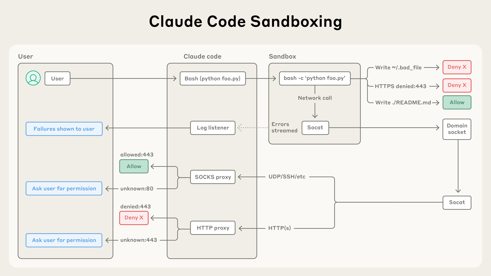
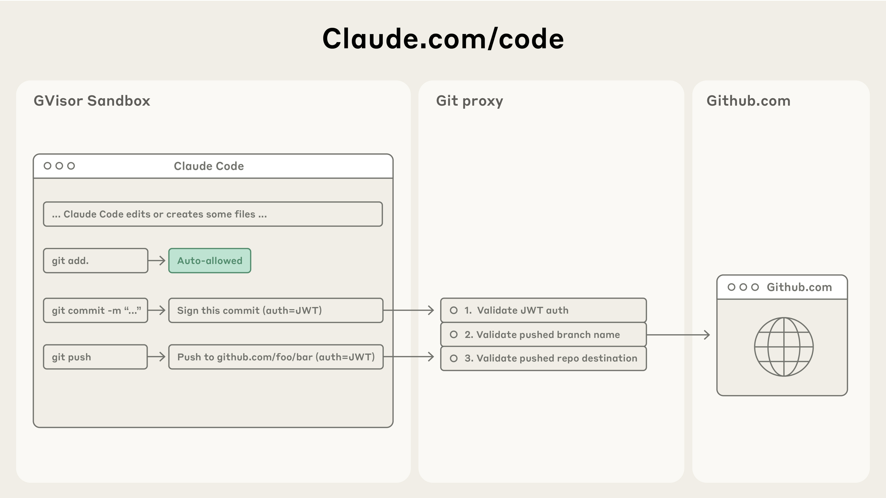

# 通过沙箱机制让 Claude Code 更安全、更自主

### **保障 Claude Code 用户的安全**

Claude Code 采用基于权限的模型：默认情况下它是只读的，这意味着在进行修改或运行任何命令之前，它都需要请求许可。也有一些例外：我们会自动放行像 echo 或 cat 这样的安全命令，但大多数操作仍然需要明确批准。

频繁点击"批准"会拖慢开发周期，还可能导致"批准疲劳"——用户可能不再仔细审查自己批准的操作，反而降低了开发的安全性。

为了解决这个问题，我们为 Claude Code 推出了沙箱机制。

## **沙箱：更安全、更自主的方式**

沙箱机制为 Claude 预先划定了工作边界，使其可以在边界内更自由地工作，而不必为每个操作都请求许可。启用沙箱后，你会看到权限提示大幅减少，同时安全性显著提升。

我们的沙箱方案建立在操作系统级别的特性之上，提供两层隔离边界：

1.   **文件系统隔离**，确保 Claude 只能访问或修改特定目录。这对于防止被提示词注入的 Claude 修改敏感系统文件尤为重要。
2.   **网络隔离**，确保 Claude 只能连接到已获批准的服务器。这可以防止被提示词注入的 Claude 泄露敏感信息或下载恶意软件。

值得注意的是，有效的沙箱需要文件系统隔离和网络隔离**两者兼备**。没有网络隔离，被攻陷的代理可能会窃取 SSH 密钥等敏感文件；没有文件系统隔离，被攻陷的代理可以轻松逃逸沙箱并获得网络访问权限。只有同时使用这两种技术，我们才能为 Claude Code 用户提供更安全、更快速的代理体验。

### Claude Code 中的两项沙箱新功能

#### **沙箱化的 bash 工具：无需权限提示即可安全执行 bash 命令**

我们推出了[全新的沙箱运行时](https://docs.claude.com/en/docs/claude-code/sandboxing)，目前以 Beta 版研究预览的形式提供。它可以让你精确定义代理可以访问哪些目录和网络主机，而无需启动和管理容器的开销。它可用于对任意进程、代理和 MCP 服务器进行沙箱化。该运行时也以[开源研究预览](https://github.com/anthropic-experimental/sandbox-runtime)的形式发布。

在 Claude Code 中，我们使用该运行时对 bash 工具进行沙箱化，使 Claude 能够在你设定的边界内运行命令。在安全的沙箱内，Claude 可以更自主地运行，安全地执行命令而无需权限提示。如果 Claude 尝试访问沙箱**之外**的资源，你会立即收到通知，并可以选择是否允许。

我们基于 [Linux bubblewrap](https://github.com/containers/bubblewrap) 和 MacOS seatbelt 等操作系统级原语构建了此功能，在操作系统层面强制执行这些限制。它们不仅覆盖 Claude Code 的直接交互，还包括由命令启动的任何脚本、程序或子进程。如前所述，该沙箱同时强制执行：

1.   **文件系统隔离**，允许对当前工作目录进行读写访问，但阻止修改其外部的任何文件。
2.   **网络隔离**，仅允许通过连接到沙箱外部代理服务器的 Unix 域套接字进行互联网访问。该代理服务器对进程可以连接的域名执行限制，并处理用户新请求域名的确认。如果你需要更高的安全性，我们还支持自定义该代理，以对出站流量执行任意规则。

这两个组件都是可配置的：你可以轻松选择允许或禁止特定的文件路径或域名。

Claude Code 的沙箱架构通过文件系统和网络控制来隔离代码执行，自动放行安全操作、阻止恶意操作，仅在必要时请求用户许可。

沙箱机制确保即使提示词注入成功，其影响也被完全隔离，不会危及用户的整体安全。这样一来，被攻陷的 Claude Code 无法窃取你的 SSH 密钥，也无法向攻击者的服务器回传数据。

要开始使用此功能，请在 Claude Code 中运行 /sandbox，并查看关于我们安全模型的[更多技术细节](https://docs.claude.com/en/docs/claude-code/sandboxing)。

为了方便其他团队构建更安全的代理，我们已将此功能[开源](https://github.com/anthropic-experimental/sandbox-runtime)。我们相信其他团队也应考虑为自己的代理采用这项技术，以提升其安全性。

#### **网页版 Claude Code：在云端安全运行 Claude Code**

今天，我们还发布了[网页版 Claude Code](https://docs.claude.com/en/docs/claude-code/claude-code-on-the-web)，使用户能够在云端隔离的沙箱中运行 Claude Code。网页版 Claude Code 会在隔离沙箱中执行每个会话，并以安全可靠的方式让 Claude Code 完全访问其运行所在的服务器。我们设计此沙箱时确保敏感凭证（如 git 凭证或签名密钥）绝不会与 Claude Code 一同置于沙箱内。这样一来，即使沙箱中运行的代码被攻陷，用户也不会受到进一步的危害。

网页版 Claude Code 使用自定义代理服务，透明地处理所有 git 交互。在沙箱内部，git 客户端使用专门构建的受限作用域凭证向该服务进行认证。代理服务验证此凭证和 git 交互的内容（例如确保仅推送到配置的分支），然后附加正确的认证令牌，再将请求发送到 GitHub。

Claude Code 的 Git 集成通过安全代理路由命令，验证认证令牌、分支名称和仓库目标——在实现安全版本控制工作流的同时防止未授权的推送。

## 入门指南

我们全新的沙箱化 bash 工具和网页版 Claude Code 为使用 Claude 进行工程开发的用户在安全性和生产力方面带来了显著提升。

要开始使用这些工具：

1.   在 Claude 中运行 `/sandbox`，并查看[我们的文档](https://docs.claude.com/en/docs/claude-code/sandboxing)了解如何配置该沙箱。
2.   前往 [claude.com/code](http://claude.ai/redirect/website.v1.620584d7-992b-4215-8d57-c4df52848a3e/code) 体验网页版 Claude Code。

或者，如果你正在构建自己的代理，可以查看我们[开源的沙箱代码](https://github.com/anthropic-experimental/sandbox-runtime)，并考虑将其集成到你的项目中。我们期待看到你构建的作品。

要了解更多关于网页版 Claude Code 的信息，请查看我们的[发布博文](https://www.anthropic.com/news/claude-code-on-the-web)。

## 致谢

本文由 David Dworken 和 Oliver Weller-Davies 撰写，Meaghan Choi、Catherine Wu、Molly Vorwerck、Alex Isken、Kier Bradwell 和 Kevin Garcia 亦有贡献。
