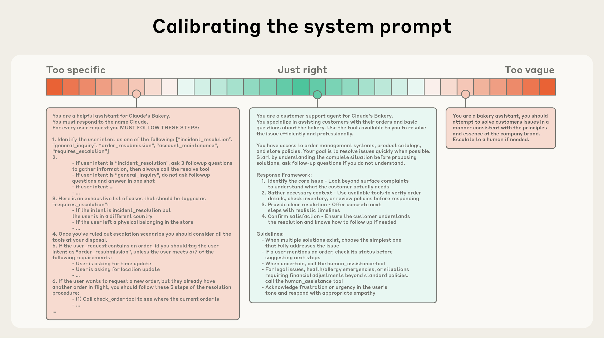

# AI 代理的高效上下文工程

## 为什么上下文工程对构建能力强大的代理至关重要

尽管 LLM 的速度不断提升，处理数据的能力越来越强，但我们观察到 LLM 和人类一样，在某个节点也会出现注意力涣散或混乱的情况。针对"大海捞针"式基准测试的研究揭示了[上下文腐烂](https://research.trychroma.com/context-rot)这一概念：随着上下文窗口中的 token 数量增加，模型从该上下文中准确召回信息的能力随之下降。

虽然某些模型的性能退化比其他模型更为平缓，但这一特征在所有模型中都普遍存在。因此，上下文必须被视为一种边际收益递减的有限资源。与人类拥有[有限的工作记忆容量](https://journals.sagepub.com/doi/abs/10.1177/0963721409359277)类似，LLM 在解析大量上下文时也会消耗一个"注意力预算"。每引入一个新 token，都会在一定程度上消耗这个预算，这也使得精心筛选提供给 LLM 的 token 变得尤为重要。

这种注意力稀缺性源于 LLM 的架构约束。LLM 基于 [transformer 架构](https://arxiv.org/abs/1706.03762)，该架构允许每个 token [关注所有其他 token](https://huggingface.co/blog/Esmail-AGumaan/attention-is-all-you-need)（贯穿整个上下文）。这意味着 n 个 token 之间会产生 n² 的成对关系。

随着上下文长度增加，模型捕获这些成对关系的能力被逐渐稀释，上下文大小与注意力聚焦之间形成了天然矛盾。此外，模型的注意力模式源自训练数据的分布，其中短序列通常比长序列更为常见。这意味着模型对全局上下文依赖关系的经验较少，用于处理此类依赖的专用参数也更少。

[位置编码插值](https://arxiv.org/pdf/2306.15595)等技术通过将模型适配到最初训练时使用的较小上下文来处理更长序列，但会在一定程度上降低对 token 位置的理解。这些因素形成的是一个性能梯度，而非断崖式的性能下降：模型在更长上下文下依然保持较高能力，但在信息检索和长程推理方面的精度可能不如在短上下文下的表现。

这些现实因素意味着，精心进行上下文工程对于构建能力强大的代理至关重要。

## 高效上下文的构成要素

鉴于 LLM 受限于有限的注意力预算，_好的_ 上下文工程意味着找到 _尽可能小的_ 高信号 token 集合，以最大化达成预期结果的概率。实施这一原则说起来容易做起来难，但在下面的章节中，我们将概述这一指导原则在上下文各组件中的具体实践。

**系统提示词** 应当极其清晰，使用简单直接的语言，以 _合适的抽象层级_ 向代理传达信息。合适的抽象层级是介于两种常见失败模式之间的"恰到好处"区域。一端是工程师在提示词中硬编码复杂、脆弱的逻辑，试图诱导出精确的代理行为。这种方式会增加脆弱性，并随时间推移加大维护难度。另一端是工程师有时提供模糊、笼统的指导，未能给 LLM 提供关于期望输出的具体信号，或错误地假设了共享上下文。最优的抽象层级需要取得平衡：既要足够具体以有效引导行为，又要足够灵活，为模型提供强有力的启发式规则来指导其行动。

_在一端，我们看到脆弱的 if-else 硬编码提示词；在另一端，则是过于笼统或错误假设共享上下文的提示词。_

我们建议将提示词组织为不同的部分（如 `<background_information>`、`<instructions>`、`## Tool guidance`、`## Output description` 等），并使用 XML 标签或 Markdown 标题来区分这些部分，尽管随着模型能力增强，提示词的具体格式可能变得不那么重要。

无论你如何组织系统提示词，都应追求能完整描述期望行为的最小信息集合。（注意，最小并不一定意味着简短；你仍需预先为代理提供充足信息，以确保其遵循期望行为。）最佳做法是先用一个最精简的提示词配合最好的模型进行测试，观察其在任务上的表现，然后根据初步测试中发现的失败模式，逐步添加清晰的指令和示例来改善性能。

**工具** 使代理能够与环境交互，并在工作过程中获取新的额外上下文。由于工具定义了代理与其信息/操作空间之间的契约，工具必须在两方面促进效率：返回信息时要节省 token，同时鼓励高效的代理行为。

在 [Writing tools for AI agents – with AI agents](https://www.anthropic.com/engineering/writing-tools-for-agents) 一文中，我们讨论了构建 LLM 易于理解且功能重叠最少的工具。与设计良好的代码库中的函数类似，工具应当是自包含的、容错的，且在使用意图上极其清晰。输入参数同样应当具有描述性、明确无歧义，并发挥模型的固有优势。

我们最常见的失败模式之一是臃肿的工具集，覆盖过多功能或导致在选择使用哪个工具时产生歧义。如果人类工程师都无法明确判断在特定场景下该用哪个工具，就不能指望 AI 代理做得更好。正如我们后面将讨论的，为代理精选一个最小可用的工具集，还能在长期交互中更可靠地维护和修剪上下文。

提供示例（即 few-shot 提示）是一项广为人知的最佳实践，我们继续强烈推荐。然而，很多团队会在提示词中塞入一堆边缘用例，试图阐明 LLM 在特定任务中应遵循的每一条规则。我们不推荐这种做法。相反，我们建议精心挑选一组多样化、具有代表性的示例，有效展现代理的期望行为。对 LLM 来说，示例就是"价值千言"的"图画"。

我们在上下文各组件（系统提示词、工具、示例、消息历史等）上的总体指导是：用心设计，让上下文既有信息量又保持精炼。现在让我们深入探讨运行时动态检索上下文。

## 上下文检索与代理式搜索

在 [Building effective AI agents](https://www.anthropic.com/research/building-effective-agents) 一文中，我们阐述了基于 LLM 的工作流与代理之间的区别。自那篇文章以来，我们逐渐认同了对代理的一个[简洁定义](https://simonwillison.net/2025/Sep/18/agents/)：LLM 在循环中自主使用工具。

在与客户的合作中，我们看到业界正在向这一简洁范式汇聚。随着底层模型能力增强，代理的自主性可以相应提升：更智能的模型使代理能够独立应对复杂的问题空间，并从错误中恢复。

我们正看到工程师在设计代理上下文方面的思维转变。如今，许多 AI 原生应用采用某种形式的基于嵌入的推理前检索，以获取供代理推理的重要上下文。随着该领域向更具代理性的方法过渡，我们越来越多地看到团队用"即时"上下文策略来增强这些检索系统。

采用"即时"方法构建的代理不再预先处理所有相关数据，而是维护轻量级的标识符（文件路径、存储的查询、网页链接等），并在运行时通过工具使用这些引用动态加载数据到上下文中。Anthropic 的代理式编码解决方案 [Claude Code](https://www.anthropic.com/claude-code) 使用这种方法对大型数据库执行复杂的数据分析。模型可以编写针对性查询、存储结果，并利用 head 和 tail 等 Bash 命令分析大量数据，而无需将完整数据对象加载到上下文中。这种方法映射了人类认知：我们通常不会记住完整的信息库，而是引入文件系统、收件箱和书签等外部组织和索引系统，按需检索相关信息。

除了存储效率之外，这些引用的元数据还提供了一种高效调整行为的机制——无论是显式提供还是隐式感知的。对于在文件系统中操作的代理来说，`tests` 文件夹中名为 `test_utils.py` 的文件所暗示的用途，与位于 `src/core_logic/` 中同名文件不同。文件夹层级、命名约定和时间戳都提供了重要信号，帮助人类和代理理解如何以及何时利用信息。

让代理自主导航和检索数据还支持渐进式披露——换言之，允许代理通过探索逐步发现相关上下文。每次交互产生的上下文都会为下一次决策提供依据：文件大小暗示复杂度；命名约定提示用途；时间戳可以作为相关性的参考指标。代理可以层层递进地构建理解，仅在工作记忆中保留必要内容，并利用笔记策略实现额外的持久化。这种自主管理的上下文窗口使代理聚焦于相关子集，而非淹没在详尽但可能无关的信息中。

当然，这需要权衡：运行时探索比检索预计算数据更慢。不仅如此，还需要有明确设计理念且深思熟虑的工程设计，以确保 LLM 拥有合适的工具和启发式规则来有效导航其信息环境。缺乏适当引导，代理可能通过误用工具、追踪死胡同或未能识别关键信息而浪费上下文。

在某些场景下，最有效的代理可能采用混合策略：预先检索部分数据以保证速度，并根据自主判断进行进一步的探索。"合适"自主权水平的决策边界取决于具体任务。Claude Code 就是一个采用混合模式的代理：[CLAUDE.md](http://claude.md/) 文件会在开始时简单地加载到上下文中，而 glob 和 grep 等原语则允许它导航环境并即时检索文件，有效绕过了索引过时和复杂语法树的问题。

混合策略可能更适合内容动态性较低的上下文，例如法律或金融领域的工作。随着模型能力的提升，代理设计将趋向于让智能模型智能地行动，逐步减少人工干预。鉴于该领域进展迅速，"做最简单有效的事情"可能仍然是我们对基于 Claude 构建代理的团队的最佳建议。

### 长周期任务的上下文工程

长周期任务要求代理在 token 数量超过 LLM 上下文窗口的操作序列中，保持连贯性、上下文和目标导向行为。对于跨越数十分钟到数小时持续工作的任务（如大型代码库迁移或综合性研究项目），代理需要专门的技术来应对上下文窗口大小的限制。

等待更大的上下文窗口看似是显而易见的策略。但在可预见的未来，所有大小的上下文窗口都可能面临上下文污染和信息相关性问题——至少在追求最强代理性能的场景下如此。为了使代理能够在延长的周期内高效工作，我们开发了几种直接应对上下文污染约束的技术：压缩、结构化笔记和多代理架构。

**压缩**

压缩是将一个接近上下文窗口限制的对话进行摘要，然后用摘要重新初始化一个新的上下文窗口。压缩通常作为上下文工程中提升长期连贯性的第一个手段。压缩的核心是以高保真方式提炼上下文窗口的内容，使代理能够以最小的性能退化继续工作。

以 Claude Code 为例，我们通过将消息历史传递给模型来摘要和压缩最关键的细节来实现这一点。模型保留架构决策、未解决的 bug 和实现细节，同时丢弃冗余的工具输出或消息。然后代理可以使用这个压缩后的上下文加上最近访问过的五个文件继续工作。用户获得了连续性体验，无需担心上下文窗口的限制。

压缩的技巧在于选择保留什么与丢弃什么——过于激进的压缩可能导致丢失那些重要性只有在后期才显现的微妙但关键的上下文。对于实现压缩系统的工程师，我们建议在复杂的代理轨迹上仔细调优提示词。首先最大化召回率，确保压缩提示词捕获轨迹中的每一条相关信息，然后通过消除多余内容来迭代提升精确度。

一个容易处理的冗余内容示例是清除工具调用和结果——一旦工具调用已经位于消息历史的深处，代理为什么还需要再次看到原始结果？最安全、最轻量的压缩形式之一是工具结果清除，最近已作为 [Claude Developer Platform 上的一项功能](https://www.anthropic.com/news/context-management)发布。

**结构化笔记**

结构化笔记，或称代理式记忆，是一种让代理定期将笔记持久化到上下文窗口之外的记忆中的技术。这些笔记会在稍后被重新拉入上下文窗口。

这种策略以最小的开销提供持久记忆。就像 Claude Code 创建待办列表，或你的自定义代理维护一个 `NOTES.md` 文件一样，这种简单的模式使代理能够跟踪复杂任务的进度，维护关键的上下文和依赖关系，这些信息否则会在数十次工具调用过程中丢失。

[Claude 玩宝可梦](https://www.twitch.tv/claudeplayspokemon) 展示了记忆如何在非编码领域变革代理能力。该代理在数千个游戏步骤中维护精确的计数——跟踪诸如"在过去的 1,234 步中，我一直在 Route 1 训练宝可梦，Pikachu 已经向 10 级的目标提升了 8 级"之类的目标。在没有任何关于记忆结构的提示下，它开发了已探索区域的地图，记住了已解锁的关键成就，并维护了战斗策略的笔记，帮助它学习哪种攻击对不同对手最有效。

在上下文重置后，代理会阅读自己的笔记并继续数小时的训练序列或地牢探索。这种跨越摘要步骤的连贯性使得长周期策略成为可能，而仅靠 LLM 上下文窗口保留所有信息是无法实现的。

作为 [Sonnet 4.5 发布](https://www.anthropic.com/effective-context-engineering-for-ai-agents)的一部分，我们在 Claude Developer Platform 上公开发布了[一款记忆工具](http://anthropic.com/news/context-management)的测试版，使得通过文件系统在上下文窗口之外存储和查阅信息变得更加容易。这使代理能够随时间积累知识库，跨会话维护项目状态，并引用先前的工作，而无需将所有内容保留在上下文中。

**子代理架构**

子代理架构提供了另一种绕过上下文限制的方式。与其让一个代理尝试在整个项目中维护状态，不如由专门的子代理使用干净的上下文窗口处理聚焦的任务。主代理用高层计划进行协调，而子代理执行深层技术工作或使用工具查找相关信息。每个子代理可能会进行大量探索，使用数万或更多 token，但只返回其工作的压缩摘要（通常 1,000-2,000 个 token）。

这种方法实现了清晰的关注点分离——详细的搜索上下文被隔离在子代理内部，而主代理专注于综合分析结果。这一模式在 [How we built our multi-agent research system](https://www.anthropic.com/engineering/multi-agent-research-system) 中有过讨论，在复杂研究任务上相较单代理系统展现了显著改进。

在这些方法之间做出选择取决于任务特征。例如：

* 压缩适用于需要大量来回交互、要求保持对话连贯性的任务；
* 结构化笔记适用于具有明确里程碑的迭代开发；
* 多代理架构适用于复杂的研究和分析，其中并行探索能带来显著收益。

即使模型持续改进，在扩展交互中保持连贯性的挑战仍将是构建更有效代理的核心议题。

## 结论

上下文工程代表了我们构建 LLM 应用方式的根本性转变。随着模型变得更加强大，挑战不再仅仅是编写完美的提示词——而是要在每一步精心筛选进入模型有限注意力预算的信息。无论你是在为长周期任务实现压缩、设计节省 token 的工具，还是让代理即时探索其环境，指导原则始终不变：找到最大化达成预期结果概率的最小高信号 token 集合。

我们概述的技术将随着模型的改进而持续演进。我们已经看到更智能的模型需要更少的强制性工程，允许代理以更高的自主性运行。但即使能力不断扩展，将上下文视为珍贵的有限资源，仍将是构建可靠、有效代理的核心。

立即在 Claude Developer Platform 上开始上下文工程实践，并通过我们的[记忆与上下文管理](https://platform.claude.com/cookbook/tool-use-memory-cookbook) cookbook 获取有用的技巧和最佳实践。

## 致谢

本文由 Anthropic 应用 AI 团队撰写：Prithvi Rajasekaran、Ethan Dixon、Carly Ryan 和 Jeremy Hadfield，团队成员 Rafi Ayub、Hannah Moran、Cal Rueb 和 Connor Jennings 亦有贡献。特别感谢 Molly Vorwerck、Stuart Ritchie 和 Maggie Vo 的支持。
