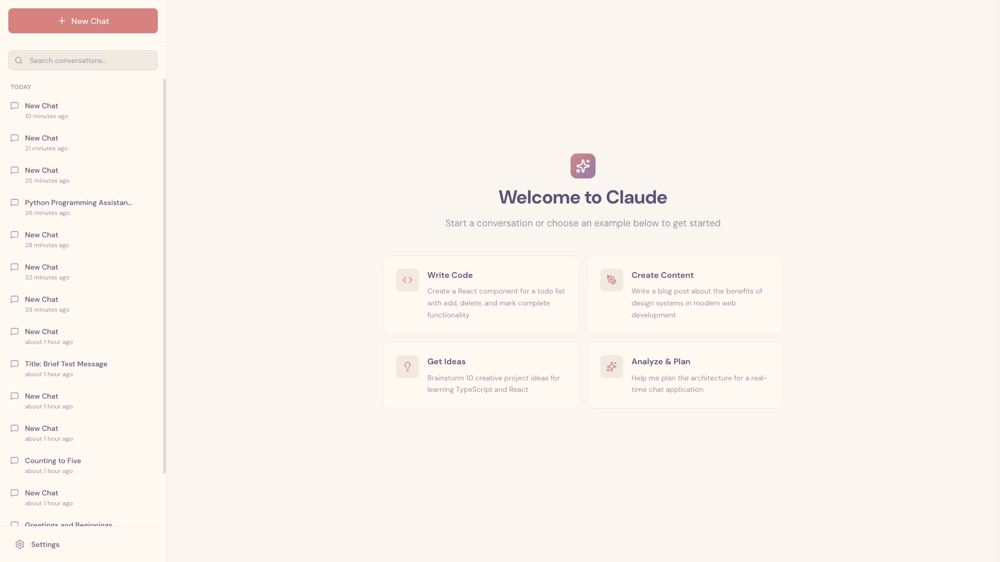

# 长时间运行代理的有效 harness

## 长时间运行代理的问题

Claude Agent SDK 是一个功能强大的通用代理 harness，擅长编码以及需要模型使用工具来收集上下文、规划和执行的其他任务。它具有上下文管理能力（如压缩），使代理能够在不耗尽上下文窗口的情况下持续工作。从理论上讲，基于这种架构，代理应该可以在任意长的时间内持续完成有价值的工作。

然而，仅靠压缩是不够的。即使像 Opus 4.5 这样的前沿编码模型，在 Claude Agent SDK 上跨多个上下文窗口循环运行，如果只给出一个高层提示词（例如"构建一个 [claude.ai](http://claude.ai/redirect/website.v1.a9f96f47-56bb-49e9-a1fd-f56c0c749d1f) 的克隆"），也难以构建出生产级质量的 Web 应用。

Claude 的失败主要表现为两种模式。第一种是代理倾向于一次性做太多事情——本质上就是试图一步到位地构建整个应用。这通常导致模型在实现过程中耗尽上下文，留给下一个会话的是一个功能实现到一半且没有任何文档记录的项目。随后代理不得不猜测之前发生了什么，并花费大量时间尝试让应用恢复基本可用的状态。即使有压缩机制也会出现这种情况，因为压缩并不总是能向下一个代理传递足够清晰的指令。

第二种失败模式通常出现在项目后期。当一些功能已经构建完成后，后续的代理实例会查看当前状态，发现已经取得了一些进展，然后直接宣布任务完成。

由此，这个问题可以分解为两个部分。首先，我们需要搭建一个初始环境，为给定提示词所需的_所有_功能奠定基础，从而引导代理按步骤、按功能逐个推进。其次，我们应该让每个代理在向目标逐步推进的同时，在会话结束时将环境保持在干净的状态。所谓"干净状态"，指的是那种适合合并到主分支的代码状态：没有重大 bug，代码整洁且文档完善，总体来说，开发者可以轻松地开始开发新功能，而不需要先清理无关的遗留问题。

在内部实验中，我们采用了一个两部分的解决方案：

1.   初始化代理：第一个代理会话使用专门的提示词，要求模型搭建初始环境：一个 `init.sh` 脚本、一个用于记录代理工作日志的 claude-progress.txt 文件，以及一个显示添加了哪些文件的初始 git 提交。
2.   编码代理：后续的每个会话都要求模型逐步推进，并留下结构化的更新记录。1

这里的关键洞察是找到一种方法，让代理在以全新的上下文窗口启动时能快速理解工作状态——这通过 claude-progress.txt 文件配合 git 历史来实现。这些实践的灵感来源于观察优秀软件工程师日常工作中的做法。

## 环境管理

在更新的 [Claude 4 提示词指南](https://docs.claude.com/en/docs/build-with-claude/prompt-engineering/claude-4-best-practices#multi-context-window-workflows)中，我们分享了多上下文窗口工作流的一些最佳实践，包括一种"在第一个上下文窗口使用不同提示词"的 harness 结构。这个"不同的提示词"要求初始化代理搭建环境，提供后续编码代理高效工作所需的所有必要上下文。下面我们深入探讨这种环境的几个关键组成部分。

### 功能列表

为了解决代理试图一步到位构建应用或过早认为项目已完成的问题，我们让初始化代理根据用户的初始提示词编写一份详尽的功能需求文件。以 [claude.ai](http://claude.ai/redirect/website.v1.a9f96f47-56bb-49e9-a1fd-f56c0c749d1f) 克隆为例，这意味着超过 200 项功能，例如"用户可以打开新对话，输入查询，按回车键，然后看到 AI 的回复"。这些功能最初都标记为"未通过"，这样后续编码代理就能清楚地了解完整的功能全貌。

```
{
    "category": "functional",
    "description": "New chat button creates a fresh conversation",
    "steps": [
      "Navigate to main interface",
      "Click the 'New Chat' button",
      "Verify a new conversation is created",
      "Check that chat area shows welcome state",
      "Verify conversation appears in sidebar"
    ],
    "passes": false
  }
```

我们要求编码代理只能通过修改 passes 字段的状态来编辑这个文件，并使用措辞强硬的指令，如"删除或编辑测试是不可接受的，因为这可能导致功能缺失或出现 bug。"经过一些实验，我们最终选择使用 JSON 格式，因为与 Markdown 文件相比，模型更不容易不当修改或覆盖 JSON 文件。

### 渐进式推进

有了上述初始环境搭建后，编码代理的下一步迭代被要求一次只处理一个功能。这种渐进式方法对于解决代理倾向于一次性做太多事的问题至关重要。

在采用渐进式工作方式后，同样重要的是模型在代码修改后要让环境保持干净状态。在实验中，我们发现引导这种行为最好的方式是让模型使用描述性的提交信息将进度提交到 git，并在进度文件中写入工作总结。这使模型能够利用 git 回退不良的代码变更，恢复代码库的工作状态。

这些方法还提高了效率，因为代理不再需要猜测之前发生了什么并花时间让应用恢复基本可用状态。

### 测试

我们观察到的最后一个主要失败模式是 Claude 倾向于在没有经过适当测试的情况下就标记功能为已完成。在没有明确提示的情况下，Claude 倾向于做代码修改，甚至用单元测试或对开发服务器执行 `curl` 命令来测试，但无法识别出该功能在端到端层面并不工作。

在构建 Web 应用的场景中，一旦明确要求 Claude 使用浏览器自动化工具并以人类用户的方式进行所有测试，Claude 在端到端验证功能方面表现就很好。



Claude 通过 Puppeteer MCP 服务器在测试 claude.ai 克隆时截取的屏幕截图。

为 Claude 提供这类测试工具显著提升了性能，因为代理能够发现和修复仅从代码层面不易察觉的 bug。

但仍存在一些问题，例如 Claude 的视觉能力限制以及浏览器自动化工具的局限性，使得难以识别所有类型的 bug。例如，Claude 无法通过 Puppeteer MCP 看到浏览器原生的弹窗模态框，因此依赖这些模态框的功能往往存在更多 bug。

## 快速进入状态

有了上述所有准备，每个编码代理都会被提示执行一系列步骤来了解当前状况，其中一些步骤虽然基础但很有帮助：

1.   _运行 `pwd` 查看当前工作目录。你只能编辑该目录中的文件。_
2.   _阅读 git 日志和进度文件，了解最近的工作内容。_
3.   _阅读功能列表文件，选择优先级最高的未完成功能进行开发。_

这种方法在每个会话中为 Claude 节省了一些 token，因为它不需要自己去摸索如何测试代码。让初始化代理编写一个可以启动开发服务器的 init.sh 脚本也很有帮助，然后在实现新功能之前运行一次基本的端到端测试。

在 claude.ai 克隆的例子中，这意味着代理总是先启动本地开发服务器，然后使用 Puppeteer MCP 开始新对话、发送消息并接收回复。这确保了 Claude 能够快速识别应用是否处于损坏状态，并立即修复现有 bug。如果代理直接开始实现新功能，很可能会使问题变得更糟。

综合以上内容，一个典型的会话以以下助手消息开始：

```
[Assistant] I'll start by getting my bearings and understanding the current state of the project.
[Tool Use] <bash - pwd>
[Tool Use] <read - claude-progress.txt>
[Tool Use] <read - feature_list.json>
[Assistant] Let me check the git log to see recent work.
[Tool Use] <bash - git log --oneline -20>
[Assistant] Now let me check if there's an init.sh script to restart the servers.
<Starts the development server>
[Assistant] Excellent! Now let me navigate to the application and verify that some fundamental features are still working.
<Tests basic functionality>
[Assistant] Based on my verification testing, I can see that the fundamental functionality is working well. The core chat features, theme switching, conversation loading, and error handling are all functioning correctly. Now let me review the tests.json file more comprehensively to understand what needs to be implemented next.
<Starts work on a new feature>
```

代理失败模式与解决方案

| **问题** | **初始化代理行为** | **编码代理行为** |
| --- | --- | --- |
| Claude 过早宣布整个项目完成。 | 搭建功能列表文件：根据输入规格，创建一个包含端到端功能描述列表的结构化 JSON 文件。 | 在会话开始时阅读功能列表文件。选择单个功能开始工作。 |
| Claude 将环境留在一个有 bug 或未记录进度 的状态。 | 编写初始 git 仓库和进度记录文件。 | 会话开始时阅读进度记录文件和 git 提交日志，并在开发服务器上运行基本测试以发现未记录的 bug。会话结束时写入 git 提交和进度更新。 |
| Claude 过早标记功能为已完成。 | 搭建功能列表文件。 | 自行验证所有功能。仅在仔细测试后将功能标记为"通过"。 |
| Claude 需要花时间弄清如何运行应用。 | 编写一个可以启动开发服务器的 `init.sh` 脚本。 | 会话开始时阅读 `init.sh`。 |

总结了长时间运行 AI 代理中四种常见失败模式及解决方案。

## 未来工作

这项研究展示了一组在长时间运行代理 harness 中可行的解决方案，使模型能够在多个上下文窗口中实现渐进式推进。然而，仍然存在一些开放性问题。

最值得注意的是，目前尚不清楚单个通用编码代理在跨多个上下文窗口时是否表现最佳，还是通过多代理架构能实现更好的性能。合理的推测是，专门的代理（如测试代理、质量保证代理或代码清理代理）在软件开发生命周期的各个子任务上可能做得更好。

此外，这个演示是针对全栈 Web 应用开发优化的。未来的方向是将这些发现推广到其他领域。这些经验中的部分或全部很可能适用于其他类型的长时间运行代理任务，例如科学研究或金融建模。

### 致谢

本文由 Justin Young 撰写。特别感谢 David Hershey、Prithvi Rajasakeran、Jeremy Hadfield、Naia Bouscal、Michael Tingley、Jesse Mu、Jake Eaton、Marius Buleandara、Maggie Vo、Pedram Navid、Nadine Yasser 和 Alex Notov 的贡献。

这项工作反映了 Anthropic 多个团队的集体努力，正是他们使 Claude 能够安全地进行长时间跨度的自主软件工程开发，特别是代码 RL 团队和 Claude Code 团队。有兴趣的贡献者欢迎在 [anthropic.com/careers](http://anthropic.com/careers) 申请。

### 脚注

1. 在本文语境中，我们将它们称为不同的代理，仅仅是因为它们有不同的初始用户提示词。系统提示词、工具集和整体代理 harness 在其他方面是完全相同的。
