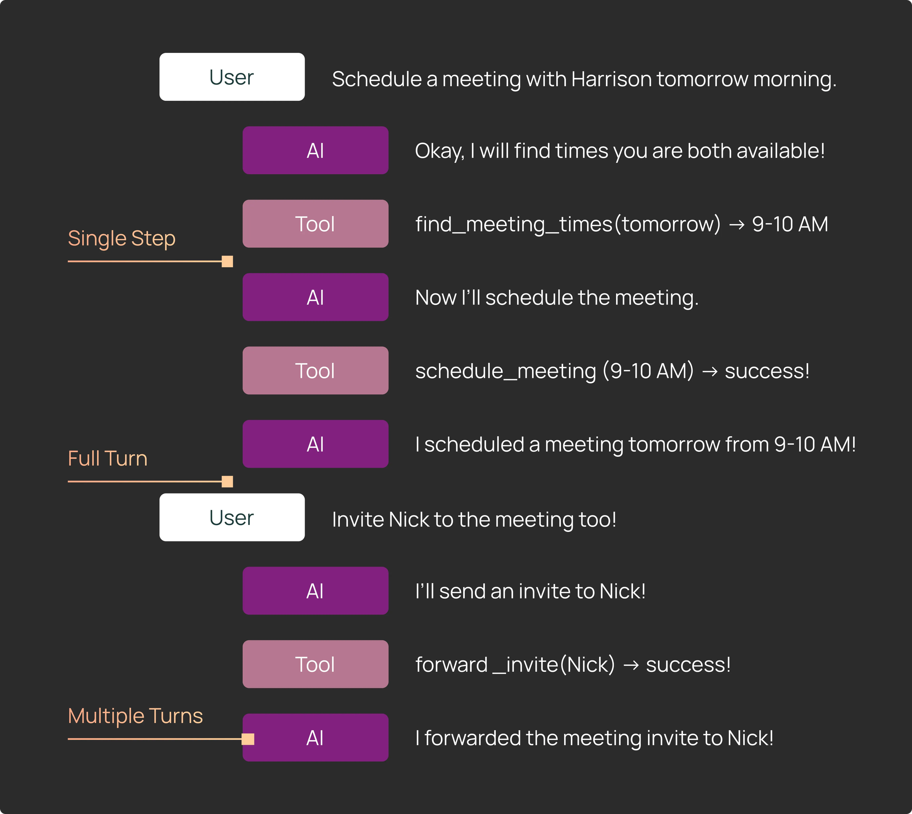
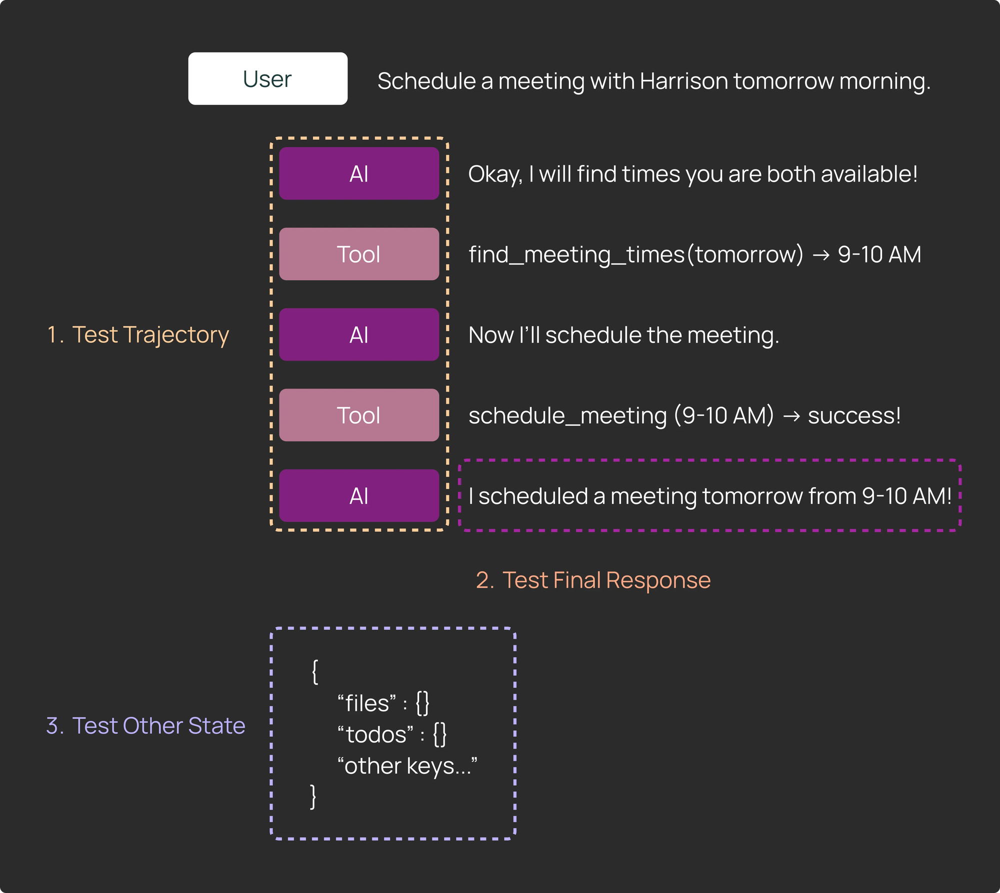
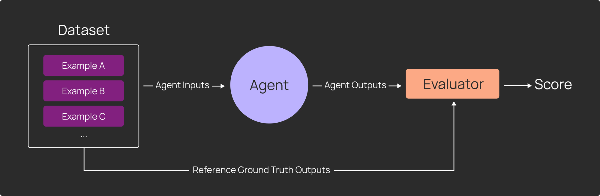
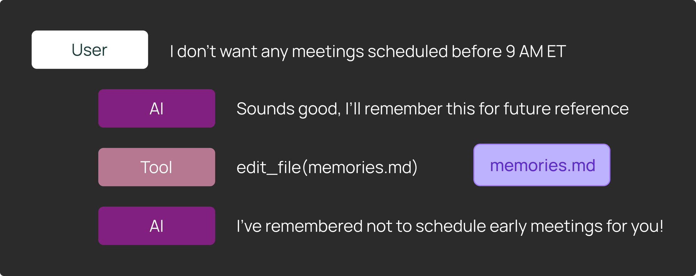
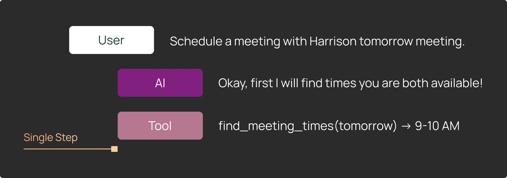
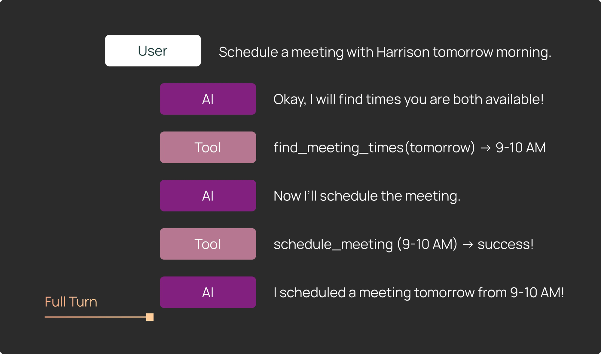
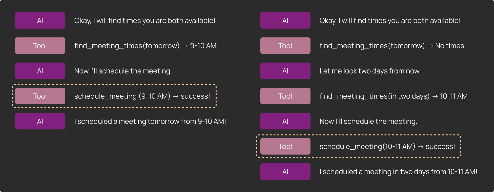
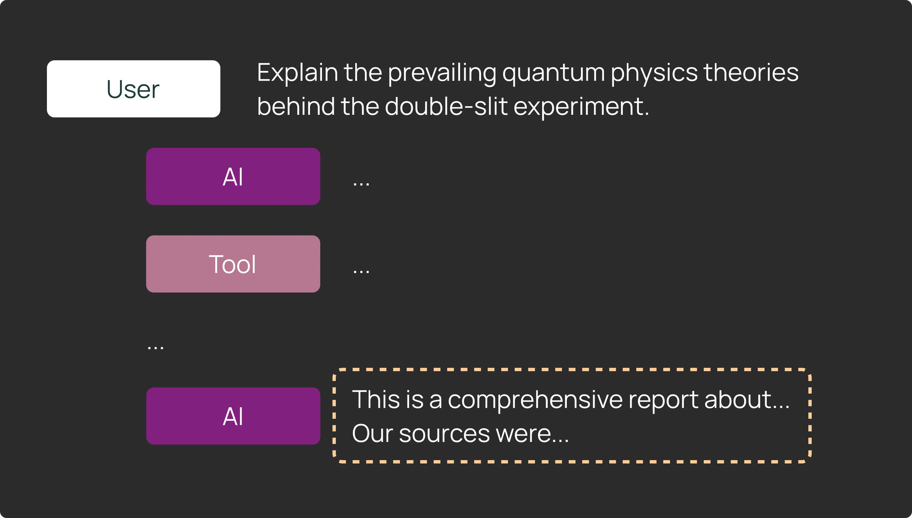
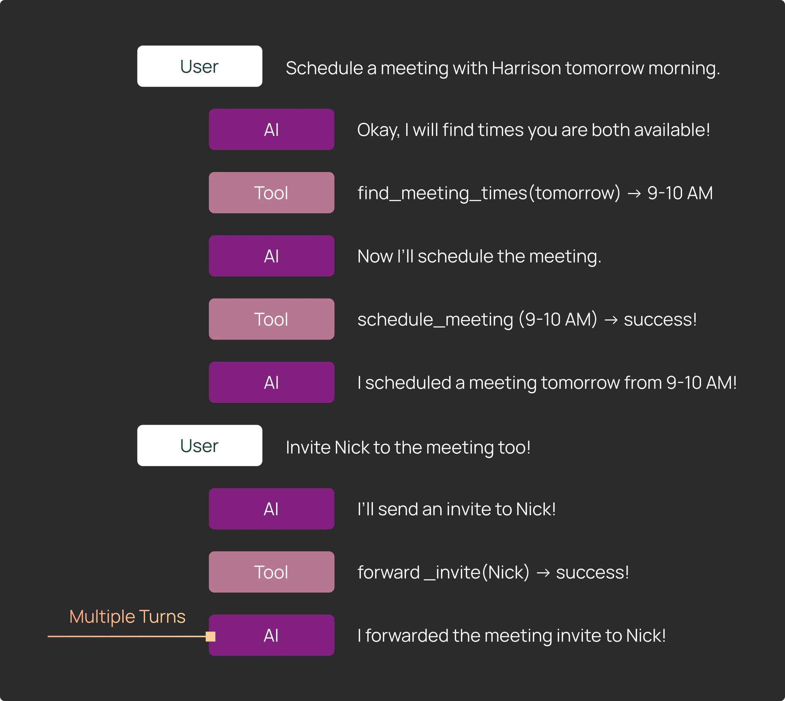

# 评估 Deep Agent：我们的经验总结

### **术语表**

在深入讨论之前，我们先定义本文中使用的一些术语。

**Agent 的运行方式：**

*   **单步：** 将核心 agent 循环限制为只运行一轮，确定 agent 将采取的下一步操作。
*   **完整轮次：** 在单个输入上完整运行 agent，其中可以包含多次工具调用迭代。
*   **多轮：** 完整地多次运行 agent。通常用于模拟 agent 与用户之间的"多轮"对话，包含多次来回交互。


**可测试的内容：**

*   **轨迹：** agent 调用的工具序列，以及 agent 生成的具体工具参数。
*   **最终响应：** agent 返回给用户的最终响应。
*   **其他状态：** agent 运行过程中生成的其他值（例如文件、其他制品）


## #1：Deep Agent 需要为每个数据点编写更具针对性的测试逻辑（代码）

传统的 LLM 评估流程很简单：

1）构建示例数据集

2）编写评估器

3）在数据集上运行应用以生成输出，并用评估器对这些输出进行评分

每个数据点都采用相同的处理方式——通过相同的应用逻辑运行，由相同的评估器评分。


Deep Agent 打破了这一假设。你需要测试的不仅是最终消息。"成功标准"也可能因数据点而异，并且可能涉及对 agent 轨迹和状态的具体断言。

看这个例子：


我们有一个能够记住用户偏好的日历调度 deep agent。用户要求 agent "记住永远不要在早上 9 点前安排会议"。我们希望验证日历调度 agent 是否在文件系统中更新了自己的记忆，以记住这条信息。

为了测试这一点，我们可能需要编写断言来验证：

1）agent 对 [_memories.md_](http://memories.md/?ref=blog.langchain.com) 文件路径调用了 `edit_file`

2）agent 在最终消息中向用户传达了记忆更新的信息

3）[_memories.md_](http://memories.md/?ref=blog.langchain.com) 文件确实包含了关于不在早晨安排会议的信息。你可以：

*   使用正则表达式查找对"9am"的提及
*   或者使用 [LLM-as-judge](https://www.langchain.com/articles/llm-as-a-judge?ref=blog.langchain.com)，配合特定的成功标准，对文件更新进行更全面的分析

LangSmith 的 Pytest 和 Vitest 集成支持这种定制化测试。你可以针对每个测试用例，对 agent 的轨迹、最终消息和状态分别做出不同的断言。

```
# Mark as a LangSmith test case
@pytest.mark.langsmith
def test_remember_no_early_meetings() -> None:
    user_input = "I don't want any meetings scheduled before 9 AM ET"
    # We can log the input to the agent to LangSmith
    t.log_inputs({"question": user_input})

    response = run_agent(user_input)
    # We can log the output of the agent to LangSmith
    t.log_outputs({"outputs": response})

    agent_tool_calls = get_agent_tool_calls(response)

    # We assert that the agent called the edit_file tool to update its memories
    assert any([tc["name"] == "edit_file" and tc["args"]["path"] == "memories.md" for tc in agent_tool_calls])

		# We log feedback from an llm-as-judge that the final message confirmed the memory update
		communicated_to_user = llm_as_judge_A(response)
    t.log_feedback(key="communicated_to_user", score=communicated_to_user)

    # We log feedback from an llm-as-judge that the memories file now contains the right info
    memory_updated = llm_as_judge_B(response)
    t.log_feedback(key="memory_updated", score=memory_updated)
```

有关如何使用 Pytest 的通用代码示例，请参考[这些文档](https://docs.langchain.com/langsmith/pytest?ref=blog.langchain.com#how-to-run-evaluations-with-pytest-beta)：

LangSmith 集成会自动将所有测试用例记录到一个实验中，这样你可以查看失败测试用例的追踪信息（以调试问题所在），并随时间跟踪结果。

## #2：单步评估既高效又有价值


在运行 Deep Agent 的评估时，大约一半的测试用例采用单步评估的形式，即 LLM 在收到特定系列输入消息后决定立即做什么？

这对于验证 agent 在特定场景下是否调用了正确的工具并使用了正确的参数尤其有用。常见的测试用例包括：

*   它是否调用了正确的工具来搜索会议时间？
*   它是否检查了正确的目录内容？
*   它是否更新了记忆？

回归问题通常出现在单个决策点，而非整个执行序列中。如果使用 LangGraph，它的流式功能允许你在单次工具调用后中断 agent 以检查输出——这样你可以在不运行完整 agent 序列的情况下及早发现问题。

在下面的代码片段中，我们手动在工具节点之前引入了一个断点，使我们能够轻松地将 agent 运行单步。然后我们可以检查该单步之后的状态并做出断言。

```
@pytest.mark.langsmith
def test_single_step() -> None:
    state_before_tool_execution = await agent.ainvoke(
        inputs,
        # interrupt_before specifies nodes to stop before
        # interrupting before the tool node allows us to inspect the tool call args
        interrupt_before=["tools"]
    )
    # We can see the message history of the agent, including the latest tool call
    print(state_before_tool_execution["messages"])
```

## #3：完整 agent 轮次提供全局视角


可以将单步评估视为"单元测试"，确保 agent 在特定场景下采取了预期的操作。与此同时，完整 agent 轮次同样有价值——它们展示了 agent 端到端操作的完整图景。

完整 agent 轮次让你可以从多个维度测试 agent 行为：

**1）轨迹：** 评估完整轨迹的一种常见方式是确保在执行过程中某个时刻调用了特定工具，但具体何时调用并不重要。在我们的日历调度器示例中，调度器可能需要多次工具调用才能找到适合所有参与者的合适时间段。


**2）最终响应：** 在某些情况下，最终输出的质量比 agent 采取的具体路径更重要。我们发现对于编码和研究等更开放的任务来说尤其如此。


**3）其他状态：** 评估其他状态与评估 agent 的最终响应非常相似。某些 agent 会创建制品，而不是以聊天格式回复用户。通过检查 LangGraph 中 agent 的状态，可以轻松检查和测试这些制品。

    1.   对于编码 agent → 读取并测试 agent 写入的文件。
    2.   对于研究 agent → 断言 agent 找到了正确的链接或来源。

完整 agent 轮次提供了 agent 执行的完整视图。LangSmith 让你可以轻松地将完整的 agent 轮次作为追踪信息查看，你可以在其中查看延迟和 token 使用等高级指标，同时还能深入分析每次模型调用或工具调用的具体步骤。

## #4：跨多轮运行 agent 模拟完整的用户交互


某些场景需要测试 agent 在多轮对话中的表现，这些对话包含多个连续的用户输入。挑战在于，如果你简单地硬编码一系列输入，而 agent 偏离了预期路径，那么后续的硬编码用户输入可能就不再有意义。

我们通过在 Pytest 和 Vitest 测试中添加条件逻辑来解决这个问题。例如，我们会：

*   运行第一轮，然后检查 agent 输出。
    *   如果输出符合预期，运行下一轮。
    *   如果不符合预期，提前让测试失败。（这之所以可行，是因为我们可以在每步之后灵活地添加检查。）

这种方式使我们能够运行多轮评估，而无需对每一个可能的 agent 分支进行建模。如果我们想单独测试第二轮或第三轮，只需从该点开始设置测试，并提供适当的初始状态。

## #5：搭建正确的评估环境很重要

Deep Agent 是有状态的，旨在处理复杂、长期运行的任务——通常需要更复杂的环境来进行评估。

与较简单的 LLM 评估（环境仅限于少量通常无状态的工具）不同，Deep Agent 每次评估运行都需要一个全新、干净的环境，以确保结果的可复现性。

编码 agent 清楚地说明了这一点。[Harbor](https://harborframework.com/?ref=blog.langchain.com) 为 TerminalBench 提供了一个评估环境，在专用的 Docker 容器或沙箱中运行。对于 DeepAgents CLI，我们采用了更轻量的方法：为每个测试用例创建一个临时目录并在其中运行 agent。

更广泛的观点是：Deep Agent 评估需要按测试重置的环境——否则你的评估会变得不稳定且难以复现。

**提示：模拟 API 请求**

LangSmith Assist 需要连接真实的 LangSmith API。针对实时服务运行评估可能既慢又昂贵。相反，可以将 HTTP 请求录制到文件系统中，并在测试执行时回放。对于 Python，[vcr](https://github.com/vcr/vcr?ref=blog.langchain.com) 很好用；对于 JS，我们通过 Hono 应用代理 `fetch` 请求。

模拟或回放 API 请求使 Deep Agent 评估更快、更容易调试，尤其是当 agent 严重依赖外部系统状态时。

## 使用 LangSmith 评估 Deep Agent

上述技术是我们在为自己的 deep agent 驱动应用编写测试套件时总结的常见模式。你可能只需要上述模式中与你具体应用相关的一个子集——因此，评估框架的灵活性至关重要。如果你正在构建 deep agent 并准备开始做评估，请查看 [LangSmith 的测试集成](https://docs.langchain.com/langsmith/pytest?ref=blog.langchain.com)！
