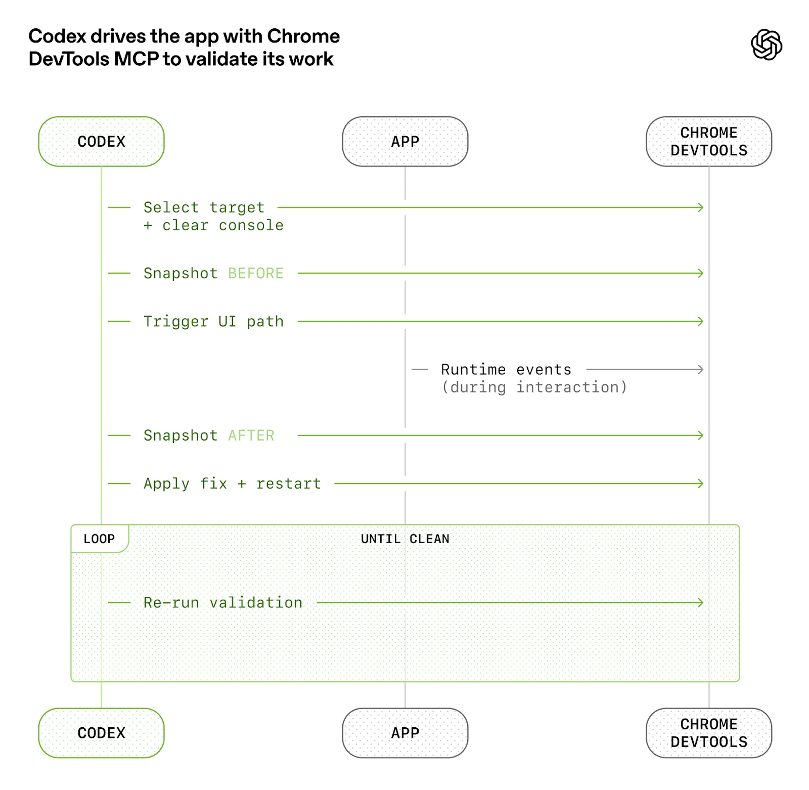
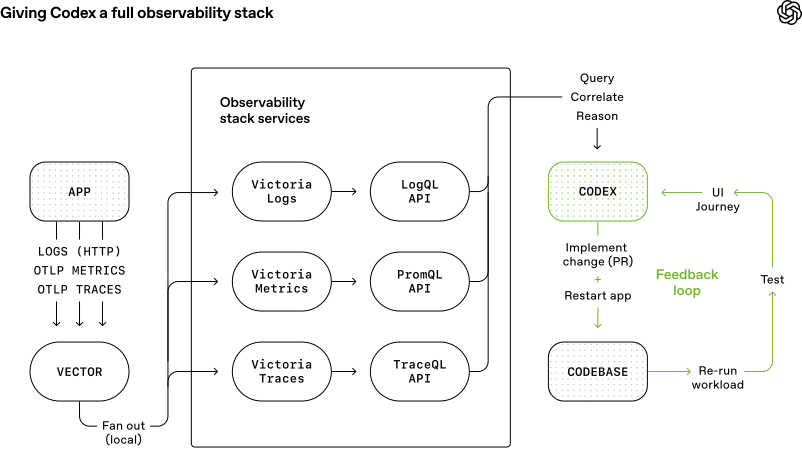
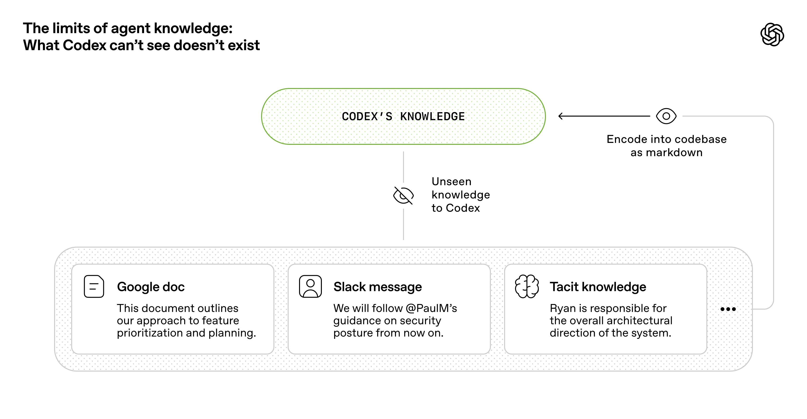
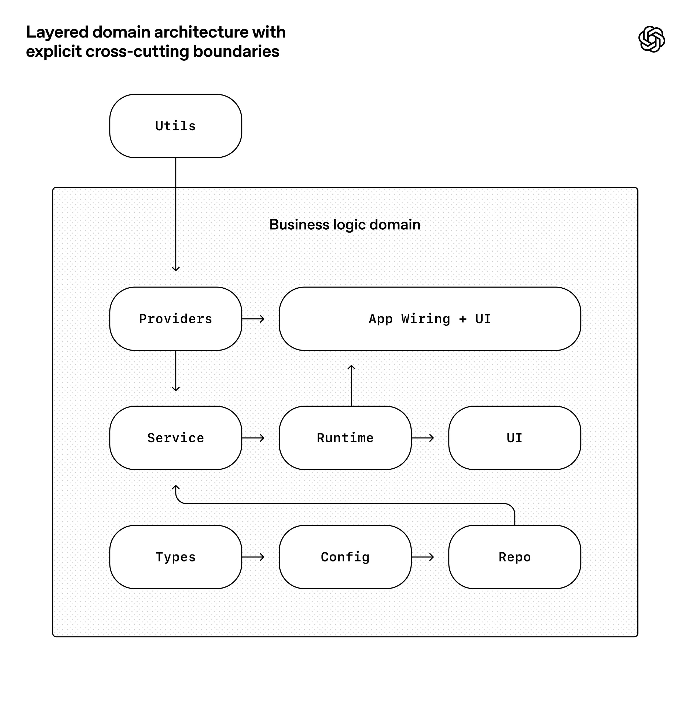
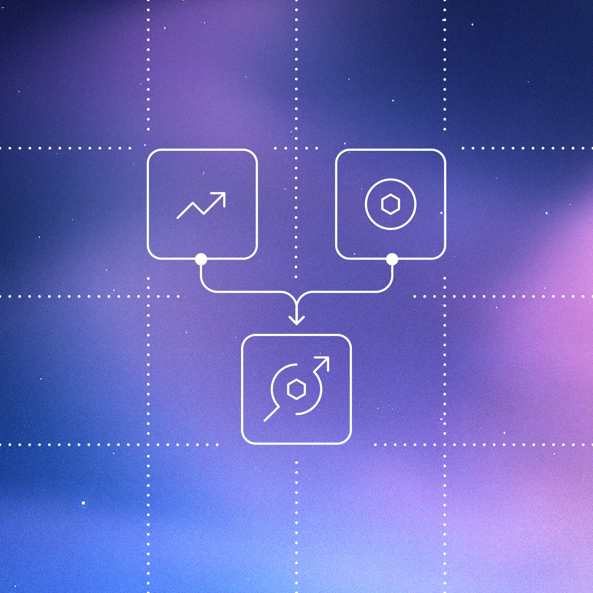
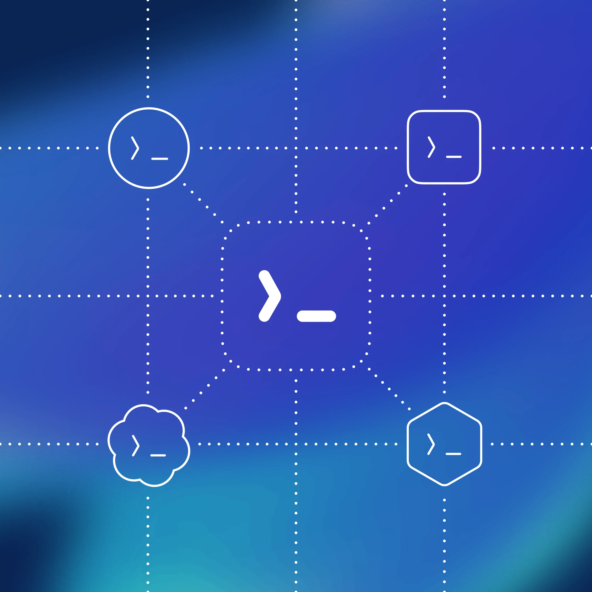

# Harness 工程：在代理优先的世界中借助 Codex

作者：Ryan Lopopolo，技术团队成员

在过去五个月里，我们的团队一直在进行一项实验：**用 0 行手写代码**构建并发布一款软件产品的内部测试版。

该产品拥有内部日活用户和外部 Alpha 测试者。它会发布、部署、出故障、再被修复。不同的是，每一行代码——应用逻辑、测试、CI 配置、文档、可观测性和内部工具——都是由 Codex 编写的。我们估计，这大约只用了手写代码所需时间的十分之一。

**人类掌舵，代理执行。**

我们刻意选择了这一约束，以此来构建那些能将工程速度提升数个数量级的必要能力。我们只有几周时间来交付最终达到百万行代码规模的成果。为此，我们需要理解：当软件工程团队的主要工作不再是编写代码，而是设计环境、明确意图、构建反馈循环，让 Codex 代理能够可靠地工作时，一切会发生怎样的变化。

这篇文章讲述的是我们用一支代理团队从零构建一款全新产品所学到的东西——哪里出了问题、哪些问题会层层累积，以及如何最大化我们唯一真正稀缺的资源：人类的时间与注意力。

## 从一个空的 Git 仓库开始

2025 年 8 月底，第一个提交落入了空仓库。

初始脚手架——仓库结构、CI 配置、格式化规则、包管理器设置和应用框架——由 Codex CLI 使用 GPT-5 生成，引导过程中参考了少量已有模板。甚至连指导代理如何在仓库中工作的初始 AGENTS.md 文件，也是由 Codex 自己编写的。

没有预先存在的人工编写代码作为系统锚点。从一开始，仓库的形态就由代理塑造。

五个月后，该仓库在应用逻辑、基础设施、工具、文档和内部开发者工具方面包含约百万行代码。在此期间，大约有 1,500 个 Pull Request 被创建并合并，而驱动 Codex 的仅有三名工程师的小团队。这相当于每位工程师平均每天 3.5 个 PR 的吞吐量，令人惊讶的是，当团队增长到七名工程师时，吞吐量反而_提升了_。重要的是，这并非为了产出而产出：该产品已被数百名内部用户使用，其中包括每天使用的重度用户。

在整个开发过程中，人类从未直接贡献过任何代码。这成为了团队的核心哲学：**不写手写代码**。

## 重新定义工程师的角色

缺乏人工编码**催生了另一种工程工作，聚焦于系统、脚手架和杠杆效应**。

早期进展比我们预期的要慢，这不是因为 Codex 能力不足，而是因为环境规格不够充分。代理缺乏推进高层目标所需的工具、抽象和内部结构。我们工程团队的主要工作变成了让代理能够做有用的事。

在实践中，这意味着采用深度优先的方式：将较大的目标分解为更小的构建块（设计、编码、审查、测试等），通过提示词让代理构建这些模块，然后用它们解锁更复杂的任务。当某件事失败时，解决方案几乎从来不是"更努力地试"。因为取得进展的唯一途径是让 Codex 完成工作，所以人类工程师总是会介入并追问："缺少了什么能力？如何让它对代理来说既可理解又可执行？"

人类几乎完全通过提示词与系统交互：工程师描述一个任务，运行代理，让它开启一个 Pull Request。为了推动 PR 最终合入，我们指示 Codex 在本地审查自己的变更，在本地和云端请求额外的特定代理审查，回应来自人类或代理的任何反馈，并在循环中迭代，直到所有代理审查者都满意（这实际上是一个 [Ralph Wiggum Loop](https://ghuntley.com/loop/)）。Codex 直接使用我们的标准开发工具（gh、本地脚本和仓库内嵌的技能）来收集上下文，无需人类将内容复制粘贴到 CLI 中。

人类可以审查 Pull Request，但并非必须。随着时间推移，我们已将几乎所有审查工作推向代理之间的互审。

## 提升应用的可理解性

随着代码吞吐量的增长，我们的瓶颈变成了人工 QA 容量。由于固定的约束一直是人类的时间和注意力，我们通过让应用 UI、日志和应用指标本身对 Codex 直接可理解，来为代理增加更多能力。

例如，我们让应用可以按 git worktree 启动，这样 Codex 就能为每个变更启动和驱动一个独立的实例。我们还将 Chrome DevTools Protocol 接入代理运行时，并创建了用于处理 DOM 快照、截图和导航的技能。这使得 Codex 能够复现 Bug、验证修复，并直接推理 UI 行为。



我们在可观测性工具方面也做了同样的事。日志、指标和追踪通过一个本地可观测性栈暴露给 Codex，该栈对于每个 worktree 都是临时的。Codex 在完全隔离的应用版本上工作——包括其日志和指标，任务完成后即被销毁。代理可以使用 LogQL 查询日志，使用 PromQL 查询指标。有了这些上下文，"确保服务启动在 800ms 内完成"或"这四个关键用户旅程中的任何 Span 不超过两秒"之类的提示词就变得可行了。



我们经常看到单个 Codex 运行在单个任务上持续工作超过六小时（通常是在人类睡觉的时候）。

## 让仓库知识成为系统的记录来源

上下文管理是让代理在大型复杂任务中高效工作的最大挑战之一。我们最早学到的经验很简单：**给 Codex 一张地图，而不是一份 1,000 页的说明手册。**

我们尝试了"一个大 [`AGENTS.md`](https://agents.md/)"的方法。它以可预见的方式失败了：

*   **上下文是稀缺资源。** 一个庞大的指令文件会挤占任务本身、代码和相关文档的空间——导致代理要么遗漏关键约束，要么开始优化错误的约束。
*   **过多的指导等于_没有指导_。** 当一切都是"重要的"，就没有什么是重要的。代理最终会在局部做模式匹配，而不是有目的地导航。
*   **它会迅速腐烂。** 一个单体的手册会变成过时规则的坟墓。代理无法判断哪些仍然有效，人类也不再维护它，这个文件悄悄地变成了一个诱人的隐患。
*   **难以验证。** 单一的文本块不适合做机械化检查（覆盖率、时效性、归属、交叉链接），因此偏差不可避免。

因此，我们没有把 `AGENTS.md` 当作百科全书，而是将其视为**目录**。

仓库的知识库存在于一个结构化的 `docs/` 目录中，被视为系统的记录来源。一个简短的 `AGENTS.md`（约 100 行）被注入上下文，主要充当一张地图，指向其他地方更深入的真相来源。

#### Plain Text

```
1AGENTS.md2ARCHITECTURE.md3docs/4├── design-docs/5│   ├── index.md6│   ├── core-beliefs.md7│   └── ...8├── exec-plans/9│   ├── active/10│   ├── completed/11│   └── tech-debt-tracker.md12├── generated/13│   └── db-schema.md14├── product-specs/15│   ├── index.md16│   ├── new-user-onboarding.md17│   └── ...18├── references/19│   ├── design-system-reference-llms.txt20│   ├── nixpacks-llms.txt21│   ├── uv-llms.txt22│   └── ...23├── DESIGN.md24├── FRONTEND.md25├── PLANS.md26├── PRODUCT_SENSE.md27├── QUALITY_SCORE.md28├── RELIABILITY.md29└── SECURITY.md
```

仓库内知识库的布局。

设计文档被编目和索引，包括验证状态和一组定义代理优先操作原则的核心信念。[架构文档](https://matklad.github.io/2021/02/06/ARCHITECTURE.md.html)提供了领域和包分层的顶层地图。一份质量文档对每个产品领域和架构层进行评级，追踪差距的变化。

计划被视为一等制品。小型变更使用临时的轻量级计划，而复杂的工作则通过[执行计划](https://cookbook.openai.com/articles/codex_exec_plans)记录，包含进度和决策日志，并提交到仓库中。活跃计划、已完成计划和已知技术债务都被版本化并存放在同一位置，使代理无需依赖外部上下文即可工作。

这实现了**渐进式披露**：代理从一个小的、稳定的入口点开始，被引导去哪里查找更多信息，而不是一开始就被大量信息淹没。

我们通过机械化方式来执行这一点。专门的 linter 和 CI 作业验证知识库是最新的、交叉链接的，且结构正确。一个定期运行的"文档园艺"代理会扫描过时或废弃的、不反映真实代码行为的文档，并开启修复 Pull Request。

## 让代理易于理解才是目标

随着代码库的演进，Codex 的设计决策框架也需要相应演进。

由于仓库完全由代理生成，它首先为 _Codex_ 的_可理解性_做了优化。正如团队致力于提高代码对新入职工程师的可导航性，我们人类工程师的目标是让代理能够**直接从仓库本身**推理完整的业务领域。

从代理的角度看，任何在运行时无法在上下文中访问的东西实际上都不存在。存在于 Google Docs、聊天线程或人们脑海中的知识对系统来说是不可访问的。仓库本地的、版本化的制品（例如代码、Markdown、Schema、可执行计划）就是它能看到的全部。



我们发现需要随时间推移将越来越多的上下文推入仓库。那次让团队在架构模式上达成一致的 Slack 讨论？如果代理无法发现它，它就如同对三个月后入职的新人一样不可见。

给 Codex 更多上下文意味着组织和暴露正确的信息，让代理能够在其上进行推理，而不是用过载的临时指令淹没它。就像你会向新队友介绍产品原则、工程规范和团队文化（包括 emoji 偏好）一样，给代理提供这些信息会产生更一致的输出。

这一框架厘清了许多权衡。我们偏好那些可以在仓库内被完全内化和推理的依赖和抽象。通常被描述为"无聊"的技术往往更容易被代理建模，因为它们具有良好的可组合性、API 稳定性和在训练集中的充分表示。在某些情况下，让代理重新实现功能子集比绕过公共库中不透明的上游行为成本更低。例如，我们没有引入一个通用的 `p-limit` 风格的包，而是实现了自己的带并发控制的 map 辅助函数：它与我们的 OpenTelemetry 插桩紧密集成，拥有 100% 的测试覆盖率，行为完全符合我们运行时的期望。

将更多系统内容转化为代理可以直接检查、验证和修改的形式，增加了杠杆效应——不仅对 Codex 如此，对其他在同一代码库上工作的代理（例如 [Aardvark](http://openai.com/index/introducing-aardvark/)）也是如此。

## 执行架构与品味

仅靠文档无法保持一个完全由代理生成的代码库的一致性。**通过执行不变量而非微管理实现方式，我们让代理能够快速交付而不损害基础。** 例如，我们要求 Codex [在边界处解析数据结构](https://lexi-lambda.github.io/blog/2019/11/05/parse-don-t-validate/)，但不规定具体如何实现（模型似乎偏好 Zod，但我们没有指定必须使用该库）。

代理在具有[严格边界和可预测结构](https://bits.logic.inc/p/ai-is-forcing-us-to-write-good-code)的环境中最为高效，因此我们围绕一个严格的架构模型构建了应用。每个业务领域被划分为一组固定的层，依赖方向经过严格验证，允许的边集合有限。这些约束通过自定义 linter（当然是 Codex 生成的！）和结构测试来机械化执行。

下图展示了规则：在每个业务领域（例如应用设置）内，代码只能沿着固定的层"向前"依赖（Types -> Config -> Repo -> Service -> Runtime -> UI）。横切关注点（认证、连接器、遥测、功能标志）通过一个显式接口进入：Providers。其他任何依赖都是不允许的，并通过机械化方式执行。



这种架构通常在拥有数百名工程师时才会被采用。但有了编码代理，它成了早期的必要前提：正是这些约束使得速度不会导致退化或架构偏移。

在实践中，我们通过自定义 linter 和结构测试来执行这些规则，外加一小套"品味不变量"。例如，我们通过自定义 lint 静态强制执行结构化日志、Schema 和类型的命名约定、文件大小限制以及平台特定的可靠性要求。因为这些 lint 是自定义的，我们会在错误消息中写入修复指导，将其注入代理的上下文。

在人工驱动的工作流中，这些规则可能显得迂腐或限制性过强。但对于代理，它们成为了乘数：一旦编码完成，它们就会在所有地方同时生效。

与此同时，我们明确区分了哪些约束重要、哪些不重要。这类似于管理一个大型工程平台组织：在中心执行边界，在局部允许自主。你深切关注边界、正确性和可复现性。在这些边界之内，你允许团队——或代理——在如何表达解决方案上有很大的自由度。

生成的代码并不总是符合人类的风格偏好，这没关系。只要输出是正确的、可维护的，并且对未来的代理运行来说是可理解的，它就达到了标准。

人类的品味被持续反馈到系统中。审查评论、重构 Pull Request 和面向用户的 Bug 被捕获为文档更新，或直接编码到工具中。当文档不够用时，我们将规则提升为代码。

## 吞吐量改变了合入哲学

随着 Codex 吞吐量的增长，许多传统的工程规范反而成了阻碍。

仓库以最少的阻塞合入门槛运行。Pull Request 的生命周期很短。测试不稳定的情况通常通过后续重跑来解决，而不是无限期地阻塞进度。在一个代理吞吐量远超人类注意力的系统中，纠错的成本很低，而等待的成本很高。

在低吞吐量的环境中，这样做是不负责任的。但在我们的场景下，这往往是正确的权衡。

## "代理生成"到底意味着什么

当我们说代码库由 Codex 代理生成时，我们指的是代码库中的一切。

代理生产：

*   产品代码和测试
*   CI 配置和发布工具
*   内部开发者工具
*   文档和设计历史
*   评估框架
*   审查评论和回复
*   管理仓库本身的脚本
*   生产环境仪表盘定义文件

人类始终保持在循环中，但在与我们过去不同的抽象层次上工作。我们确定工作优先级，将用户反馈转化为验收标准，并验证结果。当代理遇到困难时，我们将其视为信号：识别缺少了什么——工具、安全护栏、文档——并将其反馈到仓库中，始终由 Codex 自己来编写修复。

代理直接使用我们的标准开发工具。它们拉取审查反馈、内联回复、推送更新，并且经常自行 squash 并合并自己的 Pull Request。

## 不断提升的自主级别

随着更多开发循环被直接编码到系统中——测试、验证、审查、反馈处理和恢复——仓库最近跨过了一个有意义的门槛：Codex 现在可以端到端地推进一个新功能。

给定一个提示词，代理现在可以：

*   验证代码库的当前状态
*   复现一个报告的 Bug
*   录制一段展示失败的视频
*   实现修复
*   通过驱动应用来验证修复
*   录制第二段展示问题已解决的视频
*   开启一个 Pull Request
*   回应来自代理和人类的反馈
*   检测并修复构建失败
*   仅在需要判断时才交由人类处理
*   合并变更

这种行为高度依赖于该仓库的特定结构和工具，不应假定在没有类似投入的情况下就能泛化——至少目前如此。

## 熵与垃圾回收

**完全的代理自主性也引入了新的问题。** Codex 会复制仓库中已存在的模式——即使是不均匀或次优的模式。随着时间的推移，这不可避免地导致偏移。

最初，人类手动处理这些问题。我们团队曾经每个周五（占一周的 20%）清理"AI 垃圾"。不出所料，这种方式无法扩展。

取而代之的是，我们开始将所谓的"黄金原则"直接编码到仓库中，并构建了一个定期清理流程。这些原则是带有主观色彩的、机械化的规则，用于保持代码库对未来代理运行的可理解性和一致性。例如：（1）我们偏好共享工具包而非手写的辅助函数，以保持不变量的集中管理；（2）我们不会"YOLO 式"地探测数据——我们验证边界或依赖类型化的 SDK，这样代理就不会在猜测的数据结构上意外构建。我们定期运行一组后台 Codex 任务，扫描偏差、更新质量评级并开启有针对性的重构 Pull Request。其中大多数可以在一分钟内审查完毕并自动合并。

这就像垃圾回收一样。技术债务就像高息贷款：几乎总是以小额增量持续偿还比任其累积再痛苦地集中处理要好。人类的品味被捕获一次，然后在每一行代码上持续执行。这也让我们能够每天发现并解决不良模式，而不是任由它们在代码库中蔓延数天或数周。

## 我们仍在学习中

到目前为止，这一策略在 OpenAI 的内部发布和推广中运作良好。为真实用户构建真实产品帮助我们将投资锚定在现实中，并引导我们走向长期的可维护性。

我们尚不知道在一个完全由代理生成的系统中，架构一致性如何在数年间演进。我们仍在学习人类判断在哪里能产生最大的杠杆效应，以及如何编码这些判断使其产生复利效应。我们也不知道随着模型随时间推移变得更加强大，这个系统将如何演变。

已经明确的是：构建软件仍然需要纪律，但纪律更多体现在脚手架而非代码中。保持代码库一致性的工具、抽象和反馈循环变得越来越重要。

**我们现在最困难的挑战集中在设计环境、反馈循环和控制系统**，帮助代理实现我们的目标：大规模构建和维护复杂、可靠的软件。

随着像 Codex 这样的代理承担起软件生命周期中更大的部分，这些问题将变得更加重要。我们希望分享一些早期经验能帮助你思考应该在哪里投入精力，以便[你只需专注于构建产品](http://openai.com/codex/)。

*   [Codex](http://openai.com/news/?tags=codex)
*   [2026](http://openai.com/news/?tags=2026)

## 作者

Ryan Lopopolo

## 致谢

特别感谢 Victor Zhu 和 Zach Brock 对本文的贡献，以及构建这款新产品的整个团队。

## 继续阅读

[查看全部](http://openai.com/news/engineering/)


[从模型到代理：为 Responses API 配备计算机环境 工程 2026 年 3 月 11 日](http://openai.com/index/equip-responses-api-computer-environment/)



[超越速率限制：扩展 Codex 和 Sora 的访问 工程 2026 年 2 月 13 日](http://openai.com/index/beyond-rate-limits/)



[解锁 Codex harness：我们如何构建 App Server 工程 2026 年 2 月 4 日](http://openai.com/index/unlocking-the-codex-harness/)

我们的研究
*   [研究索引](http://openai.com/research/index/)
*   [研究概览](http://openai.com/research/)
*   [研究驻留计划](http://openai.com/residency/)
*   [OpenAI 科学](http://openai.com/science/)
*   [经济研究](http://openai.com/signals/)

最新进展
*   [GPT-5.3 Instant](http://openai.com/index/gpt-5-3-instant/)
*   [GPT-5.3-Codex](http://openai.com/index/introducing-gpt-5-3-codex/)
*   [GPT-5](http://openai.com/gpt-5/)
*   [Codex](http://openai.com/index/introducing-gpt-5-3-codex/)

安全
*   [安全方法](http://openai.com/safety/)
*   [安全与隐私](http://openai.com/security-and-privacy/)
*   [信任与透明度](http://openai.com/trust-and-transparency/)

ChatGPT
*   [探索 ChatGPT](https://chatgpt.com/overview)
*   [商业版](https://chatgpt.com/business/business-plan)
*   [企业版](https://chatgpt.com/business/enterprise)
*   [教育版](https://chatgpt.com/business/education)
*   [定价](https://chatgpt.com/pricing)
*   [下载](https://chatgpt.com/download)

Sora
*   [Sora 概览](http://openai.com/sora/)
*   [功能特性](http://openai.com/sora/#features)
*   [定价](http://openai.com/sora/#pricing)
*   [Sora 登录](https://sora.com/)

API 平台
*   [平台概览](http://openai.com/api/)
*   [定价](http://openai.com/api/pricing/)
*   [API 登录](https://platform.openai.com/login)
*   [文档](https://developers.openai.com/api/docs)
*   [开发者论坛](https://community.openai.com/)

企业服务
*   [企业概览](http://openai.com/business/)
*   [解决方案](http://openai.com/solutions/)
*   [联系销售](http://openai.com/contact-sales/)

公司
*   [关于我们](http://openai.com/about/)
*   [我们的章程](http://openai.com/charter/)
*   [基金会](https://openaifoundation.org/)
*   [招聘](http://openai.com/careers/)
*   [品牌](http://openai.com/brand/)

支持
*   [帮助中心](https://help.openai.com/)

更多
*   [新闻](http://openai.com/news/)
*   [故事](http://openai.com/stories/)
*   [直播](http://openai.com/live/)
*   [播客](http://openai.com/podcast/)
*   [RSS](https://openai.com/news/rss.xml)

条款与政策
*   [使用条款](http://openai.com/policies/terms-of-use/)
*   [隐私政策](http://openai.com/policies/privacy-policy/)
*   [其他政策](http://openai.com/policies/)

[(在新窗口中打开)](https://x.com/OpenAI)[(在新窗口中打开)](https://www.youtube.com/OpenAI)[(在新窗口中打开)](https://www.linkedin.com/company/openai)[(在新窗口中打开)](https://github.com/openai)[(在新窗口中打开)](https://www.instagram.com/openai/)[(在新窗口中打开)](https://www.tiktok.com/@openai)[(在新窗口中打开)](https://discord.gg/openai)

OpenAI © 2015–2026 管理 Cookie

English United States
