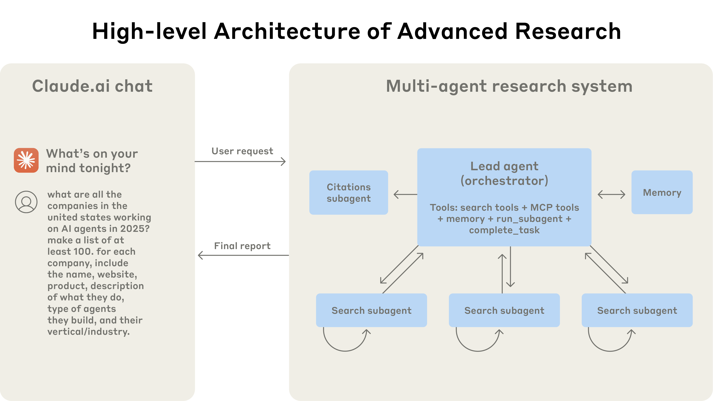
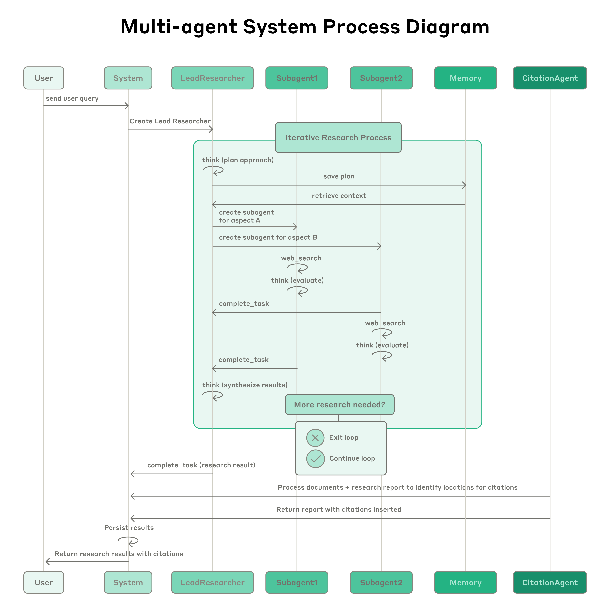
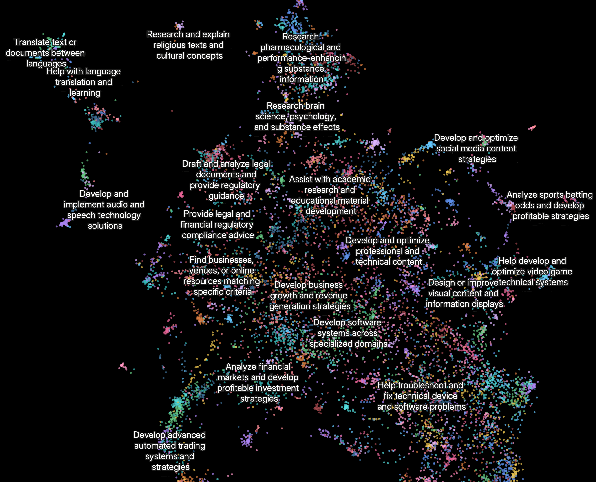

# 我们如何构建多代理研究系统

### 多代理系统的优势

研究工作涉及开放性问题，很难提前预测所需的步骤。你无法为复杂主题的探索硬编码一条固定路径，因为过程本质上是动态的且依赖路径的。人们在进行研究时，往往会根据发现不断调整方法，追踪调查过程中出现的新线索。

这种不可预测性使得 AI 代理特别适合研究任务。研究需要随着调查的推进灵活转向或探索关联线索的能力。模型必须在多个轮次中自主运行，根据中间发现来决定接下来要追踪哪些方向。线性的、一次性的流水线无法处理这些任务。

搜索的本质是压缩：从海量语料库中提炼洞见。子代理通过拥有各自独立的上下文窗口并行运作来促进压缩——同时探索问题的不同方面，然后将最重要的 token 浓缩后传递给主导研究代理。每个子代理还实现了关注点分离——不同的工具、提示词和探索轨迹——这降低了路径依赖，使深入、独立的调查成为可能。

一旦智能达到一定水平，多代理系统就将成为扩展性能的关键手段。例如，虽然个体人类在过去十万年中变得更聪明了，但人类社会在信息时代由于集体智慧和协作能力而实现了指数级的能力提升。即使是通用智能代理，在个体层面也面临局限；代理群体能够完成远超个体的任务。

我们的内部评估表明，多代理研究系统特别擅长广度优先的查询，即需要同时追踪多个独立方向的任务。我们发现，以 Claude Opus 4 作为主导代理、Claude Sonnet 4 作为子代理的多代理系统，在我们的内部研究评估上比单代理 Claude Opus 4 高出 90.2%。例如，当被要求列出信息技术标普 500 指数中所有公司的董事会成员时，多代理系统通过将任务分解给子代理找到了正确答案，而单代理系统则因缓慢的顺序搜索而失败。

多代理系统有效的核心原因在于它们能够消耗足够的 token 来解决问题。在我们的分析中，三个因素解释了 [BrowseComp](https://openai.com/index/browsecomp/) 评估（测试浏览代理定位难以找到的信息的能力）中 95% 的性能差异。我们发现 token 使用量本身解释了 80% 的差异，工具调用次数和模型选择是另外两个解释因素。这一发现验证了我们的架构——将工作分配给具有独立上下文窗口的代理，以增加并行推理的容量。最新的 Claude 模型对 token 使用效率有巨大的倍增效应——升级到 Claude Sonnet 4 带来的性能提升甚至超过在 Claude Sonnet 3.7 上将 token 预算翻倍。多代理架构有效地扩展了超出单代理限制的任务的 token 使用量。

但也有一个缺点：在实践中，这些架构会快速消耗 token。根据我们的数据，代理通常使用约 4 倍于聊天交互的 token，而多代理系统使用约 15 倍于聊天的 token。出于经济可行性的考虑，多代理系统适用于那些任务价值足够高、值得为提升的性能付费的场景。此外，某些需要所有代理共享相同上下文或代理之间存在许多依赖关系的领域，目前不太适合多代理系统。例如，大多数编码任务中真正可并行的任务比研究少，而 LLM 代理在实时协调和委派给其他代理方面还不够成熟。我们发现多代理系统特别擅长以下类型的任务：需要大量并行化的高价值任务、信息量超出单个上下文窗口的任务，以及需要与众多复杂工具交互的任务。

### Research 的架构概览

我们的 Research 系统使用多代理架构，采用编排者-工作者模式，其中主导代理协调流程，同时将任务委派给并行运作的专业子代理。

多代理架构运作示意：用户查询经由主导代理处理，主导代理创建专业子代理以并行搜索不同方面。

当用户提交查询时，主导代理会分析查询、制定策略，并生成子代理以同时探索不同方面。如上图所示，子代理充当智能过滤器，通过迭代使用搜索工具来收集信息（在此例中是关于 2025 年 AI 代理公司的信息），然后将公司列表返回给主导代理，以便其编制最终答案。

传统上使用检索增强生成（RAG）的方法采用静态检索，即获取与输入查询最相似的一组文本块，然后使用这些块来生成响应。相比之下，我们的架构使用多步搜索，动态查找相关信息，适应新发现，并分析结果以构建高质量答案。

流程图展示了我们多代理 Research 系统的完整工作流。当用户提交查询时，系统创建一个 LeadResearcher 代理，进入迭代研究流程。LeadResearcher 首先思考方案并将计划保存到 Memory 中以持久化上下文，因为如果上下文窗口超过 200,000 个 token 就会被截断，保留计划非常重要。然后它创建专门的子代理（图中显示了两个，但可以是任意数量），分配具体的研究任务。每个子代理独立执行网页搜索，使用[交错思考](https://docs.anthropic.com/en/docs/build-with-claude/extended-thinking#interleaved-thinking)评估工具结果，并将发现返回给 LeadResearcher。LeadResearcher 综合这些结果并决定是否需要更多研究——如果需要，它可以创建更多子代理或调整策略。一旦收集到足够的信息，系统退出研究循环，将所有发现传递给 CitationAgent，后者处理文档和研究报告以识别需要引用的具体位置。这确保所有声明都正确归因于其来源。最终的研究结果（包含引用）随后返回给用户。

### 研究代理的提示词工程与评估

多代理系统与单代理系统有关键差异，包括协调复杂性的快速增长。早期代理会犯这样的错误：为简单查询生成 50 个子代理、在网上无休止地搜索不存在的来源、以及用过多的更新相互干扰。由于每个代理都由提示词驱动，提示词工程成为我们改善这些行为的主要手段。以下是我们在为代理编写提示词时学到的一些原则：

1.   **像你的代理一样思考。** 要迭代提示词，你必须理解其效果。为了帮助我们做到这一点，我们使用 [Console](https://console.anthropic.com/) 构建了模拟环境，使用系统中完全相同的提示词和工具，然后逐步观察代理的工作。这立即揭示了失败模式：代理在已有足够结果时仍在继续、使用过于冗长的搜索查询，或选择错误的工具。有效的提示词工程依赖于建立对代理的准确心智模型，这能使最具影响力的改进变得显而易见。
2.   **教会编排者如何委派。** 在我们的系统中，主导代理将查询分解为子任务并向子代理描述它们。每个子代理需要明确目标、输出格式、关于使用哪些工具和来源的指导，以及清晰的任务边界。没有详细的任务描述，代理会重复工作、留下遗漏或无法找到必要信息。我们最初允许主导代理给出简单的简短指令，如"研究半导体短缺"，但发现这些指令往往过于模糊，导致子代理误解任务或执行与其他代理完全相同的搜索。例如，一个子代理探索了 2021 年汽车芯片危机，而另外两个代理重复调查了当前 2025 年的供应链，未能有效分工。
3.   **根据查询复杂度调整投入。** 代理难以判断不同任务的适当投入，因此我们在提示词中嵌入了缩放规则。简单的事实查找只需 1 个代理和 3-10 次工具调用，直接比较可能需要 2-4 个子代理，每个 10-15 次调用，复杂研究可能使用超过 10 个子代理，职责明确划分。这些明确的指导帮助主导代理高效分配资源，防止在简单查询上过度投入——这是我们早期版本中常见的失败模式。
4.   **工具设计和选择至关重要。** 代理-工具接口与人机接口同样关键。使用正确的工具是高效的——通常甚至是必须的。例如，在网上搜索只存在于 Slack 中的上下文的代理从一开始就注定失败。随着 [MCP 服务器](https://modelcontextprotocol.io/introduction)为模型提供对外部工具的访问，这个问题更加突出，因为代理会遇到从未见过的、描述质量参差不齐的工具。我们给代理提供了明确的启发式规则：例如，首先检查所有可用工具，将工具使用与用户意图匹配，在网上搜索以进行广泛的外部探索，或优先使用专用工具而非通用工具。糟糕的工具描述会让代理完全走上错误的道路，因此每个工具都需要有明确的用途和清晰的描述。
5.   **让代理自我改进。** 我们发现 Claude 4 模型可以成为优秀的提示词工程师。当给定一个提示词和一个失败模式时，它们能够诊断代理失败的原因并建议改进。我们甚至创建了一个工具测试代理——当给定一个有缺陷的 MCP 工具时，它会尝试使用该工具，然后重写工具描述以避免失败。通过数十次测试该工具，这个代理发现了关键的细微差别和错误。这种改进工具易用性的流程使后续使用新描述的代理任务完成时间减少了 40%，因为它们能够避免大部分错误。
6.   **从宽泛开始，然后逐步聚焦。** 搜索策略应当模仿专家级人类研究：先探索全貌，再深入细节。代理往往默认使用过长的特定查询，返回很少的结果。我们通过提示词引导代理从简短的宽泛查询开始、评估可用内容、然后逐步缩小焦点来对抗这种倾向。
7.   **引导思考过程。** [扩展思考模式](https://docs.anthropic.com/en/docs/build-with-claude/extended-thinking)让 Claude 在可见的思考过程中输出额外的 token，可用作可控的思考草稿区。主导代理使用思考来规划方案，评估哪些工具适合任务，确定查询复杂度和子代理数量，并定义每个子代理的角色。我们的测试表明，扩展思考改善了指令遵循、推理和效率。子代理也会先做规划，然后在工具结果返回后使用[交错思考](https://docs.anthropic.com/en/docs/build-with-claude/extended-thinking#interleaved-thinking)来评估质量、识别差距并优化下一次查询。这使得子代理在适应任何任务时更加有效。
8.   **并行工具调用彻底改变速度和性能。** 复杂的研究任务天然涉及探索多个来源。我们早期的代理执行顺序搜索，速度极慢。为了提速，我们引入了两种并行化：（1）主导代理并行启动 3-5 个子代理而非串行启动；（2）子代理并行使用 3 个以上的工具。这些改变将复杂查询的研究时间减少了多达 90%，使 Research 能够在几分钟而非几小时内完成更多工作，同时覆盖比其他系统更多的信息。

我们的提示词策略侧重于灌输良好的启发式规则而非僵化的规则。我们研究了熟练的人类如何处理研究任务，并将这些策略编码到提示词中——例如将困难问题分解为更小的任务、仔细评估来源质量、根据新信息调整搜索方法，以及识别何时应专注于深度（深入调查某一主题）与广度（并行探索多个主题）。我们还通过设置明确的安全护栏主动缓解意外的副作用，防止代理失控。最后，我们专注于带有可观测性和测试用例的快速迭代循环。

### 有效的代理评估

良好的评估对于构建可靠的 AI 应用至关重要，代理也不例外。然而，评估多代理系统面临独特的挑战。传统评估通常假设 AI 每次都遵循相同的步骤：给定输入 X，系统应遵循路径 Y 产生输出 Z。但多代理系统并非如此运作。即使从完全相同的起点出发，代理也可能采取完全不同的有效路径来达到目标。一个代理可能搜索三个来源，而另一个搜索十个，或者它们可能使用不同的工具找到相同的答案。因为我们并不总是知道正确的步骤是什么，我们通常无法仅检查代理是否遵循了我们预设的"正确"步骤。相反，我们需要灵活的评估方法来判断代理是否达到了正确的结果，同时也遵循了合理的过程。

**立即用小样本开始评估。** 在代理开发的早期阶段，变更往往会产生巨大的影响，因为存在大量容易摘到的低垂果实。一个提示词的微调可能将成功率从 30% 提升到 80%。效果如此显著，只需少量测试用例就能发现变化。我们从大约 20 个代表真实使用模式的查询开始。测试这些查询通常能让我们清楚地看到变更的影响。我们经常听到 AI 开发团队推迟创建评估，因为他们认为只有包含数百个测试用例的大型评估才有用。然而，最好立即从少量示例的小规模测试开始，而不是等到能构建更全面的评估时才行动。

**LLM 裁判评估在做得好时可有效扩展。** 研究输出难以通过编程方式评估，因为它们是自由格式文本，很少有唯一正确答案。LLM 天然适合对输出进行评分。我们使用了一个 LLM 裁判，根据评分标准评估每个输出：事实准确性（声明是否与来源匹配？）、引用准确性（引用的来源是否支持声明？）、完整性（是否覆盖了所有要求的方面？）、来源质量（是否使用了主要来源而非质量较低的次要来源？），以及工具效率（是否以合理的次数使用了正确的工具？）。我们尝试了多个裁判来评估各个组件，但发现单次 LLM 调用、单个提示词输出 0.0-1.0 的分数和通过/未通过评级的方式最为一致，且与人类判断最吻合。当评估测试用例确实有明确答案时，这种方法特别有效——我们可以使用 LLM 裁判来简单检查答案是否正确（例如，是否准确列出了研发预算前三的制药公司）。使用 LLM 作为裁判使我们能够可扩展地评估数百个输出。

**人类评估能发现自动化遗漏的问题。** 测试代理的人会发现评估遗漏的边缘情况。这些包括对异常查询的幻觉回答、系统故障或微妙的来源选择偏差。在我们的案例中，人类测试者注意到我们早期的代理始终选择经过 SEO 优化的内容农场，而非权威但排名较低的来源，如学术论文 PDF 或个人博客。在提示词中添加来源质量启发式规则帮助解决了这个问题。即使在自动化评估的时代，手动测试仍然不可或缺。

多代理系统具有涌现行为，这些行为在未被专门编程的情况下出现。例如，对主导代理的小改动可能会不可预测地改变子代理的行为方式。成功需要理解交互模式，而不仅仅是个体代理行为。因此，这些代理的最佳提示词不仅仅是严格的指令，而是定义分工、问题解决方法和投入预算的协作框架。要做好这一点，需要精心设计的提示词和工具、可靠的启发式规则、可观测性以及紧密的反馈循环。请参阅我们 Cookbook 中的[开源提示词](https://platform.claude.com/cookbook/patterns-agents-basic-workflows)，了解我们系统中的示例提示词。

### 生产可靠性与工程挑战

在传统软件中，一个 bug 可能破坏某个功能、降低性能或导致停机。在代理系统中，微小的变更会级联成巨大的行为变化，这使得为必须在长时间运行过程中维持状态的复杂代理编写代码变得异常困难。

**代理是有状态的，错误会累积。** 代理可以长时间运行，在多次工具调用中维护状态。这意味着我们需要持久执行代码并沿途处理错误。如果没有有效的缓解措施，轻微的系统故障对代理来说可能是灾难性的。当错误发生时，我们不能从头开始重启——重启代价高昂且令用户沮丧。相反，我们构建了能够从错误发生时代理所在位置恢复的系统。我们还利用模型的智能来优雅地处理问题：例如，让代理知道某个工具正在故障并让其自行适应，效果出奇地好。我们将基于 Claude 构建的 AI 代理的适应性与确定性保障措施（如重试逻辑和定期检查点）相结合。

**调试需要新的方法。** 代理做出动态决策，即使使用相同的提示词，在不同运行之间也是非确定性的。这使得调试更加困难。例如，用户会报告代理"找不到显而易见的信息"，但我们无法看到原因。是代理使用了糟糕的搜索查询？选择了差的来源？还是遇到了工具故障？添加完整的生产追踪让我们能够诊断代理失败的原因并系统地修复问题。除了标准可观测性之外，我们还监控代理决策模式和交互结构——所有这些都不监控单个对话的内容，以维护用户隐私。这种高层可观测性帮助我们诊断根本原因、发现意外行为并修复常见故障。

**部署需要谨慎协调。** 代理系统是由提示词、工具和执行逻辑组成的高度有状态的网络，几乎持续运行。这意味着每当我们部署更新时，代理可能处于其流程的任何位置。因此，我们需要防止善意的代码变更破坏正在运行的代理。我们不能同时将所有代理更新到新版本。相反，我们使用[彩虹部署](https://brandon.dimcheff.com/2018/02/rainbow-deploys-with-kubernetes/)来避免中断运行中的代理，通过逐步将流量从旧版本转移到新版本，同时保持两者并行运行。

**同步执行造成瓶颈。** 目前，我们的主导代理同步执行子代理，等待每组子代理完成后再继续。这简化了协调，但在代理之间的信息流中造成了瓶颈。例如，主导代理无法引导子代理，子代理之间无法协调，整个系统可能因为等待单个子代理完成搜索而被阻塞。异步执行将实现更多并行性：代理并发工作并在需要时创建新的子代理。但这种异步性在子代理间的结果协调、状态一致性和错误传播方面增加了挑战。随着模型能够处理更长更复杂的研究任务，我们预期性能收益将证明这种复杂性是值得的。

### 结论

在构建 AI 代理时，最后一英里往往成为旅程的大部分。在开发者机器上运行的代码库需要大量工程工作才能成为可靠的生产系统。代理系统中错误的累积特性意味着传统软件中的小问题可能彻底让代理脱轨。一个步骤的失败可能导致代理探索完全不同的轨迹，产生不可预测的结果。由于本文描述的所有原因，从原型到生产之间的差距往往比预期更大。

尽管存在这些挑战，多代理系统已被证明对于开放式研究任务具有巨大价值。用户表示 Claude 帮助他们发现了未曾考虑过的商业机会、应对复杂的医疗选择、解决棘手的技术 bug，并通过揭示他们独自无法找到的研究关联节省了多达数天的工作。凭借精心的工程设计、全面的测试、细致入微的提示词和工具设计、稳健的运维实践，以及对当前代理能力有深刻理解的研究、产品和工程团队之间的紧密协作，多代理研究系统可以在规模上可靠运行。我们已经看到这些系统正在改变人们解决复杂问题的方式。

[Clio](https://www.anthropic.com/research/clio) 嵌入图展示了目前人们使用 Research 功能的最常见方式。排名前列的用例类别是：跨专业领域开发软件系统（10%）、开发和优化专业与技术内容（8%）、制定业务增长和营收策略（8%）、协助学术研究和教育材料开发（7%），以及研究和验证关于人物、地点或组织的信息（5%）。

### 致谢

由 Jeremy Hadfield、Barry Zhang、Kenneth Lien、Florian Scholz、Jeremy Fox 和 Daniel Ford 撰写。这项工作反映了 Anthropic 多个团队的集体努力，正是他们使 Research 功能成为可能。特别感谢 Anthropic 应用工程团队，他们的奉献精神将这个复杂的多代理系统带入了生产环境。我们也感谢早期用户的出色反馈。

## 附录

以下是关于多代理系统的一些额外杂项提示。

**对在多轮中修改状态的代理进行终态评估。** 评估在多轮对话中修改持久状态的代理面临独特挑战。与只读的研究任务不同，每个动作都可能改变后续步骤的环境，创建传统评估方法难以处理的依赖关系。我们发现专注于终态评估而非逐轮分析更为成功。与其判断代理是否遵循了特定流程，不如评估它是否达到了正确的最终状态。这种方法承认代理可能会找到通向同一目标的替代路径，同时仍然确保它们交付了预期的结果。对于复杂工作流，将评估分解为离散的检查点——特定状态变更应该已经发生的地方——而不是试图验证每个中间步骤。

**长跨度对话管理。** 生产代理经常进行跨越数百轮的对话，需要精心的上下文管理策略。随着对话的延长，标准上下文窗口变得不够用，需要智能压缩和记忆机制。我们实现了这样的模式：代理在进入新任务前总结已完成的工作阶段并将重要信息存储在外部记忆中。当接近上下文限制时，代理可以生成具有干净上下文的全新子代理，同时通过精心的交接保持连续性。此外，它们可以从记忆中检索存储的上下文（如研究计划），而不是在达到上下文限制时丢失之前的工作。这种分布式方法在防止上下文溢出的同时，保持了长时间交互的对话连贯性。

**子代理输出到文件系统以最小化"传话游戏"效应。** 对于某些类型的结果，子代理的直接输出可以绕过主导协调者，从而同时提高保真度和性能。与其要求子代理通过主导代理传递所有信息，不如实现工件系统，让专业代理可以创建独立持久化的输出。子代理调用工具将其工作存储在外部系统中，然后将轻量级引用传回给协调者。这防止了多阶段处理中的信息丢失，并减少了通过对话历史复制大量输出带来的 token 开销。这种模式特别适用于结构化输出，如代码、报告或数据可视化，在这些场景中，子代理的专业化提示词产生的结果比通过通用协调者过滤更好。
