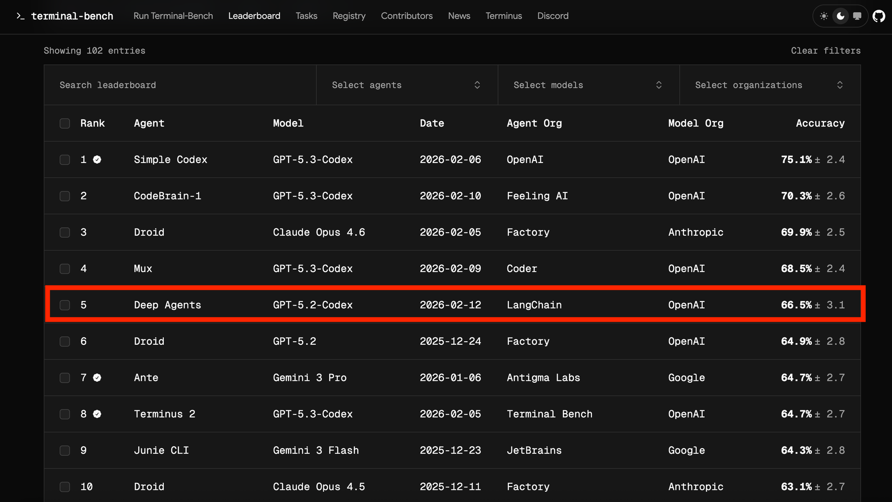
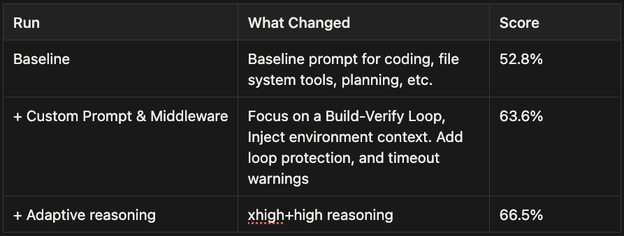
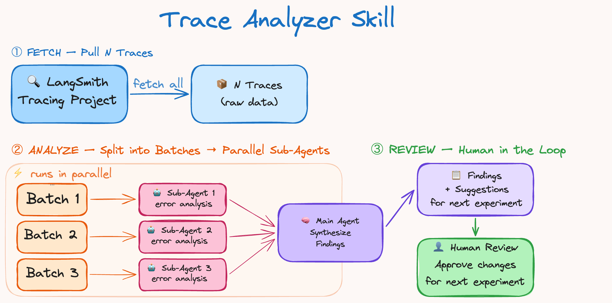
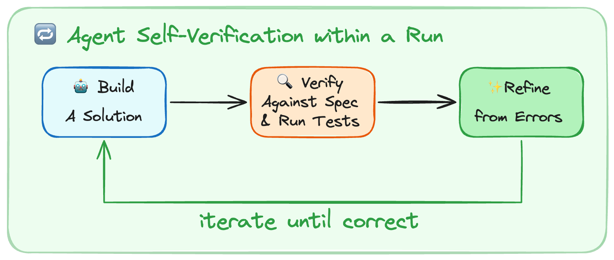
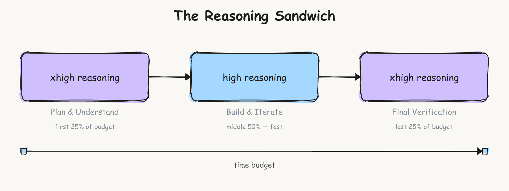

# 通过 Harness 工程改进深度代理

## Harness 工程的目标

Harness 的目标是将模型固有的不规则智力塑造为适用于我们关注任务的能力。**Harness 工程**关注的是系统——围绕模型构建工具，以优化任务表现、token 效率、延迟等目标。设计决策包括系统提示词、工具选择和执行流程。

但应该如何调整 harness 来改进代理呢？

在 LangChain，我们使用 [Traces](https://docs.langchain.com/langsmith/observability-quickstart?ref=blog.langchain.com) 来大规模理解代理的故障模式。如今的模型在很大程度上是黑盒，其内部机制难以解读。但我们可以看到它们在文本空间中的输入和输出，并将其用于改进循环中。

我们使用一个简单的方案，将 [deepagents-cli](https://github.com/langchain-ai/deepagents/tree/main/libs/cli?ref=blog.langchain.com)（我们的编码代理）在 Terminal Bench 2.0 上的得分提升了 `13.7 分`，从 `52.8` 提高到 `66.5`。我们只调整了 harness，模型保持不变：`gpt-5.2-codex`。

## 实验设置与 Harness 的调节旋钮

我们使用了 [Terminal Bench 2.0](https://www.tbench.ai/?ref=blog.langchain.com)，这是目前评估代理编码能力的标准基准测试。它包含 89 个任务，涵盖机器学习、调试和生物学等领域。我们使用 [Harbor](https://harborframework.com/?ref=blog.langchain.com) 来编排运行。它会启动沙箱（[Daytona](https://www.daytona.io/?ref=blog.langchain.com)），与我们的代理循环交互，并运行验证和评分。

每个代理操作都存储在 [LangSmith](https://smith.langchain.com/?ref=blog.langchain.com) 中，还包括延迟、token 数量和成本等指标。

### **可调节的旋钮**

代理 harness 有很多可调旋钮：系统提示词、工具、钩子/中间件、技能、子代理委派、记忆系统等。我们有意压缩了优化空间，将重点放在三个方面：**系统提示词、工具**和[**中间件**](https://docs.langchain.com/oss/python/langchain/middleware/overview?ref=blog.langchain.com#the-agent-loop)（我们对模型调用和工具调用周围钩子的称呼）。

我们从默认提示词和标准工具+中间件开始。GPT-5.2-Codex 得分 52.8%，一个不错的分数，刚好在当前排行榜前 30 名之外，但还有提升空间。

### **Trace 分析器技能**

我们希望 trace 分析可重复执行，因此将其制作成代理技能。这构成了我们**分析多次运行中的错误并改进 harness**的方案。流程如下：

1.   从 LangSmith 获取实验 traces
2.   并行启动错误分析代理 → 主代理综合分析结果和建议
3.   汇总反馈并对 harness 进行针对性修改。

这与[提升算法](https://en.wikipedia.org/wiki/Boosting_(machine_learning)?ref=blog.langchain.com)的工作方式类似，专注于前几次运行中的错误。在第 3 步中，人工参与可能很有帮助（虽然不是必需的），以验证和讨论提议的修改。对单个任务过拟合的修改不利于泛化，可能导致其他任务的回退。

自动化 trace 分析节省了大量时间，使快速尝试实验变得容易。我们很快会发布这个技能，目前正在将其用于通用的提示词优化测试。

## 哪些改进真正提升了代理性能

自动化 Trace 分析让我们能够[调试代理出错的地方](https://www.langchain.com/conceptual-guides/agent-observability-powers-agent-evaluation?ref=blog.langchain.com)。问题包括推理错误、未遵循任务指令、缺乏测试和验证、时间耗尽等。我们将在下面的小节中更详细地讨论这些改进。

### 构建与自我验证

如今的模型是出色的自我改进机器。

**自我验证允许代理在一次运行中通过反馈进行自我改进。** 然而，它们并没有自然进入这个**构建-验证循环**的倾向。

最常见的失败模式是：代理写了一个解决方案，重新阅读了自己的代码，确认看起来没问题，然后停止了。测试是自主代理编码的关键组成部分。它有助于验证整体正确性，同时为代理提供可以逐步优化的信号。

我们在系统提示词中添加了如何解决问题的指导。

1.   **规划与探索：** 阅读任务，扫描代码库，根据任务规格和如何验证解决方案制定初步计划。
2.   **构建：** 以验证为目标实施计划。如果测试不存在就补上测试，并同时覆盖正常路径和边缘情况。
3.   **验证：** 运行测试，阅读完整输出，与任务要求对比（而不是与你自己的代码对比）。
4.   **修复：** 分析错误，回顾原始规格，修复问题。

我们非常注重测试，因为它驱动每次迭代中的改进。我们发现，除了提示词之外，确定性的上下文注入也有助于代理验证其工作。我们使用了一个 `PreCompletionChecklistMiddleware`，它会在代理退出前拦截并提醒其根据任务规格运行验证流程。这与 [Ralph Wiggum Loop](https://ghuntley.com/loop/?ref=blog.langchain.com) 类似，通过钩子在退出时强制代理继续执行，我们将此用于验证。

### 为代理提供环境上下文

Harness 工程的一部分是**为上下文工程构建良好的交付机制。** Terminal Bench 任务包含目录结构、内置工具和严格的超时限制。

1.   **目录上下文与工具：** 一个 `LocalContextMiddleware` 在代理启动时运行，映射 `cwd` 及其他父目录和子目录。我们运行 `bash` 命令来查找 `Python` 安装等工具。上下文发现和搜索容易出错，因此注入上下文可以缩小出错面，帮助**代理熟悉其所处环境。**
2.   **教导代理编写可测试的代码：** 代理并不知道自己的代码需要怎样才算可测试。我们会补充提示，说明它们的工作将接受程序化测试，这类似于提交代码时要满足测试要求。例如，任务规格里提到的文件路径必须严格遵循，这样解决方案才能在自动化评分步骤中正常工作。强调边缘情况的提示词有助于代理避免只检查“正常路径”。强制模型符合测试标准，是避免随时间推移出现“slop buildup” 的一种有效策略。
3.   **时间预算：** 我们注入时间预算警告，促使代理完成工作并转向验证。代理在时间估算方面表现糟糕，因此这种启发式方法在此环境中很有帮助。现实世界的编码通常没有严格的时间限制，但如果不添加任何约束信息，代理不会在时间范围内工作。

代理对其环境、约束和评估标准了解得越多，就越能自主地指导自己的工作。

**Harness 工程师的职责：准备并交付上下文，使代理能够自主完成工作。**

### 鼓励代理退后一步重新审视计划

代理在确定计划后可能会目光短浅，导致陷入"死亡循环"——对同一个破损方案做微小调整（在某些 trace 中超过 10 次）。

我们使用了一个 `LoopDetectionMiddleware`，通过工具调用钩子追踪每个文件的编辑次数。当同一文件的编辑次数达到 `N` 次后，它会添加上下文如"……请考虑重新审视你的方案"。这可以帮助代理从死亡循环中恢复，不过如果模型认为自己的方案是正确的，它也可以继续沿同一路径前进。

重要提示：这是一种设计启发式方法，针对当今感知到的模型问题进行工程规避。随着模型的改进，这些安全护栏可能变得不必要，但在今天有助于代理正确、自主地执行。

### 选择在推理上投入多少计算量

推理模型可以自主运行数小时，因此我们必须决定在每个子任务上投入多少计算量。你可以在每个任务上使用最大推理预算，但大多数工作可以从优化推理计算支出中获益。

Terminal Bench 的超时限制形成了一种权衡。更多推理有助于代理评估每个步骤，但可能消耗超过 `2 倍` 的 token/时间。`gpt-5.2-codex` 有 4 种推理模式：`low`、`medium`、`high` 和 `xhigh`。

我们发现推理有助于规划阶段充分理解问题，一些 Terminal Bench 任务非常困难。一个好的计划有助于更快得到可行的解决方案。

后期验证也受益于更多推理，以捕获错误并提交解决方案。作为启发式方法，我们选择 xhigh-high-xhigh 的"**推理三明治**"作为基线。

_\_在规划和验证上投入更多推理计算\__

仅以 `xhigh` 运行得分较低，为 `53.9%`，原因是代理超时，而以 `high` 运行得分为 `63.6%`。在不同推理预算分配的试运行中没有太大差异，因此我们坚持了自己的方案，将得分推到了 `66.5%`。

模型的自然发展方向是**自适应推理**，如 [Claude](https://platform.claude.com/docs/en/build-with-claude/adaptive-thinking?ref=blog.langchain.com) 和 [Gemini](https://ai.google.dev/gemini-api/docs/thinking?ref=blog.langchain.com) 模型中由模型自行决定推理计算量的方式。

在多模型 harness 中，平衡推理预算可能表现为使用大模型进行规划，然后[交接](https://docs.langchain.com/oss/python/langchain/multi-agent/handoffs?ref=blog.langchain.com)给小模型进行实现。

## 构建 Agent Harness 的实用要点

代理的设计空间很大。以下是我们从实验和构建 deepagents 中总结的一些通用原则。

1.   **为代理进行上下文工程。** 如今，上下文组装对代理来说仍然很困难，尤其是在未见过的环境中。用目录结构、可用工具、编码最佳实践和问题解决策略等上下文来引导模型，有助于缩小因搜索不佳和规划失误而产生的可避免出错面。
2.   **帮助代理自我验证其工作。** 模型倾向于接受自己的第一个合理方案。积极引导它们通过运行测试和优化解决方案来验证工作。这在没有人工参与的自主编码系统中尤为重要。
3.   **将 Tracing 作为反馈信号。** Traces 允许代理自我评估和自我调试。将工具和推理问题一起调试很重要（例如：模型走错路径是因为缺少某个工具或缺少如何做某事的指令）。
4.   **在短期内检测并修复不良模式。** 当今的模型并不完美。Harness 设计师的工作，是围绕当前模型的不足来做设计，同时为未来更智能的模型做准备。盲目重试和不验证工作就是典型例子。这些安全护栏几乎肯定会随时间消失，但在今天要构建稳健的代理应用时，它们仍是值得尝试的有用工具。
5.   **为模型量身定制 Harness。** [Codex](https://developers.openai.com/cookbook/examples/gpt-5/codex_prompting_guide/?ref=blog.langchain.com) 和 [Claude](https://platform.claude.com/docs/en/build-with-claude/prompt-engineering/claude-prompting-best-practices?ref=blog.langchain.com) 的提示指南表明模型需要不同的提示方式。使用 Claude Opus 4.6 的一次测试运行在早期 harness 版本上得分 `59.6%`，具有竞争力但低于 Codex，因为我们没有对 Claude 运行相同的改进循环。许多原则是通用的，如良好的上下文准备和注重验证，但针对你的任务运行几轮 harness 迭代有助于最大化代理在各项任务中的表现。

Harness 设计方面还有更多开放性研究值得探索。有趣的方向包括多模型系统（Codex、Gemini 和 Claude 协同工作）、用于持续学习的记忆原语（使代理能够自主改进任务表现），以及跨模型衡量 harness 变更的效果。

在改进代理的外循环方面，我们正在研究 [RLM](https://alexzhang13.github.io/blog/2025/rlm/?ref=blog.langchain.com) 等方法来更高效地挖掘 traces。我们将继续改进 harness 并公开分享我们的研究。

我们创建了[一个 Trace 数据集](https://smith.langchain.com/public/29393299-8f31-48bb-a949-5a1f5968a744/d?tab=2&ref=blog.langchain.com)，与社区分享。

Deep Agents 是开源的。[Python](https://github.com/langchain-ai/deepagents?ref=blog.langchain.com) 和 [Javascript](https://github.com/langchain-ai/deepagentsjs?ref=blog.langchain.com)。

**愿有更多爬坡优化与开放研究。**
