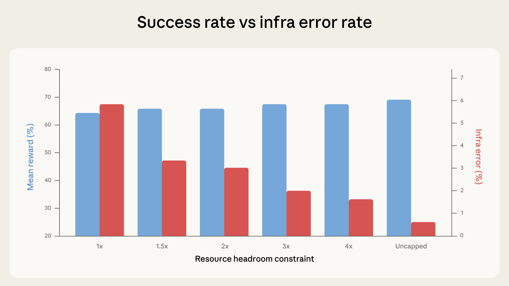

# 量化代理编码评估中的基础设施噪声

## **问题缘起**

我们在 Google Kubernetes Engine 集群上运行 Terminal-Bench 2.0。在校准配置期间，我们发现得分与该基准测试的官方排行榜不一致，基础设施错误率也出奇地高：多达 6% 的任务因 pod 错误而失败，其中大多数与模型解决任务的能力无关。

得分差异源于资源限制的实施方式。我们的 Kubernetes 实现将每个任务的资源规格同时作为保底值和硬上限：每个容器获得了指定的资源保证，但一旦超出就会被立即终止。容器运行时通过两个独立参数来实施资源限制：一个是保证分配量——即预先预留的资源——另一个是硬限制，超过此限制容器会被终止。当这两个值设为相同时，瞬态资源峰值完全没有缓冲余地：短暂的内存波动就可能 OOM 终止一个本可成功的容器。Terminal-Bench 的排行榜使用了不同的沙箱方案，其实现更为宽松，允许临时超量分配而不会终止容器，以优先保障基础设施的稳定性。

这一发现引出了一个更大的问题：资源配置对评估得分的影响到底有多大？

为了量化 harness 的影响，我们在六种资源配置下运行了 Terminal-Bench 2.0，从严格执行每个任务规格（1x，同时作为下限和上限）到完全不限资源。其余一切保持不变：相同的 Claude 模型、相同的 harness、相同的任务集。

在实验中，成功率随资源余量的增加而上升。这主要由基础设施错误率的单调递减所驱动，从严格执行时的 5.8% 下降到不限资源时的 0.5%。从严格执行到 3x 余量之间的下降（5.8% 到 2.1%）在 p < 0.001 水平下显著。余量越大，因超出分配而被终止的容器就越少。

从 1x 到 3x，成功率在噪声范围内波动（p=0.40）。大多数在 1x 时崩溃的任务本来也会失败——这是我们在数据中观察到的现象。代理在探索过程中撞到资源墙并被抢占，但它从未走在通往正确解法的道路上。

然而，从 3x 左右开始，趋势发生了变化：成功率的上升速度超过了基础设施错误的下降速度。

从 3x 到不限资源，基础设施错误额外下降了 1.6 个百分点，而成功率则跃升了近 4 个百分点。额外的资源使代理能够尝试那些只有在大额分配下才行得通的策略，例如拉取大型依赖、生成开销高昂的子进程，以及运行内存密集的测试套件。在不限资源的情况下，相比 1x 的总提升为 +6 个百分点（p < 0.01）。在边际上，`rstan-to-pystan` 和 `compile-compcert` 等任务在获得内存余量后成功率显著提高。

## **这对测量的影响**

在大约 3x Terminal-Bench 规格之前，额外资源修复的是基础设施可靠性问题，即瞬态资源峰值。Terminal-Bench 维护者使用的沙箱方案隐含地在后台做了这件事；评估变得更稳定了，但并没有变得更简单。

然而，超过 3x 标志后，额外资源开始主动帮助代理解决之前无法解决的问题，这表明资源限制实际上会改变评估所测量的内容。严格的限制会意外地奖赏高效策略，而宽松的限制则更宽容，奖赏那些能更好利用所有可用资源的代理。

一个编写精简高效代码且速度很快的代理，在严格约束下表现出色。一个用重量级工具暴力求解的代理，在宽松约束下表现出色。两者都是值得测试的方面，但如果不指定资源配置就将它们合并为一个单一得分，会使差异和现实世界的泛化能力难以解读。

在 `bn-fit-modify` 这个需要贝叶斯网络拟合的 Terminal-Bench 任务上，某些模型的第一步操作是安装标准的 Python 数据科学栈：`pandas`、`networkx`、`scikit-learn` 及其整个工具链。在宽松限制下，这样做没问题。在严格限制下，pod 在安装过程中就会耗尽内存，此时代理还没写一行解法代码。一种更精简的策略确实存在（仅使用标准库从头实现数学计算），部分模型确实会默认采用这种做法。另一些则不会。不同模型有不同的默认策略，而资源配置决定了哪些策略恰好能成功。我们在不同的 Anthropic 模型上复现了这一核心发现。效应的方向一致，但幅度有所不同。同样的趋势似乎在 Claude 以外的模型上也成立，但我们尚未进行严格测试。

我们还通过在 SWE-bench 上运行交叉实验，测试了这种模式是否在 Terminal-Bench 之外的评估中也成立。我们在 227 个问题上以每个问题 10 个样本的规模，将可用总 RAM 最高调整到基线的 5 倍。同样的效应依然存在，只是幅度较小：得分同样随 RAM 单调递增，但 5x 时仅比 1x 时高 1.54 个百分点。SWE-bench 任务的资源密集度较低，因此效应较小是符合预期的，但这表明资源分配在那里也不是中性的。

## **其他方差来源**

资源分配并非唯一的隐藏变量。在某些配置下，时间限制也开始发挥作用。

原则上，评估设置的每一个要素都可能影响最终得分，从集群健康状况到硬件规格，从并发水平到甚至出站带宽。代理评估从构造上就是端到端的系统测试，该系统的任何组件都可能成为混淆因素。例如，我们观察到一个现象：通过率会随一天中的不同时间波动，这可能是因为 API 延迟随流量模式和突发事件而变化。我们尚未正式量化这一效应，但它说明了一个更大的问题："模型能力"与"基础设施行为"之间的边界，比单一基准测试得分所暗示的要模糊得多。模型提供商可以通过专用硬件来使其评估基础设施免受此类影响，但外部评估者难以做到同样的事。

公开基准测试通常旨在测量纯粹的模型能力，但在实践中，它们有可能将其与基础设施的特殊行为混为一谈。有时这可能是可取的，因为它能实现对整个技术栈的端到端测试，但更多时候并非如此。对于旨在公开共享的编码评估，在多个时间点和多天运行有助于平均掉噪声。

## **我们的建议**

理想情况是在完全相同的硬件条件下运行每个评估——包括运行评估的 harness 和推理堆栈——因为这样可以确保完美的可重现性。然而，这并不总是切实可行的。

鉴于容器运行时实际通过保证分配量和独立的硬终止阈值来实施资源限制，我们建议评估为每个任务同时指定这两个参数，而非单一固定值。单一精确规格会将保证分配量设为与终止阈值相等，没有任何余量：我们在 1x 时记录到的瞬态内存峰值就足以破坏评估的稳定性。分离这两个参数可以让容器有足够的缓冲空间来避免虚假的 OOM 终止，同时仍然通过硬上限来防止得分膨胀。

两者之间的区间应当经过校准，使得在下限和上限处获得的得分落在彼此的噪声范围内。例如，在 Terminal-Bench 2.0 中，将上限设为每个任务规格的 3x，将基础设施错误率降低了约三分之二（5.8% 到 2.1%，p < 0.001），同时得分的提升幅度适中且完全在噪声范围内（p = 0.40）。这是一个合理的折衷：基础设施混淆因素被基本消除，同时又没有移除有意义的资源压力。具体倍数因基准测试和任务分布而异，因此应当予以报告，但这一经验校准原则是通用的。

## **我们为何关注**

这些发现在评估基础设施之外也有实际影响。基准测试得分正越来越多地被用作决策依据，但这种日益增长的重视（和依赖）并不总是伴随着运行和报告方式上相应的严谨性。就目前情况而言，排行榜上 2 分的领先可能反映的是真正的能力差异，也可能仅仅反映的是某个评估运行在更强的硬件上，甚至是在一天中更幸运的时间，或者两者兼有。如果没有公开（或标准化）的设置配置，外部人员很难判断，除非有相关方花额外精力在相同条件下重现客观结果。

对于像 Anthropic 这样的实验室，这意味着代理评估的资源配置应当被视为一等实验变量，以与提示词格式或采样温度同等的严谨性进行记录和控制。对于基准测试维护者来说，发布推荐的资源规格（如 Terminal-Bench 2.0 所做的那样）大有裨益，同时指定限制实施方法可以弥补我们发现的差距。而对于任何使用基准测试结果的人，核心结论是：代理评估上的小得分差异所携带的不确定性，比报告数字的精确度所暗示的要大——尤其是因为某些混淆因素实在难以控制。

在资源方法标准化之前，我们的数据表明，排行榜上低于 3 个百分点的差异值得怀疑，除非评估配置已记录并对齐。在 Terminal-Bench 的中等资源配置范围内，观察到的得分差异略低于 2 个百分点。朴素的二项式置信区间本身就有 1-2 个百分点的跨度；我们在此记录的基础设施混淆因素是叠加在其上的，而非包含在其中。在资源分配范围的极端处，差异达到 6 个百分点。

几分的领先可能标志着真正的能力差距——也可能只是一台更大的虚拟机。

### **致谢**

由 Gian Segato 撰写。特别感谢 Nicholas Carlini、Jeremy Hadfield、Mike Merrill 和 Alex Shaw 的贡献。本工作反映了多个从事编码代理评估的团队的共同努力。有兴趣贡献的候选人欢迎在 [anthropic.com/careers](http://anthropic.com/careers) 申请。
