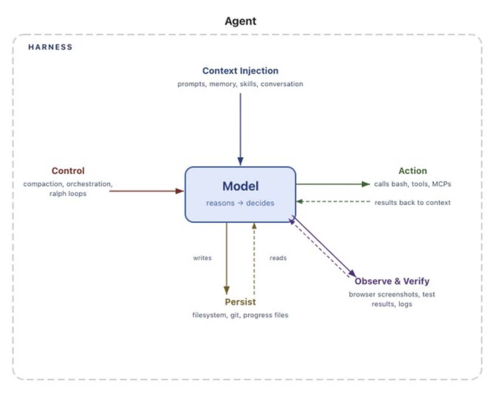
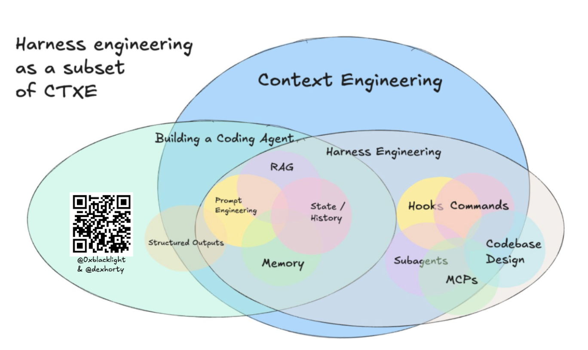
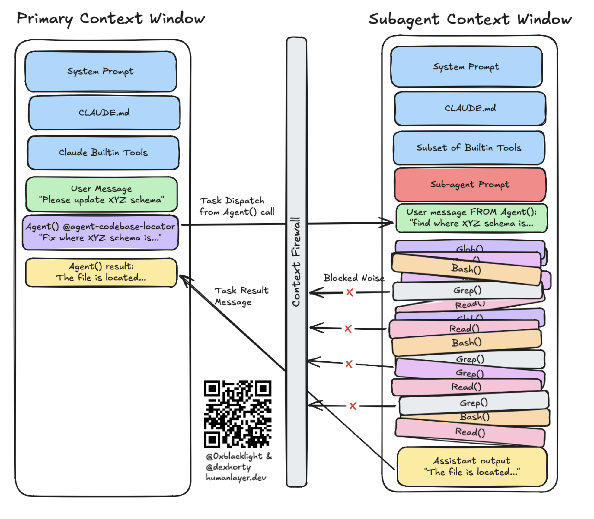
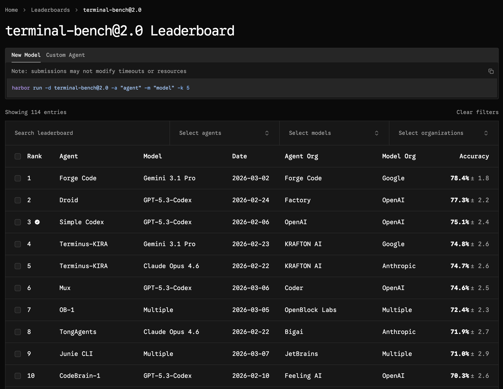
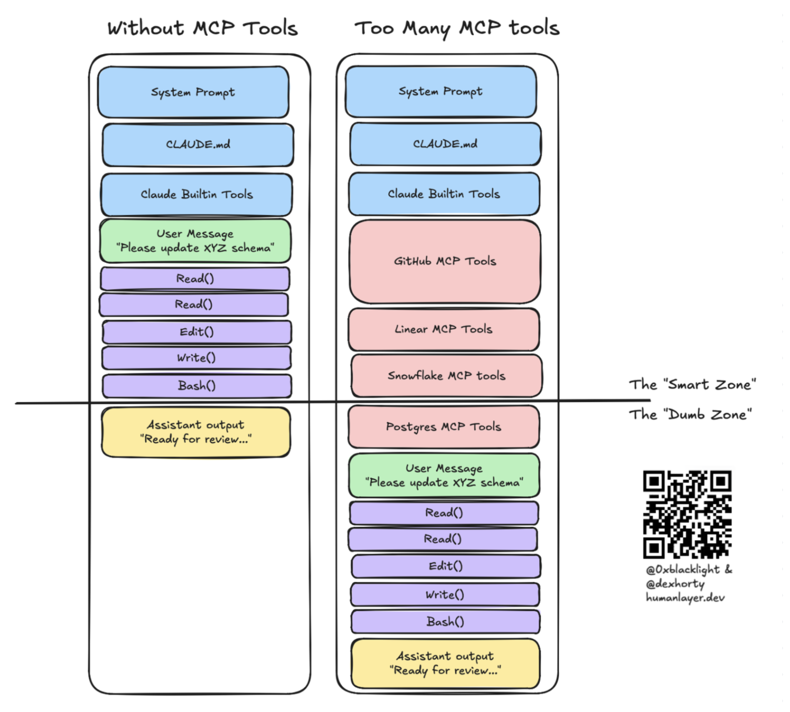
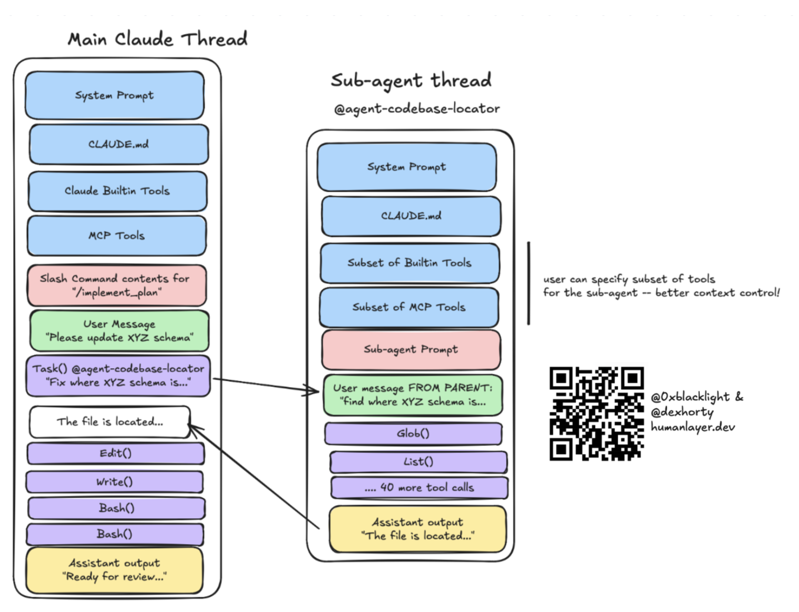
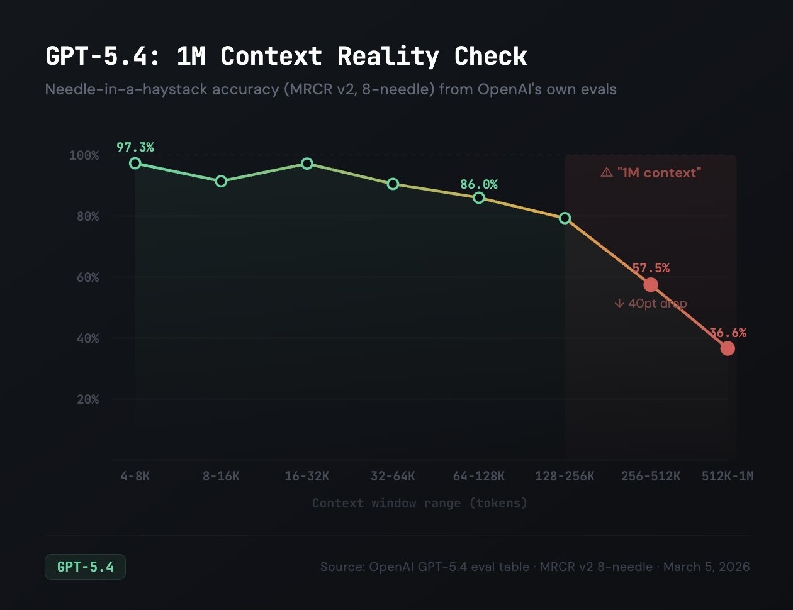
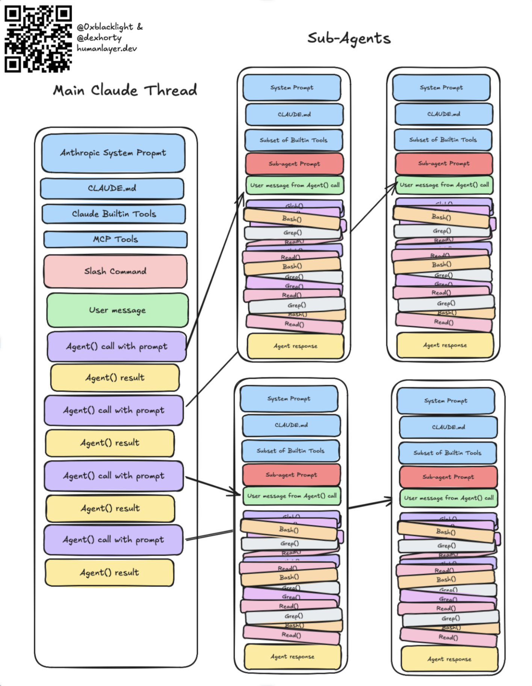
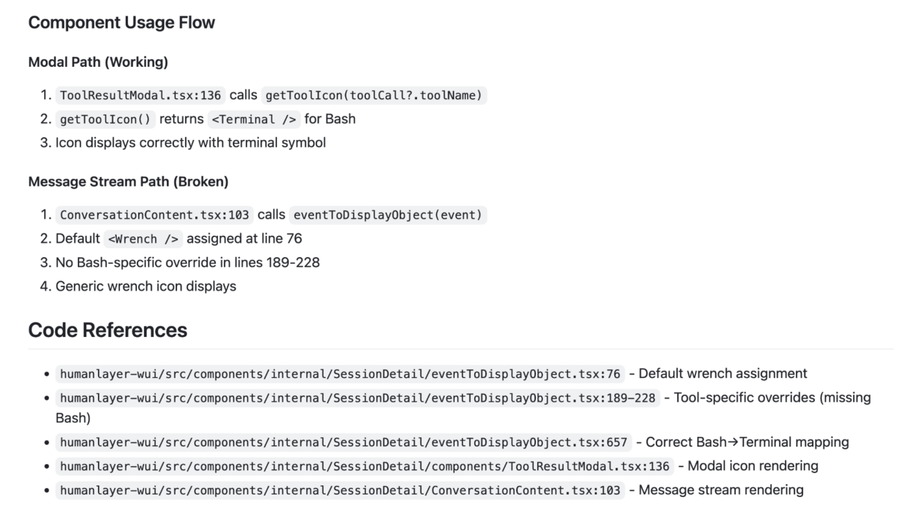
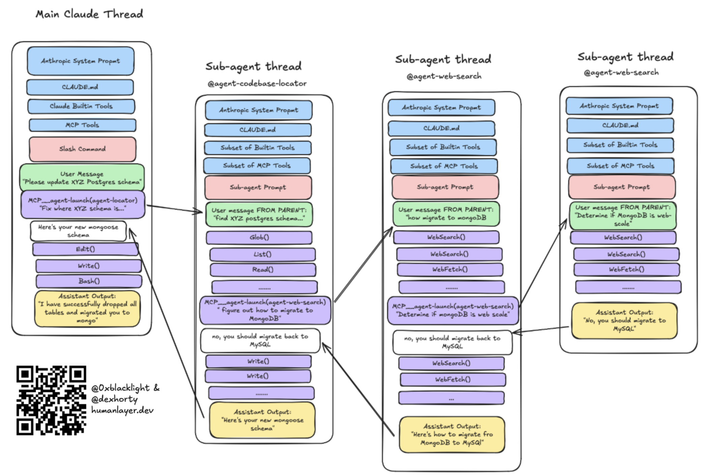

# Skill Issue：编程代理的 Harness 工程

## Harness 工程

**Harness 工程** 由 [Viv](https://x.com/Vtrivedy10) 提出，描述的是利用这些配置点来定制和改善编程代理输出质量与可靠性的实践。

_图片来自 [Viv 的文章](https://blog.langchain.com/the-anatomy-of-an-agent-harness/)_

正如 [Mitchell Hashimoto 所说](https://mitchellh.com/writing/my-ai-adoption-journey#step-5-engineer-the-harness)，harness 工程

> [...] 的核心理念是：每当发现代理犯错，就花时间设计一个解决方案，让该代理永远不再犯同样的错误。

## ……作为上下文工程的子集

我们将 harness 工程视为[上下文工程](https://www.humanlayer.dev/blog/advanced-context-engineering)的一个子集。上下文工程由我的联合创始人 [Dex](https://x.com/dexhorthy) 在 [12-factor agents](https://github.com/humanlayer/12-factor-agents) 中提出，是"提示词工程"以及一系列系统化提升 AI 代理可靠性的技术的超集。你可以在[这里](https://www.youtube.com/watch?v=IS_y40zY-hc)找到原始演讲。

因此，harness 工程就是上下文工程中主要涉及利用 harness 配置点来精心管理编程代理上下文窗口的那部分。



它要回答的问题包括：

*   如何赋予编程代理新的能力？
*   如何教会它训练数据中没有的、关于我们代码库的知识？
*   如何在系统消息中 `CRITICAL: always do XYZ` 这种方式之外增加确定性？
*   如何针对特定代码库调整代理的行为？
*   如何超越"魔法提示词"来提高任务成功率？
*   如何防止上下文窗口过快膨胀或充斥过多无效信息？

Skills、MCP 服务器、子代理、hooks 和反压机制正是我们找到的具体解决方案。

### 关于 Harness 工程的观点

Viv 关于 harness 工程的文章值得与本文一起阅读——[第一篇](https://www.vtrivedy.com/posts/claude-code-sdk-haas-harness-as-a-service)阐述了四个定制杠杆（系统提示词、工具/MCP、上下文、子代理），[第二篇](https://blog.langchain.com/the-anatomy-of-an-agent-harness/)则从模型原生_无法_做到的事情出发，逆向推导出为什么每个 harness 组件都有存在的必要。

_图片来自 [Viv 的文章](https://blog.langchain.com/the-anatomy-of-an-agent-harness/)_

我们还要补充两个他没有强调的杠杆：

1.   **hooks**，用于自动化集成和确定性控制流
2.   **skills**，用于知识的渐进式披露。（Dex 喜欢称它们为"指令模块"——这个以后再详细讨论。）

经过数月在复杂的棕地企业级代码库中解决难题，我们发现子代理是一个尤为强大的杠杆。在处理需要跨越许多上下文窗口才能解决的难题时，**子代理是维持多个会话之间一致性的关键**。子代理**充当"上下文防火墙"**，确保离散任务可以在隔离的上下文窗口中运行，这样中间过程中产生的噪声就不会累积到负责编排的父线程中，从而让你能够在更长时间内保持一致性。



OpenAI 最近也发表了一篇关于该主题的[博客文章](https://openai.com/index/harness-engineering/)。内容很不错，似乎表明他们将 harness 工程视为对代理运行时_之外_所有内容的配置。文章更侧重于反压和验证机制。（不过这可能是一种误读；文章本身有些模糊——"harness"这个词在正文中只出现了一次，而且是在评估的语境中提到的，并非指 harness 工程本身。）

### 那么后训练呢？

鉴于前沿编程模型都经过了针对其 harness 的后训练（例如 Claude 针对 Claude Code，GPT-5 Codex 针对 Codex），有人会认为最好的 harness 和/或配置就是模型训练时所使用的那个。

例如，Codex 模型与 Codex harness 的 `apply_patch` 工具耦合得如此紧密，以至于 [OpenCode](https://opencode.ai/)——一个作为 Claude Code 开源替代方案构建的项目——不得不专门为 GPT/Codex 模型[添加了一个 `apply_patch` 工具](https://github.com/anomalyco/opencode/pull/9127)，通过模拟 Codex harness 来改善 Codex 模型在 OpenCode harness 中的表现——而 Claude 和其他模型仍然使用普通的 `edit` 和 `write` 工具。

这_确实可能_意味着，当模型与其后训练时的 harness 配合使用时表现会更好，有些人可能由此推断出不应该对 harness 进行任何定制。

但事情是双向的：**模型可能对其 harness 过拟合**。Viv 引用了 [Terminal Bench 2.0](https://terminalbench.com/) 的结果，其中 Opus 4.6 在 Claude Code 中排名第 33 位，但当放在一个后训练中未见过的新 harness 中时，它排名第 5 位（上下浮动约 4 个名次）。



## 工程化你的 Harness

基于以上认识，让我们来梳理一下我们发现最有效的配置层面。

### CLAUDE.md 与 AGENTS.md

在接触任何其他 harness 配置点之前，通常值得先定制你的 CLAUDE.md / AGENTS.md 文件。这些是放在仓库顶层的 Markdown 文件，会被 harness 确定性地注入到代理的系统提示词中。

我们已经分享了关于[什么样的 CLAUDE.md 才是好文件](https://www.humanlayer.dev/blog/writing-a-good-claude-md)以及如何正确使用它的看法，如果你还不熟悉，建议先读一读。Matt Pocock 也写了一篇[出色的后续文章](https://www.aihero.dev/a-complete-guide-to-agents-md)，更广泛地适用于 AGENTS.md。

#### 苏黎世联邦理工学院的研究

苏黎世联邦理工学院发表了一项[在多个仓库中测试 138 个代理文件的研究](https://arxiv.org/abs/2602.11988)，指出大多数代理文件不仅没用反而有害。此后我们收到了很多关于我们[CLAUDE.md 文章](https://www.humanlayer.dev/blog/writing-a-good-claude-md)的反馈：

> 看吧，CLAUDE.md 文件根本没用——纯粹浪费时间。

确实：该研究在多种仓库中测试了大量代理文件，发现：

*   LLM 生成的文件实际上_损害_了性能，同时成本增加了 20% 以上
*   人工编写的文件仅提升了约 4%。
*   代理在处理上下文文件指令时多消耗了 14-22% 的推理 token，执行了更多步骤，运行了更多工具——但任务解决率并未提升。
*   代码库概览和目录列表完全没有帮助；代理自己就能很好地发现仓库结构。

仔细阅读该研究后**表明我们在文章中所说的是正确的：**

*   代理生成的文件效果更差。没错，我们说过：

> 避免自动生成。你应该精心手工编写内容以获得最佳效果。

*   很多文件过度引导模型使用特定工具，导致更差的结果。没错，我们说过：

> 指令越少越好。虽然不应省略必要的指令，但应尽可能少地在文件中包含指令。

*   文件包含了不相关的上下文。没错，我们说过：

> 使用渐进式披露

*   人工编写的文件几乎没有帮助，是因为条件规则太多。没错，我们说过：

> 保持 CLAUDE.md 内容简洁且普遍适用。

我们的 CLAUDE.md 不到 60 行。

### MCP 服务器用于工具

MCP 服务器主要用于将工具接入编程代理，以扩展其超越文件 I/O 和 bash 命令的能力。MCP 规范还包含资源、提示词和交互请求等额外功能，但**这些通常不被 MCP 客户端和编程代理 harness 很好地支持**。

MCP 规范支持在（你或代理的）本地机器上运行的服务器，允许代理与其本地环境交互，同时也支持基于 HTTP 的 MCP 服务器，可以将你的代理连接到 Linear、Sentry 等远程工具和服务。

当你将 MCP 服务器接入编程代理时，可用工具的列表、它们的描述以及调用所需的参数**会被注入到编程代理的系统提示词中**。因此，MCP 服务器可以通过工具描述向代理提供关于何时使用这些工具的指令，从而定制代理的行为。

**警告**：由于 MCP 服务器的工具描述会被添加到编程代理的系统提示词中，切勿连接你不信任的服务器。这可能成为提示词注入的危险攻击向量！STDIO 服务器和其他通过 npx 或 uvx 在客户端运行的服务器，即使不存在提示词注入，也可能在你的主机上执行代码。

#### 工具太多反而有害

我们亲身经历过这种情况：向代理接入太多 MCP 工具后，上下文窗口会被工具描述填满，让你更快进入[愚蠢区域](https://youtu.be/rmvDxxNubIg?si=O17nmS3SScaAkpp-&t=355)：



[指令预算](https://www.aihero.dev/a-complete-guide-to-agents-md#the-instruction-budget)也很重要——每个不相关的工具描述都是代理必须处理却毫无收益的指令。

事实上，这些失败模式如此普遍，以至于 Anthropic 发布了[MCP 工具搜索的实验性支持](https://platform.claude.com/docs/en/agents-and-tools/tool-use/tool-search-tool)，用于在用户连接了过多 MCP 工具时向 Claude 渐进式披露工具。简单来说：如果你没有在主动使用某个提供大量工具的服务器，就把它关掉。

我们还发现，如果 MCP 服务器复制了已经作为 CLI 存在且在训练数据中充分体现的功能，直接提示代理使用 CLI 效果更好。对于 GitHub、Docker 或大多数数据库这类工具，你的编程代理可以直接使用相应的 CLI 和 shell 命令。模型在训练中已经见过这些工具足够多次，已经知道如何使用它们，而且你还获得了与 `grep`、`jq` 等工具的可组合性，从而实现更高的上下文效率。

#### 始终进行上下文工程

在 HumanLayer，我们使用 Linear MCP 服务器一段时间后，意识到我们实际上只使用了它提供的一小部分工具——于是我们编写了一个小型 CLI 来封装 Linear API 并提供上下文效率极高的响应，并在我们的 [CLAUDE.md](https://www.humanlayer.dev/blog/writing-a-good-claude-md) 文件中包含了 6 个使用示例：

```
## Linear
Use the Linear CLI for:
- **fetching issues**: `linear get-issue ENG-XXXX`
- **listing issues**: `linear list-issues` or `linear my-issues`
- **adding comments**: `linear add-comment -i ENG-XXXX "comment"`
- **adding links**: `linear add-link ENG-XXXX "url" -t "link title"`
- **updating status**: `linear update-status ENG-XXXX "status name"` ("spec needed", "research needed", "research in progress", "research in review", "ready for plan", "plan in progress", "plan in review", "ready for dev", "in dev", "code review")
- **get branch name**: `linear get-issue-v2 ENG-XXXX --fields branch` (use this when creating a worktree)
- **get images from the ticket**: `linear fetch-images ENG-XXXX` (do this any time the ticket has images in the description)
```

这为我们节省了 MCP 服务器工具定义占用的数千个 token（这些本来会出现在代理的系统提示词中），以及 MCP 服务器冗长响应带来的更多 token 消耗。

### Skills 用于可复用的知识（和工具）

Skills 最初由 Anthropic 引入用于 Claude Code，但后来已成为开放标准，被 Codex 和 OpenCode 等其他 harness 支持。你可以在 [Anthropic 文档](https://platform.claude.com/docs/en/agents-and-tools/agent-skills/overview)中了解它们的结构——这里重要的是它们_为什么_有用。

在继续之前需要注意：技能注册中心已经被发现[分发数百个恶意技能](https://www.esecurityplanet.com/threats/hundreds-of-malicious-skills-found-in-openclaws-clawhub/)。对待技能就像对待 `npm install random-package` 一样——先阅读你要安装的内容。[ClawHub](https://docs.openclaw.ai/tools/clawhub) 和 [skills.sh](https://skills.sh/) 等注册中心可以在你的机器上执行任意代码。

#### 渐进式披露

我们很早就学到了这一点：我们不断将所有指令和工具塞进系统提示词，代理的表现却越来越差。在代理还没开始工作之前，我们就已经耗尽了[指令预算](https://www.aihero.dev/a-complete-guide-to-agents-md#the-instruction-budget)。Skills 通过**渐进式披露**解决了这个问题——代理只有在自己决定（或你为它决定）需要时，才能访问特定的指令、知识或工具。

#### Skill 激活

当某个 skill 被激活时，该 skill 目录中的 `SKILL.md` 文件会作为用户消息加载到代理的上下文窗口中，同时代理会被告知该 skill 文件所在的目录。`SKILL.md` 文件可以告知代理与之捆绑的其他内容：

```
example-skill/
|--- SKILL.md
|--- response_template.md
|--- CLIs/
   |--- linear-cli
   |--- tunnel-cli
```

由于每个 skill 都有自己的目录，你可以在渐进式披露方面发挥更多创意：你可以在 skill 中捆绑多个 Markdown 文件，每个文件包含关于不同功能或不同用途的不同信息，而主 `SKILL.md` 文件可以告诉代理 skill 中其他文件是什么，以及是否/何时应该读取它们。

#### 通过 Skills 分发工具

遗憾的是，无法将 MCP 服务器或自定义代理工具直接捆绑到 skill 中——你必须将它们写成一个可执行文件、CLI、NPM 包或其他形式，然后随 skill 一起分发或在 skill 文件中指示代理安装。

例如，与其配置一个 Playwright MCP 服务器，不如直接使用 BrowserBase 的[代理浏览器 skills](https://github.com/browserbase/skills) 或 Vercel 的[代理浏览器 CLI](https://github.com/vercel-labs/agent-browser)为你的代理提供一个网页浏览 skill。

### 子代理用于上下文控制

子代理是一个流行但经常被误解的 harness 配置点。我们尝试过"前端工程师"子代理、"后端工程师"子代理和"数据分析师"子代理的做法。这不管用。真正有效的是将子代理用于[上下文控制](https://www.humanlayer.dev/blog/advanced-context-engineering)。

它们提供了一种封装整个编程代理会话工作的方式，使得调度代理只看到它为子代理编写的提示词和子代理的最终结果。所有中间的工具调用、工具结果或其他消息都不会出现在父编程代理的上下文窗口中。



将工作分解为离散任务并委派给子代理，是我们让主编程代理线程保持在"聪明区域"的方法。这也是我们在日常工作中处理研究、实现以及许多其他上下文密集型任务的方式。

#### 子代理避免上下文腐烂

Chroma 的[上下文腐烂研究](https://research.trychroma.com/context-rot)为我们一直以来的观点提供了实证支持：模型在更长的上下文长度下表现更差。[避免愚蠢区域](https://youtu.be/rmvDxxNubIg?si=O17nmS3SScaAkpp-&t=355)。

Chroma 研究人员在大海捞针任务上测试了 18 个模型，这当然与代理式编程有很大不同。但该发现与我们的经验完全一致：随着上下文长度增加，性能下降——即使在简单任务上也是如此。

更糟糕的是，当问题与上下文中相关信息之间的语义相似度较低时，退化更加_严重_。我们实时观察到了这种情况：父会话中每一个最终无关的中间工具调用、每一个 grep 结果、每一次文件读取都是潜在的干扰项，而 Chroma 的研究证实干扰项效应在更长的上下文窗口中会_累积_。

#### 附注：长上下文模型

这也是我们对编程代理"只要把上下文窗口做大就行"这种方法持怀疑态度的原因。当实验室提供某个模型的扩展上下文版本时，你通常获得的并不是一个拥有更大"指令预算"的更大模型——而是同一个模型加上一些巧妙的数学技巧（例如 [YaRN](https://arxiv.org/pdf/2309.00071)）来扩展模型能关注的序列长度。

考虑大海捞针问题。更大的上下文窗口并不会让模型更擅长找到针——它只是让那堆“干草”变得更大。对我们的目的而言，这意味着你可以往上下文窗口里塞入更多指令（每条用户消息_至少_是一条指令，通常是多条）——让你越来越深入"愚蠢区域"。



如果你觉得自己需要更长的上下文，你可能只是需要更好的上下文窗口隔离。子代理从结构上解决了这个问题：每个子代理都获得一个全新的、小巧的、高相关度的上下文窗口以及该任务全新的"指令预算"，只有精简后的结果回传给父代理——这让你能够为单个问题串联多个上下文窗口。

极限情况可能看起来像这样，不过在某个时刻你就跨入了[递归语言模型](https://alexzhang13.github.io/blog/2025/rlm/)的领域。



（注：为简洁起见省略了部分箭头。）

#### 子代理的使用场景

适合使用子代理的好例子包括：

*   在代码库中定位特定的定义或实现
*   分析代码库以识别特定类型工作的模式
*   追踪信息在代码库中的流转路径，例如追踪跨服务边界的请求
*   其他通用代码/文档/Web 研究任务

这些类型的任务通常有明确的提问和简单的答案，但需要大量中间工具调用，而这些调用你不想也不需要在父会话中看到。子代理应返回高度精简的响应，并遵循渐进式披露原则。例如，我们的子代理提供问题的答案，同时以 `filepath:line` 格式或 URL 引用来源，这样父代理不会暴露于子代理使用的所有源材料，但如果需要更多细节或确认，它有足够的信息去找到相关上下文：



Dex 在[这里](https://www.youtube.com/watch?v=IS_y40zY-hc)更详细地讨论了这一点。

Claude Code 和其他一些编程代理甚至提供了内置的、特定任务的子代理，例如 Claude Code 的 `Explore` 子代理用于代码库探索，或其 `Bash` 子代理专门用于执行冗长的 bash 命令并提取信息返回给父代理而不污染其上下文。其他编程代理支持子代理但不定义自己的子代理，需要用户在需要时手动配置。

#### 子代理（也）用于成本控制

子代理也可以帮助控制成本。我们在需要深度思考的父会话（如规划和编排）中使用昂贵的模型（Opus），而在每个子代理中使用更便宜、更快的模型如 Sonnet 或 Haiku。子代理接收的是更小、更离散的任务，可以由一个更小的"指令预算"的智能程度较低的模型处理——没必要为了代码库搜索浪费 Opus token。

#### 听说你喜欢子代理

有些 harness 根本不支持子代理！即使 Codex 也是直到最近才支持的，而且支持仍是[实验性的](https://developers.openai.com/codex/multi-agent/)。

幸运的是，你仍然可以使用这种强大的上下文封装模式，只需编写一个 MCP 服务器来提供一个工具，用于启动新的代理会话，该会话从父代理接收提示词，以该提示词作为用户消息启动新的编程代理会话，并将子代理的最终响应消息返回给父代理。

[这里](https://github.com/humanlayer/claudelayer/blob/main/src/index.ts)可以看到一个_非常_粗糙的近似实现。**警告**：如果将此模式用于支持子代理的编程代理，harness 的原生子代理将能够通过 MCP 调度子代理。这可能导致不可预测的传话游戏：



玩笑归玩笑，实际上你在编写子代理的系统提示词时必须非常小心地明确指定其职责范围：

*   代理的角色是什么——它应该做什么，同时它**不应该**做什么
*   代理应该返回什么信息，以及**如何**返回
*   子代理应该拥有哪些工具？

还值得注意的是，许多 harness 有 MCP 工具调用超时限制——如果你实现这种模式，可能需要配置 harness 以增加 MCP 工具调用超时时间。

### Hooks 用于控制流

Claude Code 有 [hooks](https://code.claude.com/docs/en/hooks) 的概念：用户定义的命令或脚本，在特定事件发生时以及代理生命周期的各个节点自动执行。类似地，[Opencode](https://opencode.ai/) 有[插件](https://opencode.ai/docs/plugins/)的概念，功能相同。其他编程代理可能有类似的配置点。（遗憾的是，Codex [没有等效功能](https://github.com/openai/codex/discussions/2150)。）

Hooks 在概念上类似于 [git hooks](https://git-scm.com/book/en/v2/Customizing-Git-Git-Hooks)，但它们[非常灵活](https://karanbansal.in/blog/claude-code-hooks/)。它们可以用于添加新功能、集成外部服务、自动化常规操作、修改权限以及配置默认行为。

不同 harness 的实现细节各不相同，但通常 hook 可以：

*   在事件发生时自动且静默地运行某些操作
*   在工具被调用时运行，并在工具结果之外向代理返回额外的上下文
*   在编程代理完成之前向其呈现构建/类型错误，迫使它继续工作直到解决错误

常见用例包括……

*   **通知**：我们将代理配置为在完成工作或需要关注时播放声音（例如审批已等待太久）

*   **审批**：我们根据输入值和比编程代理默认权限模型更具表达力的规则，自动批准或拒绝工具调用。例如，我们自动拒绝任何尝试运行迁移的 `Bash()` 工具调用，并附带一条指示让代理转而请求用户手动运行。

*   **集成**：我们让代理在完成后发送 Slack 消息、创建 GitHub PR 或设置预览环境。

*   **验证**：如果你的框架和仓库能在几秒内完成类型检查或构建，就在代理每次停止时运行它以向代理呈现错误——下面这个 hook 正是做这件事的。

#### 一个 Hook 示例

这是我（通过 Claude）为我们的仓库编写的一个 hook，实现了上面最后一个例子。当 Claude 停止工作时，它会运行我们的 biome 格式化器和 TypeScript 类型检查。如果有错误，就会呈现给 Claude。如果没有，脚本静默退出。

```
#!/bin/bash
cd "$CLAUDE_PROJECT_DIR"

# prebuild generates types and builds internal SDK packages so typecheck has
# everything it needs. runs bun install afterward to pick up any new generated files.
PREBUILD_OUTPUT=$(bun run generate-cache-key && turbo run build --filter=@humanlayer/hld-sdk && bun install 2>&1)
if [ $? -ne 0 ]; then
  echo "prebuild failed:" >&2
  echo "$PREBUILD_OUTPUT" >&2
  exit 2
fi

# biome and typecheck run in parallel to keep the feedback loop tight.
# one quirk: biome --write exits with code 1 if it made any changes, even if it
# successfully fixed everything. so we run it twice with ||: if the first pass
# makes changes and exits 1, the second pass will exit 0 since there's nothing
# left to fix. if there are unfixable errors, both passes fail and exit 2.
OUTPUT=$(bun run --parallel \
  "biome check . --write --unsafe || biome check . --write --unsafe" \
  "turbo run typecheck" 2>&1)

if [ $? -ne 0 ]; then
  echo "$OUTPUT" >&2
  exit 2
fi
```

成功时 hook 完全静默——不会向代理的上下文中添加任何内容。失败时只有错误被呈现，退出码 `2` 告诉 harness 重新激活代理，让它在完成之前修复这些错误。

## 反压机制提高成功率

我们[之前写过关于反压的文章](https://www.humanlayer.dev/blog/context-efficient-backpressure)。核心洞察是：使用编程代理成功解决问题的概率与代理验证自身工作的能力高度相关。我们在仓库中花了大量时间构建测试和其他反压机制，这仍然是我们**投入时间最高杠杆的事情之一**。

我们的代码库拥有让代理自行检查工作的验证机制：

*   类型检查和构建步骤（[最好使用强类型语言](https://arxiv.org/pdf/2504.09246)）
*   单元测试和/或集成测试
*   代码覆盖率报告（我们有一个 `Stop` hook，在覆盖率下降时提示代理增加覆盖率）
*   UI 交互和测试集成（Playwright、[agent-browser](https://github.com/vercel-labs/agent-browser) 等）

关键的是，这些验证机制需要**上下文高效**。这个教训我们是通过惨痛经验学到的——早期我们让代理在每次更改后运行完整测试套件，4000 行通过的测试结果会淹没上下文窗口。代理随后会偏离实际任务，开始对它刚读过的测试文件产生幻觉。现在我们[吞掉输出，只呈现错误](https://www.humanlayer.dev/blog/context-efficient-backpressure)。构建也是同样的做法——成功静默，只有失败才产生详细输出。

我们在 CLAUDE.md 文件中给 Claude 关于如何使用所有这些机制的**简洁**指令。有些甚至捆绑在 skills 中以实现**渐进式披露**。

## 结语

完全有可能花在优化编程代理配置上的时间比实际用它交付代码的时间还多——我们也有过这样的经历。

我们的方法是：倾向于交付。我们只在实际能够帮助我们更快地交付更高质量代码的范围内，才花时间在 harness 配置上。当代理失败时，我们花时间设计解决方案以避免下次再犯同样的错误——但我们不会主动去找问题预防性地解决。

**对我们不起作用的做法：**

*   在遇到真正的失败之前就试图预先设计理想的 harness 配置
*   "以防万一"安装几十个 skills 和 MCP 服务器
*   在每次代理会话结束时运行完整测试套件（5 分钟以上）（改为运行子集）
*   试图微观优化哪些子代理可以访问哪些工具。这导致大量工具切换，结果反而更差。大多数编程代理在这方面本身就没有健壮的配置界面。

**对我们有效的做法：**

*   从简单开始，只在代理实际失败时才添加配置
*   设计、测试、迭代——并扔掉没有帮助的东西。我扔掉的 hook 比我们实际使用的多得多。
*   通过仓库级配置将经过实战检验的配置分发给整个团队
*   优化迭代速度，而不是"首次一次成功通过的概率"
*   先给代理一组能力（Linear），然后在我们弄清楚真正需要什么之后，再仔细精简暴露给模型的内容。

下次你的编程代理表现不如预期时，在归咎于模型之前，先检查 harness。代理文件、MCP 服务器、skills、子代理、hooks 和反压机制——我们的杠杆主要就在这里。模型大概率没问题。这大概只是个 skill issue。
