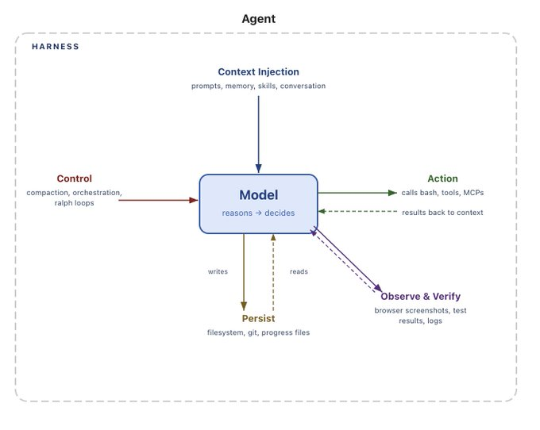

# Agent Harness 的解剖学

## 谁来定义一下 "Harness"？

Agent = Model + Harness

**如果你不是模型本身，那你就是 harness。**

Harness 是除模型本身之外的所有代码、配置和执行逻辑的总和。裸模型本身并不是代理。但当 harness 赋予它状态、工具执行、反馈循环和可强制执行的约束时，它就成了代理。

具体来说，harness 包括以下内容：

*   系统提示词
*   工具、技能、MCP 及其描述
*   内置基础设施（文件系统、沙箱、浏览器）
*   编排逻辑（子代理生成、交接、模型路由）
*   用于确定性执行的钩子/中间件（压缩、续接、lint 检查）

在模型和 harness 之间划分代理系统边界的方式有很多，而且往往很混乱。但我认为这是最清晰的定义，因为它迫使我们去思考如何**围绕模型智能来设计系统**。

本文的剩余部分将梳理核心 harness 组件，并从模型这一核心原语出发，逆向推导每部分存在的**原因**。

## 为什么需要 Harness……从模型的角度来看

**我们希望代理能做到一些模型开箱即用做不到的事情。这就是 harness 的用武之地。**模型（通常）接收文本、图像、音频、视频等数据，然后输出文本。仅此而已。开箱即用时，它们无法：

*   在交互之间维护持久状态
*   执行代码
*   获取实时知识
*   搭建环境并安装依赖包来完成工作

这些都是 **harness 级别的功能**。LLM 的结构需要某种包装机制才能完成有用的工作。例如，要实现"聊天"这样的产品体验，我们会把模型包装在一个 while 循环中，跟踪历史消息并追加新的用户消息。本文的每位读者都已经使用过这种 harness。核心思想是：我们希望将期望的代理行为转化为 harness 中的实际功能。

## 从期望的代理行为逆向推导 Harness 工程

Harness 工程帮助人类注入有用的先验知识来引导代理行为。随着模型能力的提升，harness 已被用于精准地扩展和修正模型，以完成此前不可能的任务。

我们不会穷举每一个 harness 功能。目标是从帮助模型完成有用的工作这一出发点，推导出一组功能。我们将遵循这样的模式：

**我们想要的行为（或想要修复的问题）→ 帮助模型实现该行为的 Harness 设计。**

## 文件系统：持久存储与上下文管理

**我们希望代理拥有持久存储，以对接真实数据、卸载超出上下文容量的信息，并在会话之间持久化工作成果。**

模型只能直接操作其上下文窗口内的知识。在引入文件系统之前，用户必须将内容直接复制粘贴给模型，这种用户体验很糟糕，对自主代理也不可行。人类早已在使用文件系统来工作，因此模型自然而然地在数十亿 token 的“如何使用文件系统”数据上受过训练。自然的解决方案是：

**Harness 内置文件系统抽象和文件系统操作工具。**

文件系统可以说是最基础的 harness 原语，因为它解锁了以下能力：

*   代理获得一个工作区，可以读取数据、代码和文档。
*   工作成果可以增量添加和卸载，而不必将所有内容保留在上下文中。代理可以存储中间输出，并维护超出单次会话生命周期的状态。
*   **文件系统是天然的协作界面。** 多个代理和人类可以通过共享文件进行协调。像 Agent Teams 这样的架构就依赖于此。

Git 为文件系统添加了版本控制，使代理能够跟踪工作进度、回滚错误和分支实验。我们将在下面再次讨论文件系统，因为事实证明它是我们所需的其他功能的关键 harness 原语。

## Bash + 代码作为通用工具

**我们希望代理能够自主解决问题，而不需要人类预先设计每一个工具。**

如今主流的代理执行模式是 [ReAct 循环](https://docs.langchain.com/oss/python/langchain/agents?ref=blog.langchain.com)，模型先推理，然后通过工具调用执行动作，观察结果，并在 while 循环中重复。但 harness 只能执行它们有逻辑的工具。与其强迫用户为每一个可能的动作构建工具，更好的方案是给代理一个像 bash 这样的通用工具。

**Harness 内置 bash 工具，使模型能够通过编写和执行代码来自主解决问题。**

Bash + 代码执行是朝**给模型一台计算机**、让它们自主搞定剩下的事情迈出的一大步。模型可以通过代码即时设计自己的工具，而不受预配置工具集的限制。

Harness 仍然会内置其他工具，但代码执行已成为自主解决问题的默认通用策略。

## 沙箱与工具：执行和验证工作

**代理需要一个具有合理默认值的环境，以便安全地执行操作、观察结果并取得进展。**

我们已经给了模型存储和执行代码的能力，但这一切需要在某个地方进行。在本地运行代理生成的代码是有风险的，而且单一本地环境无法扩展到大规模的代理工作负载。

**沙箱为代理提供安全的运行环境。** Harness 不必在本地执行，而是可以连接到沙箱来运行代码、检查文件、安装依赖和完成任务。这实现了安全、隔离的代码执行。为了更高的安全性，harness 可以设置命令白名单并强制网络隔离。沙箱也带来了可扩展性，因为环境可以按需创建、扇出到多个任务，并在工作完成后销毁。

**好的环境自带好的默认工具。** Harness 负责配置工具，使代理能完成有用的工作。这包括预装语言运行时和包、用于 git 和测试的 CLI、用于网页交互和验证的[浏览器](https://github.com/vercel-labs/agent-browser?ref=blog.langchain.com)。

浏览器、日志、截图和测试运行器等工具让代理能够观察和分析自己的工作。这帮助它们建立**自我验证循环**：编写应用代码、运行测试、检查日志并修复错误。

模型开箱即用时无法自行配置执行环境。决定代理在哪里运行、有哪些工具可用、能访问什么资源以及如何验证工作，都是 harness 级别的设计决策。

## 记忆与搜索：持续学习

**代理应该记住它们见过的东西，并获取训练时不存在的信息。**

模型除了权重和当前上下文中的内容之外，没有额外的知识。在不修改模型权重的情况下，"添加知识"的唯一方式是**上下文注入。**

对于记忆，文件系统再次成为核心原语。Harness 支持 [AGENTS.md](http://agents.md/?ref=blog.langchain.com) 等记忆文件标准，这些文件在代理启动时被注入上下文。随着代理添加和编辑此文件，harness 会将更新后的文件加载到上下文中。这是一种[持续学习](https://www.ibm.com/think/topics/continual-learning?ref=blog.langchain.com)的形式——代理将一次会话中的知识持久存储，并在未来会话中注入该知识。

知识截止日期意味着，如果没有用户直接提供，模型无法直接获取更新的库版本等新数据。为了获取最新知识，Web 搜索和 [Context7](https://context7.com/?ref=blog.langchain.com) 等 MCP 工具帮助代理访问超出知识截止日期的信息，如新版本库或训练停止时还不存在的当前数据。

Web 搜索和用于查询最新上下文的工具是值得内置到 harness 中的有用原语。

## 对抗上下文腐化

**代理的性能不应随着工作推进而退化。**

[上下文腐化](https://research.trychroma.com/context-rot?ref=blog.langchain.com)描述了随着上下文窗口被填满，模型在推理和完成任务方面变得更差的现象。上下文是宝贵且稀缺的资源，因此 harness 需要策略来管理它。

**如今的 harness 在很大程度上是良好上下文工程的交付机制。**

**压缩**解决的是上下文窗口即将填满时该怎么办的问题。没有压缩的话，对话超过上下文窗口会怎样？一种情况是 API 报错，这可不好。Harness 必须为此场景使用某种策略。因此，压缩会智能地卸载和摘要现有的上下文窗口，使代理能够继续工作。

**工具调用卸载**有助于减少大型工具输出对上下文窗口的影响——这些输出可能噪声很大但不提供有用信息。Harness 保留超过阈值 token 数的工具输出的头部和尾部 token，并将完整输出卸载到文件系统，以便模型在需要时访问。

**技能**解决的是启动时有过多工具或 MCP 服务器被加载进上下文的问题，这会在代理开始工作之前就降低性能。技能是 harness 级别的原语，通过**渐进式披露**来解决这个问题。模型并没有选择在启动时将 Skill front-matter 加载到上下文中，但 harness 可以支持此功能以保护模型免受上下文腐化。

## 长时间跨度的自主执行

**我们希望代理能够在长时间跨度内自主、正确地完成复杂工作。**

自主软件创建是编码代理的终极目标。但当今的模型存在提前停止、复杂问题分解困难，以及工作跨越多个上下文窗口时出现不一致等问题。好的 Harness 必须围绕所有这些问题进行设计。

这正是前面提到的 harness 原语开始发挥协同作用的地方。长跨度工作需要持久状态、规划、观察和验证，才能在多个上下文窗口间持续工作。

**文件系统和 git 用于跨会话跟踪工作。** 代理在一个长任务中会产生数百万 token，因此文件系统可以持久捕获工作成果以跟踪进度。添加 git 后，新代理可以快速了解最新的工作进展和项目历史。对于多个代理协同工作，文件系统还充当共享工作账本，代理可以在其中协作。

**Ralph 循环用于继续工作。** [Ralph Loop](https://ghuntley.com/loop/?ref=blog.langchain.com) 是一种 harness 模式，它通过钩子拦截模型的退出尝试，并在干净的上下文窗口中重新注入原始提示词，强制代理继续朝着完成目标工作。文件系统使这成为可能，因为每次迭代以全新的上下文开始，但会读取上一次迭代的状态。

**规划和自我验证以保持正轨。** 规划是指模型将目标分解为一系列步骤。Harness 通过良好的提示词和在文件系统中注入如何使用计划文件的提醒来支持这一点。完成每一步后，代理通过**自我验证**来检查工作的正确性。Harness 中的钩子可以运行预定义的测试套件，在失败时将错误信息回传给模型，或者可以提示模型独立自评其代码。验证将解决方案锚定在测试上，并为自我改进创建反馈信号。

## Harness 的未来

## 模型训练与 Harness 设计的耦合

如今的 Claude Code 和 Codex 等代理产品，在后训练时会让模型与 harness 一起参与闭环。这帮助模型提升那些 harness 设计者认为它们应当原生擅长的能力，例如文件系统操作、bash 执行、规划，以及通过子代理并行化工作。

这形成了一个反馈循环。有用的原语被发现、添加到 harness 中，然后被用于训练下一代模型。随着这个循环不断重复，模型在其受训所依赖的 harness 中会变得越来越强。

但这种协同演化也会对泛化能力带来有趣的副作用。例如，改变工具逻辑就可能导致模型性能下降。[Codex-5.3 提示词指南](https://developers.openai.com/cookbook/examples/gpt-5/codex_prompting_guide/?ref=blog.langchain.com#apply_patch)中就给出了一个很好的例子，讨论了用于编辑文件的 `apply_patch` 工具逻辑。一个真正智能的模型在切换不同补丁方法时本不该遇到太大困难，但让 harness 参与训练会造成这种过拟合。

**但这并不意味着最适合你任务的 harness 就是模型后训练时使用的那个。** [Terminal Bench 2.0 排行榜](https://www.tbench.ai/leaderboard/terminal-bench/2.0?ref=blog.langchain.com)就是一个很好的例子。Opus 4.6 在 Claude Code 中的得分远低于在其他 harness 中的 Opus 4.6。[在之前的博客](https://x.com/Vtrivedy10/status/2023805578561060992?s=20&ref=blog.langchain.com)中，我们展示了仅通过更改 harness 就将编码代理在 Terminal Bench 2.0 上的排名从 Top 30 提升到 Top 5。优化 harness 以适配你的任务，还有很大的提升空间。

## Harness 工程的发展方向

随着模型变得更强大，今天存在于 harness 中的一些功能将被吸收到模型中。模型将在规划、自我验证和长跨度一致性方面变得更好，从而减少对上下文注入等的需求。

这似乎表明 harness 随时间推移会变得不那么重要。但就像提示词工程至今仍然有价值一样，harness 工程可能将继续对构建好的代理发挥重要作用。

确实，如今的 harness 很大程度上在弥补模型的不足，但它们也在围绕模型智能构建系统，使其更加高效。一个配置良好的环境、合适的工具、持久的状态和验证循环，无论模型的基础智能如何，都能让它更加高效。

Harness 工程是一个非常活跃的研究领域，我们在 LangChain 用它来改进我们的 harness 构建库 [deepagents](https://docs.langchain.com/oss/python/deepagents/overview?ref=blog.langchain.com)。以下是我们目前正在探索的几个开放且有趣的问题：

*   编排数百个代理在共享代码库上并行工作
*   代理分析自己的执行轨迹，以识别和修复 harness 级别的故障模式
*   Harness 动态组装适合特定任务的工具和上下文，而非预先配置

这篇文章试图定义什么是 harness，以及它如何被我们希望模型完成的工作所塑造。

**模型包含智能，而 harness 是让这种智能变得有用的系统。**

愿我们构建更多 harness，打造更好的系统和更好的代理。
