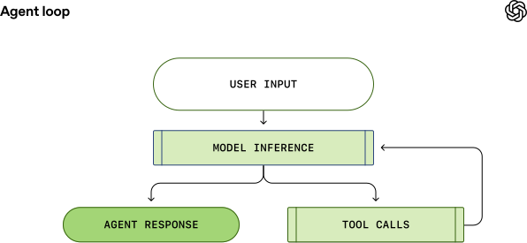
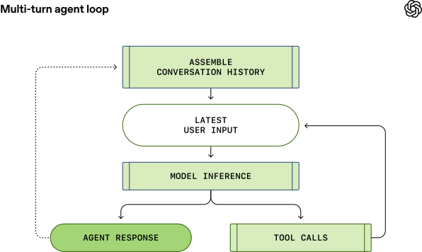
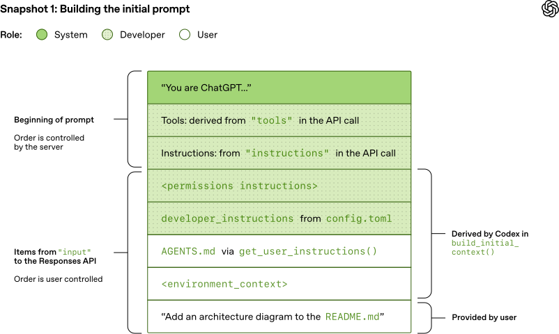
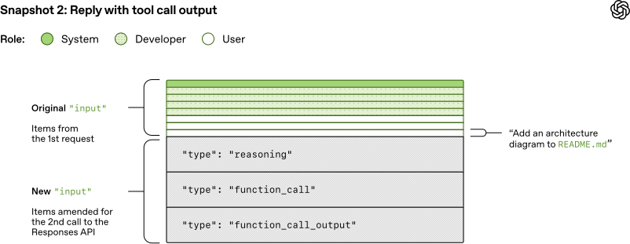
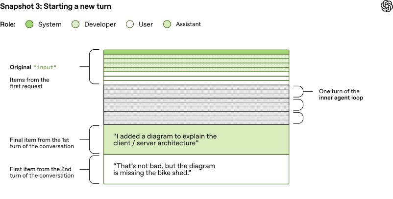
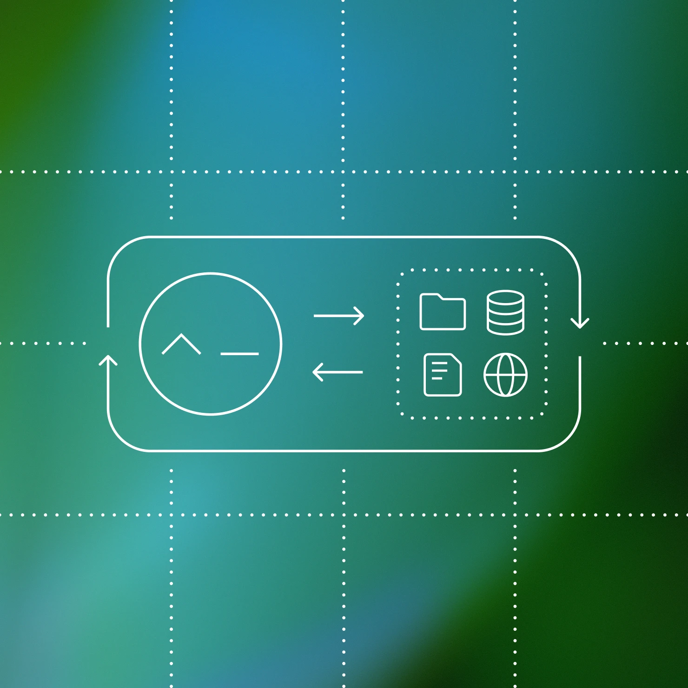

# 展开 Codex 代理循环

作者：Michael Bolin，技术团队成员

[Codex CLI⁠(在新窗口中打开)](https://developers.openai.com/codex/cli) 是我们的跨平台本地软件代理，旨在安全高效地在你的机器上运行，同时产出高质量、可靠的软件变更。[自我们在 4 月首次发布 CLI 以来⁠](https://openai.com/index/introducing-o3-and-o4-mini/)，我们在构建世界级软件代理方面积累了大量经验。为了分享这些洞察，这是我们系列文章的第一篇，将探讨 Codex 的各个方面以及我们在实践中获得的经验教训。（如果想更深入地了解 Codex CLI 的构建细节，可以查看我们的开源仓库 [https://github.com/openai/codex⁠(在新窗口中打开)](https://github.com/openai/codex)。许多设计决策的细节都记录在 GitHub 的 issue 和 pull request 中，欢迎深入了解。）

作为开篇，我们将聚焦于 _代理循环_（agent loop），这是 Codex CLI 中的核心逻辑，负责编排用户、模型以及模型调用的工具之间的交互，从而完成有意义的软件工作。我们希望这篇文章能让你清楚了解我们的代理（或称“harness”）在利用 LLM 时所扮演的角色。

在深入之前，先简要说明一下术语：在 OpenAI，“Codex” 涵盖一系列软件代理产品，包括 Codex CLI、Codex Cloud 和 Codex VS Code 扩展。本文聚焦于 Codex _harness_，它提供了所有 Codex 体验共有的核心代理循环和执行逻辑，并通过 Codex CLI 呈现。为简便起见，下文将“Codex”和“Codex CLI”交替使用。

## 代理循环

每个 AI 代理的核心都有一个称为“代理循环”的机制。代理循环的简化示意图如下：

首先，代理从用户获取 _输入_，并将其纳入为模型准备的文本指令集合，即 _提示词_（prompt）。

下一步是查询模型——将我们的指令发送给模型并请求它生成响应，这个过程称为 _推理_（inference）。在推理过程中，文本提示词首先被转换为一个输入 [token⁠(在新窗口中打开)](https://platform.openai.com/docs/concepts#tokens) 序列——即指向模型词汇表的整数索引。然后使用这些 token 对模型进行采样，产生一个新的输出 token 序列。

输出 token 被转换回文本，即模型的响应。由于 token 是逐步产生的，这种转换可以在模型运行时同步进行，这就是许多基于 LLM 的应用能展示流式输出的原因。在实际应用中，推理通常封装在一个基于文本操作的 API 之后，将分词的细节抽象掉。

作为推理步骤的结果，模型要么 (1) 对用户的原始输入生成最终响应，要么 (2) 请求代理执行一次 _工具调用_（例如，"运行 `ls` 并报告输出"）。对于情况 (2)，代理执行工具调用并将其输出附加到原始提示词中。此输出用于生成新的输入来重新查询模型；代理随后可以将这些新信息纳入考量并再次尝试。

此过程不断重复，直到模型不再发出工具调用，而是为用户生成一条消息（在 OpenAI 模型中称为 _assistant 消息_）。在许多情况下，这条消息直接回答了用户的原始请求，但也可能是向用户提出的后续问题。

由于代理可以执行修改本地环境的工具调用，其“输出”不限于 assistant 消息。在很多情况下，软件代理的主要输出是它在你的机器上编写或编辑的代码。尽管如此，每一轮始终以 assistant 消息结束，例如“我已经添加了你要求的 `architecture.md`”，这标志着代理循环的终止状态。从代理的角度来看，它的工作已完成，控制权交还给用户。

从 _用户输入_ 到 _代理响应_ 的整个过程（如上图所示）称为一次对话 _轮次_（在 Codex 中称为一个 _thread_）。虽然一次 _对话轮次_ 可能包含 **模型推理** 和 **工具调用** 之间的多次迭代。每次你向现有对话发送新消息时，对话历史会作为新轮次提示词的一部分被包含进来，其中包括之前轮次的消息和工具调用：

这意味着随着对话增长，用于采样模型的提示词长度也会增长。这个长度很重要，因为每个模型都有一个 _上下文窗口_（context window），即单次推理调用可以使用的最大 token 数。注意，这个窗口同时包括输入 _和_ 输出 token。可以想象，代理可能在一轮中决定进行数百次工具调用，可能耗尽上下文窗口。因此，_上下文窗口管理_ 是代理众多职责之一。现在，让我们深入了解 Codex 如何运行代理循环。

## 模型推理

Codex CLI 向 [Responses API⁠(在新窗口中打开)](https://platform.openai.com/docs/api-reference/responses) 发送 HTTP 请求来运行模型推理。我们将考察信息在 Codex 中如何流转，以及 Codex 如何使用 Responses API 来驱动代理循环。

Codex CLI 使用的 Responses API 端点是 [可配置的⁠(在新窗口中打开)](https://developers.openai.com/codex/config-advanced#custom-model-providers)，因此可以与任何[实现了 Responses API⁠(在新窗口中打开)](https://www.openresponses.org/) 的端点配合使用：

*   [使用 ChatGPT 登录时⁠(在新窗口中打开)](https://github.com/openai/codex/blob/d886a8646cb8d3671c3029d08ae8f13fa6536899/codex-rs/core/src/model_provider_info.rs#L141)，Codex CLI 使用 `https://chatgpt.com/backend-api/codex/responses` 作为端点
*   [使用 API 密钥认证时⁠(在新窗口中打开)](https://github.com/openai/codex/blob/d886a8646cb8d3671c3029d08ae8f13fa6536899/codex-rs/core/src/model_provider_info.rs#L143)，配合 OpenAI 托管模型，使用 `https://api.openai.com/v1/responses` 作为端点
*   使用 `--oss` 参数运行 Codex CLI 以配合 [gpt-oss⁠](https://openai.com/index/introducing-gpt-oss/) 和 [ollama 0.13.4+⁠(在新窗口中打开)](https://github.com/openai/codex/pull/8798) 或 [LM Studio 0.3.39+⁠(在新窗口中打开)](https://lmstudio.ai/blog/openresponses) 时，默认使用本地运行的 `http://localhost:11434/v1/responses`
*   Codex CLI 可以与云服务商（如 Azure）托管的 Responses API 配合使用

让我们来看看 Codex 如何为对话中的第一次推理调用创建提示词。

#### 构建初始提示词

作为终端用户，你在查询 Responses API 时不会逐字指定用于采样模型的提示词。相反，你指定各种输入类型作为查询的一部分，由 Responses API 服务器决定如何将这些信息组织成模型可消费的提示词。你可以把提示词想象成一个"条目列表"；本节将解释你的查询如何被转换为这个列表。

在初始提示词中，列表中的每个条目都关联一个角色。`role` 表示相关内容的权重优先级，取值为以下之一（按优先级递减）：`system`、`developer`、`user`、`assistant`。

[Responses API⁠(在新窗口中打开)](https://platform.openai.com/docs/api-reference/responses/create) 接受包含许多参数的 JSON 负载。我们将聚焦以下三个：

*   [`instructions`⁠(在新窗口中打开)](https://platform.openai.com/docs/api-reference/responses/create#responses_create-instructions)：插入到模型上下文中的 system（或 developer）消息
*   [`tools`⁠(在新窗口中打开)](https://platform.openai.com/docs/api-reference/responses/create#responses_create-tools)：模型在生成响应时可调用的工具列表
*   [`input`⁠(在新窗口中打开)](https://platform.openai.com/docs/api-reference/responses/create#responses_create-input)：模型的文本、图像或文件输入列表

在 Codex 中，`instructions` 字段从 `~/.codex/config.toml` 中的 [`model_instructions_file`⁠(在新窗口中打开)](https://github.com/openai/codex/blob/338f2d634b2360ef3c899cac7e61a22c6b49c94f/codex-rs/core/src/config/mod.rs#L1474-L1483) 读取（如果指定了的话）；否则使用[与模型关联的 `base_instructions`⁠(在新窗口中打开)](https://github.com/openai/codex/blob/338f2d634b2360ef3c899cac7e61a22c6b49c94f/codex-rs/core/src/codex.rs#L279-L288)。模型特定的指令存储在 Codex 仓库中并打包进 CLI（例如 [`gpt-5.2-codex_prompt.md`⁠(在新窗口中打开)](https://github.com/openai/codex/blob/e958d0337e98f6398771917867d7de689dab3b7a/codex-rs/core/gpt-5.2-codex_prompt.md)）。

`tools` 字段是符合 Responses API 定义 schema 的工具定义列表。对 Codex 而言，这包括 Codex CLI 提供的工具、Responses API 提供给 Codex 使用的工具，以及用户提供的工具（通常通过 MCP 服务器）：

#### JavaScript

`1[2  // Codex's default shell tool for spawning new processes locally.3  {4    "type": "function",5    "name": "shell",6    "description": "Runs a shell command and returns its output...",7    "strict": false,8    "parameters": {9      "type": "object",10      "properties": {11        "command": {"type": "array", "description": "The command to execute", ...},12        "workdir": {"description": "The working directory...", ...},13        "timeout_ms": {"description": "The timeout for the command...", ...},14        ...15      },16      "required": ["command"],17    }18  }1920  // Codex's built-in plan tool.21  {22    "type": "function",23    "name": "update_plan",24    "description": "Updates the task plan...",25    "strict": false,26    "parameters": {27      "type": "object",28      "properties": {"plan":..., "explanation":...},29      "required": ["plan"]30    }31  },3233  // Web search tool provided by the Responses API.34  {35    "type": "web_search",36    "external_web_access": false37  },3839  // MCP server for getting weather as configured in the40  // user's ~/.codex/config.toml.41  {42    "type": "function",43    "name": "mcp__weather__get-forecast",44    "description": "Get weather alerts for a US state",45    "strict": false,46    "parameters": {47      "type": "object",48      "properties": {"latitude": {...}, "longitude": {...}},49      "required": ["latitude", "longitude"]50    }51  }52]`

最后，JSON 负载的 `input` 字段是一个条目列表。Codex 在添加用户消息之前，会[将以下条目插入⁠(在新窗口中打开)](https://github.com/openai/codex/blob/99f47d6e9a3546c14c43af99c7a58fa6bd130548/codex-rs/core/src/codex.rs#L1387-L1415) `input`：

1. 一条 `role=developer` 的消息，描述 _仅适用于 Codex 提供的_ `shell` _工具_ 的沙箱。也就是说，其他工具（例如来自 MCP 服务器的工具）不受 Codex 沙箱保护，需要自行实施安全护栏。

该消息从模板构建，关键内容来自打包在 Codex CLI 中的 Markdown 片段，例如 [`workspace_write.md`⁠(在新窗口中打开)](https://github.com/openai/codex/blob/1fc72c647fd52e3e73d4309c3b568d4d5fe012b5/codex-rs/protocol/src/prompts/permissions/sandbox_mode/workspace_write.md) 和 [`on_request.md`⁠(在新窗口中打开)](https://github.com/openai/codex/blob/1fc72c647fd52e3e73d4309c3b568d4d5fe012b5/codex-rs/protocol/src/prompts/permissions/approval_policy/on_request.md)：

#### Plain Text

`1<permissions instructions>2  - description of the sandbox explaining file permissions and network access3  - instructions for when to ask the user for permissions to run a shell command4  - list of folders writable by Codex, if any5</permissions instructions>`

2. （可选）一条 `role=developer` 的消息，其内容为用户 `config.toml` 文件中的 `developer_instructions` 值。

3. （可选）一条 `role=user` 的消息，其内容为“用户指令”，这些指令并非来自单一文件，而是[从多个来源聚合而来⁠(在新窗口中打开)](https://github.com/openai/codex/blob/99f47d6e9a3546c14c43af99c7a58fa6bd130548/codex-rs/core/src/project_doc.rs#L37-L42)。通常，更具体的指令出现在更后面：

    *   `$CODEX_HOME` 中 `AGENTS.override.md` 和 `AGENTS.md` 的内容
    *   在大小限制（默认 32 KiB）范围内，从 `cwd` 的 Git/项目根目录（如果存在）向上查找到 `cwd` 本身的每个文件夹：添加 `AGENTS.override.md`、`AGENTS.md` 或 `config.toml` 中 `project_doc_fallback_filenames` 指定的任何文件的内容
    *   如果配置了任何 [skills⁠(在新窗口中打开)](https://developers.openai.com/codex/skills/)：
        *   关于 skills 的简短前言
        *   每个 skill 的 [skill 元数据⁠(在新窗口中打开)](https://github.com/openai/codex/blob/99f47d6e9a3546c14c43af99c7a58fa6bd130548/codex-rs/core/src/skills/model.rs#L6-L13)
        *   关于[如何使用 skills⁠(在新窗口中打开)](https://github.com/openai/codex/blob/99f47d6e9a3546c14c43af99c7a58fa6bd130548/codex-rs/core/src/skills/render.rs#L20) 的说明

4. 一条 `role=user` 的消息，描述代理当前运行的本地环境。它[指定了当前工作目录和用户的 shell⁠(在新窗口中打开)](https://github.com/openai/codex/blob/99f47d6e9a3546c14c43af99c7a58fa6bd130548/codex-rs/core/src/environment_context.rs#L51-L71)：

#### Plain Text

`1<environment_context>2  <cwd>/Users/mbolin/code/codex5</cwd>3  <shell>zsh</shell>4</environment_context>`

完成上述所有计算来初始化 `input` 后，Codex 将用户消息附加到其中以开始对话。

前面的例子聚焦于每条消息的内容，但请注意 `input` 的每个元素都是一个包含 `type`、[`role`⁠(在新窗口中打开)](https://www.reddit.com/r/OpenAI/comments/1hgxcgi/what_is_the_purpose_of_the_new_developer_role_in/) 和 `content` 的 JSON 对象，如下所示：

#### JSON

`1{2  "type": "message",3  "role": "user",4  "content": [5    {6      "type": "input_text",7      "text": "Add an architecture diagram to the README.md"8    }9  ]10}`

当 Codex 构建好发送到 Responses API 的完整 JSON 负载后，它会根据 `~/.codex/config.toml` 中 Responses API 端点的配置，添加 `Authorization` 头部发送 HTTP POST 请求（如果指定了额外的 HTTP 头部和查询参数，也会一并添加）。

当 OpenAI Responses API 服务器收到请求后，它使用该 JSON 来推导模型的提示词，方式如下（当然，自定义的 Responses API 实现可以做出不同选择）：

如你所见，提示词中前三项的顺序由服务器决定，而非客户端。不过，在这三项中，只有 _system 消息_ 的内容也由服务器控制，因为 `tools` 和 `instructions` 由客户端决定。其后是 JSON 负载中的 `input`，共同构成完整的提示词。

现在我们有了提示词，可以开始对模型进行采样了。

#### 第一轮

这个发往 Responses API 的 HTTP 请求启动了 Codex 中对话的第一“轮”。服务器以 Server-Sent Events（[SSE⁠(在新窗口中打开)](https://en.wikipedia.org/wiki/Server-sent_events)）流的形式回复。每个事件的 `data` 是一个包含 `"type"` 字段的 JSON 负载，其值以 `"response"` 开头，可能如下所示（完整的事件列表可在我们的 [API 文档⁠(在新窗口中打开)](https://platform.openai.com/docs/api-reference/responses-streaming) 中找到）：

#### Plain Text

`1data: {"type":"response.reasoning_summary_text.delta","delta":"ah ", ...}2data: {"type":"response.reasoning_summary_text.delta","delta":"ha!", ...}3data: {"type":"response.reasoning_summary_text.done", "item_id":...}4data: {"type":"response.output_item.added", "item":{...}}5data: {"type":"response.output_text.delta", "delta":"forty-", ...}6data: {"type":"response.output_text.delta", "delta":"two!", ...}7data: {"type":"response.completed","response":{...}}`

Codex [消费事件流⁠(在新窗口中打开)](https://github.com/openai/codex/blob/2a68b74b9bf16b64e285495c1b149d7d6ac8bdf4/codex-rs/codex-api/src/sse/responses.rs#L334-L342) 并将其重新发布为可供客户端使用的内部事件对象。`response.output_text.delta` 等事件用于支持 UI 中的流式显示，而 `response.output_item.added` 等其他事件则被转换为对象，附加到后续 Responses API 调用的 `input` 中。

假设第一次 Responses API 请求包含两个 `response.output_item.done` 事件：一个 `type=reasoning`，一个 `type=function_call`。当我们带着工具调用的结果再次查询模型时，这些事件必须表示在 JSON 的 `input` 字段中：

#### JavaScript

`1[2  /* ... original 5 items from the input array ... */3  {4    "type": "reasoning",5    "summary": [6      "type": "summary_text",7      "text": "**Adding an architecture diagram for README.md**\n\nI need to..."8    ],9    "encrypted_content": "gAAAAABpaDWNMxMeLw..."10  },11  {12    "type": "function_call",13    "name": "shell",14    "arguments": "{\"command\":\"cat README.md\",\"workdir\":\"/Users/mbolin/code/codex5\"}",15    "call_id": "call_8675309..."16  },17  {18    "type": "function_call_output",19    "call_id": "call_8675309...",20    "output": "
<code>npm i -g @openai/codex</code>..."21  }22]`

在后续查询中用于采样模型的提示词将如下所示：

特别需要注意的是，旧的提示词 _是新提示词的精确前缀_。这是有意为之的，因为这使得后续请求更加高效，让我们能够利用 _提示词缓存_（prompt caching），我们将在下一节关于性能的内容中讨论这一点。

回顾我们最初的代理循环图，可以看到推理和工具调用之间可能有许多次迭代。提示词会持续增长，直到我们最终收到一条 assistant 消息，标志着一轮的结束：

#### Plain Text

`1data: {"type":"response.output_text.done","text": "I added a diagram to explain...", ...}2data: {"type":"response.completed","response":{...}}`

在 Codex CLI 中，我们将 assistant 消息展示给用户，并聚焦到输入框，提示用户轮到他们继续对话了。如果用户作出回应，则之前轮次的 assistant 消息以及用户的新消息都必须附加到 Responses API 请求的 `input` 中以启动新一轮：

#### JavaScript

`1[2  /* ... all items from the last Responses API request ... */3  {4    "type": "message",5    "role": "assistant",6    "content": [7      {8        "type": "output_text",9        "text": "I added a diagram to explain the client/server architecture."10      }11    ]12  },13  {14    "type": "message",15    "role": "user",16    "content": [17      {18        "type": "input_text",19        "text": "That's not bad, but the diagram is missing the bike shed."20      }21    ]22  }23]`

同样，由于我们在延续对话，发送到 Responses API 的 `input` 长度持续增长：

让我们来看看这种不断增长的提示词对性能意味着什么。

#### 性能考量

你可能会问："等等，在整个对话过程中，发送到 Responses API 的 JSON 总量不是 _二次方_ 增长的吗？" 你说得对。虽然 Responses API 确实支持可选的 [`previous_response_id`⁠(在新窗口中打开)](https://platform.openai.com/docs/api-reference/responses/create#responses_create-previous_response_id) 参数来缓解这个问题，但 Codex 目前并未使用它，主要是为了保持请求完全无状态，并支持零数据保留（ZDR）配置。

避免使用 `previous_response_id` 简化了 Responses API 提供方的工作，因为它确保每个请求都是 _无状态的_。这也使得支持选择了[零数据保留（ZDR）⁠(在新窗口中打开)](https://platform.openai.com/docs/guides/migrate-to-responses#4-decide-when-to-use-statefulness) 的客户变得简单，因为存储支持 `previous_response_id` 所需的数据与 ZDR 相矛盾。请注意，ZDR 客户不会因此丧失利用之前轮次专有推理消息的能力，因为相关的 `encrypted_content` 可以在服务器端解密。（OpenAI 保存的是 ZDR 客户的解密密钥，而非他们的数据。）参见 PR [#642⁠(在新窗口中打开)](https://github.com/openai/codex/pull/642) 和 [#1641⁠(在新窗口中打开)](https://github.com/openai/codex/pull/1641) 中 Codex 为支持 ZDR 所做的相关变更。

一般来说，采样模型的成本远超网络流量成本，这使得采样成为我们效率优化的主要目标。这就是提示词缓存如此重要的原因——它使我们能够复用之前推理调用的计算结果。当我们命中缓存时，_采样模型的开销是线性的而非二次方的_。我们的[提示词缓存⁠(在新窗口中打开)](https://platform.openai.com/docs/guides/prompt-caching#structuring-prompts)文档对此有更详细的说明：

_缓存命中仅在提示词内精确前缀匹配时才能生效。要获得缓存收益，请将静态内容（如指令和示例）放在提示词开头，将可变内容（如用户特定信息）放在末尾。这也适用于图像和工具，它们在请求之间必须完全一致。_

基于此，让我们考虑哪些操作可能导致 Codex 中的"缓存未命中"：

*   在对话过程中更改模型可用的 `tools`。
*   更改 Responses API 请求的目标 `model`（实际上这会改变原始提示词中的第三项，因为它包含模型特定的指令）。
*   更改沙箱配置、审批模式或当前工作目录。

Codex 团队在为 Codex CLI 引入可能损害提示词缓存的新功能时必须格外谨慎。举例来说，我们最初对 MCP 工具的支持引入一个 [未能以一致顺序枚举工具的 bug⁠(在新窗口中打开)](https://github.com/openai/codex/pull/2611)，导致了缓存未命中。需要注意的是，MCP 工具可能特别棘手，因为 MCP 服务器可以通过 [`notifications/tools/list_changed`⁠(在新窗口中打开)](https://modelcontextprotocol.io/specification/2025-11-25/server/tools#list-changed-notification) 通知动态更改其提供的工具列表。在长对话中间响应该通知可能导致代价高昂的缓存未命中。

当可能时，我们通过向 `input` 附加 _新_ 消息来反映配置变更，而不是修改之前的消息：

*   如果沙箱配置或审批模式发生变化，我们[插入⁠(在新窗口中打开)](https://github.com/openai/codex/blob/99f47d6e9a3546c14c43af99c7a58fa6bd130548/codex-rs/core/src/codex.rs#L1037-L1057) 一条新的 `role=developer` 消息，格式与原始的 `<permissions instructions>` 条目相同。
*   如果当前工作目录发生变化，我们[插入⁠(在新窗口中打开)](https://github.com/openai/codex/blob/99f47d6e9a3546c14c43af99c7a58fa6bd130548/codex-rs/core/src/codex.rs#L1017-L1035) 一条新的 `role=user` 消息，格式与原始的 `<environment_context>` 相同。

我们竭尽全力确保缓存命中以提升性能。不过，还有一个关键资源需要管理：上下文窗口。

我们避免上下文窗口耗尽的通用策略是：当 token 数量超过某个阈值时对对话进行 _压缩_（compaction）。具体来说，我们将 `input` 替换为一个新的、更小的条目列表来代表整个对话，使代理能够带着对迄今所发生事情的理解继续工作。早期的[压缩实现⁠(在新窗口中打开)](https://github.com/openai/codex/pull/1527) 需要用户手动调用 `/compact` 命令，该命令会使用现有对话加上自定义[摘要指令⁠(在新窗口中打开)](https://github.com/openai/codex/blob/e2c994e32a31415e87070bef28ed698968d2e549/SUMMARY.md) 来查询 Responses API。Codex 将包含摘要的 assistant 消息[作为新的 `input`⁠(在新窗口中打开)](https://github.com/openai/codex/blob/e2c994e32a31415e87070bef28ed698968d2e549/codex-rs/core/src/codex.rs#L1424) 用于后续对话轮次。

此后，Responses API 已经演进为支持一个专门的 [`/responses/compact` 端点⁠(在新窗口中打开)](https://platform.openai.com/docs/guides/conversation-state#compaction-advanced)，可以更高效地执行压缩。它返回[一个条目列表⁠(在新窗口中打开)](https://platform.openai.com/docs/api-reference/responses/compacted-object)，可用于替代之前的 `input` 来继续对话，同时释放上下文窗口。该列表包含一个特殊的 `type=compaction` 条目，带有一个不透明的 `encrypted_content` 条目，保留了模型对原始对话的潜在理解。现在，当超过 [`auto_compact_limit`⁠(在新窗口中打开)](https://github.com/openai/codex/blob/99f47d6e9a3546c14c43af99c7a58fa6bd130548/codex-rs/core/src/codex.rs#L2558-L2560) 时，Codex 会自动使用此端点来压缩对话。

## 后续预告

我们介绍了 Codex 代理循环，并逐步讲解了 Codex 在查询模型时如何构建和管理上下文。在此过程中，我们强调了适用于所有基于 Responses API 构建代理循环的开发者的实际考量和最佳实践。

虽然代理循环为 Codex 提供了基础，但这只是开始。在接下来的文章中，我们将深入探讨 CLI 的架构、工具使用的实现方式，以及 Codex 沙箱模型的详细分析。

*   [Codex](http://openai.com/news/?tags=codex)
*   [2026](http://openai.com/news/?tags=2026)

## 作者

Michael Bolin

## 致谢

特别感谢构建 Codex CLI 的整个团队。

## 继续阅读

[查看全部](http://openai.com/news/engineering/)

[从模型到代理：为 Responses API 配备计算机环境 工程 2026年3月11日](http://openai.com/index/equip-responses-api-computer-environment/)

[超越速率限制：扩展 Codex 和 Sora 的访问规模 工程 2026年2月13日](http://openai.com/index/beyond-rate-limits/)

[Harness 工程：在代理优先的世界中利用 Codex 工程 2026年2月11日](http://openai.com/index/harness-engineering/)

我们的研究
*   [研究索引](http://openai.com/research/index/)
*   [研究概览](http://openai.com/research/)
*   [研究驻留计划](http://openai.com/residency/)
*   [OpenAI 科学](http://openai.com/science/)
*   [经济研究](http://openai.com/signals/)

最新进展
*   [GPT-5.3 Instant](http://openai.com/index/gpt-5-3-instant/)
*   [GPT-5.3-Codex](http://openai.com/index/introducing-gpt-5-3-codex/)
*   [GPT-5](http://openai.com/gpt-5/)
*   [Codex](http://openai.com/index/introducing-gpt-5-3-codex/)

安全
*   [安全方法](http://openai.com/safety/)
*   [安全与隐私](http://openai.com/security-and-privacy/)
*   [信任与透明](http://openai.com/trust-and-transparency/)

ChatGPT
*   [探索 ChatGPT(在新窗口中打开)](https://chatgpt.com/overview)
*   [商业版](https://chatgpt.com/business/business-plan)
*   [企业版](https://chatgpt.com/business/enterprise)
*   [教育版](https://chatgpt.com/business/education)
*   [定价(在新窗口中打开)](https://chatgpt.com/pricing)
*   [下载(在新窗口中打开)](https://chatgpt.com/download)

Sora
*   [Sora 概览](http://openai.com/sora/)
*   [功能](http://openai.com/sora/#features)
*   [定价](http://openai.com/sora/#pricing)
*   [Sora 登录(在新窗口中打开)](https://sora.com/)

API 平台
*   [平台概览](http://openai.com/api/)
*   [定价](http://openai.com/api/pricing/)
*   [API 登录(在新窗口中打开)](https://platform.openai.com/login)
*   [文档(在新窗口中打开)](https://developers.openai.com/api/docs)
*   [开发者论坛(在新窗口中打开)](https://community.openai.com/)

企业服务
*   [企业概览](http://openai.com/business/)
*   [解决方案](http://openai.com/solutions/)
*   [联系销售](http://openai.com/contact-sales/)

公司
*   [关于我们](http://openai.com/about/)
*   [我们的章程](http://openai.com/charter/)
*   [基金会(在新窗口中打开)](https://openaifoundation.org/)
*   [招聘](http://openai.com/careers/)
*   [品牌](http://openai.com/brand/)

支持
*   [帮助中心(在新窗口中打开)](https://help.openai.com/)

更多
*   [新闻](http://openai.com/news/)
*   [故事](http://openai.com/stories/)
*   [直播](http://openai.com/live/)
*   [播客](http://openai.com/podcast/)
*   [RSS](https://openai.com/news/rss.xml)

条款与政策
*   [使用条款](http://openai.com/policies/terms-of-use/)
*   [隐私政策](http://openai.com/policies/privacy-policy/)
*   [其他政策](http://openai.com/policies/)

[(在新窗口中打开)](https://x.com/OpenAI)[(在新窗口中打开)](https://www.youtube.com/OpenAI)[(在新窗口中打开)](https://www.linkedin.com/company/openai)[(在新窗口中打开)](https://github.com/openai)[(在新窗口中打开)](https://www.instagram.com/openai/)[(在新窗口中打开)](https://www.tiktok.com/@openai)[(在新窗口中打开)](https://discord.gg/openai)

OpenAI © 2015–2026 管理 Cookie

English United States
