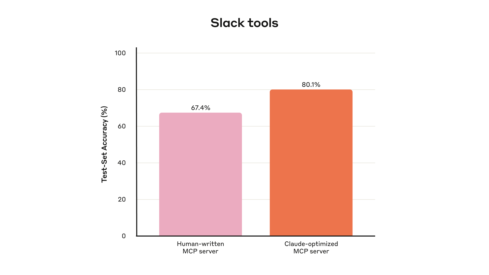
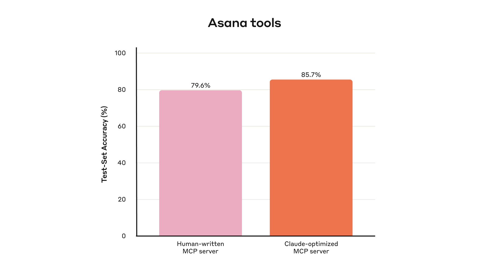
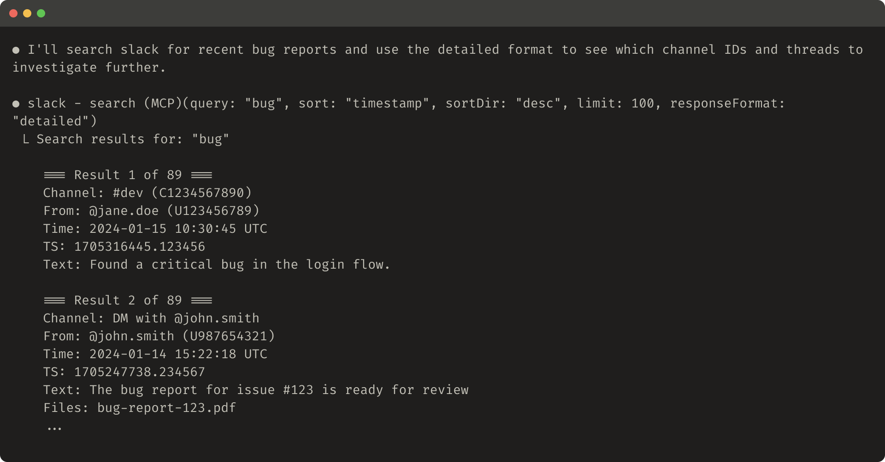
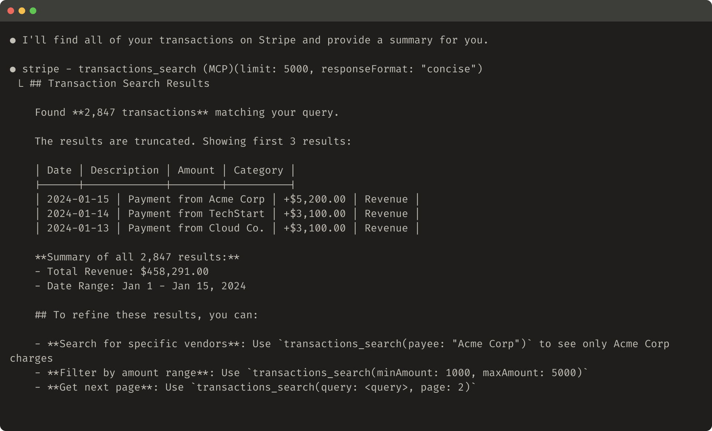
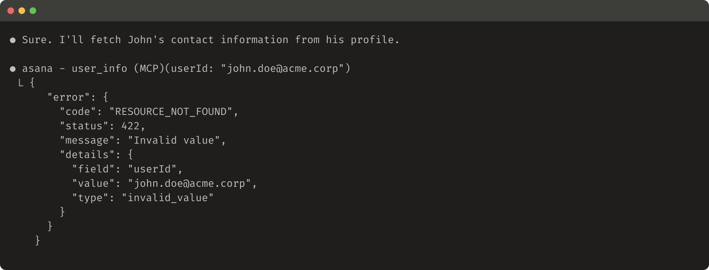
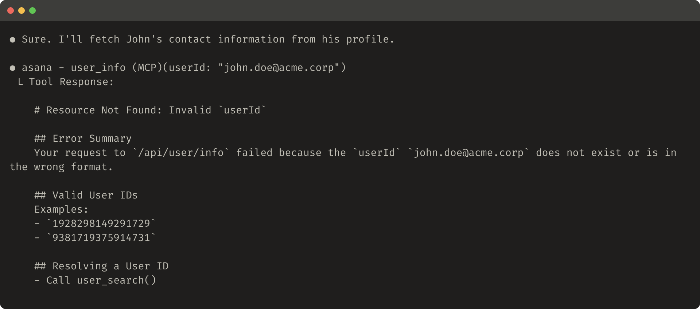

# 为 AI 代理编写高效工具——借助 AI 代理

## 什么是工具？

在计算领域，确定性系统在相同输入下每次都会产生相同的输出，而*非确定性*系统——比如代理——即使在相同的起始条件下，也可能生成不同的响应。

当我们按照传统方式编写软件时，我们建立的是确定性系统之间的契约。例如，像 `getWeather("NYC")` 这样的函数调用，每次被调用时都会以完全相同的方式获取纽约市的天气信息。

工具是一种新型软件，它反映的是确定性系统与非确定性代理之间的契约。当用户询问"我今天需要带伞吗？"时，代理可能会调用天气工具，也可能根据通用知识直接回答，甚至可能先就位置问题进行追问。偶尔，代理可能会产生幻觉，甚至无法理解如何使用工具。

这意味着我们需要从根本上重新思考为代理编写软件的方式：我们不能再像为其他开发者或系统编写函数和 API 那样来编写工具和 [MCP 服务器](https://modelcontextprotocol.io/)，而是需要专门为代理来设计它们。

我们的目标是扩大代理有效解决问题的范围，让代理能够通过使用工具来采用多种成功的策略。幸运的是，根据我们的经验，对代理而言最"符合人体工程学"的工具，往往对人类来说也出人意料地直观易用。

## 如何编写工具

在本节中，我们将介绍如何与代理协作来编写和改进你提供给它们的工具。首先搭建工具的快速原型并在本地进行测试。接下来，运行全面的评估来衡量后续变更的效果。与代理一起，你可以反复进行评估和改进，直到你的代理在真实任务上取得优异表现。

### 构建原型

如果不亲自上手实践，很难预判哪些工具对代理来说是易用的，哪些不是。首先搭建一个工具的快速原型。如果你使用 [Claude Code](https://www.anthropic.com/claude-code) 来编写工具（甚至可能一次性完成），最好向 Claude 提供工具所依赖的软件库、API 或 SDK 的文档（可能还包括 [MCP SDK](https://modelcontextprotocol.io/docs/sdk)）。对 LLM 友好的文档通常可以在官方文档站点的扁平化 `llms.txt` 文件中找到（这里是我们 [API 的](https://docs.anthropic.com/llms.txt)）。

将你的工具封装在[本地 MCP 服务器](https://modelcontextprotocol.io/docs/develop/connect-local-servers)或[桌面扩展](https://www.anthropic.com/engineering/desktop-extensions)（DXT）中，可以让你在 Claude Code 或 Claude 桌面应用中连接并测试工具。

要将本地 MCP 服务器连接到 Claude Code，请运行 `claude mcp add <name> <command> [args...]`。

要将本地 MCP 服务器或 DXT 连接到 Claude 桌面应用，请分别导航到 `Settings > Developer` 或 `Settings > Extensions`。

工具也可以直接传入 [Anthropic API](https://docs.anthropic.com/en/docs/agents-and-tools/tool-use/overview) 调用中进行程序化测试。

亲自测试工具以发现任何问题。收集用户的反馈，从而对你期望工具支持的使用场景和提示词建立直觉。

### 运行评估

接下来，你需要通过运行评估来衡量 Claude 使用工具的效果。首先生成大量基于真实使用场景的评估任务。我们建议与代理协作来帮助分析结果并确定如何改进工具。可以在我们的[工具评估手册](https://platform.claude.com/cookbook/tool-evaluation-tool-evaluation)中查看完整流程。



我们内部 Slack 工具在留出测试集上的表现

**生成评估任务**

有了初步原型后，Claude Code 可以快速探索你的工具并创建数十个提示词-响应对。提示词应该来源于真实使用场景，并基于真实的数据源和服务（例如，内部知识库和微服务）。我们建议避免使用过于简单或肤浅的"沙箱"环境，因为它们无法以足够的复杂度来对你的工具进行压力测试。高质量的评估任务可能需要多次工具调用——可能多达数十次。

以下是一些高质量任务的示例：

* 预约下周与 Jane 的会议，讨论我们最新的 Acme Corp 项目。附上上次项目规划会议的纪要，并预订一间会议室。
* 客户 ID 9182 报告在一次购买尝试中被扣款三次。查找所有相关日志条目，并确定是否有其他客户受到相同问题的影响。
* 客户 Sarah Chen 刚提交了取消请求。准备一份挽留方案。确定：(1) 他们离开的原因，(2) 什么样的挽留方案最有吸引力，(3) 在提出方案之前我们应该注意的风险因素。

以下是一些较弱的示例：

* 预约下周与 jane@acme.corp 的会议。
* 在支付日志中搜索 `purchase_complete` 和 `customer_id=9182`。
* 查找客户 ID 45892 的取消请求。

每个评估提示词都应配对一个可验证的响应或结果。验证器可以简单到在真实答案和采样响应之间进行精确字符串比较，也可以高级到让 Claude 来评判响应。避免使用过于严格的验证器，它们会因为格式、标点符号或有效的替代表述等表面差异而拒绝正确答案。

对于每个提示词-响应对，你还可以选择性地指定你期望代理在解决任务时调用的工具，以衡量代理在评估期间是否成功理解了每个工具的用途。不过，由于正确解决任务可能存在多条有效路径，请尽量避免过度指定或过拟合到特定策略。

**运行评估**

我们建议通过直接的 LLM API 调用来程序化地运行评估。使用简单的代理循环（交替执行 LLM API 调用和工具调用的 `while` 循环）：每个评估任务对应一个循环。每个评估代理应获得一个任务提示词和你的工具。

在评估代理的系统提示词中，我们建议指示代理不仅输出结构化响应块（用于验证），还要输出推理和反馈块。指示代理在工具调用和响应块_之前_输出这些内容，可以通过触发思维链（CoT）行为来提高 LLM 的有效智能。

如果你使用 Claude 运行评估，可以开启[交错思考](https://docs.anthropic.com/en/docs/build-with-claude/extended-thinking#interleaved-thinking)来获得"开箱即用"的类似功能。这将帮助你探究代理为什么调用或不调用某些工具，并突出工具描述和规格中需要改进的具体领域。

除了顶层准确率外，我们还建议收集其他指标，例如单个工具调用和任务的总运行时间、工具调用的总次数、总 token 消耗量以及工具错误数。跟踪工具调用可以帮助揭示代理常用的典型工作流，并为工具整合提供一些机会。



我们内部 Asana 工具在留出测试集上的表现

**分析结果**

代理是你发现问题的得力伙伴，可以帮助你从矛盾的工具描述到低效的工具实现再到令人困惑的工具模式定义等各个方面提供反馈。然而，请记住，代理在反馈和响应中_省略_的内容往往比包含的内容更重要。LLM 并不总是[言如其意](https://www.anthropic.com/research/tracing-thoughts-language-model)。

观察代理在哪里卡住或困惑。通读评估代理的推理和反馈（或 CoT）以识别问题所在。审查原始对话记录（包括工具调用和工具响应），以捕获代理 CoT 中未明确描述的行为。要善于读出言外之意；记住你的评估代理不一定知道正确的答案和策略。

分析你的工具调用指标。大量冗余的工具调用可能意味着需要对分页或 token 限制参数进行调整；大量因无效参数导致的工具错误可能意味着工具需要更清晰的描述或更好的示例。当我们推出 Claude 的[网络搜索工具](https://www.anthropic.com/news/web-search)时，我们发现 Claude 会不必要地在工具的 `query` 参数后面追加 `2025`，导致搜索结果产生偏差并降低了性能（我们通过改进工具描述引导 Claude 走上了正轨）。

### 与代理协作

你甚至可以让代理分析评估结果并为你改进工具。只需将评估代理的对话记录拼接起来，粘贴到 Claude Code 中即可。Claude 是分析对话记录和批量重构工具的专家——例如，确保在进行新更改时工具的实现和描述保持一致。

事实上，本文中的大部分建议都来自于我们用 Claude Code 反复优化内部工具实现的过程。我们的评估是基于内部工作区构建的，模拟了我们内部工作流的复杂性，包括真实的项目、文档和消息。

我们依赖留出测试集来确保没有对"训练"评估过拟合。这些测试集表明，即使在"专家级"工具实现的基础上——无论这些工具是由研究人员手动编写还是由 Claude 自身生成的——我们仍然可以进一步提升性能。

在下一节中，我们将分享我们从这一过程中学到的一些经验。

## 编写高效工具的原则

在本节中，我们将学习成果提炼为编写高效工具的几项指导原则。

### 为代理选择合适的工具

工具越多并不总是意味着效果越好。我们观察到的一个常见错误是，工具仅仅是对现有软件功能或 API 端点的封装——而不管这些工具是否适合代理使用。这是因为代理与传统软件有着不同的"可供性"（affordances）——也就是说，它们感知潜在操作行为的方式不同。

LLM 代理的"上下文"是有限的（即它们一次能处理的信息量有上限），而计算机内存则廉价且充裕。以在通讯录中搜索联系人为例，传统软件程序可以高效地存储和处理联系人列表，逐一检查每一条记录。然而，如果 LLM 代理使用一个返回所有联系人的工具，然后逐个 token 地阅读每条记录，那就是在将有限的上下文空间浪费在无关信息上（想象一下在通讯录中通过从头到尾阅读每一页来查找联系人——即暴力搜索）。对于代理和人类来说，更好且更自然的方法是直接跳到相关页面（比如按字母顺序查找）。

我们建议构建少量经过深思熟虑、针对特定高影响力工作流的工具，使其与你的评估任务相匹配，然后在此基础上逐步扩展。在通讯录的例子中，你可以选择实现 `search_contacts` 或 `message_contact` 工具，而不是 `list_contacts` 工具。

工具可以整合功能，在底层处理潜在的_多个_离散操作（或 API 调用）。例如，工具可以在响应中附带相关元数据，或者在单次工具调用中处理频繁链接的多步骤任务。

以下是一些示例：

* 与其实现 `list_users`、`list_events` 和 `create_event` 工具，不如考虑实现一个 `schedule_event` 工具来自动查找空闲时间并安排事件。
* 与其实现 `read_logs` 工具，不如考虑实现 `search_logs` 工具，仅返回相关的日志行及一些上下文。
* 与其实现 `get_customer_by_id`、`list_transactions` 和 `list_notes` 工具，不如实现 `get_customer_context` 工具，一次性汇总客户的所有近期相关信息。

确保你构建的每个工具都有明确、独特的用途。工具应当使代理能够像人类一样——在拥有相同底层资源的情况下——拆分和解决任务，同时减少中间输出所消耗的上下文。

工具过多或功能重叠也会分散代理的注意力，使其偏离高效的策略。谨慎、有选择地规划你要构建（或不构建）的工具，往往能带来可观的回报。

### 为工具命名空间化

你的 AI 代理可能会获得对数十个 MCP 服务器和数百种不同工具的访问权限——包括其他开发者开发的工具。当工具在功能上存在重叠或用途模糊时，代理可能会对使用哪些工具感到困惑。

命名空间化（在通用前缀下对相关工具进行分组）可以帮助在大量工具之间划定边界；MCP 客户端有时会默认这样做。例如，按服务（如 `asana_search`、`jira_search`）和按资源（如 `asana_projects_search`、`asana_users_search`）对工具进行命名空间化，可以帮助代理在正确的时机选择正确的工具。

我们发现，选择前缀式还是后缀式命名空间化对我们的工具使用评估有显著影响。这种影响因 LLM 而异，我们鼓励你根据自己的评估来选择命名方案。

代理可能会调用错误的工具、用错误的参数调用正确的工具、调用过少的工具，或者错误地处理工具响应。通过有选择地实现名称反映任务自然细分的工具，你可以同时减少加载到代理上下文中的工具和工具描述数量，并将代理的计算从上下文中卸载回工具调用本身。这降低了代理犯错的总体风险。

### 从工具中返回有意义的上下文

同样地，工具实现应当注意只向代理返回高信号信息。它们应优先考虑上下文相关性而非灵活性，并避免使用底层技术标识符（例如：`uuid`、`256px_image_url`、`mime_type`）。像 `name`、`image_url` 和 `file_type` 这样的字段更有可能直接影响代理的后续行动和响应。

代理在处理自然语言名称、术语或标识符方面，也明显比处理晦涩的标识符更为成功。我们发现，仅仅将任意的字母数字 UUID 转换为更具语义和可解释性的语言（甚至是一个从 0 开始索引的 ID 方案），就能显著提高 Claude 在检索任务中的精确度，同时减少幻觉。

在某些情况下，代理可能需要灵活地与自然语言和技术标识符输出进行交互，哪怕只是为了触发后续的工具调用（例如，`search_user(name='jane')` → `send_message(id=12345)`）。你可以通过在工具中暴露一个简单的 `response_format` 枚举参数来实现两者兼顾，允许你的代理控制工具返回 `"concise"` 还是 `"detailed"` 响应（见下图）。

你可以添加更多格式以获得更大的灵活性，类似于 GraphQL 中你可以精确选择要接收的信息片段。以下是一个控制工具响应详细程度的 ResponseFormat 枚举示例：

```
enum ResponseFormat {
   DETAILED = "detailed",
   CONCISE = "concise"
}
```

以下是一个详细工具响应的示例（206 个 token）：



以下是一个简洁工具响应的示例（72 个 token）：


Slack 线程和线程回复由唯一的 `thread_ts` 标识，获取线程回复时需要该值。`thread_ts` 和其他 ID（`channel_id`、`user_id`）可以从 `"detailed"` 工具响应中获取，以支持需要这些 ID 的后续工具调用。`"concise"` 工具响应仅返回线程内容，不包含 ID。在这个示例中，使用 `"concise"` 工具响应大约只需要 1/3 的 token。

甚至工具响应的结构——例如 XML、JSON 或 Markdown——也会对评估性能产生影响：不存在放之四海而皆准的解决方案。这是因为 LLM 基于下一 token 预测进行训练，往往在与训练数据格式匹配时表现更好。最佳响应结构因任务和代理而异。我们鼓励你根据自己的评估来选择最佳响应结构。

### 优化工具响应的 token 效率

优化上下文的质量很重要。但同样重要的是优化工具响应中返回给代理的上下文_数量_。

我们建议对任何可能消耗大量上下文的工具响应实现分页、范围选择、过滤和/或截断等机制的某种组合，并设置合理的默认参数值。对于 Claude Code，我们默认将工具响应限制在 25,000 个 token 以内。我们预期代理的有效上下文长度会随时间增长，但对上下文高效工具的需求将持续存在。

如果你选择截断响应，请务必用有用的指引来引导代理。你可以直接鼓励代理采用更节省 token 的策略，比如在知识检索任务中进行多次小型且精准的搜索，而不是一次广泛搜索。同样，如果工具调用引发错误（例如，在输入验证期间），你可以通过提示词工程来设计错误响应，清晰传达具体且可行的改进建议，而不是晦涩的错误代码或堆栈跟踪。

以下是一个截断的工具响应示例：



以下是一个无用的错误响应示例：



以下是一个有用的错误响应示例：



工具截断和错误响应可以引导代理采取更节省 token 的工具使用行为（使用过滤器或分页），或者提供正确格式的工具输入示例。

### 对工具描述进行提示词工程

现在我们来介绍改进工具最有效的方法之一：对工具描述和规格进行提示词工程。由于这些内容会被加载到代理的上下文中，它们可以共同引导代理采取有效的工具调用行为。

在编写工具描述和规格时，想想你会如何向团队新成员描述你的工具。考虑你可能隐含带入的上下文——专门的查询格式、小众术语的定义、底层资源之间的关系——并将其显式表达出来。通过清晰地描述（并用严格的数据模型来强制执行）预期的输入和输出来避免歧义。特别是，输入参数应使用无歧义的命名：与其使用名为 `user` 的参数，不如使用名为 `user_id` 的参数。

通过评估，你可以更有信心地衡量提示词工程的影响。即使对工具描述进行微小的改进也能带来显著的性能提升。在我们对工具描述进行精确改进后，Claude Sonnet 3.5 在 [SWE-bench Verified](https://www.anthropic.com/engineering/swe-bench-sonnet) 评估上达到了最先进的性能，大幅降低了错误率并提高了任务完成度。

你可以在我们的[开发者指南](https://docs.anthropic.com/en/docs/agents-and-tools/tool-use/implement-tool-use#best-practices-for-tool-definitions)中找到工具定义的其他最佳实践。如果你在为 Claude 构建工具，我们还建议阅读工具如何动态加载到 Claude 的[系统提示词](https://docs.anthropic.com/en/docs/agents-and-tools/tool-use/implement-tool-use#tool-use-system-prompt)中。最后，如果你在为 MCP 服务器编写工具，[工具注解](https://modelcontextprotocol.io/specification/2025-06-18/server/tools)有助于标明哪些工具需要开放世界访问或会进行破坏性更改。

## 展望未来

要为代理构建高效工具，我们需要将软件开发实践从可预测的确定性模式转向非确定性模式。

通过我们在本文中描述的迭代式、评估驱动的方法，我们发现了使工具成功的一些一致规律：高效的工具经过精心且清晰的定义，审慎使用代理的上下文，能够在多样化的工作流中组合使用，并使代理能够直观地解决真实任务。

未来，我们预期代理与世界交互的具体机制将持续演进——从 MCP 协议的更新到底层 LLM 本身的升级。借助系统化、评估驱动的方法来持续改进代理工具，我们可以确保随着代理能力的增强，它们所使用的工具也将同步进化。

## 致谢

本文由 Ken Aizawa 撰写，感谢来自 Research（Barry Zhang、Zachary Witten、Daniel Jiang、Sami Al-Sheikh、Matt Bell、Maggie Vo）、MCP（Theodora Chu、John Welsh、David Soria Parra、Adam Jones）、Product Engineering（Santiago Seira）、Marketing（Molly Vorwerck）、Design（Drew Roper）和 Applied AI（Christian Ryan、Alexander Bricken）等各团队同事的宝贵贡献。

1 除了训练底层 LLM 本身之外。
