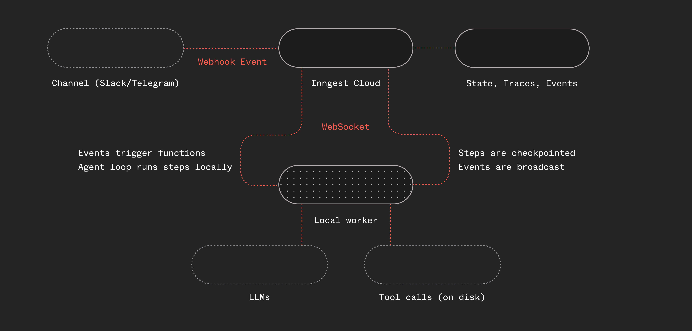
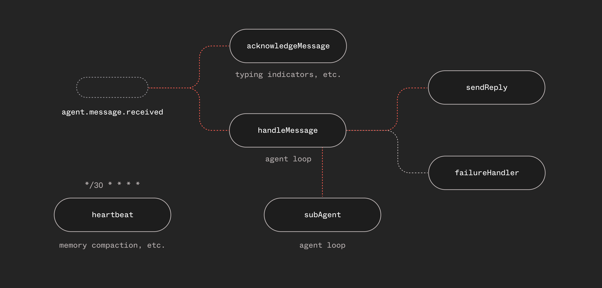

# 你的代理需要的是 Harness，而不是框架

[Dan Farrelly](https://twitter.com/djfarrelly)· 2026/3/3· 13 分钟阅读

在每个工程领域中，harness 的含义都是一样的：连接、保护和编排组件的层——它本身不做具体工作。线束（wiring harness）负责在发动机、传感器和仪表盘之间传递信号。测试 harness 提供脚手架，使代码可重复执行且可观测。安全 harness 在你坠落时接住你。

代理运行时也需要同样的东西。LLM 是发动机。工具是外设。记忆是存储。但谁来连接它们？当 LLM 在第五次迭代超时时，谁来捕获故障？什么防止两条消息冲突？什么将事件从 webhook 路由到正确的处理器，再到正确的回复通道？

这就是 harness。而每个代理框架都在从零开始构建自己的 harness——自己的重试逻辑、自己的状态持久化、自己的任务队列、自己的事件路由。

**持久的、事件驱动的基础设施已经解决了**这个问题。每次 LLM 调用或工具调用都变成一个步骤——一个可独立重试的工作单元。如果进程在第五次迭代时崩溃，前四次迭代的结果已经持久化了。事件负责在函数之间路由触发器。并发控制防止冲突。步骤级别的追踪为你提供代理循环每次迭代的**完整可观测性**。基础设施本身就是 harness。

我们构建了 Utah——**通用触发代理 Harness（Universally Triggered Agent Harness）**——来验证这一点。一个支持工具、记忆、子代理委派和完整持久性的对话式 Telegram 或 Slack 代理。最少的 TypeScript，不依赖框架。只用 Inngest 的函数、步骤和事件，围绕标准的"思考 → 行动 → 观察"循环提供 harness。**可以把它看作一个可持久化的、云就绪的 OpenClaw。**

"通用触发"这一点很重要：Telegram 或 Slack webhook、cron 定时任务、子代理调用、函数间事件——代理不知道也不关心自己是如何被激活的。触发与工作解耦了。明天加一个 Slack bot，代理循环不需要任何改动。Harness 负责路由。

下面是它的工作原理。

## 架构

Utah 与大多数 harness 的不同之处在于：它是事件驱动的，并且将编排与代理循环解耦。它还利用 Inngest Cloud 来桥接公共 webhook 和本地 worker 之间的间隙。



Telegram 或 Slack 的 webhook 请求到达 Inngest Cloud，通过 webhook 转换将原始 HTTP 负载转换为带类型的 Inngest 事件。本地运行的 worker 获取该事件，执行代理函数，并触发一个回复事件，该事件会触发一个独立的函数通过通道自身的 API 将响应发送回去（下面会详细说明）。任何支持 webhook 的通信通道（或任何服务）都可以工作。

Worker 使用 Inngest 的 `connect()` API，它从你的本地机器（或 Mac mini 或远程服务器）到 Inngest Cloud 建立一个持久的 WebSocket 连接，无需公共端点。

在 worker 中运行的代理循环很简单：它是一个包含"步骤"的 while 循环，步骤调用 LLM 并运行工具。我们使用 Pi 的 provider 接口及其工具，因为它们_都很好用_，但你可以在这里使用任何东西。你可以换成 AI SDK、TanStack AI，创建自己的工具，或接入 MCP。

## 既然是本地的，为什么用 Inngest？为什么不直接用 OpenClaw？

OpenClaw 和 [pi coding-agent 库](https://pi.dev/) 是这个项目的灵感来源。它们都在内部使用进程内事件，因此事件和编排都在内存中处理。Inngest 本身就是一个事件驱动的编排层，因此本项目将执行与编排解耦了。

这为 harness 带来了以下能力：

* 编排层通过追踪和步骤级别的检查提供可观测性。
* 内置的持久执行提供可靠性和重试能力。
* 解耦为多人分布式代理编排奠定了基础。
* 事件历史提供系统内发生的操作的审计追踪。
* 通过 cron 或计划/延迟函数内置调度功能。

所有这些都是基础设施问题，不是 AI 问题。

## 以步骤形式实现的代理循环

Utah 的核心是一个"思考 → 行动 → 观察"循环。每次迭代调用 LLM，检查是否需要使用工具，执行这些工具，并将结果反馈回去。关键的洞察是：**每次 LLM 调用和每次工具执行都是一个 Inngest 步骤。**

tsx

```
// Simplified — the actual implementation uses pi-ai's provider-agnostic types
while (!done && iterations < config.loop.maxIterations) {
  iterations++;

  // Prune old tool results to keep context focused
  pruneOldToolResults(messages);

  // Budget warnings when running low on iterations
  const messagesForLLM = addBudgetWarning(messages, iterations);

  // Think: call the LLM
  const llmResponse = await step.run("think", async () => {
    return await callLLM(systemPrompt, messagesForLLM, tools);
  });

  const toolCalls = llmResponse.toolCalls;

  if (toolCalls.length > 0) {
    messages.push(llmResponse.message);

    // Act: execute each tool as a separate step
    for (const tc of toolCalls) {
      const result = await step.run(`tool-${tc.name}`, async () => {
        validateToolArguments(tool, tc);
        return await executeTool(tc.id, tc.name, tc.arguments);
      });
      // Observe: feed results back into messages
      messages.push(toolResultMessage(tc, result));
    }
  } else if (llmResponse.text) {
    // No tools — the text response IS the reply
    finalResponse = llmResponse.text;
    done = true;
  }
}
```

需要注意以下几点：

**Inngest 会自动为重复的步骤 ID 建立索引。** 当 `step.run("think")` 在循环中被调用十次时，Inngest 内部会将它们追踪为 `think:0`、`think:1` 等。你不需要自己管理唯一的步骤 ID——SDK 会处理。

**每个步骤可以独立重试。** 如果 LLM API 在第 3 次迭代时返回 500 错误，Inngest 只重试那个特定步骤。第 1 次和第 2 次迭代的结果已经持久化了——它们不会重新执行。这正是持久执行的设计初衷，只是应用到了代理循环而非结账工作流。

**文本响应意味着完成。** 当 LLM 返回文本且没有工具调用时，这一轮就结束了。不需要显式的"完成"信号。

有关此模式的逐步讲解，请参阅[代理工具循环指南](http://www.inngest.com/docs/ai-patterns/agent-tool-loops?ref=blog-your-agent-needs-a-harness-not-a-framework)。

## 你不需要自己构建工具

Utah 没有手工实现文件 I/O 和 shell 执行。它引入了 [`pi-coding-agent`](https://github.com/badlogic/pi-mono)——来自 OpenClaw/Pi 生态的经过实战检验的工具实现：

* `read`、`write`、`edit`——支持图片、二进制检测和智能截断的文件操作（`edit` 工具在上下文窗口方面表现出色）
* `bash`——具有可配置超时和输出截断的 shell 执行
* `grep`、`find`、`ls`——遵守 `.gitignore` 的搜索和导航

在此之上，Utah 还添加了一些自定义工具：`remember`（将笔记持久化到每日日志）、`web_fetch` 和 `delegate_task`（稍后详述）。

关键在于：AI 代理的工具故事与其他软件一样。使用现有库。用 Inngest 步骤包装它们。完成。

tsx

```
import { createReadTool, createWriteTool, createBashTool, /* ... */ } from "@mariozechner/pi-coding-agent";

const tools = [
  createReadTool(config.workspace.root),
  createWriteTool(config.workspace.root),
  createBashTool(config.workspace.root),
  // ...
];
```

简单。复制、粘贴，开箱即用。

## 六个函数，不是一个庞然大物



Utah 不是一个包揽一切的单一函数。它是通过事件通信的六个函数：

tsx

```
const functions = [
  handleMessage,     // The main agent loop
  sendReply,         // Send responses back to the channel
  acknowledgeMessage,// Typing indicator — fires immediately
  failureHandler,    // Global error handler across all functions
  heartbeat,         // Periodic scheduled check-ins
  subAgent,          // Isolated sub-agent runs via step.invoke()
];
```

这种分离很重要。正在输入提示会在消息到达时立即触发——它不等待代理循环完成。回复函数处理 Telegram/Slack 特有的格式化和错误处理（比如当 LLM 生成格式错误的 HTML 时回退到纯文本）。故障处理器捕获所有函数中未处理的错误并通知用户。

每个函数都有自己的重试策略、并发控制和触发条件。这在 Inngest 中很自然——你通过由事件连接的小型、专注的函数来组合行为。

而 `sendReply` 函数呢？它可以从任何地方触发，因此如果我们想允许子代理或扇出工作流在循环中发送中间回复来更新用户，我们只需从新工具发送事件即可。

## 通过 `step.invoke()` 实现子代理

有时代理需要完成一个大到会撑爆其上下文窗口的任务——重构文件、研究某个主题、撰写文档。对于像 OpenClaw 这样在单线程对话中运行的通用代理（例如 Telegram），持续几天的长会话可能会出现上下文窗口问题。解决方案：启动一个子代理。

Utah 有一个 `delegate_task` 工具。当主代理调用它时，它使用 `step.invoke()` 启动一个完全独立的代理函数运行。子代理将会话的上下文分叉到自己的子会话中（有自己的会话密钥），带有明确的任务和预期结果：

tsx

```
// In the main agent loop, when delegate_task is called:
const subResult = await step.invoke("sub-agent", {
  function: subAgent,
  data: {
    task: tc.arguments.task,
    subSessionKey: `sub-${sessionKey}-${Date.now()}`,
  },
});
```

子代理函数使用自己的上下文窗口运行一个全新的代理循环，使用相同的工具（减去 `delegate_task`——不允许递归生成），并向父代理返回一个摘要：

tsx

```
// Simplified sub-agent
export const subAgent = inngest.createFunction(
  { id: "agent-sub-agent", retries: 1 },
  { event: "agent.subagent.spawn" },
  async ({ event, step }) => {
    const { task, subSessionKey } = event.data;
    const agentLoop = createAgentLoop(task, subSessionKey, {
      tools: SUB_AGENT_TOOLS, // No delegate_task
      isSubAgent: true,
    });
    return await agentLoop(step);
  }
);
```

这正是 `step.invoke()` 的设计初衷——将另一个 Inngest 函数作为步骤调用，等待其结果，然后继续。子代理拥有自己的重试、步骤级别的可观测性和持久执行。父代理只看到一个工具结果：“这是我所做的。”

编排已经处理好了。不需要代理到代理的协议。只需要函数调用函数。

## 单例并发：一次一个对话

每个"通道"（例如 Slack）使用通道特定的会话密钥来定义什么是一个"对话"。对于单线程通道（如 Telegram），它是聊天 ID；对于有线程的平台（如 Slack），它是通道和线程相关的。

如果在一次对话中发送多条消息，你不希望第一个代理循环继续运行然后下一个再响应——你希望代理拥有两条消息的上下文。所以你要么取消第一个循环让第二个循环处理，要么在循环内处理"转向"。对于这个项目，我们认为取消+重启是最干净的方案，因为循环会用所有上下文重新启动。

在消息处理函数上，我们设置一行配置来处理这个问题：

tsx

```
singleton: { key: "event.data.sessionKey", mode: "cancel" },
```

这里发生了两件事：

1. 以 `sessionKey` 为键的**单例并发**——每次每个聊天只运行一个代理。没有竞态条件。没有交错响应。
2. **收到新消息时取消**——如果用户在代理仍在处理时发送了新消息，当前运行会被取消，新的运行会用最新消息启动。

在传统架构中，你需要为每个用户构建队列、管理锁并自己处理取消。而用 Inngest，这只需一行配置。

## 我们踩过的坑

**上下文管理才是真正的挑战**

最难的问题不是调用 LLM，而是管理传给 LLM 调用的内容。

Utah 使用的工具每次调用可能返回数千个字符。经过几次迭代后，对话上下文急剧膨胀，模型开始迷失方向。我们看到代理循环不停地调用工具，却始终不产生响应。

我们通过两层上下文修剪来解决这个问题：

tsx

```
const PRUNING = {
  keepLastAssistantTurns: 3,
  softTrim: { maxChars: 4000, headChars: 1500, tailChars: 1500 },
  hardClear: { threshold: 50_000, placeholder: "[Tool result cleared]" },
};
```

旧的工具结果会被软修剪（保留头部 + 尾部），或者当总上下文过大时完全清除。最后三次迭代始终保持完整。

在此基础上，还有一个独立的针对会话本身的压缩系统——当估算的 token 数超过阈值时，对话历史会在送入下一次运行之前被摘要化。修剪处理运行内的上下文。压缩处理跨运行的累积。

我们还添加了预算警告——当代理即将用完迭代次数时注入系统消息，告诉它收尾。以及溢出恢复：如果 LLM 在运行中途返回 context-too-large 错误，我们会强制压缩消息并重试，而不浪费一次迭代。在修剪、压缩、预算压力和溢出恢复的共同作用下，代理能够保持正轨。

**多 LLM provider 支持**

Utah 没有直接调用 Anthropic SDK。它使用 [`pi-ai`](https://github.com/badlogic/pi-mono)，一个支持 Anthropic、OpenAI 和 Google 的 provider 无关的 LLM 抽象层。切换 provider 只需改一下配置：

tsx

```
llm: {
  provider: "anthropic", // or "openai" or "google"
  model: "claude-sonnet-4-20250514",
},
```

展望未来，如果子代理可能发展为使用不同模型（可能来自不同 provider），这也变得很有趣。编码子代理可以使用 Codex，而研究代理可以使用 Opus。后续会有更多相关内容。

**转向是一个未解决的问题**

当用户在代理运行途中发送新消息时，应该怎么做？我们使用 `singleton`——当前运行被取消，新的运行启动。这可行，但任何进行中的工作都会丢失。新运行从持久化的会话状态恢复，但并不无缝。这是我们正在积极探索的领域。

**流式传输或循环中实时更新的机会**

每个 Inngest 步骤都是原子的——它运行、产生结果、结果被持久化。本项目尚未包含流式传输或利用 [Inngest 的实时功能](http://www.inngest.com/docs/features/realtime?ref=blog-your-agent-needs-a-harness-not-a-framework)。Telegram 和 Slack 支持单独的事件，但我们希望为这个项目添加 Web 应用和 TUI，以探索如何可选地向支持流式传输的客户端发送循环中的进度更新。后续迭代中会有更多内容。

## 我们接下来要探索的

Utah 是一个在本地机器或服务器上运行的个人单人 harness。核心架构可以实现更多功能。在接下来的几周里，我们将探索要让 Utah 真正支持多人协作需要什么。

要实现多人支持，我们将探索可替换的沙箱、外部状态和记忆。这将使 Utah 能够在有人想这样部署时运行在无服务器环境中。

有很多有趣的 UX 功能我们想基于 Inngest API 和我们的 Insights 功能来添加，为编码会话构建会话监控。我们还将探索使用 `step.waitForEvent()` 来创建[人在回路中的审批流](http://www.inngest.com/docs/ai-patterns/human-in-the-loop?ref=blog-your-agent-needs-a-harness-not-a-framework)，在需要更多输入时暂停等待。

我们正在探索的最后一部分，是为了让它真正做到"通用触发"：让 Utah 能自己编写扩展内容，构建新代理和工作流、创建新 webhook，并通过 API 监控自身。如果你感兴趣，欢迎在 GitHub 仓库分享想法。

## 自己试试

Utah 的源代码已作为参考实现发布：[https://github.com/inngest/utah](https://github.com/inngest/utah)

它包括：

* 使用 Inngest 步骤和 pi-ai 的 provider 无关 LLM 层的代理循环
* 来自 pi-coding-agent 的工具（read、write、edit、bash、grep、find、ls）以及自定义工具
* 通过 `step.invoke()` 实现的子代理委派
* 通过 Inngest webhook 转换实现的 Telegram 和 Slack webhook 集成
* 上下文修剪、压缩和溢出恢复
* 会话感知的单例并发

前往 [README](https://github.com/inngest/utah) 试试看。

这种代理循环模式适用于任何对话式 AI——Slack bot、Discord bot、客服代理、编码助手。添加任何新通道只需要一个 webhook 转换和一个回复函数。

如果你正在构建 AI 代理并遇到同样的困境——状态管理、重试、并发、可观测性——不妨试试 Inngest。你需要的基础组件可能已经存在了。

## 开始使用 Inngest

免费注册，立即开始构建可靠的工作流。

[免费开始](https://app.inngest.com/sign-up?ref=blog-your-agent-needs-a-harness-not-a-framework)

## 与解决方案专家交流

联系我们，了解 Inngest 是否适合你的队列和编排需求。

[联系我们](http://www.inngest.com/contact?ref=blog-your-agent-needs-a-harness-not-a-framework)

## 在混乱之中

每次都交付可靠的 AI 产品

[让我们聊聊](http://www.inngest.com/contact?ref=-blog-your-agent-needs-a-harness-not-a-framework-footer-cta)

[我想先看看文档](http://www.inngest.com/docs?ref=-blog-your-agent-needs-a-harness-not-a-framework-footer-cta)

### 平台

* [AI 与代理](http://www.inngest.com/ai?ref=footer-links)
* [持久工作流](http://www.inngest.com/uses/durable-workflows?ref=footer-links)
* [持久端点](http://www.inngest.com/durable-endpoints?ref=footer-links)
* [平台](http://www.inngest.com/platform?ref=footer-links)
* [队列](http://www.inngest.com/compare-to-legacy-queues?ref=footer-links)
* [工作流引擎](http://www.inngest.com/uses/workflow-engine?ref=footer-links)
* [后台任务](http://www.inngest.com/uses/serverless-node-background-jobs?ref=footer-links)
* [定时任务和 cron 任务](http://www.inngest.com/uses/serverless-cron-jobs?ref=homepage-footer-links)

### 探索

* [文档](http://www.inngest.com/docs?ref=footer-links)
* [Inngest 与传统队列对比](http://www.inngest.com/compare-to-legacy-queues?ref=footer-links)
* [Inngest 与 Kafka 对比](http://www.inngest.com/blog/simplifying-queues-modern-kafka-alternative?ref=footer-links)
* [Inngest 与 Temporal 对比](http://www.inngest.com/compare-to-temporal?ref=footer-links)
* [解决 Next.js 超时问题](http://www.inngest.com/blog/how-to-solve-nextjs-timeouts?ref=footer-links)

### 公司

* [博客](http://www.inngest.com/blog?ref=footer-links)
* [更新日志](http://www.inngest.com/changelog?ref=footer-links)
* [路线图](https://roadmap.inngest.com/roadmap?ref=footer-links)
* [关于](http://www.inngest.com/about?ref=footer-links)
* [招聘](http://www.inngest.com/careers?ref=footer-links)

### 社区

* [Discord](http://www.inngest.com/discord?ref=footer-links)
* [GitHub](https://github.com/inngest/inngest)
* [X.com](https://x.com/inngest)
* [Bluesky](https://bsky.app/profile/inngest.com)

[获取状态中...](https://status.inngest.com/ "Status updated at ")

© 2026 Inngest Inc. All rights reserved.

[隐私政策](http://www.inngest.com/privacy?ref=footer-links)

|

[条款](http://www.inngest.com/terms?ref=footer-links)

|

[安全](http://www.inngest.com/security?ref=footer-links)
