<div align="center">
<a href="https://voltagent.dev/">

</a>

<h3 align="center">
AI 代理工程平台
</h3>

<div align="center">
English | <a href="i18n/README-cn-traditional.md">繁體中文</a> | <a href="i18n/README-cn-bsc.md">简体中文</a> | <a href="i18n/README-jp.md">日本語</a> | <a href="i18n/README-kr.md">한국어</a>
</div>

<br/>

<div align="center">
    <a href="https://voltagent.dev">主页</a> |
    <a href="https://voltagent.dev/docs/">文档</a> |
    <a href="https://github.com/voltagent/voltagent/tree/main/examples">示例</a>
</div>
</div>

<br/>

<div align="center">

[](https://github.com/voltagent/voltagent/issues)
[](https://github.com/voltagent/voltagent/pulls)
[](https://opensource.org/licenses/MIT)
[](CODE_OF_CONDUCT.md)
[](https://www.npmjs.com/package/@voltagent/core)

[](https://www.npmjs.com/package/@voltagent/core)
[](https://s.voltagent.dev/discord)
[](https://x.com/voltagent_dev)

</div>

<h3 align="center">
⭐ 喜欢我们在做的事情？给我们一个 star ⬆️
</h3>

VoltAgent 是一个端到端的 AI 代理工程平台，由两个主要部分组成：

- **[开源 TypeScript 框架](#core-framework)** -- 内存、RAG、安全护栏、工具、MCP、语音、工作流等。
- **[VoltOps 控制台](#voltops-console)** `Cloud` `Self-Hosted` -- 可观测性、自动化、部署、评估、安全护栏、提示词等。

以完全的代码控制力构建代理，并以生产级的可见性和运维能力将其交付上线。

<h2 id="core-framework">核心 TypeScript 框架</h2>

使用开源框架，你可以构建具备内存、工具和多步工作流的智能代理，同时连接到任意 AI 提供商。创建复杂的多代理系统，让专业化代理在主管协调下协同工作。

- **[核心运行时](https://voltagent.dev/docs/agents/overview/) (`@voltagent/core`)**：在一个地方定义代理的类型化角色、工具、内存和模型提供商，保持一切井然有序。
- **[工作流引擎](https://voltagent.dev/docs/workflows/overview/)**：以声明式方式描述多步自动化流程，而非拼凑自定义控制流。
- **[主管与子代理](https://voltagent.dev/docs/agents/sub-agents/)**：在主管运行时下运行专业化代理团队，由其路由任务并保持同步。
- **[工具注册表](https://voltagent.dev/docs/agents/tools/) 与 [MCP](https://voltagent.dev/docs/agents/mcp/)**：交付带有生命周期钩子和取消功能的 Zod 类型化工具，并连接到 [Model Context Protocol](https://modelcontextprotocol.io/) 服务器，无需额外胶水代码。
- **[LLM 兼容性](https://voltagent.dev/docs/getting-started/providers-models/)**：通过修改配置即可在 OpenAI、Anthropic、Google 或其他提供商之间切换，无需重写代理逻辑。
- **[内存](https://voltagent.dev/docs/agents/memory/overview/)**：挂载持久化内存适配器，使代理在多次运行间记住重要上下文。
- **[可恢复流式传输](https://voltagent.dev/docs/agents/resumable-streaming/)**：允许客户端在刷新后重新连接正在进行的流，继续接收同一响应。
- **[检索与 RAG](https://voltagent.dev/docs/rag/overview/)**：接入检索代理，从你的数据源中提取事实，并在模型回答前基于这些事实生成响应（RAG）。
- **[VoltAgent 知识库](https://voltagent.dev/docs/rag/voltagent/)**：使用托管式 RAG 服务进行文档导入、分块、嵌入和搜索。
- **[语音](https://voltagent.dev/docs/agents/voice/)**：通过 OpenAI、ElevenLabs 或自定义语音提供商添加文本转语音和语音转文本能力。
- **[安全护栏](https://voltagent.dev/docs/guardrails/overview/)**：在运行时拦截和验证代理的输入或输出，以强制执行内容策略和安全规则。
- **[评估](https://voltagent.dev/docs/evals/overview/)**：在工作流旁运行代理评估套件，以衡量和改进代理行为。

#### MCP 服务器 (@voltagent/mcp-docs-server)

你可以使用 MCP 服务器 `@voltagent/mcp-docs-server` 来教会你的 LLM 如何使用 VoltAgent，适用于 Claude、Cursor 或 Windsurf 等 AI 编码助手。这使得 AI 助手能在你编码时直接访问 VoltAgent 的文档、示例和更新日志。

📖 [如何设置 MCP 文档服务器](https://voltagent.dev/docs/getting-started/mcp-docs-server/)

## ⚡ 快速入门

使用 `create-voltagent-app` CLI 工具在几秒内创建一个新的 VoltAgent 项目：

```bash
npm create voltagent-app@latest
```

此命令将引导你完成设置。

你将在 `src/index.ts` 中看到入门代码，其中注册了一个代理以及一个在 `src/workflows/index.ts` 中的综合工作流示例。

```typescript
import { VoltAgent, Agent, Memory } from "@voltagent/core";
import { LibSQLMemoryAdapter } from "@voltagent/libsql";
import { createPinoLogger } from "@voltagent/logger";
import { honoServer } from "@voltagent/server-hono";
import { openai } from "@ai-sdk/openai";
import { expenseApprovalWorkflow } from "./workflows";
import { weatherTool } from "./tools";

// Create a logger instance
const logger = createPinoLogger({
  name: "my-agent-app",
  level: "info",
});

// Optional persistent memory (remove to use default in-memory)
const memory = new Memory({
  storage: new LibSQLMemoryAdapter({ url: "file:./.voltagent/memory.db" }),
});

// A simple, general-purpose agent for the project.
const agent = new Agent({
  name: "my-agent",
  instructions: "A helpful assistant that can check weather and help with various tasks",
  model: openai("gpt-4o-mini"),
  tools: [weatherTool],
  memory,
});

// Initialize VoltAgent with your agent(s) and workflow(s)
new VoltAgent({
  agents: {
    agent,
  },
  workflows: {
    expenseApprovalWorkflow,
  },
  server: honoServer(),
  logger,
});
```

然后，进入你的项目目录并运行：

```bash
npm run dev
```

运行 dev 命令时，tsx 会编译并执行你的代码。你应该会在终端中看到 VoltAgent 服务器启动消息：

```
══════════════════════════════════════════════════
VOLTAGENT SERVER STARTED SUCCESSFULLY
══════════════════════════════════════════════════
✓ HTTP Server: http://localhost:3141

Test your agents with VoltOps Console: https://console.voltagent.dev
══════════════════════════════════════════════════
```

你的代理现在已在运行！与它交互的方式：

1. 打开控制台：点击终端输出中的 [VoltOps LLM 可观测性平台](https://console.voltagent.dev) 链接（或将其复制粘贴到浏览器中）。
2. 找到你的代理：在 VoltOps LLM 可观测性平台页面上，你应该能看到你的代理被列出（例如 "my-agent"）。
3. 打开代理详情：点击你的代理名称。
4. 开始对话：在代理详情页面，点击右下角的聊天图标打开聊天窗口。
5. 发送消息：输入一条消息如 "Hello" 并按回车。

[](https://github.com/user-attachments/assets/26340c6a-be34-48a5-9006-e822bf6098a7)

### 运行你的第一个工作流

你的新项目还包含一个强大的工作流引擎。

费用审批工作流演示了带挂起/恢复能力的人工介入自动化：

```typescript
import { createWorkflowChain } from "@voltagent/core";
import { z } from "zod";

export const expenseApprovalWorkflow = createWorkflowChain({
  id: "expense-approval",
  name: "Expense Approval Workflow",
  purpose: "Process expense reports with manager approval for high amounts",

  input: z.object({
    employeeId: z.string(),
    amount: z.number(),
    category: z.string(),
    description: z.string(),
  }),
  result: z.object({
    status: z.enum(["approved", "rejected"]),
    approvedBy: z.string(),
    finalAmount: z.number(),
  }),
})
  // Step 1: Validate expense and check if approval needed
  .andThen({
    id: "check-approval-needed",
    resumeSchema: z.object({
      approved: z.boolean(),
      managerId: z.string(),
      comments: z.string().optional(),
      adjustedAmount: z.number().optional(),
    }),
    execute: async ({ data, suspend, resumeData }) => {
      // If we're resuming with manager's decision
      if (resumeData) {
        return {
          ...data,
          approved: resumeData.approved,
          approvedBy: resumeData.managerId,
          finalAmount: resumeData.adjustedAmount || data.amount,
        };
      }

      // Check if manager approval is needed (expenses over $500)
      if (data.amount > 500) {
        await suspend("Manager approval required", {
          employeeId: data.employeeId,
          requestedAmount: data.amount,
        });
      }

      // Auto-approve small expenses
      return {
        ...data,
        approved: true,
        approvedBy: "system",
        finalAmount: data.amount,
      };
    },
  })
  // Step 2: Process the final decision
  .andThen({
    id: "process-decision",
    execute: async ({ data }) => {
      return {
        status: data.approved ? "approved" : "rejected",
        approvedBy: data.approvedBy,
        finalAmount: data.finalAmount,
      };
    },
  });
```

你可以直接从 VoltOps 控制台测试预构建的 `expenseApprovalWorkflow`：

[](https://github.com/user-attachments/assets/3d3ea67b-4ab5-4dc0-932d-cedd92894b18)

1.  **前往工作流页面：** 启动服务器后，直接进入 [工作流页面](https://console.voltagent.dev/workflows)。
2.  **选择你的项目：** 使用项目选择器选择你的项目（例如 "my-agent-app"）。
3.  **查找并运行：** 你将看到 **"Expense Approval Workflow"** 已列出。点击它，然后点击 **"Run"** 按钮。
4.  **提供输入：** 工作流需要一个包含费用详情的 JSON 对象。尝试一个小额费用以获取自动审批：
    ```json
    {
      "employeeId": "EMP-123",
      "amount": 250,
      "category": "office-supplies",
      "description": "New laptop mouse and keyboard"
    }
    ```
5.  **查看结果：** 执行完成后，你可以在控制台中检查每个步骤的详细日志并查看最终输出。

## 示例

更多示例请访问我们的[示例仓库](https://github.com/VoltAgent/voltagent/tree/main/examples)。

- **[Airtable 代理](https://voltagent.dev/examples/guides/airtable-agent)** - 响应新记录并通过 VoltOps 动作将更新写回 Airtable。
- **[Slack 代理](https://voltagent.dev/examples/guides/slack-agent)** - 响应频道消息并通过 VoltOps Slack 动作回复。
- **[使用 VoltAgent 的 ChatGPT 应用](https://voltagent.dev/examples/agents/chatgpt-app)** - 通过 MCP 部署 VoltAgent 并连接到 ChatGPT 应用。
- **[WhatsApp 订单代理](https://voltagent.dev/examples/agents/whatsapp-ai-agent)** - 构建一个通过自然对话处理食品订单的 WhatsApp 聊天机器人。([源码](https://github.com/VoltAgent/voltagent/tree/main/examples/with-whatsapp))
- **[YouTube 转博客代理](https://voltagent.dev/examples/agents/youtube-blog-agent)** - 使用带有 MCP 工具的主管代理将 YouTube 视频转换为 Markdown 博客文章。([源码](https://github.com/VoltAgent/voltagent/tree/main/examples/with-youtube-to-blog))
- **[AI 广告生成代理](https://voltagent.dev/examples/agents/ai-instagram-ad-agent)** - 使用 BrowserBase Stagehand 和 Google Gemini AI 生成 Instagram 广告。([源码](https://github.com/VoltAgent/voltagent/tree/main/examples/with-ad-creator))
- **[AI 食谱生成代理](https://voltagent.dev/examples/agents/recipe-generator)** - 根据食材和偏好创建个性化烹饪建议。([源码](https://github.com/VoltAgent/voltagent/tree/main/examples/with-recipe-generator) | [视频](https://youtu.be/KjV1c6AhlfY))
- **[AI 研究助手代理](https://voltagent.dev/examples/agents/research-assistant)** - 用于生成综合报告的多代理研究工作流。([源码](https://github.com/VoltAgent/voltagent/tree/main/examples/with-research-assistant) | [视频](https://youtu.be/j6KAUaoZMy4))

<h2 id="voltops-console">VoltOps 控制台：LLM 可观测性 - 自动化 - 部署</h2>

VoltOps 控制台是 VoltAgent 的平台端，提供可观测性、自动化和部署功能，让你能通过实时执行追踪、性能指标和可视化仪表板在生产环境中监控和调试代理。

🎬 [体验在线演示](https://console.voltagent.dev/demo)

📖 [VoltOps 文档](https://voltagent.dev/voltops-llm-observability-docs/)

🚀 [VoltOps 平台](https://voltagent.dev/voltops-llm-observability/)

### 可观测性与追踪

通过详细的追踪和性能指标深入了解代理执行流程。

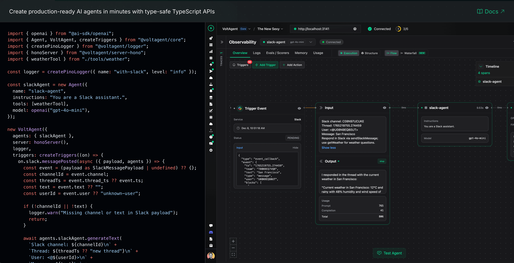

### 仪表板

获取所有代理、工作流和系统性能指标的综合概览。

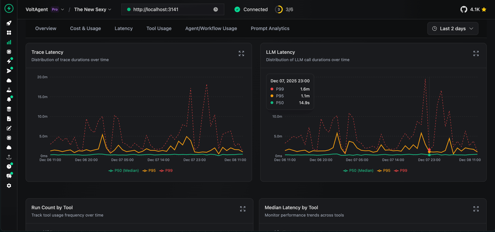

### 日志

追踪每次代理交互和工作流步骤的详细执行日志。

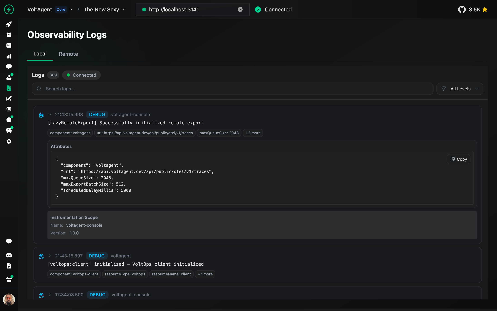

### 内存管理

检查和管理代理内存、上下文和对话历史。

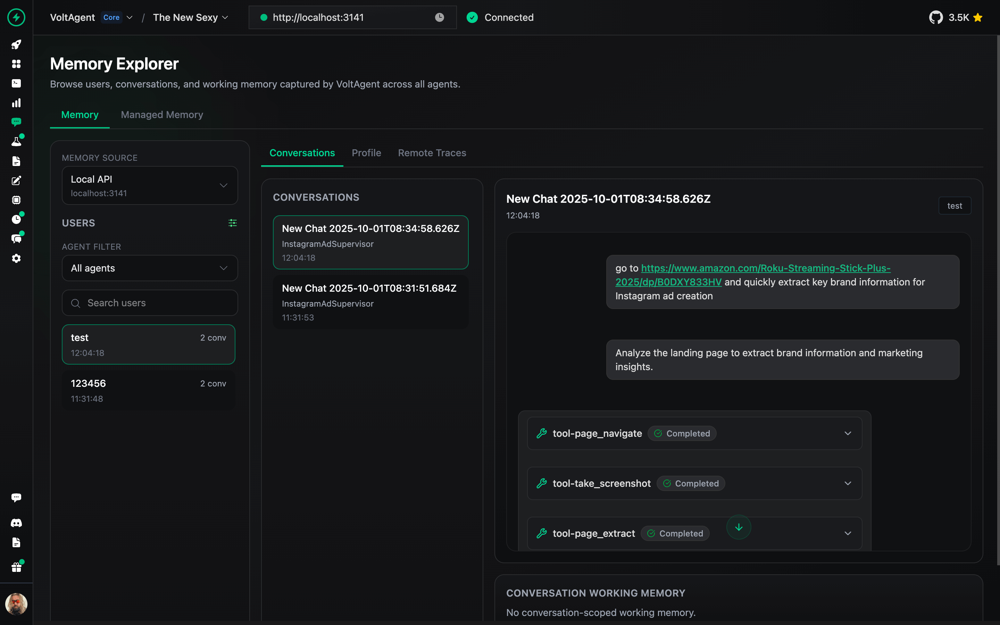

### 追踪

分析完整的执行追踪，理解代理行为并优化性能。

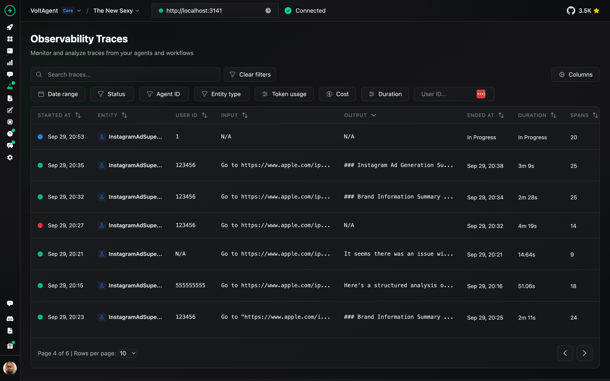

### 提示词构建器

直接在控制台中设计、测试和优化提示词。

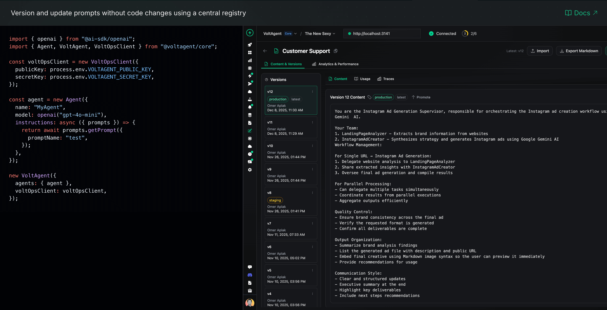

### 部署

通过一键 GitHub 集成和托管基础设施将代理部署到生产环境。

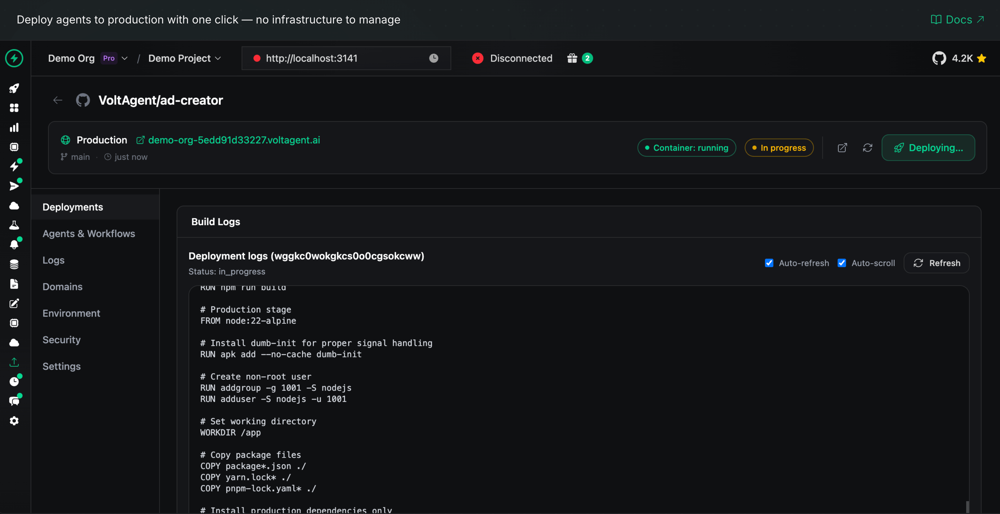

📖 [VoltOps 部署文档](https://voltagent.dev/docs/deployment/voltops/)

### 触发器与动作

通过 webhook、调度和自定义触发器自动化代理工作流，以响应外部事件。

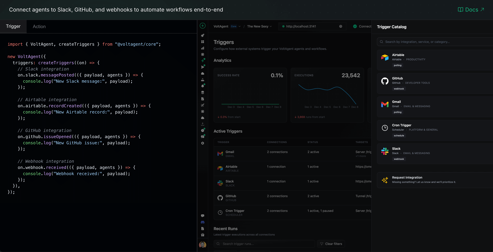

### 监控

监控整个系统的代理健康状况、性能指标和资源使用情况。

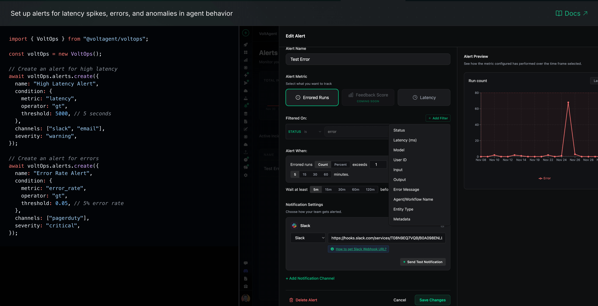

### 安全护栏

设置安全边界和内容过滤器，确保代理在定义的参数范围内运行。

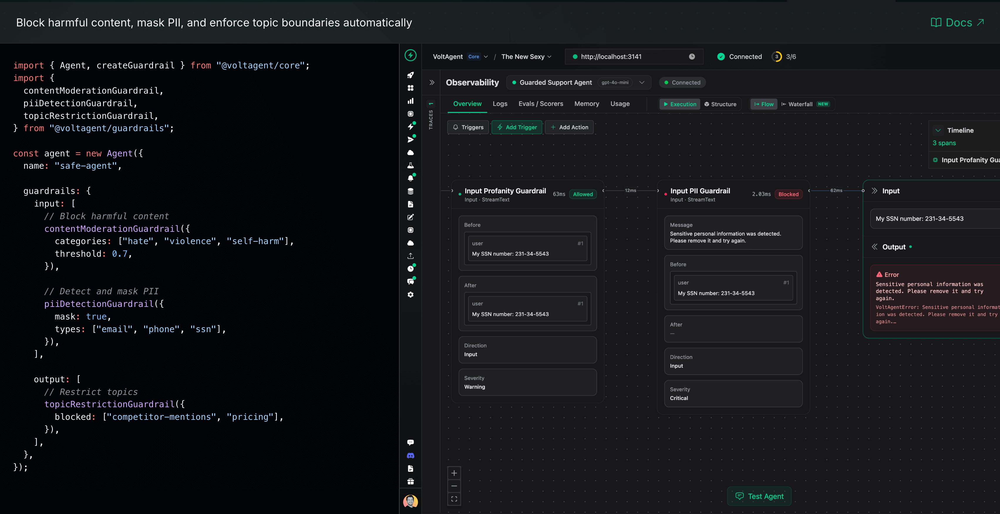

### 评估

运行评估套件，根据基准测试来测试代理行为、准确性和性能。

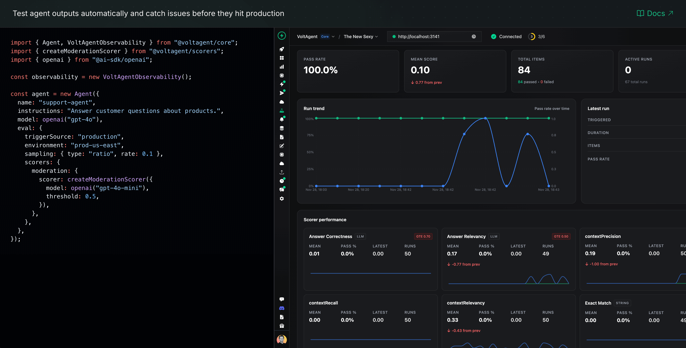

### RAG（知识库）

通过内置的检索增强生成能力，将你的代理连接到知识源。

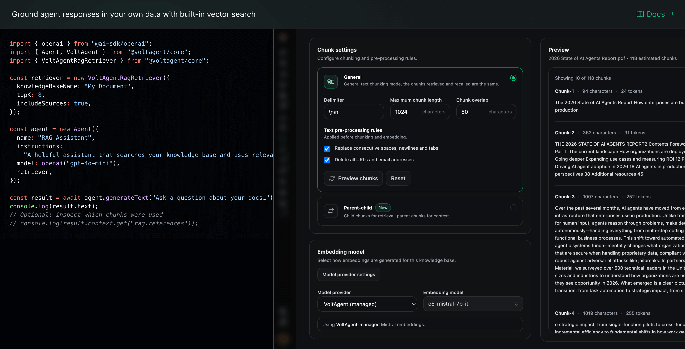

## 学习 VoltAgent

- **[从交互式教程开始](https://voltagent.dev/tutorial/introduction/)** 学习构建 AI 代理的基础知识。
- **[文档](https://voltagent.dev/docs/)**：深入了解指南、概念和教程。
- **[示例](https://github.com/voltagent/voltagent/tree/main/examples)**：探索实际实现。
- **[博客](https://voltagent.dev/blog/)**：阅读更多技术见解和最佳实践。

## 贡献

我们欢迎贡献！请参考贡献指南（如有可用链接）。加入我们的 [Discord](https://s.voltagent.dev/discord) 服务器进行提问和讨论。

## 贡献者 ♥️ 感谢

衷心感谢所有参与 VoltAgent 旅程的人，无论你构建了插件、提交了 issue、发了 pull request，还是只是在 Discord 或 GitHub Discussions 上帮助了他人。

VoltAgent 是一项社区努力，正因为有你们这样的人，它才不断变得更好。


## 许可证

基于 MIT 许可证授权，Copyright © 2026-present VoltAgent。
