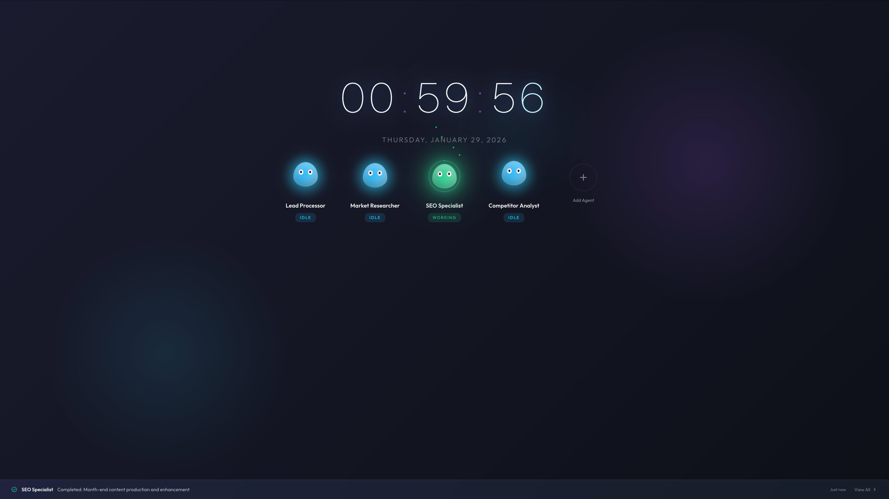

# Yao -- 构建自主代理，只需定义角色

Yao 是一个用于自主代理的开源引擎 -- 事件驱动、主动式、自调度。

**快速链接：**

**🏠 主页：** [https://yaoapps.com](https://yaoapps.com)

**🚀 快速入门：** [https://yaoapps.com/docs/documentation/en-us/getting-started](https://yaoapps.com/docs/documentation/en-us/getting-started#quickstart)

**📚 文档：** [https://yaoapps.com/docs](https://yaoapps.com/docs)

**✨ 为什么选择 Yao？** [https://yaoapps.com/docs/why-yao](https://yaoapps.com/docs/documentation/en-us/getting-started/why-yao)

**🤖 Yao 代理：** [https://github.com/YaoAgents/awesome](https://github.com/YaoAgents/awesome) ( 预览 )

---

## Yao 有何不同？

| 传统 AI 助手           | Yao 自主代理                       |
| ---------------------- | ---------------------------------- |
| 入口：聊天框            | 入口：邮件、事件、定时任务          |
| 被动：你问，它答        | 主动：自主工作                     |
| 角色：工具              | 角色：团队成员                     |

> 入口不是聊天框，而是邮件、事件和定时任务。

---

## 特性

### 自主代理框架

构建像真正团队成员一样工作的代理：

- **三种触发模式** -- 定时（scheduled）、人工触发（email/message）、事件（webhook/database）
- **六阶段执行** -- 启发 → 目标 → 任务 → 执行 → 交付 → 学习
- **多代理编排** -- 代理之间动态委派、协作与组合
- **持续学习** -- 代理在私有知识库中积累经验

### 原生 MCP 支持

无需编写适配器即可集成工具：

- **进程传输** -- 将 Yao 进程直接映射为 MCP 工具
- **外部服务器** -- 通过 SSE 或 STDIO 连接
- **Schema 映射** -- 声明式输入/输出 Schema

### 内置 GraphRAG

- **向量搜索** -- 使用 OpenAI/FastEmbed 生成嵌入向量
- **知识图谱** -- 实体关系检索
- **混合搜索** -- 结合向量相似度与图遍历

### 全栈运行时

一切尽在一个可执行文件中：

- **All-in-One** -- 数据、API、代理、UI 集于一个引擎
- **TypeScript 支持** -- 内置 V8 引擎
- **单一二进制文件** -- 无需 Node.js、Python 或容器
- **边缘就绪** -- 可在 ARM64/x64 设备上运行
