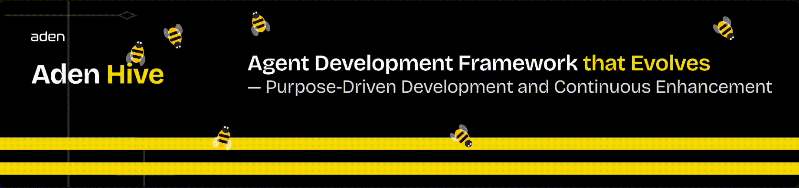
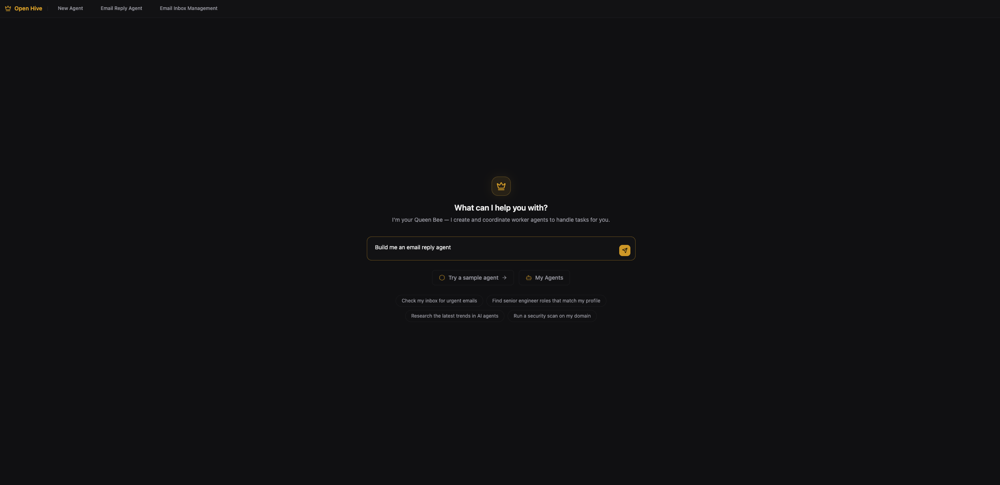
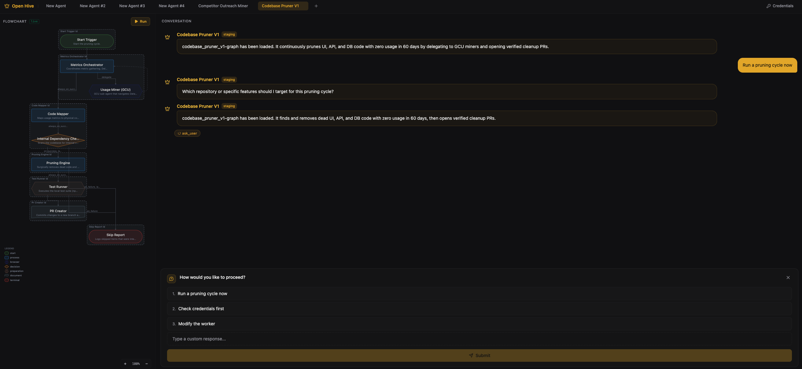
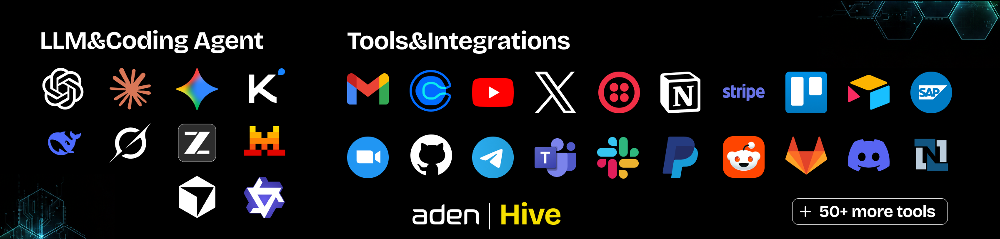
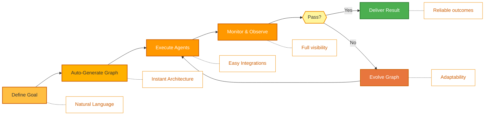
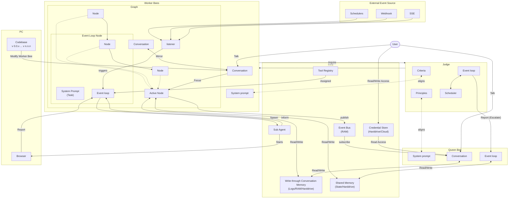
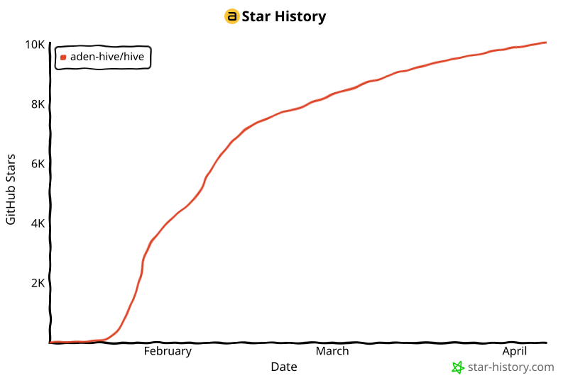

<p align="center">
  
</p>

<p align="center">
  <a href="README.md">English</a> |
  <a href="docs/i18n/zh-CN.md">简体中文</a> |
  <a href="docs/i18n/es.md">Español</a> |
  <a href="docs/i18n/hi.md">हिन्दी</a> |
  <a href="docs/i18n/pt.md">Português</a> |
  <a href="docs/i18n/ja.md">日本語</a> |
  <a href="docs/i18n/ru.md">Русский</a> |
  <a href="docs/i18n/ko.md">한국어</a>
</p>

<p align="center">
  <a href="https://github.com/aden-hive/hive/blob/main/LICENSE"></a>
  <a href="https://www.ycombinator.com/companies/aden"></a>
  <a href="https://discord.com/invite/MXE49hrKDk"></a>
  <a href="https://x.com/aden_hq"></a>
  <a href="https://www.linkedin.com/company/teamaden/"></a>
  
</p>

<p align="center">
  
  
  
  
  
  
</p>
<p align="center">
  
  
  
</p>

<p align="center"><em>面向生产工作负载的代理 harness —— 提供状态管理、故障恢复、可观测性和人工监督，让你的代理真正运转起来。</em></p>

## 概述

Hive 是一个面向生产环境中 AI 代理的运行时 harness。你用自然语言描述目标，编码代理（即 queen）会生成代理图和连接代码来实现该目标。在执行过程中，harness 负责管理状态隔离、基于检查点的崩溃恢复、成本管控和实时可观测性。当代理发生故障时，框架会捕获故障数据，通过编码代理进化代理图，并自动重新部署。内置的人在回路节点、浏览器控制、凭证管理和并行执行，让你在不牺牲灵活性的前提下获得生产级可靠性。

访问 [adenhq.com](https://adenhq.com) 获取完整文档、示例和指南。

访问 [HoneyComb](http://honeycomb.open-hive.com/) 查看 AI 正在自动化的工作岗位。这是一个岗位的股票市场，由社区 AI 代理的进展驱动。你可以根据你对某个岗位被 AI 取代程度的判断，做多或做空岗位（不使用真实货币，而是计算 token）。

https://github.com/user-attachments/assets/bf10edc3-06ba-48b6-98ba-d069b15fb69d

## Hive 适合谁？

Hive 是面向将 AI 代理从原型推向生产的团队的 harness 层。模型本身在不断变强，瓶颈在于围绕它们的基础设施：状态管理、故障恢复、成本控制和可观测性。

Hive 适合以下场景：

- 需要 AI 代理**执行真实业务流程**，而不仅仅是做演示
- 需要一个能**处理状态、恢复和并行执行**的大规模运行时
- 需要**自我修复和自适应的代理**，能够随时间不断改进
- 需要**人在回路控制**、可观测性和成本限制
- 计划在**生产环境**中运行代理，其中可用性、成本和可审计性至关重要

如果你只是实验简单的代理链或一次性脚本，Hive 可能不是最佳选择。

## 什么时候应该使用 Hive？

当瓶颈不再是模型，而是围绕它的 harness 时，就应使用 Hive：

- 长时间运行的代理需要**状态持久化和崩溃恢复**
- 生产工作负载需要**成本管控、可观测性和审计追踪**
- 代理需要通过故障捕获和图进化来**自我修复**
- 多代理协调需要**会话隔离和共享缓冲区**
- 框架需要**随模型改进而扩展**，而非与之对抗

## 快速链接

- **[文档](https://docs.adenhq.com/)** - 完整指南和 API 参考
- **[自托管指南](https://docs.adenhq.com/getting-started/quickstart)** - 在你的基础设施上部署 Hive
- **[更新日志](https://github.com/aden-hive/hive/releases)** - 最新更新和发布
- **[路线图](docs/roadmap.md)** - 即将推出的功能和计划
- **[报告问题](https://github.com/aden-hive/hive/issues)** - Bug 报告和功能请求
- **[贡献指南](CONTRIBUTING.md)** - 如何贡献和提交 PR

## 快速开始

### 前提条件

- Python 3.11+，用于代理开发
- 一个 LLM 提供商来驱动代理
- **ripgrep（可选，Windows 上推荐）：** `search_files` 工具使用 ripgrep 进行更快的文件搜索。如未安装，将使用 Python 回退方案。在 Windows 上：`winget install BurntSushi.ripgrep` 或 `scoop install ripgrep`

> **Windows 用户：** 通过 `quickstart.ps1` 和 `hive.ps1` 支持原生 Windows。请在 PowerShell 5.1+ 中运行。WSL 也是一种选择，但并非必需。

### 安装

> **注意**
> Hive 使用 `uv` workspace 布局，不通过 `pip install` 安装。
> 从仓库根目录运行 `pip install -e .` 会创建一个占位包，Hive 将无法正常工作。
> 请使用下面的快速启动脚本来设置环境。

```bash
# Clone the repository
git clone https://github.com/aden-hive/hive.git
cd hive

# Run quickstart setup (macOS/Linux)
./quickstart.sh

# Windows (PowerShell)
.\quickstart.ps1
```

这将设置：

- **framework** - 核心代理运行时和图执行器（在 `core/.venv` 中）
- **aden_tools** - 用于代理能力的 MCP 工具（在 `tools/.venv` 中）
- **credential store** - 加密的 API 密钥存储（`~/.hive/credentials`）
- **LLM 提供商** - 交互式默认模型配置，包括 Hive LLM 和 OpenRouter
- 所有必需的 Python 依赖（使用 `uv`）

- 最后，它会在浏览器中打开 Hive 界面

> **提示：** 之后要重新打开仪表板，在项目目录中运行 `hive open`。

### 构建你的第一个代理

在主页输入框中输入你想要构建的代理。Queen 会向你提问并与你一起制定解决方案。



### 使用模板代理

点击“Try a sample agent”查看模板。你可以直接运行模板，也可以在现有模板基础上构建你的版本。

### 运行代理

现在你可以通过选择代理（已有代理或示例代理）来运行它。你可以点击左上角的运行按钮，或与 queen 代理对话，让它替你运行代理。



## 功能特性

- **Browser-Use** - 控制你电脑上的浏览器来完成复杂任务
- **并行执行** - 并行执行生成的图。这样你可以让多个代理同时为你完成工作
- **[目标驱动生成](docs/key_concepts/goals_outcome.md)** - 用自然语言定义目标；编码代理生成代理图和连接代码来实现目标
- **[自适应性](docs/key_concepts/evolution.md)** - 框架捕获故障，根据目标进行校准，并进化代理图
- **[动态节点连接](docs/key_concepts/graph.md)** - 没有预定义的边；连接代码由任何有能力的 LLM 根据你的目标生成
- **SDK 封装的节点** - 每个节点开箱即得共享数据缓冲区、本地 RLM 内存、监控、工具和 LLM 访问
- **[人在回路](docs/key_concepts/graph.md#human-in-the-loop)** - 干预节点会暂停执行以等待人工输入，并支持可配置的超时和升级策略
- **实时可观测性** - WebSocket 流式传输，实时监控代理执行、决策和节点间通信

## 集成

<a href="https://github.com/aden-hive/hive/tree/main/tools/src/aden_tools/tools"></a>
Hive 的设计是模型无关和系统无关的。

- **LLM 灵活性** - Hive 框架支持 Anthropic、OpenAI、OpenRouter、Hive LLM 以及其他通过 LiteLLM 兼容提供商的托管或本地模型。
- **业务系统连接** - Hive 框架设计为通过 MCP 将各种业务系统作为工具连接，如 CRM、客服、消息、数据、文件和内部 API。

## 为什么选择 Hive

随着模型的改进，代理能力上限在提升——但其可靠性和生产价值由 harness 决定。Hive 专注于生成执行真实业务流程的代理，而非通用代理。你无需手动设计工作流、定义代理交互和被动处理故障，Hive 翻转了范式：**你描述目标，系统自行构建**——提供以结果为导向的自适应体验，以及易于使用的工具和集成。



### Hive 的优势

| 典型代理框架   | Hive                                   |
| -------------------------- | -------------------------------------- |
| 专注于模型编排 | **生产级 harness**：状态、恢复、可观测性 |
| 硬编码代理工作流   | 用自然语言描述目标     |
| 手动定义图    | 自动生成代理图            |
| 被动错误处理    | 结果评估和自适应性    |
| 静态工具配置 | 动态 SDK 封装的节点              |
| 单独设置监控  | 内置实时可观测性       |
| 自行管理预算      | 集成的成本控制和降级策略 |

### 工作原理

1. **[定义你的目标](docs/key_concepts/goals_outcome.md)** → 用自然语言描述你想要实现的目标
2. **编码代理生成** → 创建[代理图](docs/key_concepts/graph.md)、连接代码和测试用例
3. **[Worker 执行](docs/key_concepts/worker_agent.md)** → SDK 封装的节点在完整可观测性和工具访问下运行
4. **控制平面监控** → 实时指标、预算强制执行、策略管理
5. **[自适应性](docs/key_concepts/evolution.md)** → 发生故障时，系统自动进化图并重新部署

## 文档

- **[开发者指南](docs/developer-guide.md)** - 面向开发者的完整指南
- [入门指南](docs/getting-started.md) - 快速设置说明
- [配置指南](docs/configuration.md) - 所有配置选项
- [架构概览](docs/architecture/README.md) - 系统设计和结构

## 路线图

Aden Hive 代理框架旨在帮助开发者构建以结果为导向、自适应的代理。详见 [roadmap.md](docs/roadmap.md)。



## 贡献
我们欢迎社区贡献！我们特别期待在构建工具、集成和框架的示例代理方面获得帮助（[参见 #2805](https://github.com/aden-hive/hive/issues/2805)）。如果你有兴趣扩展其功能，这里是完美的起点。请参阅 [CONTRIBUTING.md](CONTRIBUTING.md) 了解指南。

**重要提示：** 请在提交 PR 之前先认领一个 issue。在 issue 下评论以认领，维护者会将其分配给你。包含可复现步骤和方案的 issue 会优先处理。这有助于避免重复工作。

1. 找到或创建一个 issue 并获得分配
2. Fork 仓库
3. 创建你的功能分支（`git checkout -b feature/amazing-feature`）
4. 提交你的更改（`git commit -m 'Add amazing feature'`）
5. 推送到分支（`git push origin feature/amazing-feature`）
6. 发起 Pull Request

## 社区与支持

我们使用 [Discord](https://discord.com/invite/MXE49hrKDk) 进行支持、功能请求和社区讨论。

- Discord - [加入社区](https://discord.com/invite/MXE49hrKDk)
- Twitter/X - [@adenhq](https://x.com/aden_hq)
- LinkedIn - [公司主页](https://www.linkedin.com/company/teamaden/)

## 加入我们的团队

**我们正在招聘！** 加入我们的工程、研究和市场推广岗位。

[查看开放职位](https://jobs.adenhq.com/a8cec478-cdbc-473c-bbd4-f4b7027ec193/applicant)

## 安全

如有安全问题，请参阅 [SECURITY.md](SECURITY.md)。

## 许可证

本项目基于 Apache License 2.0 许可——详见 [LICENSE](LICENSE) 文件。

## 常见问题 (FAQ)

**问：Hive 支持哪些 LLM 提供商？**

Hive 通过 LiteLLM 集成支持 100+ 个 LLM 提供商，包括 OpenAI（GPT-4、GPT-4o）、Anthropic（Claude 模型）、Google Gemini、DeepSeek、Mistral、Groq、OpenRouter 和 Hive LLM。只需设置相应的 API 密钥环境变量并指定模型名称。详见 [docs/configuration.md](docs/configuration.md) 中的提供商特定配置示例。

**问：我可以将 Hive 与 Ollama 等本地 AI 模型一起使用吗？**

可以！Hive 通过 LiteLLM 支持本地模型。只需使用模型名称格式 `ollama/model-name`（如 `ollama/llama3`、`ollama/mistral`），并确保 Ollama 在本地运行。

**问：Hive 与其他代理框架有什么不同？**

Hive 是一个代理 harness，而不仅仅是编排框架。它提供了生产运行时层——会话隔离、基于检查点的崩溃恢复、成本管控、实时可观测性和人在回路控制——使代理足够可靠以运行真实工作负载。在此基础上，Hive 从自然语言目标生成整个代理系统，并在代理故障时自动[进化图](docs/key_concepts/evolution.md)。稳健的 harness 与自我改进生成的结合，正是 Hive 的独特之处。

**问：Hive 是开源的吗？**

是的，Hive 完全开源，采用 Apache License 2.0。我们积极鼓励社区贡献和协作。

**问：Hive 支持人在回路的工作流吗？**

是的，Hive 完全支持[人在回路](docs/key_concepts/graph.md#human-in-the-loop)工作流，通过干预节点暂停执行以等待人工输入。这些工作流包含可配置的超时和升级策略，使人类专家与 AI 代理之间能够无缝协作。

**问：Hive 支持哪些编程语言？**

Hive 框架使用 Python 构建。JavaScript/TypeScript SDK 已在路线图中。

**问：Hive 代理可以与外部工具和 API 交互吗？**

可以。Aden 的 SDK 封装节点提供内置工具访问，框架支持灵活的工具生态系统。代理可以通过节点架构与外部 API、数据库和服务集成。

**问：Hive 中的成本控制如何工作？**

Hive 提供精细的预算控制，包括支出限制、限速和自动模型降级策略。你可以在团队、代理或工作流层面设置预算，并提供实时成本跟踪和告警。

**问：在哪里可以找到示例和文档？**

访问 [docs.adenhq.com](https://docs.adenhq.com/) 获取完整指南、API 参考和入门教程。仓库的 `docs/` 文件夹中也包含文档和完整的[开发者指南](docs/developer-guide.md)。

**问：如何为 Aden 做贡献？**

欢迎贡献！Fork 仓库，创建你的功能分支，实现你的更改，然后提交 pull request。详见 [CONTRIBUTING.md](CONTRIBUTING.md)。

## Star 历史

<a href="https://star-history.com/#aden-hive/hive&Date">
 <picture>
   <source media="(prefers-color-scheme: dark)" srcset="assets/006-svg-cb5622b808.svg" />
   <source media="(prefers-color-scheme: light)" srcset="assets/005-svg-46b8847530.svg" />
   
 </picture>
</a>

---

<p align="center">
  在旧金山以热情打造
</p>
