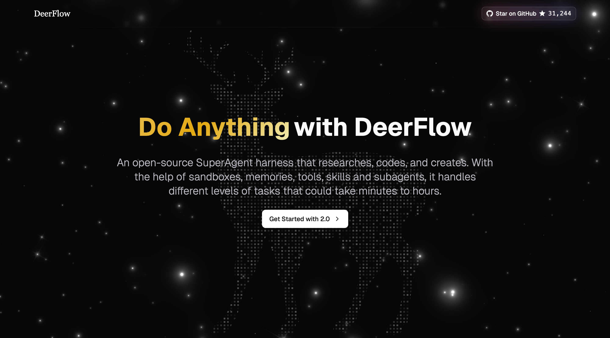
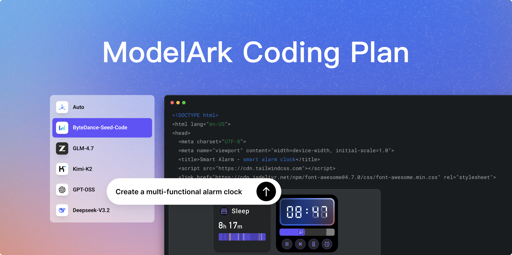
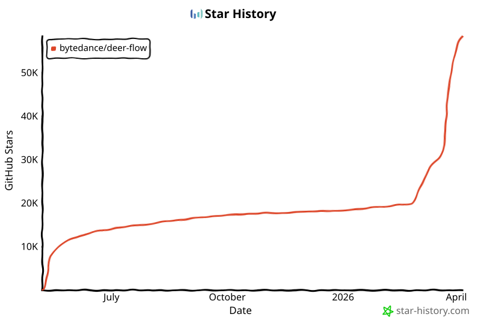

# 🦌 DeerFlow - 2.0

English | [中文](./README.zh-CN.md) | [日本語](./README_ja.md) | [Français](./README_fr.md) | [Русский](./README_ru.md)

[](./backend/pyproject.toml)
[](./Makefile)
[](./LICENSE)

<a href="https://trendshift.io/repositories/14699" target="_blank"></a>
> 2026年2月28日，DeerFlow 在 2.0 版本发布后登上 GitHub Trending 🏆 #1。衷心感谢我们出色的社区，是你们促成了这一切！💪🔥

DeerFlow（**D**eep **E**xploration and **E**fficient **R**esearch **Flow**）是一个开源的**超级代理执行底座**，通过编排**子代理**、**记忆**和**沙箱**来完成几乎任何事情，而这一切都由**可扩展的技能**驱动。

https://github.com/user-attachments/assets/a8bcadc4-e040-4cf2-8fda-dd768b999c18

> [!NOTE]
> **DeerFlow 2.0 是一次彻底重写。** 它与 v1 没有任何共享代码。如果你在找原来的 Deep Research 框架，它在 [`1.x` 分支](https://github.com/bytedance/deer-flow/tree/main-1.x) 上维护——仍然欢迎贡献。目前的活跃开发已全面转向 2.0。

## 官方网站

[](https://deerflow.tech)

在我们的[**官方网站**](https://deerflow.tech)上了解更多并观看**真实演示**。

## 来自字节跳动火山引擎的 Coding Plan



- 我们强烈推荐使用 Doubao-Seed-2.0-Code、DeepSeek v3.2 和 Kimi 2.5 来运行 DeerFlow
- [了解更多](https://www.byteplus.com/en/activity/codingplan?utm_campaign=deer_flow&utm_content=deer_flow&utm_medium=devrel&utm_source=OWO&utm_term=deer_flow)
- [中国大陆地区的开发者请点击这里](https://www.volcengine.com/activity/codingplan?utm_campaign=deer_flow&utm_content=deer_flow&utm_medium=devrel&utm_source=OWO&utm_term=deer_flow)

## InfoQuest

DeerFlow 新近集成了由 BytePlus 自主研发的智能搜索与爬取工具集——[InfoQuest（支持免费在线体验）](https://docs.byteplus.com/en/docs/InfoQuest/What_is_Info_Quest)

<a href="https://docs.byteplus.com/en/docs/InfoQuest/What_is_Info_Quest" target="_blank">
  
</a>

---

## 目录

- [🦌 DeerFlow - 2.0](#-deerflow---20)
  - [官方网站](#官方网站)
  - [来自字节跳动火山引擎的 Coding Plan](#来自字节跳动火山引擎的-coding-plan)
  - [InfoQuest](#infoquest)
  - [目录](#目录)
  - [一行命令设置代理](#一行命令设置代理)
  - [快速开始](#快速开始)
    - [配置](#配置)
    - [运行应用](#运行应用)
      - [方式一：Docker（推荐）](#方式一docker推荐)
      - [方式二：本地开发](#方式二本地开发)
    - [高级配置](#高级配置)
      - [沙箱模式](#沙箱模式)
      - [MCP 服务器](#mcp-服务器)
      - [IM 通道](#im-通道)
      - [LangSmith 追踪](#langsmith-追踪)
      - [Langfuse 追踪](#langfuse-追踪)
      - [同时使用两个提供商](#同时使用两个提供商)
  - [从 Deep Research 到超级代理执行底座](#从-deep-research-到超级代理执行底座)
  - [核心功能](#核心功能)
    - [技能与工具](#技能与工具)
      - [Claude Code 集成](#claude-code-集成)
    - [子代理](#子代理)
    - [沙箱与文件系统](#沙箱与文件系统)
    - [上下文工程](#上下文工程)
    - [长期记忆](#长期记忆)
  - [推荐模型](#推荐模型)
  - [嵌入式 Python 客户端](#嵌入式-python-客户端)
  - [文档](#文档)
  - [⚠️ 安全须知](#️-安全须知)
    - [不当部署可能带来安全风险](#不当部署可能带来安全风险)
    - [安全建议](#安全建议)
  - [贡献](#贡献)
  - [许可证](#许可证)
  - [致谢](#致谢)
    - [核心贡献者](#核心贡献者)
  - [Star 历史](#star-历史)

## 一行命令设置代理

如果你使用 Claude Code、Codex、Cursor、Windsurf 或其他编程代理，可以用一句话把设置指令交给它：

```text
Help me clone DeerFlow if needed, then bootstrap it for local development by following https://raw.githubusercontent.com/bytedance/deer-flow/main/Install.md
```

这个提示词是专为编程代理设计的。它会告诉代理在需要时克隆仓库、在可用时选择 Docker，然后停在精确的下一步命令处，并列出用户仍需提供的缺失配置。

## 快速开始

### 配置

1. **克隆 DeerFlow 仓库**

   ```bash
   git clone https://github.com/bytedance/deer-flow.git
   cd deer-flow
   ```

2. **生成本地配置文件**

   从项目根目录（`deer-flow/`）运行：

   ```bash
   make config
   ```

   该命令会根据提供的示例模板创建本地配置文件。

3. **配置你想要使用的模型**

   编辑 `config.yaml`，至少定义一个模型：

   ```yaml
   models:
     - name: gpt-4                       # 内部标识符
       display_name: GPT-4               # 人类可读名称
       use: langchain_openai:ChatOpenAI  # LangChain 类路径
       model: gpt-4                      # API 的模型标识符
       api_key: $OPENAI_API_KEY          # API 密钥（建议使用环境变量）
       max_tokens: 4096                  # 每次请求的最大 token 数
       temperature: 0.7                  # 采样温度

     - name: openrouter-gemini-2.5-flash
       display_name: Gemini 2.5 Flash (OpenRouter)
       use: langchain_openai:ChatOpenAI
       model: google/gemini-2.5-flash-preview
       api_key: $OPENAI_API_KEY          # OpenRouter 此处仍使用 OpenAI 兼容的字段名
       base_url: https://openrouter.ai/api/v1

     - name: gpt-5-responses
       display_name: GPT-5 (Responses API)
       use: langchain_openai:ChatOpenAI
       model: gpt-5
       api_key: $OPENAI_API_KEY
       use_responses_api: true
       output_version: responses/v1

     - name: qwen3-32b-vllm
       display_name: Qwen3 32B (vLLM)
       use: deerflow.models.vllm_provider:VllmChatModel
       model: Qwen/Qwen3-32B
       api_key: $VLLM_API_KEY
       base_url: http://localhost:8000/v1
       supports_thinking: true
       when_thinking_enabled:
         extra_body:
           chat_template_kwargs:
             enable_thinking: true
   ```

   OpenRouter 及类似的 OpenAI 兼容网关应使用 `langchain_openai:ChatOpenAI` 加 `base_url` 进行配置。如果你更倾向于使用提供商特定的环境变量名，请显式地将 `api_key` 指向该变量（例如 `api_key: $OPENROUTER_API_KEY`）。

   要通过 `/v1/responses` 路由 OpenAI 模型，继续使用 `langchain_openai:ChatOpenAI` 并设置 `use_responses_api: true` 和 `output_version: responses/v1`。

   对于 vLLM 0.19.0，使用 `deerflow.models.vllm_provider:VllmChatModel`。对于 Qwen 风格的推理模型，DeerFlow 通过 `extra_body.chat_template_kwargs.enable_thinking` 切换推理，并在多轮工具调用对话中保留 vLLM 的非标准 `reasoning` 字段。旧的 `thinking` 配置会自动规范化以确保向后兼容。推理模型可能还需要服务器以 `--reasoning-parser ...` 方式启动。如果你的本地 vLLM 部署接受任意非空 API 密钥，你仍可将 `VLLM_API_KEY` 设置为一个占位值。

   CLI 支持的提供商示例：

   ```yaml
   models:
     - name: gpt-5.4
       display_name: GPT-5.4 (Codex CLI)
       use: deerflow.models.openai_codex_provider:CodexChatModel
       model: gpt-5.4
       supports_thinking: true
       supports_reasoning_effort: true

     - name: claude-sonnet-4.6
       display_name: Claude Sonnet 4.6 (Claude Code OAuth)
       use: deerflow.models.claude_provider:ClaudeChatModel
       model: claude-sonnet-4-6
       max_tokens: 4096
       supports_thinking: true
   ```

   - Codex CLI 读取 `~/.codex/auth.json`
   - Codex Responses 端点当前会拒绝 `max_tokens` 和 `max_output_tokens`，因此 `CodexChatModel` 不暴露请求级别的 token 上限
   - Claude Code 接受 `CLAUDE_CODE_OAUTH_TOKEN`、`ANTHROPIC_AUTH_TOKEN`、`CLAUDE_CODE_OAUTH_TOKEN_FILE_DESCRIPTOR`、`CLAUDE_CODE_CREDENTIALS_PATH` 或明文 `~/.claude/.credentials.json`
   - ACP 代理条目与模型提供商是分开的。如果你配置了 `acp_agents.codex`，请将其指向 Codex ACP 适配器，例如 `npx -y @zed-industries/codex-acp`；标准的 `codex` CLI 二进制文件本身不兼容 ACP
   - 在 macOS 上，DeerFlow 不会自动探测 Keychain。如需要请显式导出 Claude Code 认证信息：

   ```bash
   eval "$(python3 scripts/export_claude_code_oauth.py --print-export)"
   ```
   
4. **为已配置的模型设置 API 密钥**

   选择以下方法之一：

- 方式 A：编辑项目根目录的 `.env` 文件（推荐）

   ```bash
   TAVILY_API_KEY=your-tavily-api-key
   OPENAI_API_KEY=your-openai-api-key
   # 当配置使用 langchain_openai:ChatOpenAI + base_url 时，OpenRouter 也使用 OPENAI_API_KEY
   # 按需添加其他提供商的密钥
   INFOQUEST_API_KEY=your-infoquest-api-key
   ```

- 方式 B：在 shell 中导出环境变量

   ```bash
   export OPENAI_API_KEY=your-openai-api-key
   ```

   对于 CLI 支持的提供商：
   - Codex CLI：`~/.codex/auth.json`
   - Claude Code OAuth：显式环境变量/文件传递或 `~/.claude/.credentials.json`

- 方式 C：直接编辑 `config.yaml`（不推荐用于生产环境）

   ```yaml
   models:
     - name: gpt-4
       api_key: your-actual-api-key-here  # 替换占位符
   ```

### 运行应用

#### 方式一：Docker（推荐）

**开发模式**（热重载、源码挂载）：

```bash
make docker-init    # 拉取沙箱镜像（仅需一次或镜像更新时）
make docker-start   # 启动服务（自动从 config.yaml 检测沙箱模式）
```

`make docker-start` 仅在 `config.yaml` 使用 provisioner 模式（`sandbox.use: deerflow.community.aio_sandbox:AioSandboxProvider` 配合 `provisioner_url`）时才启动 `provisioner`。

Docker 构建默认使用上游 `uv` 注册表。如果在受限网络中需要更快的镜像，请在运行 `make docker-init` 或 `make docker-start` 之前导出 `UV_INDEX_URL=https://pypi.tuna.tsinghua.edu.cn/simple` 和 `NPM_REGISTRY=https://registry.npmmirror.com`。

后端进程会在下次访问配置时自动获取 `config.yaml` 的变更，因此在开发过程中模型元数据更新不需要手动重启。

> [!TIP]
> 在 Linux 上，如果基于 Docker 的命令出现 `permission denied while trying to connect to the Docker daemon socket at unix:///var/run/docker.sock` 错误，请将你的用户添加到 `docker` 组并重新登录后重试。完整修复方案见 [CONTRIBUTING.md](CONTRIBUTING.md#linux-docker-daemon-permission-denied)。

**生产模式**（本地构建镜像、挂载运行时配置和数据）：

```bash
make up     # 构建镜像并启动所有生产服务
make down   # 停止并移除容器
```

> [!NOTE]
> LangGraph 代理服务器当前通过 `langgraph dev`（开源 CLI 服务器）运行。

访问地址：http://localhost:2026

详细的 Docker 开发指南请参阅 [CONTRIBUTING.md](CONTRIBUTING.md)。

#### 方式二：本地开发

如果你更倾向于在本地运行服务：

前提条件：先完成上述"配置"步骤（`make config` 和模型 API 密钥）。`make dev` 需要有效的配置文件（默认为项目根目录的 `config.yaml`；可通过 `DEER_FLOW_CONFIG_PATH` 覆盖）。
在 Windows 上，请从 Git Bash 运行本地开发流程。不支持原生的 `cmd.exe` 和 PowerShell，因为某些脚本依赖 Git for Windows 的工具如 `cygpath`，WSL 也不能保证兼容。

1. **检查前提条件**：
   ```bash
   make check  # 验证 Node.js 22+、pnpm、uv、nginx
   ```

2. **安装依赖**：
   ```bash
   make install  # 安装后端 + 前端依赖
   ```

3. **（可选）预先拉取沙箱镜像**：
   ```bash
   # 如果使用 Docker/容器沙箱则推荐
   make setup-sandbox
   ```

4. **（可选）加载示例记忆数据供本地审查**：
   ```bash
   python scripts/load_memory_sample.py
   ```
   这会将示例数据复制到默认的本地运行时记忆文件中，方便审查者立即测试 `Settings > Memory`。
   最简审查流程见 [backend/docs/MEMORY_SETTINGS_REVIEW.md](backend/docs/MEMORY_SETTINGS_REVIEW.md)。

5. **启动服务**：
   ```bash
   make dev
   ```

6. **访问**：http://localhost:2026

#### 启动模式

DeerFlow 在两个维度上支持多种启动模式：

- **Dev / Prod** — 开发模式启用热重载；生产模式使用预构建的前端
- **Standard / Gateway** — 标准模式使用独立的 LangGraph 服务器（4 个进程）；Gateway 模式（实验性）将代理运行时嵌入 Gateway API（3 个进程）

| | **本地前台** | **本地守护进程** | **Docker 开发** | **Docker 生产** |
|---|---|---|---|---|
| **Dev** | `./scripts/serve.sh --dev`<br/>`make dev` | `./scripts/serve.sh --dev --daemon`<br/>`make dev-daemon` | `./scripts/docker.sh start`<br/>`make docker-start` | — |
| **Dev + Gateway** | `./scripts/serve.sh --dev --gateway`<br/>`make dev-pro` | `./scripts/serve.sh --dev --gateway --daemon`<br/>`make dev-daemon-pro` | `./scripts/docker.sh start --gateway`<br/>`make docker-start-pro` | — |
| **Prod** | `./scripts/serve.sh --prod`<br/>`make start` | `./scripts/serve.sh --prod --daemon`<br/>`make start-daemon` | — | `./scripts/deploy.sh`<br/>`make up` |
| **Prod + Gateway** | `./scripts/serve.sh --prod --gateway`<br/>`make start-pro` | `./scripts/serve.sh --prod --gateway --daemon`<br/>`make start-daemon-pro` | — | `./scripts/deploy.sh --gateway`<br/>`make up-pro` |

| 操作 | 本地 | Docker 开发 | Docker 生产 |
|---|---|---|---|
| **停止** | `./scripts/serve.sh --stop`<br/>`make stop` | `./scripts/docker.sh stop`<br/>`make docker-stop` | `./scripts/deploy.sh down`<br/>`make down` |
| **重启** | `./scripts/serve.sh --restart [flags]` | `./scripts/docker.sh restart` | — |

> **Gateway 模式**消除了 LangGraph 服务器进程——Gateway API 通过异步任务直接处理代理执行，自行管理并发。

#### 为什么使用 Gateway 模式？

在标准模式下，DeerFlow 运行一个专用的 [LangGraph Platform](https://langchain-ai.github.io/langgraph/) 服务器，与 Gateway API 并行。这种架构运行良好，但存在一些权衡：

| | 标准模式 | Gateway 模式 |
|---|---|---|
| **架构** | Gateway（REST API）+ LangGraph（代理运行时） | Gateway 嵌入代理运行时 |
| **并发** | 每个 worker 的 `--n-jobs-per-worker`（需要许可证） | `--workers` × 异步任务（无每个 worker 上限） |
| **容器/进程** | 4（前端、gateway、langgraph、nginx） | 3（前端、gateway、nginx） |
| **资源占用** | 较高（两个 Python 运行时） | 较低（单个 Python 运行时） |
| **LangGraph Platform 许可证** | 生产镜像必需 | 不需要 |
| **冷启动** | 较慢（两个服务需要初始化） | 较快 |

两种模式在功能上完全等价——相同的代理、工具和技能在任一模式下都能正常工作。

#### Docker 生产部署

`deploy.sh` 支持分别进行构建和启动。镜像是模式无关的——运行时模式在启动时选择：

```bash
# 一步完成（构建 + 启动）
deploy.sh                    # 标准模式（默认）
deploy.sh --gateway          # gateway 模式

# 两步完成（构建一次，以任意模式启动）
deploy.sh build              # 构建所有镜像
deploy.sh start              # 以标准模式启动
deploy.sh start --gateway    # 以 gateway 模式启动

# 停止
deploy.sh down
```

### 高级配置
#### 沙箱模式

DeerFlow 支持多种沙箱执行模式：
- **本地执行**（直接在宿主机上运行沙箱代码）
- **Docker 执行**（在隔离的 Docker 容器中运行沙箱代码）
- **带 Kubernetes 的 Docker 执行**（通过 provisioner 服务在 Kubernetes Pod 中运行沙箱代码）

对于 Docker 开发，服务启动会遵循 `config.yaml` 的沙箱模式。在本地/Docker 模式下，`provisioner` 不会启动。

请参阅[沙箱配置指南](backend/docs/CONFIGURATION.md#sandbox)来配置你偏好的模式。

#### MCP 服务器

DeerFlow 支持可配置的 MCP 服务器和技能来扩展其能力。
对于 HTTP/SSE MCP 服务器，支持 OAuth 令牌流程（`client_credentials`、`refresh_token`）。
详细说明请参阅 [MCP 服务器指南](backend/docs/MCP_SERVER.md)。

#### IM 通道

DeerFlow 支持从即时通讯应用接收任务。频道在配置后自动启动——所有渠道均不需要公网 IP。

| 渠道 | 传输方式 | 难度 |
|---------|-----------|------------|
| Telegram | Bot API（长轮询） | 简单 |
| Slack | Socket Mode | 中等 |
| 飞书 / Lark | WebSocket | 中等 |
| 企业微信 | WebSocket | 中等 |

**在 `config.yaml` 中配置：**

```yaml
channels:
  # LangGraph Server URL（默认：http://localhost:2024）
  langgraph_url: http://localhost:2024
  # Gateway API URL（默认：http://localhost:8001）
  gateway_url: http://localhost:8001

  # 可选：所有移动渠道的全局会话默认值
  session:
    assistant_id: lead_agent  # 或自定义代理名称；自定义代理通过 lead_agent + agent_name 路由
    config:
      recursion_limit: 100
    context:
      thinking_enabled: true
      is_plan_mode: false
      subagent_enabled: false

  feishu:
    enabled: true
    app_id: $FEISHU_APP_ID
    app_secret: $FEISHU_APP_SECRET
    # domain: https://open.feishu.cn       # 中国大陆（默认）
    # domain: https://open.larksuite.com   # 国际版

  wecom:
    enabled: true
    bot_id: $WECOM_BOT_ID
    bot_secret: $WECOM_BOT_SECRET

  slack:
    enabled: true
    bot_token: $SLACK_BOT_TOKEN     # xoxb-...
    app_token: $SLACK_APP_TOKEN     # xapp-... (Socket Mode)
    allowed_users: []               # 空 = 允许所有人

  telegram:
    enabled: true
    bot_token: $TELEGRAM_BOT_TOKEN
    allowed_users: []               # 空 = 允许所有人

    # 可选：按渠道/按用户的会话设置
    session:
      assistant_id: mobile-agent  # 此处也支持自定义代理名称
      context:
        thinking_enabled: false
      users:
        "123456789":
          assistant_id: vip-agent
          config:
            recursion_limit: 150
          context:
            thinking_enabled: true
            subagent_enabled: true
```

注意事项：
- `assistant_id: lead_agent` 直接调用默认的 LangGraph assistant。
- 如果 `assistant_id` 设为自定义代理名称，DeerFlow 仍会通过 `lead_agent` 路由，并将该值注入为 `agent_name`，这样自定义代理的 SOUL/配置就会在 IM 通道中生效。

在 `.env` 文件中设置对应的 API 密钥：

```bash
# Telegram
TELEGRAM_BOT_TOKEN=123456789:ABCdefGHIjklMNOpqrSTUvwxYZ

# Slack
SLACK_BOT_TOKEN=xoxb-...
SLACK_APP_TOKEN=xapp-...

# 飞书 / Lark
FEISHU_APP_ID=cli_xxxx
FEISHU_APP_SECRET=your_app_secret

# 企业微信
WECOM_BOT_ID=your_bot_id
WECOM_BOT_SECRET=your_bot_secret
```

**Telegram 设置**

1. 与 [@BotFather](https://t.me/BotFather) 对话，发送 `/newbot`，复制 HTTP API token。
2. 在 `.env` 中设置 `TELEGRAM_BOT_TOKEN` 并在 `config.yaml` 中启用该渠道。

**Slack 设置**

1. 在 [api.slack.com/apps](https://api.slack.com/apps) 创建 Slack App → Create New App → From scratch。
2. 在 **OAuth & Permissions** 下，添加 Bot Token Scopes：`app_mentions:read`、`chat:write`、`im:history`、`im:read`、`im:write`、`files:write`。
3. 启用 **Socket Mode** → 生成一个带有 `connections:write` scope 的 App-Level Token（`xapp-…`）。
4. 在 **Event Subscriptions** 下，订阅 bot 事件：`app_mention`、`message.im`。
5. 在 `.env` 中设置 `SLACK_BOT_TOKEN` 和 `SLACK_APP_TOKEN` 并在 `config.yaml` 中启用该渠道。

**飞书 / Lark 设置**

1. 在[飞书开放平台](https://open.feishu.cn/)创建应用 → 启用**机器人**能力。
2. 添加权限：`im:message`、`im:message.p2p_msg:readonly`、`im:resource`。
3. 在**事件**下，订阅 `im.message.receive_v1` 并选择**长连接**模式。
4. 复制 App ID 和 App Secret。在 `.env` 中设置 `FEISHU_APP_ID` 和 `FEISHU_APP_SECRET` 并在 `config.yaml` 中启用该渠道。

**企业微信设置**

1. 在企业微信 AI Bot 平台上创建机器人，获取 `bot_id` 和 `bot_secret`。
2. 在 `config.yaml` 中启用 `channels.wecom` 并填写 `bot_id` / `bot_secret`。
3. 在 `.env` 中设置 `WECOM_BOT_ID` 和 `WECOM_BOT_SECRET`。
4. 确保后端依赖包含 `wecom-aibot-python-sdk`。该渠道使用 WebSocket 长连接，不需要公网回调 URL。
5. 当前集成支持接收文本、图片和文件消息。代理生成的最终图片/文件也会发送回企业微信会话。

当 DeerFlow 在 Docker Compose 中运行时，IM 通道在 `gateway` 容器内执行。此时，不要将 `channels.langgraph_url` 或 `channels.gateway_url` 指向 `localhost`；请使用容器服务名称如 `http://langgraph:2024` 和 `http://gateway:8001`，或设置 `DEER_FLOW_CHANNELS_LANGGRAPH_URL` 和 `DEER_FLOW_CHANNELS_GATEWAY_URL`。

**命令**

渠道连接后，你可以直接从聊天中与 DeerFlow 交互：

| 命令 | 描述 |
|---------|-------------|
| `/new` | 开始新对话 |
| `/status` | 显示当前会话信息 |
| `/models` | 列出可用模型 |
| `/memory` | 查看记忆 |
| `/help` | 显示帮助 |

> 不带命令前缀的消息会被当作普通聊天——DeerFlow 会创建一个会话并以对话方式回应。

#### LangSmith 追踪

DeerFlow 内置了 [LangSmith](https://smith.langchain.com) 集成用于可观测性。启用后，所有 LLM 调用、代理运行和工具执行都会被追踪并在 LangSmith 仪表盘中可见。

在 `.env` 文件中添加以下内容：

```bash
LANGSMITH_TRACING=true
LANGSMITH_ENDPOINT=https://api.smith.langchain.com
LANGSMITH_API_KEY=lsv2_pt_xxxxxxxxxxxxxxxx
LANGSMITH_PROJECT=xxx
```

#### Langfuse 追踪

DeerFlow 也支持 [Langfuse](https://langfuse.com) 可观测性，兼容 LangChain 运行。

在 `.env` 文件中添加以下内容：

```bash
LANGFUSE_TRACING=true
LANGFUSE_PUBLIC_KEY=pk-lf-xxxxxxxxxxxxxxxx
LANGFUSE_SECRET_KEY=sk-lf-xxxxxxxxxxxxxxxx
LANGFUSE_BASE_URL=https://cloud.langfuse.com
```

如果你使用自托管的 Langfuse 实例，请将 `LANGFUSE_BASE_URL` 设置为你的部署 URL。

#### 同时使用两个提供商

如果同时启用了 LangSmith 和 Langfuse，DeerFlow 会附加两个追踪回调，将相同的模型活动报告给两个系统。

如果某个提供商被显式启用但缺少必要的凭据，或其回调初始化失败，DeerFlow 会在模型创建期间初始化追踪时快速失败，错误信息会指出导致失败的提供商。

对于 Docker 部署，追踪默认禁用。在 `.env` 中设置 `LANGSMITH_TRACING=true` 和 `LANGSMITH_API_KEY` 来启用。

## 从 Deep Research 到超级代理执行底座

DeerFlow 最初是一个 Deep Research 框架——而社区把它推向了更远的地方。自发布以来，开发者将它用到了研究之外的领域：构建数据管道、生成幻灯片、搭建仪表盘、自动化内容工作流。这些是我们从未预料到的用途。

这告诉我们一件重要的事：DeerFlow 不仅仅是一个研究工具。它是一个**执行底座**，一个为代理提供基础设施、让它们真正把工作做完的运行时。

所以我们从头重建了它。

DeerFlow 2.0 不再是一个需要你手动拼装的框架。它是一个超级代理执行底座，开箱即用、完全可扩展。基于 LangGraph 和 LangChain 构建，它自带代理所需的一切：文件系统、记忆、技能、沙箱感知执行，以及为复杂多步骤任务规划和生成子代理的能力。

直接使用。或者拆开它，让它成为你的。

## 核心功能

### 技能与工具

技能是让 DeerFlow 几乎能做*任何事*的关键。

一个标准的代理技能是一个结构化的能力模块——一个 Markdown 文件，定义了工作流、最佳实践以及对支持资源的引用。DeerFlow 内置了用于研究、报告生成、幻灯片创建、网页、图像和视频生成等方面的技能。但真正的力量在于可扩展性：你可以添加自己的技能、替换内置技能，或将它们组合成复合工作流。

技能是渐进式加载的——只在任务需要时才加载，而非一次性全部加载。这保持了上下文窗口的精简，使 DeerFlow 即使在 token 敏感的模型上也能良好运行。

当你通过 Gateway 安装 `.skill` 归档文件时，DeerFlow 接受标准的可选 frontmatter 元数据（如 `version`、`author` 和 `compatibility`），而不是拒绝其他有效的外部技能。

工具遵循相同的理念。DeerFlow 自带核心工具集——网页搜索、网页抓取、文件操作、bash 执行——并通过 MCP 服务器和 Python 函数支持自定义工具。随意替换。随意添加。

Gateway 生成的后续建议现在在解析 JSON 数组响应之前，会对纯字符串模型输出和块/列表样式的富内容进行统一规范化，因此提供商特定的内容包装器不会静默丢弃建议。

```
# 沙箱容器内的路径
/mnt/skills/public
├── research/SKILL.md
├── report-generation/SKILL.md
├── slide-creation/SKILL.md
├── web-page/SKILL.md
└── image-generation/SKILL.md

/mnt/skills/custom
└── your-custom-skill/SKILL.md      ← 你的
```

#### Claude Code 集成

`claude-to-deerflow` 技能让你可以直接从 [Claude Code](https://docs.anthropic.com/en/docs/claude-code) 与运行中的 DeerFlow 实例交互。发送研究任务、检查状态、管理会话——一切无需离开终端。

**安装技能**：

```bash
npx skills add https://github.com/bytedance/deer-flow --skill claude-to-deerflow
```

然后确保 DeerFlow 正在运行（默认地址 `http://localhost:2026`），在 Claude Code 中使用 `/claude-to-deerflow` 命令。

**你可以做什么**：
- 向 DeerFlow 发送消息并获取流式响应
- 选择执行模式：flash（快速）、standard、pro（规划）、ultra（子代理）
- 检查 DeerFlow 健康状态、列出模型/技能/代理
- 管理会话和对话历史
- 上传文件进行分析

**环境变量**（可选，用于自定义端点）：

```bash
DEERFLOW_URL=http://localhost:2026            # 统一代理基础 URL
DEERFLOW_GATEWAY_URL=http://localhost:2026    # Gateway API
DEERFLOW_LANGGRAPH_URL=http://localhost:2026/api/langgraph  # LangGraph API
```

完整 API 参考见 [`skills/public/claude-to-deerflow/SKILL.md`](skills/public/claude-to-deerflow/SKILL.md)。

### 子代理

复杂任务很少能一步完成。DeerFlow 会将它们分解。

主代理可以动态生成子代理——每个子代理都有自己独立的作用域上下文、工具和终止条件。子代理在可能的情况下并行运行，返回结构化结果，然后主代理将所有内容综合成一致的输出。

这就是 DeerFlow 处理耗时数分钟到数小时任务的方式：一个研究任务可能会分发到十几个子代理，每个探索不同的角度，然后汇聚成一份报告，或一个网站，或一套带有生成视觉效果的幻灯片。同一个底座，多双手协作。

### 沙箱与文件系统

DeerFlow 不只是*空谈*做事。它有自己的计算机。

每个任务都有自己独立的执行环境和完整的文件系统视图——技能、工作区、上传文件、输出。代理可以读取、写入和编辑文件。它可以查看图像，并在安全配置的前提下执行 shell 命令。

使用 `AioSandboxProvider` 时，shell 执行在隔离容器中运行。使用 `LocalSandboxProvider` 时，文件工具仍映射到宿主机上每线程的目录，但宿主机的 `bash` 默认禁用，因为它不是安全隔离边界。仅在完全可信的本地工作流中重新启用宿主机 bash。

这就是一个有工具访问权限的聊天机器人与一个拥有真正执行环境的代理之间的区别。

```
# 沙箱容器内的路径
/mnt/user-data/
├── uploads/          ← 你的文件
├── workspace/        ← 代理的工作目录
└── outputs/          ← 最终交付物
```

### 上下文工程

**隔离的子代理上下文**：每个子代理在自己独立的上下文中运行。这意味着子代理无法看到主代理或其他子代理的上下文。这很重要，它确保子代理能专注于手头的任务，不被主代理或其他子代理的上下文干扰。

**摘要**：在会话内，DeerFlow 积极管理上下文——对已完成的子任务进行摘要、将中间结果卸载到文件系统、压缩不再立即相关的内容。这让它在长时间的多步骤任务中保持敏锐，而不会撑爆上下文窗口。

### 长期记忆

大多数代理在对话结束的那一刻就会忘记一切。DeerFlow 记得。

跨会话之间，DeerFlow 会构建关于你的个人资料、偏好和累积知识的持久记忆。你用得越多，它就越了解你——你的写作风格、你的技术栈、你反复使用的工作流。记忆存储在本地，完全由你控制。

记忆更新现在在应用时会跳过重复的事实条目，因此重复的偏好和上下文不会跨会话无限累积。

## 推荐模型

DeerFlow 与模型无关——它适用于任何实现了 OpenAI 兼容 API 的 LLM。话虽如此，它在以下方面表现更佳的模型上效果最好：

- **长上下文窗口**（100k+ token）用于深度研究和多步骤任务
- **推理能力**用于自适应规划和复杂分解
- **多模态输入**用于图像理解和视频理解
- **强工具使用**用于可靠的函数调用和结构化输出

## 嵌入式 Python 客户端

DeerFlow 可以作为嵌入式 Python 库使用，无需运行完整的 HTTP 服务。`DeerFlowClient` 提供对所有代理和 Gateway 能力的直接进程内访问，返回与 HTTP Gateway API 相同的响应结构。HTTP Gateway 还暴露了 `DELETE /api/threads/{thread_id}` 用于在 LangGraph 会话本身被删除后移除 DeerFlow 管理的本地会话数据：

```python
from deerflow.client import DeerFlowClient

client = DeerFlowClient()

# 聊天
response = client.chat("Analyze this paper for me", thread_id="my-thread")

# 流式传输（LangGraph SSE 协议：values、messages-tuple、end）
for event in client.stream("hello"):
    if event.type == "messages-tuple" and event.data.get("type") == "ai":
        print(event.data["content"])

# 配置与管理 — 返回 Gateway 对齐的字典
models = client.list_models()        # {"models": [...]}
skills = client.list_skills()        # {"skills": [...]}
client.update_skill("web-search", enabled=True)
client.upload_files("thread-1", ["./report.pdf"])  # {"success": True, "files": [...]}
```

所有返回字典的方法都在 CI 中通过 Gateway Pydantic 响应模型进行验证（`TestGatewayConformance`），确保嵌入式客户端与 HTTP API 响应结构保持同步。完整 API 文档见 `backend/packages/harness/deerflow/client.py`。

## 文档

- [贡献指南](CONTRIBUTING.md) - 开发环境设置和工作流
- [配置指南](backend/docs/CONFIGURATION.md) - 设置和配置说明
- [架构概览](backend/CLAUDE.md) - 技术架构详情
- [后端架构](backend/README.md) - 后端架构和 API 参考

## ⚠️ 安全须知

### 不当部署可能带来安全风险

DeerFlow 具有包括**系统命令执行、资源操作和业务逻辑调用**在内的高权限能力，默认设计为**部署在本地可信环境中（仅通过 127.0.0.1 回环接口访问）**。如果你在不安全的环境中部署代理——例如局域网、公有云服务器或其他多端点可访问的环境——而没有严格的安全措施，可能会带来安全风险，包括：

- **未授权非法调用**：代理功能可能被未授权的第三方或恶意互联网扫描器发现，触发大量未授权请求，执行系统命令和文件读写等高风险操作，可能造成严重的安全后果。
- **合规和法律风险**：如果代理被非法调用进行网络攻击、数据窃取或其他违法活动，可能导致法律责任和合规风险。

### 安全建议

**注意：我们强烈建议在本地可信网络环境中部署 DeerFlow。** 如果你需要跨设备或跨网络部署，必须实施严格的安全措施，例如：

- **IP 白名单**：使用 `iptables`，或部署带有访问控制列表（ACL）的硬件防火墙/交换机，来**配置 IP 白名单规则**，拒绝来自所有其他 IP 地址的访问。
- **认证网关**：配置反向代理（如 nginx）并**启用强预认证**，阻止任何未经验证的访问。
- **网络隔离**：在可能的情况下，将代理和可信设备放在**同一专用 VLAN** 中，与其他网络设备隔离。
- **保持更新**：持续关注 DeerFlow 的安全功能更新。

## 贡献

我们欢迎贡献！请参阅 [CONTRIBUTING.md](CONTRIBUTING.md) 了解开发环境设置、工作流和指南。

回归测试覆盖包括 Docker 沙箱模式检测和 provisioner kubeconfig 路径处理测试，位于 `backend/tests/` 中。
Gateway 制品服务现在强制将活动网页内容类型（`text/html`、`application/xhtml+xml`、`image/svg+xml`）作为附件下载而非内联渲染，降低了生成制品的 XSS 风险。

## 许可证

本项目开源，基于 [MIT 许可证](./LICENSE) 发布。

## 致谢

DeerFlow 建立在开源社区出色的工作之上。我们对所有项目和贡献者的努力深表感激——正是他们的付出让 DeerFlow 成为可能。我们确实站在了巨人的肩膀上。

我们要向以下项目致以诚挚的感谢，感谢它们无价的贡献：

- **[LangChain](https://github.com/langchain-ai/langchain)**：其出色的框架驱动了我们的 LLM 交互和链式调用，实现了无缝的集成和功能。
- **[LangGraph](https://github.com/langchain-ai/langgraph)**：其在多代理编排方面的创新方法对于实现 DeerFlow 复杂的工作流至关重要。

这些项目体现了开源协作的变革力量，我们为能在其基础上构建而感到自豪。

### 核心贡献者

衷心感谢 `DeerFlow` 的核心作者，他们的远见、热情和奉献让这个项目得以诞生：

- **[Daniel Walnut](https://github.com/hetaoBackend/)**
- **[Henry Li](https://github.com/magiccube/)**

你们坚定的承诺和专业技能一直是推动 DeerFlow 成功的动力。我们很荣幸能与你们一同引领这段旅程。

## Star 历史

[](https://star-history.com/#bytedance/deer-flow&Date)
