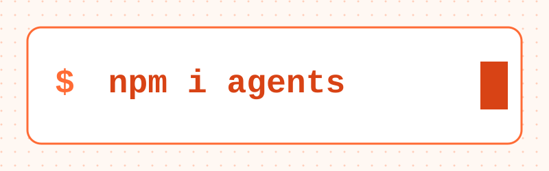

# Cloudflare Agents

[](https://www.npmjs.com/package/agents)
[](https://www.npmjs.com/package/agents)



Agents 是基于 Cloudflare [Durable Objects](https://developers.cloudflare.com/durable-objects/) 驱动的持久化、有状态执行环境，专为代理式工作负载设计。每个代理拥有独立的状态、存储和生命周期 -- 内置支持实时通信、调度、AI 模型调用、MCP、工作流等。

代理在空闲时休眠，按需唤醒。你可以运行数百万个代理 -- 每个用户、每个会话、每个游戏房间一个 -- 非活跃时零成本。

```sh
npm create cloudflare@latest -- --template cloudflare/agents-starter
```

或添加到现有项目：

```sh
npm install agents
```

**[阅读文档](https://developers.cloudflare.com/agents/)** -- 入门指南、API 参考、使用指南等。

## 快速示例

一个带有持久状态、可调用方法和实时同步到 React 前端的计数器代理：

```typescript
// server.ts
import { Agent, routeAgentRequest, callable } from "agents";

export type CounterState = { count: number };

export class CounterAgent extends Agent<Env, CounterState> {
  initialState = { count: 0 };

  @callable()
  increment() {
    this.setState({ count: this.state.count + 1 });
    return this.state.count;
  }

  @callable()
  decrement() {
    this.setState({ count: this.state.count - 1 });
    return this.state.count;
  }
}

export default {
  async fetch(request: Request, env: Env, ctx: ExecutionContext) {
    return (
      (await routeAgentRequest(request, env)) ??
      new Response("Not found", { status: 404 })
    );
  }
};
```

```tsx
// client.tsx
import { useAgent } from "agents/react";
import { useState } from "react";
import type { CounterAgent, CounterState } from "./server";

function Counter() {
  const [count, setCount] = useState(0);

  const agent = useAgent<CounterAgent, CounterState>({
    agent: "CounterAgent",
    onStateUpdate: (state) => setCount(state.count)
  });

  return (
    <div>
      <span>{count}</span>
      <button onClick={() => agent.stub.increment()}>+</button>
      <button onClick={() => agent.stub.decrement()}>-</button>
    </div>
  );
}
```

状态变更会自动同步到所有已连接的客户端。调用方法就像调用本地函数一样。

## 特性

| 特性                   | 描述                                                                    |
| ---------------------- | ----------------------------------------------------------------------- |
| **持久状态**           | 同步到所有已连接客户端，重启后依然保留                                   |
| **可调用方法**         | 通过 `@callable()` 装饰器实现类型安全的 RPC                              |
| **调度**               | 一次性、周期性和基于 cron 的任务                                        |
| **WebSockets**         | 带生命周期钩子的实时双向通信                                            |
| **AI 聊天**            | 消息持久化、可恢复流式传输、服务端/客户端工具执行                        |
| **MCP**                | 作为 MCP 服务器或作为 MCP 客户端连接                                    |
| **工作流**             | 带人工审批环节的持久化多步任务                                          |
| **邮件**               | 通过 Cloudflare Email Routing 接收和回复邮件                            |
| **代码模式**           | LLM 生成可执行的 TypeScript，而非逐个工具调用                            |
| **SQL**                | 通过 Durable Objects 直接执行 SQLite 查询                               |
| **React Hooks**        | `useAgent` 和 `useAgentChat` 用于前端集成                               |
| **原生 JS 客户端**     | `AgentClient` 用于非 React 环境                                         |

**即将推出：** 实时语音代理、网页浏览（无头浏览器）、沙箱化代码执行，以及多渠道通信（SMS、即时通讯）。

## 包

| 包                                           | 描述                                                                         |
| -------------------------------------------- | ---------------------------------------------------------------------------- |
| [`agents`](packages/agents)                  | 核心 SDK -- Agent 类、路由、状态、调度、MCP、邮件、工作流                     |
| [`@cloudflare/ai-chat`](packages/ai-chat)    | 高层 AI 聊天 -- 持久化消息、可恢复流式传输、工具执行                          |
| [`hono-agents`](packages/hono-agents)        | 用于将代理添加到 Hono 应用的中间件                                           |
| [`@cloudflare/codemode`](packages/codemode)  | 实验性 -- LLM 编写可执行代码来编排工具                                       |

## 示例

[`examples/`](examples) 目录中包含涵盖大部分 SDK 功能的独立演示 -- MCP 服务器/客户端、工作流、邮件代理、webhook、井字棋、可恢复流式传输等。[`playground`](examples/playground) 是集所有功能于一身的展示应用。

还有使用 [OpenAI Agents SDK](https://openai.github.io/openai-agents-js/) 的示例，位于 [`openai-sdk/`](openai-sdk)。

在本地运行任意示例：

```sh
cd examples/playground
npm run dev
```

## 文档

- [完整文档](https://developers.cloudflare.com/agents/) 位于 developers.cloudflare.com
- 本仓库中的 [`docs/`](docs) 目录（与上游同步）
- [Anthropic 模式指南](guides/anthropic-patterns) -- 顺序、路由、并行、编排器、评估器
- [人工介入指南](guides/human-in-the-loop) -- 带挂起/恢复的审批工作流

## 仓库结构

| 目录                                             | 描述                                               |
| ------------------------------------------------ | -------------------------------------------------- |
| [`packages/agents/`](packages/agents)            | 核心 SDK                                           |
| [`packages/ai-chat/`](packages/ai-chat)          | AI 聊天层                                          |
| [`packages/hono-agents/`](packages/hono-agents)  | Hono 集成                                          |
| [`packages/codemode/`](packages/codemode)        | 代码模式（实验性）                                  |
| [`examples/`](examples)                          | 独立演示应用                                       |
| [`openai-sdk/`](openai-sdk)                      | 使用 OpenAI Agents SDK 的示例                       |
| [`guides/`](guides)                              | 深度模式教程                                       |
| [`docs/`](docs)                                  | 同步至 developers.cloudflare.com 的 Markdown 文档  |
| [`site/`](site)                                  | 已部署的网站（agents.cloudflare.com、AI playground）|
| [`design/`](design)                              | 架构与设计决策记录                                  |
| [`scripts/`](scripts)                            | 仓库级工具                                         |

## 开发

需要 Node 24+。使用 npm workspaces。

```sh
npm install          # install all workspaces
npm run build        # build all packages
npm run check        # full CI check (format, lint, typecheck, exports)
CI=true npm test     # run tests (vitest + vitest-pool-workers)
```

对 `packages/` 的更改需要提交 changeset：

```sh
npx changeset
```

详见 [`AGENTS.md`](AGENTS.md) 获取更详细的贡献者指南。

## 贡献

我们目前暂不接受外部 pull request -- SDK 正在快速演进，我们希望保持可控的表面积。话虽如此，我们非常乐意听取你的意见：

- **Bug 报告和功能请求** -- [提交 issue](https://github.com/cloudflare/agents/issues)
- **问题和想法** -- [发起讨论](https://github.com/cloudflare/agents/discussions)

## 许可证

[MIT](LICENSE)
