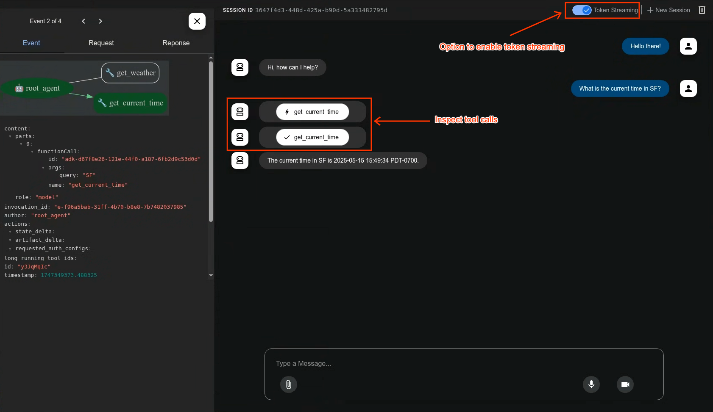

# Agent Development Kit (ADK)

[](LICENSE)
[](https://pypi.org/project/google-adk/)
[](https://github.com/google/adk-python/actions/workflows/python-unit-tests.yml)
[](https://www.reddit.com/r/agentdevelopmentkit/)
<a href="https://codewiki.google/github.com/google/adk-python"></a>

<html>
    <h2 align="center">
      
    </h2>
    <h3 align="center">
      一个开源的、代码优先的 Python 框架，用于以灵活可控的方式构建、评估和部署复杂的 AI 代理。
    </h3>
    <h3 align="center">
      重要链接：
      <a href="https://google.github.io/adk-docs/">文档</a>,
      <a href="https://github.com/google/adk-samples">示例</a>,
      <a href="https://github.com/google/adk-java">Java ADK</a>,
      <a href="https://github.com/google/adk-go">Go ADK</a> &
      <a href="https://github.com/google/adk-web">ADK Web</a>.
    </h3>
</html>

Agent Development Kit (ADK) 是一个灵活且模块化的框架，将软件开发原则应用于 AI 代理的创建。它旨在简化从简单任务到复杂系统的代理工作流的构建、部署和编排。虽然针对 Gemini 进行了优化，但 ADK 与模型无关、与部署方式无关，并与其他框架兼容。

---

## 🔥 最新动态

- **自定义服务注册**：添加了服务注册表，提供通用方式注册自定义服务实现，以便在 FastAPI 服务器中使用。参见[简要说明](https://github.com/google/adk-python/discussions/3175#discussioncomment-14745120)。([391628f](https://github.com/google/adk-python/commit/391628fcdc7b950c6835f64ae3ccab197163c990))

- **回退功能**：添加了将会话回退到某次先前调用之前状态的能力 ([9dce06f](https://github.com/google/adk-python/commit/9dce06f9b00259ec42241df4f6638955e783a9d1))。

- **新 CodeExecutor**：引入了新的 AgentEngineSandboxCodeExecutor 类，支持使用 Vertex AI Code Execution Sandbox API 执行代理生成的代码 ([ee39a89](https://github.com/google/adk-python/commit/ee39a891106316b790621795b5cc529e89815a98))

## ✨ 核心特性

- **丰富的工具生态**：利用预构建的工具、自定义函数、OpenAPI 规范、MCP 工具或集成现有工具，赋予代理多样化的能力，与 Google 生态系统紧密集成。

- **代码优先开发**：直接用 Python 定义代理逻辑、工具和编排，实现最大的灵活性、可测试性和版本管理。

- **代理配置**：无需编写代码即可构建代理。查看 [Agent Config](https://google.github.io/adk-docs/agents/config/) 功能。

- **工具确认**：[工具确认流程（HITL）](https://google.github.io/adk-docs/tools/confirmation/)可通过显式确认和自定义输入来管控工具执行。

- **模块化多代理系统**：通过将多个专业代理组合成灵活的层级结构来设计可扩展的应用。

- **随处部署**：轻松容器化并部署到 Cloud Run，或通过 Vertex AI Agent Engine 无缝扩展。

## 🚀 安装

### 稳定版（推荐）

你可以使用 `pip` 安装最新稳定版 ADK：

```bash
pip install google-adk
```

发布周期大约为每两周一次。

推荐大多数用户使用此版本，因为它代表了最新的正式发布版本。

### 开发版
错误修复和新功能会首先合并到 GitHub 的主分支。如果你需要获取尚未包含在正式 PyPI 发布中的变更，可以直接从主分支安装：

```bash
pip install git+https://github.com/google/adk-python.git@main
```

注意：开发版直接从最新代码提交构建。虽然它包含最新的修复和功能，但也可能包含稳定版中不存在的实验性变更或错误。主要在测试即将发布的变更或在正式发布前获取关键修复时使用。

## 🤖 Agent2Agent (A2A) 协议与 ADK 集成

对于远程代理间通信，ADK 集成了 [A2A 协议](https://github.com/google-a2a/A2A/)。
参见此[示例](https://github.com/a2aproject/a2a-samples/tree/main/samples/python/agents)了解它们如何协同工作。

## 📚 文档

浏览完整文档，获取关于构建、评估和部署代理的详细指南：

* **[文档](https://google.github.io/adk-docs)**

## 🏁 功能亮点

### 定义单个代理：

```python
from google.adk.agents import Agent
from google.adk.tools import google_search

root_agent = Agent(
    name="search_assistant",
    model="gemini-2.5-flash", # Or your preferred Gemini model
    instruction="You are a helpful assistant. Answer user questions using Google Search when needed.",
    description="An assistant that can search the web.",
    tools=[google_search]
)
```

### 定义多代理系统：

定义一个包含协调代理、问候代理和任务执行代理的多代理系统。ADK 引擎和模型将引导各代理协同完成任务。

```python
from google.adk.agents import LlmAgent, BaseAgent

# Define individual agents
greeter = LlmAgent(name="greeter", model="gemini-2.5-flash", ...)
task_executor = LlmAgent(name="task_executor", model="gemini-2.5-flash", ...)

# Create parent agent and assign children via sub_agents
coordinator = LlmAgent(
    name="Coordinator",
    model="gemini-2.5-flash",
    description="I coordinate greetings and tasks.",
    sub_agents=[ # Assign sub_agents here
        greeter,
        task_executor
    ]
)
```

### 开发界面

内置开发界面，帮助你测试、评估、调试和展示你的代理。



### 评估代理

```bash
adk eval \
    samples_for_testing/hello_world \
    samples_for_testing/hello_world/hello_world_eval_set_001.evalset.json
```

## 🤝 贡献

我们欢迎社区贡献！无论是错误报告、功能请求、文档改进还是代码贡献，请参阅我们的
- [通用贡献指南和流程](https://google.github.io/adk-docs/contributing-guide/)。
- 如果你想贡献代码，请阅读[代码贡献指南](./CONTRIBUTING.md)开始参与。

## 社区仓库

我们设有 [adk-python-community 仓库](https://github.com/google/adk-python-community)，其中包含不断增长的社区贡献工具、第三方服务集成和部署脚本，用于扩展 ADK 的核心能力。

## Vibe Coding

如果你想通过 vibe coding 开发代理，可以使用 [llms.txt](./llms.txt) 和 [llms-full.txt](./llms-full.txt) 作为 LLM 的上下文。前者是摘要版本，后者包含完整信息（适用于上下文窗口足够大的 LLM）。

## 社区活动

- [已完成] ADK 首次社区会议于 2025 年 10 月 15 日星期三举行。记得[加入我们的群组](https://groups.google.com/g/adk-community)以获取[会议录像](https://drive.google.com/file/d/1rpXDq5NSH8-MyMeYI6_5pZ3Lhn0X9BQf/view)和[演示文稿](https://docs.google.com/presentation/d/1_b8LG4xaiadbUUDzyNiapSFyxanc9ZgFdw7JQ6zmZ9Q/edit?slide=id.g384e60cdaca_0_658&resourcekey=0-tjFFv0VBQhpXBPCkZr0NOg#slide=id.g384e60cdaca_0_658)。

## 📄 许可证

本项目基于 Apache 2.0 许可证授权 - 详情请参见 [LICENSE](LICENSE) 文件。

---

*祝你代理构建愉快！*
