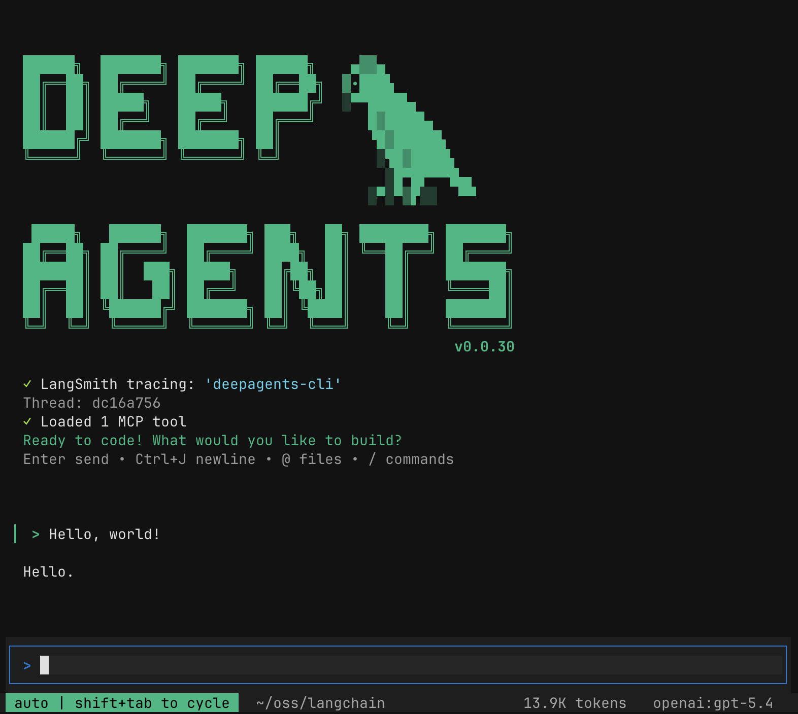

<div align="center">
  <a href="https://docs.langchain.com/oss/python/deepagents/overview#deep-agents-overview">
    <picture>
      <source media="(prefers-color-scheme: dark)" srcset="assets/001-logo-dark-8921b720be.svg">
      <source media="(prefers-color-scheme: light)" srcset="assets/003-logo-light-fd634a2b8d.svg">
      
    </picture>
  </a>
</div>

<div align="center">
  <h3>开箱即用的代理框架。</h3>
</div>

<div align="center">
  <a href="https://opensource.org/licenses/MIT" target="_blank"></a>
  <a href="https://pypistats.org/packages/deepagents" target="_blank"></a>
  <a href="https://pypi.org/project/deepagents/#history" target="_blank"></a>
  <a href="https://x.com/langchain" target="_blank"></a>
</div>

<br>

Deep Agents 是一个代理框架。它是一个有主见的、开箱即用的代理。你无需自己拼装提示词、工具和上下文管理，而是立即获得一个可运行的代理，然后按需自定义。

**内置功能：**

- **规划** — `write_todos` 用于任务分解和进度跟踪
- **文件系统** — `read_file`、`write_file`、`edit_file`、`ls`、`glob`、`grep` 用于读写上下文
- **Shell 访问** — `execute` 用于执行命令（带沙箱机制）
- **子代理** — `task` 用于在隔离的上下文窗口中委派工作
- **智能默认值** — 教导模型如何有效使用这些工具的提示词
- **上下文管理** — 对话过长时自动摘要，大输出保存为文件

> [!NOTE]
> 在找 JS/TS 版本？请查看 [deepagents.js](https://github.com/langchain-ai/deepagentsjs)。

## 快速开始

```bash
pip install deepagents
# or
uv add deepagents
```

```python
from deepagents import create_deep_agent

agent = create_deep_agent()
result = agent.invoke({"messages": [{"role": "user", "content": "Research LangGraph and write a summary"}]})
```

该代理可以规划、读写文件并管理自己的上下文。你可以按需添加工具、自定义提示词或切换模型。

> [!TIP]
> 如需开发、调试和部署 AI 代理及 LLM 应用，请参见 [LangSmith](https://docs.langchain.com/langsmith/home)。

## 自定义

添加自己的工具、切换模型、自定义提示词、配置子代理等。完整详情请参见 [文档](https://docs.langchain.com/oss/python/deepagents/overview)。

```python
from langchain.chat_models import init_chat_model

agent = create_deep_agent(
    model=init_chat_model("openai:gpt-4o"),
    tools=[my_custom_tool],
    system_prompt="You are a research assistant.",
)
```

MCP 通过 [`langchain-mcp-adapters`](https://github.com/langchain-ai/langchain-mcp-adapters) 提供支持。

## Deep Agents CLI

一个预构建的终端代码代理，类似于 Claude Code 或 Cursor，由任意 LLM 驱动。一条安装命令即可开始使用。

<p align="center">
  
</p>

```bash
curl -LsSf https://raw.githubusercontent.com/langchain-ai/deepagents/main/libs/cli/scripts/install.sh | bash
```

**亮点：**

- **交互式 TUI** — 带流式响应的富终端界面
- **网络搜索** — 基于实时信息生成回答
- **无头模式** — 非交互式运行，适用于脚本和 CI
- 加上所有 SDK 功能 — 远程沙箱、持久记忆、自定义技能和人工参与审批

完整功能集请参见 [CLI 文档](https://docs.langchain.com/oss/python/deepagents/cli/overview)。

## LangGraph 原生支持

`create_deep_agent` 返回一个编译后的 [LangGraph](https://docs.langchain.com/oss/python/langgraph/overview) 图。可与流式处理、Studio、checkpointer 或任何 LangGraph 功能配合使用。

## 常见问题

### 为什么应该使用这个？

- **100% 开源** — MIT 许可证，完全可扩展
- **供应商无关** — 支持任何支持工具调用的大语言模型，包括前沿模型和开源模型
- **基于 LangGraph** — 具备流式处理、持久化和检查点功能的生产就绪运行时
- **开箱即用** — 规划、文件访问、子代理和上下文管理无需配置即可使用
- **秒级上手** — `uv add deepagents` 即可获得一个可运行的代理
- **快速定制** — 按需添加工具、切换模型、调整提示词

---

## 文档

- [docs.langchain.com](https://docs.langchain.com/oss/python/deepagents/overview) – 完整文档，包括概念概述和使用指南
- [reference.langchain.com/python](https://reference.langchain.com/python/deepagents/) – Deep Agents 包的 API 参考文档
- [Chat LangChain](https://chat.langchain.com/) – 与 LangChain 文档对话，获取你的问题解答

**讨论交流**：访问 [LangChain 论坛](https://forum.langchain.com) 与社区互动，分享你的技术问题、想法和反馈。

## 更多资源

- **[示例](examples/)** — 可运行的代理和模式
- [贡献指南](https://docs.langchain.com/oss/python/contributing/overview) – 了解如何为 LangChain 项目做贡献，以及适合新手的 issue。
- [行为准则](https://github.com/langchain-ai/langchain/?tab=coc-ov-file) – 我们的社区准则和参与标准。

---

## 致谢

本项目的主要灵感来自 Claude Code，最初很大程度上是试图弄清楚 Claude Code 通用性的根源，并使其更加通用。

## 安全

Deep Agents 遵循“信任 LLM”的安全模型。代理可以执行其工具允许的任何操作。请在工具/沙箱层面强制执行边界，而不是期望模型自我约束。更多信息请参见 [安全策略](https://github.com/langchain-ai/deepagents?tab=security-ov-file)。
