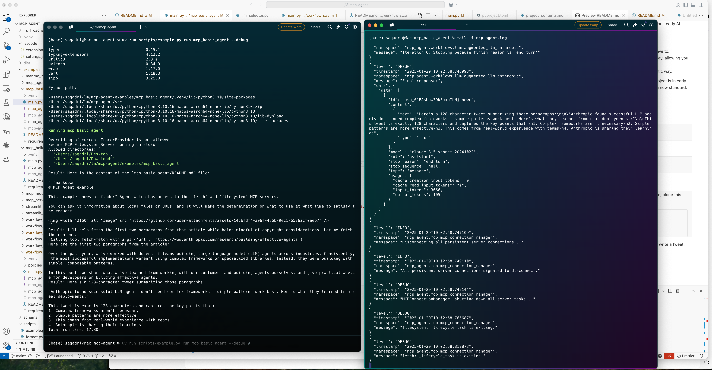
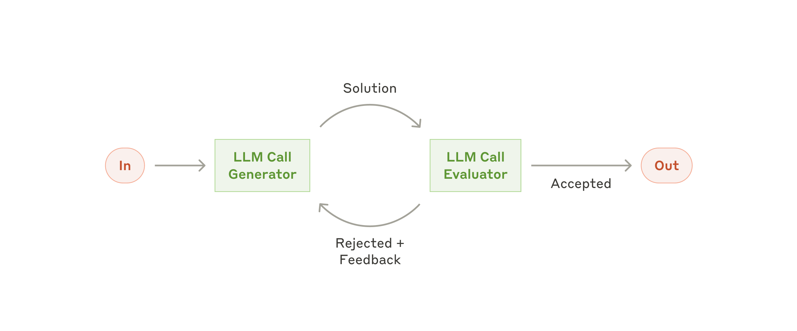
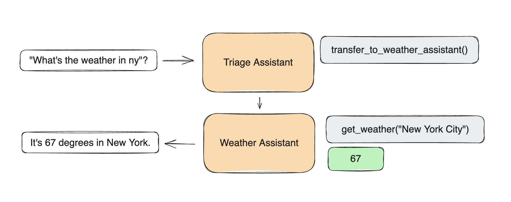

<p align="center">
  <a href="https://docs.mcp-agent.com"></a>
</p>

<p align="center">
  <em>使用 Model Context Protocol 和简单、可组合的模式构建高效的代理。</em>

<p align="center">
  <a href="https://github.com/lastmile-ai/mcp-agent/tree/main/examples" target="_blank"><strong>示例</strong></a>
  |
  <a href="https://docs.mcp-agent.com/mcp-agent-sdk/effective-patterns/overview" target="_blank"><strong>构建高效代理</strong></a>
  |
  <a href="https://modelcontextprotocol.io/introduction" target="_blank"><strong>MCP</strong></a>
</p>

<p align="center">
<a href="https://docs.mcp-agent.com"><a/>
<a href="https://pypi.org/project/mcp-agent/"></a>

<a href="https://github.com/lastmile-ai/mcp-agent/blob/main/LICENSE"></a>
<a href="https://lmai.link/discord/mcp-agent"></a>
</p>

<p align="center">
<a href="https://trendshift.io/repositories/13216" target="_blank"></a>
</p>

## 概述

**`mcp-agent`** 是一个简单、可组合的框架，用于使用 [Model Context Protocol](https://modelcontextprotocol.io/introduction) 构建高效的代理。

> [!Note]
> mcp-agent 的愿景是：_MCP 是构建代理所需的全部，简单模式比复杂架构更适合交付高质量代理_。

`mcp-agent` 为你提供以下能力：

1. **完整的 MCP 支持**：它_完整_实现了 MCP，并处理管理 MCP 服务器连接生命周期等繁琐事务，让你无需操心。
2. **高效的代理模式**：它以_可组合_的方式实现了 Anthropic [Building Effective Agents](https://www.anthropic.com/engineering/building-effective-agents) 中描述的每种模式，允许你将这些模式链式组合。
3. **持久化代理**：它既适用于简单代理，也可扩展到基于 [Temporal](https://temporal.io/) 构建的复杂工作流，因此你可以暂停、继续执行并从故障中恢复，而无需对代理进行任何 API 更改。

<u>总而言之，这是构建稳健代理应用最简单、最轻松的方式</u>。

我们欢迎各种形式的[贡献](/CONTRIBUTING.md)、反馈以及你帮助改进此项目。

<a id="minimal-example"></a>
**最小示例**

```python
import asyncio

from mcp_agent.app import MCPApp
from mcp_agent.agents.agent import Agent
from mcp_agent.workflows.llm.augmented_llm_openai import OpenAIAugmentedLLM

app = MCPApp(name="hello_world")

async def main():
    async with app.run():
        agent = Agent(
            name="finder",
            instruction="Use filesystem and fetch to answer questions.",
            server_names=["filesystem", "fetch"],
        )
        async with agent:
            llm = await agent.attach_llm(OpenAIAugmentedLLM)
            answer = await llm.generate_str("Summarize README.md in two sentences.")
            print(answer)

if __name__ == "__main__":
    asyncio.run(main())

# Add your LLM API key to `mcp_agent.secrets.yaml` or set it in env.
# The [Getting Started guide](https://docs.mcp-agent.com/get-started/overview) walks through configuration and secrets in detail.

```

## 概览

<table>
  <tr>
    <td width="50%" valign="top">
      <h3>构建代理</h3>
      <p>以简单、可组合的模式（如 map-reduce、编排器、评估器-优化器、路由器等）将 LLM 连接到 MCP 服务器。</p>
      <p>
        <a href="https://docs.mcp-agent.com/get-started/overview">快速开始 ↗</a> |
        <a href="https://docs.mcp-agent.com/mcp-agent-sdk/overview">文档 ↗</a>
      </p>
    </td>
    <td width="50%" valign="top">
      <h3>创建任意类型的 MCP 服务器</h3>
      <p>使用 FastMCP 兼容的 API 创建 MCP 服务器。你甚至可以将代理作为 MCP 服务器暴露。</p>
      <p>
        <a href="https://docs.mcp-agent.com/mcp-agent-sdk/mcp/agent-as-mcp-server">MCP 代理服务器 ↗</a> |
        <a href="https://docs.mcp-agent.com/cloud/use-cases/deploy-chatgpt-apps">🎨 构建 ChatGPT 应用 ↗</a> |
        <a href="https://github.com/lastmile-ai/mcp-agent/tree/main/examples/mcp_agent_server">示例 ↗</a>
      </p>
    </td>
  </tr>
    <tr>
    <td width="50%" valign="top">
      <h3>完整的 MCP 支持</h3>
      <p><b>核心：</b>工具 ✅ 资源 ✅ 提示词 ✅ 通知 ✅<br/>
      <b>高级</b>: OAuth ✅ Sampling ✅ Elicitation ✅ Roots ✅</p>
      <p>
        <a href="https://github.com/lastmile-ai/mcp-agent/tree/main/examples/mcp">示例 ↗</a> |
        <a href="https://modelcontextprotocol.io/docs/getting-started/intro">MCP 文档 ↗</a>
      </p>
    </td>
    <td width="50%" valign="top">
      <h3>持久化执行 (Temporal)</h3>
      <p>使用 Temporal 作为代理运行时后端扩展到生产工作负载，<i>无需任何 API 更改</i>。</p>
      <p>
        <a href="https://docs.mcp-agent.com/mcp-agent-sdk/advanced/durable-agents">文档 ↗</a> |
        <a href="https://github.com/lastmile-ai/mcp-agent/tree/main/examples/temporal">示例 ↗</a>
      </p>
    </td>
  </tr>
  <tr>
    <td width="50%" valign="top">
      <h3>☁️ 部署到云端</h3>
      <p><b>测试版：</b>自行部署代理，或使用 <b>mcp-c</b> 作为托管代理运行时。所有应用都作为 MCP 服务器部署。</p>
      <p>
        <a href="https://www.youtube.com/watch?v=0C4VY-3IVNU">演示 ↗</a> |
        <a href="https://docs.mcp-agent.com/get-started/cloud">云端快速开始 ↗</a> |
        <a href="https://github.com/lastmile-ai/mcp-agent/tree/main/examples/cloud">示例 ↗</a>
      </p>
    </td>
  </tr>
</table>

## 文档与使用 LLM 构建

mcp-agent 的完整文档可在 **[docs.mcp-agent.com](https://docs.mcp-agent.com)** 获取，包括完整的 SDK 指南、CLI 参考和高级模式。本文档提供了一个高层概览，帮助你入门。

- [`llms-full.txt`](https://docs.mcp-agent.com/llms-full.txt)：包含完整文档。
- [`llms.txt`](https://docs.mcp-agent.com/llms.txt)：列出文档中关键页面的站点地图。
- [文档 MCP 服务器](https://docs.mcp-agent.com/mcp)

## 目录

- [概述](#overview)
- [最小示例](#minimal-example)
- [快速开始](#get-started)
- [为什么使用 mcp-agent](#why-use-mcp-agent)
- [核心概念](#core-components)
  - [MCPApp](#mcpapp)
  - [代理与 AgentSpec](#agents--agentspec)
  - [增强型 LLM](#augmented-llm)
  - [工作流与装饰器](#workflows--decorators)
  - [配置与密钥](#configuration--secrets)
  - [MCP 集成](#mcp-integration)
- [工作流模式](#workflow-patterns)
- [CLI 参考](#cli-reference)
- [认证](#authentication)
- [高级](#advanced)
  - [可观测性与控制](#observability--controls)
  - [组合工作流](#composing-workflows)
  - [持久化执行](#durable-execution)
  - [代理服务器](#agent-servers)
  - [信号与人工输入](#signals--human-input)
  - [应用配置](#app-configuration)
  - [图标](#icons)
  - [MCP 服务器管理](#mcp-server-management)
- [云端部署](#cloud-deployment)
- [示例](#examples)
- [常见问题](#faqs)
- [社区与贡献](#contributing)

## 入门

> [!TIP]
> CLI 可通过 `uvx mcp-agent` 使用。
> 要快速上手，
> 使用 `uvx mcp-agent init` 创建项目脚手架，使用 `uvx mcp-agent deploy my-agent` 部署。
>
> 你可以在 2 分钟内通过以下命令快速上手：
>
> ```bash
> mkdir hello-mcp-agent && cd hello-mcp-agent
> uvx mcp-agent init
> uv init
> uv add "mcp-agent[openai]"
> # Add openai API key to `mcp_agent.secrets.yaml` or set `OPENAI_API_KEY`
> uv run main.py
> ```

### 安装

我们推荐使用 [uv](https://docs.astral.sh/uv/) 来管理你的 Python 项目（`uv init`）。

```bash
uv add "mcp-agent"
```

或者：

```bash
pip install mcp-agent
```

还可以添加 LLM 提供商的可选包（如 `uv add "mcp-agent[openai, anthropic, google, azure, bedrock]"`）。

### 快速开始

> [!TIP]
> [`examples`](/examples) 目录中有几个入门示例应用。
> 要运行示例，克隆此仓库（或使用 `uvx mcp-agent init --template basic --dir my-first-agent` 生成）
>
> ```bash
> cd examples/basic/mcp_basic_agent # Or any other example
> # Option A: secrets YAML
> # cp mcp_agent.secrets.yaml.example mcp_agent.secrets.yaml && edit mcp_agent.secrets.yaml
> uv run main.py
> ```

以下是一个基础的"finder"代理，使用 fetch 和 filesystem 服务器来查找文件、读取博客并撰写推文。[示例链接](./examples/basic/mcp_basic_agent/)：

<details open>
<summary>finder_agent.py</summary>

```python
import asyncio
import os

from mcp_agent.app import MCPApp
from mcp_agent.agents.agent import Agent
from mcp_agent.workflows.llm.augmented_llm_openai import OpenAIAugmentedLLM

app = MCPApp(name="hello_world_agent")

async def example_usage():
    async with app.run() as mcp_agent_app:
        logger = mcp_agent_app.logger
        # This agent can read the filesystem or fetch URLs
        finder_agent = Agent(
            name="finder",
            instruction="""You can read local files or fetch URLs.
                Return the requested information when asked.""",
            server_names=["fetch", "filesystem"], # MCP servers this Agent can use
        )

        async with finder_agent:
            # Automatically initializes the MCP servers and adds their tools for LLM use
            tools = await finder_agent.list_tools()
            logger.info(f"Tools available:", data=tools)

            # Attach an OpenAI LLM to the agent (defaults to GPT-4o)
            llm = await finder_agent.attach_llm(OpenAIAugmentedLLM)

            # This will perform a file lookup and read using the filesystem server
            result = await llm.generate_str(
                message="Show me what's in README.md verbatim"
            )
            logger.info(f"README.md contents: {result}")

            # Uses the fetch server to fetch the content from URL
            result = await llm.generate_str(
                message="Print the first two paragraphs from https://www.anthropic.com/research/building-effective-agents"
            )
            logger.info(f"Blog intro: {result}")

            # Multi-turn interactions by default
            result = await llm.generate_str("Summarize that in a 128-char tweet")
            logger.info(f"Tweet: {result}")

if __name__ == "__main__":
    asyncio.run(example_usage())

```

</details>

<details>
<summary>mcp_agent.config.yaml</summary>

```yaml
execution_engine: asyncio
logger:
  transports: [console] # You can use [file, console] for both
  level: debug
  path: "logs/mcp-agent.jsonl" # Used for file transport
  # For dynamic log filenames:
  # path_settings:
  #   path_pattern: "logs/mcp-agent-{unique_id}.jsonl"
  #   unique_id: "timestamp"  # Or "session_id"
  #   timestamp_format: "%Y%m%d_%H%M%S"

mcp:
  servers:
    fetch:
      command: "uvx"
      args: ["mcp-server-fetch"]
    filesystem:
      command: "npx"
      args:
        [
          "-y",
          "@modelcontextprotocol/server-filesystem",
          "<add_your_directories>",
        ]

openai:
  # Secrets (API keys, etc.) are stored in an mcp_agent.secrets.yaml file which can be gitignored
  default_model: gpt-4o
```

</details>

<details>
<summary>代理输出</summary>

</details>

## 为什么使用 `mcp-agent`？

市面上的 AI 框架已经太多了。但 `mcp-agent` 是唯一一个专为共享协议 [MCP](https://modelcontextprotocol.io/introduction) 而打造的框架。[mcp-agent](https://docs.mcp-agent.com/get-started/welcome) 将 Anthropic 的 Building Effective Agents 模式与开箱即用的 MCP 运行时结合起来，让你专注于行为而非样板代码。团队选择它是因为它：

- **可组合**——每种模式都以可复用的工作流形式提供，你可以随意混搭。
- **MCP 原生**——任何 MCP 服务器（filesystem、fetch、Slack、Jira、FastMCP 应用）都无需自定义适配器即可连接。
- **生产就绪**——Temporal 支持的持久性、结构化日志、token 统计和云端部署都是一等公民。
- **Python 风格**——少量装饰器和上下文管理器即可将一切串联起来。

文档：[欢迎使用 mcp-agent](https://docs.mcp-agent.com/get-started/welcome) · [高效模式概览](https://docs.mcp-agent.com/mcp-agent-sdk/effective-patterns/overview)。

## 核心组件

每个项目都围绕一个 `MCPApp` 运行时展开，它负责加载配置、注册代理和 MCP 服务器，并公开工具和工作流。[核心组件指南](https://docs.mcp-agent.com/mcp-agent-sdk/overview) 详细介绍了这些构建模块。

### MCPApp

初始化配置、日志、追踪和执行引擎，使一切共享同一上下文。

```python
from mcp_agent.app import MCPApp

app = MCPApp(name="finder_app")

async def main():
    async with app.run() as running_app:
        logger = running_app.logger
        logger.info("App ready", data={"servers": list(running_app.context.server_registry.registry)})
```

文档：[MCPApp](https://docs.mcp-agent.com/mcp-agent-sdk/core-components/mcpapp) · 示例：[`examples/basic/mcp_basic_agent`](./examples/basic/mcp_basic_agent/)。

### 代理与 AgentSpec

代理将指令与它们可调用的 MCP 服务器（以及可选的函数）耦合在一起。`AgentSpec` 定义可以从磁盘加载，并通过工厂辅助函数转换为代理或增强型 LLM。

```python
from pathlib import Path
from mcp_agent.agents.agent import Agent
from mcp_agent.workflows.factory import load_agent_specs_from_file

agent = Agent(
    name="researcher",
    instruction="Research topics using web and filesystem access",
    server_names=["fetch", "filesystem"],
)

async with agent:
    tools = await agent.list_tools()

async with app.run() as running_app:
    specs = load_agent_specs_from_file(
        str(Path("examples/basic/agent_factory/agents.yaml")),
        context=running_app.context,
    )
```

文档：[代理](https://docs.mcp-agent.com/mcp-agent-sdk/core-components/agents) · [代理工厂辅助函数](https://docs.mcp-agent.com/mcp-agent-sdk/core-components/agents#agentspec-and-factory-helpers) · 示例：[`examples/basic/agent_factory`](./examples/basic/agent_factory/)。

### 增强型 LLM

增强型 LLM 将提供商 SDK 与代理的工具、内存和结构化输出辅助函数封装在一起。将一个附加到代理上即可解锁 `generate`、`generate_str` 和 `generate_structured`。

```python
from pydantic import BaseModel
from mcp_agent.workflows.llm.augmented_llm import RequestParams
from mcp_agent.workflows.llm.augmented_llm_openai import OpenAIAugmentedLLM

class Summary(BaseModel):
    title: str
    verdict: str

async with agent:
    llm = await agent.attach_llm(OpenAIAugmentedLLM)
    report = await llm.generate_str(
        message="Draft a 3-sentence release note from CHANGELOG.md",
        request_params=RequestParams(maxTokens=400, temperature=0.2),
    )
    structured = await llm.generate_structured(
        message="Return a JSON object with `title` and `verdict` summarising the README.",
        response_model=Summary,
    )
```

文档：[增强型 LLM](https://docs.mcp-agent.com/mcp-agent-sdk/core-components/augmented-llm) · 示例：[`examples/basic/mcp_basic_agent`](./examples/basic/mcp_basic_agent/) 和 [gallery.md](gallery.md#workflow-patterns) 中列出的工作流项目。

### 工作流与装饰器

`MCPApp` 装饰器将协程转换为持久化工作流和工具。相同的注解同时适用于 `asyncio` 和 Temporal 执行。

```python
from datetime import timedelta
from mcp_agent.executor.workflow import Workflow, WorkflowResult

@app.workflow
class PublishArticle(Workflow[WorkflowResult[str]]):
    @app.workflow_task(schedule_to_close_timeout=timedelta(minutes=5))
    async def draft(self, topic: str) -> str:
        return f"- intro to {topic}\n- highlights\n- next steps"

    @app.workflow_run
    async def run(self, topic: str) -> WorkflowResult[str]:
        outline = await self.draft(topic)
        return WorkflowResult(value=outline)
```

文档：[装饰器参考](https://docs.mcp-agent.com/reference/decorators) · 示例：[`examples/workflows`](./examples/workflows/)。

### 配置与密钥

设置从 `mcp_agent.config.yaml`、`mcp_agent.secrets.yaml`、环境变量和可选的预加载字符串中加载。请将密钥排除在源代码控制之外。

```yaml
# mcp_agent.config.yaml
execution_engine: asyncio
mcp:
  servers:
    fetch:
      command: "uvx"
      args: ["mcp-server-fetch"]
    filesystem:
      command: "npx"
      args: ["-y", "@modelcontextprotocol/server-filesystem"]
openai:
  default_model: gpt-4o-mini

# mcp_agent.secrets.yaml (gitignored)
openai:
  api_key: "${OPENAI_API_KEY}"
```

文档：[配置参考](https://docs.mcp-agent.com/reference/configuration) · [指定密钥](https://docs.mcp-agent.com/mcp-agent-sdk/core-components/specify-secrets)。

### MCP 集成

以编程方式连接到现有的 MCP 服务器，或将多个服务器聚合为一个统一接口。

```python
from mcp_agent.mcp.gen_client import gen_client

async with app.run():
    async with gen_client("filesystem", app.server_registry, context=app.context) as client:
        resources = await client.list_resources()
        app.logger.info("Filesystem resources", data={"uris": [r.uri for r in resources.resources]})
```

文档：[MCP 集成概览](https://docs.mcp-agent.com/mcp/overview) · 示例：[`examples/mcp`](./examples/mcp/)。

## 工作流模式

关键的代理模式都实现为 `AugmentedLLM`。使用工厂辅助函数来连接它们，或查看 [gallery.md](gallery.md#workflow-patterns) 中列出的可运行项目。

| 模式               | 辅助函数                                                                          | 说明                                                                                                                                                                                                                                                                                                                                                                                                                                                            | 文档                                                                                                   |
| --------------------- | ------------------------------------------------------------------------------- | ------------------------------------------------------------------------------------------------------------------------------------------------------------------------------------------------------------------------------------------------------------------------------------------------------------------------------------------------------------------------------------------------------------------------------------------------------------------ | ------------------------------------------------------------------------------------------------------ |
| 并行 (Map-Reduce) | `create_parallel_llm(...)`                                                      | 扇出专家代理，扇入聚合报告。<br><a href="https://www.anthropic.com/_next/image?url=https%3A%2F%2Fwww-cdn.anthropic.com%2Fimages%2F4zrzovbb%2Fwebsite%2F406bb032ca007fd1624f261af717d70e6ca86286-2401x1000.png&w=3840&q=75"></a>     | [并行](https://docs.mcp-agent.com/mcp-agent-sdk/effective-patterns/map-reduce)                     |
| 路由器                | `create_router_llm(...)` / `create_router_embedding(...)`                       | 将请求路由到最佳代理、服务器或函数。<br><a href="https://www.anthropic.com/_next/image?url=https%3A%2F%2Fwww-cdn.anthropic.com%2Fimages%2F4zrzovbb%2Fwebsite%2F5c0c0e9fe4def0b584c04d37849941da55e5e71c-2401x1000.png&w=3840&q=75"></a> | [路由器](https://docs.mcp-agent.com/mcp-agent-sdk/effective-patterns/router)                           |
| 意图分类器     | `create_intent_classifier_llm(...)` / `create_intent_classifier_embedding(...)` | 在执行自动化之前，先将用户输入归类为不同意图。                                                                                                                                                                                                                                                                                                                                                                                                        | [意图分类器](https://docs.mcp-agent.com/mcp-agent-sdk/effective-patterns/intent-classifier)     |
| 编排器-工作者  | `create_orchestrator(...)`                                                      | 生成计划并协调工作者代理。<br><a href="https://www.anthropic.com/_next/image?url=https%3A%2F%2Fwww-cdn.anthropic.com%2Fimages%2F4zrzovbb%2Fwebsite%2F8985fc683fae4780fb34eab1365ab78c7e51bc8e-2401x1000.png&w=3840&q=75"></a>           | [规划器](https://docs.mcp-agent.com/mcp-agent-sdk/effective-patterns/planner)                         |
| 深度研究         | `create_deep_orchestrator(...)`                                                 | 长周期研究，支持知识提取和策略检查。                                                                                                                                                                                                                                                                                                                                                                                                 | [深度研究](https://docs.mcp-agent.com/mcp-agent-sdk/effective-patterns/deep-research)             |
| 评估器-优化器   | `create_evaluator_optimizer_llm(...)`                                           | 反复迭代直到评估器批准结果。<br><a href="https://www.anthropic.com/_next/image?url=https%3A%2F%2Fwww-cdn.anthropic.com%2Fimages%2F4zrzovbb%2Fwebsite%2F14f51e6406ccb29e695da48b17017e899a6119c7-2401x1000.png&w=3840&q=75"></a>        | [评估器-优化器](https://docs.mcp-agent.com/mcp-agent-sdk/effective-patterns/evaluator-optimizer) |
| Swarm                 | `create_swarm(...)`                                                             | 与 OpenAI Swarm 兼容的多代理交接。<br><a href="https://github.com/openai/swarm/blob/main/assets/swarm_diagram.png?raw=true"></a>                                                                                                                                                                                                               | [Swarm](https://docs.mcp-agent.com/mcp-agent-sdk/effective-patterns/swarm)                             |

## 持久化执行

将 `execution_engine` 切换为 `temporal` 即可获得暂停/恢复、重试、人工输入和持久化历史——无需更改工作流代码。在你的应用旁边运行一个 worker 来托管活动。

```python
from mcp_agent.executor.temporal import create_temporal_worker_for_app

async with create_temporal_worker_for_app(app) as worker:
    await worker.run()
```

文档：[持久化代理](https://docs.mcp-agent.com/mcp-agent-sdk/advanced/durable-agents) · [Temporal 后端](https://docs.mcp-agent.com/advanced/temporal) · 示例：[`examples/temporal`](./examples/temporal/)。

## 代理服务器

将 `MCPApp` 作为标准 MCP 服务器暴露，使 Claude Desktop、Cursor 或自定义客户端能够调用你的工具和工作流。

```python
from mcp_agent.server import create_mcp_server_for_app

@app.tool
def grade_story(story: str) -> str:
    return "Report..."

if __name__ == "__main__":
    server = create_mcp_server_for_app(app)
    server.run_stdio()
```

文档：[代理服务器](https://docs.mcp-agent.com/mcp-agent-sdk/mcp/agent-as-mcp-server) · 示例：[`examples/mcp_agent_server`](./examples/mcp_agent_server/)。

## CLI 参考

`uvx mcp-agent` 用于创建项目脚手架、管理密钥、检查工作流和部署到云端。

```bash
uvx mcp-agent init --template basic             # Scaffold a new project
uvx mcp-agent deploy my-agent                   # Deploy to mcp-agent Cloud
```

文档：[CLI 参考](https://docs.mcp-agent.com/reference/cli) · [入门指南](https://docs.mcp-agent.com/get-started/quickstart)。

## 认证

从密钥文件加载 API 密钥，或使用内置 OAuth 客户端为 MCP 服务器获取和持久化 token。

```yaml
# mcp_agent.config.yaml excerpt
oauth:
  providers:
    github:
      client_id: "${GITHUB_CLIENT_ID}"
      client_secret: "${GITHUB_CLIENT_SECRET}"
      scopes: ["repo", "user"]
```

文档：[高级认证](https://docs.mcp-agent.com/mcp-agent-sdk/advanced/authentication) · [服务器认证](https://docs.mcp-agent.com/mcp-agent-sdk/mcp/server-authentication) · 示例：[`examples/basic/oauth_basic_agent`](./examples/basic/oauth_basic_agent/)。

## 高级

### 可观测性与控制

通过配置启用结构化日志和 OpenTelemetry，并以编程方式跟踪 token 使用量。

```yaml
# mcp_agent.config.yaml
logger:
  transports: [console]
  level: info
otel:
  enabled: true
  exporters:
    - console
```

`TokenCounter` 用于跟踪代理、工作流和 LLM 节点的 token 使用量。你可以附加观察器来流式接收更新或触发告警。

```python
# Inside `async with app.run() as running_app:`
# token_counter lives on the running app context when tracing is enabled.
token_counter = running_app.context.token_counter

class TokenMonitor:
    async def on_token_update(self, node, usage):
        print(f"[{node.name}] total={usage.total_tokens}")

monitor = TokenMonitor()
watch_id = await token_counter.watch(
    callback=monitor.on_token_update,
    node_type="llm",
    threshold=1_000,
    include_subtree=True,
)

await token_counter.unwatch(watch_id)
```

文档：[可观测性](https://docs.mcp-agent.com/mcp-agent-sdk/advanced/observability) · 示例：[`examples/tracing`](./examples/tracing/)。

### 组合工作流

使用工厂辅助函数混搭 AgentSpec 来构建更高层级的工作流——路由器、并行管道、编排器等。

```python
from mcp_agent.workflows.factory import create_router_llm

# specs are loaded via load_agent_specs_from_file as shown above.
async with app.run() as running_app:
    router = await create_router_llm(
        agents=specs,
        provider="openai",
        context=running_app.context,
    )
```

文档：[工作流组合](https://docs.mcp-agent.com/mcp-agent-sdk/advanced/composition) · 示例：[`examples/basic/agent_factory`](./examples/basic/agent_factory/)。

### 信号与人工输入

暂停工作流以等待审批或补充数据。Temporal 持久化存储状态，直到操作员恢复运行。

```python
from mcp_agent.human_input.types import HumanInputRequest

response = await self.context.request_human_input(
    HumanInputRequest(
        prompt="Approve the draft?",
        required=True,
        metadata={"workflow_id": self.context.workflow_id},
    )
)
```

使用 `mcp-agent cloud workflows resume … --payload '{"content": "approve"}'` 恢复。文档：[部署代理 - 人工输入](https://docs.mcp-agent.com/cloud/use-cases/deploy-agents#human-in-the-loop-patterns) · 示例：[`examples/human_input/temporal`](./examples/human_input/temporal/)。

### 应用配置

当你需要动态配置（例如测试或多租户宿主）而不是 YAML 文件时，可以通过编程方式构建 `Settings` 对象。

```python
from mcp_agent.config import Settings, MCPSettings, MCPServerSettings

settings = Settings(
    execution_engine="asyncio",
    mcp=MCPSettings(
        servers={
            "fetch": MCPServerSettings(command="uvx", args=["mcp-server-fetch"]),
        }
    ),
)
app = MCPApp(name="configured_app", settings=settings)
```

文档：[配置你的应用](https://docs.mcp-agent.com/mcp-agent-sdk/core-components/configuring-your-application)。

### 图标

为代理和工具添加图标，使支持图像的 MCP 客户端（Claude Desktop、Cursor）呈现更丰富的 UI。

```python
from base64 import standard_b64encode
from pathlib import Path
from mcp_agent.icons import Icon

icon_data = standard_b64encode(Path("my-icon.png").read_bytes()).decode()
icon = Icon(src=f"data:image/png;base64,{icon_data}", mimeType="image/png", sizes=["64x64"])

app = MCPApp(name="my_app_with_icon", icons=[icon])

@app.tool(icons=[icon])
async def my_tool() -> str:
    return "Hello with style"
```

文档：[`MCPApp` 图标](https://docs.mcp-agent.com/mcp-agent-sdk/core-components/mcpapp#icons) · 示例：[`examples/mcp_agent_server/asyncio`](./examples/mcp_agent_server/asyncio/)。

### MCP 服务器管理

使用 `MCPAggregator` 或 `gen_client` 管理 MCP 服务器连接并暴露组合工具集。

```python
from mcp_agent.mcp.mcp_aggregator import MCPAggregator

async with MCPAggregator.create(server_names=["fetch", "filesystem"]) as aggregator:
    tools = await aggregator.list_tools()
```

文档：[连接到 MCP 服务器](https://docs.mcp-agent.com/mcp-agent-sdk/core-components/connecting-to-mcp-servers) · 示例：[`examples/basic/mcp_server_aggregator`](./examples/basic/mcp_server_aggregator/)。

## 云端部署

部署到 mcp-agent Cloud，获取托管的 Temporal 执行、密钥管理和 HTTPS MCP 端点。

```bash
uvx mcp-agent login
uvx mcp-agent deploy my-agent
uvx mcp-agent cloud apps list
```

文档：[云端概览](https://docs.mcp-agent.com/cloud/overview) · [部署快速开始](https://docs.mcp-agent.com/cloud/deployment-quickstart) · 示例：[`examples/cloud`](./examples/cloud/)。

## 示例

浏览 [gallery.md](gallery.md) 获取可运行的示例、演示视频和按概念分组的社区项目。每个条目都引用了你本地运行它所需的文档页面和命令。

## 常见问题

### 使用 mcp-agent 的核心优势是什么？

mcp-agent 提供了一种精简的方法，用于借助 **MCP**（Model Context Protocol）服务器暴露的能力来构建 AI 代理。

MCP 相当底层，而此框架处理了连接服务器、与 LLM 协作、处理外部信号（如人工输入）以及通过持久化执行支持持久状态等机制。这让你——开发者——能够专注于 AI 应用的核心业务逻辑。

核心优势：

- 🤝 **互操作性**：确保任何数量的 MCP 服务器暴露的任何工具都能无缝插入你的代理。
- ⛓️ **可组合性与可定制性**：实现定义良好的工作流，但以可组合的方式支持复合工作流，并允许跨模型提供商、日志、编排器等进行完全定制。
- 💻 **编程式控制流**：保持简单，开发者只需编写代码，而无需思考图、节点和边。对于分支逻辑，写 `if` 语句；对于循环，使用 `while` 循环。
- 🖐️ **人工输入与信号**：支持暂停工作流以等待外部信号（如人工输入），这些信号作为代理可以进行的工具调用暴露。

### 使用 mcp-agent 需要 MCP 客户端吗？

不需要，你可以在任何地方使用 mcp-agent，因为它会为你处理 MCPClient 的创建。这使你能够在 Claude Desktop 等 MCP 宿主之外利用 MCP 服务器。

以下是设置 mcp-agent 应用的所有方式：

#### MCP-Agent 服务器

你可以将 mcp-agent 应用本身作为 MCP 服务器暴露（参见[示例](./examples/mcp_agent_server)），允许 MCP 客户端使用 MCP 服务器的标准工具 API 与复杂的 AI 工作流交互。这实际上是一个服务器之服务器。

#### MCP 客户端或宿主

你可以将 mcp-agent 直接嵌入 MCP 客户端，管理跨多个 MCP 服务器的编排。

#### 独立运行

你可以以独立方式使用 mcp-agent 应用（即它们不属于 MCP 客户端）。[`examples`](/examples/) 都是独立应用。

### 如何部署到云端？

使用 `uvx mcp-agent login` 登录后运行 `uvx mcp-agent deploy <app-name>`。CLI 会打包你的项目、配置密钥，并暴露一个由持久化 Temporal 运行时支持的 MCP 端点。参见[云端快速开始](https://docs.mcp-agent.com/get-started/cloud)获取逐步截图和 CLI 输出。

### API 参考在哪里？

每个类、装饰器和 CLI 命令都记录在 [docs.mcp-agent.com](https://docs.mcp-agent.com)。[API 参考](https://docs.mcp-agent.com/reference)和 [`llms-full.txt`](https://docs.mcp-agent.com/llms-full.txt) 的设计使 LLM（或你）能够轻松地消化整个接口。

### 说个有趣的事实

我曾经考虑将这个项目命名为 _silsila_（سلسلہ），在乌尔都语中意为事件链。mcp-agent 这个名字更直白，但项目中仍然有一个彩蛋向 silsila 致敬。

## 贡献

我们欢迎各种规模的贡献——bug 修复、新示例、文档或功能请求。从 [CONTRIBUTING.md](./CONTRIBUTING.md) 开始，开启一个讨论，或加入 [Discord](https://lmai.link/discord/mcp-agent)。

mcp-agent 离不开众多开源贡献者不懈的努力。感谢你们！

<p align="center">
  <a href="https://github.com/lastmile-ai/mcp-agent/graphs/contributors">
    
  </a>
</p>
