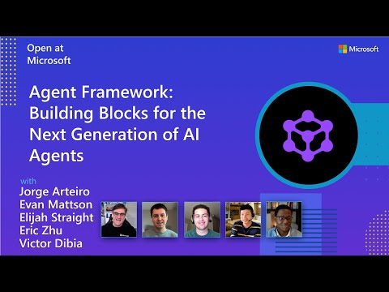
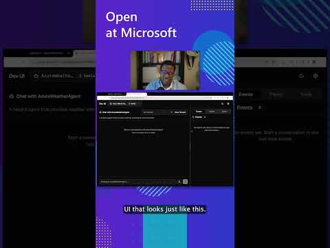

# 欢迎使用 Microsoft Agent Framework！

[](https://discord.gg/b5zjErwbQM)
[](https://learn.microsoft.com/en-us/agent-framework/)
[](https://pypi.org/project/agent-framework/)
[](https://www.nuget.org/profiles/MicrosoftAgentFramework/)

欢迎使用 Microsoft 的综合多语言框架，用于构建、编排和部署 AI 代理，支持 .NET 和 Python 两种实现。该框架提供从简单聊天代理到基于图编排的复杂多代理工作流的全面支持。

<p align="center">
  <a href="https://www.youtube.com/watch?v=AAgdMhftj8w" title="观看完整的 Agent Framework 介绍（30 分钟）">
    
  </a>
</p>
<p align="center">
  <a href="https://www.youtube.com/watch?v=AAgdMhftj8w">
    观看完整的 Agent Framework 介绍（30 分钟）
  </a>
</p>

## 📋 入门

### 📦 安装

Python

```bash
pip install agent-framework
# This will install all sub-packages, see `python/packages` for individual packages.
# It may take a minute on first install on Windows.
```

.NET

```bash
dotnet add package Microsoft.Agents.AI
```

### 📚 文档

- **[概览](https://learn.microsoft.com/agent-framework/overview/agent-framework-overview)** - 框架的高级概览
- **[快速开始](https://learn.microsoft.com/agent-framework/tutorials/quick-start)** - 从简单代理开始
- **[教程](https://learn.microsoft.com/agent-framework/tutorials/overview)** - 逐步教程
- **[用户指南](https://learn.microsoft.com/en-us/agent-framework/user-guide/overview)** - 构建代理和工作流的深入指南
- **[从 Semantic Kernel 迁移](https://learn.microsoft.com/en-us/agent-framework/migration-guide/from-semantic-kernel)** - 从 Semantic Kernel 迁移的指南
- **[从 AutoGen 迁移](https://learn.microsoft.com/en-us/agent-framework/migration-guide/from-autogen)** - 从 AutoGen 迁移的指南

仍有疑问？参加我们的[每周办公时间](./COMMUNITY.md#public-community-office-hours)或在我们的 [Discord 频道](https://discord.gg/b5zjErwbQM)中提问，获取团队和其他用户的帮助。

### ✨ **亮点**

- **基于图的工作流**：使用数据流连接代理和确定性函数，支持流式传输、检查点、人在回路和时间旅行功能
  - [Python 工作流](./python/samples/03-workflows/) | [.NET 工作流](./dotnet/samples/03-workflows/)
- **AF Labs**：用于前沿功能的实验性包，包括基准测试、强化学习和研究项目
  - [Labs 目录](./python/packages/lab/)
- **DevUI**：用于代理开发、测试和调试工作流的交互式开发者 UI
  - [DevUI 包](./python/packages/devui/)

<p align="center">
  <a href="https://www.youtube.com/watch?v=mOAaGY4WPvc">
    
  </a>
</p>
<p align="center">
  <a href="https://www.youtube.com/watch?v=mOAaGY4WPvc">
    查看 DevUI 的实际演示（1 分钟）
  </a>
</p>

- **Python 和 C#/.NET 支持**：完整框架同时支持 Python 和 C#/.NET 实现，提供一致的 API
  - [Python 包](./python/packages/) | [.NET 源码](./dotnet/src/)
- **可观测性**：内置 OpenTelemetry 集成，支持分布式追踪、监控和调试
  - [Python 可观测性](./python/samples/02-agents/observability/) | [.NET 遥测](./dotnet/samples/02-agents/AgentOpenTelemetry/)
- **多种代理提供程序支持**：支持多种 LLM 提供程序，并持续增加更多
  - [Python 示例](./python/samples/02-agents/providers/) | [.NET 示例](./dotnet/samples/02-agents/AgentProviders/)
- **中间件**：用于请求/响应处理、异常处理和自定义管道的灵活中间件系统
  - [Python 中间件](./python/samples/02-agents/middleware/) | [.NET 中间件](./dotnet/samples/02-agents/Agents/Agent_Step11_Middleware/)

### 💬 **我们期待你的反馈！**

- 如遇 bug，请提交 [GitHub issue](https://github.com/microsoft/agent-framework/issues)。

## 快速开始

### 基础代理 - Python

创建一个简单的 Azure Responses Agent，写一首关于 Microsoft Agent Framework 的俳句

```python
# pip install agent-framework
# Use `az login` to authenticate with Azure CLI
import os
import asyncio
from agent_framework import Agent
from agent_framework.foundry import FoundryChatClient
from azure.identity import AzureCliCredential

async def main():
    # Initialize a chat agent with Microsoft Foundry
    # the endpoint, deployment name, and api version can be set via environment variables
    # or they can be passed in directly to the FoundryChatClient constructor
    agent = Agent(
      client=FoundryChatClient(
          credential=AzureCliCredential(),
          # project_endpoint=os.environ["FOUNDRY_PROJECT_ENDPOINT"],
          # model=os.environ["FOUNDRY_MODEL_DEPLOYMENT_NAME"],
      ),
      name="HaikuBot",
      instructions="You are an upbeat assistant that writes beautifully.",
    )

    print(await agent.run("Write a haiku about Microsoft Agent Framework."))

if __name__ == "__main__":
    asyncio.run(main())
```

### 基础代理 - .NET
创建一个简单的代理，使用 Microsoft Foundry 和基于 token 的认证，写一首关于 Microsoft Agent Framework 的俳句

```c#
// dotnet add package Microsoft.Agents.AI.Foundry
// Use `az login` to authenticate with Azure CLI
using Azure.AI.Projects;
using Azure.Identity;
using System;
using Azure.AI.Projects;
using Azure.Identity;

var endpoint = Environment.GetEnvironmentVariable("AZURE_AI_PROJECT_ENDPOINT") ?? throw new InvalidOperationException("AZURE_AI_PROJECT_ENDPOINT is not set.");
var deploymentName = Environment.GetEnvironmentVariable("AZURE_AI_MODEL_DEPLOYMENT_NAME") ?? "gpt-5.4-mini";

var agent = new AIProjectClient(new Uri(endpoint), new DefaultAzureCredential())
    .AsAIAgent(model: deploymentName, name: "HaikuBot", instructions: "You are an upbeat assistant that writes beautifully.");

Console.WriteLine(await agent.RunAsync("Write a haiku about Microsoft Agent Framework."));
```

创建一个简单的代理，使用 OpenAI Responses，写一首关于 Microsoft Agent Framework 的俳句

```c#
// dotnet add package Microsoft.Agents.AI.OpenAI
using System;
using OpenAI;
using OpenAI.Responses;

// Replace the <apikey> with your OpenAI API key.
var agent = new OpenAIClient("<apikey>")
    .GetResponsesClient()
    .AsAIAgent(model: "gpt-5.4-mini", name: "HaikuBot", instructions: "You are an upbeat assistant that writes beautifully.");

Console.WriteLine(await agent.RunAsync("Write a haiku about Microsoft Agent Framework."));
```

## 更多示例与样例

### Python

- [入门指南](./python/samples/01-get-started)：从 hello-world 到托管的渐进式教程
- [代理概念](./python/samples/02-agents)：按主题深入讲解的示例（工具、中间件、提供商等）
- [工作流](./python/samples/03-workflows)：工作流创建和代理集成
- [托管](./python/samples/04-hosting)：A2A、Azure Functions、Durable Task 托管
- [端到端](./python/samples/05-end-to-end)：完整应用、评估和演示

### .NET

- [入门指南](./dotnet/samples/01-get-started)：从 hello agent 到托管的渐进式教程
- [代理概念](./dotnet/samples/02-agents/Agents)：基础代理创建和工具使用
- [代理提供商](./dotnet/samples/02-agents/AgentProviders)：展示不同代理提供商的示例
- [工作流](./dotnet/samples/03-workflows)：高级多代理模式和工作流编排
- [托管](./dotnet/samples/04-hosting)：A2A、Durable Agents、Durable Workflows
- [端到端](./dotnet/samples/05-end-to-end)：完整应用和演示

## 故障排除

### 认证

| 问题 | 原因 | 解决方法 |
|---------|-------|-----|
| 使用 Azure 凭证时出现认证错误 | 未登录 Azure CLI | 在启动应用前运行 `az login` |
| API 密钥错误 | API 密钥错误或缺失 | 验证密钥并确保其对应正确的资源/提供商 |

> **提示：** `DefaultAzureCredential` 便于开发使用，但在生产环境中，建议使用特定凭证（如 `ManagedIdentityCredential`），以避免延迟问题、非预期的凭证探测和回退机制可能带来的安全风险。

### 环境变量

示例通常从环境变量读取配置。常见的必需变量：

| 变量 | 使用方 | 用途 |
|----------|---------|---------|
| `AZURE_OPENAI_ENDPOINT` | Azure OpenAI 示例 | 你的 Azure OpenAI 资源 URL |
| `AZURE_OPENAI_DEPLOYMENT_NAME` | Azure OpenAI 示例 | 模型部署名称（如 `gpt-4o-mini`） |
| `AZURE_AI_PROJECT_ENDPOINT` | Microsoft Foundry 示例 | 你的 Microsoft Foundry 项目端点 |
| `AZURE_AI_MODEL_DEPLOYMENT_NAME` | Microsoft Foundry 示例 | 模型部署名称 |
| `OPENAI_API_KEY` | OpenAI（非 Azure）示例 | 你的 OpenAI 平台 API 密钥 |

## 贡献者资源

- [贡献指南](./CONTRIBUTING.md)
- [Python 开发指南](./python/DEV_SETUP.md)
- [设计文档](./docs/design)
- [架构决策记录](./docs/decisions)

## 重要说明

> [!IMPORTANT]
> 如果你使用 Microsoft Agent Framework 构建与任何第三方服务器、代理、代码或非 Azure Direct 模型（"第三方系统"）交互的应用程序，你需要自行承担风险。第三方系统属于 Microsoft 产品条款下的非 Microsoft 产品，受其各自的第三方许可条款约束。你需对任何使用和相关成本负责。
>
>我们建议审查与第三方系统共享和从第三方系统接收的所有数据，并注意第三方在数据处理、共享、保留和位置方面的实践。你有责任管理你的数据是否会流出组织的 Azure 合规和地理边界以及任何相关影响，并确保配置了适当的权限、边界和审批。
>
>你有责任在你特定用例的上下文中仔细审查和测试使用 Microsoft Agent Framework 构建的应用程序，并做出所有适当的决策和定制。这包括实施你自己的负责任 AI 缓解措施，如元提示词、内容过滤器或其他安全系统，并确保你的应用程序满足适当的质量、可靠性、安全性和可信度标准。另见：[透明度 FAQ](./TRANSPARENCY_FAQ.md)
