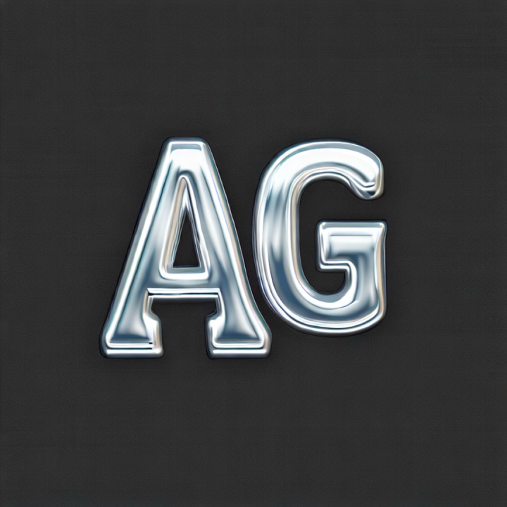
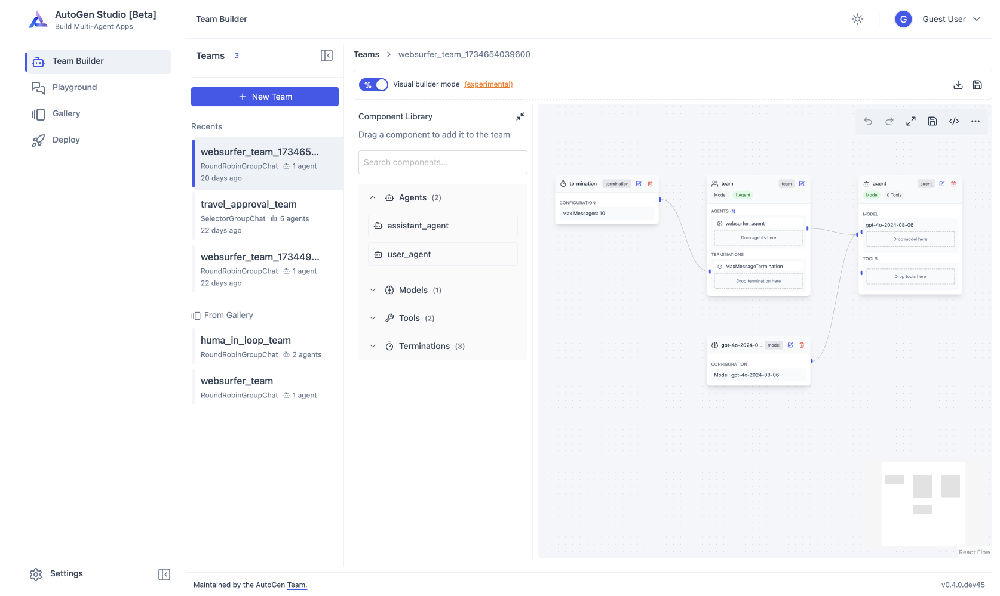

<a name="readme-top"></a>

<div align="center">


[](https://twitter.com/pyautogen)
[](https://www.linkedin.com/company/105812540)
[](https://aka.ms/autogen-discord)
[](https://microsoft.github.io/autogen/)
[](https://devblogs.microsoft.com/autogen/)

</div>

# AutoGen [](https://github.com/microsoft/agent-framework)

**AutoGen** 是一个用于创建多代理 AI 应用的框架，这些代理可以自主行动，也可以与人类协同工作。

> [!CAUTION]
> **⚠️ 维护模式**
>
> AutoGen 目前已进入维护模式。它将不再获得新功能或增强，今后由社区负责管理。
>
> 新用户请使用 [Microsoft Agent Framework](https://github.com/microsoft/agent-framework)。现有用户建议按照 [AutoGen → Microsoft Agent Framework 迁移指南](https://learn.microsoft.com/en-us/agent-framework/migration-guide/from-autogen/) 进行迁移。
>
> Microsoft Agent Framework (MAF) 是 AutoGen 的企业级就绪继任者。Microsoft Agent Framework 现已发布生产就绪版本：稳定的 API 和长期支持承诺。无论你是构建单个助手还是编排一组专业化代理，Microsoft Agent Framework 1.0 都能为你提供企业级多代理编排、多提供商模型支持，以及通过 A2A 和 MCP 实现的跨运行时互操作性。

## 安装

AutoGen 需要 **Python 3.10 或更高版本**。

```bash
# Install AgentChat and OpenAI client from Extensions
pip install -U "autogen-agentchat" "autogen-ext[openai]"
```

当前稳定版本可在 [releases](https://github.com/microsoft/autogen/releases) 页面找到。如果你正在从 AutoGen v0.2 升级，请参阅 [迁移指南](https://microsoft.github.io/autogen/stable/user-guide/agentchat-user-guide/migration-guide.html)，了解如何更新代码和配置的详细说明。

```bash
# Install AutoGen Studio for no-code GUI
pip install -U "autogenstudio"
```

## 快速入门

以下示例调用 OpenAI API，因此你需要先创建一个账户，并将密钥导出为 `export OPENAI_API_KEY="sk-..."`。

### Hello World

使用 OpenAI 的 GPT-4o 模型创建一个助手代理。参见 [其他支持的模型](https://microsoft.github.io/autogen/stable/user-guide/agentchat-user-guide/tutorial/models.html)。

```python
import asyncio
from autogen_agentchat.agents import AssistantAgent
from autogen_ext.models.openai import OpenAIChatCompletionClient

async def main() -> None:
    model_client = OpenAIChatCompletionClient(model="gpt-4.1")
    agent = AssistantAgent("assistant", model_client=model_client)
    print(await agent.run(task="Say 'Hello World!'"))
    await model_client.close()

asyncio.run(main())
```

### MCP 服务器

创建一个使用 Playwright MCP 服务器的网页浏览助手代理。

```python
# First run `npm install -g @playwright/mcp@latest` to install the MCP server.
import asyncio
from autogen_agentchat.agents import AssistantAgent
from autogen_agentchat.ui import Console
from autogen_ext.models.openai import OpenAIChatCompletionClient
from autogen_ext.tools.mcp import McpWorkbench, StdioServerParams

async def main() -> None:
    model_client = OpenAIChatCompletionClient(model="gpt-4.1")
    server_params = StdioServerParams(
        command="npx",
        args=[
            "@playwright/mcp@latest",
            "--headless",
        ],
    )
    async with McpWorkbench(server_params) as mcp:
        agent = AssistantAgent(
            "web_browsing_assistant",
            model_client=model_client,
            workbench=mcp, # For multiple MCP servers, put them in a list.
            model_client_stream=True,
            max_tool_iterations=10,
        )
        await Console(agent.run_stream(task="Find out how many contributors for the microsoft/autogen repository"))

asyncio.run(main())
```

> **警告**：仅连接可信的 MCP 服务器，因为它们可能会在你的本地环境中执行命令或泄露敏感信息。

### 多代理编排

你可以使用 `AgentTool` 来创建基本的多代理编排设置。

```python
import asyncio

from autogen_agentchat.agents import AssistantAgent
from autogen_agentchat.tools import AgentTool
from autogen_agentchat.ui import Console
from autogen_ext.models.openai import OpenAIChatCompletionClient

async def main() -> None:
    model_client = OpenAIChatCompletionClient(model="gpt-4.1")

    math_agent = AssistantAgent(
        "math_expert",
        model_client=model_client,
        system_message="You are a math expert.",
        description="A math expert assistant.",
        model_client_stream=True,
    )
    math_agent_tool = AgentTool(math_agent, return_value_as_last_message=True)

    chemistry_agent = AssistantAgent(
        "chemistry_expert",
        model_client=model_client,
        system_message="You are a chemistry expert.",
        description="A chemistry expert assistant.",
        model_client_stream=True,
    )
    chemistry_agent_tool = AgentTool(chemistry_agent, return_value_as_last_message=True)

    agent = AssistantAgent(
        "assistant",
        system_message="You are a general assistant. Use expert tools when needed.",
        model_client=model_client,
        model_client_stream=True,
        tools=[math_agent_tool, chemistry_agent_tool],
        max_tool_iterations=10,
    )
    await Console(agent.run_stream(task="What is the integral of x^2?"))
    await Console(agent.run_stream(task="What is the molecular weight of water?"))

asyncio.run(main())
```

更多高级的多代理编排和工作流，请阅读 [AgentChat 文档](https://microsoft.github.io/autogen/stable/user-guide/agentchat-user-guide/index.html)。

### AutoGen Studio

使用 AutoGen Studio 无需编写代码即可原型化和运行多代理工作流。

> **注意**：AutoGen Studio 旨在帮助你快速原型化多代理工作流，并展示使用 AutoGen 构建终端用户界面的示例。它**并非生产就绪应用**。建议开发者使用 AutoGen 框架构建自己的应用程序，实现身份验证、安全性等部署应用所需的功能。详见 [安全说明](https://microsoft.github.io/autogen/dev/user-guide/autogenstudio-user-guide/index.html#a-note-on-security)。

```bash
# Run AutoGen Studio on http://localhost:8080
autogenstudio ui --port 8080 --appdir ./my-app
```

## 为什么选择 AutoGen？

<div align="center">
  
</div>

AutoGen 诞生于微软研究院，开创了实验性多代理编排模式的先河，启发了整个社区。虽然 AutoGen 已进入维护模式，但现有用户可以继续使用该框架及下文所述的架构。**对于新项目，我们推荐使用 [Microsoft Agent Framework](https://github.com/microsoft/agent-framework)**，它在 AutoGen 经验教训的基础上提供了企业级支持。

AutoGen _框架_ 采用分层且可扩展的设计。各层职责划分明确，并建立在下层之上。这种设计使你能够在不同抽象层次上使用该框架，从高级 API 到底层组件。

- [Core API](./python/packages/autogen-core/) 实现了消息传递、事件驱动代理以及本地和分布式运行时，提供了灵活性和强大能力。它还支持 .NET 和 Python 的跨语言能力。
- [AgentChat API](./python/packages/autogen-agentchat/) 实现了一个更简单但带有明确设计取向的 API，用于快速原型化。该 API 构建在 Core API 之上，与 v0.2 用户最熟悉的使用方式最为接近，并支持常见的多代理模式，如双代理对话或群组对话。
- [Extensions API](./python/packages/autogen-ext/) 支持第一方和第三方扩展，持续扩展框架能力。它支持 LLM 客户端的具体实现（如 OpenAI、AzureOpenAI）以及代码执行等能力。

该生态系统还支持两个核心的 _开发者工具_：

<div align="center">
  
</div>

- [AutoGen Studio](./python/packages/autogen-studio/) 提供用于构建多代理应用的无代码 GUI。
- [AutoGen Bench](./python/packages/agbench/) 提供用于评估代理性能的基准测试套件。

你可以使用 AutoGen 框架和开发者工具来创建适合你领域的应用。例如，[Magentic-One](./python/packages/magentic-one-cli/) 是一个使用 AgentChat API 和 Extensions API 构建的前沿多代理团队，能够处理需要网页浏览、代码执行和文件处理的各种任务。

如需社区支持，请访问我们的 [Discord 服务器](https://aka.ms/autogen-discord) 或 [GitHub Discussions](https://github.com/microsoft/autogen/discussions)。请注意 AutoGen 现已由社区管理，回复可能有限。

## 接下来去哪里？

> **开始新项目？** 请前往 [Microsoft Agent Framework](https://github.com/microsoft/agent-framework)，获取最新的多代理能力和长期支持。
>
> **现有的 AutoGen 用户？** 使用 [迁移指南](https://learn.microsoft.com/en-us/agent-framework/migration-guide/from-autogen/) 进行过渡，或参考以下资源查看当前 AutoGen 文档。

<div align="center">

|               | [](./python)                                                                                                                                                                                                                                                                                                                | [](./dotnet)                                                                                                                                                                                                                                                                                                                                                                                                                                                                                                                                    | [](./python/packages/autogen-studio)                        |
| ------------- | ------------------------------------------------------------------------------------------------------------------------------------------------------------------------------------------------------------------------------------------------------------------------------------------------------------------------------------------------------------------------------------------------------------------ | --------------------------------------------------------------------------------------------------------------------------------------------------------------------------------------------------------------------------------------------------------------------------------------------------------------------------------------------------------------------------------------------------------------------------------------------------------------------------------------------------------------------------------------------------------------------------------------------------------------------------------- | ----------------------------------------------------------------------------------------------------------------------------------------------------------- |
| Installation  | [](https://microsoft.github.io/autogen/stable/user-guide/agentchat-user-guide/installation.html)                                                                                                                                                                                                                                                         | [](https://microsoft.github.io/autogen/dotnet/dev/core/installation.html)                                                                                                                                                                                                                                                                                                                                                                                                                                                                                                   | [](https://microsoft.github.io/autogen/stable/user-guide/autogenstudio-user-guide/installation.html) |
| Quickstart    | [](https://microsoft.github.io/autogen/stable/user-guide/agentchat-user-guide/quickstart.html#)                                                                                                                                                                                                                                                         | [](https://microsoft.github.io/autogen/dotnet/dev/core/index.html)                                                                                                                                                                                                                                                                                                                                                                                                                                                                                                    | [](https://microsoft.github.io/autogen/stable/user-guide/autogenstudio-user-guide/usage.html#)      |
| Tutorial      | [](https://microsoft.github.io/autogen/stable/user-guide/agentchat-user-guide/tutorial/index.html)                                                                                                                                                                                                                                                          | [](https://microsoft.github.io/autogen/dotnet/dev/core/tutorial.html)                                                                                                                                                                                                                                                                                                                                                                                                                                                                                                     | [](https://microsoft.github.io/autogen/stable/user-guide/autogenstudio-user-guide/usage.html#)        |
| API Reference | [](https://microsoft.github.io/autogen/stable/reference/index.html#)                                                                                                                                                                                                                                                                                                 | [](https://microsoft.github.io/autogen/dotnet/dev/api/Microsoft.AutoGen.Contracts.html)                                                                                                                                                                                                                                                                                                                                                                                                                                                                                            | [](https://microsoft.github.io/autogen/stable/user-guide/autogenstudio-user-guide/usage.html)               |
| Packages      | [](https://pypi.org/project/autogen-core/) <br> [](https://pypi.org/project/autogen-agentchat/) <br> [](https://pypi.org/project/autogen-ext/) | [](https://www.nuget.org/packages/Microsoft.AutoGen.Contracts/) <br> [](https://www.nuget.org/packages/Microsoft.AutoGen.Core/) <br> [](https://www.nuget.org/packages/Microsoft.AutoGen.Core.Grpc/) <br> [](https://www.nuget.org/packages/Microsoft.AutoGen.RuntimeGateway.Grpc/) | [](https://pypi.org/project/autogenstudio/)                          |

</div>

有兴趣贡献？请参阅 [CONTRIBUTING.md](./CONTRIBUTING.md) 了解指南。由于 AutoGen 已进入维护模式，贡献仅限于 bug 修复、安全补丁和文档改进。如需开发新功能，请考虑为 [Microsoft Agent Framework](https://github.com/microsoft/agent-framework) 做贡献。

有问题？请查看我们的 [常见问题 (FAQ)](./FAQ.md) 获取常见问题的解答。社区支持可通过 [GitHub Discussions](https://github.com/microsoft/autogen/discussions) 和 [Discord 服务器](https://aka.ms/autogen-discord) 获取，但由于 AutoGen 现由社区管理，回复时间可能不确定。如需活跃维护的工具，请参见 [Microsoft Agent Framework](https://github.com/microsoft/agent-framework)。

## 法律声明

Microsoft 及所有贡献者根据 [Creative Commons Attribution 4.0 International Public License](https://creativecommons.org/licenses/by/4.0/legalcode) 向你授予本仓库中 Microsoft 文档和其他内容的许可，详见 [LICENSE](LICENSE) 文件；并根据 [MIT License](https://opensource.org/licenses/MIT) 向你授予本仓库中代码的许可，详见 [LICENSE-CODE](LICENSE-CODE) 文件。

本文档中引用的 Microsoft、Windows、Microsoft Azure 和/或其他 Microsoft 产品和服务可能是 Microsoft 在美国和/或其他国家/地区的商标或注册商标。本项目的许可不授予你使用任何 Microsoft 名称、徽标或商标的权利。Microsoft 的通用商标指南请参见 <http://go.microsoft.com/fwlink/?LinkID=254653>。

隐私信息请参见 <https://go.microsoft.com/fwlink/?LinkId=521839>

Microsoft 及所有贡献者保留所有其他权利，无论是基于其各自的版权、专利或商标，无论是通过暗示、禁止反言还是其他方式。

<p align="right" style="font-size: 14px; color: #555; margin-top: 20px;">
  <a href="#readme-top" style="text-decoration: none; color: blue; font-weight: bold;">
    ↑ 返回顶部 ↑
  </a>
</p>
