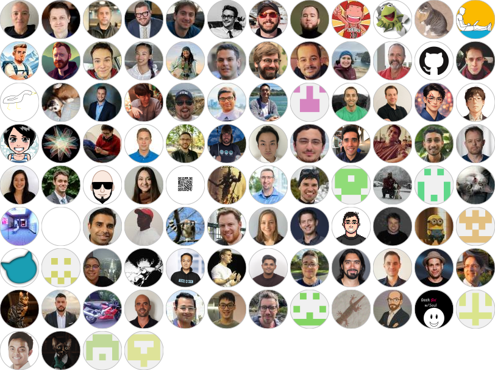

# Semantic Kernel

**使用这款企业级编排框架构建智能 AI 代理和多代理系统**

[](https://github.com/microsoft/semantic-kernel/blob/main/LICENSE)
[](https://pypi.org/project/semantic-kernel/)
[](https://www.nuget.org/packages/Microsoft.SemanticKernel/)
[](https://aka.ms/SKDiscord)

## 什么是 Semantic Kernel？

Semantic Kernel 是一个与模型无关的 SDK，使开发者能够构建、编排和部署 AI 代理及多代理系统。无论你是在构建简单的聊天机器人，还是复杂的多代理工作流，Semantic Kernel 都能提供企业级可靠性和灵活性所需的工具。

## 系统要求

- **Python**: 3.10+
- **.NET**: .NET 10.0+ 
- **Java**: JDK 17+
- **操作系统支持**: Windows、macOS、Linux

## 核心特性

- **模型灵活性**：内置支持 [OpenAI](https://platform.openai.com/docs/introduction)、[Azure OpenAI](https://azure.microsoft.com/en-us/products/ai-services/openai-service)、[Hugging Face](https://huggingface.co/)、[NVidia](https://www.nvidia.com/en-us/ai-data-science/products/nim-microservices/) 等，可连接任意 LLM
- **代理框架**：构建模块化的 AI 代理，支持工具/插件、记忆和规划能力
- **多代理系统**：通过协作式专业代理编排复杂工作流
- **插件生态**：可通过原生代码函数、提示词模板、OpenAPI 规范或 Model Context Protocol (MCP) 进行扩展
- **向量数据库支持**：与 [Azure AI Search](https://learn.microsoft.com/en-us/azure/search/search-what-is-azure-search)、[Elasticsearch](https://www.elastic.co/)、[Chroma](https://docs.trychroma.com/docs/overview/getting-started) 等无缝集成
- **多模态支持**：处理文本、图像和音频输入
- **本地部署**：支持 [Ollama](https://ollama.com/)、[LMStudio](https://lmstudio.ai/) 或 [ONNX](https://onnx.ai/) 运行
- **流程框架**：以结构化工作流方式建模复杂业务流程
- **企业级就绪**：为可观测性、安全性和稳定的 API 而构建

## 安装

首先，设置 AI 服务的环境变量：

**Azure OpenAI:**
```bash
export AZURE_OPENAI_API_KEY=AAA....
```

**或直接使用 OpenAI:**
```bash
export OPENAI_API_KEY=sk-...
```

### Python

```bash
pip install semantic-kernel
```

### .NET

```bash
dotnet add package Microsoft.SemanticKernel
dotnet add package Microsoft.SemanticKernel.Agents.Core
```

### Java

请参阅 [semantic-kernel-java 构建](https://github.com/microsoft/semantic-kernel-java/blob/main/BUILD.md) 了解说明。

## 快速入门

### 基础代理 - Python

创建一个响应用户提示词的简单助手：

```python
import asyncio
from semantic_kernel.agents import ChatCompletionAgent
from semantic_kernel.connectors.ai.open_ai import AzureChatCompletion

async def main():
    # Initialize a chat agent with basic instructions
    agent = ChatCompletionAgent(
        service=AzureChatCompletion(),
        name="SK-Assistant",
        instructions="You are a helpful assistant.",
    )

    # Get a response to a user message
    response = await agent.get_response(messages="Write a haiku about Semantic Kernel.")
    print(response.content)

asyncio.run(main()) 

# Output:
# Language's essence,
# Semantic threads intertwine,
# Meaning's core revealed.
```

### 基础代理 - .NET

```csharp
using Microsoft.SemanticKernel;
using Microsoft.SemanticKernel.Agents;

var builder = Kernel.CreateBuilder();
builder.AddAzureOpenAIChatCompletion(
                Environment.GetEnvironmentVariable("AZURE_OPENAI_DEPLOYMENT"),
                Environment.GetEnvironmentVariable("AZURE_OPENAI_ENDPOINT"),
                Environment.GetEnvironmentVariable("AZURE_OPENAI_API_KEY")
                );
var kernel = builder.Build();

ChatCompletionAgent agent =
    new()
    {
        Name = "SK-Agent",
        Instructions = "You are a helpful assistant.",
        Kernel = kernel,
    };

await foreach (AgentResponseItem<ChatMessageContent> response 
    in agent.InvokeAsync("Write a haiku about Semantic Kernel."))
{
    Console.WriteLine(response.Message);
}

// Output:
// Language's essence,
// Semantic threads intertwine,
// Meaning's core revealed.
```

### 带插件的代理 - Python

使用自定义工具（插件）和结构化输出来增强你的代理：

```python
import asyncio
from typing import Annotated
from pydantic import BaseModel
from semantic_kernel.agents import ChatCompletionAgent
from semantic_kernel.connectors.ai.open_ai import AzureChatCompletion, OpenAIChatPromptExecutionSettings
from semantic_kernel.functions import kernel_function, KernelArguments

class MenuPlugin:
    @kernel_function(description="Provides a list of specials from the menu.")
    def get_specials(self) -> Annotated[str, "Returns the specials from the menu."]:
        return """
        Special Soup: Clam Chowder
        Special Salad: Cobb Salad
        Special Drink: Chai Tea
        """

    @kernel_function(description="Provides the price of the requested menu item.")
    def get_item_price(
        self, menu_item: Annotated[str, "The name of the menu item."]
    ) -> Annotated[str, "Returns the price of the menu item."]:
        return "$9.99"

class MenuItem(BaseModel):
    price: float
    name: str

async def main():
    # Configure structured output format
    settings = OpenAIChatPromptExecutionSettings()
    settings.response_format = MenuItem

    # Create agent with plugin and settings
    agent = ChatCompletionAgent(
        service=AzureChatCompletion(),
        name="SK-Assistant",
        instructions="You are a helpful assistant.",
        plugins=[MenuPlugin()],
        arguments=KernelArguments(settings)
    )

    response = await agent.get_response(messages="What is the price of the soup special?")
    print(response.content)

    # Output:
    # The price of the Clam Chowder, which is the soup special, is $9.99.

asyncio.run(main()) 
```

### 带插件的代理 - .NET

```csharp
using System.ComponentModel;
using Microsoft.SemanticKernel;
using Microsoft.SemanticKernel.Agents;
using Microsoft.SemanticKernel.ChatCompletion;

var builder = Kernel.CreateBuilder();
builder.AddAzureOpenAIChatCompletion(
                Environment.GetEnvironmentVariable("AZURE_OPENAI_DEPLOYMENT"),
                Environment.GetEnvironmentVariable("AZURE_OPENAI_ENDPOINT"),
                Environment.GetEnvironmentVariable("AZURE_OPENAI_API_KEY")
                );
var kernel = builder.Build();

kernel.Plugins.Add(KernelPluginFactory.CreateFromType<MenuPlugin>());

ChatCompletionAgent agent =
    new()
    {
        Name = "SK-Assistant",
        Instructions = "You are a helpful assistant.",
        Kernel = kernel,
        Arguments = new KernelArguments(new PromptExecutionSettings() { FunctionChoiceBehavior = FunctionChoiceBehavior.Auto() })

    };

await foreach (AgentResponseItem<ChatMessageContent> response 
    in agent.InvokeAsync("What is the price of the soup special?"))
{
    Console.WriteLine(response.Message);
}

sealed class MenuPlugin
{
    [KernelFunction, Description("Provides a list of specials from the menu.")]
    public string GetSpecials() =>
        """
        Special Soup: Clam Chowder
        Special Salad: Cobb Salad
        Special Drink: Chai Tea
        """;

    [KernelFunction, Description("Provides the price of the requested menu item.")]
    public string GetItemPrice(
        [Description("The name of the menu item.")]
        string menuItem) =>
        "$9.99";
}
```

### 多代理系统 - Python

构建一个可协作的专业代理系统：

```python
import asyncio
from semantic_kernel.agents import ChatCompletionAgent, ChatHistoryAgentThread
from semantic_kernel.connectors.ai.open_ai import AzureChatCompletion, OpenAIChatCompletion

billing_agent = ChatCompletionAgent(
    service=AzureChatCompletion(), 
    name="BillingAgent", 
    instructions="You handle billing issues like charges, payment methods, cycles, fees, discrepancies, and payment failures."
)

refund_agent = ChatCompletionAgent(
    service=AzureChatCompletion(),
    name="RefundAgent",
    instructions="Assist users with refund inquiries, including eligibility, policies, processing, and status updates.",
)

triage_agent = ChatCompletionAgent(
    service=OpenAIChatCompletion(),
    name="TriageAgent",
    instructions="Evaluate user requests and forward them to BillingAgent or RefundAgent for targeted assistance."
    " Provide the full answer to the user containing any information from the agents",
    plugins=[billing_agent, refund_agent],
)

thread: ChatHistoryAgentThread = None

async def main() -> None:
    print("Welcome to the chat bot!\n  Type 'exit' to exit.\n  Try to get some billing or refund help.")
    while True:
        user_input = input("User:> ")

        if user_input.lower().strip() == "exit":
            print("\n\nExiting chat...")
            return False

        response = await triage_agent.get_response(
            messages=user_input,
            thread=thread,
        )

        if response:
            print(f"Agent :> {response}")

# Agent :> I understand that you were charged twice for your subscription last month, and I'm here to assist you with resolving this issue. Here’s what we need to do next:

# 1. **Billing Inquiry**:
#    - Please provide the email address or account number associated with your subscription, the date(s) of the charges, and the amount charged. This will allow the billing team to investigate the discrepancy in the charges.

# 2. **Refund Process**:
#    - For the refund, please confirm your subscription type and the email address associated with your account.
#    - Provide the dates and transaction IDs for the charges you believe were duplicated.

# Once we have these details, we will be able to:

# - Check your billing history for any discrepancies.
# - Confirm any duplicate charges.
# - Initiate a refund for the duplicate payment if it qualifies. The refund process usually takes 5-10 business days after approval.

# Please provide the necessary details so we can proceed with resolving this issue for you.

if __name__ == "__main__":
    asyncio.run(main())
```

## 接下来去哪里

1. 📖 尝试我们的[入门指南](https://learn.microsoft.com/en-us/semantic-kernel/get-started/quick-start-guide)，或了解如何[构建代理](https://learn.microsoft.com/en-us/semantic-kernel/frameworks/agent/)
2. 🔌 探索超过 100 个[详细示例](https://learn.microsoft.com/en-us/semantic-kernel/get-started/detailed-samples)
3. 💡 了解 Semantic Kernel 的核心[概念](https://learn.microsoft.com/en-us/semantic-kernel/concepts/kernel)

### API 参考

- [C# API 参考](https://learn.microsoft.com/en-us/dotnet/api/microsoft.semantickernel?view=semantic-kernel-dotnet)
- [Python API 参考](https://learn.microsoft.com/en-us/python/api/semantic-kernel/semantic_kernel?view=semantic-kernel-python)

## 故障排除

### 常见问题

- **认证错误**：检查 API 密钥环境变量是否正确设置
- **模型可用性**：验证你的 Azure OpenAI 部署或 OpenAI 模型访问权限

### 获取帮助

- 在 [GitHub issues](https://github.com/microsoft/semantic-kernel/issues) 中查找已知问题
- 在 [Discord 社区](https://aka.ms/SKDiscord)中搜索解决方案
- 寻求帮助时请附上你的 SDK 版本和完整的错误信息

## 加入社区

我们欢迎你对 SK 社区的贡献和建议！参与最简单的方式之一是在 GitHub 仓库中参与讨论。欢迎提交 Bug 报告和修复！

对于新功能、组件或扩展，请先开一个 issue 与我们讨论，然后再提交 PR。这是为了避免被拒绝，因为我们可能正在将核心引向不同的方向，同时也需要考虑对更大生态系统的影响。

了解更多并开始参与：

- 阅读[文档](https://aka.ms/sk/learn)
- 了解如何为项目[做贡献](https://learn.microsoft.com/en-us/semantic-kernel/support/contributing)
- 在 [GitHub Discussions](https://github.com/microsoft/semantic-kernel/discussions) 中提问
- 在 [Discord 社区](https://aka.ms/SKDiscord) 中提问

- 参加[定期办公时间和 SK 社区活动](COMMUNITY.md)
- 在我们的[博客](https://aka.ms/sk/blog)上关注团队动态

## 贡献者名人堂

[](https://github.com/microsoft/semantic-kernel/graphs/contributors)

## 行为准则

本项目已采用
[Microsoft 开源行为准则](https://opensource.microsoft.com/codeofconduct/)。
更多信息请参阅
[行为准则常见问题](https://opensource.microsoft.com/codeofconduct/faq/)，
如有其他问题或建议请联系 [opencode@microsoft.com](mailto:opencode@microsoft.com)。

## 许可证

Copyright (c) Microsoft Corporation. All rights reserved.

采用 [MIT](LICENSE) 许可证授权。
