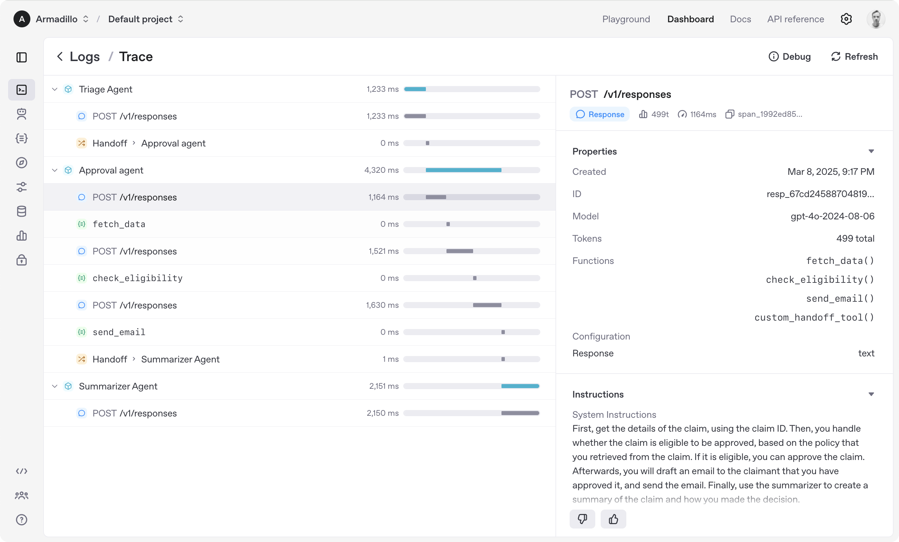

# OpenAI Agents SDK [](https://pypi.org/project/openai-agents/)

OpenAI Agents SDK 是一个轻量但功能强大的框架，用于构建多代理工作流。它不依赖特定提供商，支持 OpenAI Responses 和 Chat Completions API，以及 100 多个其他 LLM。



> [!NOTE]
> 在找 JavaScript/TypeScript 版本？请查看 [Agents SDK JS/TS](https://github.com/openai/openai-agents-js)。

### 核心概念：

1. [**代理（Agents）**](https://openai.github.io/openai-agents-python/agents)：配置了指令、工具、护栏和交接机制的 LLM
1. **[代理作为工具](https://openai.github.io/openai-agents-python/tools/#agents-as-tools) / [交接机制（Handoffs）](https://openai.github.io/openai-agents-python/handoffs/)**：将特定任务委托给其他代理
1. [**工具（Tools）**](https://openai.github.io/openai-agents-python/tools/)：各种工具让代理能够执行操作（函数、MCP、托管工具）
1. [**护栏（Guardrails）**](https://openai.github.io/openai-agents-python/guardrails/)：用于输入和输出验证的可配置安全检查
1. [**人机协作（Human in the loop）**](https://openai.github.io/openai-agents-python/human_in_the_loop/)：在代理运行过程中引入人工参与的内置机制
1. [**会话（Sessions）**](https://openai.github.io/openai-agents-python/sessions/)：跨代理运行的自动对话历史管理
1. [**追踪（Tracing）**](https://openai.github.io/openai-agents-python/tracing/)：内置的代理运行追踪功能，可查看、调试和优化工作流
1. [**实时代理（Realtime Agents）**](https://openai.github.io/openai-agents-python/realtime/quickstart/)：使用 `gpt-realtime-1.5` 和完整的代理功能构建强大的语音代理

浏览 [示例目录](https://github.com/openai/openai-agents-python/tree/main/examples) 了解 SDK 的实际用法，阅读我们的 [文档](https://openai.github.io/openai-agents-python/) 了解更多详情。

## 快速开始

开始之前，请先配置 Python 环境（需要 Python 3.10 或更高版本），然后安装 OpenAI Agents SDK 包。

### venv

```bash
python -m venv .venv
source .venv/bin/activate  # On Windows: .venv\Scripts\activate
pip install openai-agents
```

如需语音支持，请使用可选的 `voice` 组安装：`pip install 'openai-agents[voice]'`。如需 Redis 会话支持，请使用可选的 `redis` 组安装：`pip install 'openai-agents[redis]'`。

### uv

如果你熟悉 [uv](https://docs.astral.sh/uv/)，安装这个包会更加简单：

```bash
uv init
uv add openai-agents
```

如需语音支持，请使用可选的 `voice` 组安装：`uv add 'openai-agents[voice]'`。如需 Redis 会话支持，请使用可选的 `redis` 组安装：`uv add 'openai-agents[redis]'`。

## 运行你的第一个代理

```python
from agents import Agent, Runner

agent = Agent(name="Assistant", instructions="You are a helpful assistant")

result = Runner.run_sync(agent, "Write a haiku about recursion in programming.")
print(result.final_output)

# Code within the code,
# Functions calling themselves,
# Infinite loop's dance.
```

（运行前请确保已设置 `OPENAI_API_KEY` 环境变量）

（Jupyter notebook 用户请参阅 [hello_world_jupyter.ipynb](https://github.com/openai/openai-agents-python/blob/main/examples/basic/hello_world_jupyter.ipynb)）

浏览 [示例目录](https://github.com/openai/openai-agents-python/tree/main/examples) 了解 SDK 的实际用法，阅读我们的 [文档](https://openai.github.io/openai-agents-python/) 了解更多详情。

## 致谢

我们要感谢开源社区的杰出贡献，特别是以下项目：

- [Pydantic](https://docs.pydantic.dev/latest/)
- [Requests](https://github.com/psf/requests)
- [MCP Python SDK](https://github.com/modelcontextprotocol/python-sdk)
- [Griffe](https://github.com/mkdocstrings/griffe)

本库依赖以下可选组件：

- [websockets](https://github.com/python-websockets/websockets)
- [SQLAlchemy](https://github.com/sqlalchemy/sqlalchemy)
- [any-llm](https://github.com/mozilla-ai/any-llm) 和 [LiteLLM](https://github.com/BerriAI/litellm)

我们还依赖以下工具来管理项目：

- [uv](https://github.com/astral-sh/uv) 和 [ruff](https://github.com/astral-sh/ruff)
- [mypy](https://github.com/python/mypy) 和 [Pyright](https://github.com/microsoft/pyright)
- [pytest](https://github.com/pytest-dev/pytest) 和 [Coverage.py](https://github.com/coveragepy/coveragepy)
- [MkDocs](https://github.com/squidfunk/mkdocs-material)

我们将继续致力于将 Agents SDK 打造为开源框架，让社区中的其他人可以在我们的方法基础上进行扩展。
