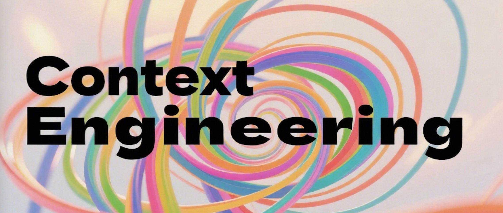
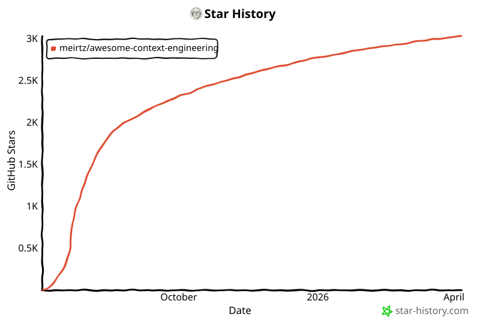

# Awesome Context Engineering

<div align="center">
  
</div>

## 💬 加入我们的社区

<div align="center">
  
  <p><strong>欢迎加入我们的微信群，参与讨论并获取最新动态！</strong></p>
  <p><a href="https://discord.gg/fsqs3Ybh"><strong>加入我们的 Discord 服务器</strong></a></p>
</div>

[](https://awesome.re)
[](https://opensource.org/licenses/MIT)
[](http://makeapullrequest.com)
[](https://arxiv.org/abs/2507.13334)

> 📄 **我们关于 Context Engineering 的综合综述论文现已正式发布！** 欢迎查看我们最新的学术洞见与理论基础。

这是一份关于 **Context Engineering** 的综合综述与资源汇编，聚焦其从静态 prompting 演进到动态、具备上下文感知能力的 AI 系统，并进一步扩展到 **agent 运行时、记忆系统、协议、编码代理和可观测性技术栈**。

## 📧 联系方式

如果你有任何问题、建议或合作意向，欢迎随时联系：

**Lingrui Mei**  
📧 Email:  [meilingrui25b@ict.ac.cn](mailto:meilingrui25b@ict.ac.cn) 或 [meilingrui22@mails.ucas.ac.cn](mailto:meilingrui22@mails.ucas.ac.cn)

**我在论文的第一个版本里写错了邮箱地址！！** 你也可以在本仓库中提交 issue，进行一般性讨论和提出建议。

---

## 📰 最新动态

- **[2025.07.17]** 🔥🔥 我们的论文现已发布！欢迎在 [arXiv](https://arxiv.org/abs/2507.13334) 和 [Hugging Face Papers](https://huggingface.co/papers/2507.13334) 查看 ["A Survey of Context Engineering for Large Language Models"](https://arxiv.org/abs/2507.13334)
- **[2025.07.03]** 仓库已初始化，并建立了完整大纲
- **[2025.07.03]** 综述结构已按照现代 context engineering 范式搭建完成

---

## 🎯 简介

在大语言模型（LLM）时代，静态 prompting 的局限性正变得愈发明显。**Context Engineering** 是为应对 LLM 的不确定性并实现生产级 AI 部署而自然演进出的方向。与传统的 prompt engineering 不同，context engineering 涵盖了在推理时提供给 LLM 的完整信息载荷，其中包括模型合理完成任务所需的全部结构化信息组件。

本仓库旨在对 context engineering 的技术、方法论与应用进行全面综述。

---

## 🧭 2026 Agent 时代更新

### 从 Context Engineering 到 Agent Engineering

截至 **2026 年 3 月**，context engineering 仍然是一个有用且必要的概念，但它已经不再是全部。关注重心已经从“如何打包出最好的 prompt”转向 **agent 系统如何管理运行时状态、记忆、工具、协议、审批以及长时程执行**。在实践中，context engineering 现在处于一个更广泛的技术栈之中，这个栈还包括 **agent harnesses**、**互操作协议**、**面向编码代理的项目记忆** 以及 **以 trace 为核心的可观测性**。

### 本仓库现在涵盖的内容

本仓库依然保留了其最初关于长上下文、RAG、记忆、agent 通信、工具使用、评测与应用的综述结构。同时，这份 README 也正在重新组织，以通过以下新增内容更好地反映 **agent 时代**：

- **Agent harnesses 与运行时系统**：涵盖规划、子代理、检查点、沙箱和人工审批闭环
- **生产环境中的上下文管理**：包括压缩、缓存、由工件承载的上下文以及作用域化指令加载
- **记忆工件与可移植性**：包括持久化记忆、记忆交换格式、人格封装和项目记忆
- **开放协议**：如 MCP、A2A、AG-UI、ACP 以及可移植的 agent schema
- **编码代理与 computer use**：这是当下 context engineering 最显性的生产场景
- **评测、可观测性与遥测**：面向长时间运行的 agent 系统，而不再仅限于静态基准

### 2026 主题阅读指南

如果你主要关注 2026 年这一轮转向，建议直接阅读以下扩展章节：

- **Agent harnesses 与运行时系统**：可参考 [Anthropic's effective agents guide](https://www.anthropic.com/engineering/building-effective-agents)、[OpenAI's Agents and Tools documentation](https://platform.openai.com/docs/guides/agents)、[Google ADK](https://google.github.io/adk-docs/) 和 [LangChain Deep Agents](https://docs.langchain.com/oss/python/deepagents/overview)
- **开放协议与互操作性**：包括 [Model Context Protocol](https://modelcontextprotocol.io/specification/2025-06-18)、[A2A](https://a2a-protocol.org/latest/)、[AG-UI](https://docs.ag-ui.com/) 和 [AgentSchema](https://microsoft.github.io/AgentSchema/)
- **编码代理与项目记忆**：包括 [OpenAI Codex](https://openai.com/index/introducing-codex/)、[Claude Code memory](https://docs.anthropic.com/en/docs/claude-code/memory) 和 [Letta memory blocks](https://docs.letta.com/guides/core-concepts/memory/memory-blocks)
- **评测与可观测性**：包括 [LangSmith observability](https://docs.langchain.com/langsmith/observability-quickstart) 和 [OpenTelemetry semantic conventions for GenAI](https://opentelemetry.io/docs/specs/semconv/gen-ai/)

---

## 📚 目录

- [Awesome Context Engineering](#awesome-context-engineering)
  - [💬 加入我们的社区](#-加入我们的社区)
  - [📧 联系方式](#-联系方式)
  - [📰 最新动态](#-最新动态)
  - [🎯 简介](#-简介)
  - [🧭 2026 Agent 时代更新](#-2026-agent-时代更新)
    - [从 Context Engineering 到 Agent Engineering](#从-context-engineering-到-agent-engineering)
    - [本仓库现在涵盖的内容](#本仓库现在涵盖的内容)
    - [2026 主题阅读指南](#2026-主题阅读指南)
  - [📚 目录](#-目录)
  - [🔗 相关综述](#-相关综述)
  - [🏗️ Context Engineering 的定义](#️-context-engineering-的定义)
    - [LLM 生成过程](#llm-生成过程)
    - [Context 的定义](#context-的定义)
    - [Context Engineering 的定义](#context-engineering-的定义)
    - [动态上下文编排](#动态上下文编排)
    - [数学原理](#数学原理)
    - [理论框架：贝叶斯上下文推断](#理论框架贝叶斯上下文推断)
    - [对比](#对比)
  - [🌐 相关文章与博客](#-相关文章与博客)
    - [社交媒体与演讲](#社交媒体与演讲)
  - [🤔 为什么需要 Context Engineering？](#-为什么需要-context-engineering)
    - [范式转变：从战术走向战略](#范式转变从战术走向战略)
    - [1. 当前方法面临的根本挑战](#1-当前方法面临的根本挑战)
      - [人类意图传达挑战](#人类意图传达挑战)
      - [复杂知识需求](#复杂知识需求)
      - [可靠性与可信性问题](#可靠性与可信性问题)
    - [2. 静态提示的局限性](#2-静态提示的局限性)
      - [从字符串到系统](#从字符串到系统)
      - [“电影制作”类比](#电影制作类比)
    - [3. 企业级与生产级需求](#3-企业级与生产级需求)
      - [上下文失败已成为新的瓶颈](#上下文失败已成为新的瓶颈)
      - [超越简单任务的可扩展性](#超越简单任务的可扩展性)
      - [可靠性与一致性](#可靠性与一致性)
      - [经济性与运维效率](#经济性与运维效率)
    - [4. 认知科学与信息科学基础](#4-认知科学与信息科学基础)
      - [人工具身性](#人工具身性)
      - [大规模信息检索](#大规模信息检索)
    - [5. AI 系统架构的未来](#5-ai-系统架构的未来)
  - [🔧 组件、技术与体系结构](#-组件技术与体系结构)
    - [上下文扩展](#上下文扩展)
    - [生产环境中的上下文管理](#生产环境中的上下文管理)
    - [结构化数据集成](#结构化数据集成)
    - [自生成上下文](#自生成上下文)
  - [🛠️ 实现与挑战](#️-实现与挑战)
    - [0. Agent Harnesses 与运行时系统](#0-agent-harnesses-与运行时系统)
    - [1. 检索增强生成（RAG）](#1-检索增强生成rag)
    - [2. 记忆系统](#2-记忆系统)
      - [运行时记忆设计模式](#运行时记忆设计模式)
      - [项目记忆与指令工件](#项目记忆与指令工件)
    - [3. Agent 通信](#3-agent-通信)
      - [开放式 Agent 协议与互操作性](#开放式-agent-协议与互操作性)
    - [4. 工具使用与函数调用](#4-工具使用与函数调用)
      - [托管式 Agent 工具与 Computer Use](#托管式-agent-工具与-computer-use)
  - [📊 上下文驱动系统的评测范式](#-上下文驱动系统的评测范式)
    - [上下文质量评估](#上下文质量评估)
    - [Context Engineering 基准评测](#context-engineering-基准评测)
    - [Agent 可观测性与遥测](#agent-可观测性与遥测)
  - [🚀 应用与系统](#-应用与系统)
    - [复杂研究系统](#复杂研究系统)
    - [生产系统](#生产系统)
      - [编码代理与项目记忆](#编码代理与项目记忆)
      - [平台栈与托管式 Agent 运行时](#平台栈与托管式-agent-运行时)
  - [🔮 局限性与未来方向](#-局限性与未来方向)
    - [当前局限性](#当前局限性)
    - [未来研究方向](#未来研究方向)
  - [🤝 贡献方式](#-贡献方式)
    - [论文格式规范](#论文格式规范)
    - [徽章颜色](#徽章颜色)
  - [📄 许可证](#-许可证)
  - [📑 引用](#-引用)
  - [⚠️ 免责声明](#️-免责声明)
  - [📧 联系方式](#-联系方式-1)
  - [🙏 致谢](#-致谢)
  - [Star 历史](#star-历史)
  - [📖 我们的论文](#-我们的论文)

---

## 🔗 相关综述

<b>通用 AI 综述论文</b>

<ul>
<li><i><b>A Survey of Large Language Models</b></i>, Zhao et al.,<a href="https://arxiv.org/abs/2303.18223" target="_blank"></a>
    <a href="https://github.com/RUCAIBox/LLMSurvey" target="_blank">
  		
    </a>
</li>
<li><i><b>The Prompt Report: A Systematic Survey of Prompt Engineering Techniques</b></i>, Schulhoff et al., <a href="https://arxiv.org/abs/2406.06608" target="_blank"></a>
    <a href="https://github.com/trigaten/The_Prompt_Report" target="_blank">
  		
    </a></li>
<li><i><b>A Systematic Survey of Prompt Engineering in Large Language Models: Techniques and Applications</b></i>, Sahoo et al., <a href="https://arxiv.org/abs/2402.07927" target="_blank"></a>
    </li>
<li><i><b>A Systematic Survey of Prompt Engineering on Vision-Language Foundation Models</b></i>, Gao et al., <a href="https://arxiv.org/abs/2307.12980" target="_blank"></a>
    <a href="https://github.com/JindongGu/Awesome-Prompting-on-Vision-Language-Model" target="_blank">
  		
    </a></li>
</ul>

<b>上下文与推理</b>

<ul>
<li><i><b>A Survey on In-context Learning</b></i>, Dong et al., <a href="https://doi.org/10.18653/v1/2024.emnlp-main.64" target="_blank"></a>
<a href="https://github.com/dqxiu/ICL_PaperList" target="_blank">
  		
    </a></li>
<li><i><b>The Mystery of In-Context Learning: A Comprehensive Survey on Interpretation and Analysis</b></i>, Zhou et al., <a href="https://arxiv.org/abs/2311.00237" target="_blank"></a>
<a href="https://github.com/zyxnlp/ICL-Interpretation-Analysis-Resources" target="_blank">
  		
    </a></li>
<li><i><b>A Comprehensive Survey of Retrieval-Augmented Generation (RAG): Evolution, Current Landscape and Future Directions</b></i>, Gupta et al., <a href="https://arxiv.org/abs/2410.12837" target="_blank"></a>
    </li>
<li><i><b>Retrieval-Augmented Generation for Large Language Models: A Survey</b></i>, Gao et al., <a href="https://arxiv.org/abs/2312.10997" target="_blank"></a>
<a href="https://github.com/Tongji-KGLLM/RAG-Survey" target="_blank">
  		
    </a></li>
<li><i><b>A Survey on Knowledge-Oriented Retrieval-Augmented Generation</b></i>, Cheng et al., <a href="https://arxiv.org/abs/2503.10677" target="_blank"></a>
<a href="https://github.com/USTCAGI/Awesome-Papers-Retrieval-Augmented-Generation" target="_blank">
  		
    </a></li>
</ul>

<b>记忆系统与上下文持久化</b>

<b>综述</b>
<ul>
<li><i><b>A Survey on the Memory Mechanism of Large Language Model based Agents</b></i>, Zhang et al., <a href="https://arxiv.org/abs/2404.13501" target="_blank"></a>
    <a href="https://github.com/nuster1128/LLM_Agent_Memory_Survey" target="_blank">
  		
    </a></li>
<li><i><b>Survey on Memory-Augmented Neural Networks: Cognitive Insights to AI Applications</b></i>, Khosla et al., <a href="https://arxiv.org/abs/2312.06141" target="_blank"></a>
    </li>
<li><i><b>From Human Memory to AI Memory: A Survey on Memory Mechanisms in the Era of LLMs</b></i>, Wu et al., <a href="https://arxiv.org/abs/2504.15965" target="_blank"></a>
    </li>
<li><i><b>Survey on Evaluation of LLM-based Agents</b></i>, Anonymous et al., <a href="https://arxiv.org/abs/2503.16416" target="_blank"></a>
    </li>
<li><i><b>A Survey of Personalized Large Language Models: Progress and Future Directions</b></i>, Anonymous et al., <a href="https://arxiv.org/abs/2502.11528" target="_blank"></a>
    </li>
<li><i><b>Agentic Retrieval-Augmented Generation: A Survey</b></i>, Anonymous et al., <a href="https://arxiv.org/abs/2501.09136" target="_blank"></a>
    </li>
<li><i><b>Retrieval-Augmented Generation with Graphs (GraphRAG)</b></i>, Anonymous et al., <a href="https://arxiv.org/abs/2501.00309" target="_blank"></a>
    <a href="https://github.com/Graph-RAG/GraphRAG/" target="_blank">
  		
    </a></li>
<li><i><b>The Landscape of Agentic Reinforcement Learning for LLMs: A Survey</b></i>, Zhang et al., <a href="https://arxiv.org/abs/2509.02547" target="_blank"></a>
    <a href="https://github.com/xhyumiracle/Awesome-AgenticLLM-RL-Papers" target="_blank">
  		
    </a></li>
</ul>

<b>基准</b>
<ul>
<li><i><b>Evaluating Very Long-Term Conversational Memory of LLM Agents (LOCOMO)</b></i>, Anonymous et al., <a href="https://arxiv.org/abs/2402.17753" target="_blank"></a>
    <a href="https://snap-research.github.io/locomo/" target="_blank">
  		
    </a></li>
<li><i><b>Evaluating Memory in LLM Agents via Incremental Multi-Turn Interactions</b></i>, Hu et al.,<a href="https://arxiv.org/abs/2507.05257" target="_blank"></a>
    <a href="https://github.com/HUST-AI-HYZ/MemoryAgentBench" target="_blank">
  		</a>
      <a href="https://huggingface.co/datasets/ai-hyz/MemoryAgentBench" target="_blank">
  		
    </a></li>
<li><i><b>Episodic Memories Generation and Evaluation Benchmark for Large Language Models</b></i>, Anonymous et al., <a href="https://arxiv.org/abs/2501.13121" target="_blank"></a>
    </li>
<li><i><b>On the Structural Memory of LLM Agents</b></i>, Anonymous et al., <a href="https://arxiv.org/abs/2412.15266" target="_blank"></a>
    </li>
<li><i><b>HotpotQA: A Dataset for Diverse, Explainable Multi-hop Question Answering</b></i>, Yang et al., <a href="https://arxiv.org/abs/1809.09600" target="_blank"></a>
    <a href="https://hotpotqa.github.io/" target="_blank">
  		
    </a></li>
</ul>
<b>神经记忆架构</b>

<ul>
<li><i><b>Neural Turing Machines</b></i>, Graves et al., <a href="https://arxiv.org/abs/1410.5401" target="_blank"></a>
    </li>
<li><i><b>Differentiable Neural Computers</b></i>, Graves et al., <a href="https://arxiv.org/abs/1610.06258" target="_blank"></a>
    <a href="https://github.com/google-deepmind/dnc" target="_blank">
  		
    </a></li>
<li><i><b>A Brain-inspired Memory Transformation based Differentiable Neural Computer</b></i>, Anonymous et al., <a href="https://arxiv.org/abs/2301.02809" target="_blank"></a>
    </li>
<li><i><b>Differentiable Neural Computers with Memory Demon</b></i>, Anonymous et al., <a href="https://arxiv.org/abs/2211.02987" target="_blank"></a>
    </li>
</ul>
<b>记忆增强 Transformer</b>

<ul>
<li><i><b>Memorizing Transformers</b></i>, Wu et al., <a href="https://arxiv.org/abs/2203.08913" target="_blank"></a>
    </li>
<li><i><b>Recurrent Memory Transformer</b></i>, Bulatov et al., <a href="https://arxiv.org/abs/2207.06881" target="_blank"></a>
    <a href="https://github.com/booydar/recurrent-memory-transformer" target="_blank">
  		
    </a></li>
<li><i><b>Leave No Context Behind: Efficient Infinite Context Transformers with Infini-attention</b></i>, Munkhdalai et al., <a href="https://arxiv.org/abs/2404.07143" target="_blank"></a>
    </li>
<li><i><b>Memformer: A Memory-Augmented Transformer for Sequence Modeling</b></i>, Wu et al., <a href="https://arxiv.org/abs/2010.06891" target="_blank"></a>
    </li>
<li><i><b>Token Turing Machines</b></i>, Ryoo et al., <a href="https://arxiv.org/abs/2211.09119" target="_blank"></a>
    </li>
<li><i><b>TransformerFAM: Feedback Attention is Working Memory</b></i>, Irie et al., <a href="https://arxiv.org/abs/2404.09173" target="_blank"></a>
    </li>
</ul>

<b>生产级记忆系统</b>
<ul>
<li><i><b>MemGPT: Towards LLMs as Operating Systems</b></i>, Packer et al., <a href="https://arxiv.org/abs/2310.08560" target="_blank"></a>
    <a href="https://research.memgpt.ai" target="_blank">
  		
    </a></li>
<li><i><b>MemoryBank: Enhancing Large Language Models with Long-Term Memory</b></i>, Zhong et al., <a href="https://arxiv.org/abs/2305.10250" target="_blank"></a>
    <a href="https://github.com/zhongwanjun/memorybank-siliconfriend" target="_blank">
  		
    </a></li>
<li><i><b>MEM0: Building Production-Ready AI Agents with Scalable Long-Term Memory</b></i>, Taranjeet et al., <a href="https://arxiv.org/abs/2504.19413" target="_blank"></a>
    <a href="https://mem0.ai/research" target="_blank">
  		
    </a></li>
<li><i><b>MEM1: Learning to Synergize Memory and Reasoning for Efficient Long-Horizon Agents</b></i>, Anonymous et al., <a href="https://arxiv.org/abs/2506.15841" target="_blank"></a>
    <a href="https://github.com/mannaandpoem/openmanus" target="_blank">
  		
    </a></li>
<li><i><b>A-MEM: Agentic Memory for LLM Agents</b></i>, Anonymous et al., <a href="https://arxiv.org/abs/2502.12110" target="_blank"></a>
    <a href="https://github.com/agiresearch/A-mem" target="_blank">
  		
    </a></li>
<li><i><b>MemAgent: Reshaping Long-Context LLM with Multi-Conv RL-based Memory Agent</b></i>, Anonymous et al., <a href="https://arxiv.org/abs/2507.02259" target="_blank"></a>
    </li>
<li><i><b>Memory OS of AI Agent</b></i>, Kang et al., <a href="https://arxiv.org/abs/2506.06326" target="_blank"></a>
    <a href="https://github.com/BAI-LAB/MemoryOS" target="_blank">
  		
    </a></li>
</ul>
<b>基于图的记忆系统</b>

<ul>
<li><i><b>arigraph: learning knowledge graph world models with episodic memory for llm agents</b></i>, Anonymous et al., <a href="https://arxiv.org/abs/2407.04363" target="_blank"></a>
    </li>
<li><i><b>Zep: A Temporal Knowledge Graph Architecture for Agent Memory</b></i>, Anonymous et al., <a href="https://arxiv.org/abs/2501.13956" target="_blank"></a>
    <a href="https://github.com/getzep/graphiti" target="_blank">
  		
    </a></li>
<li><i><b>KG-Agent: An Efficient Autonomous Agent Framework for Complex Reasoning over Knowledge Graph</b></i>, Anonymous et al., <a href="https://arxiv.org/abs/2402.11163" target="_blank"></a>
    </li>
<li><i><b>GraphReader: Building Graph-based Agent to Enhance Long-Context Abilities of Large Language Models</b></i>, Anonymous et al., <a href="https://arxiv.org/abs/2406.14550" target="_blank"></a>
    </li>
<li><i><b>From Local to Global: A GraphRAG Approach to Query-Focused Summarization</b></i>, Edge et al., <a href="https://arxiv.org/abs/2404.16130" target="_blank"></a>
    <a href="https://github.com/microsoft/graphrag" target="_blank">
  		
    </a></li>
<li><i><b>Knowledge Graph-Guided Retrieval Augmented Generation</b></i>, Zhu et al., <a href="https://arxiv.org/abs/2502.06864" target="_blank"></a>
    </li>
</ul>
<b>情景记忆与工作记忆</b>

<ul>
<li><i><b>Larimar: Large Language Models with Episodic Memory Control</b></i>, Goyal et al., <a href="https://arxiv.org/abs/2403.11901" target="_blank"></a>
    </li>
<li><i><b>EM-LLM: Human-like Episodic Memory for Infinite Context LLMs</b></i>, Anonymous et al., <a href="https://arxiv.org/abs/2407.09450" target="_blank"></a>
    <a href="https://github.com/em-llm/EM-LLM-model" target="_blank">
  		
    </a></li>
<li><i><b>Large Language Models with Controllable Working Memory</b></i>, Goyal et al., <a href="https://arxiv.org/abs/2211.05110" target="_blank"></a>
    </li>
<li><i><b>Empowering Working Memory for Large Language Model Agents</b></i>, Anonymous et al., <a href="https://arxiv.org/abs/2312.17259" target="_blank"></a>
    </li>
</ul>
<b>对话记忆</b>

<ul>
<li><i><b>MemoChat: Tuning LLMs to Use Memos for Consistent Long-Range Open-Domain Conversation</b></i>, Anonymous et al., <a href="https://arxiv.org/abs/2308.08239" target="_blank"></a>
    </li>
<li><i><b>Think-in-Memory: Recalling and Post-thinking Enable LLMs with Long-Term Memory</b></i>, Anonymous et al., <a href="https://arxiv.org/abs/2311.08719" target="_blank"></a>
    </li>
<li><i><b>Generative Agents: Interactive Simulacra of Human Behavior</b></i>, Park et al., <a href="https://arxiv.org/abs/2304.03442" target="_blank"></a>
    </li>
<li><i><b>Self-Controlled Memory Framework for Large Language Models</b></i>, Anonymous et al., <a href="https://arxiv.org/abs/2304.13343" target="_blank"></a>
    </li>
</ul>
<b>主要会议的基础综述论文</b>

<ul>
<li><i><b>AUTOPROMPT: Eliciting Knowledge from Language Models with Automatically Generated Prompts</b></i>, Shin et al., <a href="#" target="_blank"></a>
    <a href="https://github.com/ucinlp/autoprompt" target="_blank">
  		
    </a></li>
<li><i><b>The Power of Scale for Parameter-Efficient Prompt Tuning</b></i>, Lester et al., <a href="#" target="_blank"></a>
    <a href="https://github.com/google-research/prompt-tuning" target="_blank">
  		
    </a></li>
<li><i><b>Prefix-Tuning: Optimizing Continuous Prompts for Generation</b></i>, Li et al., <a href="#" target="_blank"></a>
    <a href="https://github.com/XiangLi1999/PrefixTuning" target="_blank">
  		
    </a></li>
<li><i><b>An Explanation of In-context Learning as Implicit Bayesian Inference</b></i>, Xie et al., <a href="#" target="_blank"></a>
    <a href="https://github.com/p-lambda/incontext-learning" target="_blank">
  		
    </a></li>
<li><i><b>Rethinking the Role of Demonstrations: What Makes In-context Learning Work?</b></i>, Min et al., <a href="#" target="_blank"></a>
    <a href="https://github.com/Alrope123/rethinking-demonstrations" target="_blank">
  		
    </a></li>
</ul>

<b>补充的 RAG 与检索综述</b>
<ul>
<li><i><b>Retrieval-Augmented Generation for AI-Generated Content: A Survey</b></i>, Various, <a href="https://arxiv.org/abs/2402.19473" target="_blank"></a>
    <a href="https://github.com/PKU-DAIR/RAG-Survey" target="_blank">
  		
    </a></li>
<li><i><b>Retrieval Augmented Generation (RAG) and Beyond: A Comprehensive Survey on How to Make your LLMs use External Data More Wisely</b></i>, Various, <a href="https://arxiv.org/abs/2409.14924" target="_blank"></a>
    </li>
<li><i><b>Large language models (LLMs): survey, technical frameworks, and future challenges</b></i>, Various, <a href="#" target="_blank"></a>
    </li>
</ul>

---

## 🏗️ Context Engineering 的定义

> **Context 并不只是用户发送给 LLM 的那一条 prompt。Context 是在推理时提供给 LLM 的完整信息载荷，涵盖模型为合理完成特定任务所需的全部结构化信息组件。**

### LLM 生成过程

要形式化定义 Context Engineering，我们首先需要从数学上刻画 LLM 的生成过程。可以将 LLM 建模为一个概率函数：

$$P(\text{output} | \text{context}) = \prod_{t=1}^T P(\text{token}_t | \text{previous tokens}, \text{context})$$

其中：
- $\text{context}$ 表示提供给 LLM 的完整输入信息
- $\text{output}$ 表示生成的响应序列
- $P(\text{token}_t | \text{previous tokens}, \text{context})$ 表示在给定上下文的条件下生成每个 token 的概率

### Context 的定义

在传统 prompt engineering 中，context 被视为一个简单的字符串：
$$\text{context} = \text{prompt}$$

而在 Context Engineering 中，我们将 context 拆分为多个结构化组件：

$$\text{context} = \text{Assemble}(\text{instructions}, \text{knowledge}, \text{tools}, \text{memory}, \text{state}, \text{query})$$

其中，$\text{Assemble}$ 是一个上下文组装函数，用于协调：
- $\text{instructions}$：系统提示词与规则
- $\text{knowledge}$：检索得到的相关信息
- $\text{tools}$：可用的函数定义
- $\text{memory}$：对话历史与已学习事实
- $\text{state}$：当前的世界状态 / 用户状态
- $\text{query}$：用户当前的即时请求

### Context Engineering 的定义

**Context Engineering** 在形式上可定义为如下优化问题：

$$\text{Assemble}^* = \arg\max_{\text{Assemble}} \mathbb{E} [\text{Reward}(\text{LLM}(\text{context}), \text{target})]$$

约束条件如下：
- $|\text{context}| \leq \text{MaxTokens} \text{（context window 限制）}$
- $\text{knowledge} = \text{Retrieve}(\text{query}, \text{database})$
- $\text{memory} = \text{Select}(\text{history}, \text{query})$
- $\text{state} = \text{Extract}(\text{world})$

其中：
- $\text{Reward}$ 衡量生成响应的质量
- $\text{Retrieve}$、$\text{Select}$、$\text{Extract}$ 是信息收集函数

### 动态上下文编排

上下文组装过程可分解为：

$$\text{context} = \text{Concat}(\text{Format}(\text{instructions}), \text{Format}(\text{knowledge}), \text{Format}(\text{tools}), \text{Format}(\text{memory}), \text{Format}(\text{query}))$$

其中，$\text{Format}$ 表示针对组件的特定结构化方式，$\text{Concat}$ 则在遵守 token 限制和最优位置安排的前提下将它们拼接起来。

因此，**Context Engineering** 就是设计并优化这些组装与格式化函数，以最大化任务表现的一门学科。

### 数学原理

基于上述形式化定义，我们可以得到四条基本原则：

1. **系统级优化**：上下文生成是围绕组装函数展开的多目标优化问题，而不是简单的字符串操作。

2. **动态适配**：上下文组装函数会在推理时针对每个 $\text{query}$ 和 $\text{state}$ 自适应调整：$\text{Assemble}(\cdot | \text{query}, \text{state})$。

3. **信息论最优性**：检索函数应最大化相关信息量：$\text{Retrieve} = \arg\max \text{Relevance}(\text{knowledge}, \text{query})$。

4. **结构敏感性**：格式化函数应编码出与 LLM 处理能力相匹配的结构。

### 理论框架：贝叶斯上下文推断

Context Engineering 可以在贝叶斯框架下形式化，其中最优上下文通过推断得到：

$$P(\text{context} | \text{query}, \text{history}, \text{world}) \propto P(\text{query} | \text{context}) \cdot P(\text{context} | \text{history}, \text{world})$$

其中：
- $P(\text{query} | \text{context})$ 建模 query 与 context 的兼容性
- $P(\text{context} | \text{history}, \text{world})$ 表示 context 的先验概率

最优上下文组装形式可写为：

$$\text{context}^* = \arg\max_{\text{context}} P(\text{answer} | \text{query}, \text{context}) \cdot P(\text{context} | \text{query}, \text{history}, \text{world})$$

这一贝叶斯形式化支持：
- **不确定性量化**：对上下文相关性的置信度进行建模
- **自适应检索**：基于反馈更新对上下文的信念
- **多步推理**：在多轮交互中维持上下文分布

### 对比

| 维度 | Prompt Engineering | Context Engineering |
|-----------|-------------------|-------------------|
| **数学模型** | $\text{context} = \text{prompt}$（静态） | $\text{context} = \text{Assemble}(...)$（动态） |
| **优化目标** | $\arg\max_{\text{prompt}} P(\text{answer} \mid \text{query}, \text{prompt})$ | $\arg\max_{\text{Assemble}} \mathbb{E}[\text{Reward}(...)]$ |
| **复杂度** | $O(1)$ 上下文组装 | $O(n)$ 多组件优化 |
| **信息论** | 固定信息量 | 自适应信息最大化 |
| **状态管理** | 无状态函数 | 具备 $\text{memory}(\text{history}, \text{query})$ 的有状态系统 |
| **可扩展性** | 随 prompt 长度线性增长 | 通过压缩/过滤实现次线性扩展 |
| **误差分析** | 手工检查 prompt | 系统化评估组装组件 |

---

## 🌐 相关文章与博客

- [The rise of "context engineering"](https://blog.langchain.com/the-rise-of-context-engineering/)
- [The New Skill in AI is Not Prompting, It's Context Engineering](https://www.philschmid.de/context-engineering)
- [davidkimai/Context-Engineering: "Context engineering is the delicate art and science of filling the context window with just the right information for the next step." ](https://github.com/davidkimai/Context-Engineering)
- [Context Engineering is Runtime of AI Agents | by Bijit Ghosh | Jun, 2025 | Medium](https://medium.com/@bijit211987/context-engineering-is-runtime-of-ai-agents-411c9b2ef1cb)
- [Context Engineering](https://blog.langchain.com/context-engineering-for-agents/)
- [Context Engineering for Agents](https://rlancemartin.github.io/2025/06/23/context_engineering/)
- [Cognition | Don't Build Multi-Agents](https://cognition.ai/blog/dont-build-multi-agents)
- [从Prompt Engineering到Context Engineering - 53AI-AI知识库|大模型知识库|大模型训练|智能体开发](https://www.53ai.com/news/tishicikuangjia/2025062727685.html)

### 社交媒体与演讲

- [Mastering Claude Code in 30 minutes](https://www.youtube.com/watch?v=6eBSHbLKuN0)
- [Context Engineering for Agents](https://www.youtube.com/watch?v=4GiqzUHD5AA)
- [Andrej Karpathy on X: "+1 for "context engineering" over "prompt engineering"](https://x.com/karpathy/status/1937902205765607626?ref=blog.langchain.com)
- [复旦大学/上海创智学院邱锡鹏：Context Scaling，通往AGI的下一幕](https://mp.weixin.qq.com/s/Knej0qbyr5j5KX_BO7FGew)

---

## 🤔 为什么需要 Context Engineering？

### 范式转变：从战术走向战略

从 prompt engineering 演进到 context engineering，代表着 AI 系统设计走向成熟的重要一步。正如 Andrej Karpathy、Tobi Lutke 和 Simon Willison 等有影响力的人物所指出的那样，“prompt engineering” 一词已经被稀释成“往聊天机器人里输入文字”，无法体现工业级 LLM 应用所需的复杂性。

### 1. 当前方法面临的根本挑战

#### 人类意图传达挑战
- **人类意图表达不清**：人类以自然语言表达意图时，往往不够清晰、不完整，或存在歧义
- **AI 对人类意图理解不完整**：AI 系统难以完全理解复杂的人类意图，尤其是涉及隐含上下文或文化细微差异时
- **AI 解释过于字面化**：AI 系统常常过于字面地理解人类指令，从而错过潜在意图或语境含义

#### 复杂知识需求
单一模型无法独立解决以下类型的复杂问题：
- **(1) 大规模外部知识**：超出模型容量的大量外部知识
- **(2) 精确的外部知识**：模型可能并不具备的准确、最新信息
- **(3) 新出现的外部知识**：模型训练完成后才出现的新知识

**静态知识的局限：**
- **静态知识问题**：预训练模型内含的是静态知识，会逐渐过时
- **知识截止**：模型无法访问超出训练数据范围的信息
- **领域知识缺口**：模型缺少特定行业或应用场景的专业知识

#### 可靠性与可信性问题
- **AI 幻觉**：在缺乏适当上下文时，LLM 会生成看似合理但事实错误的信息
- **缺乏来源追踪**：生成信息缺少清晰的来源归属
- **置信度校准问题**：模型即使生成错误信息，也常表现得很自信
- **透明性缺失**：难以追踪结论是如何得出的
- **问责困难**：难以验证 AI 生成内容的可靠性

### 2. 静态提示的局限性

#### 从字符串到系统
传统 prompting 将 context 视为静态字符串，但企业级应用需要：
- **动态信息组装**：按需构造上下文，针对特定用户和查询定制
- **多源集成**：融合数据库、API、文档和实时数据
- **状态管理**：维护对话历史、用户偏好和工作流状态
- **工具编排**：协调外部函数调用和 API 交互

#### “电影制作”类比
如果说 prompt engineering 是为演员写一句台词，那么 context engineering 就是搭建布景、设计灯光、提供详细背景故事并指导整场戏的完整过程。那句台词之所以能产生预期效果，正是因为它被置于一个丰富且经过精心构建的环境中。

### 3. 企业级与生产级需求

#### 上下文失败已成为新的瓶颈
现代 agentic 系统中的大多数失败，已不再主要归因于核心模型的推理能力，而更多是 **“上下文失败”**。真正的工程挑战不在于问什么问题，而在于如何确保模型拥有足够的背景、数据、工具与记忆，从而能够有意义且可靠地作答。

#### 超越简单任务的可扩展性
虽然 prompt engineering 足以处理简单、封闭的任务，但当规模扩展到以下场景时就会失效：
- **复杂的多步骤应用**
- **数据密集型企业环境** 
- **有状态、长时间运行的工作流**
- **多用户、多租户系统**

#### 可靠性与一致性
企业级应用要求：
- **确定性行为**：在不同上下文和用户之间保持可预测输出
- **错误处理**：当信息不完整或相互矛盾时能平稳退化
- **审计轨迹**：透明展示上下文如何影响模型决策
- **合规性**：满足数据处理和决策相关监管要求

#### 经济性与运维效率
Context Engineering 使以下能力成为可能：
- **成本优化**：在 RAG 与长上下文方案之间进行策略性选择
- **时延管理**：高效完成信息检索与上下文组装
- **资源利用**：最优使用有限的上下文窗口和计算资源
- **维护可扩展性**：以系统化方法更新和管理知识库

Context Engineering 为状态管理、多样化数据源集成以及在这些高要求场景下维持一致性提供了架构基础。

### 4. 认知科学与信息科学基础

#### 人工具身性
LLM 本质上类似“缸中之脑”——拥有强大推理能力，却缺乏与具体环境的连接。Context Engineering 提供了：
- **合成感知系统**：以检索机制作为人工感知
- **代理式具身**：以工具使用作为人工行动能力  
- **人工记忆**：结构化信息存储与检索

#### 大规模信息检索
Context Engineering 解决的是一种根本性的信息检索挑战：此时“用户”不是人类，而是 AI agent。这要求：
- **语义理解**：弥合意图与表达之间的鸿沟
- **相关性优化**：对海量知识库进行排序与过滤
- **查询变换**：将模糊请求转化为精确的检索操作

### 5. AI 系统架构的未来

Context Engineering 将 AI 开发从一堆“提示技巧”提升为一门严谨的系统架构学科。它把操作系统设计、内存管理和分布式系统几十年来积累的知识，应用到基于 LLM 的应用所面临的独特挑战中。

这门学科是释放 LLM 在生产系统中全部潜力的基础，使系统能够从一次性的文本生成迈向自主 agent 与复杂 AI copilots，并让它们能够在复杂、动态环境中可靠运行。

---

## 🔧 组件、技术与体系结构

### 上下文扩展

<b>位置插值与扩展技术</b>
<ul>
<li><i><b>Extending Context Window of Large Language Models via Position Interpolation</b></i>, Chen et al., <a href="https://arxiv.org/abs/2306.15595" target="_blank"></a>
    <a href="https://github.com/Math1019/Extend_Context_Window_Position_Interpolation" target="_blank">
  		
    </a></li>
<li><i><b>YaRN: Efficient Context Window Extension of Large Language Models</b></i>, Peng et al., <a href="https://arxiv.org/abs/2309.00071" target="_blank"></a>
    <a href="https://github.com/jquesnelle/yarn" target="_blank">
  		
    </a></li>
<li><i><b>LongRoPE: Extending LLM Context Window Beyond 2 Million Tokens</b></i>, Ding et al., <a href="https://arxiv.org/abs/2402.13753" target="_blank"></a>
    <a href="https://github.com/microsoft/LongRoPE" target="_blank">
  		
    </a></li>
<li><i><b>LongRoPE2: Near-Lossless LLM Context Window Scaling</b></i>, Shang et al., <a href="#" target="_blank"></a>
    <a href="https://github.com/microsoft/LongRoPE" target="_blank">
  		
    </a></li>
</ul>

<b>高内存效率的注意力机制</b>
<ul>
<li><i><b>Fast Multipole Attention: A Divide-and-Conquer Attention Mechanism for Long Sequences</b></i>, Kang et al., <a href="https://arxiv.org/abs/2310.11960" target="_blank"></a>
    <a href="https://github.com/yanmingk/FMA" target="_blank">
  		
    </a></li>
<li><i><b>Leave No Context Behind: Efficient Infinite Context Transformers with Infini-attention</b></i>, Munkhdalai et al., <a href="https://arxiv.org/abs/2404.07143" target="_blank"></a>
    <a href="https://github.com/jlamprou/Infini-Attention" target="_blank">
  		
    </a></li>
<li><i><b>DuoAttention: Efficient Long-Context LLM Inference with Retrieval and Streaming Heads</b></i>, Xiao et al., <a href="#" target="_blank"></a>
    <a href="https://github.com/mit-han-lab/duo-attention" target="_blank">
  		
    </a></li>
<li><i><b>Star Attention: Efficient LLM Inference over Long Sequences</b></i>, Acharya et al., <a href="https://arxiv.org/abs/2411.17116" target="_blank"></a>
    <a href="https://github.com/NVIDIA/Star-Attention" target="_blank">
  		
    </a></li>
</ul>

<b>超长序列处理（100K+ Tokens）</b>
<ul>
<li><i><b>TokenSwift: Lossless Acceleration of Ultra Long Sequence Generation</b></i>, Wu et al., <a href="https://arxiv.org/abs/2502.18890" target="_blank"></a>
    <a href="https://github.com/bigai-nlco/TokenSwift" target="_blank">
  		
    </a></li>
<li><i><b>LongHeads: Multi-Head Attention is Secretly a Long Context Processor</b></i>, Lu et al., <a href="#" target="_blank"></a>
    <a href="https://github.com/LuLuLuyi/LongHeads" target="_blank">
  		
    </a></li>
<li><i><b>∞Bench: Extending Long Context Evaluation Beyond 100K Tokens</b></i>, Bai et al., <a href="https://arxiv.org/abs/2412.00359" target="_blank"></a>
    <a href="https://github.com/OpenBMB/InfiniteBench" target="_blank">
  		
    </a></li>
</ul>

<b>综合性扩展综述与方法</b>
<ul>
<li><i><b>Beyond the Limits: A Survey of Techniques to Extend the Context Length in Large Language Models</b></i>, Various, <a href="https://arxiv.org/abs/2402.02244" target="_blank"></a>
    </li>
<li><i><b>A Controlled Study on Long Context Extension and Generalization in LLMs</b></i>, Various, <a href="https://arxiv.org/abs/2409.12181" target="_blank"></a>
    <a href="https://github.com/Leooyii/LCEG" target="_blank">
  		
    </a></li>
<li><i><b>Selective Attention: Enhancing Transformer through Principled Context Control</b></i>, Various, <a href="#" target="_blank"></a>
    <a href="https://github.com/umich-sota/selective_attention" target="_blank">
  		
    </a></li>
</ul>
<b>具备复杂上下文理解能力的视觉语言模型</b>

<ul>
<li><i><b>Towards LLM-Centric Multimodal Fusion: A Survey on Integration Strategies and Techniques</b></i>, An et al., <a href="https://arxiv.org/abs/2506.04788" target="_blank"></a>
    </li>
<li><i><b>Browse and Concentrate: Comprehending Multimodal Content via Prior-LLM Context Fusion</b></i>, Wang et al., <a href="https://doi.org/10.18653/v1/2024.acl-long.605" target="_blank"></a>
    <a href="https://github.com/THUNLP-MT/Brote" target="_blank">
  		
    </a></li>
<li><i><b>V2PE: Improving Multimodal Long-Context Capability of Vision-Language Models with Variable Visual Position Encoding</b></i>, Dai et al., <a href="https://arxiv.org/abs/2412.09616" target="_blank"></a>
    <a href="https://github.com/OpenGVLab/V2PE" target="_blank">
  		
    </a></li>
<li><i><b>Flamingo: a Visual Language Model for Few-Shot Learning</b></i>, Alayrac et al., <a href="https://arxiv.org/abs/2204.14198" target="_blank"></a>
    <a href="https://github.com/lucidrains/flamingo-pytorch" target="_blank">
  		
    </a></li>
</ul>

<b>音视频上下文集成与处理</b>

<ul>
<li><i><b>Aligned Better, Listen Better for Audio-Visual Large Language Models</b></i>, Guo et al., <a href="#" target="_blank"></a>
    </li>
<li><i><b>AVicuna: Audio-Visual LLM with Interleaver and Context-Boundary Alignment for Temporal Referential Dialogue</b></i>, Chen et al., <a href="https://arxiv.org/abs/2403.16276" target="_blank"></a>
    </li>
<li><i><b>SonicVisionLM: Playing Sound with Vision Language Models</b></i>, Xie et al., <a href="https://arxiv.org/abs/2401.04394" target="_blank"></a>
    <a href="https://github.com/Yusiissy/SonicVisionLM" target="_blank">
  		
    </a></li>
<li><i><b>SAVEn-Vid: Synergistic Audio-Visual Integration for Enhanced Understanding in Long Video Context</b></i>, Li et al., <a href="https://arxiv.org/abs/2411.16213" target="_blank"></a>
    <a href="https://github.com/LJungang/SAVEn-Vid" target="_blank">
  		
    </a></li>
</ul>

<b>多模态 Prompt Engineering 与上下文设计</b>

<ul>
<li><i><b>CaMML: Context-Aware Multimodal Learner for Large Models</b></i>, Chen et al., <a href="https://arxiv.org/abs/2404.11406" target="_blank"></a>
    </li>
<li><i><b>Visual In-Context Learning for Large Vision-Language Models</b></i>, Zhou et al., <a href="#" target="_blank"></a>
    </li>
<li><i><b>CAMA: Enhancing Multimodal In-Context Learning with Context-Aware Modulated Attention</b></i>, Li et al., <a href="https://arxiv.org/abs/2505.17097" target="_blank"></a>
    </li>
</ul>

<b>CVPR 2024 视觉语言进展</b>

<ul>
<li><i><b>CogAgent: A Visual Language Model for GUI Agents</b></i>, Various, <a href="#" target="_blank"></a>
    <a href="https://github.com/THUDM/CogAgent" target="_blank">
  		
    </a></li>
<li><i><b>LISA: Reasoning Segmentation via Large Language Model</b></i>, Various, <a href="#" target="_blank"></a>
    <a href="https://github.com/dvlab-research/LISA" target="_blank">
  		
    </a></li>
<li><i><b>Reproducible scaling laws for contrastive language-image learning</b></i>, Various, <a href="#" target="_blank"></a>
    <a href="https://github.com/LAION-AI/scaling-laws-openclip" target="_blank">
  		
    </a></li>
</ul>

<b>视频与时序理解</b>

<ul>
<li><i><b>Video Understanding with Large Language Models: A Survey</b></i>, Various, <a href="https://arxiv.org/abs/2312.17432" target="_blank"></a>
    <a href="https://github.com/yunlong10/Awesome-LLMs-for-Video-Understanding" target="_blank">
  		
    </a></li>
</ul>

### 生产环境中的上下文管理

在 agent 时代，context engineering 越来越意味着 **运行时上下文管理**，而不只是 prompt 构造。生产系统如今依赖压缩、缓存、由工件承载的状态以及作用域化指令加载，以保持长时程 agent 的高效与可控。

<b>运行时上下文管理模式</b>
<ul>
<li><i><b>OpenAI Agents Guide</b></i>, OpenAI, <a href="https://platform.openai.com/docs/guides/agents" target="_blank"></a></li>
<li><i><b>OpenAI Tools: Conversation State, Prompt Caching, and Compaction</b></i>, OpenAI, <a href="https://developers.openai.com/api/docs/guides/tools" target="_blank"></a></li>
<li><i><b>Google ADK: Context Caching and Context Compression</b></i>, Google, <a href="https://google.github.io/adk-docs/" target="_blank"></a></li>
<li><i><b>Claude Code Memory and Scoped Project Instructions</b></i>, Anthropic, <a href="https://docs.anthropic.com/en/docs/claude-code/memory" target="_blank"></a></li>
<li><i><b>LangChain Deep Agents: Filesystem-Based Context Management</b></i>, LangChain, <a href="https://docs.langchain.com/oss/python/deepagents/overview" target="_blank"></a></li>
</ul>

<b>生产设计问题</b>
<ul>
<li><i><b>状态何时应保留在 prompt 中，何时应迁移到文件、记忆存储或外部工具中？</b></i></li>
<li><i><b>如何在不丢失来源信息、指令或活跃计划的情况下压缩长时间运行的线程？</b></i></li>
<li><i><b>项目规则应如何按路径、任务或子代理进行条件加载，而非全局加载？</b></i></li>
<li><i><b>如何将 prompt caching 与记忆写入以及检索新鲜度结合起来？</b></i></li>
</ul>

### 结构化数据集成

<b>知识图谱增强语言模型</b>
<ul>
<li><i><b>Learn Together: Joint Multitask Finetuning of Pretrained KG-enhanced LLM for Downstream Tasks</b></i>, Martynova et al., <a href="https://doi.org/10.18653/v1/2025.genaik-1.2" target="_blank"></a>
    <a href="https://github.com/Vloods/multitask_finetune" target="_blank">
  		
    </a></li>
<li><i><b>Knowledge Graph Tuning: Real-time Large Language Model Personalization based on Human Feedback</b></i>, Sun et al., <a href="#" target="_blank"></a>
    </li>
<li><i><b>Knowledge Graph-Guided Retrieval Augmented Generation</b></i>, Zhu et al., <a href="https://arxiv.org/abs/2502.06864" target="_blank"></a>
    <a href="https://github.com/nju-websoft/KG2RAG" target="_blank">
  		
    </a></li>
<li><i><b>KGLA: Knowledge Graph Enhanced Language Agents for Customer Service</b></i>, Anonymous et al., <a href="https://arxiv.org/abs/2410.19627" target="_blank"></a>
    </li>
</ul>

<b>图神经网络与语言模型结合</b>
<ul>
<li><i><b>Are Large Language Models In-Context Graph Learners?</b></i>, Li et al., <a href="https://arxiv.org/abs/2502.13562" target="_blank"></a>
    <a href="https://github.com/yunlong10/Awesome-LLMs-for-Video-Understanding" target="_blank">
  		
    </a></li>
<li><i><b>Let's Ask GNN: Empowering Large Language Model for Graph In-Context Learning</b></i>, Hu et al., <a href="https://arxiv.org/abs/2410.07074" target="_blank"></a>
    <a href="https://github.com/ppsmk388/AskGNN" target="_blank">
  		
    </a></li>
<li><i><b>GL-Fusion: Rethinking the Combination of Graph Neural Network and Large Language model</b></i>, Yang et al., <a href="#" target="_blank"></a>
    </li>
<li><i><b>NT-LLM: A Novel Node Tokenizer for Integrating Graph Structure into Large Language Models</b></i>, Ji et al., <a href="https://arxiv.org/abs/2410.10743" target="_blank"></a>
    </li>
</ul>

<b>结构化数据集成</b>
<ul>
<li><i><b>CoddLLM: Empowering Large Language Models for Data Analytics</b></i>, Authors et al., <a href="https://arxiv.org/abs/2502.00329" target="_blank"></a>
    </li>
<li><i><b>Structure-Guided Large Language Models for Text-to-SQL Generation</b></i>, Authors et al., <a href="https://arxiv.org/abs/2402.13284" target="_blank"></a>
    </li>
<li><i><b>StructuredRAG: JSON Response Formatting with Large Language Models</b></i>, Authors et al., <a href="https://arxiv.org/abs/2408.11061" target="_blank"></a>
    <a href="https://github.com/weaviate/structured-rag" target="_blank">
  		
    </a></li>
</ul>

<b>KG-LLM 集成的基础方法</b>

<ul>
<li><i><b>Unifying Large Language Models and Knowledge Graphs: A Roadmap</b></i>, Various, <a href="https://arxiv.org/abs/2306.08302" target="_blank"></a>
    <a href="https://github.com/RManLuo/Awesome-LLM-KG?tab=readme-ov-file" target="_blank">
  		
    </a></li>
<li><i><b>Combining Knowledge Graphs and Large Language Models</b></i>, Various, <a href="https://arxiv.org/abs/2407.06564" target="_blank"></a>
    </li>
<li><i><b>All Against Some: Efficient Integration of Large Language Models for Message Passing in Graph Neural Networks</b></i>, Various, <a href="https://arxiv.org/abs/2407.14996" target="_blank"></a>
    </li>
<li><i><b>Large Language Models for Graph Learning</b></i>, Various, <a href="#" target="_blank"></a>
    </li>
</ul>

### 自生成上下文

<b>自监督上下文生成与增强</b>

<ul>
<li><i><b>SelfCite: Self-Supervised Alignment for Context Attribution in Large Language Models</b></i>, Chuang et al., <a href="https://arxiv.org/abs/2502.09604" target="_blank"></a>
    <a href="https://github.com/facebookresearch/SelfCite" target="_blank">
  		
    </a></li>
<li><i><b>Self-Supervised Prompt Optimization</b></i>, Xiang et al., <a href="#" target="_blank"></a>
    <a href="https://github.com/FoundationAgents/MetaGPT/tree/main/examples/spo" target="_blank">
  		
    </a></li>
<li><i><b>SCOPE: A Self-supervised Framework for Improving Faithfulness in Conditional Text Generation</b></i>, Duong et al., <a href="#" target="_blank"></a>
    <a href="https://github.com/sngdng/scope-faithfulness" target="_blank">
  		
    </a></li>
</ul>

<b>能够生成自身上下文的推理模型</b>

<ul>
<li><i><b>Self-Consistency Improves Chain of Thought Reasoning in Language Models</b></i>, Wang et al., <a href="https://arxiv.org/abs/2203.11171" target="_blank"></a>
    </li>
<li><i><b>Tree of Thoughts: Deliberate Problem Solving with Large Language Models</b></i>, Yao et al., <a href="https://arxiv.org/abs/2305.10601" target="_blank"></a>
    <a href="https://github.com/princeton-nlp/tree-of-thought-llm" target="_blank">
  		
    </a></li>
<li><i><b>Rethinking Chain-of-Thought from the Perspective of Self-Training</b></i>, Wu et al., <a href="https://arxiv.org/abs/2412.10827" target="_blank"></a>
    <a href="https://github.com/zongqianwu/ST-COT" target="_blank">
  		
    </a></li>
<li><i><b>Autonomous Tree-search Ability of Large Language Models</b></i>, Authors et al., <a href="https://arxiv.org/abs/2310.10686" target="_blank"></a>
    <a href="https://github.com/ZheyuAqaZhang/Autonomous-Tree-search" target="_blank">
  		
    </a></li>
</ul>

<b>迭代式上下文精炼与自我改进</b>
<ul>
<li><i><b>Self-Refine: Iterative Refinement with Self-Feedback</b></i>, Madaan et al., <a href="https://arxiv.org/abs/2303.17651" target="_blank"></a>
    <a href="https://github.com/madaan/self-refine" target="_blank">
  		
    </a></li>
<li><i><b>Reflect, Retry, Reward: Self-Improving LLMs via Reinforcement Learning</b></i>, Authors et al., <a href="https://arxiv.org/abs/2505.24726" target="_blank"></a>
    </li>
<li><i><b>Large Language Models Can Self-Improve in Long-context Reasoning</b></i>, Li et al., <a href="https://arxiv.org/abs/2411.08147" target="_blank"></a>
    <a href="https://github.com/SihengLi99/SEALONG" target="_blank">
  		
    </a></li>
<li><i><b>Code Generation with AlphaCodium: From Prompt Engineering to Flow Engineering</b></i>, Oren et al., <a href="https://arxiv.org/abs/2401.08500" target="_blank"></a> <a href="https://github.com/Codium-ai/alphacodium" target="_blank"></a>
    </li>
<li><i><b>Language Agent Tree Search Unifies Reasoning Acting and Planning in Language Models</b></i>, Zhou et al., <a href="https://arxiv.org/abs/2310.04406" target="_blank"></a> <a href="https://github.com/andyz245/Language-Agent-Tree-Search" target="_blank"></a>
    </li>
</ul>

<b>元学习与上下文自主演化</b>
<ul>
<li><i><b>Meta-in-context learning in large language models</b></i>, Coda-Forno et al., <a href="#" target="_blank"></a>
    </li>
<li><i><b>EvoPrompt: Connecting LLMs with Evolutionary Algorithms Yields Powerful Prompt Optimizers</b></i>, Guo et al., <a href="https://arxiv.org/abs/2309.08532" target="_blank"></a>
    <a href="https://github.com/beeevita/EvoPrompt" target="_blank">
  		
    </a></li>
<li><i><b>AutoPDL: Automatic Prompt Optimization for LLM Agents</b></i>, Spiess et al., <a href="https://arxiv.org/abs/2504.04365" target="_blank"></a>
    </li>
<li><i><b>Agent-Pro: Learning to Evolve Coder Agents via Proposal-based Programming</b></i>, Zhang et al., <a href="https://arxiv.org/abs/2402.17574" target="_blank"></a>
    </li>
</ul>

<b>基础性的 Chain-of-Thought 研究</b>
<ul>
<li><i><b>Chain-of-thought prompting elicits reasoning in large language models</b></i>, Wei et al., <a href="#" target="_blank"></a>
    </li>
</ul>

---

## 🛠️ 实现与挑战

### 0. Agent Harnesses 与运行时系统

到了 2026 年，context engineering 中许多最重要的进展已不再只存在于 prompt 内部，而是存在于 **agent harness** 之中：也就是管理计划、子代理、检查点、文件、审批、工具执行和故障恢复的运行时循环。也正是在这里，context engineering 转变为 agent engineering。

<b>Harness 与运行时设计参考</b>
<ul>
<li><i><b>Building Effective Agents</b></i>, Anthropic, <a href="https://www.anthropic.com/engineering/building-effective-agents" target="_blank"></a></li>
<li><i><b>OpenAI Agents Guide</b></i>, OpenAI, <a href="https://platform.openai.com/docs/guides/agents" target="_blank"></a></li>
<li><i><b>Google Agent Development Kit (ADK)</b></i>, Google, <a href="https://google.github.io/adk-docs/" target="_blank"></a></li>
<li><i><b>LangChain Deep Agents Overview</b></i>, LangChain, <a href="https://docs.langchain.com/oss/python/deepagents/overview" target="_blank"></a></li>
<li><i><b>Microsoft Agent Framework Overview</b></i>, Microsoft, <a href="https://learn.microsoft.com/en-us/agent-framework/user-guide/overview" target="_blank"></a></li>
</ul>

<b>运行时核心关注点</b>
<ul>
<li><i><b>规划与分解</b></i>：如何将长任务拆分为可管理的单元</li>
<li><i><b>持久化执行</b></i>：如何对 agent 状态进行检查点保存、恢复或重放</li>
<li><i><b>上下文隔离</b></i>：子代理与工具如何避免互相污染工作状态</li>
<li><i><b>沙箱与工件</b></i>：文件系统、shell、浏览器和输出如何成为上下文管线的一部分</li>
<li><i><b>人工审批与中断</b></i>：生产级 agent 如何在高风险或长时间运行的操作中保持可控</li>
</ul>

### 1. 检索增强生成（RAG）

<b>综述</b>

<ul>
<li><i><b>Retrieval-Augmented Generation for Large Language Models: A Survey</b></i>, Yunfan Gao et al., <a href="https://arxiv.org/abs/2312.10997" target="_blank"></a>
    <a href="https://github.com/Tongji-KGLLM/RAG-Survey" target="_blank">
        
    </a>
</li>
<li><i><b>A Survey of Graph Retrieval-Augmented Generation for Customized Large Language Models</b></i>, Siyun Zhao et al., <a href="https://arxiv.org/abs/2501.13958" target="_blank"></a>
    <a href="https://github.com/DEEP-PolyU/Awesome-GraphRAG" target="_blank">
        
    </a>
</li>
<li><i><b>Retrieval Augmented Generation (RAG) and Beyond: A Comprehensive Survey on How to Make your LLMs use External Data More Wisely</b></i>, Siyun Zhao et al., <a href="https://arxiv.org/abs/2409.14924" target="_blank"></a>
</li>
<li><i><b>Evaluation of Retrieval-Augmented Generation: A Survey</b></i>, Hao Yu et al., <a href="https://arxiv.org/abs/2405.07437" target="_blank"></a>
    <a href="https://github.com/YHPeter/Awesome-RAG-Evaluation" target="_blank">
        
    </a>
</li>
<li><i><b>Retrieval-Augmented Generation for Knowledge-Intensive NLP Tasks</b></i>, Lewis et al., <a href="https://arxiv.org/abs/2005.11401" target="_blank"></a>
    <a href="https://github.com/costadev00/RAG-paper-implementation-from-scratch" target="_blank">
  		
    </a></li>
<li><i><b>A Survey on Knowledge-Oriented Retrieval-Augmented Generation</b></i>, Cheng et al., <a href="https://arxiv.org/abs/2503.10677" target="_blank"></a>
    <a href="https://github.com/USTCAGI/Awesome-Papers-Retrieval-Augmented-Generation" target="_blank">
  		
    </a></li>
<li><i><b>A Survey on RAG Meeting LLMs: Towards Retrieval-Augmented Large Language Models</b></i>, Ding et al., <a href="https://arxiv.org/abs/2405.06211" target="_blank"></a>
    </li>
</ul>

<b>朴素 RAG</b>

<ul>
<li><i><b>Beyond the Limits: A Survey of Techniques to Extend the Context Length in Large Language Models</b></i>, Xindi Wang et al., <a href="https://arxiv.org/abs/2402.02244" target="_blank"></a>
</li>
<li><i><b>In-context Examples Selection for Machine Translation</b></i>, Sweta Agrawal et al., <a href="https://arxiv.org/abs/2212.02437" target="_blank"></a>
</li>
<li><i><b>In Defense of RAG in the Era of Long-Context Language Models</b></i>, Tan Yu et al., <a href="https://arxiv.org/abs/2409.01666" target="_blank"></a>
</li>
<li><i><b>Retrieval-Augmented Generation for Knowledge-Intensive NLP Tasks</b></i>, Patrick Lewis et al., <a href="https://arxiv.org/abs/2005.11401" target="_blank"></a>
</li>
<li><i><b>LightRAG: Simple and Fast Retrieval-Augmented Generation</b></i>, Zirui Guo et al., <a href="https://arxiv.org/abs/2410.05779" target="_blank"></a>
    <a href="https://anonymous.4open.science/r/LightRAG-2BEE" target="_blank">
        
    </a>
</li>
<li><i><b>Generate rather than Retrieve: Large Language Models are Strong Context Generators</b></i>, Wenhao Yu et al., <a href="https://arxiv.org/abs/2209.10063" target="_blank"></a>
    <a href="https://github.com/wyu97/GenRead" target="_blank">
        
    </a>
</li>
<li><i><b>Large language models can be easily distracted by irrelevant context</b></i>, Freda Shi et al., <a href="https://arxiv.org/abs/2302.00093" target="_blank"></a>
    <a href="https://github.com/google-research-datasets/GSM-IC" target="_blank">
        
    </a>
</li>
<li><i><b>Old IR Methods Meet RAG</b></i>, Oz Huly et al.
</li>
<li><i><b>Dense Passage Retrieval for Open-Domain Question Answering</b></i>, Vladimir Karpukhin et al., <a href="https://arxiv.org/abs/2004.04906" target="_blank"></a>
    <a href="https://github.com/facebookresearch/DPR" target="_blank">
        
    </a>
</li>
</ul>

<b>高级 RAG</b>

<ul>
<li><i><b>Adaptive-RAG: Learning to Adapt Retrieval-Augmented Large Language Models through Question Complexity</b></i>, Soyeong Jeong et al., <a href="https://arxiv.org/abs/2403.14403" target="_blank"></a>
    <a href="https://github.com/starsuzi/Adaptive-RAG" target="_blank">
        
    </a>
</li>
<li><i><b>Improving language models by retrieving from trillions of tokens</b></i>, Sebastian Borgeaud et al., <a href="https://arxiv.org/abs/2112.04426" target="_blank"></a>
</li>
<li><i><b>FoRAG: Factuality-optimized Retrieval Augmented Generation for Web-enhanced Long-form Question Answering</b></i>, Tianchi Cai et al.
</li>
<li><i><b>IM-RAG: Multi-Round Retrieval-Augmented Generation Through Learning Inner Monologues</b></i>, Diji Yang et al., <a href="https://arxiv.org/abs/2405.13021" target="_blank"></a>
</li>
<li><i><b>RAGCache: Efficient Knowledge Caching for Retrieval-Augmented Generation</b></i>, Chao Jin et al., <a href="https://arxiv.org/abs/2404.12457" target="_blank"></a>
</li>
<li><i><b>Corrective Retrieval Augmented Generation</b></i>, Shi-Qi Yan et al., <a href="https://arxiv.org/abs/2401.15884" target="_blank"></a>
    <a href="https://github.com/HuskyInSalt/CRAG" target="_blank">
        
    </a>
</li>
<li><i><b>RankRAG: Unifying Context Ranking with Retrieval-Augmented Generation in LLMs</b></i>, Yue Yu et al., <a href="https://arxiv.org/abs/2407.02485" target="_blank"></a>
</li>
<li><i><b>Astute RAG: Overcoming Imperfect Retrieval Augmentation and Knowledge Conflicts for Large Language Models</b></i>, Fei Wang et al., <a href="https://arxiv.org/abs/2410.07176" target="_blank"></a>
</li>
<li><i><b>Learning to Filter Context for Retrieval-Augmented Generation</b></i>, Zhiruo Wang et al., <a href="https://arxiv.org/abs/2311.08377" target="_blank"></a>
    <a href="https://github.com/zorazrw/filco" target="_blank">
        
    </a>
</li>
<li><i><b>Query Rewriting in Retrieval-Augmented Large Language Models</b></i>, Xinbei Ma et al., <a href="https://arxiv.org/abs/2305.14283" target="_blank"></a>
    <a href="https://github.com/qijimrc/ROBUST" target="_blank">
        
    </a>
</li>
<li><i><b>UPRISE: Universal Prompt Retrieval for Improving Zero-Shot Evaluation</b></i>, Daixuan Cheng et al., <a href="https://arxiv.org/abs/2303.08518" target="_blank"></a>
    <a href="https://github.com/MatthewKKai/SMRC2" target="_blank">
        
    </a>
</li>
<li><i><b>Longllmlingua: Accelerating and enhancing llms in long context scenarios via prompt compression</b></i>, Huiqiang Jiang et al., <a href="https://arxiv.org/abs/2310.06839" target="_blank"></a>
    <a href="https://github.com/microsoft/LLMLingua" target="_blank">
        
    </a>
</li>
<li><i><b>Document-level event argument extraction by conditional generation</b></i>, Sha Li et al., <a href="https://arxiv.org/abs/2104.05919" target="_blank"></a>
    <a href="https://github.com/raspberryice/gen-arg" target="_blank">
        
    </a>
</li>
<li><i><b>Multi-sentence Argument Linking</b></i>, Seth Ebner et al., <a href="https://arxiv.org/abs/1911.03766" target="_blank"></a>
    <a href="https://nlp.jhu.edu/rams/" target="_blank">
        
    </a>
</li>
<li><i><b>Fine-tuning or retrieval? comparing knowledge injection in llms</b></i>, Oded Ovadia et al., <a href="https://arxiv.org/abs/2312.05934" target="_blank"></a>
</li>
<li><i><b>IAG: Induction-Augmented Generation Framework for Answering Reasoning Questions</b></i>, Zhebin Zhang et al., <a href="https://arxiv.org/abs/2311.18397" target="_blank"></a>
</li>
<li><i><b>Retrieval Meets Long Context Large Language Models</b></i>, Peng Xu et al., <a href="https://arxiv.org/abs/2310.03025" target="_blank"></a>
</li>
<li><i><b>Dense x retrieval: What retrieval granularity should we use?</b></i>, Tong Chen et al., <a href="https://arxiv.org/abs/2312.06648" target="_blank"></a>
    <a href="https://github.com/ct123098/factoid-wiki" target="_blank">
        
    </a>
</li>
<li><i><b>Investigating the Factual Knowledge Boundary of Large Language Models with Retrieval Augmentation</b></i>, Ruiyang Ren et al., <a href="https://arxiv.org/abs/2307.11019" target="_blank"></a>
    <a href="https://github.com/RUCAIBox/LLM-Knowledge-Boundary" target="_blank">
        
    </a>
</li>
<li><i><b>The Power of Noise: Redefining Retrieval for RAG Systems</b></i>, Florin Cuconasu et al., <a href="https://arxiv.org/abs/2401.14887" target="_blank"></a>
    <a href="https://github.com/florin-git/The-Power-of-Noise" target="_blank">
        
    </a>
</li>
<li><i><b>RECITATION-AUGMENTED LANGUAGE MODELS</b></i>, Zhiqing Sun et al., <a href="https://arxiv.org/abs/2210.01296" target="_blank"></a>
    <a href="https://github.com/Edward-Sun/RECITE" target="_blank">
        
    </a>
</li>
<li><i><b>Robust Retrieval Augmented Generation for Zero-shot Slot Filling</b></i>, Michael Glass et al., <a href="https://arxiv.org/abs/2108.13934" target="_blank"></a>
    <a href="https://github.com/IBM/kgi-slot-filling" target="_blank">
        
    </a>
</li>
<li><i><b>In-Context Retrieval-Augmented Language Models</b></i>, Ori Ram et al., <a href="https://arxiv.org/abs/2302.00083" target="_blank"></a>
    <a href="https://github.com/AI21Labs/in-context-ralm" target="_blank">
        
    </a>
</li>
<li><i><b>Learning to Retrieve In-Context Examples for Large Language Models</b></i>, Liang Wang et al., <a href="https://arxiv.org/abs/2307.07164" target="_blank"></a>
    <a href="https://github.com/microsoft/LMOps/tree/main/llm_retriever" target="_blank">
        
    </a>
</li>
</ul>

<b>模块化 RAG</b>

<ul>
<li><i><b>FlashRAG: A Modular Toolkit for Efficient Retrieval-Augmented Generation Research</b></i>, Jiajie Jin et al., <a href="https://arxiv.org/abs/2405.13576" target="_blank"></a>
    <a href="https://github.com/RUC-NLPIR/FlashRAG" target="_blank">
        
    </a>
</li>
<li><i><b>Multi-Head RAG: Solving Multi-Aspect Problems with LLMs</b></i>, Maciej Besta et al., <a href="https://arxiv.org/abs/2406.05085" target="_blank"></a>
    <a href="https://github.com/spcl/MRAG" target="_blank">
        
    </a>
</li>
<li><i><b>StructRAG: Boosting Knowledge Intensive Reasoning of LLMs via Inference-time Hybrid Information Structurization</b></i>, Zhuoqun Li et al., <a href="https://arxiv.org/abs/2410.08815" target="_blank"></a>
    <a href="https://github.com/Li-Z-Q/StructRAG" target="_blank">
        
    </a>
</li>
<li><i><b>RAFT: Adapting Language Model to Domain Specific RAG</b></i>, Tianjun Zhang et al., <a href="https://arxiv.org/abs/2403.10131" target="_blank"></a>
    <a href="https://github.com/ShishirPatil/gorilla" target="_blank">
        
    </a>
</li>
<li><i><b>Retrieval-Generation Alignment for End-to-End Task-Oriented Dialogue System</b></i>, Weizhou Shen et al., <a href="https://arxiv.org/abs/2310.08877" target="_blank"></a>
    <a href="https://github.com/shenwzh3/MK-TOD" target="_blank">
        
    </a>
</li>
<li><i><b>UniMS-RAG: A Unified Multi-source Retrieval-Augmented Generation for Personalized Dialogue Systems</b></i>, Hongru Wang et al., <a href="https://arxiv.org/abs/2401.13256" target="_blank"></a>
</li>
<li><i><b>Retrieve-and-Sample: Document-level Event Argument Extraction via Hybrid Retrieval Augmentation</b></i>, Yubing Ren et al.
</li>
<li><i><b>RA-DIT: RETRIEVAL-AUGMENTED DUAL INSTRUCTION TUNING</b></i>, Xi Victoria Lin et al., <a href="https://arxiv.org/abs/2310.01352" target="_blank"></a>
    <a href="https://github.com/facebookresearch/RA-DIT" target="_blank">
        
    </a>
</li>
<li><i><b>Self-Knowledge Guided Retrieval Augmentation for Large Language Models</b></i>, Yile Wang et al., <a href="https://arxiv.org/abs/2310.05002" target="_blank"></a>
    <a href="https://github.com/THUNLP-MT/SKR" target="_blank">
        
    </a>
</li>
<li><i><b>Prompt-Guided Retrieval Augmentation for Non-Knowledge-Intensive Tasks</b></i>, Zhicheng Guo et al., <a href="https://arxiv.org/abs/2305.17653" target="_blank"></a>
    <a href="https://github.com/THUNLP-MT/PGRA" target="_blank">
        
    </a>
</li>
<li><i><b>REPLUG: Retrieval-Augmented Black-Box Language Models</b></i>, Weijia Shi et al., <a href="https://arxiv.org/abs/2301.12652" target="_blank"></a>
</li>
<li><i><b>Query Rewriting for Retrieval-Augmented Large Language Models</b></i>, Xinbei Ma et al., <a href="https://doi.org/10.18653/v1/2023.emnlp-main.323" target="_blank"></a>
    <a href="https://github.com/xbmxb/RAG-query-rewriting" target="_blank">
        
    </a>
</li>
<li><i><b>Lift Yourself Up: Retrieval-augmented Text Generation with Self-Memory</b></i>, Xin Cheng et al., <a href="https://arxiv.org/abs/2305.02437" target="_blank"></a>
    <a href="https://github.com/Hannibal046/SelfMemory" target="_blank">
        
    </a>
</li>
<li><i><b>Improving the Domain Adaptation of Retrieval Augmented Generation (RAG) Models for Open Domain Question Answering</b></i>, Shamane Siriwardhana et al., <a href="https://arxiv.org/abs/2210.02627" target="_blank"></a>
</li>
</ul>

<b>基于图的 RAG</b>

<ul>
<li><i><b>Don't Forget to Connect! Improving RAG with Graph-based Reranking</b></i>, Jialin Dong et al., <a href="https://arxiv.org/abs/2405.18414" target="_blank"></a>
</li>
<li><i><b>From Local to Global: A Graph RAG Approach to Query-Focused Summarization</b></i>, Darren Edge et al., <a href="https://arxiv.org/abs/2404.16130" target="_blank"></a>
</li>
<li><i><b>GRAG: Graph Retrieval-Augmented Generation</b></i>, Yuntong Hu et al., <a href="https://arxiv.org/abs/2405.16506" target="_blank"></a>
    <a href="https://github.com/HuieL/GRAG" target="_blank">
        
    </a>
</li>
<li><i><b>Iseeq: Information seeking question generation using dynamic meta-information retrieval and knowledge graphs</b></i>, Manas Gaur et al., <a href="https://arxiv.org/abs/2112.07622" target="_blank"></a>
    <a href="https://github.com/manasgaur/AAAI-22" target="_blank">
        
    </a>
</li>
<li><i><b>G-retriever: Retrieval-augmented generation for textual graph understanding and question answering</b></i>, Xiaoxin He et al., <a href="https://arxiv.org/abs/2402.07630" target="_blank"></a>
    <a href="https://github.com/XiaoxinHe/G-Retriever" target="_blank">
        
    </a>
</li>
<li><i><b>Knowledge graph prompting for multi-document question answering</b></i>, Yu Wang et al., <a href="https://arxiv.org/abs/2402.08774" target="_blank"></a>
    <a href="https://github.com/YuWVandy/KG-LLM-MDQA" target="_blank">
        
    </a>
</li>
<li><i><b>GNN-RAG: Graph Neural Retrieval for Large Language Model Reasoning</b></i>, Costas Mavromatis et al., <a href="https://arxiv.org/abs/2405.20139" target="_blank"></a>
    <a href="https://github.com/cmavro/GNN-RAG" target="_blank">
        
    </a>
</li>
<li><i><b>LightPROF: A Lightweight Reasoning Framework for Large Language Model on Knowledge Graph</b></i>
    <a href="https://github.com/tsinghua-fib-lab/ACL24-EconAgent" target="_blank">
        
    </a>
</li>
<li><i><b>Simple Is Effective: The Roles of Graphs and Large Language Models in Knowledge-Graph-Based Retrieval-Augmented Generation</b></i>
    <a href="https://github.com/Graph-COM/SubgraphRAG" target="_blank">
        
    </a>
</li>
<li><i><b>Knowledge Graph-Guided Retrieval Augmented Generation</b></i>
    <a href="https://github.com/nju-websoft/KG2RAG" target="_blank">
        
    </a>
</li>
<li><i><b>MedRAG: Enhancing Retrieval-augmented Generation with Knowledge Graph-Elicited Reasoning for Healthcare Copilot</b></i>
    <a href="https://github.com/SNOWTEAM2023/MedRAG" target="_blank">
        
    </a>
</li>
<li><i><b>Mitigating Large Language Model Hallucinations via Autonomous Knowledge Graph-based Retrofitting</b></i>, KGR et al., <a href="https://arxiv.org/abs/2311.13314" target="_blank"></a>
    <a href="https://github.com/mansicer/MAIC" target="_blank">
        
    </a>
</li>
<li><i><b>In-depth Analysis of Graph-based RAG in a Unified Framework</b></i><a href="https://arxiv.org/abs/2503.04338" target="_blank"></a>
    <a href="https://github.com/JayLZhou/GraphRAG" target="_blank">
        
    </a>
</li>
<li><i><b>RAPTOR: Recursive Abstractive Processing for Tree-Organized Retrieval</b></i>, Parth Sarthi et al., <a href="https://arxiv.org/abs/2401.18059" target="_blank"></a>
    <a href="https://github.com/parthsarthi03/raptor" target="_blank">
        
    </a>
</li>
<li><i><b>TableRAG: Million-Token Table Understanding with Language Models</b></i>, Si-An Chen et al., <a href="https://arxiv.org/abs/2410.04739" target="_blank"></a>
    <a href="https://github.com/google-research/google-research/tree/master/table_rag" target="_blank">
        
    </a>
</li>
<li><i><b>KAG: Boosting LLMs in Professional Domains via Knowledge Augmented Generation</b></i>, Lei Liang et al., <a href="https://arxiv.org/abs/2409.13731" target="_blank"></a>
    <a href="https://github.com/OpenSPG/KAG" target="_blank">
        
    </a>
</li>
<li><i><b>GFM-RAG: Graph Foundation Model for Retrieval Augmented Generation</b></i>, Luo et al., <a href="https://arxiv.org/abs/2502.01113" target="_blank"></a>
    <a href="https://github.com/RManLuo/gfm-rag" target="_blank">
  		
    </a></li>
<li><i><b>HybridRAG: A Hybrid Retrieval System for RAG Combining Vector and Graph Search</b></i>, Sarabesh, <a href="#" target="_blank"></a>
    <a href="https://github.com/sarabesh/HybridRAG" target="_blank">
  		
    </a></li>
</ul>

<b>Agentic RAG</b>

<ul>
<li><i><b>From RAG to Memory: Non-Parametric Continual Learning for Large Language Models</b></i>, Bernal Jiménez Gutiérrez et al., <a href="https://arxiv.org/abs/2502.14802" target="_blank"></a>
    <a href="https://github.com/OSU-NLP-Group/HippoRAG" target="_blank">
        
    </a>
</li>
<li><i><b>HippoRAG: Neurobiologically Inspired Long-Term Memory for Large Language Models</b></i>, Bernal Jiménez Gutiérrez et al., <a href="https://arxiv.org/abs/2405.14924" target="_blank"></a>
    <a href="https://github.com/OSU-NLP-Group/HippoRAG" target="_blank">
        
    </a>
</li>
<li><i><b>GraphReader: Building Graph-based Agent to Enhance Long-Context Abilities of Large Language Models</b></i>, Shilong Li et al., <a href="https://arxiv.org/abs/2406.14550" target="_blank"></a>
</li>
<li><i><b>PlanRAG: A Plan-then-Retrieval Augmented Generation for Generative Large Language Models as Decision Makers</b></i>, Myeonghwa Lee et al., <a href="https://arxiv.org/abs/2406.12430" target="_blank"></a>
    <a href="https://github.com/myeon9h/PlanRAG" target="_blank">
        
    </a>
</li>
<li><i><b>Self-RAG: Learning to Retrieve, Generate, and Critique through Self-Reflection</b></i>, Akari Asai et al., <a href="https://arxiv.org/abs/2402.08353" target="_blank"></a>
    <a href="https://github.com/AkariAsai/self-rag" target="_blank">
        
    </a>
</li>
<li><i><b>DeepRAG: Thinking to Retrieve Step by Step for Large Language Models</b></i>, Xinyan Guan et al., <a href="https://arxiv.org/abs/2502.01142" target="_blank"></a>
</li>
<li><i><b>Paperqa: Retrieval-augmented generative agent for scientific research</b></i>, Jakub Lála et al., <a href="https://arxiv.org/abs/2312.07559" target="_blank"></a>
</li>
<li><i><b>Large Language Models as Source Planner for Personalized Knowledge-grounded Dialogues</b></i>, Hongru Wang et al., <a href="https://arxiv.org/abs/2308.06181" target="_blank"></a>
    <a href="https://github.com/hrwise-nlp/SAFARI" target="_blank">
        
    </a>
</li>
<li><i><b>PRCA: Fitting Black-Box Large Language Models for Retrieval Question Answering via Pluggable Reward-Driven Contextual Adapter</b></i>, Haoyan Yang et al., <a href="https://arxiv.org/abs/2310.18347" target="_blank"></a>
    <a href="https://github.com/xbmxb/RAG-query-rewriting" target="_blank">
        
    </a>
</li>
<li><i><b>SELF-RAG: LEARNING TO RETRIEVE, GENERATE, AND CRITIQUE THROUGH SELF-REFLECTION</b></i>, Akari Asai et al., <a href="https://arxiv.org/abs/2310.11511" target="_blank"></a>
    <a href="https://selfrag.github.io/" target="_blank">
        
    </a>
</li>
<li><i><b>RAT: Retrieval Augmented Thoughts Elicit Context-Aware Reasoning in Long-Horizon Generation</b></i>, Zihao Wang et al., <a href="https://arxiv.org/abs/2403.05313" target="_blank"></a>
    <a href="https://github.com/CraftJarvis/RAT" target="_blank">
        
    </a>
</li>
<li><i><b>Chain-of-verification reduces hallucination in large language models</b></i>, Shehzaad Dhuliawala et al., <a href="https://arxiv.org/abs/2309.11495" target="_blank"></a>
</li>
<li><i><b>HM-RAG: Hierarchical Multi-Agent Multimodal Retrieval Augmented Generation</b></i>, Liu et al., <a href="https://arxiv.org/abs/2504.12330" target="_blank"></a>
    <a href="https://github.com/ocean-luna/HMRAG" target="_blank">
  		
    </a></li>
<li><i><b>MultiHop-RAG: Benchmarking Retrieval-Augmented Generation for Multi-Hop Queries</b></i>, Tang & Yang, <a href="https://arxiv.org/abs/2401.15391" target="_blank"></a>
    <a href="https://github.com/yixuantt/MultiHop-RAG" target="_blank">
  		
    </a></li>
<li><i><b>MMOA-RAG: Improving Retrieval-Augmented Generation through Multi-Agent Reinforcement Learning</b></i>, Chen et al., <a href="https://arxiv.org/abs/2010.10110" target="_blank"></a>
    <a href="https://github.com/chenyiqun/MMOA-RAG" target="_blank">
  		
    </a></li>
<li><i><b>Search-in-the-Chain: Towards Accurate, Credible, and Up-to-Date Large Language Models</b></i>, Menick et al., <a href="https://arxiv.org/abs/2304.14732" target="_blank"></a>
    </li>
</ul>

<b>实时与流式 RAG</b>
<ul>
<li><i><b>StreamingRAG: Real-time Contextual Retrieval and Generation Framework</b></i>, Sankaradas et al., <a href="https://arxiv.org/abs/2501.14101" target="_blank"></a>
    <a href="https://github.com/video-db/StreamRAG" target="_blank">
  		
    </a></li>
<li><i><b>Multi-task Retriever Fine-tuning for Domain-Specific and Efficient RAG</b></i>, Authors, <a href="https://arxiv.org/abs/2501.04652" target="_blank"></a>
    </li>
</ul>

### 2. 记忆系统

#### 运行时记忆设计模式

现代记忆系统已不再只是单一的检索存储。生产级 agent 越来越倾向于将以下内容分离：

- **会话 / 线程状态**：用于当前正在进行的工作
- **长期语义记忆**：用于存储用户或项目事实
- **情景记忆**：用于存储轨迹、过去的操作与可复用经验
- **程序性记忆**：用于存储学习到的工作流、指令与稳定的操作偏好

<b>记忆设计参考</b>
<ul>
<li><i><b>LangGraph Memory Overview</b></i>, LangChain, <a href="https://docs.langchain.com/oss/javascript/langgraph/memory" target="_blank"></a></li>
<li><i><b>Letta Memory Blocks</b></i>, Letta, <a href="https://docs.letta.com/guides/core-concepts/memory/memory-blocks" target="_blank"></a></li>
<li><i><b>Claude Code Memory</b></i>, Anthropic, <a href="https://docs.anthropic.com/en/docs/claude-code/memory" target="_blank"></a></li>
</ul>

#### 项目记忆与指令工件

编码代理让“项目记忆”这一概念变得具体可见。在实践中，记忆如今常常存在于仓库指令文件、作用域规则、可复用技能和长期项目笔记等工件中，而不再只存在于向量存储里。

<b>项目记忆参考</b>
<ul>
<li><i><b>Introducing Codex</b></i>, OpenAI, <a href="https://openai.com/index/introducing-codex/" target="_blank"></a></li>
<li><i><b>Claude Code Memory</b></i>, Anthropic, <a href="https://docs.anthropic.com/en/docs/claude-code/memory" target="_blank"></a></li>
<li><i><b>Claude Code Subagents</b></i>, Anthropic, <a href="https://docs.anthropic.com/en/docs/claude-code/sub-agents" target="_blank"></a></li>
<li><i><b>LangChain Deep Agents Overview</b></i>, LangChain, <a href="https://docs.langchain.com/oss/python/deepagents/overview" target="_blank"></a></li>
</ul>

<b>持久化记忆架构</b>
<ul>
<li><i><b>MemGPT: Towards LLMs as Operating Systems</b></i>, Packer et al., <a href="https://arxiv.org/abs/2310.08560" target="_blank"></a>
    <a href="https://github.com/letta-ai/letta" target="_blank">
  		
    </a></li>
<li><i><b>Mem0: Building Production-Ready AI Agents with Scalable Long-Term Memory</b></i>, Taranjeet et al., <a href="https://arxiv.org/abs/2504.19413" target="_blank"></a>
    <a href="https://github.com/mem0ai/mem0" target="_blank">
  		
    </a></li>
<li><i><b>MemoryLLM: Towards Self-Updatable Large Language Models</b></i>, Wang et al., <a href="https://arxiv.org/abs/2402.04624" target="_blank"></a>
    <a href="https://github.com/wangyu-ustc/MemoryLLM" target="_blank">
  		
    </a></li>
<li><i><b>Infinite-LLM: Efficient LLM Service for Long Context with DistAttention and Distributed KVCache</b></i>, Anonymous et al., <a href="https://arxiv.org/abs/2401.02669" target="_blank"></a>
    </li>
<li><i><b>Memory-Augmented Generative Adversarial Transformers</b></i>, Anonymous et al., <a href="https://arxiv.org/abs/2402.19218" target="_blank"></a>
    </li>
</ul>

<b>记忆交换标准</b>
<ul>
<li><i><b>PAM (Portable AI Memory): An Open Interchange Format for AI User Memories</b></i>, Daniel Gines, <a href="https://portable-ai-memory.org/spec/v1.0/" target="_blank"></a>
    <a href="https://github.com/portable-ai-memory/python-sdk" target="_blank">
  		
    </a></li>
</ul>

<b>记忆增强神经网络</b>
<ul>
<li><i><b>Survey on Memory-Augmented Neural Networks: Cognitive Insights to AI Applications</b></i>, Khosla et al., <a href="https://arxiv.org/abs/2312.06141" target="_blank"></a>
    </li>
<li><i><b>A Machine with Short-Term, Episodic, and Semantic Memory Systems</b></i>, Kim et al., <a href="https://arxiv.org/abs/2212.02098" target="_blank"></a>
    <a href="https://github.com/humemai/agent-room-env-v1" target="_blank">
  		
    </a></li>
<li><i><b>From Human Memory to AI Memory: A Survey on Memory Mechanisms in the Era of LLMs</b></i>, Wu et al., <a href="https://arxiv.org/abs/2504.15965" target="_blank"></a>
    </li>
</ul>

<b>情景记忆与上下文持久化</b>
<ul>
<li><i><b>The Role of Memory in LLMs: Persistent Context for Smarter Conversations</b></i>, Porcu, <a href="https://doi.org/10.18535/ijsrm/v12i11.ec04" target="_blank"></a>
    </li>
<li><i><b>Episodic Memory in AI Agents Poses Risks that Should Be Studied and Mitigated</b></i>, Christiano et al., <a href="https://arxiv.org/abs/2401.11739" target="_blank"></a>
    </li>
<li><i><b>Larimar: Large Language Models with Episodic Memory Control</b></i>, Goyal et al., <a href="https://arxiv.org/abs/2403.11901" target="_blank"></a>
    </li>
<li><i><b>EM-LLM: Human-like Episodic Memory for Infinite Context LLMs</b></i>, Anonymous et al., <a href="https://arxiv.org/abs/2407.09450" target="_blank"></a>
    <a href="https://github.com/em-llm/EM-LLM-model" target="_blank">
  		
    </a></li>
<li><i><b>Large Language Models with Controllable Working Memory</b></i>, Goyal et al., <a href="https://arxiv.org/abs/2211.05110" target="_blank"></a>
    </li>
<li><i><b>Empowering Working Memory for Large Language Model Agents</b></i>, Anonymous et al., <a href="https://arxiv.org/abs/2312.17259" target="_blank"></a>
    </li>
</ul>

<b>持续学习与记忆巩固</b>
<ul>
<li><i><b>Prediction Error-Driven Memory Consolidation for Continual Learning</b></i>, Anonymous et al., <a href="#" target="_blank"></a>
    </li>
<li><i><b>Overcoming Catastrophic Forgetting in Continual Learning by Exploring Eigenvalues of Hessian Matrix</b></i>, Anonymous et al., <a href="#" target="_blank"></a>
    </li>
<li><i><b>Probabilistic Metaplasticity for Continual Learning with Memristors in Spiking Networks</b></i>, Anonymous et al., <a href="#" target="_blank"></a>
    </li>
</ul>

<b>对话记忆</b>
<ul>
<li><i><b>MemoChat: Tuning LLMs to Use Memos for Consistent Long-Range Open-Domain Conversation</b></i>, Anonymous et al., <a href="https://arxiv.org/abs/2308.08239" target="_blank"></a>
    </li>
<li><i><b>Think-in-Memory: Recalling and Post-thinking Enable LLMs with Long-Term Memory</b></i>, Anonymous et al., <a href="https://arxiv.org/abs/2311.08719" target="_blank"></a>
    </li>
<li><i><b>Generative Agents: Interactive Simulacra of Human Behavior</b></i>, Park et al., <a href="https://arxiv.org/abs/2304.03442" target="_blank"></a>
    </li>
<li><i><b>Self-Controlled Memory Framework for Large Language Models</b></i>, Anonymous et al., <a href="https://arxiv.org/abs/2304.13343" target="_blank"></a>
    </li>
</ul>

<b>个性化与记忆</b>
<ul>
<li><i><b>Personalized LLM Response Generation with Parameterized User Memory Injection</b></i>, Anonymous et al., <a href="https://arxiv.org/abs/2404.03565" target="_blank"></a>
    </li>
<li><i><b>Soul-Driven Interaction Design: A Position Paper on Declarative Persona Specifications for AI Agents</b></i>, Lee, <a href="https://doi.org/10.5281/zenodo.18678616" target="_blank"></a>
    </li>
<li><i><b>Soul Spec — Open Specification for AI Agent Persona Packages</b></i>, ClawSouls, <a href="https://clawsouls.ai/spec" target="_blank"></a>
    <a href="https://github.com/clawsouls/soul-spec-mcp" target="_blank">
        
    </a></li>
</ul>

<b>结合记忆的安全与对齐</b>
<ul>
<li><i><b>Constitutional AI: Harmlessness from AI Feedback</b></i>, Bai et al., <a href="https://arxiv.org/abs/2212.08073" target="_blank"></a>
    </li>
<li><i><b>Improving alignment of dialogue agents via targeted human judgements (Sparrow)</b></i>, Glaese et al., <a href="https://arxiv.org/abs/2209.14375" target="_blank"></a>
    </li>
</ul>

<b>工具集成与记忆</b>
<ul>
<li><i><b>WebGPT: Browser-assisted question-answering with human feedback</b></i>, Nakano et al., <a href="https://arxiv.org/abs/2112.09332" target="_blank"></a>
    </li>
<li><i><b>ToolLLM: Facilitating Large Language Models to Master 16000+ Real-world APIs</b></i>, Qin et al., <a href="https://arxiv.org/abs/2307.16789" target="_blank"></a>
    </li>
</ul>

<b>学习与反思</b>
<ul>
<li><i><b>Language Models are Few-Shot Learners (GPT-3)</b></i>, Brown et al., <a href="https://arxiv.org/abs/2005.14165" target="_blank"></a>
    </li>
<li><i><b>Reflexion: Language Agents with Verbal Reinforcement Learning</b></i>, Shinn et al., <a href="https://arxiv.org/abs/2303.11366" target="_blank"></a>
    <a href="https://github.com/noahshinn/reflexion" target="_blank">
  		
    </a></li>
</ul>

### 3. Agent 通信

<b>综述</b>

<ul>
<li><i><b>A Survey of AI Agent Protocols</b></i>, Yingxuan Yang et al., <a href="https://arxiv.org/abs/2504.16736" target="_blank"></a>
    <a href="https://github.com/zoe-yyx/Awesome-AIAgent-Protocol" target="_blank">
        
    </a>
</li>
<li><i><b>A Survey of Multi-Agent Deep Reinforcement Learning with Communication</b></i>, Changxi Zhu et al., <a href="https://arxiv.org/abs/2203.08975" target="_blank"></a>
</li>
<li><i><b>Beyond Self-Talk: A Communication-Centric Survey of LLM-Based Multi-Agent Systems</b></i>, Bingyu Yan et al., <a href="https://arxiv.org/abs/2502.14321" target="_blank"></a>
</li>
<li><i><b>Large Language Model based Multi-Agents: A Survey of Progress and Challenges</b></i>, Taicheng Guo et al., <a href="https://arxiv.org/abs/2402.01680" target="_blank"></a>
    <a href="https://github.com/taichengguo/LLM_MultiAgents_Survey_Papers" target="_blank">
        
    </a>
</li>
</ul>

#### 开放式 Agent 协议与互操作性

开放协议已成为 agent engineering 的重要组成部分。在实践中，现代 agent 系统越来越倾向于区分：

- **agent-to-tool 协议**，如 MCP
- **agent-to-agent 协议**，如 A2A 和 ACP 风格的远程调用
- **agent-to-UI 协议**，如 AG-UI
- **可移植的 agent 定义**，如 AgentSchema

<b>官方协议与互操作参考</b>
<ul>
<li><i><b>Model Context Protocol Specification</b></i>, MCP Working Group, <a href="https://modelcontextprotocol.io/specification/2025-06-18" target="_blank"></a></li>
<li><i><b>Model Context Protocol Architecture</b></i>, MCP Working Group, <a href="https://modelcontextprotocol.io/docs/learn/architecture" target="_blank"></a></li>
<li><i><b>Agent2Agent Protocol (A2A)</b></i>, Google, <a href="https://a2a-protocol.org/latest/" target="_blank"></a></li>
<li><i><b>AG-UI Documentation</b></i>, CopilotKit Team, <a href="https://docs.ag-ui.com/" target="_blank"></a></li>
<li><i><b>ACP Connect</b></i>, AGNTCY, <a href="https://docs.agntcy.org/syntactic/connect/" target="_blank"></a></li>
<li><i><b>AgentSchema</b></i>, Microsoft, <a href="https://microsoft.github.io/AgentSchema/" target="_blank"></a></li>
</ul>

<b>Agent 互操作协议</b>

<ul>
<li><i><b>A survey of agent interoperability protocols: Model Context Protocol (MCP), Agent Communication Protocol (ACP), and Agent-to-Agent Protocol (A2A)</b></i>, Zhang et al., <a href="https://arxiv.org/abs/2505.02279" target="_blank"></a>
    </li>
<li><i><b>Expressive Multi-Agent Communication via Identity-Aware Learning</b></i>, Du et al., <a href="https://doi.org/10.1609/aaai.v38i16.29683" target="_blank"></a>
    </li>
<li><i><b>Context-aware Communication for Multi-agent Reinforcement Learning (CACOM)</b></i>, Li et al., <a href="https://arxiv.org/abs/2312.15600" target="_blank"></a>
    <a href="https://github.com/LXXXXR/CACOM" target="_blank">
  		
    </a></li>
<li><i><b>A survey of agent interoperability protocols: Model Context Protocol (MCP), Agent Communication Protocol (ACP), Agent-to-Agent Protocol (A2A), and Agent Network Protocol (ANP)</b></i>, Abul Ehtesham et al., <a href="https://arxiv.org/abs/2505.02279" target="_blank"></a>
</li>
<li><i><b>Agent Capability Negotiation and Binding Protocol (ACNBP)</b></i>, Ken Huang et al., <a href="https://arxiv.org/abs/2506.13590" target="_blank"></a>
</li>
<li><i><b>A Scalable Communication Protocol for Networks of Large Language Models</b></i>, Samuele Marro et al., <a href="https://arxiv.org/abs/2410.11905" target="_blank"></a>
    <a href="https://github.com/agora-protocol/paper-demo" target="_blank">
        
    </a>
</li>
<li><i><b>Model Context Protocol (MCP)</b></i>
    <a href="https://github.com/modelcontextprotocol/modelcontextprotocol" target="_blank">
        
    </a>
</li>
<li><i><b>Agent2Agent (A2A) Protocol</b></i>
    <a href="https://google.github.io/A2A/" target="_blank">
        
    </a>
</li>
<li><i><b>Agent Network Protocol (ANP)</b></i>
    <a href="https://github.com/agent-network-protocol/AgentNetworkProtocol" target="_blank">
        
    </a>
</li>
</ul>

<b>结构化通信框架</b>

<ul>
<li><i><b>Learning Structured Communication for Multi-Agent Reinforcement Learning</b></i>, Wang et al., <a href="#" target="_blank"></a>
    <a href="https://github.com/bellmanequation/LSC" target="_blank">
  		
    </a></li>
<li><i><b>AC2C: Adaptively Controlled Two-Hop Communication for Multi-Agent Reinforcement Learning</b></i>, Wang et al., <a href="#" target="_blank"></a>
    </li>
<li><i><b>Task-Agnostic Contrastive Pre-Training for Inter-Agent Communication</b></i>, Sun et al., <a href="https://arxiv.org/abs/2501.02174" target="_blank"></a>
    </li>
<li><i><b>AC2C: Adaptively Controlled Two-Hop Communication for Multi-Agent Reinforcement Learning</b></i>, Xuefeng Wang et al., <a href="https://arxiv.org/abs/2302.12515" target="_blank"></a>
</li>
<li><i><b>CAMEL: Communicative Agents for "Mind" Exploration of Large Language Model Society</b></i>, Guohao Li et al., <a href="https://arxiv.org/abs/2303.17760" target="_blank"></a>
    <a href="https://github.com/camel-ai/camel" target="_blank">
        
    </a>
</li>
<li><i><b>Context-aware Communication for Multi-agent Reinforcement Learning (CACOM)</b></i>, Xinran Li et al., <a href="https://arxiv.org/abs/2312.15600" target="_blank"></a>
    <a href="https://github.com/LXXXXR/CACOM" target="_blank">
        
    </a>
</li>
<li><i><b>Task-Agnostic Contrastive Pre-Training for Inter-Agent Communication</b></i>, Peihong Yu et al.
</li>
<li><i><b>Expressive Multi-Agent Communication via Identity-Aware Learning</b></i>, Wei Du et al., <a href="https://arxiv.org/abs/2401.07872" target="_blank"></a>
</li>
<li><i><b>MAGIS: LLM-Based Multi-Agent Framework for GitHub Issue Resolution</b></i>, Wei Tao et al., <a href="https://arxiv.org/abs/2403.17927" target="_blank"></a>
</li>
<li><i><b>AutoAgents: A Framework for Automatic Agent Generation</b></i>, Guangyao Chen et al., <a href="https://arxiv.org/abs/2309.17288" target="_blank"></a>
    <a href="https://github.com/Link-AGI/AutoAgents" target="_blank">
        
    </a>
</li>
<li><i><b>MDTeamGPT: A Self-Evolving LLM-based Multi-Agent Framework for Multi-Disciplinary Team Medical Consultation</b></i>, Kai Chen et al., <a href="https://arxiv.org/abs/2503.13856" target="_blank"></a>
    <a href="https://kaichennj.github.io/MDTeamGPT" target="_blank">
        
    </a>
</li>
<li><i><b>AutoGen: Enabling Next-Gen LLM Applications via Multi-Agent Conversation</b></i>, Wu et al., <a href="https://arxiv.org/abs/2308.08155" target="_blank"></a> <a href="https://github.com/microsoft/autogen" target="_blank">
    </a></li>
</ul>

<b>LLM 增强的 Agent 通信</b>

<ul>
<li><i><b>ProAgent: Building Proactive Cooperative AI with Large Language Models</b></i>, Ceyao Zhang et al., <a href="https://arxiv.org/abs/2308.11339" target="_blank"></a>
    <a href="https://pku-proagent.github.io" target="_blank">
        
    </a>
</li>
<li><i><b>Improving Factuality and Reasoning in Language Models through Multiagent Debate</b></i>, Yilun Du et al., <a href="https://arxiv.org/abs/2305.14325" target="_blank"></a>
    <a href="https://composable-models.github.io/llm_debate/" target="_blank">
        
    </a>
</li>
<li><i><b>ChatDev: Communicative Agents for Software Development</b></i>, Chen Qian et al., <a href="https://arxiv.org/abs/2307.07924" target="_blank"></a>
    <a href="https://github.com/OpenBMB/ChatDev" target="_blank">
        
    </a>
</li>
<li><i><b>Multi-Agent Incentive Communication via Decentralized Teammate Modeling</b></i>, Nian Li et al., <a href="https://arxiv.org/abs/2310.10436" target="_blank"></a>
    <a href="https://github.com/tsinghua-fib-lab/ACL24-EconAgent" target="_blank">
        
    </a>
</li>
<li><i><b>AgentCoord: Visually Exploring Coordination Strategy for LLM-based Multi-Agent Collaboration</b></i>, Bo Pan et al., <a href="https://arxiv.org/abs/2404.11943" target="_blank"></a>
    <a href="https://github.com/AgentCoord/AgentCoord" target="_blank">
        
    </a>
</li>
<li><i><b>Simulating Opinion Dynamics with Networks of LLM-based Agents</b></i>, Yun-Shiuan Chuang et al., <a href="https://arxiv.org/abs/2311.09618" target="_blank"></a>
    <a href="https://github.com/yunshiuan/llm-agent-opinion-dynamics" target="_blank">
        
    </a>
</li>
<li><i><b>MetaGPT: Meta Programming for A Multi-Agent Collaborative Framework</b></i>, Sirui Hong et al., <a href="https://arxiv.org/abs/2308.00352" target="_blank"></a>
    <a href="https://github.com/geekan/MetaGPT" target="_blank">
        
    </a>
</li>
<li><i><b>Chain of Agents: Large Language Models Collaborating on Long-Context Tasks</b></i>, Yusen Zhang et al., <a href="https://arxiv.org/abs/2406.02818" target="_blank"></a>
</li>
<li><i><b>Multi-Agent Incentive Communication via Decentralized Teammate Modeling</b></i>, Lei Yuan et al.<a href="https://doi.org/10.1609/aaai.v36i9.21179" target="_blank">
        
</li>
<li><i><b>ProAgent: Building Proactive Cooperative Agents with Large Language Models</b></i>, Zhang et al., <a href="https://doi.org/10.1609/aaai.v38i16.29710" target="_blank"></a>
    <a href="https://github.com/PKU-Alignment/ProAgent" target="_blank">
  		
    </a></li>
<li><i><b>Model Context Protocol (MCP)</b></i>, Anthropic, <a href="https://github.com/modelcontextprotocol" target="_blank"></a>
    </li>
<li><i><b>CoMAS: Co-Evolving Multi-Agent Systems via Interaction Rewards</b></i>, Xue et al., <a href="https://arxiv.org/abs/2510.08529" target="_blank"></a>
    </li>
<li><i><b>Achilles Heel of Distributed Multi-Agent Systems</b></i>, Zhang et al., <a href="https://arxiv.org/abs/2504.07461" target="_blank"></a>
    </li>
</ul>

### 4. 工具使用与函数调用

#### 托管式 Agent 工具与 Computer Use

工具使用的前沿已经从静态函数 schema 转向 **托管式工具运行时**、**远程服务器** 和 **computer use 接口**。在 agent 时代，工具之间越来越多地通过平台管理的执行机制、审批流和具备 UI 感知能力的控制闭环相连接，而不再只是一次性的 JSON 调用。

<b>官方工具与 Computer Use 参考</b>
<ul>
<li><i><b>OpenAI Tools Guide</b></i>, OpenAI, <a href="https://developers.openai.com/api/docs/guides/tools" target="_blank"></a></li>
<li><i><b>Introducing Codex</b></i>, OpenAI, <a href="https://openai.com/index/introducing-codex/" target="_blank"></a></li>
<li><i><b>Computer Use for Claude 3.5</b></i>, Anthropic, <a href="https://www.anthropic.com/news/3-5-models-and-computer-use" target="_blank"></a></li>
<li><i><b>Google Vertex AI Agent Engine</b></i>, Google, <a href="https://cloud.google.com/vertex-ai/generative-ai/docs/agent-engine/overview" target="_blank"></a></li>
<li><i><b>OSWorld</b></i>, Xie et al., <a href="https://os-world.github.io/" target="_blank"></a></li>
<li><i><b>Lumen</b></i>：一个以视觉优先为核心的浏览器 agent，支持基于 CDP 的自愈式确定性回放。采用“截图 → 模型 → 动作”的闭环，并支持多模型提供方（Anthropic、Google）。<a href="https://github.com/omxyz/lumen" target="_blank"></a></li>
</ul>

<b>基础工具学习</b>
<ul>
<li><i><b>Toolformer: Language Models Can Teach Themselves to Use Tools</b></i>, Schick et al., <a href="https://arxiv.org/abs/2302.04761" target="_blank"></a>
    <a href="https://github.com/xrsrke/toolformer" target="_blank">
  		
    </a></li>
<li><i><b>ReAct: Synergizing Reasoning and Acting in Language Models</b></i>, Yao et al., <a href="https://arxiv.org/abs/2210.03629" target="_blank"></a>
    <a href="https://github.com/ysymyth/ReAct" target="_blank">
  		
    </a></li>
<li><i><b>Augmented Language Models: a Survey</b></i>, Qin et al., <a href="https://arxiv.org/abs/2302.07842" target="_blank"></a>
    </li>
<li><i><b>Tool Learning with Large Language Models: A Survey</b></i>, Qu et al., <a href="https://arxiv.org/abs/2405.17935" target="_blank"></a>
    <a href="https://github.com/quchangle1/LLM-Tool-Survey" target="_blank">
  		
    </a></li>
</ul>

<b>高级函数调用系统</b>
<ul>
<li><i><b>Granite-Function Calling Model: Introducing Function Calling Abilities via Multi-task Learning of Granular Tasks</b></i>, Smith et al., <a href="https://arxiv.org/abs/2407.00121" target="_blank"></a>
    </li>
<li><i><b>HuggingGPT: Solving AI Tasks with ChatGPT and its Friends in Hugging Face</b></i>, Shen et al., <a href="https://arxiv.org/abs/2303.17580" target="_blank"></a>
    <a href="https://github.com/quchangle1/microsoft/JARVIS" target="_blank">
  		
    </a></li>
<li><i><b>Enhancing Function-Calling Capabilities in LLMs: Strategies for Prompt Formats, Data Integration, and Multilingual Translation</b></i>, Chen et al., <a href="https://arxiv.org/abs/2412.01130" target="_blank"></a>
    </li>
<li><i><b>A Real-World WebAgent for Complex Web Tasks</b></i>, Zhai et al., <a href="https://arxiv.org/html/2307.12856v4" target="_blank">
    </a></li>
</ul>

<b>多 Agent 函数调用</b>
<ul>
<li><i><b>ToolACE: Winning the Points of LLM Function Calling</b></i>, Zhang et al., <a href="#" target="_blank"></a></li>
<li><i><b>Berkeley Function Leaderboard (BFCL): Evaluating Function-Calling Abilities</b></i>, Various, <a href="#" target="_blank"></a>
    <a href="https://github.com/ShishirPatil/gorilla/tree/main/berkeley-function-call-leaderboard" target="_blank">
  		
    </a></li>
</ul>

---

## 📊 上下文驱动系统的评测范式

### 上下文质量评估

<b>基础长上下文基准</b>
<ul>
<li><i><b>RULER: What's the Real Context Size of Your Long-Context Language Models?</b></i>, Cheng-Ping Hsieh et al., <a href="https://arxiv.org/abs/2404.06654" target="_blank"></a>
    <a href="https://github.com/NVIDIA/RULER" target="_blank">
  		
    </a></li>
<li><i><b>LongBench: A Bilingual, Multitask Benchmark for Long Context Understanding</b></i>, Bai et al., <a href="#" target="_blank"></a></li>
<li><i><b>∞BENCH: Extending Long Context Evaluation Beyond 100K Tokens</b></i>, Zhang et al., <a href="https://arxiv.org/abs/2402.13718" target="_blank"></a>
    <a href="https://github.com/THUDM/LongBench" target="_blank">
  		
    </a></li>
<li><i><b>VL-ICL Bench: The Devil in the Details of Multimodal In-Context Learning</b></i>, Zong et al., <a href="#" target="_blank"></a>
    <a href="https://github.com/ys-zong/VL-ICL" target="_blank">
  		
    </a></li>
</ul>

<b>多模态与专项评测</b>
<ul>
<li><i><b>MultiModal Needle in a Haystack: Benchmarking Long-Context Capability of Multimodal Large Language Models</b></i>, Wang et al., <a href="#" target="_blank"></a>
    <a href="https://github.com/Wang-ML-Lab/multimodal-needle-in-a-haystack" target="_blank">
  		
    </a></li>
<li><i><b>Contextualized Topic Coherence (CTC) Metrics</b></i>, Rahimi et al., <a href="#" target="_blank"></a>
    <a href="https://github.com/hamedR96/CTC" target="_blank">
  		
    </a></li>
<li><i><b>BBScore: A Brownian Bridge Based Metric for Assessing Text Coherence</b></i>, Sheng et al., <a href="https://doi.org/10.1609/aaai.v38i13.29414" target="_blank"></a>
    <a href="https://github.com/zcsheng95/BBScore" target="_blank">
  		
    </a></li>
</ul>

<b>RAG 与生成评测</b>
<ul>
<li><i><b>Evaluation of Retrieval-Augmented Generation: A Survey</b></i>, Li et al., <a href="https://arxiv.org/abs/2405.07437" target="_blank"></a></li>
<li><i><b>Ragas: Automated Evaluation of Retrieval Augmented Generation</b></i>, Espinosa-Anke et al., <a href="https://arxiv.org/abs/2309.15217" target="_blank"></a></li>
<li><i><b>Human Evaluation Protocol for Generative AI Chatbots in Clinical Microbiology</b></i>, Griego-Herrera et al., <a href="https://doi.org/10.1371/journal.pone.0300487" target="_blank"></a></li>
</ul>

### Context Engineering 基准评测

<b>合成评测与真实评测</b>
<ul>
<li><i><b>Needle-in-a-Haystack (NIAH) and Synthetic Benchmarks</b></i>, Research Area 2023-2024, <a href="#" target="_blank"></a>
    <a href="https://github.com/gkamradt/LLMTest_NeedleInAHaystack" target="_blank">
  		
    </a></li>
<li><i><b>ZeroSCROLLS: Realistic Natural Language Tasks</b></i>, Benchmark 2023-2024, <a href="#" target="_blank"></a>
    <a href="https://github.com/tau-nlp/zero_scrolls" target="_blank">
  		
    </a></li>
<li><i><b>InfiniteBench: 100K+ Token Evaluation</b></i>, Benchmark 2024, <a href="#" target="_blank"></a>
    <a href="https://github.com/OpenBMB/InfiniteBench" target="_blank">
  		
    </a></li>
<li><i><b>Agent-Pro: Learning to Evolve Coder Agents via Proposal-based Programming</b></i>, Zhang et al., <a href="https://arxiv.org/abs/2402.17574" target="_blank">
    </a></li>
<li><i><b>GenoTEX: An LLM Agent Benchmark for Automated Gene Expression Data Analysis</b></i>, Liu et al., <a href="https://arxiv.org/abs/2406.15341" target="_blank"></a>
    <a href="https://github.com/Liu-Hy/GenoTEX" target="_blank">
  		
    </a></li>
</ul>

### Agent 可观测性与遥测

长时间运行的 agent 系统所需要的，不仅仅是离线基准分数。它们还需要对计划、工具调用、记忆读写、审批、重试和失败模式具备 trace 级可见性。可观测性正日益成为生产环境中 context engineering 的验证层。

<b>可观测性与遥测参考</b>
<ul>
<li><i><b>LangSmith Observability Quickstart</b></i>, LangChain, <a href="https://docs.langchain.com/langsmith/observability-quickstart" target="_blank"></a></li>
<li><i><b>OpenTelemetry Semantic Conventions for Generative AI</b></i>, OpenTelemetry, <a href="https://opentelemetry.io/docs/specs/semconv/gen-ai/" target="_blank"></a></li>
<li><i><b>Google ADK Evaluation and Observability</b></i>, Google, <a href="https://google.github.io/adk-docs/" target="_blank"></a></li>
<li><i><b>OpenAI Agents and Tools</b></i>, OpenAI, <a href="https://platform.openai.com/docs/guides/agents" target="_blank"></a></li>
</ul>

---

## 🚀 应用与系统

### 复杂研究系统

<b>假设生成与数据驱动发现</b>
<ul>
<li><i><b>Hypothesis Generation with Large Language Models</b></i>, Liu et al., <a href="https://arxiv.org/abs/2404.04326" target="_blank"></a>
    <a href="https://github.com/ChicagoHAI/hypothesis-generation" target="_blank">
  		
    </a></li>
<li><i><b>GFlowNets for AI-Driven Scientific Discovery</b></i>, Jain et al., <a href="https://doi.org/10.1039/D3DD00002H" target="_blank"></a>
    </li>
<li><i><b>Literature Meets Data: A Synergistic Approach to Hypothesis Generation</b></i>, Liu et al., <a href="https://arxiv.org/abs/2410.17309" target="_blank"></a>
    <a href="https://github.com/ChicagoHAI/hypothesis-generation" target="_blank">
  		
    </a></li>
<li><i><b>Machine Learning for Hypothesis Generation in Biology and Medicine</b></i>, FieldSHIFT Team, <a href="https://doi.org/10.1039/D3DD00185G" target="_blank"></a>
    </li>
</ul>

<b>自动化科学发现</b>

<ul>
<li><i><b>The AI Scientist: Towards Fully Automated Open-Ended Scientific Discovery</b></i>, Lu et al., <a href="https://arxiv.org/abs/2408.06292" target="_blank"></a>
    <a href="https://github.com/SakanaAI/AI-Scientist" target="_blank">
  		
    </a></li>
<li><i><b>Automating Psychological Hypothesis Generation with AI</b></i>, Johnson et al., <a href="https://doi.org/10.1038/s41599-024-03407-5" target="_blank"></a>
    </li>
<li><i><b>Can Large Language Models Replace Humans in Systematic Reviews?</b></i>, Khraisha et al., <a href="https://doi.org/10.1002/jrsm.1715" target="_blank"></a>
    </li>
<li><i><b>Solving Olympiad Geometry without Human Demonstrations</b></i>, Trinh et al., <a href="https://www.nature.com/articles/s41586-023-06747-5" target="_blank"></a>
    </li>
<li><i><b>GenoMAS: A Multi-Agent Framework for Scientific Discovery via Code-Driven Gene Expression Analysis</b></i>, Liu et al., <a href="https://arxiv.org/abs/2507.21035" target="_blank"></a>
    <a href="https://github.com/Liu-Hy/GenoMAS" target="_blank">
  		
    </a></li>
<li><i><b>aiXiv: A Next-Generation Open Access Ecosystem for Scientific Discovery Generated by AI Scientists</b></i>, Zhang et al., <a href="https://arxiv.org/abs/2508.15126" target="_blank"></a>
    <a href="https://github.com/aixiv-org/aiXiv" target="_blank">
  		
    </a></li>
</ul>

<b>AI for Science 的集成与未来方向</b>

<ul>
<li><i><b>AI for Science 2025: Convergence of AI Innovation and Scientific Discovery</b></i>, Fink et al., <a href="https://doi.org/10.1038/d41573-025-00161-3" target="_blank"></a></li>
<li><i><b>Towards Scientific Discovery with Generative AI: Progress, Opportunities, and Challenges</b></i>, Anonymous et al., <a href="https://arxiv.org/abs/2412.11427" target="_blank"></a></li>
</ul>

<b>深度研究应用</b>
<ul>
<li><i><b>Accelerating scientific discovery with AI</b></i>, MIT News, <a href="https://news.mit.edu/2025/futurehouse-accelerates-scientific-discovery-with-ai-0630" target="_blank"></a>
    </li>
<li><i><b>Accelerating scientific breakthroughs with an AI co-scientist</b></i>, Google Research, <a href="https://research.google/blog/accelerating-scientific-breakthroughs-with-an-ai-co-scientist/" target="_blank"></a>
    </li>
<li><i><b>Bridging AI and Science: Implications from a Large-Scale Literature Analysis of AI4Science</b></i>, Various, <a href="https://arxiv.org/abs/2412.09628" target="_blank"></a>
    <a href="https://github.com/charles-pyj/Bridging-AI-and-Science" target="_blank">
  		
    </a></li>
<li><i><b>AI for scientific discovery</b></i>, World Economic Forum, <a href="https://www.weforum.org/publications/top-10-emerging-technologies-2024/in-full/1-ai-for-scientific-discovery/" target="_blank"></a>
    </li>
</ul>

### 生产系统

<b>作为核心学科的 Context Engineering</b>
<ul>
<li><i><b>From Prompt Craft to System Design: Context Engineering as a Core Discipline for AI-Driven Delivery</b></i>, Forte Group Team, <a href="https://fortegrp.com/insights/context-engineering-as-a-core-discipline-for-ai-driven-delivery" target="_blank"></a></li>
<li><i><b>Context Engineering: A Framework for Enterprise AI Operations</b></i>, Shelly Palmer, <a href="https://shellypalmer.com/2025/06/context-engineering-a-framework-for-enterprise-ai-operations/" target="_blank"></a></li>
<li><i><b>How MCP Handles Context Management in High-Throughput Scenarios</b></i>, Portkey.ai Team, <a href="https://portkey.ai/blog/model-context-protocol-context-management-in-high-throughput" target="_blank"></a></li>
</ul>

<b>企业 AI 案例研究</b>
<ul>
<li><i><b>Case Study: JPMorgan's COiN Platform – Agentic AI for Financial Analysis</b></i>, AI Mindset Research, <a href="https://www.ai-mindset.ai/enterprise-ai-case-studies#JPMorgan" target="_blank"></a></li>
<li><i><b>Case Study: EY's Agentic AI Integration in Microsoft 365 Copilot</b></i>, AI Mindset Research, <a href="https://www.ai-mindset.ai/enterprise-ai-case-studies#EY" target="_blank"></a></li>
<li><i><b>Context Is Everything: The Massive Shift Making AI Actually Work in the Real World</b></i>, Phil Mora, <a href="https://www.philmora.com/the-big-picture/context-is-everything-the-massive-shift-making-ai-actually-work-in-the-real-world" target="_blank"></a></li>
</ul>

<b>企业应用与基础设施</b>
<ul>
<li><i><b>The Context Layer for Enterprise RAG Applications</b></i>, Contextual AI Team, <a href="https://contextual.ai" target="_blank"></a></li>
<li><i><b>Navigating AI Model Deployment: Challenges and Solutions</b></i>, Dean Lancaster, <a href="https://www.linkedin.com/pulse/from-poc-production-overcoming-ai-deployment-ensuring-dean-lancaster-fmtoe" target="_blank"></a></li>
<li><i><b>2024: The State of Generative AI in the Enterprise</b></i>, Menlo Ventures, <a href="https://menlovc.com/2024-the-state-of-generative-ai-in-the-enterprise/" target="_blank"></a></li>
<li><i><b>How 100 Enterprise CIOs Are Building and Buying Gen AI in 2025</b></i>, Andreessen Horowitz, <a href="https://a16z.com/ai-enterprise-2025/" target="_blank"></a></li>
</ul>

<b>具备 Context Engineering 的开发者工具</b>
<ul>
<li><i><b>Autohand Code CLI: Autonomous Coding Agent with Semantic Search, Memory, and Context Management</b></i>, Autohand AI, <a href="https://www.autohand.ai/code/" target="_blank"></a>
    <a href="https://github.com/autohandai/code-cli" target="_blank">
  		
    </a></li>
</ul>

#### 编码代理与项目记忆

编码代理是 context engineering 演变为 agent engineering 最清晰的生产场景之一。在这里，context 不再只是 prompt，而是仓库指令、项目记忆、任务计划、文件 diff、测试结果和工具 trace。

<ul>
<li><i><b>Introducing Codex</b></i>, OpenAI, <a href="https://openai.com/index/introducing-codex/" target="_blank"></a></li>
<li><i><b>Claude Code Memory</b></i>, Anthropic, <a href="https://docs.anthropic.com/en/docs/claude-code/memory" target="_blank"></a></li>
<li><i><b>Claude Code Subagents</b></i>, Anthropic, <a href="https://docs.anthropic.com/en/docs/claude-code/sub-agents" target="_blank"></a></li>
<li><i><b>Letta Memory Blocks</b></i>, Letta, <a href="https://docs.letta.com/guides/core-concepts/memory/memory-blocks" target="_blank"></a></li>
<li><i><b>LangChain Deep Agents</b></i>, LangChain, <a href="https://docs.langchain.com/oss/python/deepagents/overview" target="_blank"></a></li>
</ul>

#### 平台栈与托管式 Agent 运行时

生产生态正越来越多地围绕完整的 agent 栈而非孤立的模型或 prompt 来组织。这些技术栈将工具、记忆、运行时编排、会话、可观测性和互操作性整合到统一的平台表面中。

<ul>
<li><i><b>OpenAI Agents Guide</b></i>, OpenAI, <a href="https://platform.openai.com/docs/guides/agents" target="_blank"></a></li>
<li><i><b>Google Agent Development Kit (ADK)</b></i>, Google, <a href="https://google.github.io/adk-docs/" target="_blank"></a></li>
<li><i><b>Vertex AI Agent Engine</b></i>, Google, <a href="https://cloud.google.com/vertex-ai/generative-ai/docs/agent-engine/overview" target="_blank"></a></li>
<li><i><b>LangGraph Memory Overview</b></i>, LangChain, <a href="https://docs.langchain.com/oss/javascript/langgraph/memory" target="_blank"></a></li>
<li><i><b>Microsoft Agent Framework</b></i>, Microsoft, <a href="https://learn.microsoft.com/en-us/agent-framework/user-guide/overview" target="_blank"></a></li>
</ul>

---

## 🔮 局限性与未来方向

### 当前局限性

1. **上下文窗口限制**：尽管已有改进，但上下文长度仍是瓶颈
2. **计算开销**：处理大规模上下文需要大量资源
3. **上下文一致性**：在扩展上下文中维持连贯性
4. **动态适配**：实时更新上下文仍具挑战

### 未来研究方向

1. **无限上下文**：开发真正不受限的上下文能力
2. **上下文压缩**：高效表示大规模上下文
3. **多模态集成**：无缝融合多种数据类型
4. **自适应上下文**：自优化的上下文管理
5. **上下文隐私**：保护上下文管线中的敏感信息

---

## 🤝 贡献方式

欢迎为本综述做出贡献！请遵循以下指南：

1. **Fork** 本仓库
2. **Create** 一个功能分支
3. **Add** 相关论文，并保持正确格式
4. **Submit** 一个描述清晰的 pull request

### 论文格式规范

```markdown
<li><i><b>Paper Title</b></i>, Author et al., <a href="URL" target="_blank"></a></li>
```

### 徽章颜色
-  `red` 用于 arXiv 论文
-  `blue` 用于会议/期刊论文
-  `white` 用于 GitHub 仓库
-  `yellow` 用于 HuggingFace 资源

---

## 📄 许可证

本项目基于 MIT License 许可发布，详情请参见 [LICENSE](LICENSE) 文件。

---

## 📑 引用

如果你认为本综述对你的研究有帮助，欢迎引用：

```bibtex
@misc{mei2025surveycontextengineeringlarge,
      title={A Survey of Context Engineering for Large Language Models}, 
      author={Lingrui Mei and Jiayu Yao and Yuyao Ge and Yiwei Wang and Baolong Bi and Yujun Cai and Jiazhi Liu and Mingyu Li and Zhong-Zhi Li and Duzhen Zhang and Chenlin Zhou and Jiayi Mao and Tianze Xia and Jiafeng Guo and Shenghua Liu},
      year={2025},
      eprint={2507.13334},
      archivePrefix={arXiv},
      primaryClass={cs.CL},
      url={https://arxiv.org/abs/2507.13334}, 
}
```

---

## ⚠️ 免责声明

本项目仍在**持续进行中**，并会不断演进。尽管我们努力保证准确性与完整性，但仍可能存在错误、遗漏或过时信息。欢迎社区提出修正、建议与贡献，也请关注后续的持续更新与改进。

## 📧 联系方式

如有问题、建议或合作机会，欢迎随时联系：

**Lingrui Mei**  
📧 Email: [meilingrui22@mails.ucas.ac.cn](mailto:meilingrui22@mails.ucas.ac.cn)

你也可以在本仓库中提交 issue，进行一般性讨论和提出建议。

---

## 🙏 致谢

本综述建立在 AI 研究社区的基础性工作之上。感谢所有为推动 context engineering 与大语言模型发展作出贡献的研究者。

---

## Star 历史

**如果你觉得这个仓库有帮助，欢迎点个 Star ⭐！**

[](https://www.star-history.com/#Meirtz/Awesome-Context-Engineering&Date)

---

## 📖 我们的论文

**A Survey of Context Engineering for Large Language Models**

- **arXiv**: https://arxiv.org/abs/2507.13334
- **Hugging Face Papers**: https://huggingface.co/papers/2507.13334

这篇综合综述为大语言模型中的 context engineering 提供了最新的学术洞见与理论基础。
