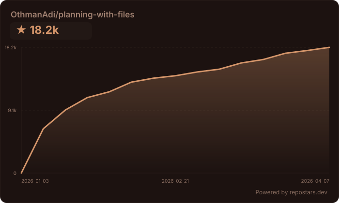

<div align="center">

</div>

# Planning with Files

> **像 Manus 一样工作** —— 那家被 Meta 以 **20 亿美元** 收购的 AI 代理公司。

[](https://github.com/OthmanAdi/planning-with-files/issues?q=is%3Aissue+is%3Aclosed)
[](https://skillsplayground.com/skills/othmanadi-planning-with-files-planning-with-files/)
[](https://github.com/OthmanAdi/planning-with-files/pulls?q=is%3Apr+is%3Aclosed)
[](docs/evals.md)
[](docs/evals.md)
[](docs/evals.md)

<details>
<summary><strong>💬 作者的话</strong></summary>

感谢每一位为本项目点赞、Fork 和分享的人。这个项目在不到 24 小时内就爆发式增长，社区的支持令人难以置信。

如果这个技能能帮助你更高效地工作，那正是我所期望的。

</details>

<details open>
<summary><strong>🌍 看看社区构建了什么</strong></summary>

| Fork | 作者 | 特性 |
|------|------|------|
| [devis](https://github.com/st01cs/devis) | [@st01cs](https://github.com/st01cs) | 面试优先工作流，`/devis:intv` 和 `/devis:impl` 命令，保证激活 |
| [multi-manus-planning](https://github.com/kmichels/multi-manus-planning) | [@kmichels](https://github.com/kmichels) | 多项目支持，SessionStart git 同步 |
| [plan-cascade](https://github.com/Taoidle/plan-cascade) | [@Taoidle](https://github.com/Taoidle) | 多层级任务编排，并行执行，多代理协作 |
| [agentfund-skill](https://github.com/RioTheGreat-ai/agentfund-skill) | [@RioTheGreat-ai](https://github.com/RioTheGreat-ai) | 基于 Base 的 AI 代理众筹，采用按里程碑释放的托管机制 |
| [openclaw-github-repo-commander](https://github.com/wd041216-bit/openclaw-github-repo-commander) | [@wd041216-bit](https://github.com/wd041216-bit) | 7 阶段 GitHub 仓库审计、优化和清理工作流（适用于 OpenClaw） |

*做了新东西？[提交 Issue](https://github.com/OthmanAdi/planning-with-files/issues) 以加入列表！*

</details>

<details>
<summary><strong>🤝 贡献者</strong></summary>

在 [CONTRIBUTORS.md](./CONTRIBUTORS.md) 中查看所有为本项目做出贡献的完整列表。

</details>

<details>
<summary><strong>📦 版本发布与会话恢复</strong></summary>

### 当前版本：v2.29.0

| 版本 | 亮点 |
|------|------|
| **v2.29.0** | 分析工作流模板：`--template analytics` 标志用于数据探索会话（感谢 @mvanhorn！） |
| **v2.28.0** | 繁体中文 (zh-TW) 技能变体（感谢 @waynelee2048！） |
| **v2.26.2** | 修复：hook 命令中的 `---` 导致 YAML frontmatter 解析错误，hooks 现在能正确注册 |
| **v2.26.1** | 修复：`/clear` 后的会话恢复，Windows 路径清理 + 内容注入（感谢 @tony-stark-eth！） |
| **v2.26.0** | IDE 审计：Factory hooks、Copilot errorOccurred hook、Gemini hooks，bug 修复 |
| **v2.18.2** | Mastra Code hooks 修复（hooks.json + 文档准确性） |
| **v2.18.1** | Copilot 乱码问题完全修复 |
| **v2.18.0** | BoxLite 沙箱运行时集成 |
| **v2.17.0** | Mastra Code 支持 + 所有 IDE SKILL.md 规范修复 |
| **v2.16.1** | Copilot 乱码修复：PS1 UTF-8 编码 + bash ensure_ascii（感谢 @Hexiaopi！） |
| **v2.16.0** | GitHub Copilot hooks 支持（感谢 @lincolnwan！） |
| **v2.27.0** | Kiro Agent Skill 布局（感谢 @EListenX！） |
| **v2.15.1** | 会话恢复误报修复（感谢 @gydx6！） |
| **v2.15.0** | `/plan:status` 命令，OpenCode 兼容性修复 |
| **v2.14.0** | Pi Agent 支持，OpenClaw 文档更新，Codex 路径修复 |
| **v2.11.0** | `/plan` 命令，支持更便捷的自动补全 |
| **v2.10.0** | Kiro steering 文件支持 |
| **v2.7.0** | Gemini CLI 支持 |
| **v2.2.0** | 会话恢复，Windows PowerShell，操作系统感知 hooks |

[查看所有版本](https://github.com/OthmanAdi/planning-with-files/releases) · [更新日志](CHANGELOG.md)

> 🧪 **实验性：** 隔离并行规划（`.planning/{uuid}/` 文件夹）正在 [`experimental/isolated-planning`](https://github.com/OthmanAdi/planning-with-files/tree/experimental/isolated-planning) 分支上测试。欢迎试用并分享反馈！

---

### 会话恢复

当你的上下文填满并执行 `/clear` 时，此技能会**自动恢复**你之前的会话。

**工作原理：**
1. 检查 `~/.claude/projects/` 中是否有之前的会话数据
2. 查找规划文件最后更新的时间
3. 提取之后发生的对话（可能丢失的上下文）
4. 显示追赶报告，方便你同步状态

**提示：** 禁用自动压缩，以便在清理前尽可能利用上下文：
```json
{ "autoCompact": false }
```

</details>

<details>
<summary><strong>🛠️ 支持的 IDE（16+ 平台）</strong></summary>

#### 增强支持（hooks + 生命周期自动化）

这些 IDE 具有专用的 hook 配置，可在工具使用前自动重新读取你的计划、提醒你更新进度，并在停止前验证完成状态：

| IDE | 安装指南 | 集成方式 |
|-----|---------|---------|
| Claude Code | [安装](docs/installation.md) | Plugin + SKILL.md + Hooks |
| Cursor | [Cursor 设置](docs/cursor.md) | Skills + [hooks.json](https://cursor.com/docs/hooks) |
| GitHub Copilot | [Copilot 设置](docs/copilot.md) | [Hooks](https://docs.github.com/en/copilot/reference/hooks-configuration)（含 errorOccurred） |
| Mastra Code | [Mastra 设置](docs/mastra.md) | Skills + [Hooks](https://mastra.ai/docs/mastra-code/configuration) |
| Gemini CLI | [Gemini 设置](docs/gemini.md) | Skills + [Hooks](https://geminicli.com/docs/hooks/) |
| Kiro | [Kiro 设置](docs/kiro.md) | [Agent Skills](https://kiro.dev/docs/skills/) |
| Codex | [Codex 设置](docs/codex.md) | [Skills + Hooks](https://developers.openai.com/codex/skills) |
| CodeBuddy | [CodeBuddy 设置](docs/codebuddy.md) | [Skills + Hooks](https://www.codebuddy.ai/docs/cli/skills) |
| FactoryAI Droid | [Factory 设置](docs/factory.md) | [Skills + Hooks](https://docs.factory.ai/cli/configuration/skills) |
| OpenCode | [OpenCode 设置](docs/opencode.md) | Skills + 自定义会话存储 |

#### 标准 Agent Skills 支持

这些 IDE 实现了 [Agent Skills](https://agentskills.io) 开放规范。使用 `npx skills add` 安装 —— 安装程序会自动将技能放置到每个 IDE 的发现路径中：

| IDE | 安装指南 | 技能发现路径 |
|-----|---------|------------|
| Continue | [Continue 设置](docs/continue.md) | `.continue/skills/` + [.prompt 文件](https://docs.continue.dev/customize/deep-dives/prompts) |
| Pi Agent | [Pi Agent 设置](docs/pi-agent.md) | `.pi/skills/`（[npm 包](https://www.npmjs.com/package/@mariozechner/pi-coding-agent)） |
| OpenClaw | [OpenClaw 设置](docs/openclaw.md) | `.openclaw/skills/`（[文档](https://docs.openclaw.ai/tools/skills)） |
| Antigravity | [Antigravity 设置](docs/antigravity.md) | `.agent/skills/`（[文档](https://codelabs.developers.google.com/getting-started-with-antigravity-skills)） |
| Kilocode | [Kilocode 设置](docs/kilocode.md) | `.kilocode/skills/`（[文档](https://kilo.ai/docs/agent-behavior/skills)） |
| AdaL CLI (Sylph AI) | [AdaL 设置](docs/adal.md) | `.adal/skills/`（[文档](https://docs.sylph.ai/features/plugins-and-skills)） |

> **注意：** 如果你的 IDE 使用旧版 Rules 系统而非 Skills，请参阅 [`legacy-rules-support`](https://github.com/OthmanAdi/planning-with-files/tree/legacy-rules-support) 分支。

</details>

<details>
<summary><strong>🧱 沙箱运行时（1 个平台）</strong></summary>

| 运行时 | 状态 | 指南 | 备注 |
|--------|------|------|------|
| BoxLite | ✅ 已文档化 | [BoxLite 设置](docs/boxlite.md) | 在硬件隔离的微型 VM 中运行 Claude Code + planning-with-files |

> **注意：** BoxLite 是沙箱运行时，不是 IDE。技能通过 [ClaudeBox](https://github.com/boxlite-ai/claudebox) 加载 —— BoxLite 的官方 Claude Code 集成层。

</details>

---

一个 Claude Code 插件，将你的工作流转变为使用持久化 markdown 文件进行规划、进度跟踪和知识存储 —— 正是让 Manus 价值数十亿美元的同一模式。

[](https://opensource.org/licenses/MIT)
[](https://code.claude.com/docs/en/plugins)
[](https://code.claude.com/docs/en/skills)
[](https://docs.cursor.com/context/skills)
[](https://kilo.ai/docs/agent-behavior/skills)
[](https://geminicli.com/docs/cli/skills/)
[](https://openclaw.ai)
[](https://kiro.dev/docs/skills/)
[](https://docs.sylph.ai/features/plugins-and-skills)
[](https://pi.dev)
[](https://docs.github.com/en/copilot/reference/hooks-configuration)
[](https://code.mastra.ai)
[](https://boxlite.ai)
[](https://github.com/OthmanAdi/planning-with-files/releases)
[](https://getskillcheck.com)

## 快速安装

```bash
npx skills add OthmanAdi/planning-with-files --skill planning-with-files -g
```

中文简体版：
```bash
npx skills add OthmanAdi/planning-with-files --skill planning-with-files-zh -g
```

繁體中文版：
```bash
npx skills add OthmanAdi/planning-with-files --skill planning-with-files-zht -g
```

适用于 Claude Code、Cursor、Codex、Gemini CLI 及 40+ 支持 [Agent Skills](https://agentskills.io) 规范的代理。

<details>
<summary><strong>🔧 Claude Code 插件（高级功能）</strong></summary>

如需 Claude Code 专属功能，如 `/plan` 自动补全命令：

```
/plugin marketplace add OthmanAdi/planning-with-files
/plugin install planning-with-files@planning-with-files
```

</details>

现在在 Claude Code 中使用以下命令之一：

| 命令 | 自动补全 | 描述 |
|------|---------|------|
| `/planning-with-files:plan` | 输入 `/plan` | 开始规划会话（v2.11.0+） |
| `/planning-with-files:status` | 输入 `/plan:status` | 一目了然地查看规划进度（v2.15.0+） |
| `/planning-with-files:start` | 输入 `/planning` | 原始启动命令 |

**替代方案：** 如果你想要 `/planning-with-files`（不带前缀），将技能复制到本地文件夹：

**macOS/Linux：**
```bash
cp -r ~/.claude/plugins/cache/planning-with-files/planning-with-files/*/skills/planning-with-files ~/.claude/skills/
```

**Windows (PowerShell)：**
```powershell
Copy-Item -Recurse -Path "$env:USERPROFILE\.claude\plugins\cache\planning-with-files\planning-with-files\*\skills\planning-with-files" -Destination "$env:USERPROFILE\.claude\skills\"
```

所有安装方法请参阅 [docs/installation.md](docs/installation.md)。

## 为什么需要这个技能？

2025 年 12 月 29 日，[Meta 以 20 亿美元收购了 Manus](https://techcrunch.com/2025/12/29/meta-just-bought-manus-an-ai-startup-everyone-has-been-talking-about/)。仅用 8 个月，Manus 就从发布走到了 1 亿美元以上营收。他们的秘诀？**上下文工程**。

> "Markdown 是我在磁盘上的'工作记忆'。由于我迭代式地处理信息，且活跃上下文有限，Markdown 文件充当了笔记的草稿本、进度的检查点、最终交付物的构建模块。"
> — Manus AI

## 问题所在

Claude Code（以及大多数 AI 代理）存在以下问题：

- **易失性记忆** — TodoWrite 工具在上下文重置后会消失
- **目标漂移** — 在 50+ 次工具调用后，原始目标逐渐被遗忘
- **错误隐藏** — 失败未被跟踪，导致同样的错误反复出现
- **上下文堆积** — 所有内容都塞进上下文，而非持久化存储

## 解决方案：3 文件模式

对于每个复杂任务，创建三个文件：

```
task_plan.md      → 跟踪阶段和进度
findings.md       → 存储研究和发现
progress.md       → 会话日志和测试结果
```

### 核心原则

```
上下文窗口 = RAM（易失的、有限的）
文件系统 = 磁盘（持久的、无限的）

→ 任何重要的内容都写入磁盘。
```

## Manus 原则

| 原则 | 实现方式 |
|------|---------|
| 文件系统即记忆 | 存储在文件中，而非上下文中 |
| 注意力引导 | 在决策前重新读取计划（hooks） |
| 错误持久化 | 在计划文件中记录失败 |
| 目标跟踪 | 复选框显示进度 |
| 完成验证 | Stop hook 检查所有阶段 |

## 使用方式

安装后，AI 代理将：

1. 如果没有提供描述，**询问你的任务**
2. 在项目目录中**创建 `task_plan.md`、`findings.md` 和 `progress.md`**
3. 在重大决策前**重新读取计划**（通过 PreToolUse hook）
4. 在文件写入后**提醒你**更新状态（通过 PostToolUse hook）
5. **将发现存储**在 `findings.md` 中，而非塞进上下文
6. **记录错误**以供将来参考
7. 在停止前**验证完成状态**（通过 Stop hook）

调用方式：
- `/planning-with-files:plan` - 输入 `/plan` 在自动补全中找到（v2.11.0+）
- `/planning-with-files:start` - 输入 `/planning` 在自动补全中找到
- `/planning-with-files` - 仅在你将技能复制到 `~/.claude/skills/` 时可用

完整的 5 步指南请参阅 [docs/quickstart.md](docs/quickstart.md)。

## 基准测试结果

使用 Anthropic 的 [skill-creator](https://github.com/anthropics/skills/tree/main/skills/skill-creator) 框架（v2.22.0）进行了正式评估。10 个并行子代理，5 种任务类型，30 个客观可验证的断言，3 次盲测 A/B 对比。

| 测试 | 使用技能 | 不使用技能 |
|------|---------|-----------|
| 通过率（30 个断言） | **96.7%**（29/30） | 6.7%（2/30） |
| 遵循 3 文件模式 | 5/5 次评估 | 0/5 次评估 |
| 盲测 A/B 胜出 | **3/3（100%）** | 0/3 |
| 平均评分 | **10.0/10** | 6.8/10 |

[完整方法论和结果](docs/evals.md) · [技术文章](docs/article.md)

## 核心规则

1. **先创建计划** — 永远不要在没有 `task_plan.md` 的情况下开始
2. **2 步操作规则** — 每进行 2 次查看/浏览操作后保存发现
3. **记录所有错误** — 它们有助于避免重复
4. **绝不重复失败** — 跟踪尝试，调整策略

## 适用场景

**在以下场景使用此模式：**
- 多步骤任务（3 步以上）
- 研究任务
- 构建/创建项目
- 跨越多次工具调用的任务

**以下场景可跳过：**
- 简单问答
- 单文件编辑
- 快速查找

## 文件结构

```
planning-with-files/
├── commands/                # Plugin commands
│   ├── plan.md              # /planning-with-files:plan command (v2.11.0+)
│   └── start.md             # /planning-with-files:start command
├── templates/               # Root-level templates (for CLAUDE_PLUGIN_ROOT)
├── scripts/                 # Root-level scripts (for CLAUDE_PLUGIN_ROOT)
├── docs/                    # Documentation
│   ├── installation.md
│   ├── quickstart.md
│   ├── workflow.md
│   ├── troubleshooting.md
│   ├── gemini.md            # Gemini CLI setup
│   ├── cursor.md
│   ├── windows.md
│   ├── kilocode.md
│   ├── codex.md
│   ├── opencode.md
│   ├── mastra.md             # Mastra Code setup
│   └── boxlite.md            # BoxLite sandbox setup
├── examples/                # Integration examples
│   └── boxlite/             # BoxLite quickstart
│       ├── README.md
│       └── quickstart.py
├── planning-with-files/     # Plugin skill folder
│   ├── SKILL.md
│   ├── templates/
│   └── scripts/
├── skills/                  # Legacy skill folder
│   └── planning-with-files/
│       ├── SKILL.md
│       ├── examples.md
│       ├── reference.md
│       ├── templates/
│       └── scripts/
│           ├── init-session.sh
│           ├── check-complete.sh
│           ├── init-session.ps1   # Windows PowerShell
│           └── check-complete.ps1 # Windows PowerShell
├── .gemini/                 # Gemini CLI skills + hooks
│   ├── settings.json        # Hook configuration (v2.26.0)
│   ├── hooks/               # Hook scripts (SessionStart, BeforeTool, AfterTool, BeforeModel, SessionEnd)
│   └── skills/
│       └── planning-with-files/
├── .codex/                  # Codex CLI skills + hooks
│   └── skills/
├── .opencode/               # OpenCode skills (custom session storage)
│   └── skills/
├── .claude-plugin/          # Plugin manifest
├── .cursor/                 # Cursor skills + hooks
│   ├── hooks.json           # Hook configuration
│   ├── hooks/               # Hook scripts (bash + PowerShell)
│   └── skills/
├── .codebuddy/              # CodeBuddy skills + hooks
│   └── skills/
├── .factory/                # FactoryAI Droid skills + hooks (v2.26.0)
│   └── skills/
├── .pi/                     # Pi Agent skills (npm package)
│   └── skills/
│       └── planning-with-files/
├── .continue/               # Continue.dev skills + prompt files
│   ├── prompts/             # .prompt file for slash commands
│   └── skills/
├── .github/                 # GitHub Copilot hooks (incl. errorOccurred)
│   └── hooks/
│       ├── planning-with-files.json  # Hook configuration
│       └── scripts/         # Hook scripts (bash + PowerShell)
├── .mastracode/             # Mastra Code skills + hooks
│   └── skills/
├── CHANGELOG.md
├── LICENSE
└── README.md
```

## 文档

所有平台设置指南和文档在 [docs/](./docs/) 文件夹中。

## 致谢

- **Manus AI** — 开创上下文工程模式
- **Anthropic** — 提供 Claude Code、Agent Skills 和插件系统
- **Lance Martin** — 详细的 Manus 架构分析
- 基于 [Context Engineering for AI Agents](https://manus.im/blog/Context-Engineering-for-AI-Agents-Lessons-from-Building-Manus)

## 贡献

欢迎贡献！请按以下步骤：
1. Fork 本仓库
2. 创建功能分支
3. 提交 Pull Request

## 许可证

MIT 许可证 —— 可自由使用、修改和分发。

---

**作者：** [Ahmad Othman Ammar Adi](https://github.com/OthmanAdi)

## Star 历史

<a href="https://repostars.dev/?repos=OthmanAdi%2Fplanning-with-files&theme=copper"></a>
