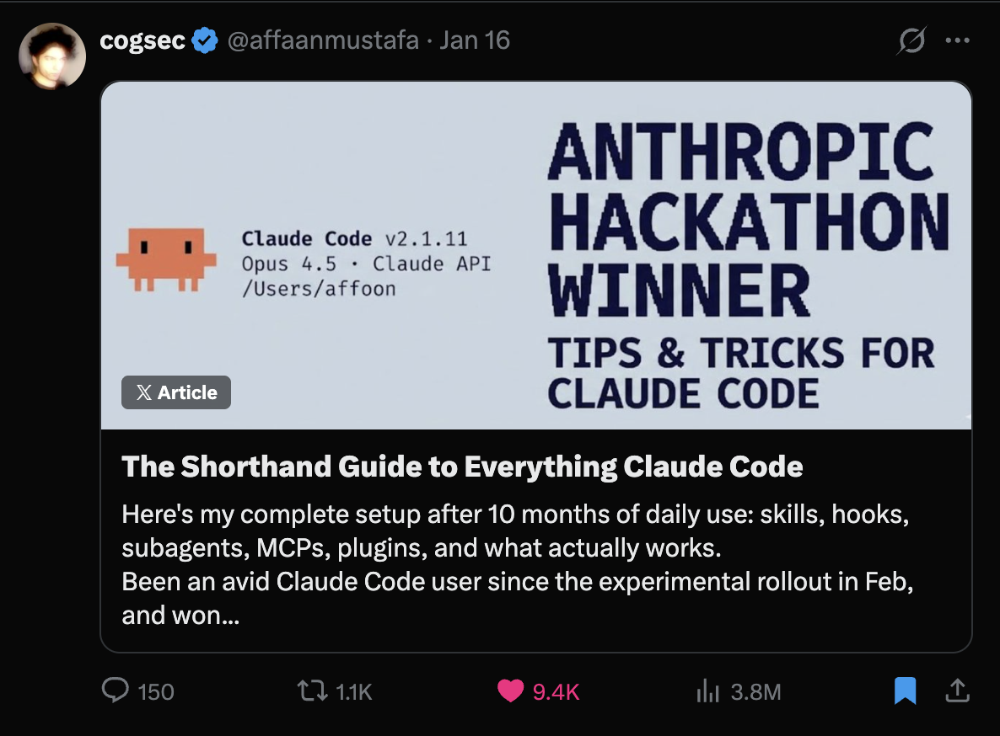
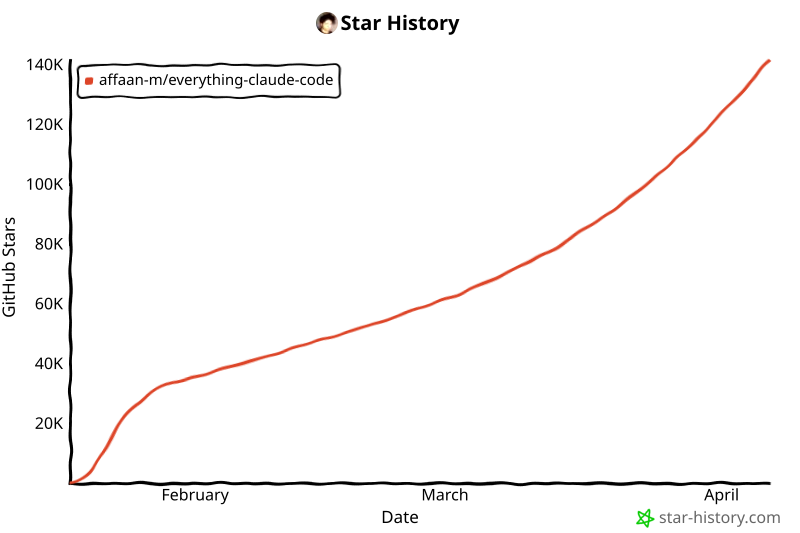

**语言：** 英语 | [Português (Brasil)](docs/pt-BR/README.md) | [简体中文](README.zh-CN.md) | [繁體中文](docs/zh-TW/README.md) | [日本語](docs/ja-JP/README.md) | [한국어](docs/ko-KR/README.md) | [Türkçe](docs/tr/README.md)

# Everything Claude Code

[](https://github.com/affaan-m/everything-claude-code/stargazers)
[](https://github.com/affaan-m/everything-claude-code/network/members)
[](https://github.com/affaan-m/everything-claude-code/graphs/contributors)
[](https://www.npmjs.com/package/ecc-universal)
[](https://www.npmjs.com/package/ecc-agentshield)
[](https://github.com/marketplace/ecc-tools)
[](LICENSE)


> **140K+ stars** | **21K+ forks** | **170+ 贡献者** | **12+ 语言生态** | **Anthropic Hackathon 获胜者**

---

<div align="center">

**Language / 语言 / 語言 / Dil**

[**English**](README.md) | [Português (Brasil)](docs/pt-BR/README.md) | [简体中文](README.zh-CN.md) | [繁體中文](docs/zh-TW/README.md) | [日本語](docs/ja-JP/README.md) | [한국어](docs/ko-KR/README.md)
 | [Türkçe](docs/tr/README.md)

</div>

---

**面向 AI agent harness 的性能优化系统。来自一位 Anthropic 黑客松获胜者。**

不只是配置文件，而是一整套完整系统：技能、直觉、记忆优化、持续学习、安全扫描，以及研究优先的开发方式。这里包含可用于生产环境的 agents、skills、hooks、rules、MCP 配置，以及经过 10 个多月高强度日常实战迭代而来的 legacy command shims，用来构建真实产品。

可运行于 **Claude Code**、**Codex**、**Cursor**、**OpenCode**、**Gemini** 以及其他 AI agent harness。

---

## 指南

这个仓库只包含原始代码。所有内容的解释都在指南里。

<table>
<tr>
<td width="33%">
<a href="https://x.com/affaanmustafa/status/2012378465664745795">

</a>
</td>
<td width="33%">
<a href="https://x.com/affaanmustafa/status/2014040193557471352">

</a>
</td>
<td width="33%">
<a href="https://x.com/affaanmustafa/status/2033263813387223421">

</a>
</td>
</tr>
<tr>
<td align="center"><b>速查指南</b><br/>安装、基础与理念。<b>请先读这个。</b></td>
<td align="center"><b>长篇指南</b><br/>Token 优化、记忆持久化、eval、并行化。</td>
<td align="center"><b>安全指南</b><br/>攻击向量、沙箱、清洗、CVE、AgentShield。</td>
</tr>
</table>

| 主题 | 你将学到什么 |
|-------|-------------------|
| Token 优化 | 模型选择、系统提示瘦身、后台进程 |
| 记忆持久化 | 自动跨会话保存/加载上下文的 hooks |
| 持续学习 | 从会话中自动提取模式并沉淀为可复用技能 |
| 验证循环 | checkpoint 与持续 eval、grader 类型、pass@k 指标 |
| 并行化 | Git worktrees、级联方法、何时扩展实例 |
| Subagent 编排 | 上下文问题、迭代式检索模式 |

---

## 最新内容

### v1.10.0 — 界面刷新、操作员工作流与 ECC 2.0 Alpha（2026 年 4 月）

- **对外呈现已与线上仓库同步**：元数据、目录计数、插件清单和面向安装的文档现在都与实际 OSS 对外呈现一致：38 个 agents、156 个 skills，以及 72 个 legacy command shims。
- **操作员与对外工作流扩展**：`brand-voice`、`social-graph-ranker`、`connections-optimizer`、`customer-billing-ops`、`ecc-tools-cost-audit`、`google-workspace-ops`、`project-flow-ops` 和 `workspace-surface-audit` 补齐了 operator 这条能力线。
- **媒体与发布工具链**：`manim-video`、`remotion-video-creation` 以及升级后的社交发布界面，让技术讲解与产品发布内容成为同一系统的一部分。
- **框架与产品界面持续增长**：`nestjs-patterns`、更丰富的 Codex/OpenCode 安装界面，以及扩展后的跨 harness 打包方式，让这个仓库不再局限于 Claude Code。
- **ECC 2.0 alpha 已进入仓库**：`ecc2/` 中的 Rust 控制平面原型现在可以在本地构建，并提供 `dashboard`、`start`、`sessions`、`status`、`stop`、`resume` 和 `daemon` 命令。它已经可作为 alpha 使用，但还不是通用正式版。
- **生态加固**：AgentShield、ECC Tools 成本控制、账单门户工作以及网站刷新，都继续围绕核心插件交付，而没有漂移成彼此孤立的项目。

### v1.9.0 — 选择性安装与语言扩展（2026 年 3 月）

- **选择性安装架构**：基于 manifest 的安装流水线，使用 `install-plan.js` 和 `install-apply.js` 实现定向组件安装。状态存储会跟踪已安装内容，并支持增量更新。
- **6 个新 agent**：`typescript-reviewer`、`pytorch-build-resolver`、`java-build-resolver`、`java-reviewer`、`kotlin-reviewer`、`kotlin-build-resolver` 将语言覆盖扩展到 10 种语言。
- **新技能**：`pytorch-patterns` 用于深度学习工作流，`documentation-lookup` 用于 API 参考研究，`bun-runtime` 和 `nextjs-turbopack` 面向现代 JS 工具链，外加 8 个运维领域技能和 `mcp-server-patterns`。
- **会话与状态基础设施**：基于 SQLite 的状态存储与查询 CLI，结构化记录的 session adapters，以及可自我改进技能的 skill evolution 基础。
- **编排系统重构**：Harness 审计评分改为确定性结果，编排状态与 launcher 兼容性得到加固，并通过 5 层防护阻止 observer loop。
- **Observer 可靠性**：修复了内存膨胀问题，加入节流与尾部采样；修复沙箱访问；补充 lazy-start 逻辑和重入保护。
- **12 个语言生态**：新增 Java、PHP、Perl、Kotlin/Android/KMP、C++ 和 Rust 规则，加入现有的 TypeScript、Python、Go 及通用规则。
- **社区贡献**：韩语与中文翻译、biome hook 优化、视频处理技能、运营技能、PowerShell 安装器、Antigravity IDE 支持。
- **CI 加固**：修复 19 个测试失败，加入目录计数强制校验、安装 manifest 校验，并让完整测试套件全部通过。

### v1.8.0 — Harness 性能系统（2026 年 3 月）

- **以 harness 为核心的版本**：ECC 现在被明确定位为 agent harness 性能系统，而不只是一个配置包。
- **Hook 可靠性重构**：SessionStart 根回退、Stop 阶段会话摘要，以及用脚本式 hooks 取代脆弱的内联单行命令。
- **Hook 运行时控制**：`ECC_HOOK_PROFILE=minimal|standard|strict` 与 `ECC_DISABLED_HOOKS=...`，无需编辑 hook 文件即可按运行时开关。
- **新的 harness 命令**：`/harness-audit`、`/loop-start`、`/loop-status`、`/quality-gate`、`/model-route`。
- **NanoClaw v2**：模型路由、技能热加载、会话分支/搜索/导出/压缩/指标。
- **跨 harness 一致性**：在 Claude Code、Cursor、OpenCode 与 Codex app/CLI 之间进一步收紧行为一致性。
- **997 项内部测试通过**：hook/runtime 重构与兼容性更新后，完整测试套件全绿。

### v1.7.0 — 跨平台扩展与演示文稿构建器（2026 年 2 月）

- **Codex app + CLI 支持**：直接基于 `AGENTS.md` 的 Codex 支持、安装器目标以及 Codex 文档
- **`frontend-slides` 技能**：零依赖 HTML 演示文稿构建器，包含 PPTX 转换指导与严格的视口适配规则
- **5 个新的通用商业/内容技能**：`article-writing`、`content-engine`、`market-research`、`investor-materials`、`investor-outreach`
- **更广的工具覆盖**：加强了 Cursor、Codex 与 OpenCode 支持，使同一仓库可以干净地运行于所有主要 harness
- **992 项内部测试**：在插件、hooks、skills 和打包方面扩展了校验与回归覆盖

### v1.6.0 — Codex CLI、AgentShield 与 Marketplace（2026 年 2 月）

- **Codex CLI 支持**：新的 `/codex-setup` 命令会生成 `codex.md`，用于兼容 OpenAI Codex CLI
- **7 个新技能**：`search-first`、`swift-actor-persistence`、`swift-protocol-di-testing`、`regex-vs-llm-structured-text`、`content-hash-cache-pattern`、`cost-aware-llm-pipeline`、`skill-stocktake`
- **AgentShield 集成**：`/security-scan` 技能可直接从 Claude Code 运行 AgentShield；1282 项测试，102 条规则
- **GitHub Marketplace**：ECC Tools GitHub App 已上线 [github.com/marketplace/ecc-tools](https://github.com/marketplace/ecc-tools)，提供免费/专业/企业套餐
- **合并了 30+ 个社区 PR**：来自 30 位贡献者，涵盖 6 种语言
- **978 项内部测试**：扩展了对 agents、skills、commands、hooks 和 rules 的验证套件

### v1.4.1 — Bug 修复（2026 年 2 月）

- **修复 instinct 导入时内容丢失**：`parse_instinct_file()` 在 `/instinct-import` 期间，会在 frontmatter 后静默丢弃所有内容（Action、Evidence、Examples 部分）。([#148](https://github.com/affaan-m/everything-claude-code/issues/148), [#161](https://github.com/affaan-m/everything-claude-code/pull/161))

### v1.4.0 — 多语言规则、安装向导与 PM2（2026 年 2 月）

- **交互式安装向导**：新的 `configure-ecc` 技能提供带 merge/overwrite 检测的引导式安装
- **PM2 与多 agent 编排**：新增 6 个命令（`/pm2`、`/multi-plan`、`/multi-execute`、`/multi-backend`、`/multi-frontend`、`/multi-workflow`），用于管理复杂的多服务工作流
- **多语言规则架构**：规则从扁平文件重构为 `common/` + `typescript/` + `python/` + `golang/` 目录。只安装你需要的语言
- **中文（zh-CN）翻译**：完整翻译全部 agents、commands、skills 和 rules（80+ 文件）
- **GitHub Sponsors 支持**：可通过 GitHub Sponsors 赞助项目
- **增强的 CONTRIBUTING.md**：为每种贡献类型提供详细 PR 模板

### v1.3.0 — OpenCode 插件支持（2026 年 2 月）

- **完整 OpenCode 集成**：12 个 agents、24 个 commands、16 个 skills，并通过 OpenCode 的插件系统支持 hooks（20+ 事件类型）
- **3 个原生自定义工具**：run-tests、check-coverage、security-audit
- **LLM 文档**：`llms.txt`，用于完整 OpenCode 文档

### v1.2.0 — 统一命令与技能（2026 年 2 月）

- **Python/Django 支持**：Django patterns、安全、TDD 与验证技能
- **Java Spring Boot 技能**：面向 Spring Boot 的 patterns、安全、TDD 与验证
- **会话管理**：`/sessions` 命令用于查看会话历史
- **持续学习 v2**：基于 instinct 的学习系统，支持置信度评分、导入/导出、演化

完整更新日志见 [Releases](https://github.com/affaan-m/everything-claude-code/releases)。

---

## 快速开始

在 2 分钟内完成安装并开始使用：

### 第 1 步：安装插件

> 注意：插件安装方式更方便，但如果你的 Claude Code 构建版本在解析自托管 marketplace 条目时有问题，下面的 OSS 安装器仍然是最可靠的路径。

```bash
# Add marketplace
/plugin marketplace add https://github.com/affaan-m/everything-claude-code

# Install plugin
/plugin install ecc@ecc
```

### 第 2 步：安装 Rules（必需）

> 警告：**重要：** Claude Code 插件不能自动分发 `rules`。请手动安装：

```bash
# Clone the repo first
git clone https://github.com/affaan-m/everything-claude-code.git
cd everything-claude-code

# Install dependencies (pick your package manager)
npm install        # or: pnpm install | yarn install | bun install

# macOS/Linux

# Recommended: install everything (full profile)
./install.sh --profile full

# Or install for specific languages only
./install.sh typescript    # or python or golang or swift or php
# ./install.sh typescript python golang swift php
# ./install.sh --target cursor typescript
# ./install.sh --target antigravity typescript
# ./install.sh --target gemini --profile full
```

```powershell
# Windows PowerShell

# Recommended: install everything (full profile)
.\install.ps1 --profile full

# Or install for specific languages only
.\install.ps1 typescript   # or python or golang or swift or php
# .\install.ps1 typescript python golang swift php
# .\install.ps1 --target cursor typescript
# .\install.ps1 --target antigravity typescript
# .\install.ps1 --target gemini --profile full

# npm-installed compatibility entrypoint also works cross-platform
npx ecc-install typescript
```

有关手动安装的说明，请参阅 `rules/` 文件夹中的 README。手动复制规则时，请复制整个语言目录（例如 `rules/common` 或 `rules/golang`），而不是其中的文件，这样相对引用才能保持有效，文件名也不会冲突。

### 第 3 步：开始使用

```bash
# Skills are the primary workflow surface.
# Existing slash-style command names still work while ECC migrates off commands/.

# Plugin install uses the namespaced form
/ecc:plan "Add user authentication"

# Manual install keeps the shorter slash form:
# /plan "Add user authentication"

# Check available commands
/plugin list ecc@ecc
```

**就这样！** 你现在已经可以使用 47 个 agents、181 个 skills 和 79 个 legacy command shims。

### 多模型命令需要额外设置

> 警告：`multi-*` 命令**不**包含在上面的基础 plugin/rules 安装中。
>
> 若要使用 `/multi-plan`、`/multi-execute`、`/multi-backend`、`/multi-frontend` 和 `/multi-workflow`，你还必须安装 `ccg-workflow` 运行时。
>
> 使用 `npx ccg-workflow` 初始化。
>
> 该运行时会提供这些命令所依赖的外部依赖，包括：
> - `~/.claude/bin/codeagent-wrapper`
> - `~/.claude/.ccg/prompts/*`
>
> 没有 `ccg-workflow`，这些 `multi-*` 命令将无法正常运行。

---

## 跨平台支持

该插件现已完整支持 **Windows、macOS 和 Linux**，并与主流 IDE（Cursor、OpenCode、Antigravity）和 CLI harness 深度集成。所有 hooks 与脚本都已重写为 Node.js，以获得最大兼容性。

### 包管理器检测

插件会按照以下优先级自动检测你偏好的包管理器（npm、pnpm、yarn 或 bun）：

1. **环境变量**：`CLAUDE_PACKAGE_MANAGER`
2. **项目配置**：`.claude/package-manager.json`
3. **package.json**：`packageManager` 字段
4. **锁文件**：从 package-lock.json、yarn.lock、pnpm-lock.yaml 或 bun.lockb 检测
5. **全局配置**：`~/.claude/package-manager.json`
6. **回退**：第一个可用的包管理器

设置你偏好的包管理器：

```bash
# Via environment variable
export CLAUDE_PACKAGE_MANAGER=pnpm

# Via global config
node scripts/setup-package-manager.js --global pnpm

# Via project config
node scripts/setup-package-manager.js --project bun

# Detect current setting
node scripts/setup-package-manager.js --detect
```

或者在 Claude Code 中使用 `/setup-pm` 命令。

### Hook 运行时控制

使用运行时标志调整严格程度，或临时禁用某些 hooks：

```bash
# Hook strictness profile (default: standard)
export ECC_HOOK_PROFILE=standard

# Comma-separated hook IDs to disable
export ECC_DISABLED_HOOKS="pre:bash:tmux-reminder,post:edit:typecheck"
```

---

## 包含内容

这个仓库是一个 **Claude Code 插件**，你可以直接安装，也可以手动复制组件。

```
everything-claude-code/
|-- .claude-plugin/   # 插件与 marketplace 清单
|   |-- plugin.json         # 插件元数据与组件路径
|   |-- marketplace.json    # 用于 /plugin marketplace add 的 marketplace 目录
|
|-- agents/           # 36 个用于委派的专用 subagents
|   |-- planner.md           # 功能实现规划
|   |-- architect.md         # 系统设计决策
|   |-- tdd-guide.md         # 测试驱动开发
|   |-- code-reviewer.md     # 质量与安全审查
|   |-- security-reviewer.md # 漏洞分析
|   |-- build-error-resolver.md
|   |-- e2e-runner.md        # Playwright E2E 测试
|   |-- refactor-cleaner.md  # 死代码清理
|   |-- doc-updater.md       # 文档同步
|   |-- docs-lookup.md       # 文档/API 查询
|   |-- chief-of-staff.md    # 沟通分流与草稿撰写
|   |-- loop-operator.md     # 自主循环执行
|   |-- harness-optimizer.md # Harness 配置调优
|   |-- cpp-reviewer.md      # C++ 代码审查
|   |-- cpp-build-resolver.md # C++ 构建错误处理
|   |-- go-reviewer.md       # Go 代码审查
|   |-- go-build-resolver.md # Go 构建错误处理
|   |-- python-reviewer.md   # Python 代码审查
|   |-- database-reviewer.md # Database/Supabase 审查
|   |-- typescript-reviewer.md # TypeScript/JavaScript 代码审查
|   |-- java-reviewer.md     # Java/Spring Boot 代码审查
|   |-- java-build-resolver.md # Java/Maven/Gradle 构建错误
|   |-- kotlin-reviewer.md   # Kotlin/Android/KMP 代码审查
|   |-- kotlin-build-resolver.md # Kotlin/Gradle 构建错误
|   |-- rust-reviewer.md     # Rust 代码审查
|   |-- rust-build-resolver.md # Rust 构建错误处理
|   |-- pytorch-build-resolver.md # PyTorch/CUDA 训练错误
|
|-- skills/           # 工作流定义与领域知识
|   |-- coding-standards/           # 语言最佳实践
|   |-- clickhouse-io/              # ClickHouse 分析、查询、数据工程
|   |-- backend-patterns/           # API、数据库、缓存模式
|   |-- frontend-patterns/          # React、Next.js 模式
|   |-- frontend-slides/            # HTML 幻灯片与 PPTX-to-web 演示工作流（新增）
|   |-- article-writing/            # 按给定语气进行长文写作，避免通用 AI 腔（新增）
|   |-- content-engine/             # 多平台社交内容与改写复用工作流（新增）
|   |-- market-research/            # 带来源归因的市场、竞品与投资人研究（新增）
|   |-- investor-materials/         # 路演 deck、one-pager、memo 与财务模型（新增）
|   |-- investor-outreach/          # 个性化融资触达与后续跟进（新增）
|   |-- continuous-learning/        # 从会话中自动提取模式（长篇指南）
|   |-- continuous-learning-v2/     # 基于 instinct 的学习与置信度评分
|   |-- iterative-retrieval/        # 面向 subagent 的渐进式上下文精炼
|   |-- strategic-compact/          # 手动 compact 建议（长篇指南）
|   |-- tdd-workflow/               # TDD 方法论
|   |-- security-review/            # 安全检查清单
|   |-- eval-harness/               # 验证循环评估（长篇指南）
|   |-- verification-loop/          # 持续验证（长篇指南）
|   |-- videodb/                   # 视频和音频：导入、搜索、编辑、生成、流式处理（新增）
|   |-- golang-patterns/            # Go 习惯用法与最佳实践
|   |-- golang-testing/             # Go 测试模式、TDD、基准测试
|   |-- cpp-coding-standards/         # 基于 C++ Core Guidelines 的 C++ 编码规范（新增）
|   |-- cpp-testing/                # 使用 GoogleTest、CMake/CTest 的 C++ 测试（新增）
|   |-- django-patterns/            # Django 模式、models、views（新增）
|   |-- django-security/            # Django 安全最佳实践（新增）
|   |-- django-tdd/                 # Django TDD 工作流（新增）
|   |-- django-verification/        # Django 验证循环（新增）
|   |-- laravel-patterns/           # Laravel 架构模式（新增）
|   |-- laravel-security/           # Laravel 安全最佳实践（新增）
|   |-- laravel-tdd/                # Laravel TDD 工作流（新增）
|   |-- laravel-verification/       # Laravel 验证循环（新增）
|   |-- python-patterns/            # Python 习惯用法与最佳实践（新增）
|   |-- python-testing/             # 使用 pytest 的 Python 测试（新增）
|   |-- springboot-patterns/        # Java Spring Boot 模式（新增）
|   |-- springboot-security/        # Spring Boot 安全（新增）
|   |-- springboot-tdd/             # Spring Boot TDD（新增）
|   |-- springboot-verification/    # Spring Boot 验证（新增）
|   |-- configure-ecc/              # 交互式安装向导（新增）
|   |-- security-scan/              # AgentShield 安全审计集成（新增）
|   |-- java-coding-standards/     # Java 编码规范（新增）
|   |-- jpa-patterns/              # JPA/Hibernate 模式（新增）
|   |-- postgres-patterns/         # PostgreSQL 优化模式（新增）
|   |-- nutrient-document-processing/ # 使用 Nutrient API 的文档处理（新增）
|   |-- docs/examples/project-guidelines-template.md  # 项目专用 skills 模板
|   |-- database-migrations/         # 迁移模式（Prisma、Drizzle、Django、Go）（新增）
|   |-- api-design/                  # REST API 设计、分页、错误响应（新增）
|   |-- deployment-patterns/         # CI/CD、Docker、健康检查、回滚（新增）
|   |-- docker-patterns/            # Docker Compose、网络、卷、容器安全（新增）
|   |-- e2e-testing/                 # Playwright E2E 模式与 Page Object Model（新增）
|   |-- content-hash-cache-pattern/  # 用于文件处理的 SHA-256 内容哈希缓存（新增）
|   |-- cost-aware-llm-pipeline/     # LLM 成本优化、模型路由、预算跟踪（新增）
|   |-- regex-vs-llm-structured-text/ # 决策框架：文本解析该用 regex 还是 LLM（新增）
|   |-- swift-actor-persistence/     # 使用 actors 实现线程安全的 Swift 数据持久化（新增）
|   |-- swift-protocol-di-testing/   # 基于协议的依赖注入，提升 Swift 代码可测性（新增）
|   |-- search-first/               # 先研究再编码的工作流（新增）
|   |-- skill-stocktake/            # 审计 skills 和 commands 的质量（新增）
|   |-- liquid-glass-design/         # iOS 26 Liquid Glass 设计系统（新增）
|   |-- foundation-models-on-device/ # Apple 端侧 LLM 与 FoundationModels（新增）
|   |-- swift-concurrency-6-2/       # Swift 6.2 Approachable Concurrency（新增）
|   |-- perl-patterns/             # 现代 Perl 5.36+ 习惯用法与最佳实践（新增）
|   |-- perl-security/             # Perl 安全模式、taint 模式、安全 I/O（新增）
|   |-- perl-testing/              # 使用 Test2::V0、prove、Devel::Cover 的 Perl TDD（新增）
|   |-- autonomous-loops/           # 自主循环模式：顺序流水线、PR 循环、DAG 编排（新增）
|   |-- plankton-code-quality/      # 使用 Plankton hooks 在编写阶段强制代码质量（新增）
|
|-- commands/         # 传统 slash 入口 shim；优先使用 skills/
|   |-- tdd.md              # /tdd - 测试驱动开发
|   |-- plan.md             # /plan - 实现规划
|   |-- e2e.md              # /e2e - 生成 E2E 测试
|   |-- code-review.md      # /code-review - 质量审查
|   |-- build-fix.md        # /build-fix - 修复构建错误
|   |-- refactor-clean.md   # /refactor-clean - 删除死代码
|   |-- learn.md            # /learn - 会话中途提取模式（长篇指南）
|   |-- learn-eval.md       # /learn-eval - 提取、评估并保存模式（新增）
|   |-- checkpoint.md       # /checkpoint - 保存验证状态（长篇指南）
|   |-- verify.md           # /verify - 运行验证循环（长篇指南）
|   |-- setup-pm.md         # /setup-pm - 配置包管理器
|   |-- go-review.md        # /go-review - Go 代码审查（新增）
|   |-- go-test.md          # /go-test - Go TDD 工作流（新增）
|   |-- go-build.md         # /go-build - 修复 Go 构建错误（新增）
|   |-- skill-create.md     # /skill-create - 根据 git 历史生成 skills（新增）
|   |-- instinct-status.md  # /instinct-status - 查看已学到的 instincts（新增）
|   |-- instinct-import.md  # /instinct-import - 导入 instincts（新增）
|   |-- instinct-export.md  # /instinct-export - 导出 instincts（新增）
|   |-- evolve.md           # /evolve - 将 instincts 聚类为 skills
|   |-- prune.md            # /prune - 删除过期的待处理 instincts（新增）
|   |-- pm2.md              # /pm2 - PM2 服务生命周期管理（新增）
|   |-- multi-plan.md       # /multi-plan - 多 agent 任务拆解（新增）
|   |-- multi-execute.md    # /multi-execute - 编排式多 agent 工作流（新增）
|   |-- multi-backend.md    # /multi-backend - 后端多服务编排（新增）
|   |-- multi-frontend.md   # /multi-frontend - 前端多服务编排（新增）
|   |-- multi-workflow.md   # /multi-workflow - 通用多服务工作流（新增）
|   |-- orchestrate.md      # /orchestrate - 多 agent 协同
|   |-- sessions.md         # /sessions - 会话历史管理
|   |-- eval.md             # /eval - 按标准进行评估
|   |-- test-coverage.md    # /test-coverage - 测试覆盖率分析
|   |-- update-docs.md      # /update-docs - 更新文档
|   |-- update-codemaps.md  # /update-codemaps - 更新 codemaps
|   |-- python-review.md    # /python-review - Python 代码审查（新增）
|
|-- rules/            # 必须始终遵循的指南（复制到 ~/.claude/rules/）
|   |-- README.md            # 结构概览与安装指南
|   |-- common/              # 与语言无关的原则
|   |   |-- coding-style.md    # 不可变性、文件组织
|   |   |-- git-workflow.md    # Commit 格式、PR 流程
|   |   |-- testing.md         # TDD、80% 覆盖率要求
|   |   |-- performance.md     # 模型选择、上下文管理
|   |   |-- patterns.md        # 设计模式、骨架项目
|   |   |-- hooks.md           # Hook 架构、TodoWrite
|   |   |-- agents.md          # 何时委派给 subagents
|   |   |-- security.md        # 强制性安全检查
|   |-- typescript/          # TypeScript/JavaScript 专用
|   |-- python/              # Python 专用
|   |-- golang/              # Go 专用
|   |-- swift/               # Swift 专用
|   |-- php/                 # PHP 专用（新增）
|
|-- hooks/            # 基于触发器的自动化
|   |-- README.md                 # Hook 文档、配方与自定义指南
|   |-- hooks.json                # 所有 hooks 配置（PreToolUse、PostToolUse、Stop 等）
|   |-- memory-persistence/       # 会话生命周期 hooks（长篇指南）
|   |-- strategic-compact/        # compact 建议（长篇指南）
|
|-- scripts/          # 跨平台 Node.js 脚本（新增）
|   |-- lib/                     # 共享工具
|   |   |-- utils.js             # 跨平台文件/路径/系统工具
|   |   |-- package-manager.js   # 包管理器检测与选择
|   |-- hooks/                   # Hook 实现
|   |   |-- session-start.js     # 会话开始时加载上下文
|   |   |-- session-end.js       # 会话结束时保存状态
|   |   |-- pre-compact.js       # compact 前保存状态
|   |   |-- suggest-compact.js   # 战略性 compact 建议
|   |   |-- evaluate-session.js  # 从会话中提取模式
|   |-- setup-package-manager.js # 交互式 PM 设置
|
|-- tests/            # 测试套件（新增）
|   |-- lib/                     # Library 测试
|   |-- hooks/                   # Hook 测试
|   |-- run-all.js               # 运行全部测试
|
|-- contexts/         # 动态系统提示注入上下文（长篇指南）
|   |-- dev.md              # 开发模式上下文
|   |-- review.md           # 代码审查模式上下文
|   |-- research.md         # 研究/探索模式上下文
|
|-- examples/         # 示例配置与会话
|   |-- CLAUDE.md             # 项目级配置示例
|   |-- user-CLAUDE.md        # 用户级配置示例
|   |-- saas-nextjs-CLAUDE.md   # 真实 SaaS（Next.js + Supabase + Stripe）
|   |-- go-microservice-CLAUDE.md # 真实 Go 微服务（gRPC + PostgreSQL）
|   |-- django-api-CLAUDE.md      # 真实 Django REST API（DRF + Celery）
|   |-- laravel-api-CLAUDE.md     # 真实 Laravel API（PostgreSQL + Redis）（新增）
|   |-- rust-api-CLAUDE.md        # 真实 Rust API（Axum + SQLx + PostgreSQL）（新增）
|
|-- mcp-configs/      # MCP server 配置
|   |-- mcp-servers.json    # GitHub、Supabase、Vercel、Railway 等
|
|-- marketplace.json  # 自托管 marketplace 配置（用于 /plugin marketplace add）
```

---

## 生态工具

### 技能生成器

有两种方式可以从你的仓库生成 Claude Code skills：

#### 选项 A：本地分析（内置）

使用 `/skill-create` 命令进行本地分析，无需外部服务：

```bash
/skill-create                    # Analyze current repo
/skill-create --instincts        # Also generate instincts for continuous-learning
```

它会在本地分析你的 git 历史，并生成 SKILL.md 文件。

#### 选项 B：GitHub App（高级）

如果你需要高级能力（10k+ commits、自动 PR、团队共享）：

[Install GitHub App](https://github.com/apps/skill-creator) | [ecc.tools](https://ecc.tools)

```bash
# Comment on any issue:
/skill-creator analyze

# Or auto-triggers on push to default branch
```

两种方式都会创建：
- **SKILL.md 文件** - 可直接用于 Claude Code 的技能
- **Instinct collections** - 供 continuous-learning-v2 使用
- **Pattern extraction** - 从你的提交历史中学习模式

### AgentShield — 安全审计器

> 构建于 Claude Code Hackathon（Cerebral Valley x Anthropic，2026 年 2 月）。1282 项测试，98% 覆盖率，102 条静态分析规则。

扫描你的 Claude Code 配置中的漏洞、错误配置和注入风险。

```bash
# Quick scan (no install needed)
npx ecc-agentshield scan

# Auto-fix safe issues
npx ecc-agentshield scan --fix

# Deep analysis with three Opus 4.6 agents
npx ecc-agentshield scan --opus --stream

# Generate secure config from scratch
npx ecc-agentshield init
```

**扫描内容：** CLAUDE.md、settings.json、MCP 配置、hooks、agent 定义以及 skills，覆盖 5 个类别：secret 检测（14 种模式）、权限审计、hook 注入分析、MCP server 风险画像，以及 agent 配置审查。

**`--opus` 标志**会以红队/蓝队/审计员流水线运行 3 个 Claude Opus 4.6 agents。攻击方寻找可利用链路，防守方评估防护措施，审计员综合两者给出带优先级的风险评估。这是对抗式推理，而不只是模式匹配。

**输出格式：** 终端（按颜色分级 A-F）、JSON（CI 流水线）、Markdown、HTML。若发现严重问题，则以退出码 2 作为构建门禁。

在 Claude Code 中使用 `/security-scan` 运行它，或通过 [GitHub Action](https://github.com/affaan-m/agentshield) 接入 CI。

[GitHub](https://github.com/affaan-m/agentshield) | [npm](https://www.npmjs.com/package/ecc-agentshield)

### 持续学习 v2

这个基于 instinct 的学习系统会自动学习你的模式：

```bash
/instinct-status        # Show learned instincts with confidence
/instinct-import <file> # Import instincts from others
/instinct-export        # Export your instincts for sharing
/evolve                 # Cluster related instincts into skills
```

完整文档见 `skills/continuous-learning-v2/`。

---

## 要求

### Claude Code CLI 版本

**最低版本：v2.1.0 或更高**

由于插件系统处理 hooks 的方式发生变化，这个插件需要 Claude Code CLI v2.1.0+。

检查版本：
```bash
claude --version
```

### 重要：Hooks 自动加载行为

> 警告：**贡献者请注意：** 不要在 `.claude-plugin/plugin.json` 中添加 `"hooks"` 字段。仓库中有回归测试会强制保证这一点。

Claude Code v2.1+ 会按约定**自动加载**任何已安装插件中的 `hooks/hooks.json`。如果在 `plugin.json` 里显式声明，就会触发重复检测错误：

```
Duplicate hooks file detected: ./hooks/hooks.json resolves to already-loaded file
```

**历史原因：** 这件事在本仓库中多次引发修复/回退循环（[#29](https://github.com/affaan-m/everything-claude-code/issues/29), [#52](https://github.com/affaan-m/everything-claude-code/issues/52), [#103](https://github.com/affaan-m/everything-claude-code/issues/103)）。Claude Code 不同版本之间的行为变化带来了混淆。现在我们已经添加了回归测试，防止再次引入这个问题。

---

## 安装

### 选项 1：作为插件安装（推荐）

使用这个仓库最简单的方法，就是把它作为 Claude Code 插件安装：

```bash
# Add this repo as a marketplace
/plugin marketplace add https://github.com/affaan-m/everything-claude-code

# Install the plugin
/plugin install ecc@ecc
```

或者直接添加到你的 `~/.claude/settings.json`：

```json
{
  "extraKnownMarketplaces": {
    "ecc": {
      "source": {
        "source": "github",
        "repo": "affaan-m/everything-claude-code"
      }
    }
  },
  "enabledPlugins": {
    "ecc@ecc": true
  }
}
```

这会让你立即获得所有 commands、agents、skills 和 hooks。

> **注意：** Claude Code 插件系统不支持通过插件分发 `rules`（[上游限制](https://code.claude.com/docs/en/plugins-reference)）。你需要手动安装 rules：
>
> ```bash
> # Clone the repo first
> git clone https://github.com/affaan-m/everything-claude-code.git
>
> # Option A: User-level rules (applies to all projects)
> mkdir -p ~/.claude/rules
> cp -r everything-claude-code/rules/common ~/.claude/rules/
> cp -r everything-claude-code/rules/typescript ~/.claude/rules/   # pick your stack
> cp -r everything-claude-code/rules/python ~/.claude/rules/
> cp -r everything-claude-code/rules/golang ~/.claude/rules/
> cp -r everything-claude-code/rules/php ~/.claude/rules/
>
> # Option B: Project-level rules (applies to current project only)
> mkdir -p .claude/rules
> cp -r everything-claude-code/rules/common .claude/rules/
> cp -r everything-claude-code/rules/typescript .claude/rules/     # pick your stack
> ```

---

### 选项 2：手动安装

如果你希望更精细地控制安装内容：

```bash
# Clone the repo
git clone https://github.com/affaan-m/everything-claude-code.git

# Copy agents to your Claude config
cp everything-claude-code/agents/*.md ~/.claude/agents/

# Copy rules directories (common + language-specific)
mkdir -p ~/.claude/rules
cp -r everything-claude-code/rules/common ~/.claude/rules/
cp -r everything-claude-code/rules/typescript ~/.claude/rules/   # pick your stack
cp -r everything-claude-code/rules/python ~/.claude/rules/
cp -r everything-claude-code/rules/golang ~/.claude/rules/
cp -r everything-claude-code/rules/php ~/.claude/rules/

# Copy skills first (primary workflow surface)
# Recommended (new users): core/general skills only
cp -r everything-claude-code/.agents/skills/* ~/.claude/skills/
cp -r everything-claude-code/skills/search-first ~/.claude/skills/

# Optional: add niche/framework-specific skills only when needed
# for s in django-patterns django-tdd laravel-patterns springboot-patterns; do
# cp -r everything-claude-code/skills/$s ~/.claude/skills/
# done

# Optional: keep legacy slash-command compatibility during migration
mkdir -p ~/.claude/commands
cp everything-claude-code/commands/*.md ~/.claude/commands/
```

#### 将 hooks 添加到 settings.json

把 `hooks/hooks.json` 中的 hooks 复制到你的 `~/.claude/settings.json`。

#### 配置 MCP

把 `mcp-configs/mcp-servers.json` 中需要的 MCP server 定义复制到 Claude Code 官方配置 `~/.claude/settings.json`，或者如果你想要仓库本地 MCP 访问，则复制到项目级的 `.mcp.json`。

如果你已经运行了自己版本的 ECC 内置 MCP，请设置：

```bash
export ECC_DISABLED_MCPS="github,context7,exa,playwright,sequential-thinking,memory"
```

ECC 管理的安装和 Codex 同步流程将跳过或移除这些捆绑 server，而不是重复添加。

**重要：** 请将 `YOUR_*_HERE` 占位符替换成你自己的 API keys。

---

## 核心概念

### Agents

Subagents 用于处理作用域受限的委派任务。例如：

```markdown
---
name: code-reviewer
description: Reviews code for quality, security, and maintainability
tools: ["Read", "Grep", "Glob", "Bash"]
model: opus
---

You are a senior code reviewer...
```

### Skills

Skills 是主要的工作流入口。它们可以被直接调用、自动建议，并被 agents 复用。ECC 在迁移期间仍然保留 `commands/`，但新的工作流开发应优先落到 `skills/` 中。

```markdown
# TDD Workflow

1. Define interfaces first
2. Write failing tests (RED)
3. Implement minimal code (GREEN)
4. Refactor (IMPROVE)
5. Verify 80%+ coverage
```

### Hooks

Hooks 会在工具事件上触发。例如，提醒你处理 `console.log`：

```json
{
  "matcher": "tool == \"Edit\" && tool_input.file_path matches \"\\\\.(ts|tsx|js|jsx)$\"",
  "hooks": [{
    "type": "command",
    "command": "#!/bin/bash\ngrep -n 'console\\.log' \"$file_path\" && echo '[Hook] Remove console.log' >&2"
  }]
}
```

### Rules

Rules 是必须始终遵循的指导，按 `common/`（与语言无关）+ 各语言专用目录组织：

```
rules/
  common/          # 通用原则（始终安装）
  typescript/      # TS/JS 专用模式与工具
  python/          # Python 专用模式与工具
  golang/          # Go 专用模式与工具
  swift/           # Swift 专用模式与工具
  php/             # PHP 专用模式与工具
```

安装与结构细节见 [`rules/README.md`](rules/README.md)。

---

## 我该用哪个 Agent？

不知道该从哪里开始？用这份速查表。Skills 是规范的工作流界面；下面的 slash 入口是大多数用户已经熟悉的兼容形式。

| 我想要…… | 使用这个命令 | 使用的 Agent |
|--------------|-----------------|------------|
| 规划新功能 | `/ecc:plan "Add auth"` | planner |
| 设计系统架构 | `/ecc:plan` + architect agent | architect |
| 先写测试再写代码 | `/tdd` | tdd-guide |
| 审查我刚写的代码 | `/code-review` | code-reviewer |
| 修复失败的构建 | `/build-fix` | build-error-resolver |
| 运行端到端测试 | `/e2e` | e2e-runner |
| 查找安全漏洞 | `/security-scan` | security-reviewer |
| 删除死代码 | `/refactor-clean` | refactor-cleaner |
| 更新文档 | `/update-docs` | doc-updater |
| 审查 Go 代码 | `/go-review` | go-reviewer |
| 审查 Python 代码 | `/python-review` | python-reviewer |
| 审查 TypeScript/JavaScript 代码 | *(直接调用 `typescript-reviewer`)* | typescript-reviewer |
| 审计数据库查询 | *(自动委派)* | database-reviewer |

### 常见工作流

下面展示 slash 形式，是因为它们仍然是最快、最熟悉的入口。底层上，ECC 正在把这些工作流逐步迁移到 skills-first 定义。

**开始一个新功能：**
```
/ecc:plan "Add user authentication with OAuth"
                                              → planner 创建实现蓝图
/tdd                                          → tdd-guide 强制先写测试
/code-review                                  → code-reviewer 检查你的实现
```

**修复一个 bug：**
```
/tdd                                          → tdd-guide：先写一个失败测试来复现问题
                                              → 实现修复，验证测试通过
/code-review                                  → code-reviewer：捕获回归
```

**准备上线生产环境：**
```
/security-scan                                → security-reviewer：执行 OWASP Top 10 审计
/e2e                                          → e2e-runner：关键用户流程测试
/test-coverage                                → 验证覆盖率达到 80%+
```

---

## FAQ

<details>
<summary><b>如何检查已安装了哪些 agents/commands？</b></summary>

```bash
/plugin list ecc@ecc
```

这会显示插件提供的全部 agents、commands 和 skills。
</details>

<details>
<summary><b>我的 hooks 不工作 / 我看到了 "Duplicate hooks file" 错误</b></summary>

这是最常见的问题。**不要在 `.claude-plugin/plugin.json` 中添加 `"hooks"` 字段。** Claude Code v2.1+ 会自动加载已安装插件中的 `hooks/hooks.json`。显式声明它会导致重复检测错误。参见 [#29](https://github.com/affaan-m/everything-claude-code/issues/29)、[#52](https://github.com/affaan-m/everything-claude-code/issues/52)、[#103](https://github.com/affaan-m/everything-claude-code/issues/103)。
</details>

<details>
<summary><b>我能把 ECC 和运行在自定义 API endpoint 或 model gateway 上的 Claude Code 一起使用吗？</b></summary>

可以。ECC 不会硬编码 Anthropic 托管的传输设置。它通过 Claude Code 正常的本地 CLI/plugin 界面运行，因此它适用于：

- Anthropic 托管的 Claude Code
- 使用 `ANTHROPIC_BASE_URL` 和 `ANTHROPIC_AUTH_TOKEN` 的官方 Claude Code gateway 部署
- 能够兼容 Claude Code 所期望 Anthropic API 协议的自定义 endpoint

最小示例：

```bash
export ANTHROPIC_BASE_URL=https://your-gateway.example.com
export ANTHROPIC_AUTH_TOKEN=your-token
claude
```

如果你的 gateway 重新映射了模型名，请在 Claude Code 中配置，而不是在 ECC 中配置。一旦 `claude` CLI 已经可以工作，ECC 的 hooks、skills、commands 和 rules 就与模型提供方无关。

官方参考：
- [Claude Code LLM gateway docs](https://docs.anthropic.com/en/docs/claude-code/llm-gateway)
- [Claude Code model configuration docs](https://docs.anthropic.com/en/docs/claude-code/model-config)

</details>

<details>
<summary><b>我的 context window 在缩小 / Claude 的上下文快耗尽了</b></summary>

MCP server 过多会吃掉你的上下文。每个 MCP 工具描述都会消耗你 200k 窗口中的 token，可能把可用上下文压缩到大约 70k。

**修复方式：** 按项目禁用未使用的 MCP：
```json
// In your project's .claude/settings.json
{
  "disabledMcpServers": ["supabase", "railway", "vercel"]
}
```

保持启用的 MCP 少于 10 个，激活工具少于 80 个。
</details>

<details>
<summary><b>我能只使用其中一部分组件吗（比如只用 agents）？</b></summary>

可以。使用选项 2（手动安装），只复制你需要的内容：

```bash
# Just agents
cp everything-claude-code/agents/*.md ~/.claude/agents/

# Just rules
mkdir -p ~/.claude/rules/
cp -r everything-claude-code/rules/common ~/.claude/rules/
```

每个组件都是完全独立的。
</details>

<details>
<summary><b>它支持 Cursor / OpenCode / Codex / Antigravity 吗？</b></summary>

支持。ECC 是跨平台的：
- **Cursor**：`.cursor/` 中提供预先适配的配置。参见 [Cursor IDE 支持](#cursor-ide-支持)。
- **Gemini CLI**：通过 `.gemini/GEMINI.md` 和共享安装器管线，提供实验性的项目本地支持。
- **OpenCode**：`.opencode/` 中提供完整插件支持。参见 [OpenCode 支持](#opencode-支持)。
- **Codex**：对 macOS app 和 CLI 都是一等支持，包含 adapter drift guards 和 SessionStart fallback。参见 PR [#257](https://github.com/affaan-m/everything-claude-code/pull/257)。
- **Antigravity**：对 `.agent/` 中的 workflows、skills 和展平 rules 提供紧密集成的设置。参见 [Antigravity Guide](docs/ANTIGRAVITY-GUIDE.md)。
- **Non-native harnesses**：为 Grok 等类似界面提供手动回退路径。参见 [Manual Adaptation Guide](docs/MANUAL-ADAPTATION-GUIDE.md)。
- **Claude Code**：原生支持，这是主要目标平台。
</details>

<details>
<summary><b>如何贡献新的 skill 或 agent？</b></summary>

参见 [CONTRIBUTING.md](CONTRIBUTING.md)。简版流程如下：
1. Fork 仓库
2. 在 `skills/your-skill-name/SKILL.md` 中创建你的 skill（带 YAML frontmatter）
3. 或者在 `agents/your-agent.md` 中创建一个 agent
4. 提交 PR，并清楚说明它做什么、适用于什么场景
</details>

---

## 运行测试

该插件包含完整的测试套件：

```bash
# Run all tests
node tests/run-all.js

# Run individual test files
node tests/lib/utils.test.js
node tests/lib/package-manager.test.js
node tests/hooks/hooks.test.js
```

---

## 贡献

**欢迎并鼓励贡献。**

这个仓库旨在成为社区资源。如果你有：
- 有用的 agents 或 skills
- 巧妙的 hooks
- 更好的 MCP 配置
- 改进后的 rules

欢迎贡献。详细规范见 [CONTRIBUTING.md](CONTRIBUTING.md)。

### 贡献思路

- 语言专用技能（Rust、C#、Kotlin、Java）—— 已包含 Go、Python、Perl、Swift 和 TypeScript
- 框架专用配置（Rails、FastAPI）—— 已包含 Django、NestJS、Spring Boot 和 Laravel
- DevOps agents（Kubernetes、Terraform、AWS、Docker）
- 测试策略（不同框架、视觉回归）
- 领域知识（ML、数据工程、移动开发）

---

## Cursor IDE 支持

ECC 为 **Cursor IDE 提供完整支持**，包括已适配为 Cursor 原生格式的 hooks、rules、agents、skills、commands 和 MCP 配置。

### 快速开始（Cursor）

```bash
# macOS/Linux
./install.sh --target cursor typescript
./install.sh --target cursor python golang swift php
```

```powershell
# Windows PowerShell
.\install.ps1 --target cursor typescript
.\install.ps1 --target cursor python golang swift php
```

### 包含内容

| 组件 | 数量 | 说明 |
|-----------|-------|---------|
| Hook Events | 15 | sessionStart、beforeShellExecution、afterFileEdit、beforeMCPExecution、beforeSubmitPrompt，以及另外 10 个 |
| Hook Scripts | 16 | 轻量 Node.js 脚本，通过共享 adapter 委派到 `scripts/hooks/` |
| Rules | 34 | 9 个通用（alwaysApply）+ 25 个语言专用（TypeScript、Python、Go、Swift、PHP） |
| Agents | 共享 | 通过根目录 AGENTS.md 共享（Cursor 原生读取） |
| Skills | 共享 + 随附 | 通过根目录 AGENTS.md 以及 `.cursor/skills/` 中的补充翻译内容提供 |
| Commands | 共享 | 若已安装，则位于 `.cursor/commands/` |
| MCP Config | 共享 | 若已安装，则位于 `.cursor/mcp.json` |

### Hook 架构（DRY Adapter Pattern）

Cursor 的 **hook 事件比 Claude Code 更多**（20 vs 8）。`.cursor/hooks/adapter.js` 模块会把 Cursor 的 stdin JSON 转换成 Claude Code 格式，从而复用现有的 `scripts/hooks/*.js`，无需重复实现。

```
Cursor stdin JSON → adapter.js → transforms → scripts/hooks/*.js
                                              (shared with Claude Code)
```

关键 hooks：
- **beforeShellExecution** — 阻止在 tmux 外启动开发服务器（退出码 2），并在 git push 前提醒审查
- **afterFileEdit** — 自动格式化 + TypeScript 检查 + `console.log` 警告
- **beforeSubmitPrompt** — 检测提示词中的 secrets（sk-、ghp_、AKIA 模式）
- **beforeTabFileRead** — 阻止 Tab 读取 .env、.key、.pem 文件（退出码 2）
- **beforeMCPExecution / afterMCPExecution** — MCP 审计日志

### Rules 格式

Cursor rules 使用带有 `description`、`globs` 和 `alwaysApply` 的 YAML frontmatter：

```yaml
---
description: "TypeScript coding style extending common rules"
globs: ["**/*.ts", "**/*.tsx", "**/*.js", "**/*.jsx"]
alwaysApply: false
---
```

---

## Codex macOS App + CLI 支持

ECC 为 Codex 的 macOS app 和 CLI 都提供 **一等支持**，包含参考配置、Codex 专用 AGENTS.md 补充，以及共享技能。

### 快速开始（Codex App + CLI）

```bash
# Run Codex CLI in the repo — AGENTS.md and .codex/ are auto-detected
codex

# Automatic setup: sync ECC assets (AGENTS.md, skills, MCP servers) into ~/.codex
npm install && bash scripts/sync-ecc-to-codex.sh
# or: pnpm install && bash scripts/sync-ecc-to-codex.sh
# or: yarn install && bash scripts/sync-ecc-to-codex.sh
# or: bun install && bash scripts/sync-ecc-to-codex.sh

# Or manually: copy the reference config to your home directory
cp .codex/config.toml ~/.codex/config.toml
```

同步脚本会使用 **只追加（add-only）** 策略，将 ECC MCP servers 安全合并进你现有的 `~/.codex/config.toml`，绝不会删除或修改你已有的 servers。可使用 `--dry-run` 预览改动，或用 `--update-mcp` 强制刷新 ECC servers 到最新推荐配置。

对于 Context7，ECC 使用规范的 Codex 段名 `[mcp_servers.context7]`，同时仍然启动 `@upstash/context7-mcp` 包。如果你已有旧的 `[mcp_servers.context7-mcp]` 条目，`--update-mcp` 会将其迁移到规范段名。

Codex macOS app：
- 将此仓库作为你的 workspace 打开。
- 根目录 `AGENTS.md` 会被自动检测。
- `.codex/config.toml` 和 `.codex/agents/*.toml` 最适合保持为项目本地文件。
- 参考 `.codex/config.toml` 故意不固定 `model` 或 `model_provider`，因此 Codex 会使用它自己的当前默认值，除非你手动覆盖。
- 可选：将 `.codex/config.toml` 复制到 `~/.codex/config.toml` 作为全局默认；多 agent 角色文件建议保持项目本地，除非你也同时复制 `.codex/agents/`。

### 包含内容

| 组件 | 数量 | 说明 |
|-----------|-------|---------|
| Config | 1 | `.codex/config.toml` — 顶层 approvals/sandbox/web_search、MCP servers、通知、profiles |
| AGENTS.md | 2 | 根目录（通用）+ `.codex/AGENTS.md`（Codex 专用补充） |
| Skills | 30 | `.agents/skills/` — 每个 skill 包含 SKILL.md + agents/openai.yaml |
| MCP Servers | 6 | GitHub、Context7、Exa、Memory、Playwright、Sequential Thinking（使用 `--update-mcp` 同步时，含 Supabase 则为 7 个） |
| Profiles | 2 | `strict`（只读沙箱）和 `yolo`（全自动批准） |
| Agent Roles | 3 | `.codex/agents/` — explorer、reviewer、docs-researcher |

### Skills

位于 `.agents/skills/` 的技能会被 Codex 自动加载：

| Skill | 描述 |
|-------|-------------|
| api-design | REST API 设计模式 |
| article-writing | 基于笔记和语气参考进行长文写作 |
| backend-patterns | API 设计、数据库、缓存 |
| brand-voice | 从真实内容中提取写作风格画像 |
| bun-runtime | 将 Bun 用作运行时、包管理器、打包器和测试运行器 |
| claude-api | 面向 Python 和 TypeScript 的 Anthropic Claude API 模式 |
| coding-standards | 通用编码规范 |
| content-engine | 平台原生社交内容与改写复用 |
| crosspost | 跨 X、LinkedIn、Threads 的多平台内容分发 |
| deep-research | 多源研究、综合与来源归因 |
| dmux-workflows | 使用 tmux pane manager 的多 agent 编排 |
| documentation-lookup | 通过 Context7 MCP 获取最新库与框架文档 |
| e2e-testing | Playwright E2E 测试 |
| eval-harness | 以 eval 驱动开发 |
| everything-claude-code | 面向本项目的开发约定与模式 |
| exa-search | 通过 Exa MCP 进行网页、代码、公司研究的神经搜索 |
| fal-ai-media | 用于图像、视频和音频的统一媒体生成 |
| frontend-patterns | React/Next.js 模式 |
| frontend-slides | HTML 演示、PPTX 转换与视觉风格探索 |
| investor-materials | Deck、memo、模型和 one-pager |
| investor-outreach | 个性化触达、跟进和引荐简介 |
| market-research | 带来源归因的市场与竞品研究 |
| mcp-server-patterns | 使用 Node/TypeScript SDK 构建 MCP servers |
| nextjs-turbopack | Next.js 16+ 与 Turbopack 增量打包 |
| security-review | 全面的安全检查清单 |
| strategic-compact | 上下文管理 |
| tdd-workflow | 具备 80%+ 覆盖率要求的测试驱动开发 |
| verification-loop | build、test、lint、typecheck、security |
| video-editing | 使用 FFmpeg 和 Remotion 的 AI 辅助视频编辑工作流 |
| x-api | 用于发帖与分析的 X/Twitter API 集成 |

### 关键限制

Codex **尚未提供与 Claude 风格 hooks 等价的执行能力**。ECC 在这里主要通过 `AGENTS.md`、可选的 `model_instructions_file` 覆盖，以及 sandbox/approval 设置来实现约束。

### 多 Agent 支持

当前 Codex 构建已经支持稳定的多 agent 工作流。

- 在 `.codex/config.toml` 中启用 `features.multi_agent = true`
- 在 `[agents.<name>]` 下定义角色
- 让每个角色指向 `.codex/agents/` 下的一个文件
- 在 CLI 中使用 `/agent` 查看或引导子 agent

ECC 自带 3 个示例角色配置：

| 角色 | 用途 |
|------|---------|
| `explorer` | 在修改前只读收集代码库证据 |
| `reviewer` | 正确性、安全性与缺失测试审查 |
| `docs_researcher` | 在发布或文档变更前验证文档与 API |

---

## OpenCode 支持

ECC 提供 **完整 OpenCode 支持**，包括插件和 hooks。

### 快速开始

```bash
# Install OpenCode
npm install -g opencode

# Run in the repository root
opencode
```

配置会从 `.opencode/opencode.json` 自动检测。

### 功能对齐情况

| 功能 | Claude Code | OpenCode | 状态 |
|---------|-------------|----------|--------|
| Agents | PASS: 47 agents | PASS: 12 agents | **Claude Code 领先** |
| Commands | PASS: 79 commands | PASS: 31 commands | **Claude Code 领先** |
| Skills | PASS: 181 skills | PASS: 37 skills | **Claude Code 领先** |
| Hooks | PASS: 8 event types | PASS: 11 events | **OpenCode 更多！** |
| Rules | PASS: 29 rules | PASS: 13 instructions | **Claude Code 领先** |
| MCP Servers | PASS: 14 servers | PASS: Full | **完整对齐** |
| Custom Tools | PASS: Via hooks | PASS: 6 native tools | **OpenCode 更强** |

### 通过插件支持 Hooks

OpenCode 的插件系统比 Claude Code **更复杂也更强大**，支持 20+ 事件类型：

| Claude Code Hook | OpenCode Plugin Event |
|-----------------|----------------------|
| PreToolUse | `tool.execute.before` |
| PostToolUse | `tool.execute.after` |
| Stop | `session.idle` |
| SessionStart | `session.created` |
| SessionEnd | `session.deleted` |

**OpenCode 的额外事件**：`file.edited`、`file.watcher.updated`、`message.updated`、`lsp.client.diagnostics`、`tui.toast.show` 等。

### 可用的 Slash Entry Shims（31+）

| 命令 | 描述 |
|---------|-------------|
| `/plan` | 创建实现计划 |
| `/tdd` | 强制执行 TDD 工作流 |
| `/code-review` | 审查代码变更 |
| `/build-fix` | 修复构建错误 |
| `/e2e` | 生成 E2E 测试 |
| `/refactor-clean` | 删除死代码 |
| `/orchestrate` | 多 agent 工作流 |
| `/learn` | 从会话中提取模式 |
| `/checkpoint` | 保存验证状态 |
| `/verify` | 运行验证循环 |
| `/eval` | 按标准进行评估 |
| `/update-docs` | 更新文档 |
| `/update-codemaps` | 更新 codemaps |
| `/test-coverage` | 分析覆盖率 |
| `/go-review` | Go 代码审查 |
| `/go-test` | Go TDD 工作流 |
| `/go-build` | 修复 Go 构建错误 |
| `/python-review` | Python 代码审查（PEP 8、类型提示、安全） |
| `/multi-plan` | 多模型协作规划 |
| `/multi-execute` | 多模型协作执行 |
| `/multi-backend` | 偏后端的多模型工作流 |
| `/multi-frontend` | 偏前端的多模型工作流 |
| `/multi-workflow` | 全流程多模型开发工作流 |
| `/pm2` | 自动生成 PM2 服务命令 |
| `/sessions` | 管理会话历史 |
| `/skill-create` | 从 git 生成 skills |
| `/instinct-status` | 查看已学到的 instincts |
| `/instinct-import` | 导入 instincts |
| `/instinct-export` | 导出 instincts |
| `/evolve` | 将 instincts 聚类为 skills |
| `/promote` | 将项目 instincts 提升为全局范围 |
| `/projects` | 列出已知项目与 instinct 统计 |
| `/prune` | 删除已过期的待处理 instincts（30 天 TTL） |
| `/learn-eval` | 在保存前提取并评估模式 |
| `/setup-pm` | 配置包管理器 |
| `/harness-audit` | 审计 harness 可靠性、eval 就绪度与风险态势 |
| `/loop-start` | 启动受控的 agentic loop 执行模式 |
| `/loop-status` | 查看当前 loop 状态与 checkpoints |
| `/quality-gate` | 对路径或整个仓库运行质量门禁检查 |
| `/model-route` | 按复杂度和预算路由模型 |

### 插件安装

**选项 1：直接使用**
```bash
cd everything-claude-code
opencode
```

**选项 2：作为 npm 包安装**
```bash
npm install ecc-universal
```

然后把它添加到你的 `opencode.json`：
```json
{
  "plugin": ["ecc-universal"]
}
```

这个 npm 插件条目会启用 ECC 已发布的 OpenCode 插件模块（hooks/events 和 plugin tools）。
它**不会**自动把 ECC 的完整 command/agent/instruction 目录加入你的项目配置。

如果你想获得完整的 ECC OpenCode 设置，可以：
- 在这个仓库内直接运行 OpenCode，或
- 将捆绑的 `.opencode/` 配置资源复制到你的项目中，并在 `opencode.json` 里连接 `instructions`、`agent` 和 `command` 条目

### 文档

- **迁移指南**：`.opencode/MIGRATION.md`
- **OpenCode Plugin README**：`.opencode/README.md`
- **整合后的 Rules**：`.opencode/instructions/INSTRUCTIONS.md`
- **LLM 文档**：`llms.txt`（提供给 LLM 的完整 OpenCode 文档）

---

## 跨工具功能对齐

ECC 是**第一个尝试把所有主流 AI 编程工具都发挥到极致的插件**。下面是各个 harness 的对比：

| 功能 | Claude Code | Cursor IDE | Codex CLI | OpenCode |
|---------|------------|------------|-----------|----------|
| **Agents** | 47 | 共享（AGENTS.md） | 共享（AGENTS.md） | 12 |
| **Commands** | 79 | 共享 | 基于指令 | 31 |
| **Skills** | 181 | 共享 | 10（原生格式） | 37 |
| **Hook Events** | 8 types | 15 types | None yet | 11 types |
| **Hook Scripts** | 20+ scripts | 16 scripts (DRY adapter) | N/A | Plugin hooks |
| **Rules** | 34 (common + lang) | 34 (YAML frontmatter) | Instruction-based | 13 instructions |
| **Custom Tools** | Via hooks | Via hooks | N/A | 6 native tools |
| **MCP Servers** | 14 | 共享（mcp.json） | 7（通过 TOML 解析器自动合并） | 完整支持 |
| **Config Format** | settings.json | hooks.json + rules/ | config.toml | opencode.json |
| **Context File** | CLAUDE.md + AGENTS.md | AGENTS.md | AGENTS.md | AGENTS.md |
| **Secret Detection** | Hook-based | beforeSubmitPrompt hook | Sandbox-based | Hook-based |
| **Auto-Format** | PostToolUse hook | afterFileEdit hook | N/A | file.edited hook |
| **Version** | Plugin | Plugin | Reference config | 1.10.0 |

**关键架构决策：**
- **根目录 AGENTS.md** 是通用跨工具文件（4 个工具都会读取）
- **DRY adapter pattern** 让 Cursor 可以无重复地复用 Claude Code 的 hook 脚本
- **Skills 格式**（带 YAML frontmatter 的 SKILL.md）可跨 Claude Code、Codex 和 OpenCode 使用
- Codex 缺少 hooks 的问题，由 `AGENTS.md`、可选 `model_instructions_file` 覆盖和 sandbox 权限进行弥补

---

## 背景

我从 Claude Code 的实验性发布阶段起就一直在用它。在 2025 年 9 月与 [@DRodriguezFX](https://x.com/DRodriguezFX) 一起赢得了 Anthropic x Forum Ventures 黑客松，并完全使用 Claude Code 构建了 [zenith.chat](https://zenith.chat)。

这些配置已经在多个生产应用中经受了实战检验。

---

## Token 优化

如果不管理 token 消耗，使用 Claude Code 的成本会很高。这些设置可以在不牺牲质量的情况下显著降低成本。

### 推荐设置

添加到 `~/.claude/settings.json`：

```json
{
  "model": "sonnet",
  "env": {
    "MAX_THINKING_TOKENS": "10000",
    "CLAUDE_AUTOCOMPACT_PCT_OVERRIDE": "50"
  }
}
```

| 设置 | 默认值 | 推荐值 | 影响 |
|---------|---------|-------------|--------|
| `model` | opus | **sonnet** | 成本约降低 60%；可处理 80%+ 的编码任务 |
| `MAX_THINKING_TOKENS` | 31,999 | **10,000** | 每次请求隐藏思考成本约降低 70% |
| `CLAUDE_AUTOCOMPACT_PCT_OVERRIDE` | 95 | **50** | 更早触发 compact，在长会话中质量更好 |

仅当你需要深入的架构推理时，再切换到 Opus：
```
/model opus
```

### 日常工作流命令

| 命令 | 何时使用 |
|---------|-------------|
| `/model sonnet` | 大多数任务的默认选择 |
| `/model opus` | 复杂架构、调试、深度推理 |
| `/clear` | 不相关任务之间使用（免费、即时重置） |
| `/compact` | 在逻辑任务断点处使用（研究完成、里程碑完成） |
| `/cost` | 在会话中监控 token 开销 |

### 战略性 Compact

`strategic-compact` 技能（本插件内置）会在逻辑断点建议你执行 `/compact`，而不是依赖 95% 上下文占用时的自动 compact。完整决策指南见 `skills/strategic-compact/SKILL.md`。

**适合 compact 的时机：**
- 研究/探索结束后，开始实现之前
- 完成一个里程碑后，开始下一个之前
- 调试完成后，继续功能开发之前
- 一个方案失败后，切换新方案之前

**不适合 compact 的时机：**
- 正在实现过程中（你会丢失变量名、文件路径和部分中间状态）

### 上下文窗口管理

**关键：** 不要一次性启用所有 MCP。每个 MCP 工具描述都会消耗你 200k 窗口中的 token，可能把可用上下文压缩到约 70k。

- 每个项目启用的 MCP 保持在 10 个以内
- 激活工具保持在 80 个以内
- 在项目配置中使用 `disabledMcpServers` 禁用未使用的 MCP

### Agent Teams 成本警告

Agent Teams 会生成多个上下文窗口。每个 teammate 都会独立消耗 token。仅在并行化能带来明确价值的任务中使用（例如多模块工作、并行审查）。对于简单的顺序任务，subagents 的 token 效率更高。

---

## 警告：重要说明

### Token 优化

触发每日额度上限了？请查看 **[Token Optimization Guide](docs/token-optimization.md)** 获取推荐设置与工作流建议。

快速收益：

```json
// ~/.claude/settings.json
{
  "model": "sonnet",
  "env": {
    "MAX_THINKING_TOKENS": "10000",
    "CLAUDE_AUTOCOMPACT_PCT_OVERRIDE": "50",
    "CLAUDE_CODE_SUBAGENT_MODEL": "haiku"
  }
}
```

在不相关任务之间使用 `/clear`，在逻辑断点使用 `/compact`，并用 `/cost` 监控开销。

### 自定义

这些配置适合我的工作流。你应该：
1. 从你认同的部分开始
2. 根据你的技术栈修改
3. 删除你不用的内容
4. 加入你自己的模式

---

## 社区项目

基于或受到 Everything Claude Code 启发的项目：

| 项目 | 说明 |
|---------|-------------|
| [EVC](https://github.com/SaigonXIII/evc) | 营销 agent 工作区，包含 42 个 commands，用于内容运营、品牌治理和多渠道发布。[可视化概览](https://saigonxiii.github.io/evc)。 |

如果你用 ECC 构建了东西，欢迎提 PR 把它加到这里。

---

## 赞助

这个项目是免费开源的。赞助有助于它持续维护和成长。

[**Become a Sponsor**](https://github.com/sponsors/affaan-m) | [Sponsor Tiers](SPONSORS.md) | [Sponsorship Program](SPONSORING.md)

---

## 星标历史

[](https://star-history.com/#affaan-m/everything-claude-code&Date)

---

## 链接

- **速查指南（从这里开始）：** [The Shorthand Guide to Everything Claude Code](https://x.com/affaanmustafa/status/2012378465664745795)
- **长篇指南（进阶）：** [The Longform Guide to Everything Claude Code](https://x.com/affaanmustafa/status/2014040193557471352)
- **安全指南：** [Security Guide](./the-security-guide.md) | [Thread](https://x.com/affaanmustafa/status/2033263813387223421)
- **关注：** [@affaanmustafa](https://x.com/affaanmustafa)

---

## 许可证

MIT - 可自由使用，按需修改，如果可以的话欢迎回馈贡献。

---

**如果这个仓库对你有帮助，请点个 Star。把两份指南都读完。做点厉害的东西。**
