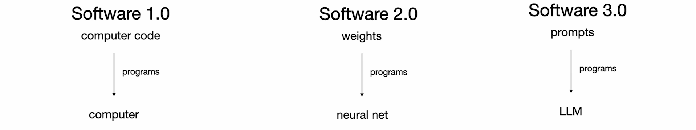
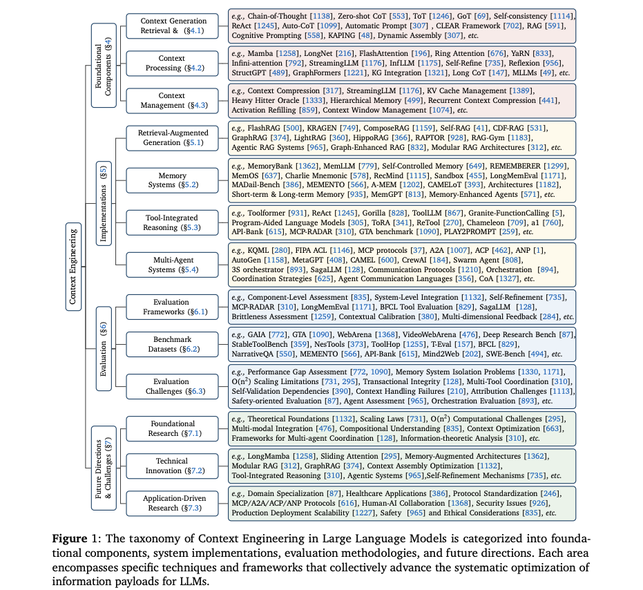
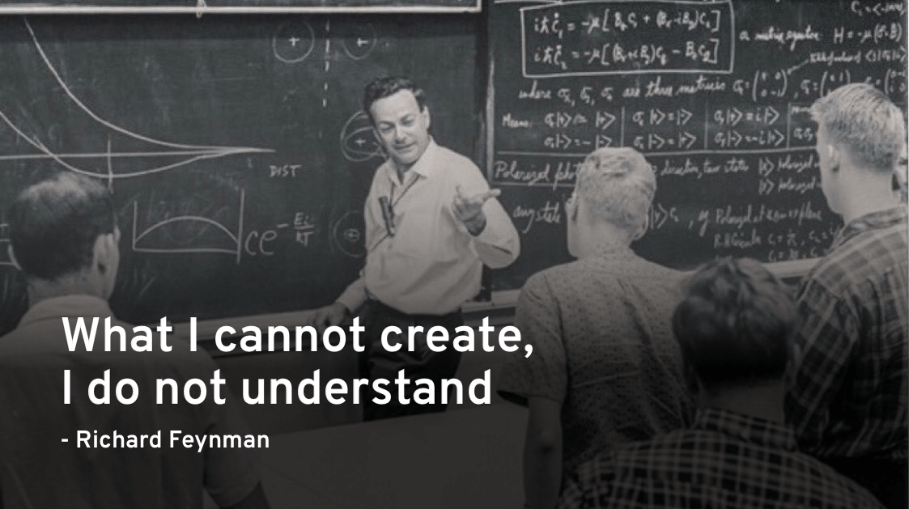
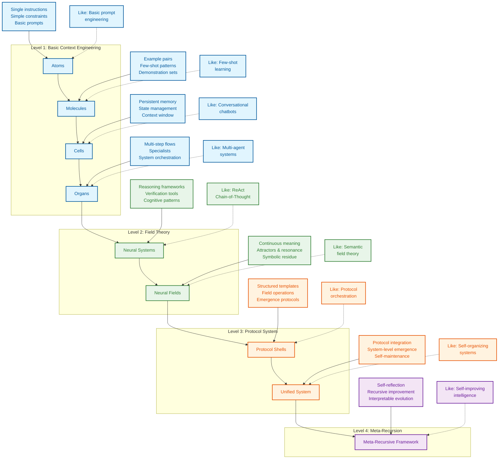
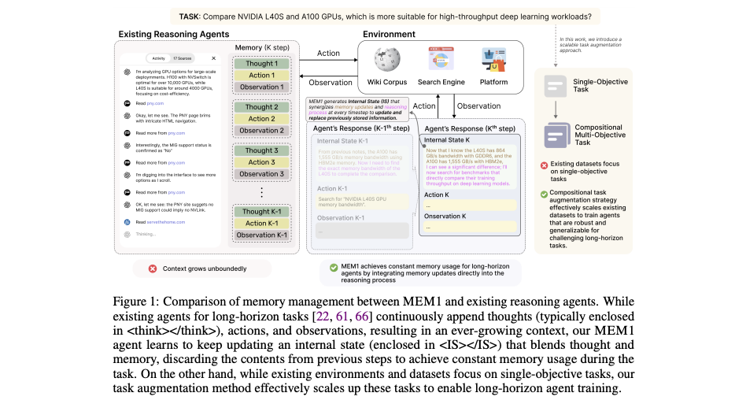
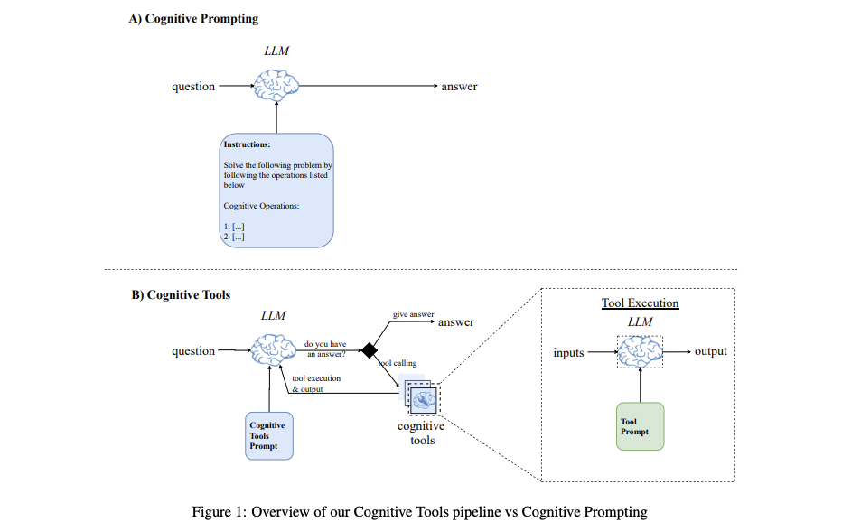
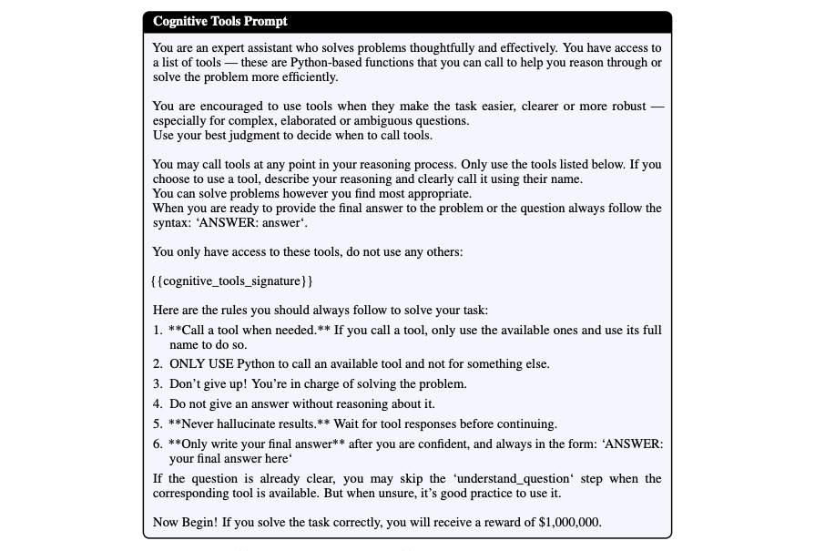
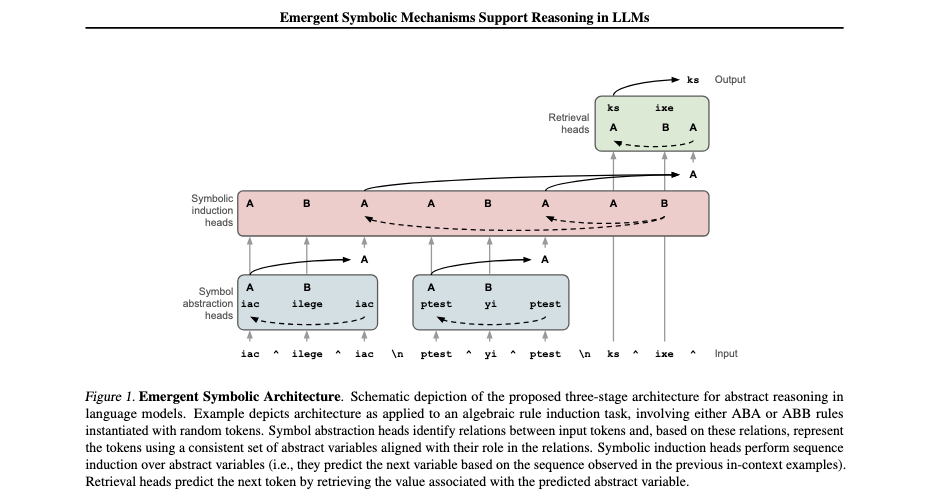
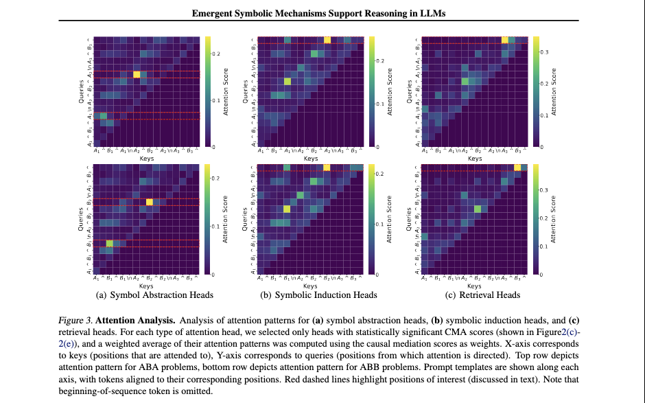
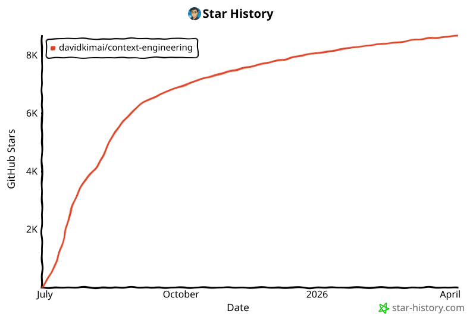

<div align="center">
  
# Context Engineering

</div>


> **"上下文工程是一门精妙的艺术与科学，旨在用恰到好处的信息填充上下文窗口，为下一步做好准备。" — [**Andrej Karpathy**](https://x.com/karpathy/status/1937902205765607626)**
>
> [**Software Is Changing (Again) Talk @YC AI Startup School**](https://www.youtube.com/watch?v=LCEmiRjPEtQ)

<div align="center">
  
## [](https://deepwiki.com/davidkimai/Context-Engineering)



</div>

<div align="center">
  
 ## [DeepGraph](https://www.deepgraph.co/davidkimai/Context-Engineering)
 
## [使用 NotebookLM 聊天 + 播客深度探讨](https://notebooklm.google.com/notebook/0c6e4dc6-9c30-4f53-8e1a-05cc9ff3bc7e)

## [](https://discord.gg/JeFENHNNNQ)

</div>

## [综合课程正在建设中](https://github.com/davidkimai/Context-Engineering/tree/main/00_COURSE)

> ### **[上下文工程综述——1400 篇研究论文回顾](https://arxiv.org/pdf/2507.13334)**
>
> [**Awesome Context Engineering 仓库**](https://github.com/Meirtz/Awesome-Context-Engineering)

将最新研究成果以第一性原理和可视化方式落地实践 —— 2025 年 7 月，来自 ICML、IBM、NeurIPS、OHBM 等

> **"为 GPT-4.1 提供'认知工具'可将其在 AIME2024 上的 pass@1 性能从 26.7% 提升至 43.3%，使其非常接近 o1-preview 的表现。"** — [**IBM Zurich**](https://www.arxiv.org/pdf/2506.12115)

<div align="center">
  
## [`代理命令`](https://github.com/davidkimai/Context-Engineering/tree/main/.claude/commands)
**支持 [Claude Code](https://www.anthropic.com/claude-code) | [OpenCode](https://opencode.ai/) | [Amp](https://sourcegraph.com/amp) | [Kiro](https://kiro.dev/) | [Codex](https://openai.com/codex/) | [Gemini CLI](https://github.com/google-gemini/gemini-cli)**

#### [上下文工程综述——1400 篇研究论文回顾](https://arxiv.org/pdf/2507.13334) | [Context Rot](https://research.trychroma.com/context-rot) | [IBM Zurich](https://www.arxiv.org/pdf/2506.12115) | [量子语义](https://arxiv.org/pdf/2506.10077) | [涌现符号机制 ICML Princeton](https://openreview.net/forum?id=y1SnRPDWx4) | [MEM1 Singapore-MIT](https://arxiv.org/pdf/2506.15841) | [LLM 吸引子 Shanghai AI](https://arxiv.org/pdf/2502.15208?) | [MemOS Shanghai](https://github.com/MemTensor/MemOS) | [潜在推理](https://arxiv.org/pdf/2507.06203) | [动态递归深度](https://arxiv.org/pdf/2507.10524)

</div>

一本前沿的、基于第一性原理的手册，带你超越提示词工程，进入更广泛的上下文设计、编排和优化领域。

```
                    提示词工程          │  上下文工程
                       ↓                │            ↓                      
               "你说什么"              │  "模型看到的其他一切"
             （单条指令）              │    （示例、记忆、检索、
                                        │     工具、状态、控制流）
```

## 上下文工程的定义

> **上下文不仅仅是用户发送给 LLM 的单条提示词。上下文是在推理时提供给 LLM 的完整信息载荷，包含模型为合理完成给定任务所需的所有结构化信息组件。**
>
> — [**来自对 1400+ 篇研究论文系统分析中的上下文工程定义**](https://arxiv.org/pdf/2507.13334)

```
╭─────────────────────────────────────────────────────────────╮
│              上下文工程精通课程                               │
│                    从零到前沿                                │
╰─────────────────────────────────────────────────────────────╯
                          ▲
                          │
                 数学基础
                  C = A(c₁, c₂, ..., cₙ)
                          │
                          ▼
┌─────────────┬──────────────┬──────────────┬─────────────────┐
│ 基础        │ 系统实现      │ 集成         │ 前沿            │
│ (第1-4周)   │ (第5-8周)    │ (第9-10周)   │ (第11-12周)     │
└─────┬───────┴──────┬───────┴──────┬───────┴─────────┬───────┘
      │              │              │                 │
      ▼              ▼              ▼                 ▼
┌─────────────┐ ┌──────────────┐ ┌──────────────┐ ┌──────────────┐
│ 数学模型    │ │ RAG 系统     │ │ 多代理       │ │ 元递归       │
│ 组件        │ │ 记忆架构     │ │ 编排         │ │ 量子语义     │
│ 处理        │ │ 工具集成     │ │ 场论         │ │ 自我改进     │
│ 管理        │ │ 代理系统     │ │ 评估         │ │ 协作         │
└─────────────┘ └──────────────┘ └──────────────┘ └──────────────┘
```

## 为什么创建这个仓库

> **"意义不是语义表达的固有、静态属性，而是一种涌现现象"
— [Agostino et al. — 2025 年 7 月，印第安纳大学](https://arxiv.org/pdf/2506.10077)**

提示词工程曾经吸引了全部注意力，但现在我们可以为接下来的发展感到兴奋。一旦你掌握了提示词，真正的力量来自于对围绕这些提示词的**整个上下文窗口**进行工程化。某种意义上，这就是在引导思维。

本仓库提供了一种渐进式的、基于第一性原理的上下文工程方法，围绕一个生物学隐喻构建：

```
原子 → 分子 → 细胞 → 器官 → 神经系统 → 神经与语义场论
  │        │         │         │             │                         │        
单条      少样本    记忆 +     多代理      认知工具 +      上下文 = 场 +
提示词    学习      代理       协作        操作系统        持久性与共振
```
> "抽象是泛化的代价" — [**Grant Sanderson (3Blue1Brown)**](https://www.3blue1brown.com/)

<div align="center">



*[上下文工程综述 - 2025 年 7 月](https://arxiv.org/pdf/2507.13334)*

  
 **[关于涌现、吸引子和动力系统理论](https://content.csbs.utah.edu/~butner/systems/DynamicalSystemsIntro.html) | [哥伦比亚大学 DST](http://wordpress.ei.columbia.edu/ac4/about/our-approach/dynamical-systems-theory/)**

https://github.com/user-attachments/assets/9f046259-e5ec-4160-8ed0-41a608d8adf3



</div>



## 快速开始

1. **阅读 [`00_foundations/01_atoms_prompting.md`](00_foundations/01_atoms_prompting.md)**（5 分钟）
   理解为什么仅靠提示词往往表现不佳

2. **运行 [`10_guides_zero_to_hero/01_min_prompt.py`](10_guides_zero_to_hero/01_min_prompt.py)**（Jupyter Notebook 风格）
   用最小可用示例进行实验

3. **探索 [`20_templates/minimal_context.yaml`](20_templates/minimal_context.yaml)**
   将模板复制/粘贴到你自己的项目中

4. **学习 [`30_examples/00_toy_chatbot/`](30_examples/00_toy_chatbot/)**
   查看带上下文管理的完整实现

## 学习路径

```
┌─────────────────┐     ┌──────────────────┐     ┌────────────────┐
│ 00_foundations/ │     │ 10_guides_zero_  │     │ 20_templates/  │
│                 │────▶│ to_one/          │────▶│                │
│ 理论与核心概念   │     │ 动手实践          │     │ 可复制粘贴的    │
│                 │     │ 逐步教程          │     │ 代码片段        │
└─────────────────┘     └──────────────────┘     └────────────────┘
         │                                                │
         │                                                │
         ▼                                                ▼
┌─────────────────┐                             ┌────────────────┐
│ 40_reference/   │◀───────────────────────────▶│ 30_examples/   │
│                 │                             │                │
│ 深入探讨与      │                             │ 真实项目，      │
│ 评估手册        │                             │ 逐步进阶        │
└─────────────────┘                             │                │
         ▲                                      └────────────────┘
         │                                                ▲
         │                                                │
         └────────────────────┐               ┌───────────┘
                              ▼               ▼
                         ┌─────────────────────┐
                         │ 50_contrib/         │
                         │                     │
                         │ 社区贡献             │
                         │                     │
                         └─────────────────────┘
```

## 你将学到什么

| 概念 | 是什么 | 为什么重要 |
|------|--------|-----------|
| **Token 预算** | 优化上下文中的每个 token | 更多 token = 更多费用和更慢的响应 |
| **少样本学习** | 通过展示示例来教学 | 通常比单纯解释更有效 |
| **记忆系统** | 在多轮交互间持久化信息 | 实现有状态的、连贯的交互 |
| **检索增强** | 找到并注入相关文档 | 让回复基于事实，减少幻觉 |
| **控制流** | 将复杂任务分解为步骤 | 用更简单的提示词解决更难的问题 |
| **上下文剪枝** | 移除无关信息 | 仅保留对性能必要的内容 |
| **指标与评估** | 衡量上下文有效性 | 迭代优化 token 使用与质量的平衡 |
| **认知工具与提示词编程** | 学习构建自定义工具和模板 | 提示词编程为上下文工程启用新层级 |
| **神经场论** | 将上下文视为神经场 | 将上下文建模为动态神经场支持迭代式上下文更新 |
| **符号机制** | 符号架构实现高阶推理 | 更智能的系统 = 更少的工作 |
| **量子语义** | 意义是观察者依赖的 | 利用叠加态技术设计上下文系统 |

## Karpathy + 3Blue1Brown 启发的风格

> 适合所有经验水平的学习者

1. **第一性原理** —— 从基础上下文开始
2. **渐进叠加** —— 仅添加模型明显缺少的内容
3. **衡量一切** —— token 成本、延迟、质量评分
4. **无情删减** —— 剪枝胜过填充
5. **代码 > 幻灯片** —— 每个概念都有可运行的代码
6. **可视化一切** —— 每个概念都用 ASCII 和符号图进行可视化

# 研究证据
## 记忆 + 推理

### **[MEM1：学习协同记忆与推理以实现高效长时域代理 - Singapore-MIT 2025 年 6 月](https://www.arxiv.org/pdf/2506.15841)**

> "我们的结果证明了推理驱动的记忆整合作为一种可扩展替代方案的前景，用于训练长时域交互代理，在此过程中效率和性能都得到了优化。" — [Singapore-MIT](https://arxiv.org/pdf/2506.15841)



1. **MEM1 训练 AI 代理仅保留重要信息——在每一步合并记忆和推理——因此无论任务多长，它们都不会被信息淹没。**

2. **与堆积无尽的上下文不同，MEM1 将每次交互压缩为紧凑的"内部状态"，就像一张智能笔记被更新而非被重新抄写。**

3. **通过将记忆和思考融合为单一流程，MEM1 学会仅记住必要的要点——使代理更快、更敏锐，并能处理更长的对话。**

4. **代理的每个动作都被标记和结构化，因此每个行动、问题或事实都清晰可审计——不再有黑箱记忆。**

5. **在每个循环中，旧的无用信息被剪枝，仅保留最新、最相关的洞察向前传递，模仿专家问题解决者提炼笔记的方式。**

6. **MEM1 证明了递归的、协议驱动的记忆——即总是精炼和整合——在速度和准确性上都优于传统的"只是添加更多上下文"的方法。**
## 认知工具

### **[用认知工具激发语言模型推理 - IBM Zurich 2025 年 6 月](https://www.arxiv.org/pdf/2506.12115)**

### 提示词和提示词程序作为推理工具调用
> "认知工具"将推理操作封装在 LLM 内部 — [IBM Zurich](https://www.arxiv.org/pdf/2506.12115)



> **这些认知工具（作为工具调用的结构化提示词模板）通过识别当前涉及的主要概念、提取问题中的相关信息，并突出可能有助于解决问题的重要属性、定理和技术，来分解问题。**



> **这些模板搭建了类似于认知心理捷径的推理层级，通常被称为"启发式方法"。**

1. **这项研究表明，将复杂任务分解为模块化的"认知工具"使 AI 能够更有思考性地解决问题——模仿专家人类逐步推理的方式。**

2. **模型不再依赖单一的大提示词，而是调用专门的提示词模板（即认知工具），如"理解问题"、"回忆相关知识"、"检查答案"和"回溯"——每个工具处理一个独特的心理操作。**

3. **认知工具就像内在的心理捷径：AI 在每个阶段选择正确的程序并运行，在执行任务之前规划其推理和后续行动，以获得更高的准确性和灵活性。**

4. **通过将推理步骤隔离为模块化块，这些工具防止混淆、减少错误，并使模型的思考过程透明可审计——即使在困难的数学问题上。**

5. **这种模块化方法同时提升了开源和闭源模型——增强了现实世界的数学问题解决能力，并接近高级 RL 训练的"推理"模型的性能，无需额外训练。**

6. **结果表明，强大推理的种子已经存在于大型语言模型内部——认知工具只是解锁并编排这些能力，提供了一种透明、高效、可解释的方案，以替代黑箱式调优。**
## 涌现符号

## **[涌现符号机制支持大型语言模型中的抽象推理 - ICML Princeton 2025 年 6 月 18 日](https://openreview.net/forum?id=y1SnRPDWx4)**



> **摘要：研究识别出一种三阶段架构，通过一组涌现的符号处理机制支持 LLM 中的抽象推理。**
>
>

**这些包括符号归纳头、符号抽象头和检索头。**

**1. 在早期层中，符号抽象头根据 token 之间的关系将输入 token 转换为抽象变量。**

**2. 在中间层中，符号归纳头对这些抽象变量执行序列归纳。**

**3. 最后，在后期层中，检索头通过检索与预测的抽象变量关联的值来预测下一个 token。**

**这些结果指向符号方法和神经网络方法之间长期辩论的解决方向，表明神经网络中的涌现推理依赖于符号机制的涌现。** — [**ICML Princeton**](https://openreview.net/forum?id=y1SnRPDWx4) 



>
> **为什么有用？**
>
>
> **这解释了为什么 Markdown、JSON 和类似的结构化、符号化格式更容易被 LLM 解析**
>
> **概念：与代理协作，应用分隔符、语法、符号、象征性词语、隐喻和结构，以改善推理时的推理能力、上下文组织、记忆与持久性**

1. **这篇论文证明大型语言模型发展出了自己的内在符号"逻辑电路"——使其能够用抽象变量进行推理，而不仅是表面文字模式。**

2. **LLM 展示了一个三阶段过程：首先从输入中抽象符号，然后对这些变量进行推理，最后将抽象答案映射回真实世界的 token。**

3. **这些涌现机制意味着 LLM 不仅仅是记忆——它们实际上创建了内部的、灵活的表示，使其能够泛化到新问题和类比。**

4. **早期层的注意力头充当"符号提取器"，中间层执行符号推理，后期层检索具体答案——模仿人类的抽象和检索过程。**

5. **通过运行针对性实验和干预，作者表明这些符号过程对于抽象推理既是必要的也是充分的，跨多个模型和任务。**

6. **结果弥合了符号 AI 和神经网络之间的历史鸿沟——表明在大规模下，神经网络可以发明和使用符号机制，支持真正的泛化和推理。**

## Star 历史

[](https://www.star-history.com/#davidkimai/Context-Engineering&Date)

## 贡献

欢迎贡献！请查看 [CONTRIBUTING.md](.github/CONTRIBUTING.md) 了解指南。

## 许可证

[MIT 许可证](LICENSE)

## 引用

```bibtex
@misc{context-engineering,
  author = {Context Engineering Contributors},
  title = {Context Engineering: Beyond Prompt Engineering},
  year = {2025},
  publisher = {GitHub},
  url = {https://github.com/davidkimai/context-engineering}
}
```

## 致谢
> 我一直期待这个概念被概念化和形式化，因为之前没有一个已建立的领域。提示词工程受到了不少偏见，而且并不能完全覆盖大多数研究者和我所做的工作。

- [Andrej Karpathy](https://x.com/karpathy/status/1937902205765607626) 提出了"上下文工程"一词并启发本仓库
- 所有贡献者和开源社区
