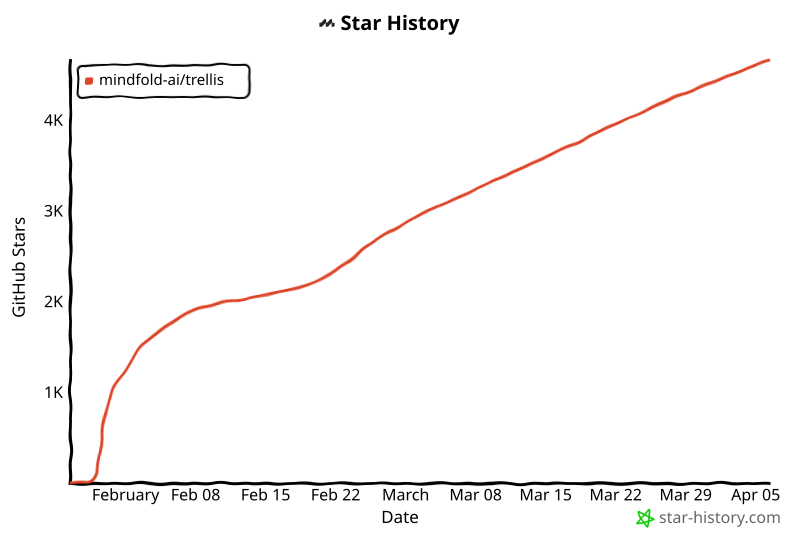

<p align="center">
<picture>
<source srcset="assets/002-trellis-b2ca927499.png" media="(prefers-color-scheme: dark)">
<source srcset="assets/002-trellis-b2ca927499.png" media="(prefers-color-scheme: light)">

</picture>
</p>

<p align="center">
<strong>一个出色的多平台 AI 编码框架</strong><br/>
<sub>支持 Claude Code、Cursor、OpenCode、iFlow、Codex、Kilo、Kiro、Gemini CLI、Antigravity、Windsurf、Qoder、CodeBuddy 和 GitHub Copilot。</sub>
</p>

<p align="center">
<a href="./README_CN.md">简体中文</a> •
<a href="https://docs.trytrellis.app/">文档</a> •
<a href="https://docs.trytrellis.app/guide/ch02-quick-start">快速开始</a> •
<a href="https://docs.trytrellis.app/guide/ch13-multi-platform">支持的平台</a> •
<a href="https://docs.trytrellis.app/guide/ch08-real-world">使用场景</a>
</p>

<p align="center">
<a href="https://www.npmjs.com/package/@mindfoldhq/trellis"></a>
<a href="https://www.npmjs.com/package/@mindfoldhq/trellis"></a>
<a href="https://github.com/mindfold-ai/Trellis/blob/main/LICENSE"></a>
<a href="https://github.com/mindfold-ai/Trellis/stargazers"></a>
<a href="https://docs.trytrellis.app/"></a>
<a href="https://discord.com/invite/tWcCZ3aRHc"></a>
<a href="https://github.com/mindfold-ai/Trellis/issues"></a>
<a href="https://github.com/mindfold-ai/Trellis/pulls"></a>
<a href="https://deepwiki.com/mindfold-ai/Trellis"></a>
<a href="https://chatgpt.com/?q=Explain+the+project+mindfold-ai/Trellis+on+GitHub"></a>
</p>

<p align="center">

</p>

## 为什么选择 Trellis？

| 能力 | 改变了什么 |
| --- | --- |
| **自动注入规范** | 在 `.trellis/spec/` 中编写一次约定，然后让 Trellis 在每个会话中自动注入相关上下文，无需反复重复。 |
| **以任务为中心的工作流** | 将 PRD、实现上下文、审查上下文和任务状态保存在 `.trellis/tasks/` 中，使 AI 工作保持结构化。 |
| **并行代理执行** | 使用 git worktree 并行运行多个 AI 任务，而不是让一个分支变成交通瓶颈。 |
| **项目记忆** | `.trellis/workspace/` 中的日志记录了上次发生的事情，使每个新会话都从真实上下文开始。 |
| **团队共享标准** | 规范存储在仓库中，一个人积累的工作流或规则可以让整个团队受益。 |
| **多平台设置** | 将相同的 Trellis 结构带到 13 个 AI 编码平台，而不是为每个工具重建工作流。 |

## 快速开始

```bash
# 1. Install Trellis
npm install -g @mindfoldhq/trellis@latest

# 2. Initialize in your repo
trellis init -u your-name

# 3. Or initialize with the platforms you actually use
trellis init --cursor --opencode --codex -u your-name
```

- `-u your-name` 创建 `.trellis/workspace/your-name/`，用于个人日志和会话连续性。
- 平台标志可以混合使用。当前选项包括 `--cursor`、`--opencode`、`--iflow`、`--codex`、`--kilo`、`--kiro`、`--gemini`、`--antigravity`、`--windsurf`、`--qoder`、`--codebuddy` 和 `--copilot`。
- 有关特定平台的设置、入口命令和升级路径，请参阅文档：
  [快速开始](https://docs.trytrellis.app/guide/ch02-quick-start) •
  [支持的平台](https://docs.trytrellis.app/guide/ch13-multi-platform) •
  [真实场景](https://docs.trytrellis.app/guide/ch08-real-world)

## 使用场景

### 一次教会 AI 你的项目

将编码标准、文件结构规则、审查习惯和工作流偏好放入 Markdown 规范。Trellis 会自动加载相关内容，这样你不必每次都重新解释仓库。

### 并行运行多个 AI 任务

使用 git worktree 和 Trellis 任务结构，在代理间干净地拆分工作。不同任务可以同时推进，不会互相干扰分支或本地状态。

### 将项目历史转化为可用记忆

任务 PRD、检查清单和工作空间日志使之前的决策可供下一个会话使用。下一个代理可以从上次停下的地方继续，而不是从空白上下文开始。

### 跨工具保持统一工作流

如果你的团队使用多种 AI 编码工具，Trellis 为规范、任务和流程提供了一个共享结构。平台特定的集成方式会变化，但工作流始终保持一致。

## 工作原理

Trellis 将核心工作流保存在 `.trellis/` 中，并围绕它生成你需要的平台特定入口点。

```text
.trellis/
├── spec/                    # 项目标准、模式和指南
├── tasks/                   # 任务 PRD、上下文文件和状态
├── workspace/               # 日志和开发者特定的连续性
├── workflow.md              # 共享工作流规则
└── scripts/                 # 驱动工作流的工具
```

根据你启用的平台，Trellis 还会创建工具特定的集成文件，如 `.claude/`、`.cursor/`、`AGENTS.md`、`.agents/`、`.codex/`、`.kilocode/`、`.kiro/`、`.github/copilot/` 和 `.github/hooks/`。对于 Codex，Trellis 现在会在 `.agents/skills/` 下安装项目技能，在 `.codex/` 下安装项目范围的配置/自定义代理。

从高层来看，工作流很简单：

1. 在规范中定义标准。
2. 从任务 PRD 开始或完善工作。
3. 让 Trellis 为当前任务注入正确的上下文。
4. 使用检查、日志和 worktree 来保持质量和连续性。

## 规范模板与模板市场

规范默认以空模板形式提供 —— 它们旨在根据你的项目技术栈和约定进行自定义。你可以从零开始填写，或从社区模板开始：

```bash
# 从自定义注册表获取模板
trellis init --registry https://github.com/your-org/your-spec-templates
```

浏览可用模板并了解如何发布你自己的模板，请访问[规范模板页面](https://docs.trytrellis.app/templates/specs-index)。

## 最新更新

- **v0.3.6**：任务生命周期钩子、自定义模板注册表（`--registry`）、父子任务关系、修复 CC v2.1.63+ 的 PreToolUse hook。
- **v0.3.5**：针对 delete migration manifest 字段名的热修复（Kilo 工作流）。
- **v0.3.4**：Qoder 平台支持、Kilo 工作流迁移、record-session 任务感知。
- **v0.3.1**：`trellis update` 的后台监控模式、改进 `.gitignore` 处理、文档刷新。
- **v0.3.0**：平台支持从 2 个扩展到 10 个、Windows 兼容性、远程规范模板、`/trellis:brainstorm`。

## 常见问题

<details>
<summary><strong>这与 <code>CLAUDE.md</code>、<code>AGENTS.md</code> 或 <code>.cursorrules</code> 有什么不同？</strong></summary>

这些文件有用，但往往会变得臃肿。Trellis 在它们周围添加了结构：分层规范、任务上下文、工作空间记忆和平台感知的工作流连接。

</details>

<details>
<summary><strong>Trellis 只适用于 Claude Code 吗？</strong></summary>

不是。Trellis 目前支持 Claude Code、Cursor、OpenCode、iFlow、Codex、Kilo、Kiro、Gemini CLI、Antigravity、Windsurf、Qoder、CodeBuddy 和 GitHub Copilot。每个工具的详细设置和入口命令在支持平台指南中。

</details>

<details>
<summary><strong>必须手动编写每个规范文件吗？</strong></summary>

不需要。许多团队先让 AI 从现有代码中草拟规范，然后手动完善重要部分。当你保持高信号规则的明确性和版本化时，Trellis 效果最佳。

</details>

<details>
<summary><strong>团队能使用这个而不产生频繁冲突吗？</strong></summary>

可以。个人工作空间日志按开发者分开，而共享的规范和任务保留在仓库中，可以像其他项目制品一样被审查和改进。

</details>

## Star 历史

[](https://star-history.com/#mindfold-ai/Trellis&Date)

## 社区与资源

- [官方文档](https://docs.trytrellis.app/) - 产品文档、设置指南和架构
- [快速开始](https://docs.trytrellis.app/guide/ch02-quick-start) - 快速在仓库中运行 Trellis
- [支持的平台](https://docs.trytrellis.app/guide/ch13-multi-platform) - 特定平台的设置和命令详情
- [真实场景](https://docs.trytrellis.app/guide/ch08-real-world) - 查看该工作流在实际中的运作方式
- [更新日志](https://docs.trytrellis.app/changelog/v0.3.6) - 跟踪当前版本和更新
- [技术博客](https://docs.trytrellis.app/blog) - 产品思考和技术文章
- [GitHub Issues](https://github.com/mindfold-ai/Trellis/issues) - 报告 bug 或请求功能
- [Discord](https://discord.com/invite/tWcCZ3aRHc) - 加入社区

<p align="center">
<a href="https://github.com/mindfold-ai/Trellis">官方仓库</a> •
<a href="https://github.com/mindfold-ai/Trellis/blob/main/LICENSE">AGPL-3.0 许可证</a> •
由 <a href="https://github.com/mindfold-ai">Mindfold</a> 构建
</p>
