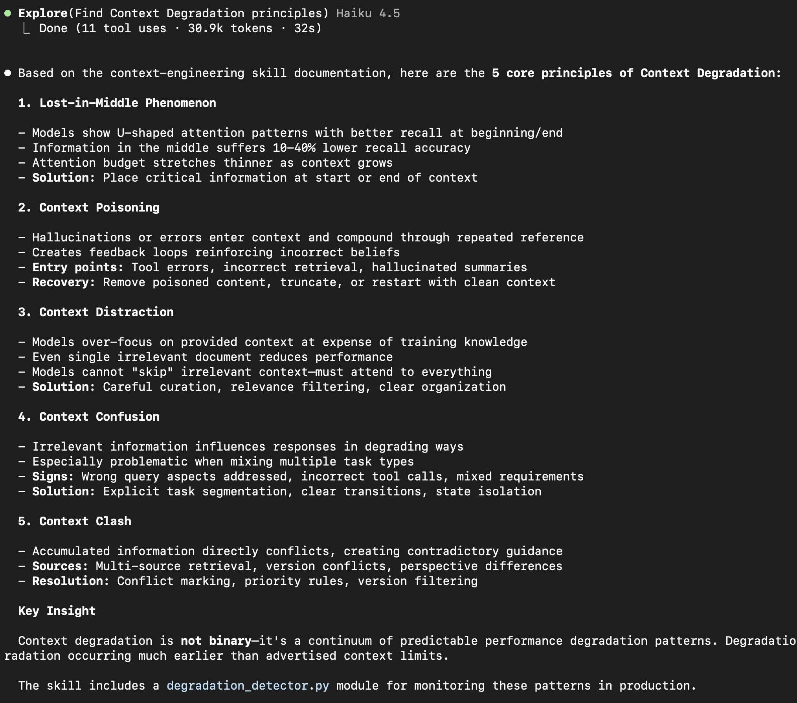
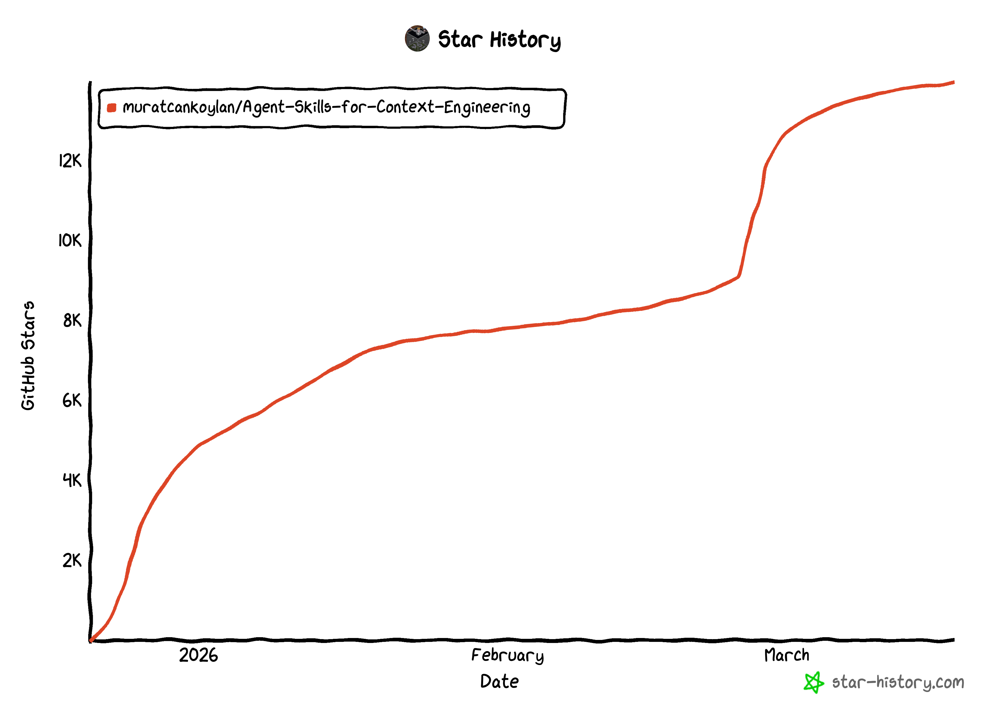

# Agent Skills for Context Engineering

这是一个全面、开放的 Agent Skills 集合，聚焦于上下文工程原则，用于构建生产级 AI 代理系统。这些技能讲授整理与编排上下文的艺术与方法，以在任何代理平台上最大化代理效能。

## 什么是上下文工程？

上下文工程是管理语言模型上下文窗口的学科。与专注于编写有效指令的提示词工程不同，上下文工程关注的是对所有进入模型有限注意力预算的信息进行整体编排：系统提示词、工具定义、检索文档、消息历史和工具输出。

根本挑战在于，上下文窗口的限制并不主要来自原始 token 容量，而是来自注意力机制。随着上下文长度增加，模型会表现出可预测的退化模式："中间遗忘"现象、U 形注意力曲线和注意力稀缺。有效的上下文工程意味着找到尽可能小、但高信号的 token 集合，以最大化获得期望结果的概率。

## 学术认可

本仓库被学术研究引用为静态技能架构的基础性工作：

> "While static skills are well-recognized [Anthropic, 2025b; Muratcan Koylan, 2025], MCE is among the first to dynamically evolve them, bridging manual skill engineering and autonomous self-improvement."

— [Meta Context Engineering via Agentic Skill Evolution](https://arxiv.org/pdf/2601.21557)，北京大学通用人工智能国家重点实验室（2026）

## 技能概览

### 基础技能

这些技能为所有后续的上下文工程工作建立基础理解。

| 技能 | 描述 |
|------|------|
| [context-fundamentals](skills/context-fundamentals/) | 理解什么是上下文、为什么它重要，以及代理系统中上下文的剖析 |
| [context-degradation](skills/context-degradation/) | 识别上下文失败的模式：中间遗忘、投毒、干扰和冲突 |
| [context-compression](skills/context-compression/) | 设计和评估长时间运行会话的压缩策略 |

### 架构技能

这些技能涵盖构建有效代理系统的模式和结构。

| 技能 | 描述 |
|------|------|
| [multi-agent-patterns](skills/multi-agent-patterns/) | 掌握编排器、点对点和层级式多代理架构 |
| [memory-systems](skills/memory-systems/) | 设计短期、长期和基于图谱的记忆架构 |
| [tool-design](skills/tool-design/) | 构建代理能有效使用的工具 |
| [filesystem-context](skills/filesystem-context/) | 使用文件系统进行动态上下文发现、工具输出卸载和计划持久化 |
| [hosted-agents](skills/hosted-agents/) | **新增** 构建具有沙箱 VM、预构建镜像、多人支持和多客户端界面的后台编码代理 |

### 运维技能

这些技能解决代理系统的持续运营和优化问题。

| 技能 | 描述 |
|------|------|
| [context-optimization](skills/context-optimization/) | 应用压缩、掩码和缓存策略 |
| [evaluation](skills/evaluation/) | 构建代理系统的评估框架 |
| [advanced-evaluation](skills/advanced-evaluation/) | 掌握 LLM-as-a-Judge 技术：直接评分、成对比较、评分标准生成和偏差缓解 |

### 开发方法论

这些技能涵盖构建 LLM 驱动项目的元层面实践。

| 技能 | 描述 |
|------|------|
| [project-development](skills/project-development/) | 从构思到部署设计和构建 LLM 项目，包括任务-模型适配分析、流水线架构和结构化输出设计 |

### 认知架构技能

这些技能涵盖理性代理系统的形式化认知建模。

| 技能 | 描述 |
|------|------|
| [bdi-mental-states](skills/bdi-mental-states/) | **新增** 使用形式化 BDI 本体模式将外部 RDF 上下文转化为代理心智状态（信念、愿望、意图），用于审议式推理和可解释性 |

## 设计理念

### 渐进式披露

每个技能都针对高效上下文使用而构建。启动时，代理仅加载技能名称和描述。完整内容仅在技能因相关任务被激活时才加载。

### 平台无关性

这些技能关注可迁移的原则，而非特定厂商的实现。这些模式适用于 Claude Code、Cursor 以及任何支持技能或允许自定义指令的代理平台。

### 概念基础与实用示例

脚本和示例使用 Python 伪代码演示概念，可跨环境运行，无需安装特定依赖。

## 使用

### 在 Claude Code 中使用

本仓库是一个 **Claude Code 插件市场**，包含上下文工程技能，Claude 会根据你的任务上下文自动发现和激活这些技能。

### 安装

**第 1 步：添加市场**

在 Claude Code 中运行以下命令，将本仓库注册为插件源：

```
/plugin marketplace add muratcankoylan/Agent-Skills-for-Context-Engineering
```

**第 2 步：安装插件**

选项 A - 浏览并安装：
1. 选择 `Browse and install plugins`
2. 选择 `context-engineering-marketplace`
3. 选择 `context-engineering`
4. 选择 `Install now`

选项 B - 通过命令直接安装：

```
/plugin install context-engineering@context-engineering-marketplace
```

这会在单个插件中安装全部 13 个技能。技能会根据你的任务上下文自动激活。

### 技能触发条件

| 技能 | 触发条件 |
|------|---------|
| `context-fundamentals` | "understand context"、"explain context windows"、"design agent architecture" |
| `context-degradation` | "diagnose context problems"、"fix lost-in-middle"、"debug agent failures" |
| `context-compression` | "compress context"、"summarize conversation"、"reduce token usage" |
| `context-optimization` | "optimize context"、"reduce token costs"、"implement KV-cache" |
| `multi-agent-patterns` | "design multi-agent system"、"implement supervisor pattern" |
| `memory-systems` | "implement agent memory"、"build knowledge graph"、"track entities" |
| `tool-design` | "design agent tools"、"reduce tool complexity"、"implement MCP tools" |
| `filesystem-context` | "offload context to files"、"dynamic context discovery"、"agent scratch pad"、"file-based context" |
| `hosted-agents` | "build background agent"、"create hosted coding agent"、"sandboxed execution"、"multiplayer agent"、"Modal sandboxes" |
| `evaluation` | "evaluate agent performance"、"build test framework"、"measure quality" |
| `advanced-evaluation` | "implement LLM-as-judge"、"compare model outputs"、"mitigate bias" |
| `project-development` | "start LLM project"、"design batch pipeline"、"evaluate task-model fit" |
| `bdi-mental-states` | "model agent mental states"、"implement BDI architecture"、"transform RDF to beliefs"、"build cognitive agent" |



### 在 Cursor 中使用（Open Plugins）

本仓库已列入 [Cursor 插件目录](https://cursor.directory/plugins/context-engineering)。

`.plugin/plugin.json` 清单遵循 [Open Plugins](https://open-plugins.com) 标准，因此该仓库也适用于任何兼容的代理工具（Codex、GitHub Copilot 等）。

### 使用单个技能

要使用单个技能而不安装完整插件，请将其 `SKILL.md` 直接复制到项目的 `.claude/skills/` 目录中：

```bash
# 示例：仅添加 context-fundamentals 技能
mkdir -p .claude/skills
curl -o .claude/skills/context-fundamentals.md \
  https://raw.githubusercontent.com/muratcankoylan/Agent-Skills-for-Context-Engineering/main/skills/context-fundamentals/SKILL.md
```

可用技能：`context-fundamentals`、`context-degradation`、`context-compression`、`context-optimization`、`multi-agent-patterns`、`memory-systems`、`tool-design`、`filesystem-context`、`hosted-agents`、`evaluation`、`advanced-evaluation`、`project-development`、`bdi-mental-states`

### 自定义实现

从任何技能中提取原则和模式，在你的代理框架中实现。这些技能刻意保持平台无关性。

## 示例

[examples](examples/) 文件夹包含完整的系统设计，展示多个技能如何在实践中协同工作。

| 示例 | 描述 | 应用的技能 |
|------|------|-----------|
| [digital-brain-skill](examples/digital-brain-skill/) | **新增** 创始人和创作者的个人操作系统。完整的 Claude Code 技能，包含 6 个模块、4 个自动化脚本 | context-fundamentals、context-optimization、memory-systems、tool-design、multi-agent-patterns、evaluation、project-development |
| [x-to-book-system](examples/x-to-book-system/) | 监控 X 账号并生成每日综合书籍的多代理系统 | multi-agent-patterns、memory-systems、context-optimization、tool-design、evaluation |
| [llm-as-judge-skills](examples/llm-as-judge-skills/) | 采用 TypeScript 实现的生产就绪 LLM 评估工具，19 个测试通过 | advanced-evaluation、tool-design、context-fundamentals、evaluation |
| [book-sft-pipeline](examples/book-sft-pipeline/) | 训练模型以任意作者的风格写作。包含 Gertrude Stein 案例研究，在 Pangram 上获得 70% 人类评分，总成本仅 2 美元 | project-development、context-compression、multi-agent-patterns、evaluation |

每个示例包括：
- 包含架构决策的完整 PRD
- 展示哪些概念影响了每个决策的技能映射
- 实现指导

### Digital Brain Skill 示例

[digital-brain-skill](examples/digital-brain-skill/) 示例是一个完整的个人操作系统，展示了全面的技能应用：

- **渐进式披露**：3 层加载（SKILL.md → MODULE.md → 数据文件）
- **模块隔离**：6 个独立模块（identity、content、knowledge、network、operations、agents）
- **仅追加记忆**：带有 schema-first 行的 JSONL 文件，便于代理解析
- **自动化脚本**：4 个整合工具（weekly_review、content_ideas、stale_contacts、idea_to_draft）

在 [HOW-SKILLS-BUILT-THIS.md](examples/digital-brain-skill/HOW-SKILLS-BUILT-THIS.md) 中包含详细的可追溯性，将每个架构决策映射到具体的技能原则。

### LLM-as-Judge Skills 示例

[llm-as-judge-skills](examples/llm-as-judge-skills/) 示例是一个完整的 TypeScript 实现，展示了：

- **直接评分**：结合评分量表支持，依据加权标准评估响应
- **成对比较**：比较响应并缓解位置偏差
- **评分标准生成**：创建领域特定的评估标准
- **EvaluatorAgent**：结合所有评估能力的高级代理

### Book SFT Pipeline 示例

[book-sft-pipeline](examples/book-sft-pipeline/) 示例展示了训练小型模型（8B）以任意作者风格写作：

- **智能分段**：带有重叠的两层分块，最大化训练样本
- **提示词多样性**：15+ 模板防止记忆化，强制风格学习
- **Tinker 集成**：完整的 LoRA 训练工作流，总成本仅 2 美元
- **验证方法论**：现代场景测试证明风格迁移而非内容记忆

与上下文工程技能集成：project-development、context-compression、multi-agent-patterns、evaluation。

## Star History


## 结构

每个技能遵循 Agent Skills 规范：

```
skill-name/
├── SKILL.md              # 必需：指令 + 元数据
├── scripts/              # 可选：演示概念的可执行代码
└── references/           # 可选：额外的文档和资源
```

规范技能结构请参阅 [template](template/) 文件夹。

## 贡献

本仓库遵循 Agent Skills 开放开发模式。欢迎来自更广泛生态系统的贡献。贡献时请注意：

1. 遵循技能模板结构
2. 提供清晰、可操作的指令
3. 在适当的地方包含可运行的示例
4. 记录权衡和潜在问题
5. 将 SKILL.md 控制在 500 行以内以获得最佳性能

欢迎联系 [Muratcan Koylan](https://x.com/koylanai) 探讨合作机会或任何咨询。

## 许可证

MIT 许可证 - 详情请参阅 LICENSE 文件。

## 参考文献

这些技能中的原则源自领先 AI 实验室和框架开发者的研究和生产实践经验。每个技能都包含支持其建议的底层研究和案例研究的参考文献。
