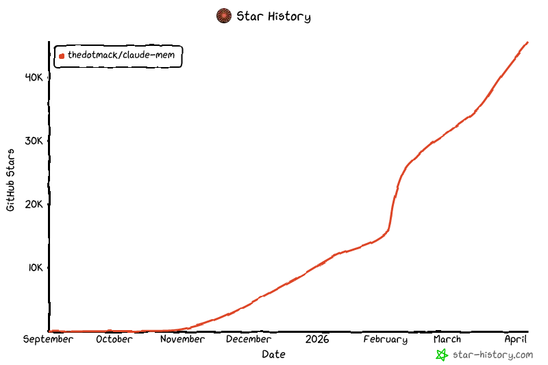

<h1 align="center">
  <br>
  <a href="https://github.com/thedotmack/claude-mem">
    <picture>
      <source media="(prefers-color-scheme: dark)" srcset="assets/004-claude-mem-logo-for-dark-mode-4accd18324.webp">
      <source media="(prefers-color-scheme: light)" srcset="assets/001-claude-mem-logo-for-light-mode-c40dc53dee.webp">
      
    </picture>
  </a>
  <br>
</h1>

<p align="center">
  <a href="docs/i18n/README.zh.md">🇨🇳 中文</a> •
  <a href="docs/i18n/README.zh-tw.md">🇹🇼 繁體中文</a> •
  <a href="docs/i18n/README.ja.md">🇯🇵 日本語</a> •
  <a href="docs/i18n/README.pt.md">🇵🇹 Português</a> •
  <a href="docs/i18n/README.pt-br.md">🇧🇷 Português</a> •
  <a href="docs/i18n/README.ko.md">🇰🇷 한국어</a> •
  <a href="docs/i18n/README.es.md">🇪🇸 Español</a> •
  <a href="docs/i18n/README.de.md">🇩🇪 Deutsch</a> •
  <a href="docs/i18n/README.fr.md">🇫🇷 Français</a> •
  <a href="docs/i18n/README.he.md">🇮🇱 עברית</a> •
  <a href="docs/i18n/README.ar.md">🇸🇦 العربية</a> •
  <a href="docs/i18n/README.ru.md">🇷🇺 Русский</a> •
  <a href="docs/i18n/README.pl.md">🇵🇱 Polski</a> •
  <a href="docs/i18n/README.cs.md">🇨🇿 Čeština</a> •
  <a href="docs/i18n/README.nl.md">🇳🇱 Nederlands</a> •
  <a href="docs/i18n/README.tr.md">🇹🇷 Türkçe</a> •
  <a href="docs/i18n/README.uk.md">🇺🇦 Українська</a> •
  <a href="docs/i18n/README.vi.md">🇻🇳 Tiếng Việt</a> •
  <a href="docs/i18n/README.tl.md">🇵🇭 Tagalog</a> •
  <a href="docs/i18n/README.id.md">🇮🇩 Indonesia</a> •
  <a href="docs/i18n/README.th.md">🇹🇭 ไทย</a> •
  <a href="docs/i18n/README.hi.md">🇮🇳 हिन्दी</a> •
  <a href="docs/i18n/README.bn.md">🇧🇩 বাংলা</a> •
  <a href="docs/i18n/README.ur.md">🇵🇰 اردو</a> •
  <a href="docs/i18n/README.ro.md">🇷🇴 Română</a> •
  <a href="docs/i18n/README.sv.md">🇸🇪 Svenska</a> •
  <a href="docs/i18n/README.it.md">🇮🇹 Italiano</a> •
  <a href="docs/i18n/README.el.md">🇬🇷 Ελληνικά</a> •
  <a href="docs/i18n/README.hu.md">🇭🇺 Magyar</a> •
  <a href="docs/i18n/README.fi.md">🇫🇮 Suomi</a> •
  <a href="docs/i18n/README.da.md">🇩🇰 Dansk</a> •
  <a href="docs/i18n/README.no.md">🇳🇴 Norsk</a>
</p>

<h4 align="center">为 <a href="https://claude.com/claude-code" target="_blank">Claude Code</a> 构建的持久化记忆压缩系统。</h4>

<p align="center">
  <a href="LICENSE">
    
  </a>
  <a href="package.json">
    
  </a>
  <a href="package.json">
    
  </a>
  <a href="https://github.com/thedotmack/awesome-claude-code">
    
  </a>
</p>

<p align="center">
  <a href="https://trendshift.io/repositories/15496" target="_blank">
    <picture>
      <source media="(prefers-color-scheme: dark)" srcset="https://raw.githubusercontent.com/thedotmack/claude-mem/main/docs/public/trendshift-badge-dark.svg">
      <source media="(prefers-color-scheme: light)" srcset="https://raw.githubusercontent.com/thedotmack/claude-mem/main/docs/public/trendshift-badge.svg">
      
    </picture>
  </a>
</p>

<br>

<table align="center">
  <tr>
    <td align="center">
      <a href="https://github.com/thedotmack/claude-mem">
        <picture>
          
        </picture>
      </a>
    </td>
    <td align="center">
      <a href="https://www.star-history.com/#thedotmack/claude-mem&Date">
        <picture>
          <source
            media="(prefers-color-scheme: dark)"
            srcset="assets/005-image-847d2407e3.png"
          />
          <source
            media="(prefers-color-scheme: light)"
            srcset="assets/003-image-c3a06bbf9a.png"
          />
          
        </picture>
      </a>
    </td>
  </tr>
</table>

<p align="center">
  <a href="#快速开始">快速开始</a> •
  <a href="#工作原理">工作原理</a> •
  <a href="#mcp-搜索工具">搜索工具</a> •
  <a href="#文档">文档</a> •
  <a href="#配置">配置</a> •
  <a href="#故障排除">故障排除</a> •
  <a href="#许可证">许可证</a>
</p>

<p align="center">
  Claude-Mem 通过自动捕获工具使用观察结果、生成语义摘要并将其提供给后续会话，无缝地在会话之间保留上下文。这使得 Claude 能够在会话结束或重新连接后，依然保持对项目知识的连续性。
</p>

---

## 快速开始

一行命令安装：

```bash
npx claude-mem install
```

或为 Gemini CLI 安装（自动检测 `~/.gemini`）：

```bash
npx claude-mem install --ide gemini-cli
```

或从 Claude Code 内部的插件市场安装：

```bash
/plugin marketplace add thedotmack/claude-mem

/plugin install claude-mem
```

重启 Claude Code 或 Gemini CLI。之前会话的上下文将自动出现在新会话中。

> **注意：** Claude-Mem 也发布在 npm 上，但 `npm install -g claude-mem` 仅安装 **SDK/库** —— 它不会注册插件钩子或设置 worker 服务。请始终通过 `npx claude-mem install` 或上述 `/plugin` 命令进行安装。

### 🦞 OpenClaw Gateway

在 [OpenClaw](https://openclaw.ai) 网关上将 claude-mem 作为持久化记忆插件安装，只需一行命令：

```bash
curl -fsSL https://install.cmem.ai/openclaw.sh | bash
```

安装程序会自动处理依赖项、插件设置、AI 提供商配置、worker 启动，以及可选的实时观察推送到 Telegram、Discord、Slack 等。详情请参阅 [OpenClaw 集成指南](https://docs.claude-mem.ai/openclaw-integration)。

**核心特性：**

- 🧠 **持久化记忆** - 上下文在会话间持久保存
- 📊 **渐进式披露** - 分层记忆检索，并显示 token 开销
- 🔍 **基于技能的搜索** - 使用 mem-search 技能查询项目历史
- 🖥️ **Web 查看器界面** - 实时记忆流，访问 http://localhost:37777
- 💻 **Claude Desktop 技能** - 在 Claude Desktop 对话中搜索记忆
- 🔒 **隐私控制** - 使用 `<private>` 标签排除敏感内容不被存储
- ⚙️ **上下文配置** - 精细控制注入哪些上下文
- 🤖 **自动运行** - 无需手动干预
- 🔗 **引用** - 通过 ID 引用过去的观察记录（通过 http://localhost:37777/api/observation/{id} 访问，或在 http://localhost:37777 的 Web 查看器中查看全部）
- 🧪 **Beta 频道** - 通过版本切换尝试 Endless Mode 等实验性功能

---

## 文档

📚 **[查看完整文档](https://docs.claude-mem.ai/)** - 浏览官方网站

### 入门

- **[安装指南](https://docs.claude-mem.ai/installation)** - 快速开始与高级安装
- **[Gemini CLI 设置](https://docs.claude-mem.ai/gemini-cli/setup)** - Google Gemini CLI 集成专用指南
- **[使用指南](https://docs.claude-mem.ai/usage/getting-started)** - Claude-Mem 如何自动工作
- **[搜索工具](https://docs.claude-mem.ai/usage/search-tools)** - 使用自然语言查询项目历史
- **[Beta 功能](https://docs.claude-mem.ai/beta-features)** - 尝试 Endless Mode 等实验性功能

### 最佳实践

- **[上下文工程](https://docs.claude-mem.ai/context-engineering)** - AI 代理上下文优化原则
- **[渐进式披露](https://docs.claude-mem.ai/progressive-disclosure)** - Claude-Mem 上下文启动策略背后的理念

### 架构

- **[概览](https://docs.claude-mem.ai/architecture/overview)** - 系统组件与数据流
- **[架构演进](https://docs.claude-mem.ai/architecture-evolution)** - 从 v3 到 v5 的历程
- **[Hooks 架构](https://docs.claude-mem.ai/hooks-architecture)** - Claude-Mem 如何使用生命周期钩子
- **[Hooks 参考](https://docs.claude-mem.ai/architecture/hooks)** - 7 个钩子脚本详解
- **[Worker 服务](https://docs.claude-mem.ai/architecture/worker-service)** - HTTP API 与 Bun 管理
- **[数据库](https://docs.claude-mem.ai/architecture/database)** - SQLite 模式与 FTS5 搜索
- **[搜索架构](https://docs.claude-mem.ai/architecture/search-architecture)** - 基于 Chroma 向量数据库的混合搜索

### 配置与开发

- **[配置](https://docs.claude-mem.ai/configuration)** - 环境变量与设置
- **[开发](https://docs.claude-mem.ai/development)** - 构建、测试、贡献
- **[故障排除](https://docs.claude-mem.ai/troubleshooting)** - 常见问题与解决方案

---

## 工作原理

**核心组件：**

1. **5 个生命周期钩子** - SessionStart、UserPromptSubmit、PostToolUse、Stop、SessionEnd（6 个钩子脚本）
2. **智能安装** - 缓存依赖检查器（预钩子脚本，非生命周期钩子）
3. **Worker 服务** - 端口 37777 上的 HTTP API，提供 Web 查看器界面和 10 个搜索端点，由 Bun 管理
4. **SQLite 数据库** - 存储会话、观察记录、摘要
5. **mem-search 技能** - 支持渐进式披露的自然语言查询
6. **Chroma 向量数据库** - 混合语义 + 关键词搜索，用于智能上下文检索

详情请参阅 [架构概览](https://docs.claude-mem.ai/architecture/overview)。

---

## MCP 搜索工具

Claude-Mem 通过 **4 个 MCP 工具** 提供智能记忆搜索，遵循 token 高效的 **3 层工作流模式**：

**3 层工作流：**

1. **`search`** - 获取包含 ID 的紧凑索引（约 50-100 token/结果）
2. **`timeline`** - 获取感兴趣结果周围的时间线上下文
3. **`get_observations`** - 仅获取筛选后 ID 的完整详情（约 500-1,000 token/结果）

**工作方式：**
- Claude 使用 MCP 工具搜索你的记忆
- 从 `search` 开始获取结果索引
- 使用 `timeline` 查看特定观察记录周围的上下文
- 使用 `get_observations` 获取相关 ID 的完整详情
- 通过在获取详情前进行筛选，**节省约 10 倍 token**

**可用的 MCP 工具：**

1. **`search`** - 使用全文查询搜索记忆索引，支持按类型/日期/项目筛选
2. **`timeline`** - 获取特定观察记录或查询周围的时间线上下文
3. **`get_observations`** - 通过 ID 获取完整观察详情（始终批量传入多个 ID）

**使用示例：**

```typescript
// Step 1: Search for index
search(query="authentication bug", type="bugfix", limit=10)

// Step 2: Review index, identify relevant IDs (e.g., #123, #456)

// Step 3: Fetch full details
get_observations(ids=[123, 456])
```

详细示例请参阅 [搜索工具指南](https://docs.claude-mem.ai/usage/search-tools)。

---

## Beta 功能

Claude-Mem 提供包含 **Endless Mode**（用于扩展会话的仿生记忆架构）等实验性功能的 **beta 频道**。可在 http://localhost:37777 的 Web 查看器界面 → Settings 中切换稳定版和 beta 版本。

详情请参阅 **[Beta 功能文档](https://docs.claude-mem.ai/beta-features)**。

---

## 系统要求

- **Node.js**：18.0.0 或更高版本
- **Claude Code**：支持插件的最新版本
- **Bun**：JavaScript 运行时和进程管理器（如缺失会自动安装）
- **uv**：用于向量搜索的 Python 包管理器（如缺失会自动安装）
- **SQLite 3**：用于持久化存储（已内置）

---
### Windows 安装注意事项

如果你看到如下错误：

```powershell
npm : The term 'npm' is not recognized as the name of a cmdlet
```

请确保已安装 Node.js 和 npm，并将其添加到 PATH 中。从 https://nodejs.org 下载最新的 Node.js 安装程序，安装后重启终端。

---

## 配置

设置在 `~/.claude-mem/settings.json` 中管理（首次运行时自动创建并使用默认值）。可配置 AI 模型、worker 端口、数据目录、日志级别和上下文注入设置。

所有可用设置和示例请参阅 **[配置指南](https://docs.claude-mem.ai/configuration)**。

---

## 开发

构建说明、测试和贡献流程请参阅 **[开发指南](https://docs.claude-mem.ai/development)**。

---

## 故障排除

如果遇到问题，向 Claude 描述问题，故障排除技能将自动诊断并提供修复方案。

常见问题和解决方案请参阅 **[故障排除指南](https://docs.claude-mem.ai/troubleshooting)**。

---

## Bug 报告

使用自动生成器创建详细的 bug 报告：

```bash
cd ~/.claude/plugins/marketplaces/thedotmack
npm run bug-report
```

## 贡献

欢迎贡献！请按以下步骤操作：

1. Fork 本仓库
2. 创建功能分支
3. 编写变更并附上测试
4. 更新文档
5. 提交 Pull Request

贡献流程请参阅 [开发指南](https://docs.claude-mem.ai/development)。

---

## 许可证

本项目采用 **GNU Affero General Public License v3.0**（AGPL-3.0）许可证。

Copyright (C) 2025 Alex Newman (@thedotmack). All rights reserved.

完整详情请参阅 [LICENSE](LICENSE) 文件。

**这意味着：**

- 你可以自由使用、修改和分发本软件
- 如果你修改并在网络服务器上部署，必须公开你的源代码
- 衍生作品必须同样采用 AGPL-3.0 许可证
- 本软件不提供任何担保

**关于 Ragtime 的说明**：`ragtime/` 目录单独授权，采用 **PolyForm Noncommercial License 1.0.0**。详情请参阅 [ragtime/LICENSE](ragtime/LICENSE)。

---

## 支持

- **文档**：[docs/](docs/)
- **问题反馈**：[GitHub Issues](https://github.com/thedotmack/claude-mem/issues)
- **仓库**：[github.com/thedotmack/claude-mem](https://github.com/thedotmack/claude-mem)
- **官方 X 账号**：[@Claude_Memory](https://x.com/Claude_Memory)
- **官方 Discord**：[加入 Discord](https://discord.com/invite/J4wttp9vDu)
- **作者**：Alex Newman ([@thedotmack](https://github.com/thedotmack))

---

**基于 Claude Agent SDK 构建** | **由 Claude Code 驱动** | **使用 TypeScript 开发**

---

### 关于 $CMEM？

$CMEM 是由第三方未经 Claude-Mem 事先同意而创建的 Solana 代币，但已被 Claude-Mem 的创建者（Alex Newman, @thedotmack）正式接纳。该代币作为社区增长的催化剂，旨在将实时代理数据带给最需要它的开发者和知识工作者。$CMEM: 2TsmuYUrsctE57VLckZBYEEzdokUF8j8e1GavekWBAGS
