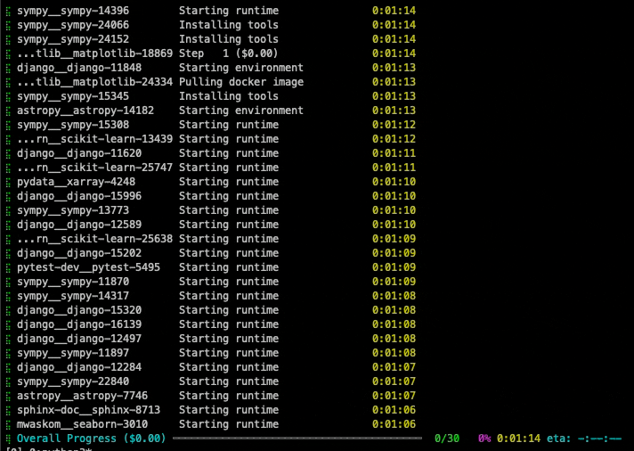

<div align="center">
<a href="https://swe-rex.com"></a>
</div>

# SWE-agent 远程执行框架

[](https://swe-rex.com/latest/)
[](https://join.slack.com/t/swe-bench/shared_invite/zt-36pj9bu5s-o3_yXPZbaH2wVnxnss1EkQ)
[](https://pypi.org/project/swe-rex/)

SWE-ReX 是一个与沙箱化 shell 环境交互的运行时接口，让你能够轻松地让 AI 代理在*任意环境*上运行*任意命令*。

无论命令是在本地执行，还是在 Docker 容器、AWS 远程机器、Modal 或其他平台上远程执行，你的代理代码都保持不变。
需要并行运行 100 个代理？同样没问题！

具体来说，SWE-ReX 允许你的代理

* ✅ **与运行中的 shell 会话交互**。SWE-ReX 会识别命令何时完成，提取输出和退出码并返回给你的代理。
* ✅ 让你的代理在 shell 中使用**交互式命令行工具**，如 `ipython`、`gdb` 等。
* ✅ **并行交互多个 shell 会话**，类似于人类可以同时运行 shell、ipython、gdb 等。

我们构建 SWE-ReX 的目的是帮助你专注于开发和评估代理，而不是基础设施。

SWE-ReX 源自我们在 [SWE-agent][] 和 [SWE-agent enigma][enigma] 中的经验。
通过使用 SWE-ReX，我们

* 🦖 支持**快速、大规模并行**的代理运行（让大规模基准测试评估变得轻而易举）。
* 🦖 支持**广泛的平台**，包括没有 Docker 的非 Linux 机器。
* 🦖 **将代理逻辑与基础设施关注点解耦**，使 SWE-agent 更稳定、更易于维护。

这是 [SWE-agent][] 使用 SWE-ReX 并行运行 30 个 [SWE-bench][] 实例的演示：

<div align="center">

</div>

## 快速开始

```bash
pip install swe-rex
# With modal support
pip install 'swe-rex[modal]'
# With fargate support
pip install 'swe-rex[fargate]'
# With daytona support (WIP)
pip install 'swe-rex[daytona]'
# Development setup (all optional dependencies)
pip install 'swe-rex[dev]'
```

然后前往[我们的文档](https://swe-rex.com/)了解更多！

[SWE-agent]: assets/001-asset-60ebe362be.html
[SWE-bench]: assets/002-asset-c3824812b2.html
[enigma]: assets/003-asset-917b6dc558.html

## 我们的其他项目

<div align="center">
  <a href="https://github.com/SWE-agent/SWE-agent"></a>
   &nbsp;&nbsp;
  <a href="https://github.com/SWE-agent/mini-SWE-agent"></a>
   &nbsp;&nbsp;
  <a href="https://github.com/SWE-bench/SWE-smith"></a>
   &nbsp;&nbsp;
  <a href="https://github.com/SWE-bench/SWE-bench"></a>
  &nbsp;&nbsp;
  <a href="https://github.com/codeclash-ai/codeclash"></a>
  &nbsp;&nbsp;
  <a href="https://github.com/SWE-bench/sb-cli"></a>
</div>
