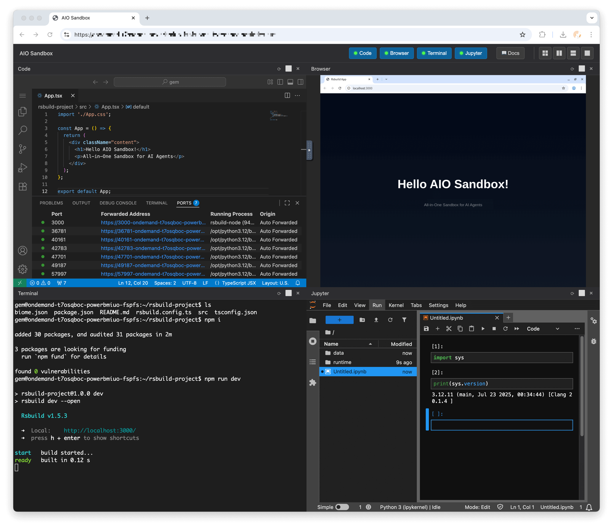
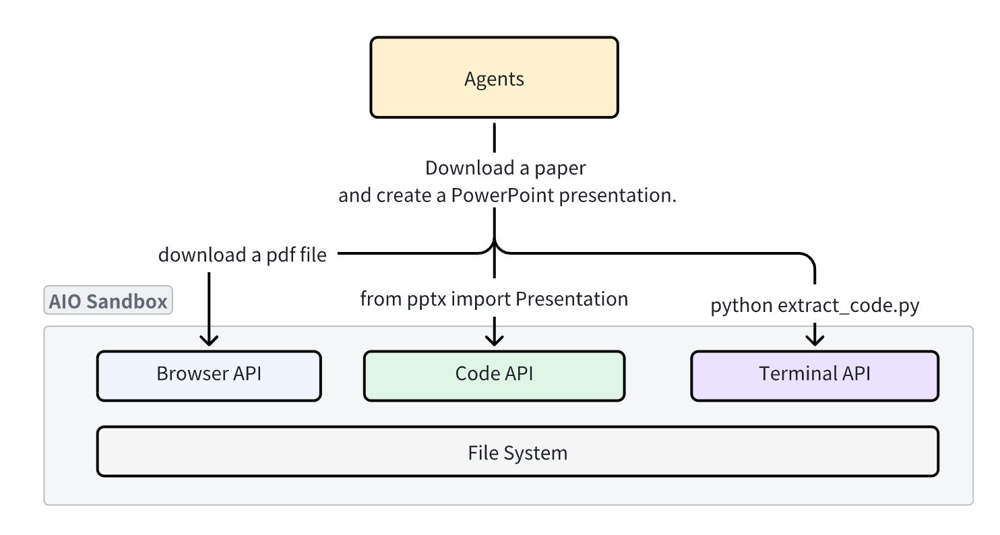
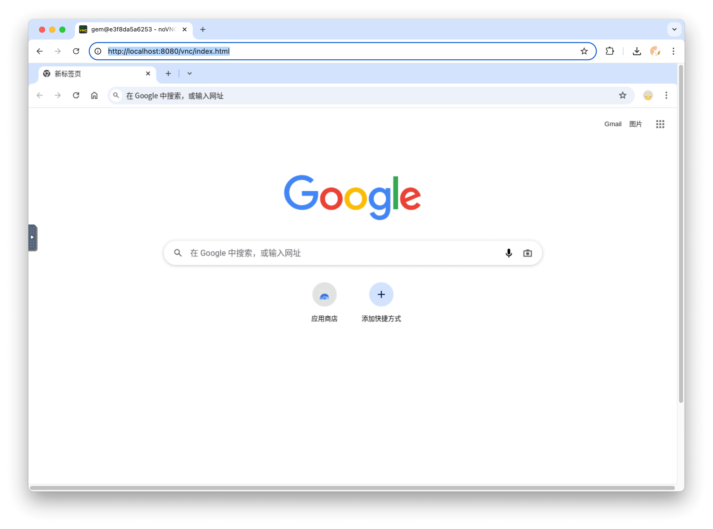
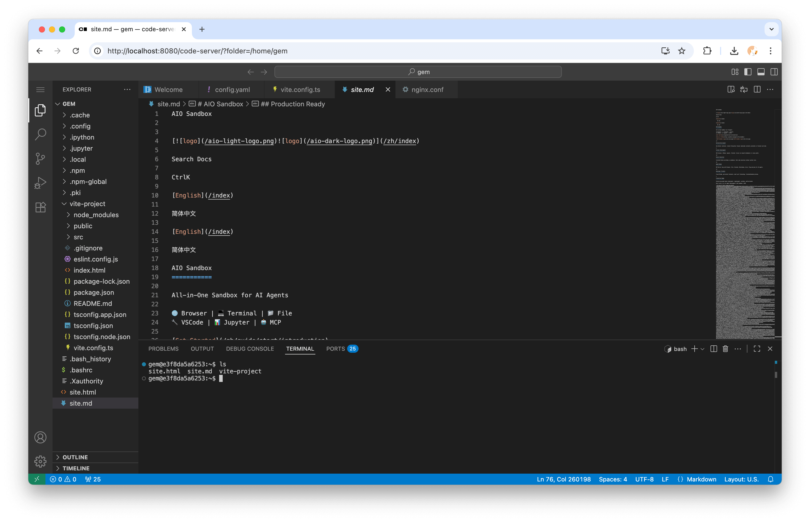
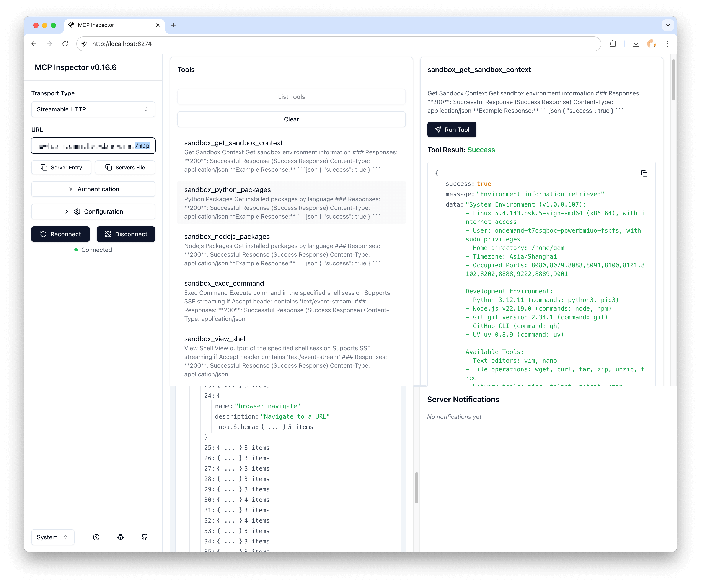
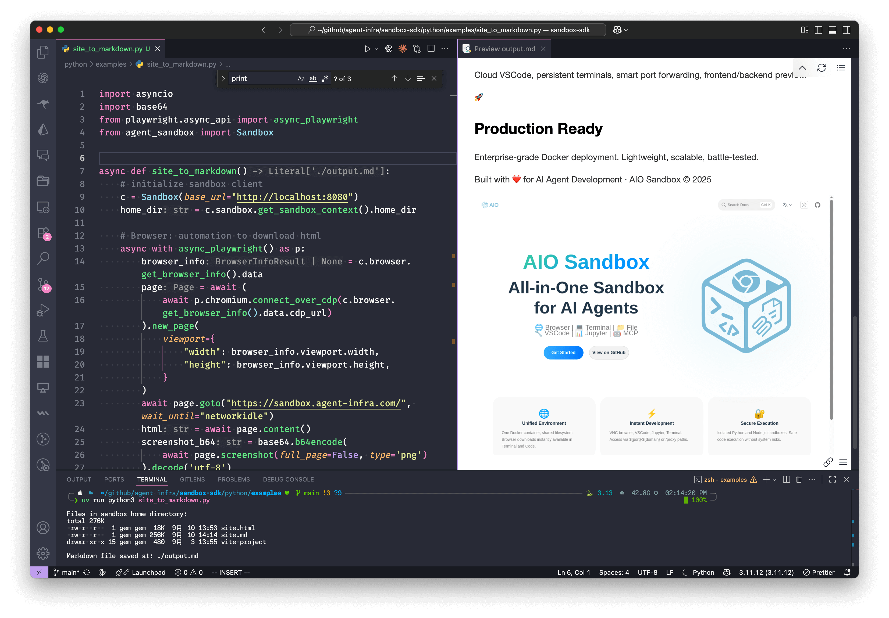

# AIO Sandbox - 一体化代理沙箱环境

<p align="center">
  
</p>

<p align="center">
  <strong>🌐 浏览器 | 💻 终端 | 📁 文件 | 🔧 VSCode | 📊 Jupyter | 🤖 MCP</strong>
</p>

<div align="center">
<p>
        🌐 <a href="https://sandbox.agent-infra.com/">网站</a>&nbsp&nbsp
        | &nbsp&nbsp🔌 <a href="https://sandbox.agent-infra.com/api">API</a>&nbsp&nbsp
        | &nbsp&nbsp📑 <a href="https://arxiv.org/pdf/2509.02544#S2.SS2">论文</a>&nbsp&nbsp
        | &nbsp&nbsp🌟 <a href="https://github.com/agent-infra/sandbox/tree/main/examples">示例</a>&nbsp&nbsp
        | &nbsp&nbsp📊 <a href="https://github.com/agent-infra/sandbox/tree/main/evaluation">评估</a> &nbsp&nbsp
</p>
</div>

<p align="center">
  <a href="https://github.com/agent-infra/sandbox/releases"></a>
  <a href="https://github.com/agent-infra/sandbox/blob/main/LICENSE"></a>
  <a href="https://pypi.org/project/agent-sandbox/"></a>
  <a href="https://www.npmjs.com/package/@agent-infra/sandbox"></a>
</p>



## 🚀 快速开始

30 秒即可启动运行：

```bash
docker run --security-opt seccomp=unconfined --rm -it -p 8080:8080 ghcr.io/agent-infra/sandbox:latest
```

中国大陆用户：

```bash
docker run --security-opt seccomp=unconfined --rm -it -p 8080:8080 enterprise-public-cn-beijing.cr.volces.com/vefaas-public/all-in-one-sandbox:latest
```

使用特定版本时格式为 `agent-infra/sandbox:${version}`，例如使用 1.0.0.150 版本：

```bash
docker run --security-opt seccomp=unconfined --rm -it -p 8080:8080 ghcr.io/agent-infra/sandbox:1.0.0.150
# 中国大陆用户
docker run --security-opt seccomp=unconfined --rm -it -p 8080:8080 enterprise-public-cn-beijing.cr.volces.com/vefaas-public/all-in-one-sandbox:1.0.0.150
```

启动后，可通过以下地址访问环境：
- 📖 **文档**：http://localhost:8080/v1/docs
- 🌐 **VNC 浏览器**：http://localhost:8080/vnc/index.html?autoconnect=true
- 💻 **VSCode Server**：http://localhost:8080/code-server/
- 🤖 **MCP 服务**：http://localhost:8080/mcp

## 🎯 什么是 AIO Sandbox？

AIO Sandbox 是一个**一体化**代理沙箱环境，将浏览器、Shell、文件、MCP 操作和 VSCode Server 结合在单个 Docker 容器中。基于云原生轻量级沙箱技术构建，为 AI 代理和开发者提供统一、安全的执行环境。

<p align="center">
  
</p>

### 为什么选择 AIO Sandbox？

传统沙箱是**单一功能**的（浏览器、代码或 Shell），使文件共享和功能协调变得极其困难。AIO Sandbox 通过提供以下能力解决了这一问题：

- ✅ **统一文件系统** - 浏览器中下载的文件可在 Shell/文件操作中即时使用
- ✅ **多接口支持** - VNC、VSCode、Jupyter 和终端集成在统一环境中
- ✅ **安全执行** - 具有安全保障的沙箱化 Python 和 Node.js 执行
- ✅ **零配置** - 预配置的 MCP 服务器和开发工具开箱即用
- ✅ **代理就绪** - 兼容 MCP 的 API，无缝集成 AI 代理

## 📦 安装

### SDK 安装

<table>
<tr>
<td>

**Python**
```bash
pip install agent-sandbox
```

</td>
<td>

**TypeScript/JavaScript**
```bash
npm install @agent-infra/sandbox
```

</td>
<td>

**Golang**
```bash
go get github.com/agent-infra/sandbox-sdk-go
```

</td>
</tr>
</table>

### 基本用法

<table>
<tr>
<td>

**Python 示例**
```python
from agent_sandbox import Sandbox

# 初始化客户端
client = Sandbox(base_url="http://localhost:8080")
home_dir = client.sandbox.get_context().home_dir

# 执行 Shell 命令
result = client.shell.exec_command(command="ls -la")
print(result.data.output)

# 文件操作
content = client.file.read_file(file=f"{home_dir}/.bashrc")
print(content.data.content)

# 浏览器自动化
screenshot = client.browser.screenshot()
```

</td>
<td>

**TypeScript 示例**
```typescript
import { Sandbox } from '@agent-infra/sandbox';

// 初始化客户端
const sandbox = new Sandbox({ baseURL: 'http://localhost:8080' });

// 执行 Shell 命令
const result = await sandbox.shell.exec({ command: 'ls -la' });
console.log(result.output);

// 文件操作
const content = await sandbox.file.read({ path: '/home/gem/.bashrc' });
console.log(content);

// 浏览器自动化
const screenshot = await sandbox.browser.screenshot();
```

</td>
</tr>
</table>

## 🌟 核心特性

### 🔗 统一环境
所有组件运行在同一个容器中，共享文件系统，实现无缝工作流：

<p align="center">
  
</p>

### 🌐 浏览器自动化
通过多种接口实现完整的浏览器控制：
- **VNC** - 通过远程桌面进行可视化浏览器交互
- **CDP** - Chrome DevTools 协议，用于程序化控制
- **MCP** - 高层浏览器自动化工具

<p align="center">
  
</p>

### 💻 开发工具
集成的开发环境，包括：
- **VSCode Server** - 浏览器中的完整 IDE 体验
- **Jupyter Notebook** - 交互式 Python 环境
- **终端** - 基于 WebSocket 的终端访问
- **端口转发** - Web 应用的智能预览

<p align="center">
  
</p>

### 🤖 MCP 集成
预配置的 Model Context Protocol 服务器：
- **Browser** - Web 自动化和数据抓取
- **File** - 文件系统操作
- **Shell** - 命令执行
- **Markitdown** - 文档处理

<p align="center">
  
</p>

## 📚 完整示例

将网页转换为 Markdown 并嵌入截图：

```python
import asyncio
import base64
from playwright.async_api import async_playwright
from agent_sandbox import Sandbox

async def site_to_markdown():
    # 初始化沙箱客户端
    c = Sandbox(base_url="http://localhost:8080")
    home_dir = c.sandbox.get_context().home_dir

    # 浏览器：自动化下载 HTML
    async with async_playwright() as p:
        browser_info = c.browser.get_info().data
        page = await (await p.chromium.connect_over_cdp(browser_info.cdp_url)).new_page()
        await page.goto("https://example.com", wait_until="networkidle")
        html = await page.content()
        screenshot_b64 = base64.b64encode(await page.screenshot()).decode('utf-8')

    # Jupyter：在沙箱中将 HTML 转换为 Markdown
    c.jupyter.execute_code(code=f"""
from markdownify import markdownify
html = '''{html}'''
screenshot_b64 = "{screenshot_b64}"

md = f"{{markdownify(html)}}\\n\\n"
with open('{home_dir}/site.md', 'w') as f:
    f.write(md)
print("Done!")
""")

    # Shell：列出沙箱中的文件
    list_result = c.shell.exec_command(command=f"ls -lh {home_dir}")
    print(f"Files in sandbox: {list_result.data.output}")

    # 文件：读取生成的 Markdown
    return c.file.read_file(file=f"{home_dir}/site.md").data.content

if __name__ == "__main__":
    result = asyncio.run(site_to_markdown())
    print(f"Markdown saved successfully!")
```

<p align="center">
  
</p>

## 🏗️ 架构

``` 
┌─────────────────────────────────────────────────────────────┐
│                    🌐 Browser + VNC                        │
├─────────────────────────────────────────────────────────────┤
│  💻 VSCode Server  │  🐚 Shell Terminal  │  📁 File Ops   │
├─────────────────────────────────────────────────────────────┤
│              🔗 MCP Hub + 🔒 Sandbox Fusion               │
├─────────────────────────────────────────────────────────────┤
│         🚀 Preview Proxy + 📊 Service Monitoring          │
└─────────────────────────────────────────────────────────────┘
```

## 🛠️ API 参考

### 核心 API

| 端点 | 描述 |
|------|------|
| `/v1/sandbox` | 获取沙箱环境信息 |
| `/v1/shell/exec` | 执行 Shell 命令 |
| `/v1/file/read` | 读取文件内容 |
| `/v1/file/write` | 写入文件内容 |
| `/v1/browser/screenshot` | 浏览器截图 |
| `/v1/jupyter/execute` | 执行 Jupyter 代码 |

### MCP 服务器

| 服务器 | 可用工具 |
|--------|----------|
| `browser` | `navigate`、`screenshot`、`click`、`type`、`scroll` |
| `file` | `read`、`write`、`list`、`search`、`replace` |
| `shell` | `exec`、`create_session`、`kill` |
| `markitdown` | `convert`、`extract_text`、`extract_images` |

## 🚢 部署

### Docker Compose

```yaml
version: '3.8'
services:
  sandbox:
    container_name: aio-sandbox
    image: ghcr.io/agent-infra/sandbox:latest
    volumes:
      - /tmp/gem/vite-project:/home/gem/vite-project
    security_opt:
      - seccomp:unconfined
    extra_hosts:
      - "host.docker.internal:host-gateway"
    restart: "unless-stopped"
    shm_size: "2gb"
    ports:
      - "${HOST_PORT:-8080}:8080"
    environment:
      PROXY_SERVER: ${PROXY_SERVER:-host.docker.internal:7890}
      JWT_PUBLIC_KEY: ${JWT_PUBLIC_KEY:-}
      DNS_OVER_HTTPS_TEMPLATES: ${DNS_OVER_HTTPS_TEMPLATES:-}
      WORKSPACE: ${WORKSPACE:-"/home/gem"}
      HOMEPAGE: ${HOMEPAGE:-}
      BROWSER_EXTRA_ARGS: ${BROWSER_EXTRA_ARGS:-}
      TZ: ${TZ:-Asia/Singapore}
      WAIT_PORTS: ${WAIT_PORTS:-}
```

### Kubernetes

```yaml
apiVersion: apps/v1
kind: Deployment
metadata:
  name: aio-sandbox
spec:
  replicas: 2
  selector:
    matchLabels:
      app: aio-sandbox
  template:
    metadata:
      labels:
        app: aio-sandbox
    spec:
      containers:
      - name: aio-sandbox
        image: ghcr.io/agent-infra/sandbox:latest
        ports:
        - containerPort: 8080
        resources:
          limits:
            memory: "2Gi"
            cpu: "1000m"
```

## 🤝 集成示例

### Browser Use 集成

```python
import asyncio

from agent_sandbox import Sandbox
from browser_use import Agent, Tools
from browser_use.browser import BrowserProfile, BrowserSession
from browser_use.llm import ChatOpenAI

sandbox = Sandbox(base_url="http://localhost:8080")
print("sandbox", sandbox.browser)
cdp_url = sandbox.browser.get_info().data.cdp_url

browser_session = BrowserSession(
    browser_profile=BrowserProfile(cdp_url=cdp_url, is_local=True)
)
tools = Tools()

async def main():
    agent = Agent(
        task='Visit https://duckduckgo.com and search for "browser-use founders"',
        llm=ChatOpenAI(model="gcp-claude4.1-opus"),
        tools=tools,
        browser_session=browser_session,
    )

    await agent.run()
    await browser_session.kill()

    input("Press Enter to close...")

if __name__ == "__main__":
    asyncio.run(main())
```

### LangChain 集成

```python
from langchain.tools import BaseTool
from agent_sandbox import Sandbox

class SandboxTool(BaseTool):
    name = "sandbox_execute"
    description = "Execute commands in AIO Sandbox"

    def _run(self, command: str) -> str:
        client = Sandbox(base_url="http://localhost:8080")
        result = client.shell.exec_command(command=command)
        return result.data.output
```

### OpenAI Assistant 集成

```python
from openai import OpenAI
from agent_sandbox import Sandbox
import json

client = OpenAI(
    api_key="your_api_key",
)
sandbox = Sandbox(base_url="http://localhost:8080")

# 定义在沙箱中运行代码的工具
def run_code(code, lang="python"):
    if lang == "python":
        return sandbox.jupyter.execute_code(code=code).data
    return sandbox.nodejs.execute_nodejs_code(code=code).data

# 使用 OpenAI
response = client.chat.completions.create(
    model="gpt-4",
    messages=[{"role": "user", "content": "calculate 1+1"}],
    tools=[
        {
            "type": "function",
            "function": {
                "name": "run_code",
                "parameters": {
                    "type": "object",
                    "properties": {
                        "code": {"type": "string"},
                        "lang": {"type": "string"},
                    },
                },
            },
        }
    ],
)

if response.choices[0].message.tool_calls:
    args = json.loads(response.choices[0].message.tool_calls[0].function.arguments)
    print("args", args)
    result = run_code(**args)
    print(result['outputs'][0]['text'])
```

## 🤝 贡献

我们欢迎贡献！详情请参阅我们的[贡献指南](CONTRIBUTING.md)。

## 📄 许可证

AIO Sandbox 基于 [Apache License 2.0](LICENSE) 发布。

## 🙏 致谢

由 Agent Infra 团队用 ❤️ 构建。特别感谢所有贡献者和开源社区。

## 📞 支持

- 📖 [文档](https://sandbox.agent-infra.com)
- 💬 [GitHub Discussions](https://github.com/agent-infra/sandbox/discussions)
- 🐛 [问题追踪](https://github.com/agent-infra/sandbox/issues)

---

<p align="center">
  <strong>准备好革新您的 AI 开发工作流了吗？</strong><br/>
  <a href="https://github.com/agent-infra/sandbox">⭐ 在 GitHub 上给我们加星</a> ·
  <a href="https://sandbox.agent-infra.com">📚 阅读文档</a> ·
  <a href="https://github.com/agent-infra/sandbox/issues">🐛 报告问题</a>
</p>
