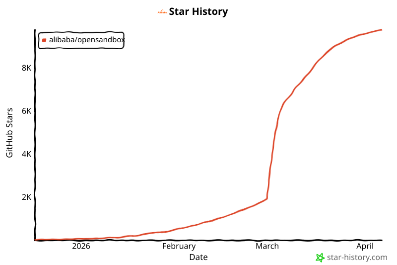

<div align="center">
  

  <h1>OpenSandbox</h1>

  <p align="center">
    <a href="https://trendshift.io/repositories/21828" target="_blank">
      
    </a>
  </p>

<p align="center">
  <a href="https://github.com/alibaba/OpenSandbox">
    
  </a>
  <a href="https://deepwiki.com/alibaba/OpenSandbox">
    
  </a>
  <a href="https://www.apache.org/licenses/LICENSE-2.0.html">
    
  </a>
  <a href="https://badge.fury.io/py/opensandbox">
    
  </a>
  <a href="https://badge.fury.io/js/@alibaba-group%2Fopensandbox">
    
  </a>
  <a href="https://landscape.cncf.io/?item=orchestration-management--scheduling-orchestration--opensandbox">
    
  </a>
  <a href="https://qr.dingtalk.com/action/joingroup?code=v1,k1,A4Bgl5q1I1eNU/r33D18YFNrMY108aFF38V+r19RJOM=&_dt_no_comment=1&origin=11">
    
  </a>
  <a href="https://github.com/alibaba/OpenSandbox/actions">
    
  </a>
  <a href="https://github.com/alibaba/OpenSandbox/actions">
    
  </a>
</p>

  <hr />
</div>

[文档](https://open-sandbox.ai/) | [中文文档](https://open-sandbox.ai/zh/)

OpenSandbox 是一个面向 AI 应用的**通用沙箱平台**，提供多语言 SDK、统一的沙箱 API 以及 Docker/Kubernetes 运行时，适用于编程代理、GUI 代理、代理评估、AI 代码执行和强化学习训练等场景。

OpenSandbox 现已入选 [CNCF Landscape](https://landscape.cncf.io/?item=orchestration-management--scheduling-orchestration--opensandbox)。

## 特性

- **多语言 SDK**：提供 Python、Java/Kotlin、JavaScript/TypeScript、C#/.NET、Go（路线图中）等多种语言的沙箱 SDK。
- **沙箱协议**：定义沙箱生命周期管理 API 和沙箱执行 API，便于扩展自定义沙箱运行时。
- **沙箱运行时**：内置生命周期管理，支持 Docker 和 [高性能 Kubernetes 运行时](./kubernetes)，既能本地运行，也支持大规模分布式调度。
- **沙箱环境**：内置命令执行、文件系统和代码解释器实现。示例涵盖编程代理（如 Claude Code）、浏览器自动化（Chrome、Playwright）和桌面环境（VNC、VS Code）。
- **网络策略**：统一的[入口网关](components/ingress)，支持多种路由策略，以及每个沙箱的[出口控制](components/egress)。
- **强隔离**：支持 gVisor、Kata Containers 和 Firecracker microVM 等安全容器运行时，增强沙箱工作负载与主机之间的隔离。详见[安全容器运行时指南](docs/secure-container.md)。

## 示例

### 基本沙箱操作 [Docker]

前置条件：

- Docker（本地运行必需）
- Python 3.10+（示例和本地运行时必需）

#### 1. 安装并配置沙箱服务器

```bash
uv pip install opensandbox-server
opensandbox-server init-config ~/.sandbox.toml --example docker
```

> 如果你更喜欢从源码构建，仍然可以克隆仓库进行开发，但你不再需要仅为启动服务器而克隆本仓库。
> 你还需要运行一个 Docker 实例。
> ```bash
> git clone https://github.com/alibaba/OpenSandbox.git && cd OpenSandbox/server
> cp opensandbox_server/examples/example.config.toml ~/.sandbox.toml
> uv sync && uv run python -m opensandbox_server.main
> ```

#### 2. 启动沙箱服务器

```bash
opensandbox-server

# Show help
# opensandbox-server -h
```

#### 3. 创建代码解释器并执行命令/代码

安装代码解释器 SDK

```bash
uv pip install opensandbox-code-interpreter
```

创建沙箱并执行命令和代码。

```python
import asyncio
from datetime import timedelta

from code_interpreter import CodeInterpreter, SupportedLanguage
from opensandbox import Sandbox
from opensandbox.models import WriteEntry

async def main() -> None:
    # 1. Create a sandbox
    sandbox = await Sandbox.create(
        "opensandbox/code-interpreter:v1.0.2",
        entrypoint=["/opt/opensandbox/code-interpreter.sh"],
        env={"PYTHON_VERSION": "3.11"},
        timeout=timedelta(minutes=10),
    )

    async with sandbox:

        # 2. Execute a shell command
        execution = await sandbox.commands.run("echo 'Hello OpenSandbox!'")
        print(execution.logs.stdout[0].text)

        # 3. Write a file
        await sandbox.files.write_files([
            WriteEntry(path="/tmp/hello.txt", data="Hello World", mode=644)
        ])

        # 4. Read a file
        content = await sandbox.files.read_file("/tmp/hello.txt")
        print(f"Content: {content}") # Content: Hello World

        # 5. Create a code interpreter
        interpreter = await CodeInterpreter.create(sandbox)

        # 6. Execute Python code (single-run, pass language directly)
        result = await interpreter.codes.run(
              """
                  import sys
                  print(sys.version)
                  result = 2 + 2
                  result
              """,
              language=SupportedLanguage.PYTHON,
        )

        print(result.result[0].text) # 4
        print(result.logs.stdout[0].text) # 3.11.14

    # 7. Cleanup the sandbox
    await sandbox.kill()

if __name__ == "__main__":
    asyncio.run(main())
```

### 更多示例

OpenSandbox 提供了涵盖 SDK 使用、代理集成、浏览器自动化和训练工作负载的示例。所有示例代码位于 `examples/` 目录下。

#### 🎯 基础示例

- **[code-interpreter](examples/code-interpreter/README.md)** - 沙箱中的端到端代码解释器 SDK 工作流。
- **[aio-sandbox](examples/aio-sandbox/README.md)** - 使用 OpenSandbox SDK 的一体化沙箱设置。
- **[agent-sandbox](examples/agent-sandbox/README.md)** - 在 Kubernetes 上使用 [kubernetes-sigs/agent-sandbox](https://github.com/kubernetes-sigs/agent-sandbox) 运行 OpenSandbox 工作负载的集成示例。
- **卷** — [Docker PVC / 命名卷](examples/docker-pvc-volume-mount/README.md)、[Docker OSSFS](examples/docker-ossfs-volume-mount/README.md)、[Kubernetes PVC](examples/kubernetes-pvc-volume-mount/README.md)：持久化和共享存储模式。

#### 🤖 编程代理集成

- **编程 CLI** — [Claude Code](examples/claude-code/README.md)、[Gemini CLI](examples/gemini-cli/README.md)、[OpenAI Codex CLI](examples/codex-cli/README.md)、[Qwen Code](examples/qwen-code/README.md)、[Kimi CLI](examples/kimi-cli/README.md)：在 OpenSandbox 中运行各家厂商的 CLI。
- **[langgraph](examples/langgraph/README.md)** - 使用 LangGraph 状态机工作流创建并运行沙箱任务，并支持失败回退重试。
- **[google-adk](examples/google-adk/README.md)** - 使用 OpenSandbox 工具进行文件读写和命令执行的 Google ADK 代理。
- **[nullclaw](examples/nullclaw/README.md)** - 在沙箱中启动 [Nullclaw](https://github.com/nullclaw/nullclaw) 网关。
- **[openclaw](examples/openclaw/README.md)** - 在沙箱中启动 OpenClaw 网关。

#### 🌐 浏览器和桌面环境

- **[chrome](examples/chrome/README.md)** - 支持 VNC 和 DevTools 访问的 Chromium 沙箱，用于自动化和调试。
- **[playwright](examples/playwright/README.md)** - Playwright + Chromium 无头抓取和测试示例。
- **[desktop](examples/desktop/README.md)** - 支持 VNC 访问的完整桌面环境沙箱。
- **[vscode](examples/vscode/README.md)** - 在沙箱中运行 code-server（VS Code Web）用于远程开发。

#### 🧠 机器学习和训练

- **[rl-training](examples/rl-training/README.md)** - 在沙箱中进行 DQN CartPole 训练，支持检查点和摘要输出。

更多详情请参阅 [examples](examples/README.md) 及各示例目录中的 README 文件。

## 项目结构

| 目录 | 描述                                                      |
|-----------|------------------------------------------------------------------|
| [`sdks/`](sdks/) | 多语言 SDK（Python、Java/Kotlin、TypeScript/JavaScript、C#/.NET） |
| [`specs/`](specs/README.md) | OpenAPI 规范和生命周期规范                      |
| [`server/`](server/README.md) | Python FastAPI 沙箱生命周期服务器                          |
| [`kubernetes/`](kubernetes/README.md) | Kubernetes 部署和示例                               |
| [`components/execd/`](components/execd/README.md) | 沙箱执行守护进程（命令和文件操作）          |
| [`components/ingress/`](components/ingress/README.md) | 沙箱流量入口代理                                    |
| [`components/egress/`](components/egress/README.md) | 沙箱网络出口控制                                   |
| [`sandboxes/`](sandboxes/) | 运行时沙箱实现                                   |
| [`examples/`](examples/README.md) | 集成示例和用例                               |
| [`oseps/`](oseps/README.md) | OpenSandbox 增强提案                                |
| [`docs/`](docs/) | 架构和设计文档                            |
| [`tests/`](tests/) | 跨组件端到端测试                                        |
| [`scripts/`](scripts/) | 开发和维护脚本                              |

详细架构请参阅 [docs/architecture.md](docs/architecture.md)。

## 文档

- [docs/architecture.md](docs/architecture.md) – 整体架构与设计理念
- [oseps/README.md](oseps/README.md) – OpenSandbox 增强提案
- SDK
  - 沙箱基础 SDK（[Java/Kotlin SDK](sdks/sandbox/kotlin/README.md)、[Python SDK](sdks/sandbox/python/README.md)、[JavaScript/TypeScript SDK](sdks/sandbox/javascript/README.md)、[C#/.NET SDK](sdks/sandbox/csharp/README.md)）- 包括沙箱生命周期、命令执行、文件操作
  - 代码解释器 SDK（[Java/Kotlin SDK](sdks/code-interpreter/kotlin/README.md)、[Python SDK](sdks/code-interpreter/python/README.md)、[JavaScript/TypeScript SDK](sdks/code-interpreter/javascript/README.md)、[C#/.NET SDK](sdks/code-interpreter/csharp/README.md)）- 代码解释器
- [specs/README.md](specs/README.md) - 沙箱生命周期 API 和沙箱执行 API 的 OpenAPI 定义
- [server/README.md](server/README.md) - 沙箱服务器启动和配置；支持 Docker 和 Kubernetes 运行时

## 许可证

本项目基于 [Apache 2.0 许可证](LICENSE) 开源。

## 路线图 [2026.03]

### SDK

- **沙箱客户端连接池** - 客户端沙箱连接池管理，提供预配置沙箱以实现 X 毫秒内获取环境。
- **Go SDK** - 用于沙箱生命周期管理、命令执行和文件操作的 Go 客户端 SDK。

### 沙箱运行时

- **持久卷** - 沙箱可挂载的持久卷（参见[提案 0003](oseps/0003-volume-and-volumebinding-support.md)）。
- **本地轻量沙箱** - 适用于直接在 PC 上运行的 AI 工具的轻量级沙箱。
- **安全容器** - 在容器内运行 AI 代理的安全沙箱。

### 部署

- **指南** - 自托管 Kubernetes 集群的部署指南。

## 联系与讨论

- Issues：通过 GitHub Issues 提交 Bug、功能请求或设计讨论
- 钉钉：加入 [OpenSandbox 技术讨论群](https://qr.dingtalk.com/action/joingroup?code=v1,k1,A4Bgl5q1I1eNU/r33D18YFNrMY108aFF38V+r19RJOM=&_dt_no_comment=1&origin=11)
## Star History

[](https://www.star-history.com/#alibaba/OpenSandbox&type=date&legend=top-left)
