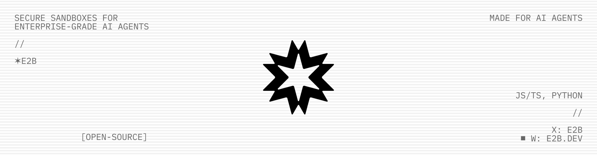
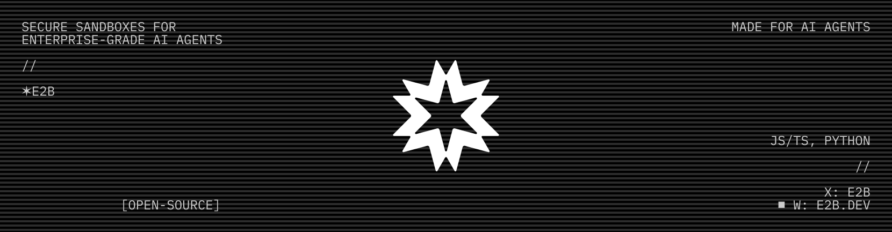

<!-- <p align="center">
  
</p> -->




<h4 align="center">
  <a href="https://pypi.org/project/e2b/">
    
  </a>
  <a href="https://www.npmjs.com/package/e2b">
    
  </a>
</h4>

<!---

--->
## 什么是 E2B？

[E2B](https://www.e2b.dev/) 是一个开源基础设施，允许你在云端安全的隔离沙箱中运行 AI 生成的代码。使用我们的 [JavaScript SDK](https://www.npmjs.com/package/e2b) 或 [Python SDK](https://pypi.org/project/e2b) 来启动和控制沙箱。

## 运行你的第一个沙箱

### 1. 安装 SDK

JavaScript / TypeScript
```
npm i e2b
```

Python
```
pip install e2b
```

### 2. 获取你的 E2B API 密钥
1. 在[这里](https://e2b.dev)注册 E2B。
2. 在[这里](https://e2b.dev/dashboard?tab=keys)获取你的 API 密钥。
3. 将你的 API 密钥设置为环境变量
```
E2B_API_KEY=e2b_***
```

### 3. 启动沙箱并运行命令

JavaScript / TypeScript
```ts
import Sandbox from 'e2b'

const sandbox = await Sandbox.create()
const result = await sandbox.commands.run('echo "Hello from E2B!"')
console.log(result.stdout) // Hello from E2B!
```

Python
```py
from e2b import Sandbox

with Sandbox.create() as sandbox:
    result = sandbox.commands.run('echo "Hello from E2B!"')
    print(result.stdout)  # Hello from E2B!
```

### 4. 使用代码解释器执行代码

如果你需要使用 [`runCode()`](https://e2b.dev/docs/code-interpreting)/[`run_code()`](https://e2b.dev/docs/code-interpreting) 执行代码，请安装 [Code Interpreter SDK](https://github.com/e2b-dev/code-interpreter)：

```
npm i @e2b/code-interpreter  # JavaScript/TypeScript
pip install e2b-code-interpreter  # Python
```

```ts
import { Sandbox } from '@e2b/code-interpreter'

const sandbox = await Sandbox.create()
const execution = await sandbox.runCode('x = 1; x += 1; x')
console.log(execution.text)  // outputs 2
```

### 5. 查看文档
访问 [E2B 文档](https://e2b.dev/docs)。

### 6. E2B Cookbook
访问我们的 [Cookbook](https://github.com/e2b-dev/e2b-cookbook/tree/main)，从结合不同 LLM 和 AI 框架的示例中获取灵感。

## 自托管

阅读[自托管指南](https://github.com/e2b-dev/infra/blob/main/self-host.md)，了解如何在你自己的环境中部署 [E2B 基础设施](https://github.com/e2b-dev/infra)。该基础设施使用 Terraform 部署。

支持的云服务商：
- 🟢 AWS
- 🟢 Google Cloud (GCP)
- [ ] Azure
- [ ] 通用 Linux 机器
