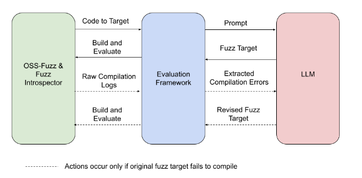
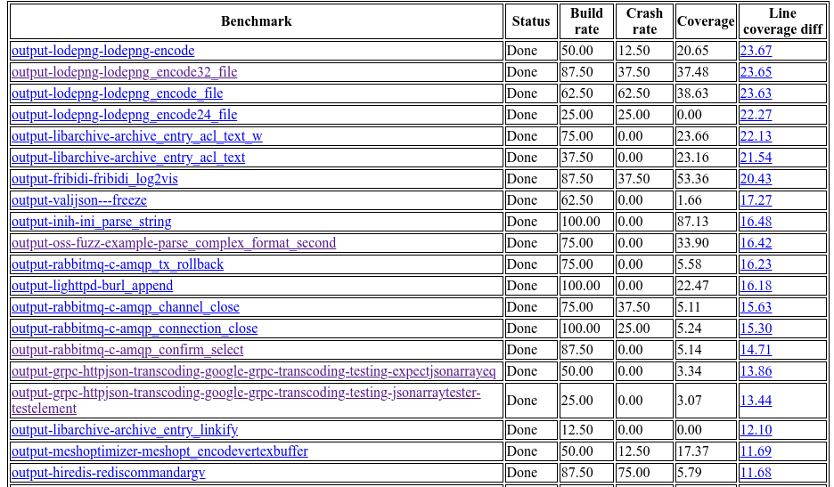

# Fuzz 目标生成与评估框架

本框架使用各种大型语言模型 (LLM) 为真实的 `C`/`C++/Java/Python` 项目生成 fuzz 目标，并通过 [`OSS-Fuzz` 平台](https://github.com/google/oss-fuzz)对其进行基准测试。

更多详情请参阅 [AI 驱动的模糊测试：突破漏洞猎杀壁垒](https://security.googleblog.com/2023/08/ai-powered-fuzzing-breaking-bug-hunting.html)：

当前支持的模型：
- Vertex AI code-bison
- Vertex AI code-bison-32k
- Gemini Pro
- Gemini Ultra
- Gemini Experimental
- Gemini 1.5
- OpenAI GPT-3.5-turbo
- OpenAI GPT-4
- OpenAI GPT-4o
- OpenAI GPT-4o-mini
- OpenAI GPT-4-turbo
- OpenAI GPT-3.5-turbo (Azure)
- OpenAI GPT-4 (Azure)
- OpenAI GPT-4o (Azure)

生成的 fuzz 目标会基于生产环境中的最新数据，从以下四项指标进行评估：
- 可编译性
- 运行时崩溃
- 运行时覆盖率
- 与 `OSS-Fuzz` 中现有人工编写 fuzz 目标相比的运行时行覆盖率差异。

以下是 2024 年 1 月 31 日的示例实验结果。
该实验包含来自 297 个开源项目的 [1300+ 基准测试](./benchmark-sets/all)。

总体而言，本框架成功利用 LLM 为 160 个 C/C++ 项目生成了有效的 fuzz 目标（产生了非零覆盖率增长）。与现有人工编写的目标相比，最大行覆盖率增长达到 29%。

请注意，这些报告不对外公开，因为它们可能包含未披露的漏洞。

## 使用方法

请查看我们的详细[使用指南](./USAGE.md)，了解如何运行本框架并根据结果生成报告。

## 独立代理执行与评估
您也可以使用集成的代理执行框架，单独执行或评估各个代理，而无需运行完整实验。请参阅[框架文档](./agent_tests/readme.md)，了解如何运行单个代理或代理序列的详细说明。

## 合作
对研究或开源社区合作感兴趣？
请随时创建 Issue 或发送邮件至：oss-fuzz-team@google.com。

## 发现的漏洞

迄今为止，我们已报告了 30 个由本框架自动生成的目标发现的新 bug/漏洞：
| 项目 |    漏洞    |    LLM    | 提示词构建器 | 目标判定准则 |
| ------- | --------- | --------- | --------------- | ------- |
| [`cJSON`](https://github.com/google/oss-fuzz/tree/master/projects/cjson) | [越界读取](https://github.com/DaveGamble/cJSON/issues/800) | Vertex AI | [Default](prompts/template_xml) | 远可达，低覆盖率 |
| [`libplist`](https://github.com/google/oss-fuzz/tree/master/projects/libplist) | [越界读取](https://github.com/libimobiledevice/libplist/issues/244) | Vertex AI | [Default](prompts/template_xml) | 远可达，低覆盖率 |
| [`hunspell`](https://github.com/google/oss-fuzz/tree/master/projects/hunspell) | [越界读取](https://github.com/hunspell/hunspell/issues/996) | Vertex AI | [default](prompts/template_xml) | 远可达，低覆盖率 |
| [`zstd`](https://github.com/google/oss-fuzz/tree/master/projects/zstd) | [越界写入](https://bugs.chromium.org/p/oss-fuzz/issues/detail?id=67497) | Vertex AI | [default](prompts/template_xml) | 远可达，低覆盖率 |
| [`gdbm`](https://github.com/google/oss-fuzz/tree/master/projects/gdbm) | [栈缓冲区下溢](https://bugs.chromium.org/p/oss-fuzz/issues/detail?id=67483) | Vertex AI | [default](prompts/template_xml) | 远可达，低覆盖率 |
| [`hoextdown`](https://github.com/google/oss-fuzz/tree/master/projects/hoextdown) | [使用未初始化内存](https://bugs.chromium.org/p/oss-fuzz/issues/detail?id=67516) | Vertex AI | [default](prompts/template_xml) | 远可达，低覆盖率 |
| [`pjsip`](https://github.com/google/oss-fuzz/tree/master/projects/pjsip) | [越界读取](https://bugs.chromium.org/p/oss-fuzz/issues/detail?id=71356) | Vertex AI | [Default](prompts/template_xml) | 低覆盖率 + fuzz 关键词 + 简单参数远可达 |
| [`pjsip`](https://github.com/google/oss-fuzz/tree/master/projects/pjsip)  | [越界读取](https://bugs.chromium.org/p/oss-fuzz/issues/detail?id=71357) | Vertex AI | [Default](prompts/template_xml) | 低覆盖率 + fuzz 关键词 + 简单参数远可达 |
| [`gpac`](https://github.com/google/oss-fuzz/tree/master/projects/gpac) | [越界读取](https://bugs.chromium.org/p/oss-fuzz/issues/detail?id=71358) | Vertex AI | [Default](prompts/template_xml) | 低覆盖率 + fuzz 关键词 + 简单参数远可达 |
| [`gpac`](https://github.com/google/oss-fuzz/tree/master/projects/gpac)  | [越界读/写](https://bugs.chromium.org/p/oss-fuzz/issues/detail?id=71542) | Vertex AI | [Default](prompts/template_xml) | 全部 |
| [`gpac`](https://github.com/google/oss-fuzz/tree/master/projects/gpac)  | [越界读取](https://bugs.chromium.org/p/oss-fuzz/issues/detail?id=71543) | Vertex AI | [Default](prompts/template_xml) | 全部 |
| [`gpac`](https://github.com/google/oss-fuzz/tree/master/projects/gpac)  | [越界读取](https://bugs.chromium.org/p/oss-fuzz/issues/detail?id=71544) | Vertex AI | [Default](prompts/template_xml) | 全部 |
| [`sqlite3`](https://github.com/google/oss-fuzz/tree/master/projects/sqlite3) | [越界读取](https://issues.oss-fuzz.com/issues/42538590) | Vertex AI | [Default](prompts/template_xml) | 全部 |
| [`htslib`](https://github.com/google/oss-fuzz/tree/master/projects/htslib) | [越界读取](https://bugs.chromium.org/p/oss-fuzz/issues/detail?id=71740) | Vertex AI | [Default](prompts/template_xml) | 全部 |
| [`libical`](https://github.com/google/oss-fuzz/tree/master/projects/libical) | [越界读取](https://bugs.chromium.org/p/oss-fuzz/issues/detail?id=71741) | Vertex AI | [Default](prompts/template_xml) | 全部 |
| [`croaring`](https://github.com/google/oss-fuzz/tree/master/projects/croaring) | [越界读取](https://bugs.chromium.org/p/oss-fuzz/issues/detail?id=71738) | Vertex AI | [Test-to-harness](prompts/template_xml) | 全部 |
| [`openssl`](https://github.com/google/oss-fuzz/tree/master/projects/openssl) | [CVE-2024-9143](https://www.cve.org/CVERecord?id=CVE-2024-9143) - [越界读/写](https://g-issues.oss-fuzz.com/issues/42538437) | Vertex AI | [Default](prompts/template_xml) | 全部 |
| [`liblouis`](https://github.com/google/oss-fuzz/tree/master/projects/liblouis) | [使用未初始化内存](https://bugs.chromium.org/p/oss-fuzz/issues/detail?id=71354) | Vertex AI | Test-to-harness | 测试标识符 |
| [`libucl`](https://github.com/google/oss-fuzz/tree/master/projects/libucl) | [越界读取](https://bugs.chromium.org/p/oss-fuzz/issues/detail?id=71359) | Vertex AI | [Default](prompts/template_xml) | 低覆盖率 + fuzz 关键词 + 简单参数远可达 |
| [`openbabel`](https://github.com/google/oss-fuzz/tree/master/projects/openbabel) | [释放后使用](https://bugs.chromium.org/p/oss-fuzz/issues/detail?id=71360) | Vertex AI | [Default](prompts/template_xml) | 低覆盖率 + fuzz 关键词 + 简单参数远可达 |
| [`libyang`](https://github.com/google/oss-fuzz/tree/master/projects/libyang) | [越界读取](https://bugs.chromium.org/p/oss-fuzz/issues/detail?id=71619) | Vertex AI | [Default](prompts/template_xml) | 全部 |
| [`openbabel`](https://github.com/google/oss-fuzz/tree/master/projects/openbabel) | [越界读取](https://bugs.chromium.org/p/oss-fuzz/issues/detail?id=71650) | Vertex AI | [Default](prompts/template_xml) | 全部 |
| [`exiv2`](https://github.com/google/oss-fuzz/tree/master/projects/exiv2) | [越界读取](https://bugs.chromium.org/p/oss-fuzz/issues/detail?id=71759) | Vertex AI | [Default](prompts/template_xml) | 全部 |
| 未披露 | Java RCE（等待维护者审核） | Vertex AI |  [Default](prompts/template_xml) | 远可达，低覆盖率 |
| 未披露 | 正则表达式 DoS（等待维护者审核） | Vertex AI |  [Default](prompts/template_xml) | 远可达，低覆盖率 |
| 未披露 | [越界读取](https://issues.oss-fuzz.com/issues/370872803) | Vertex AI | [Default](prompts/template_xml) | 全部 |
| 未披露 | [越界写入](https://issues.oss-fuzz.com/issues/378009361) | Vertex AI | [Default](prompts/template_xml) | 全部 |
| 未披露 | [越界读取](https://issues.oss-fuzz.com/issues/391234167) | Vertex AI | [Default](prompts/template_xml) | 全部 |
| 未披露 | [越界读取](https://issues.oss-fuzz.com/issues/391453674) | Vertex AI | [Default](prompts/template_xml) | 全部 |
| 未披露 | [释放后使用](https://issues.oss-fuzz.com/issues/391456091) | Vertex AI | 代理提示词 | 全部 |

这些漏洞只能通过新生成的目标发现，现有 OSS-Fuzz 目标无法触达这些代码路径。

## 当前按项目划分的最高覆盖率提升

| 项目 | 总覆盖率增长	| 总相对增长	| OSS-Fuzz-gen 总覆盖行数 | OSS-Fuzz-gen 新覆盖行数 | 现有覆盖行数 | 项目总行数 |
| --------| ------------------- | ------------------- | -------------------------------- | ------------------------------ | ---------------------- | ------------------- |
| phmap | 98.42% | 205.75% | 1601 | 1181 | 574 | 1120 |
| usbguard | 97.62% | 26.04% | 24550 | 5463 | 20979 | 3564 |
| onednn | 96.67% | 7057.14% | 5434 | 5434 | 77 | 210 |
| avahi | 82.06% | 155.90% | 3358 | 2814 | 1805 | 3046 |
| pugixml | 72.98% | 194.95% | 9015 | 6646 | 3409 | 7662 |
| librdkafka | 66.88% | 845.57% | 5019 | 4490 | 531 | 1169 |
| casync | 66.75% | 903.23% | 1171 | 1120 | 124 | 1678 |
| tomlplusplus | 61.06% | 331.10% | 4755 | 3652 | 1103 | 5981 |
| astc-encoder | 59.35% | 177.88% | 2726 | 1745 | 981 | 2940 |
| mruby | 48.56% | 0.00% | 34493 | 34493 | 0 | 71038 |
| arduinojson | 42.10% | 85.80% | 3344 | 1800 | 2098 | 4276 |
| json | 41.13% | 66.51% | 5051 | 3339 | 5020 | 8119 |
| double-conversion | 40.40% | 88.12% | 1663 | 779 | 884 | 1928 |
| tinyobjloader | 38.26% | 77.01% | 1157 | 717 | 931 | 1874 |
| glog | 38.18% | 58.69% | 895 | 331 | 564 | 867 |
| cppitertools | 35.78% | 45.07% | 253 | 151 | 335 | 422 |
| eigen | 35.38% | 190.70% | 2643 | 1947 | 1021 | 5503 |
| glaze | 34.55% | 30.06% | 2920 | 2416 | 8036 | 6993 |
| rapidjson | 31.83% | 148.07% | 1585 | 958 | 647 | 3010 |
| libunwind | 30.58% | 83.25% | 2899 | 1342 | 1612 | 4388 |
| openh264 | 30.07% | 50.14% | 6607 | 5751 | 11470 | 19123 |

\* "项目总行数" 衡量的是由 OSS-Fuzz 中已有的人工编写 fuzz 目标编译和链接的被测项目源代码。

\* “总覆盖率增长” 以“项目总行数”为分母计算。“总相对增长”是相对于原有覆盖行数的覆盖率增幅。

\* 编译新 fuzz 目标时可能会包含被测项目的额外代码，从而导致较高的百分比增长。

## 引用本工作
请点击本 GitHub 页面右侧的“引用本仓库”按钮获取引用详情。
