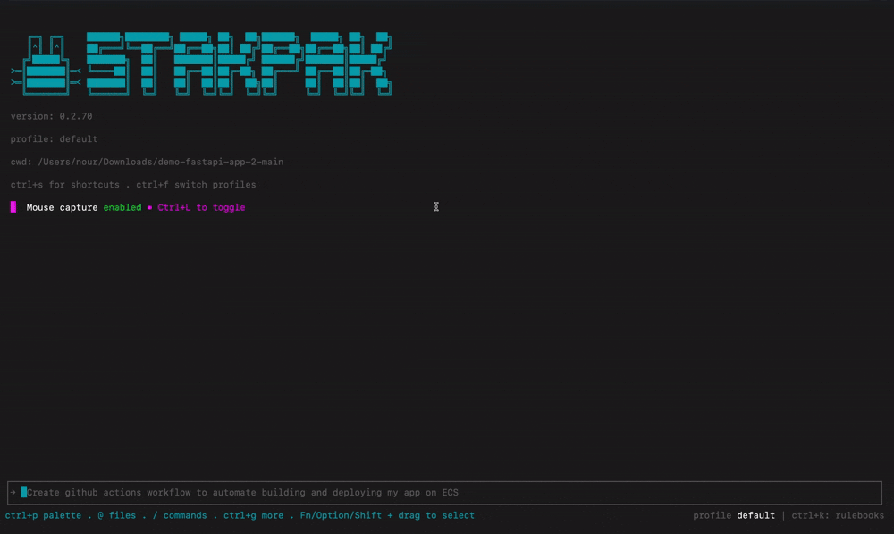

<p align="center">
  <picture>
    <source srcset="assets/003-stakpak-light-64a2f28f80.png" media="(prefers-color-scheme: dark)">
    
  </picture>
</p>

<h3 align="center">让代码自动交付。</h3>

<p align="center">
一个开源代理，7x24 小时驻留在你的机器上，保持应用持续运行，只在需要人工介入时才通知你。兼具 PaaS 的所有优势，却没有任何供应商锁定。
</p>

<br />

<!-- Badges Section -->
<p align="center">
  <!-- Built With Ratatui -->
  <a href="https://ratatui.rs/"></a>
  <!-- License -->
  
  <!-- Release (latest GitHub tag) -->
  
  <!-- Build CI status (GitHub Actions) -->
  
  <!-- Downloads (GitHub releases total) -->
  
  <!-- Documentation -->
  <a href="https://stakpak.gitbook.io/docs/"></a>
  <!-- Discord Community -->
  <a href="https://discord.gg/QTZjETP7GB"></a>

:star: 帮助我们触达更多开发者，壮大 Stakpak 社区。请给这个仓库点个 Star！



</p>

### 立即体验 Stakpak
```bash
curl -sSL https://stakpak.dev/install.sh | sh # 安装 Stakpak
stakpak init # 理解你的应用和技术栈
stakpak autopilot up # 在后台启动 7x24 小时运行的自主代理
```
[更多安装选项...](https://github.com/stakpak/agent#installation)

大多数 AI 代理无法胜任 DevOps 工作。一个失误，生产环境就完了。
Stakpak 与众不同：
- **密钥替换** - LLM 使用你的凭证时永远不会看到真实值
- **Warden 安全护栏** - 网络级别的策略在破坏性操作执行前将其拦截
- **内置 DevOps 知识库** - Stakpak Rulebooks 中精心策划的 DevOps 知识库

生成基础设施代码、调试 Kubernetes、配置 CI/CD、自动化部署——所有这些都不需要把生产环境的钥匙交给 LLM。

### 🤖 Autopilot（7x24 小时自主运行时）

使用新的生命周期别名，一条命令即可完成设置/启动/停止：

```bash
stakpak up        # 等同于：stakpak autopilot up
stakpak down      # 等同于：stakpak autopilot down
```

你也可以使用标准子命令：

```bash
stakpak autopilot up
stakpak autopilot status
stakpak autopilot logs
stakpak autopilot down
stakpak autopilot doctor
```

#### Autopilot 前置条件

在远程 VM 上运行 autopilot 之前：

- 必须安装 Docker 且当前用户可访问
- 建议至少 2GB 内存，以确保 autopilot 和沙箱稳定运行
- 在小型 Linux 主机上强烈建议启用 Swap
- Linux 用户服务可能需要 linger 以在注销后保持运行

`stakpak up` 现在会在启动前运行预检，`stakpak autopilot doctor` 可用作首次启动前的部署就绪检查：

```bash
stakpak autopilot doctor
stakpak up
```

另见：[cli/README.md](cli/README.md)

#### 统一配置（profiles + autopilot 联动）

- `~/.stakpak/config.toml`：profile 行为（`model`、`allowed_tools`、`auto_approve`、`system_prompt`、`max_turns`、提供商凭证）
- `~/.stakpak/autopilot.toml`：运行时联动配置（`schedules`、`channels`、服务/服务器设置）

在 schedules/channels 上使用 `profile = "name"`，将行为定义保留在 profile 中。

```bash
# schedule profile
stakpak autopilot schedule add health --cron '*/5 * * * *' --prompt 'Check health' --profile monitoring

# channel profile
stakpak autopilot channel add slack --bot-token "$SLACK_BOT_TOKEN" --app-token "$SLACK_APP_TOKEN" --profile ops
```

完整设置指南：[cli/README.md](cli/README.md)

## 🔒 安全加固

- **双向 TLS (mTLS)** - 端到端加密的 MCP
- **动态密钥替换** - AI 可以读取/写入/比较密钥，而无需看到实际值
- **安全密码生成** - 生成加密安全的密码，可配置复杂度
- **隐私模式** - 脱敏处理敏感数据，如 IP 地址和 AWS 账户 ID

## 🛠️ 为 DevOps 工作而生

- **异步任务管理** - 运行端口转发和服务器等后台命令，具备完整的跟踪和取消能力
- **实时进度流式传输** - 长时间运行的进程（Docker 构建、部署）实时流式传输进度更新
- **基础设施代码索引** - 自动本地索引和语义搜索 Terraform、Kubernetes、Dockerfile 和 GitHub Actions
- **文档研究代理** - 内置 Web 搜索，用于技术文档、云服务商和开发框架
- **子代理** - 专门的代码探索和沙箱分析研究代理，具有不同的工具访问级别（通过 `--enable-subagents` 标志启用）
- **批量消息审批** - 一次审批多个工具调用，高效执行工作流
- **可逆文件操作** - 所有文件修改自动备份，支持恢复

## 🧠 自适应智能

- **Rule Books** - 通过内部标准操作流程、操作手册和组织策略定制代理行为
- **持久化知识** - 代理从交互中学习，记住事件、资源和环境细节，以适应你的工作流

## 安装

### 所有安装选项（Linux、MacOS、Windows）

[查看文档](https://stakpak.gitbook.io/docs/get-started/installing-stakpak-cli)

### Homebrew（Linux 和 MacOS）

```bash
brew tap stakpak/stakpak
brew install stakpak
```

更新方式：

```bash
brew update
brew upgrade stakpak
```

### 二进制发布版

从 [GitHub Releases](https://github.com/stakpak/agent/releases) 下载适合你平台的最新二进制文件。

### Docker

此镜像包含代理日常 DevOps 任务所需的最流行的 CLI 工具，如 docker、kubectl、aws cli、gcloud、azure cli 等。

```bash
docker pull ghcr.io/stakpak/agent:latest
```

## 使用方法
你可以[使用自己的 Anthropic 或 OpenAI API 密钥](#option-b-running-without-a-stakpak-api-key)、[自定义 OpenAI 兼容端点](#option-b-running-without-a-stakpak-api-key)，或[使用 Stakpak API 密钥](#option-a-running-with-a-stakpak-api-key)。

### 方式 A：使用 Stakpak API 密钥运行（无需信用卡）

直接运行 `stakpak` 并按照提示操作，系统会为你创建新的 API 密钥。
```bash
stakpak
```

> Brave 浏览器用户在 API 密钥创建流程中，可能会遇到自动重定向到 localhost 端口的问题。如果你遇到这种情况：
>
> 请从浏览器中复制新密钥，并将其粘贴到终端里

#### 非交互式设置（CI/脚本）

```bash
stakpak auth login --api-key $STAKPAK_API_KEY
```

#### 或设置环境变量

```bash
export STAKPAK_API_KEY=<mykey>
```

#### 查看当前账户（可选）

```bash
stakpak account
```

### 方式 B：不使用 Stakpak API 密钥运行

#### 非交互式设置（CI/脚本）

```bash
# Anthropic
stakpak auth login --provider anthropic --api-key $ANTHROPIC_API_KEY

# OpenAI
stakpak auth login --provider openai --api-key $OPENAI_API_KEY

# Gemini
stakpak auth login --provider gemini --api-key $GEMINI_API_KEY
```

#### 手动配置

创建 `~/.stakpak/config.toml`，选择以下配置之一：

**选项 1：自带密钥 (BYOK)** - 使用你的 Anthropic/OpenAI API 密钥：
```toml
[profiles.byok]
provider = "local"

# 统一的模型首选字段
model = "anthropic/claude-sonnet-4-5"

# 内置提供商；凭证也可通过环境变量设置
# (ANTHROPIC_API_KEY, OPENAI_API_KEY, GEMINI_API_KEY)
[profiles.byok.providers.anthropic]
type = "anthropic"
api_key = "sk-ant-..."

[profiles.byok.providers.openai]
type = "openai"
api_key = "sk-..."

[profiles.byok.providers.gemini]
type = "gemini"
api_key = "..."

[settings]
```

**选项 2：自带 LLM** - 使用本地 OpenAI 兼容端点（如 Ollama、LM Studio）：
```toml
[profiles.offline]
provider = "local"

# 自定义提供商模型使用格式：provider_key/model_name
model = "offline/qwen/qwen3-coder-30b"

# 提供商键 "offline" 会成为模型前缀
[profiles.offline.providers.offline]
type = "custom"
api_endpoint = "http://localhost:11434/v1"
# 对于本地提供商，`api_key` 是可选的

[settings]
```

**选项 3：混合使用内置和自定义提供商**：
```toml
[profiles.hybrid]
provider = "local"

# 统一模型字段（带 provider 前缀）
model = "anthropic/claude-sonnet-4-5"

[profiles.hybrid.providers.anthropic]
type = "anthropic"
# 使用 ANTHROPIC_API_KEY 环境变量

[profiles.hybrid.providers.offline]
type = "custom"
api_endpoint = "http://localhost:11434/v1"

[settings]
```

然后使用你的 profile 运行：
```bash
stakpak --profile byok
# 或
stakpak --profile offline
# 或
stakpak --profile hybrid
```

### 启动 Stakpak 代理 TUI

```bash
# 打开 TUI
stakpak
# 从检查点恢复执行
stakpak -c <checkpoint-id>
```

### 使用 Docker 启动 Stakpak 代理 TUI

```bash
docker run -it --entrypoint stakpak ghcr.io/stakpak/agent:latest
# 用于容器化任务（需要挂载 Docker socket）
docker run -it \
   -v "/var/run/docker.sock":"/var/run/docker.sock" \
   -v "{your app path}":"/agent/" \
   --entrypoint stakpak ghcr.io/stakpak/agent:latest
```

### MCP 模式

你可以将 Stakpak 作为安全的 MCP 代理使用，或通过 [MCP](https://modelcontextprotocol.io/) 服务器暴露其安全加固的工具。

#### MCT 服务器工具

- **本地模式 (`--tool-mode local`)** - 仅文件操作和命令执行（无需 API 密钥）
- **远程模式 (`--tool-mode remote`)** - AI 驱动的代码生成和搜索工具（需要 API 密钥）
- **组合模式 (`--tool-mode combined`)** - 本地和远程工具兼具（默认，需要 API 密钥）

#### 启动 MCP 服务器

```bash
# 仅本地工具（无需 API 密钥，默认启用 mTLS）
stakpak mcp start --tool-mode local

# 仅远程工具（为 DevOps 优化的 AI 工具）
stakpak mcp start --tool-mode remote

# 组合模式（默认，包含全部工具并启用完整安全机制）
stakpak mcp start

# 禁用 mTLS（不建议在生产环境使用）
stakpak mcp start --disable-mcp-mtls
```

MCP 服务器的额外标志：

- `--disable-secret-redaction` – **不推荐**；在控制台以明文打印密钥
- `--privacy-mode` – 脱敏处理额外的隐私数据，如 IP 地址和 AWS 账户 ID
- `--enable-slack-tools` – 启用实验性的 Slack 工具

#### MCP 代理服务器

Stakpak 还包含一个 MCP 代理服务器，可以使用配置文件将连接多路复用到多个上游 MCP 服务器。

```bash
# 通过自动发现配置启动 MCP 代理
stakpak mcp proxy

# 使用显式配置文件启动 MCP 代理
stakpak mcp proxy --config-file ~/.stakpak/mcp.toml

# 禁用密钥脱敏（不推荐，密钥会以明文打印到日志中）
stakpak mcp proxy --disable-secret-redaction

# 启用隐私模式以脱敏 IP、账户 ID 等信息
stakpak mcp proxy --privacy-mode
```

### 代理客户端协议 (ACP)

ACP 是一种标准化协议，使 AI 代理能够直接与 Zed 等代码编辑器集成，提供无缝的 AI 驱动开发辅助。

#### ACP 在 Stakpak 中提供的功能

- **实时 AI 对话** - 具有上下文感知的自然语言 AI 助手
- **实时代码分析** - AI 可以实时读取、理解和修改你的代码库
- **工具执行** - AI 可以运行命令、编辑文件、搜索代码和执行开发任务
- **会话持久化** - 在编辑器会话间保持对话上下文
- **流式响应** - 实时 AI 响应和进度更新
- **代理计划** - 可视化任务分解和进度跟踪

#### 安装与设置

1. **安装 Stakpak**（如果尚未安装）
2. **配置 Zed 编辑器** - 添加到 `~/.config/zed/settings.json`：

```json
{
  "agent_servers": {
    "Stakpak": {
      "command": "stakpak",
      "args": ["acp"],
      "env": {}
    }
  }
}
```

3. **启动 ACP 代理**：

```bash
stakpak acp
```

4. **在 Zed 中使用** - 点击 Assistant (✨) → `+` → `New stakpak thread`

### Rulebooks 管理

使用 Stakpak Rulebooks 管理你的标准操作流程 (SOP)、操作手册和运行手册。Rulebooks 用于定制代理行为，并提供特定上下文下的指导。

```bash
# List all rulebooks
stakpak rulebooks get
# or use the short alias
stakpak rb get

# Get a specific rulebook
stakpak rb get stakpak://my-org/deployment-guide.md

# Create or update a rulebook from a markdown file
stakpak rb apply my-rulebook.md

# Delete a rulebook
stakpak rb delete stakpak://my-org/old-guide.md
```

#### Rulebook 格式

Rulebook 是带有 YAML frontmatter 的 Markdown 文件：

```markdown
---
uri: stakpak://my-org/deployment-guide.md
description: Standard deployment procedures for production
tags:
  - deployment
  - production
  - sop
---

# Deployment Guide

Your deployment procedures and guidelines here...
```

### Shell 模式

从输入栏显式执行系统命令。

[查看 Shell 模式文档](docs/shell_mode.md)，了解后台与前台执行的详细信息。

## 平台测试

### Windows

Windows CLI 功能的综合测试报告，包括安装、配置以及与 WSL2 和 Docker 的集成。

[查看 Windows 测试报告](platform-testing/windows-testing-report.md)

---

## ⭐ 喜欢我们在做的事？

如果我们的代理帮你节省了时间，或让你的 DevOps 工作更轻松，
**考虑在 GitHub 上给我们点个 Star — 这对我们真的很有帮助！**

## [](https://github.com/stakpak/agent/stargazers)
