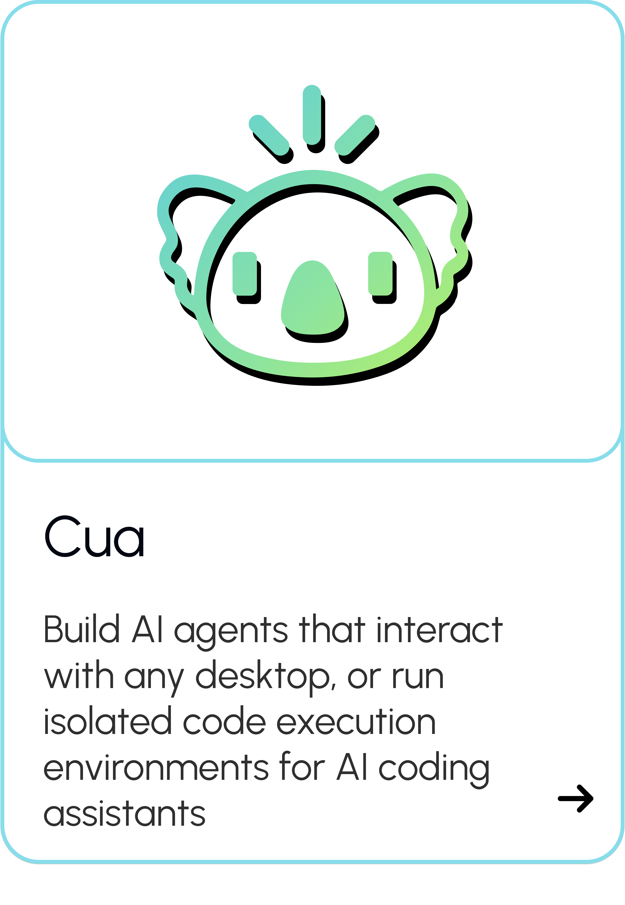
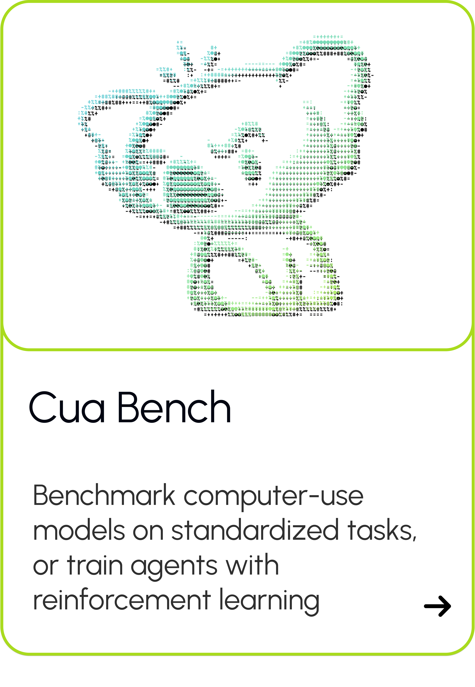
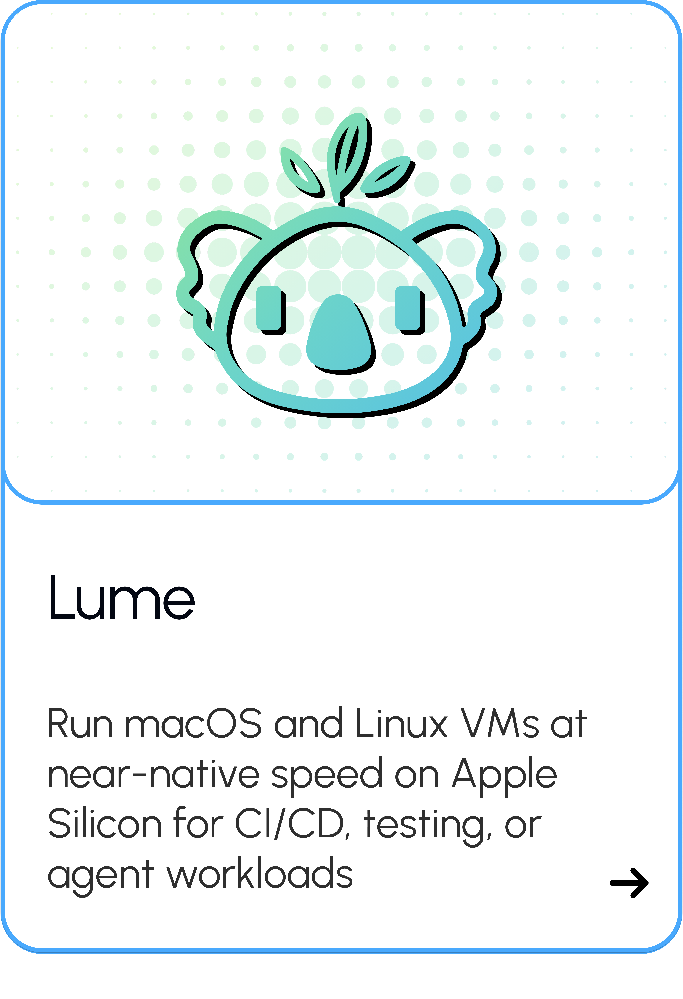
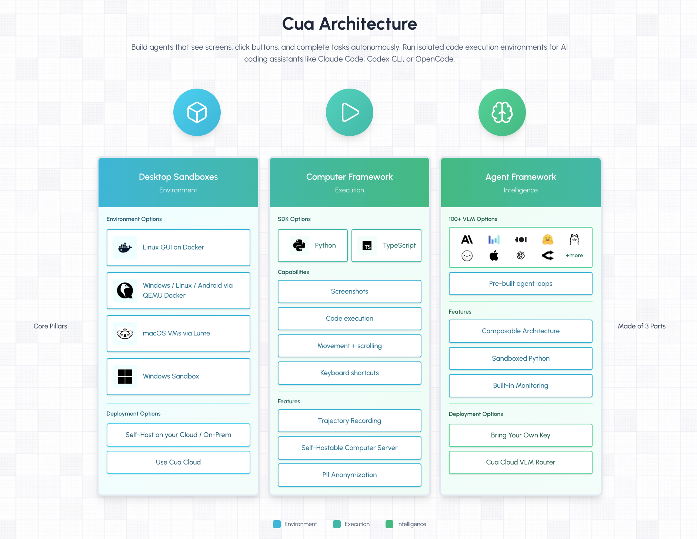
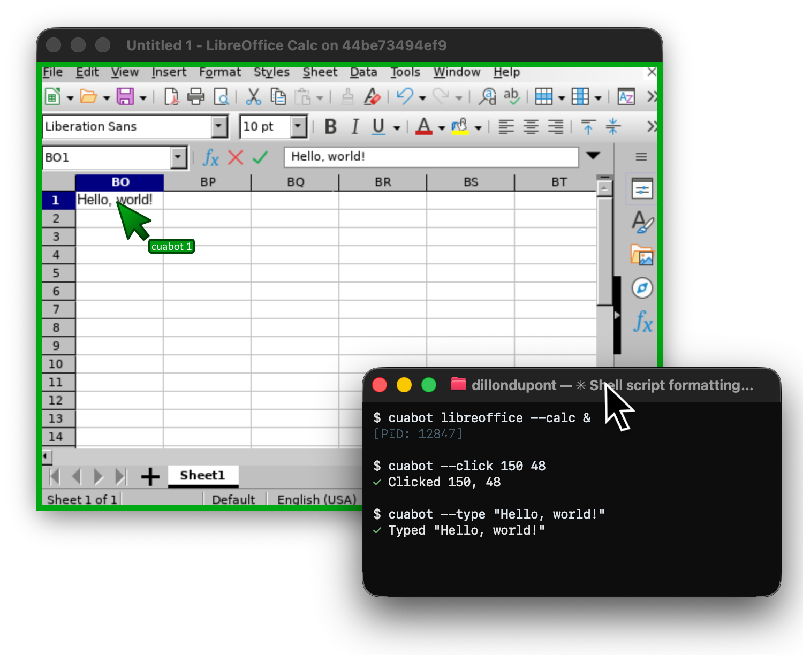
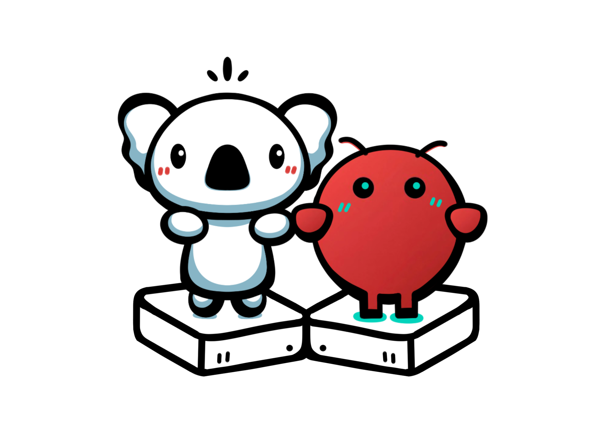
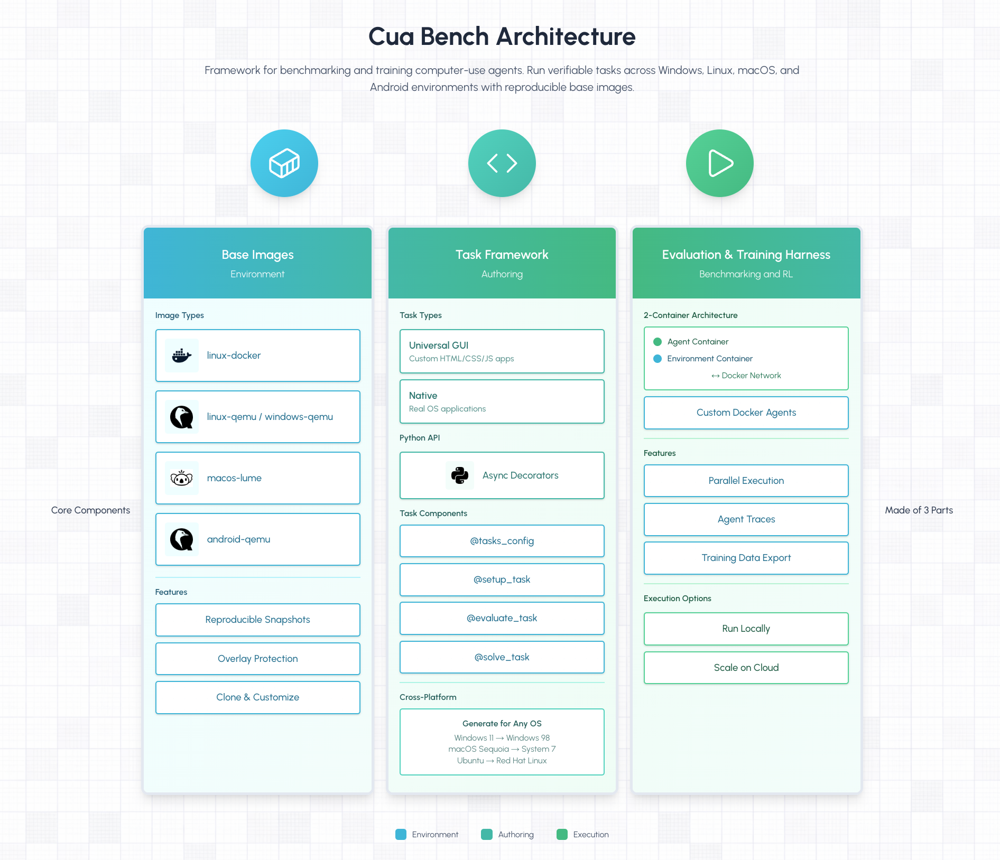
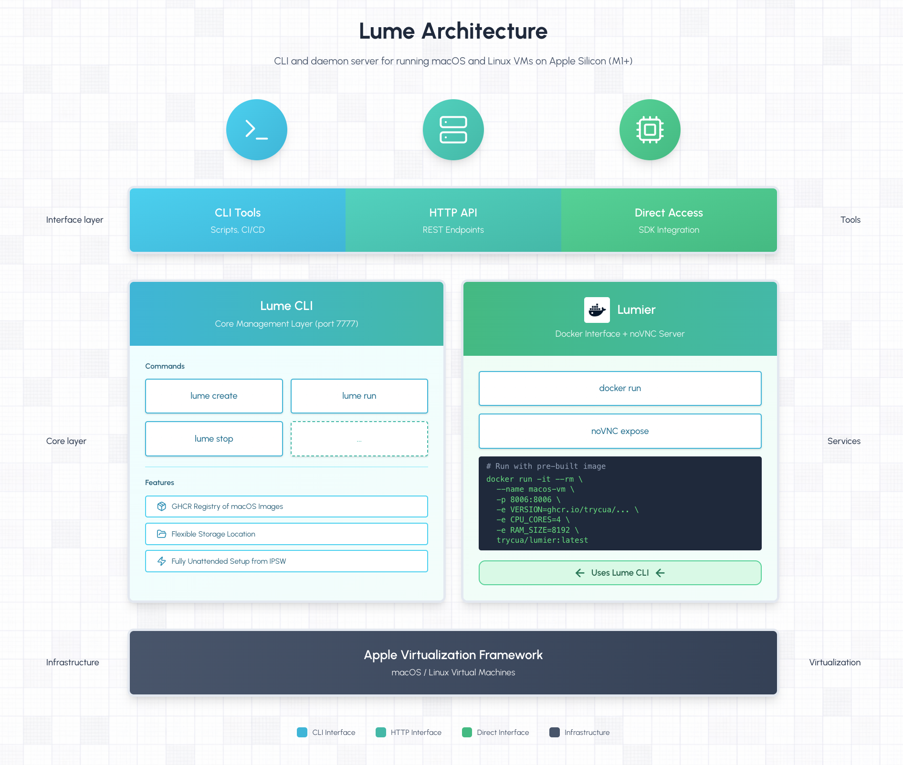
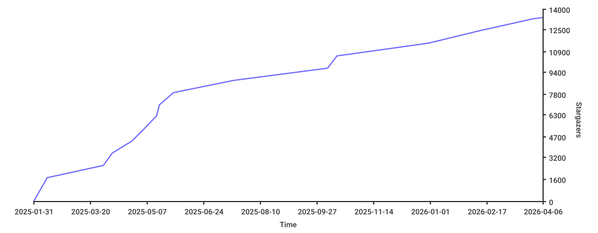
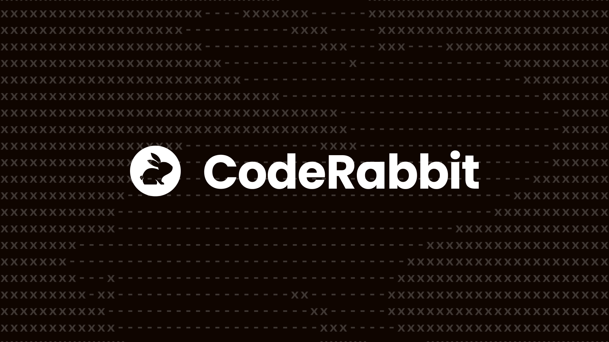

<div align="center">
  <a href="https://cua.ai" target="_blank" rel="noopener noreferrer">
    <picture>
      <source media="(prefers-color-scheme: dark)" alt="Cua logo" width="150" srcset="assets/013-logo-white-ed34356fdd.svg">
      <source media="(prefers-color-scheme: light)" alt="Cua logo" width="150" srcset="assets/002-logo-black-e0155b81d0.svg">
      
    </picture>
  </a>

  <p align="center">Build, benchmark, and deploy agents that use computers</p>

  <p align="center">
    <a href="https://cua.ai" target="_blank" rel="noopener noreferrer"></a>
    <a href="https://discord.com/invite/cua-ai" target="_blank" rel="noopener noreferrer"></a>
    <a href="https://x.com/trycua" target="_blank" rel="noopener noreferrer"></a>
    <a href="https://cua.ai/docs" target="_blank" rel="noopener noreferrer"></a>
    <br>
<a href="https://trendshift.io/repositories/13685" target="_blank"></a>
  </p>

</div>

## Choose Your Path

<div align="center">
  <table>
    <tr>
      <td align="center">
        <a href="#cua---agentic-ui-automation--code-execution">
          <picture>
            <source media="(prefers-color-scheme: dark)" srcset="assets/014-card-cua-dark-4fccb3962c.png">
            <source media="(prefers-color-scheme: light)" srcset="assets/003-card-cua-light-607c488f1a.png">
            
          </picture>
        </a>
      </td>
      <td align="center">
        <a href="#cua-bench---benchmarks--rl-environments">
          <picture>
            <source media="(prefers-color-scheme: dark)" srcset="assets/015-card-cua-bench-dark-2af7276825.png">
            <source media="(prefers-color-scheme: light)" srcset="assets/004-card-cua-bench-light-fffa647c47.png">
            
          </picture>
        </a>
      </td>
      <td align="center">
        <a href="#lume---macos-virtualization">
          <picture>
            <source media="(prefers-color-scheme: dark)" srcset="assets/016-card-lume-dark-2d7b9144b0.png">
            <source media="(prefers-color-scheme: light)" srcset="assets/005-card-lume-light-5d5d62a9e0.png">
            
          </picture>
        </a>
      </td>
    </tr>
    <tr>
      <td colspan="3" align="center">
        <a href="https://cua.ai/docs/cuabot/guide/getting-started/introduction">
          <picture>
            <source media="(prefers-color-scheme: dark)" srcset="assets/017-card-cua-bot-dark-56d6149d7c.png">
            <source media="(prefers-color-scheme: light)" srcset="assets/006-card-cua-bot-light-0bae34b2ae.png">
            
          </picture>
        </a>
      </td>
    </tr>
  </table>
</div>

---

## Cua - Agent-Ready Sandboxes for Any OS

Build agents that see screens, click buttons, and complete tasks autonomously. One API for any VM or container image — cloud or local.

```sh
pip install cua
```

<!--  -->

```python
# Requires Python 3.11 or later
from cua import Sandbox, Image

# Same API regardless of OS or runtime
async with Sandbox.ephemeral(Image.linux()) as sb:   # or .macos() .windows() .android()
    result = await sb.shell.run("echo hello")
    screenshot = await sb.screenshot()
    await sb.mouse.click(100, 200)
    await sb.keyboard.type("Hello from Cua!")
    await sb.mobile.gesture((100, 500), (100, 200))  # multi-touch gestures
```

|                    | Linux container | Linux VM | macOS | Windows | Android | BYOI (.qcow2, .iso) |
| ------------------ | --------------- | -------- | ----- | ------- | ------- | ------------------- |
| **Cloud (cua.ai)** | ✅              | ✅       | ✅    | ✅      | ✅      | 🔜 soon             |
| **Local (QEMU)**   | ✅              | ✅       | ✅    | ✅      | ✅      | ✅                  |

**[Get Started](https://cua.ai/docs/cua/guide/get-started/set-up-sandbox)** | **[Examples](https://cua.ai/docs/cua/examples)** | **[API Reference](https://cua.ai/docs/cua/reference/agent-sdk)**

---

## CuaBot - Co-op computer-use for any agent

<div align="center">
  
</div>

`cuabot` gives any coding agent a seamless sandbox for computer-use. Individual windows appear natively on your desktop with H.265, shared clipboard, and audio.

```bash
npx cuabot                 # Setup onboarding
```

```bash
# Run any agent in a sandbox
cuabot claude              # Claude Code
cuabot openclaw            # OpenClaw in the sandbox

# Run any GUI workflow in a sandbox
cuabot chromium
cuabot --screenshot
cuabot --type "hello"
cuabot --click <x> <y> [button]
```

Built-in support for `agent-browser` and `agent-device` (iOS, Android) out of the box.

<div align="center">

**[Get Started](https://cua.ai/docs/cuabot/guide/getting-started/introduction)** | **[Installation](https://cua.ai/docs/cuabot/guide/getting-started/installation)** | First spotted at [ClawCon](https://www.claw-con.com/)



</div>

---

## Cua-Bench - Benchmarks & RL Environments

Evaluate computer-use agents on OSWorld, ScreenSpot, Windows Arena, and custom tasks. Export trajectories for training.

<!--  -->

```bash
# Install and create base image
cd cua-bench
uv tool install -e . && cb image create linux-docker

# Run benchmark with agent
cb run dataset datasets/cua-bench-basic --agent cua-agent --max-parallel 4
```

**[Get Started](https://cua.ai/docs/cuabench/guide/getting-started/first-steps)** | **[Partner With Us](https://cuabench.ai/)** | **[Registry](https://cuabench.ai/registry)** | **[CLI Reference](https://cua.ai/docs/cuabench/reference/cli-reference)**

---

## Lume - macOS Virtualization

Create and manage macOS/Linux VMs with near-native performance on Apple Silicon using Apple's Virtualization.Framework.

<!--  -->

```bash
# Install Lume
/bin/bash -c "$(curl -fsSL https://raw.githubusercontent.com/trycua/cua/main/libs/lume/scripts/install.sh)"

# Pull & start a macOS VM
lume run macos-sequoia-vanilla:latest
```

**[Get Started](https://cua.ai/docs/lume)** | **[FAQ](https://cua.ai/docs/lume/guide/getting-started/faq)** | **[CLI Reference](https://cua.ai/docs/lume/reference/cli-reference)**

---

## Packages

| Package                                                                     | Description                                                |
| --------------------------------------------------------------------------- | ---------------------------------------------------------- |
| [cuabot](https://docs.trycua.com/cuabot/guide/getting-started/introduction) | Multi-agent computer-use sandbox CLI                       |
| [cua-agent](https://cua.ai/docs/cua/reference/agent-sdk)                    | AI agent framework for computer-use tasks                  |
| [cua-sandbox](https://cua.ai/docs/cua/reference/sandbox-sdk)                | SDK for creating and controlling sandboxes                 |
| [cua-computer-server](https://cua.ai/docs/cua/reference/sandbox-sdk)        | Driver for UI interactions and code execution in sandboxes |
| [cua-bench](https://cua.ai/docs/cuabench)                                   | Benchmarks and RL environments for computer-use            |
| [lume](https://cua.ai/docs/lume)                                            | macOS/Linux VM management on Apple Silicon                 |
| [lumier](https://cua.ai/docs/lume/guide/advanced/lumier)                    | Docker-compatible interface for Lume VMs                   |

## Resources

- [Documentation](https://cua.ai/docs) — Guides, examples, and API reference
- [Blog](https://www.cua.ai/blog) — Tutorials, updates, and research
- [Discord](https://discord.com/invite/mVnXXpdE85) — Community support and discussions
- [GitHub Issues](https://github.com/trycua/cua/issues) — Bug reports and feature requests

## Contributing

We welcome contributions! See our [Contributing Guidelines](CONTRIBUTING.md) for details.

## License

MIT License — see [LICENSE](LICENSE.md) for details.

Third-party components have their own licenses:

- [Kasm](libs/kasm/LICENSE) (MIT)
- [OmniParser](https://github.com/microsoft/OmniParser/blob/master/LICENSE) (CC-BY-4.0)
- Optional `cua-agent[omni]` includes ultralytics (AGPL-3.0)

## Trademarks

Apple, macOS, Ubuntu, Canonical, and Microsoft are trademarks of their respective owners. This project is not affiliated with or endorsed by these companies.

---

<div align="center">

[](https://starchart.cc/trycua/cua)

Thank you to all our [GitHub Sponsors](https://github.com/sponsors/trycua)!



</div>
