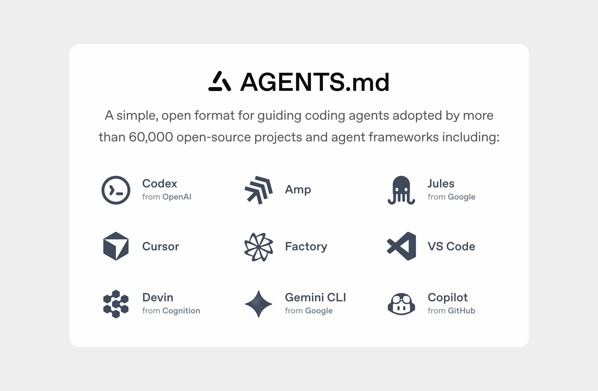

# AGENTS.md



[AGENTS.md](https://agents.md) 是一种简单、开放的格式，用于指导代码代理。

你可以把 AGENTS.md 看作是面向代理的 README：一个专用且可预测的位置，用于提供上下文和指令，帮助 AI 代码代理在你的项目中工作。

以下是一个 AGENTS.md 文件的最小示例：

```markdown
# Sample AGENTS.md file

## Dev environment tips
- Use `pnpm dlx turbo run where <project_name>` to jump to a package instead of scanning with `ls`.
- Run `pnpm install --filter <project_name>` to add the package to your workspace so Vite, ESLint, and TypeScript can see it.
- Use `pnpm create vite@latest <project_name> -- --template react-ts` to spin up a new React + Vite package with TypeScript checks ready.
- Check the name field inside each package's package.json to confirm the right name—skip the top-level one.

## Testing instructions
- Find the CI plan in the .github/workflows folder.
- Run `pnpm turbo run test --filter <project_name>` to run every check defined for that package.
- From the package root you can just call `pnpm test`. The commit should pass all tests before you merge.
- To focus on one step, add the Vitest pattern: `pnpm vitest run -t "<test name>"`.
- Fix any test or type errors until the whole suite is green.
- After moving files or changing imports, run `pnpm lint --filter <project_name>` to be sure ESLint and TypeScript rules still pass.
- Add or update tests for the code you change, even if nobody asked.

## PR instructions
- Title format: [<project_name>] <Title>
- Always run `pnpm lint` and `pnpm test` before committing.
```

## 网站

本仓库还包含一个基本的 Next.js 网站，托管在 https://agents.md/，以简单的方式介绍了项目的目标，并提供了一些示例。

### 在本地运行应用
1. 安装依赖：
   ```bash
   pnpm install
   ```
2. 启动开发服务器：
   ```bash
   pnpm run dev
   ```
3. 在浏览器中打开 http://localhost:3000
