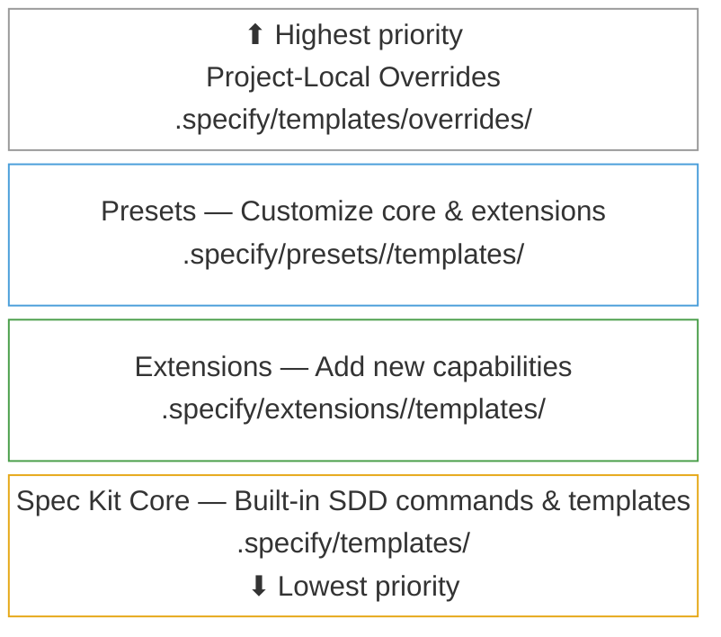

<div align="center">
    
    <h1>🌱 Spec Kit</h1>
    <h3><em>更快构建高质量软件。</em></h3>
</div>

<p align="center">
    <strong>一个开源工具包，让你专注于产品场景和可预测的结果，而不是从零开始对每一部分都进行 vibe coding。</strong>
</p>

<p align="center">
    <a href="https://github.com/github/spec-kit/releases/latest"></a>
    <a href="https://github.com/github/spec-kit/stargazers"></a>
    <a href="https://github.com/github/spec-kit/blob/main/LICENSE"></a>
    <a href="https://github.github.io/spec-kit/"></a>
</p>

---

## 目录

- [🤔 什么是 Spec-Driven Development？](#-什么是-spec-driven-development)
- [⚡ 快速开始](#-快速开始)
- [📽️ 视频概览](#️-视频概览)
- [🧩 社区扩展](#-社区扩展)
- [🎨 社区预设](#-社区预设)
- [🚶 社区演练示例](#-社区演练示例)
- [🛠️ 社区伙伴项目](#️-社区伙伴项目)
- [🤖 支持的 AI Agent](#-支持的-ai-agent)
- [🔧 Specify CLI 参考](#-specify-cli-参考)
- [🧩 让 Spec Kit 为你所用：扩展与预设](#-让-spec-kit-为你所用扩展与预设)
- [📚 核心理念](#-核心理念)
- [🌟 开发阶段](#-开发阶段)
- [🎯 实验目标](#-实验目标)
- [🔧 前置要求](#-前置要求)
- [📖 进一步了解](#-进一步了解)
- [📋 详细流程](#-详细流程)
- [🔍 故障排查](#-故障排查)
- [💬 支持](#-支持)
- [🙏 致谢](#-致谢)
- [📄 许可证](#-许可证)

## 🤔 什么是 Spec-Driven Development？

Spec-Driven Development 颠覆了传统软件开发的思路。几十年来，代码一直处于核心地位，规格说明只是脚手架，一旦“真正的编码工作”开始，往往就会被丢弃。Spec-Driven Development 改变了这一点：**规格说明本身变得可执行**，它不再只是指导实现，而是可以直接生成可运行的实现。

## ⚡ 快速开始

### 1. 安装 Specify CLI

选择你偏好的安装方式：

#### 选项 1：持久安装（推荐）

安装一次，处处可用。为保证稳定性，建议固定到特定的 release 标签（最新版本请查看 [Releases](https://github.com/github/spec-kit/releases)）：

```bash
# 安装指定稳定版本（推荐，将 vX.Y.Z 替换为最新标签）
uv tool install specify-cli --from git+https://github.com/github/spec-kit.git@vX.Y.Z

# 或者从 main 安装最新版本（可能包含未发布的变更）
uv tool install specify-cli --from git+https://github.com/github/spec-kit.git
```

然后直接使用该工具：

```bash
# 创建新项目
specify init <PROJECT_NAME>

# 或在现有项目中初始化
specify init . --ai claude
# or
specify init --here --ai claude

# 检查已安装工具
specify check
```

如需升级 Specify，请参阅 [Upgrade Guide](./docs/upgrade.md) 获取详细说明。快速升级方式如下：

```bash
uv tool install specify-cli --force --from git+https://github.com/github/spec-kit.git@vX.Y.Z
```

#### 选项 2：一次性使用

无需安装，直接运行：

```bash
# 创建新项目（固定到稳定版本，将 vX.Y.Z 替换为最新标签）
uvx --from git+https://github.com/github/spec-kit.git@vX.Y.Z specify init <PROJECT_NAME>

# 或在现有项目中初始化
uvx --from git+https://github.com/github/spec-kit.git@vX.Y.Z specify init . --ai claude
# or
uvx --from git+https://github.com/github/spec-kit.git@vX.Y.Z specify init --here --ai claude
```

**持久安装的好处：**

- 工具会保持安装状态，并可通过 PATH 直接使用
- 无需创建 shell 别名
- 可通过 `uv tool list`、`uv tool upgrade`、`uv tool uninstall` 更好地管理工具
- shell 配置更简洁

#### 选项 3：企业 / 隔离网络安装

如果你的环境无法访问 PyPI 或 GitHub，请参阅 [Enterprise / Air-Gapped Installation](./docs/installation.md#enterprise--air-gapped-installation) 指南，了解如何在联网机器上使用 `pip download` 创建可移植、按操作系统区分的 wheel 包。

### 2. 建立项目原则

在项目目录中启动你的 AI 助手。大多数 agent 会将 spec-kit 暴露为 `/speckit.*` 斜杠命令；Codex CLI 在 skills 模式下则使用 `$speckit-*`。

使用 **`/speckit.constitution`** 命令创建项目的治理原则和开发准则，以指导后续所有开发。

```bash
/speckit.constitution Create principles focused on code quality, testing standards, user experience consistency, and performance requirements
```

### 3. 创建规格说明

使用 **`/speckit.specify`** 命令描述你要构建的内容。重点关注 **做什么** 和 **为什么做**，而不是技术栈。

```bash
/speckit.specify Build an application that can help me organize my photos in separate photo albums. Albums are grouped by date and can be re-organized by dragging and dropping on the main page. Albums are never in other nested albums. Within each album, photos are previewed in a tile-like interface.
```

### 4. 创建技术实现计划

使用 **`/speckit.plan`** 命令提供你的技术栈和架构选择。

```bash
/speckit.plan The application uses Vite with minimal number of libraries. Use vanilla HTML, CSS, and JavaScript as much as possible. Images are not uploaded anywhere and metadata is stored in a local SQLite database.
```

### 5. 拆分任务

使用 **`/speckit.tasks`**，根据实现计划生成可执行的任务列表。

```bash
/speckit.tasks
```

### 6. 执行实现

使用 **`/speckit.implement`** 按照计划执行所有任务并构建功能。

```bash
/speckit.implement
```

有关更详细的分步说明，请参阅我们的[完整指南](./spec-driven.md)。

## 📽️ 视频概览

想看看 Spec Kit 的实际效果？欢迎观看我们的[视频概览](https://www.youtube.com/watch?v=a9eR1xsfvHg&pp=0gcJCckJAYcqIYzv)！

[](https://www.youtube.com/watch?v=a9eR1xsfvHg&pp=0gcJCckJAYcqIYzv)

## 🧩 社区扩展

> [!NOTE]
> 社区扩展由各自作者独立创建和维护。GitHub 与 Spec Kit 维护者可能会审查向社区目录添加条目的 pull request，以检查格式、目录结构或策略合规性，但**不会审查、审计、背书或支持扩展本身的代码**。Community Extensions 网站同样属于第三方资源。安装前请审阅扩展源码，并自行决定是否使用。

🔍 **可在 [Community Extensions website](https://speckit-community.github.io/extensions/) 浏览并搜索社区扩展。**

以下社区贡献的扩展可在 [`catalog.community.json`](extensions/catalog.community.json) 中找到：

**分类：**

- `docs` — 读取、校验或生成规格工件
- `code` — 审查、校验或修改源代码
- `process` — 在多个阶段之间编排工作流
- `integration` — 与外部平台同步
- `visibility` — 报告项目健康状况或进度

**效果：**

- `Read-only` — 仅生成报告，不修改文件
- `Read+Write` — 修改文件、创建工件或更新规格

| Extension | Purpose | Category | Effect | URL |
|-----------|---------|----------|--------|-----|
| AI-Driven Engineering (AIDE) | 面向从零开始构建新项目的结构化 7 步工作流，借助 AI 助手覆盖从愿景到实现的全过程 | `process` | Read+Write | [aide](https://github.com/mnriem/spec-kit-extensions/tree/main/aide) |
| Archive Extension | 将已合并功能归档到主项目记忆中。 | `docs` | Read+Write | [spec-kit-archive](https://github.com/stn1slv/spec-kit-archive) |
| Azure DevOps Integration | 使用 OAuth 认证将用户故事和任务同步到 Azure DevOps 工作项 | `integration` | Read+Write | [spec-kit-azure-devops](https://github.com/pragya247/spec-kit-azure-devops) |
| Canon | 添加由 canon 驱动（baseline-driven）的工作流：spec-first、code-first、spec-drift。需要先安装 Canon Core 预设。 | `process` | Read+Write | [spec-kit-canon](https://github.com/maximiliamus/spec-kit-canon/tree/master/extension) |
| Checkpoint Extension | 在实现中途提交所做变更，避免最后只形成一个巨大的提交 | `code` | Read+Write | [spec-kit-checkpoint](https://github.com/aaronrsun/spec-kit-checkpoint) |
| Cleanup Extension | 实现后的质量闸门，会审查变更、修复小问题（scout rule）、为中等问题创建任务，并为大问题生成分析 | `code` | Read+Write | [spec-kit-cleanup](https://github.com/dsrednicki/spec-kit-cleanup) |
| Conduct Extension | 通过子 agent 委派来编排 spec-kit 各阶段，减少上下文污染。 | `process` | Read+Write | [spec-kit-conduct-ext](https://github.com/twbrandon7/spec-kit-conduct-ext) |
| Confluence Extension | 在 Confluence 中创建文档，总结规格和计划文件 | `integration` | Read+Write | [spec-kit-confluence](https://github.com/aaronrsun/spec-kit-confluence) |
| DocGuard — CDD Enforcement | Canonical-Driven Development 执行器。通过自动检查、AI 驱动工作流和 spec-kit hooks 对项目文档进行校验、评分和追踪。零 NPM 运行时依赖。 | `docs` | Read+Write | [spec-kit-docguard](https://github.com/raccioly/docguard) |
| Extensify | 创建并校验扩展及扩展目录 | `process` | Read+Write | [extensify](https://github.com/mnriem/spec-kit-extensions/tree/main/extensify) |
| Fix Findings | 自动化的 analyze-fix-reanalyze 循环，持续修复规格发现项直至清洁 | `code` | Read+Write | [spec-kit-fix-findings](https://github.com/Quratulain-bilal/spec-kit-fix-findings) |
| FixIt Extension | 感知规格的缺陷修复，能将 bug 映射到规格工件、提出计划并应用最小化变更 | `code` | Read+Write | [spec-kit-fixit](https://github.com/speckit-community/spec-kit-fixit) |
| Fleet Orchestrator | 在所有 SpecKit 阶段中通过 human-in-the-loop 闸门编排完整功能生命周期 | `process` | Read+Write | [spec-kit-fleet](https://github.com/sharathsatish/spec-kit-fleet) |
| Iterate | 通过定义与应用两阶段工作流迭代规格文档，在实现中途细化规格后直接返回构建 | `docs` | Read+Write | [spec-kit-iterate](https://github.com/imviancagrace/spec-kit-iterate) |
| Jira Integration | 根据 spec-kit 的规格与任务拆解创建 Jira Epic、Story 和 Issue，支持可配置层级与自定义字段 | `integration` | Read+Write | [spec-kit-jira](https://github.com/mbachorik/spec-kit-jira) |
| Learning Extension | 从实现中生成教学指南，并结合指导语境增强澄清内容 | `docs` | Read+Write | [spec-kit-learn](https://github.com/imviancagrace/spec-kit-learn) |
| MAQA — Multi-Agent & Quality Assurance | 协调器 → 功能 → QA agent 工作流，支持基于 worktree 的并行实现。与语言无关。自动检测已安装的 board 插件。可选 CI 闸门。 | `process` | Read+Write | [spec-kit-maqa-ext](https://github.com/GenieRobot/spec-kit-maqa-ext) |
| MAQA Azure DevOps Integration | 面向 MAQA 的 Azure DevOps Boards 集成，随着功能推进同步 User Story 及其子任务 | `integration` | Read+Write | [spec-kit-maqa-azure-devops](https://github.com/GenieRobot/spec-kit-maqa-azure-devops) |
| MAQA CI/CD Gate | 自动检测 GitHub Actions、CircleCI、GitLab CI 和 Bitbucket Pipelines。在流水线变绿前阻止 QA 交接。 | `process` | Read+Write | [spec-kit-maqa-ci](https://github.com/GenieRobot/spec-kit-maqa-ci) |
| MAQA GitHub Projects Integration | 面向 MAQA 的 GitHub Projects v2 集成，随着功能推进同步 draft issue 和 Status 列 | `integration` | Read+Write | [spec-kit-maqa-github-projects](https://github.com/GenieRobot/spec-kit-maqa-github-projects) |
| MAQA Jira Integration | 面向 MAQA 的 Jira 集成，随着功能在看板中推进同步 Story 和 Subtask | `integration` | Read+Write | [spec-kit-maqa-jira](https://github.com/GenieRobot/spec-kit-maqa-jira) |
| MAQA Linear Integration | 面向 MAQA 的 Linear 集成，随着功能推进在各工作流状态间同步 issue 和 sub-issue | `integration` | Read+Write | [spec-kit-maqa-linear](https://github.com/GenieRobot/spec-kit-maqa-linear) |
| MAQA Trello Integration | 面向 MAQA 的 Trello 看板集成，从规格填充看板、移动卡片、实时勾选 checklist | `integration` | Read+Write | [spec-kit-maqa-trello](https://github.com/GenieRobot/spec-kit-maqa-trello) |
| Onboard | 面向 spec-kit 新手开发者的上下文式入门与渐进成长。解释规格、映射依赖、校验理解并引导下一步 | `process` | Read+Write | [spec-kit-onboard](https://github.com/dmux/spec-kit-onboard) |
| Optimize | 审计并优化 AI 治理，以提升上下文效率，包括 token 预算、规则健康度、可解释性、压缩、一致性和回声检测 | `process` | Read+Write | [spec-kit-optimize](https://github.com/sakitA/spec-kit-optimize) |
| Plan Review Gate | 要求在允许生成任务之前，`spec.md` 和 `plan.md` 必须通过 MR/PR 合并 | `process` | Read-only | [spec-kit-plan-review-gate](https://github.com/luno/spec-kit-plan-review-gate) |
| Presetify | 创建并校验预设及预设目录 | `process` | Read+Write | [presetify](https://github.com/mnriem/spec-kit-extensions/tree/main/presetify) |
| Product Forge | 完整产品生命周期：research → product spec → SpecKit → implement → verify → test | `process` | Read+Write | [speckit-product-forge](https://github.com/VaiYav/speckit-product-forge) |
| Project Health Check | 诊断 Spec Kit 项目，并从结构、agents、功能、脚本、扩展和 git 多方面报告健康问题 | `visibility` | Read-only | [spec-kit-doctor](https://github.com/KhawarHabibKhan/spec-kit-doctor) |
| Project Status | 显示当前 SDD 工作流进度，包括活动功能、工件状态、任务完成度、工作流阶段与扩展摘要 | `visibility` | Read-only | [spec-kit-status](https://github.com/KhawarHabibKhan/spec-kit-status) |
| QA Testing Extension | 使用浏览器驱动或 CLI 驱动的方式，系统性验证规格中的验收标准 | `code` | Read-only | [spec-kit-qa](https://github.com/arunt14/spec-kit-qa) |
| Ralph Loop | 使用 AI agent CLI 的自主实现循环 | `code` | Read+Write | [spec-kit-ralph](https://github.com/Rubiss/spec-kit-ralph) |
| Reconcile Extension | 通过精确更新功能工件来校正实现漂移。 | `docs` | Read+Write | [spec-kit-reconcile](https://github.com/stn1slv/spec-kit-reconcile) |
| Repository Index | 为现有仓库生成索引，用于总览、架构和模块级分析。 | `docs` | Read-only | [spec-kit-repoindex](https://github.com/liuyiyu/spec-kit-repoindex) |
| Retro Extension | Sprint 回顾分析，包含指标、规格准确性评估和改进建议 | `process` | Read+Write | [spec-kit-retro](https://github.com/arunt14/spec-kit-retro) |
| Retrospective Extension | 实现后的 retrospective，包含规格遵循度评分、漂移分析和人工把关的规格更新 | `docs` | Read+Write | [spec-kit-retrospective](https://github.com/emi-dm/spec-kit-retrospective) |
| Review Extension | 实现后的综合代码审查，使用专门 agent 覆盖代码质量、注释、测试、错误处理、类型设计和简化 | `code` | Read-only | [spec-kit-review](https://github.com/ismaelJimenez/spec-kit-review) |
| SDD Utilities | 恢复中断的工作流、校验项目健康状况并验证规格到任务的可追踪性 | `process` | Read+Write | [speckit-utils](https://github.com/mvanhorn/speckit-utils) |
| Security Review | 使用 AI 驱动的 DevSecOps 分析对代码库进行全面安全审计 | `code` | Read-only | [spec-kit-security-review](https://github.com/DyanGalih/spec-kit-security-review) |
| Staff Review Extension | Staff 工程师级代码审查，校验实现是否符合规格，并检查安全性、性能和测试覆盖率 | `code` | Read-only | [spec-kit-staff-review](https://github.com/arunt14/spec-kit-staff-review) |
| Superpowers Bridge | 在 spec-kit 的完整 SDD 生命周期中编排 obra/superpowers skills，包括澄清、TDD、审查、验证、批判、调试和分支完成 | `process` | Read+Write | [superpowers-bridge](https://github.com/RbBtSn0w/spec-kit-extensions/tree/main/superpowers-bridge) |
| Ship Release Extension | 自动化发布流水线：预检、分支同步、变更日志生成、CI 校验和 PR 创建 | `process` | Read+Write | [spec-kit-ship](https://github.com/arunt14/spec-kit-ship) |
| Spec Critique Extension | 从产品策略和工程风险双视角对规格和计划进行批判性审查 | `docs` | Read-only | [spec-kit-critique](https://github.com/arunt14/spec-kit-critique) |
| Spec Sync | 检测并解决规格与实现之间的漂移。AI 辅助解决，需人工批准 | `docs` | Read+Write | [spec-kit-sync](https://github.com/bgervin/spec-kit-sync) |
| V-Model Extension Pack | 强制采用 V-Model 成对生成开发规格和测试规格，并提供完整可追踪性 | `docs` | Read+Write | [spec-kit-v-model](https://github.com/leocamello/spec-kit-v-model) |
| Verify Extension | 实现后的质量闸门，用于校验已实现代码是否符合规格工件 | `code` | Read-only | [spec-kit-verify](https://github.com/ismaelJimenez/spec-kit-verify) |
| Verify Tasks Extension | 检测“虚假完成”：`tasks.md` 中标记为 [X] 但实际上没有真实实现的任务 | `code` | Read-only | [spec-kit-verify-tasks](https://github.com/datastone-inc/spec-kit-verify-tasks) |

如需提交你自己的扩展，请参阅 [Extension Publishing Guide](extensions/EXTENSION-PUBLISHING-GUIDE.md)。

## 🎨 社区预设

> [!NOTE]
> 社区预设由各自作者独立创建和维护。GitHub 与 Spec Kit 维护者可能会审查向社区目录添加条目的 pull request，以检查格式、目录结构或策略合规性，但**不会审查、审计、背书或支持预设本身的代码**。安装前请审阅预设源码，并自行决定是否使用。

以下社区贡献的预设可自定义 Spec Kit 的行为方式，它们可以覆盖模板、命令和术语，但不会改变任何工具逻辑。预设可在 [`catalog.community.json`](presets/catalog.community.json) 中找到：

| Preset | Purpose | Provides | Requires | URL |
|--------|---------|----------|----------|-----|
| AIDE In-Place Migration | 将 AIDE 扩展工作流适配为原地技术迁移（X → Y 模式），添加迁移目标、验证闸门、知识文档和行为等价标准 | 2 templates, 8 commands | AIDE extension | [spec-kit-presets](https://github.com/mnriem/spec-kit-presets) |
| Canon Core | 将原始 Spec Kit 工作流适配为可与 Canon 扩展协同工作 | 2 templates, 8 commands | — | [spec-kit-canon](https://github.com/maximiliamus/spec-kit-canon) |
| Pirate Speak (Full) | 将所有 Spec Kit 输出转换为海盗口吻，规格变成 "Voyage Manifests"，计划变成 "Battle Plans"，任务变成 "Crew Assignments" | 6 templates, 9 commands | — | [spec-kit-presets](https://github.com/mnriem/spec-kit-presets) |
| VS Code Ask Questions | 增强 clarify 命令，使用 `vscode/askQuestions` 进行批量交互式提问。 | 1 command | — | [spec-kit-presets](https://github.com/fdcastel/spec-kit-presets) |

如需构建并发布你自己的预设，请参阅 [Presets Publishing Guide](presets/PUBLISHING.md)。

## 🚶 社区演练示例

> [!NOTE]
> 社区演练示例由各自作者独立创建和维护。它们**未经 GitHub 审查、背书或支持**。请在跟随操作前先审阅其内容，并自行决定是否使用。

通过这些社区贡献的 walkthrough，在不同场景中观察 Spec-Driven Development 的实际用法：

- **[Greenfield .NET CLI tool](https://github.com/mnriem/spec-kit-dotnet-cli-demo)** — 从空目录开始，构建一个 Timezone Utility .NET 单文件 CLI 工具，覆盖完整的 spec-kit 工作流：constitution、specify、plan、tasks，以及借助 GitHub Copilot agents 的多轮 implement。

- **[Greenfield Spring Boot + React platform](https://github.com/mnriem/spec-kit-spring-react-demo)** — 从零构建一个 LLM 性能分析平台（REST API、图表、迭代跟踪），使用 Spring Boot、嵌入式 React、PostgreSQL 和 Docker Compose，并包含 clarify 步骤与跨工件一致性分析环节。

- **[Brownfield ASP.NET CMS extension](https://github.com/mnriem/spec-kit-aspnet-brownfield-demo)** — 在现有开源 .NET CMS（CarrotCakeCMS-Core，约 307,000 行 C#、Razor、SQL、JavaScript 和配置文件）上扩展两个新功能：跨平台 Docker Compose 基础设施和基于 token 认证的 headless REST API，展示 spec-kit 如何在没有既有规格或 constitution 的代码库中工作。

- **[Brownfield Java runtime extension](https://github.com/mnriem/spec-kit-java-brownfield-demo)** — 在现有开源 Jakarta EE runtime（Piranha，横跨 180 个 Maven 模块，约 420,000 行 Java、XML、JSP、HTML 和配置文件）上扩展一个受密码保护的 Server Admin Console，展示 spec-kit 在没有既有规格或 constitution 的大型多模块 Java 项目中的使用方式。

- **[Brownfield Go / React dashboard demo](https://github.com/mnriem/spec-kit-go-brownfield-demo)** — 展示如何**完全从终端借助 GitHub Copilot CLI** 来驱动 spec-kit。该示例扩展了 NASA 的开源 Hermes 地面支持系统（Go），增加了一个轻量级的 React Web 遥测仪表盘，说明完整的 constitution → specify → plan → tasks → implement 工作流可以在终端中完成。

- **[Greenfield Spring Boot MVC with a custom preset](https://github.com/mnriem/spec-kit-pirate-speak-preset-demo)** — 使用自定义海盗口吻预设从零构建一个 Spring Boot MVC 应用，展示预设如何重塑整个 spec-kit 体验：specifications 变成 "Voyage Manifests"，plans 变成 "Battle Plans"，tasks 变成 "Crew Assignments"；整个过程无需修改任何工具，却能生成完整海盗风格的内容。

- **[Greenfield Spring Boot + React with a custom extension](https://github.com/mnriem/spec-kit-aide-extension-demo)** — 演示 **AIDE 扩展**，这是一个社区扩展，为 spec-kit 增加了另一套规格驱动工作流，使用高层规格（vision）和低层规格（work items）组织成一个 7 步迭代生命周期：vision → roadmap → progress tracking → work queue → work items → execution → feedback loops。该示例以家庭交易平台（Spring Boot 4、React 19、PostgreSQL、Docker Compose）为场景，说明扩展机制如何让你在不修改任何核心工具的情况下接入不同风格的规格驱动开发，真正体现 Spec Kit 中 “Kit” 的含义。

## 🛠️ 社区伙伴项目

> [!NOTE]
> 这里列出的社区项目由各自作者独立创建和维护。它们**未经 GitHub 审查、背书或支持**。安装前请先审阅源码，并自行决定是否使用。

扩展、可视化或构建于 Spec Kit 之上的社区项目：

- **[cc-spex](https://github.com/rhuss/cc-spex)** - 一个 Claude Code 插件，在 Spec Kit 之上增加了可组合 traits，并结合基于 [Superpowers](https://github.com/obra/superpowers) 的质量闸门、spec/code review、git worktree 隔离，以及 agent 团队并行实现能力。

- **[Spec Kit Assistant](https://marketplace.visualstudio.com/items?itemName=rfsales.speckit-assistant)** — 一个 VS Code 扩展，为完整的 SDD 工作流（constitution → specification → planning → tasks → implementation）提供可视化编排器，支持阶段状态可视化、交互式任务清单、DAG 可视化，以及 Claude、Gemini、GitHub Copilot 和 OpenAI 后端。要求你的 PATH 中存在 `specify` CLI。

## 🤖 支持的 AI Agent

| Agent                                                                                | Support | Notes                                                                                                                                     |
| ------------------------------------------------------------------------------------ | ------- | ----------------------------------------------------------------------------------------------------------------------------------------- |
| [Qoder CLI](https://qoder.com/cli)                                                   | ✅      |                                                                                                                                           |
| [Kiro CLI](https://kiro.dev/docs/cli/)                                               | ✅      | 使用 `--ai kiro-cli`（别名：`--ai kiro`）                                                                                                |
| [Amp](https://ampcode.com/)                                                          | ✅      |                                                                                                                                           |
| [Auggie CLI](https://docs.augmentcode.com/cli/overview)                              | ✅      |                                                                                                                                           |
| [Claude Code](https://www.anthropic.com/claude-code)                                 | ✅      | 会将 skills 安装到 `.claude/skills`；以 `/speckit-constitution`、`/speckit-plan` 等形式调用 spec-kit。                                 |
| [CodeBuddy CLI](https://www.codebuddy.ai/cli)                                        | ✅      |                                                                                                                                           |
| [Codex CLI](https://github.com/openai/codex)                                         | ✅      | 需要 `--ai-skills`。Codex 推荐使用 [skills](https://developers.openai.com/codex/skills)，并将 [custom prompts](https://developers.openai.com/codex/custom-prompts) 视为已弃用。spec-kit 会将 Codex skills 安装到 `.agents/skills` 中，并以 `$speckit-<command>` 的方式调用。 |
| [Cursor](https://cursor.sh/)                                                         | ✅      |                                                                                                                                           |
| [Forge](https://forgecode.dev/)                                                      | ✅      | CLI 工具：`forge`                                                                                                                         |
| [Gemini CLI](https://github.com/google-gemini/gemini-cli)                            | ✅      |                                                                                                                                           |
| [GitHub Copilot](https://code.visualstudio.com/)                                     | ✅      |                                                                                                                                           |
| [IBM Bob](https://www.ibm.com/products/bob)                                          | ✅      | 基于 IDE 的 agent，支持斜杠命令                                                                                                          |
| [Jules](https://jules.google.com/)                                                   | ✅      |                                                                                                                                           |
| [Kilo Code](https://github.com/Kilo-Org/kilocode)                                    | ✅      |                                                                                                                                           |
| [opencode](https://opencode.ai/)                                                     | ✅      |                                                                                                                                           |
| [Pi Coding Agent](https://pi.dev)                                                    | ✅      | Pi 默认不支持 MCP，因此 `taskstoissues` 无法按预期工作。可通过 [extensions](https://github.com/badlogic/pi-mono/tree/main/packages/coding-agent#extensions) 添加 MCP 支持 |
| [Qwen Code](https://github.com/QwenLM/qwen-code)                                     | ✅      |                                                                                                                                           |
| [Roo Code](https://roocode.com/)                                                     | ✅      |                                                                                                                                           |
| [SHAI (OVHcloud)](https://github.com/ovh/shai)                                       | ✅      |                                                                                                                                           |
| [Tabnine CLI](https://docs.tabnine.com/main/getting-started/tabnine-cli)             | ✅      |                                                                                                                                           |
| [Mistral Vibe](https://github.com/mistralai/mistral-vibe)                            | ✅      |                                                                                                                                           |
| [Kimi Code](https://code.kimi.com/)                                                  | ✅      |                                                                                                                                           |
| [iFlow CLI](https://docs.iflow.cn/en/cli/quickstart)                                 | ✅      |                                                                                                                                           |
| [Windsurf](https://windsurf.com/)                                                    | ✅      |                                                                                                                                           |
| [Junie](https://junie.jetbrains.com/)                                                | ✅      |                                                                                                                                           |
| [Antigravity (agy)](https://antigravity.google/)                                     | ✅      | 需要 `--ai-skills` |
| [Trae](https://www.trae.ai/)                                                         | ✅      |                                                                                                                                           |
| Generic                                                                              | ✅      | 自带 agent，针对不受支持的 agent 使用 `--ai generic --ai-commands-dir <path>`                                                            |

## 🔧 Specify CLI 参考

`specify` 命令支持以下选项：

### Commands

| Command | Description                                                                                                                                                                                                                                                                              |
| ------- |------------------------------------------------------------------------------------------------------------------------------------------------------------------------------------------------------------------------------------------------------------------------------------------|
| `init`  | 使用最新模板初始化一个新的 Specify 项目                                                                                                                                                                                                                                                  |
| `check` | 检查已安装工具：`git` 以及 `AGENT_CONFIG` 中配置的所有 CLI 型 agent（例如：`claude`、`gemini`、`code`/`code-insiders`、`cursor-agent`、`windsurf`、`junie`、`qwen`、`opencode`、`codex`、`kiro-cli`、`shai`、`qodercli`、`vibe`、`kimi`、`iflow`、`pi`、`forge` 等） |

### `specify init` 参数与选项

| Argument/Option        | Type     | Description                                                                                                                                                                                                                                                                                                                                                                               |
| ---------------------- | -------- |-------------------------------------------------------------------------------------------------------------------------------------------------------------------------------------------------------------------------------------------------------------------------------------------------------------------------------------------------------------------------------------------|
| `<project-name>`       | Argument | 新项目目录名称（如果使用 `--here` 则可选，或使用 `.` 表示当前目录）                                                                                                                                                                                                                                                                                                                      |
| `--ai`                 | Option   | 要使用的 AI 助手（完整且最新的列表请查看 `AGENT_CONFIG`）。常见选项包括：`claude`、`gemini`、`copilot`、`cursor-agent`、`qwen`、`opencode`、`codex`、`windsurf`、`junie`、`kilocode`、`auggie`、`roo`、`codebuddy`、`amp`、`shai`、`kiro-cli`（`kiro` 别名）、`agy`、`bob`、`qodercli`、`vibe`、`kimi`、`iflow`、`pi`、`forge` 或 `generic`（需要 `--ai-commands-dir`） |
| `--ai-commands-dir`    | Option   | agent 命令文件所在目录（与 `--ai generic` 一起使用时必需，例如 `.myagent/commands/`）                                                                                                                                                                                                                                                                                                   |
| `--script`             | Option   | 要使用的脚本变体：`sh`（bash/zsh）或 `ps`（PowerShell）                                                                                                                                                                                                                                                                                                                                   |
| `--ignore-agent-tools` | Flag     | 跳过对 Claude Code 等 AI agent 工具的检查                                                                                                                                                                                                                                                                                                                                                |
| `--no-git`             | Flag     | 跳过 git 仓库初始化                                                                                                                                                                                                                                                                                                                                                                      |
| `--here`               | Flag     | 在当前目录中初始化项目，而不是创建新目录                                                                                                                                                                                                                                                                                                                                                  |
| `--force`              | Flag     | 在当前目录初始化时强制合并/覆盖（跳过确认）                                                                                                                                                                                                                                                                                                                                               |
| `--skip-tls`           | Flag     | 跳过 SSL/TLS 校验（不推荐）                                                                                                                                                                                                                                                                                                                                                               |
| `--debug`              | Flag     | 启用详细调试输出以便排查问题                                                                                                                                                                                                                                                                                                                                                              |
| `--github-token`       | Option   | 用于 API 请求的 GitHub token（或设置 GH_TOKEN/GITHUB_TOKEN 环境变量）                                                                                                                                                                                                                                                                                                                     |
| `--ai-skills`          | Flag     | 将 Prompt.MD 模板作为 agent skills 安装到特定 agent 的 `skills/` 目录中（需要 `--ai`）。稍后添加扩展时，扩展命令也会自动注册为 skills。                                                                                                                                                                                                                                                  |
| `--branch-numbering`   | Option   | 分支编号策略：`sequential`（默认，`001`、`002`、`003`、…、`1000`、…，会自动扩展到超过 3 位）或 `timestamp`（`YYYYMMDD-HHMMSS`）。时间戳模式适合分布式团队，可避免编号冲突                                                                                                                                                                                                               |

### 示例

```bash
# 基础项目初始化
specify init my-project

# 使用指定 AI 助手初始化
specify init my-project --ai claude

# 启用 Cursor 支持初始化
specify init my-project --ai cursor-agent

# 启用 Qoder 支持初始化
specify init my-project --ai qodercli

# 启用 Windsurf 支持初始化
specify init my-project --ai windsurf

# 启用 Kiro CLI 支持初始化
specify init my-project --ai kiro-cli

# 启用 Amp 支持初始化
specify init my-project --ai amp

# 启用 SHAI 支持初始化
specify init my-project --ai shai

# 启用 Mistral Vibe 支持初始化
specify init my-project --ai vibe

# 启用 IBM Bob 支持初始化
specify init my-project --ai bob

# 启用 Pi Coding Agent 支持初始化
specify init my-project --ai pi

# 启用 Codex CLI 支持初始化
specify init my-project --ai codex --ai-skills

# 启用 Antigravity 支持初始化
specify init my-project --ai agy --ai-skills

# 启用 Forge 支持初始化
specify init my-project --ai forge

# 使用不受支持的 agent 初始化（generic / 自带 agent）
specify init my-project --ai generic --ai-commands-dir .myagent/commands/

# 使用 PowerShell 脚本初始化（Windows/跨平台）
specify init my-project --ai copilot --script ps

# 在当前目录中初始化
specify init . --ai copilot
# or use the --here flag
specify init --here --ai copilot

# 在当前（非空）目录中强制合并且不确认
specify init . --force --ai copilot
# or
specify init --here --force --ai copilot

# 跳过 git 初始化
specify init my-project --ai gemini --no-git

# 启用调试输出以便排查问题
specify init my-project --ai claude --debug

# 使用 GitHub token 发起 API 请求（适用于企业环境）
specify init my-project --ai claude --github-token ghp_your_token_here

# Claude Code 默认会随项目一起安装 skills
specify init my-project --ai claude

# 在当前目录中初始化并安装 agent skills
specify init --here --ai gemini --ai-skills

# 使用基于时间戳的分支编号（适用于分布式团队）
specify init my-project --ai claude --branch-numbering timestamp

# 检查系统要求
specify check
```

### 可用的 Slash Commands

运行 `specify init` 后，你的 AI 编码 agent 将可使用这些结构化开发命令。

大多数 agent 会暴露下方所示的传统点式斜杠命令，例如 `/speckit.plan`。

Claude Code 将 spec-kit 安装为 skills，并以 `/speckit-constitution`、`/speckit-specify`、`/speckit-plan`、`/speckit-tasks` 和 `/speckit-implement` 的形式调用。

对于 Codex CLI，`--ai-skills` 会将 spec-kit 安装为 agent skills，而不是斜杠命令提示文件。在 Codex 的 skills 模式下，请以 `$speckit-constitution`、`$speckit-specify`、`$speckit-plan`、`$speckit-tasks` 和 `$speckit-implement` 的形式调用。

#### Core Commands

Spec-Driven Development 工作流的核心命令：

| Command                 | Description                                                              |
| ----------------------- | ------------------------------------------------------------------------ |
| `/speckit.constitution` | 创建或更新项目治理原则与开发准则 |
| `/speckit.specify`      | 定义要构建的内容（需求与用户故事） |
| `/speckit.plan`         | 使用你选择的技术栈创建技术实现计划 |
| `/speckit.tasks`        | 生成用于实现的可执行任务列表 |
| `/speckit.implement`    | 按照计划执行所有任务以构建功能 |

#### Optional Commands

用于增强质量和校验的附加命令：

| Command              | Description                                                                                                                          |
| -------------------- | ------------------------------------------------------------------------------------------------------------------------------------ |
| `/speckit.clarify`   | 澄清定义不足的区域（建议在 `/speckit.plan` 前使用；此前名为 `/quizme`）                                                               |
| `/speckit.analyze`   | 跨工件一致性与覆盖率分析（在 `/speckit.tasks` 之后、`/speckit.implement` 之前运行）                                                   |
| `/speckit.checklist` | 生成自定义质量清单，用于验证需求的完整性、清晰度和一致性（类似“英语版单元测试”）                                                     |

### 环境变量

| Variable          | Description                                                                                                                                                                                                                                                                                            |
| ----------------- | ------------------------------------------------------------------------------------------------------------------------------------------------------------------------------------------------------------------------------------------------------------------------------------------------------ |
| `SPECIFY_FEATURE` | 为非 Git 仓库覆盖功能检测。将其设置为功能目录名称（例如 `001-photo-albums`），以便在不使用 Git 分支时处理特定功能。<br/>\*\*必须在使用 `/speckit.plan` 或后续命令之前，于你所用 agent 的上下文中设置。 |

## 🧩 让 Spec Kit 为你所用：扩展与预设

Spec Kit 可以通过两个互补系统进行定制：**extensions** 和 **presets**，再加上用于一次性调整的项目本地覆盖：



**Templates** 在**运行时**解析。Spec Kit 会自上而下遍历这层堆栈，并使用首个匹配项。项目本地覆盖（`.specify/templates/overrides/`）允许你无需创建完整预设，就能对单个项目做一次性调整。**Commands** 则在**安装时**应用。当你运行 `specify extension add` 或 `specify preset add` 时，命令文件会被写入 agent 目录（例如 `.claude/commands/`）。如果多个预设或扩展提供同名命令，则优先级最高的版本会生效。移除后，次高优先级版本会自动恢复。如果不存在覆盖或自定义项，Spec Kit 将使用其核心默认值。

### Extensions — 添加新能力

当你需要超出 Spec Kit 核心范围的功能时，使用 **extensions**。扩展会引入新的命令和模板，例如添加内置 SDD 命令未覆盖的领域特定工作流、与外部工具集成，或增加全新的开发阶段。它们扩展的是 *Spec Kit 能做什么*。

```bash
# 搜索可用扩展
specify extension search

# 安装一个扩展
specify extension add <extension-name>
```

例如，扩展可以添加 Jira 集成、实现后的代码审查、V-Model 测试可追踪性或项目健康诊断。

完整指南及如何构建和发布你自己的扩展，请参阅 [Extensions README](./extensions/README.md)。可用扩展请查看上方的[社区扩展](#-社区扩展)。

### Presets — 自定义现有工作流

当你想改变 Spec Kit 的工作方式、但不想添加新能力时，使用 **presets**。预设会覆盖核心自带以及已安装扩展附带的模板和命令，例如强制采用面向合规的规格格式、使用领域特定术语，或对计划和任务施加组织级标准。它们定制的是 Spec Kit 及其扩展所生成的工件和说明。

```bash
# 搜索可用预设
specify preset search

# 安装一个预设
specify preset add <preset-name>
```

例如，预设可以重构规格模板以要求监管可追踪性，使工作流适配你使用的方法论（如 Agile、Kanban、Waterfall、jobs-to-be-done 或领域驱动设计），在计划中加入强制安全审查闸门，强制测试优先的任务排序，或者将整个工作流本地化为另一种语言。[pirate-speak demo](https://github.com/mnriem/spec-kit-pirate-speak-preset-demo) 展示了这种定制可以深入到什么程度。多个预设也可以按优先级叠加使用。

完整指南，包括解析顺序、优先级和如何创建你自己的预设，请参阅 [Presets README](./presets/README.md)。

### 何时使用哪一种

| Goal | Use |
| --- | --- |
| 添加全新的命令或工作流 | Extension |
| 自定义 specs、plans 或 tasks 的格式 | Preset |
| 集成外部工具或服务 | Extension |
| 强制组织级或监管标准 | Preset |
| 提供可复用的领域特定模板 | 两者皆可，模板覆盖用 presets，随新命令一起打包模板用 extensions |

## 📚 核心理念

Spec-Driven Development 是一种强调以下内容的结构化流程：

- **意图驱动开发**，先定义 "*what*"，再定义 "*how*"
- 使用护栏和组织原则进行**丰富的规格创建**
- **多步骤细化**，而不是基于提示一次性生成代码
- **高度依赖**先进 AI 模型对规格的理解能力

## 🌟 开发阶段

| Phase                                    | Focus                    | Key Activities                                                                                                                                                     |
| ---------------------------------------- | ------------------------ | ------------------------------------------------------------------------------------------------------------------------------------------------------------------ |
| **0-to-1 Development** ("Greenfield")    | 从零生成                 | <ul><li>从高层需求开始</li><li>生成规格说明</li><li>规划实现步骤</li><li>构建可用于生产的应用</li></ul> |
| **Creative Exploration**                 | 并行实现                 | <ul><li>探索多样化解决方案</li><li>支持多种技术栈与架构</li><li>试验 UX 模式</li></ul> |
| **Iterative Enhancement** ("Brownfield") | 现有系统现代化           | <ul><li>迭代添加功能</li><li>现代化遗留系统</li><li>适配流程</li></ul> |

## 🎯 实验目标

我们的研究和实验重点包括：

### 技术独立性

- 使用多样化技术栈创建应用
- 验证 Spec-Driven Development 是一种不依赖特定技术、编程语言或框架的流程这一假设

### 企业约束

- 展示关键任务型应用的开发方式
- 纳入组织约束（云服务商、技术栈、工程实践）
- 支持企业设计系统与合规要求

### 以用户为中心的开发

- 为不同用户群体和偏好构建应用
- 支持多种开发方式（从 vibe-coding 到 AI-native development）

### 创造性与迭代式流程

- 验证并行实现探索的概念
- 提供健壮的迭代式功能开发工作流
- 将流程扩展到升级和现代化任务

## 🔧 前置要求

- **Linux/macOS/Windows**
- [支持的](#-支持的-ai-agent) AI 编码 agent
- 用于包管理的 [uv](https://docs.astral.sh/uv/)
- [Python 3.11+](https://www.python.org/downloads/)
- [Git](https://git-scm.com/downloads)

如果你在使用某个 agent 时遇到问题，请提交 issue，以便我们持续改进集成。

## 📖 进一步了解

- **[完整的 Spec-Driven Development 方法论](./spec-driven.md)** - 深入了解完整流程
- **[详细演练](#-详细流程)** - 分步实现指南

---

## 📋 详细流程

<details>
<summary>点击展开详细的分步演练</summary>

你可以使用 Specify CLI 来引导初始化项目，它会在你的环境中带入所需工件。运行：

```bash
specify init <project_name>
```

或者在当前目录中初始化：

```bash
specify init .
# or use the --here flag
specify init --here
# 当目录已有文件时跳过确认
specify init . --force
# or
specify init --here --force
```


系统会提示你选择正在使用的 AI agent。你也可以提前在终端中直接指定：

```bash
specify init <project_name> --ai claude
specify init <project_name> --ai gemini
specify init <project_name> --ai copilot

# Or in current directory:
specify init . --ai claude
specify init . --ai codex --ai-skills

# or use --here flag
specify init --here --ai claude
specify init --here --ai codex --ai-skills

# 强制合并到非空当前目录
specify init . --force --ai claude

# or
specify init --here --force --ai claude
```

CLI 会检查你是否安装了 Claude Code、Gemini CLI、Cursor CLI、Qwen CLI、opencode、Codex CLI、Qoder CLI、Tabnine CLI、Kiro CLI、Pi、Forge 或 Mistral Vibe。如果没有安装，或者你只是想获取模板而不做工具检查，请在命令中使用 `--ignore-agent-tools`：

```bash
specify init <project_name> --ai claude --ignore-agent-tools
```

### **STEP 1:** 建立项目原则

进入项目目录并运行你的 AI agent。我们的示例中使用的是 `claude`。


如果你看到可用的 `/speckit.constitution`、`/speckit.specify`、`/speckit.plan`、`/speckit.tasks` 和 `/speckit.implement` 命令，就说明配置正确。

第一步应当是使用 `/speckit.constitution` 命令建立项目的治理原则。这有助于在后续所有开发阶段中保持决策一致性：

```text
/speckit.constitution Create principles focused on code quality, testing standards, user experience consistency, and performance requirements. Include governance for how these principles should guide technical decisions and implementation choices.
```

这一步会创建或更新 `.specify/memory/constitution.md` 文件，写入项目的基础指导原则，供 AI agent 在规格、计划和实现阶段参考。

### **STEP 2:** 创建项目规格说明

在项目原则建立后，你现在可以创建功能规格。使用 `/speckit.specify` 命令，然后提供你想开发的项目的具体需求。

> [!IMPORTANT]
> 请尽可能明确地说明你要构建的内容 *what* 以及原因 *why*。**此时不要关注技术栈**。

示例提示词：

```text
Develop Taskify, a team productivity platform. It should allow users to create projects, add team members,
assign tasks, comment and move tasks between boards in Kanban style. In this initial phase for this feature,
let's call it "Create Taskify," let's have multiple users but the users will be declared ahead of time, predefined.
I want five users in two different categories, one product manager and four engineers. Let's create three
different sample projects. Let's have the standard Kanban columns for the status of each task, such as "To Do,"
"In Progress," "In Review," and "Done." There will be no login for this application as this is just the very
first testing thing to ensure that our basic features are set up. For each task in the UI for a task card,
you should be able to change the current status of the task between the different columns in the Kanban work board.
You should be able to leave an unlimited number of comments for a particular card. You should be able to, from that task
card, assign one of the valid users. When you first launch Taskify, it's going to give you a list of the five users to pick
from. There will be no password required. When you click on a user, you go into the main view, which displays the list of
projects. When you click on a project, you open the Kanban board for that project. You're going to see the columns.
You'll be able to drag and drop cards back and forth between different columns. You will see any cards that are
assigned to you, the currently logged in user, in a different color from all the other ones, so you can quickly
see yours. You can edit any comments that you make, but you can't edit comments that other people made. You can
delete any comments that you made, but you can't delete comments anybody else made.
```

输入该提示后，你应该会看到 Claude Code 开始进行规划和规格草拟。Claude Code 还会触发一些内置脚本来设置仓库。

当这一步完成后，应当会创建一个新分支（例如 `001-create-taskify`），并在 `specs/001-create-taskify` 目录中生成新的规格。

生成的规格应按照模板定义，包含一组用户故事和功能需求。

此时，你的项目目录内容应类似如下：

```text
└── .specify
    ├── memory
    │  └── constitution.md
    ├── scripts
    │  ├── check-prerequisites.sh
    │  ├── common.sh
    │  ├── create-new-feature.sh
    │  ├── setup-plan.sh
    │  └── update-claude-md.sh
    ├── specs
    │  └── 001-create-taskify
    │      └── spec.md
    └── templates
        ├── plan-template.md
        ├── spec-template.md
        └── tasks-template.md
```

### **STEP 3:** 功能规格澄清（规划前必需）

建立基础规格后，你可以继续澄清首次尝试中未能正确捕获的需求。

你应当在创建技术计划**之前**运行结构化澄清流程，以减少后续返工。

推荐顺序：

1. 使用 `/speckit.clarify`（结构化）进行顺序式、基于覆盖率的问题澄清，并将答案记录在 Clarifications 部分。
2. 如果仍有模糊之处，再选择性进行自由形式补充细化。

如果你有意跳过澄清（例如做 spike 或探索性原型），请明确说明，以免 agent 因缺失澄清而阻塞。

自由形式补充细化提示示例（如果 `/speckit.clarify` 后仍有需要）：

```text
For each sample project or project that you create there should be a variable number of tasks between 5 and 15
tasks for each one randomly distributed into different states of completion. Make sure that there's at least
one task in each stage of completion.
```

你还应要求 Claude Code 校验 **Review & Acceptance Checklist**，将满足要求的项勾选，不满足的保持未勾选。可以使用如下提示：

```text
Read the review and acceptance checklist, and check off each item in the checklist if the feature spec meets the criteria. Leave it empty if it does not.
```

重要的是，要把与 Claude Code 的互动视为澄清规格、提出问题的机会，**不要把它的第一次输出当成最终结果**。

### **STEP 4:** 生成计划

现在你可以明确技术栈和其他技术要求。可以使用项目模板内置的 `/speckit.plan` 命令，并配合如下提示：

```text
We are going to generate this using .NET Aspire, using Postgres as the database. The frontend should use
Blazor server with drag-and-drop task boards, real-time updates. There should be a REST API created with a projects API,
tasks API, and a notifications API.
```

此步骤的输出会包含若干实现细节文档，目录结构将类似如下：

```text
.
├── CLAUDE.md
├── memory
│  └── constitution.md
├── scripts
│  ├── check-prerequisites.sh
│  ├── common.sh
│  ├── create-new-feature.sh
│  ├── setup-plan.sh
│  └── update-claude-md.sh
├── specs
│  └── 001-create-taskify
│      ├── contracts
│      │  ├── api-spec.json
│      │  └── signalr-spec.md
│      ├── data-model.md
│      ├── plan.md
│      ├── quickstart.md
│      ├── research.md
│      └── spec.md
└── templates
    ├── CLAUDE-template.md
    ├── plan-template.md
    ├── spec-template.md
    └── tasks-template.md
```

检查 `research.md` 文档，确保其中使用了你要求的技术栈。若有组件看起来不合适，你可以要求 Claude Code 进一步细化，甚至让它检查你本地安装的平台/框架版本（例如 .NET）。

此外，如果所选技术栈变化很快（例如 .NET Aspire、JS 框架），你可能还希望让 Claude Code 研究更多细节，可使用如下提示：

```text
I want you to go through the implementation plan and implementation details, looking for areas that could
benefit from additional research as .NET Aspire is a rapidly changing library. For those areas that you identify that
require further research, I want you to update the research document with additional details about the specific
versions that we are going to be using in this Taskify application and spawn parallel research tasks to clarify
any details using research from the web.
```

在此过程中，你可能会发现 Claude Code 研究偏了方向。你可以用下面这样的提示把它拉回正确轨道：

```text
I think we need to break this down into a series of steps. First, identify a list of tasks
that you would need to do during implementation that you're not sure of or would benefit
from further research. Write down a list of those tasks. And then for each one of these tasks,
I want you to spin up a separate research task so that the net results is we are researching
all of those very specific tasks in parallel. What I saw you doing was it looks like you were
researching .NET Aspire in general and I don't think that's gonna do much for us in this case.
That's way too untargeted research. The research needs to help you solve a specific targeted question.
```

> [!NOTE]
> Claude Code 可能会过于积极，加入你并未要求的组件。请让它解释这些变更的理由和来源。

### **STEP 5:** 让 Claude Code 校验计划

计划生成后，你应让 Claude Code 重新审查，以确保没有缺失的部分。可以使用如下提示：

```text
Now I want you to go and audit the implementation plan and the implementation detail files.
Read through it with an eye on determining whether or not there is a sequence of tasks that you need
to be doing that are obvious from reading this. Because I don't know if there's enough here. For example,
when I look at the core implementation, it would be useful to reference the appropriate places in the implementation
details where it can find the information as it walks through each step in the core implementation or in the refinement.
```

这有助于进一步细化实现计划，并帮助你避免 Claude Code 在规划阶段遗漏的潜在盲点。完成初步细化后，再让 Claude Code 过一遍 checklist，然后再进入实现阶段。

如果你安装了 [GitHub CLI](https://docs.github.com/en/github-cli/github-cli)，你也可以让 Claude Code 直接从当前分支向 `main` 创建 pull request，并附上详细说明，以确保工作过程得到妥善追踪。

> [!NOTE]
> 在让 agent 开始实现之前，也值得提示 Claude Code 交叉检查细节，看看是否存在过度设计的部分（记住，它可能过于积极）。如果确实存在过度设计的组件或决策，你可以要求 Claude Code 进行调整。确保 Claude Code 在制定计划时遵循 [constitution](base/memory/constitution.md) 这一基础约束。

### **STEP 6:** 使用 /speckit.tasks 生成任务拆解

在实现计划通过校验后，你现在可以将计划拆分为按正确顺序执行的具体可操作任务。使用 `/speckit.tasks` 命令，可根据实现计划自动生成详细任务拆解：

```text
/speckit.tasks
```

此步骤会在功能规格目录中创建一个 `tasks.md` 文件，其中包含：

- **按用户故事组织的任务拆解** - 每个用户故事会成为一个独立的实现阶段，并拥有自己的一组任务
- **依赖管理** - 任务会按照组件间依赖关系排序（例如 model 在 service 前，service 在 endpoint 前）
- **并行执行标记** - 可并行执行的任务会标记为 `[P]`，以优化开发流程
- **文件路径说明** - 每项任务都包含实现应发生的精确文件路径
- **测试驱动开发结构** - 如果要求测试，则会包含测试任务，并安排在实现代码之前编写
- **检查点校验** - 每个用户故事阶段都包含检查点，用于验证独立功能

生成的 tasks.md 为 `/speckit.implement` 命令提供了清晰路线图，确保实现过程系统化，保持代码质量，并支持按用户故事进行增量交付。

### **STEP 7:** 实现

准备就绪后，使用 `/speckit.implement` 执行实现计划：

```text
/speckit.implement
```

`/speckit.implement` 命令会：

- 校验所有前置条件是否就绪（constitution、spec、plan 和 tasks）
- 从 `tasks.md` 解析任务拆解
- 按正确顺序执行任务，并遵循依赖关系与并行执行标记
- 遵循任务计划中定义的 TDD 方法
- 提供进度更新并妥善处理错误

> [!IMPORTANT]
> AI agent 会执行本地 CLI 命令（如 `dotnet`、`npm` 等），请确保你的机器上已安装所需工具。

实现完成后，请测试应用，并解决那些在 CLI 日志中可能不可见的运行时错误（例如浏览器控制台错误）。你可以将这些错误复制粘贴回 AI agent 以继续解决。

</details>

---

## 🔍 故障排查

### Linux 上的 Git Credential Manager

如果你在 Linux 上遇到 Git 认证问题，可以安装 Git Credential Manager：

```bash
#!/usr/bin/env bash
set -e
echo "Downloading Git Credential Manager v2.6.1..."
wget https://github.com/git-ecosystem/git-credential-manager/releases/download/v2.6.1/gcm-linux_amd64.2.6.1.deb
echo "Installing Git Credential Manager..."
sudo dpkg -i gcm-linux_amd64.2.6.1.deb
echo "Configuring Git to use GCM..."
git config --global credential.helper manager
echo "Cleaning up..."
rm gcm-linux_amd64.2.6.1.deb
```

## 💬 支持

如需支持，请提交 [GitHub issue](https://github.com/github/spec-kit/issues/new)。我们欢迎 bug 报告、功能请求以及关于如何使用 Spec-Driven Development 的问题。

## 🙏 致谢

本项目深受 [John Lam](https://github.com/jflam) 的工作与研究影响，并以其成果为基础发展而来。

## 📄 许可证

本项目依据 MIT 开源许可证条款发布。完整条款请参阅 [LICENSE](./LICENSE) 文件。
