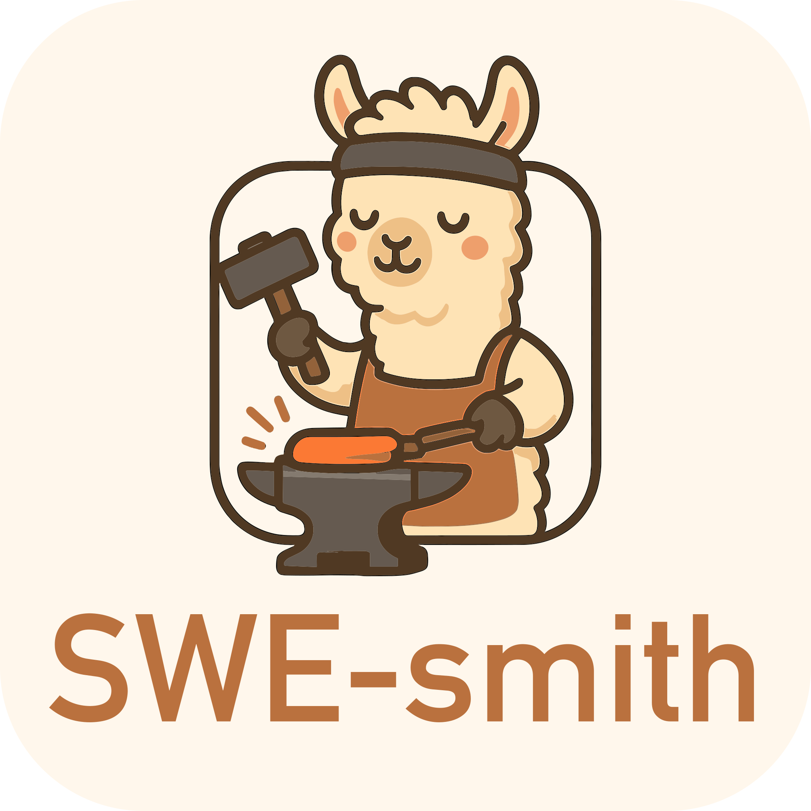
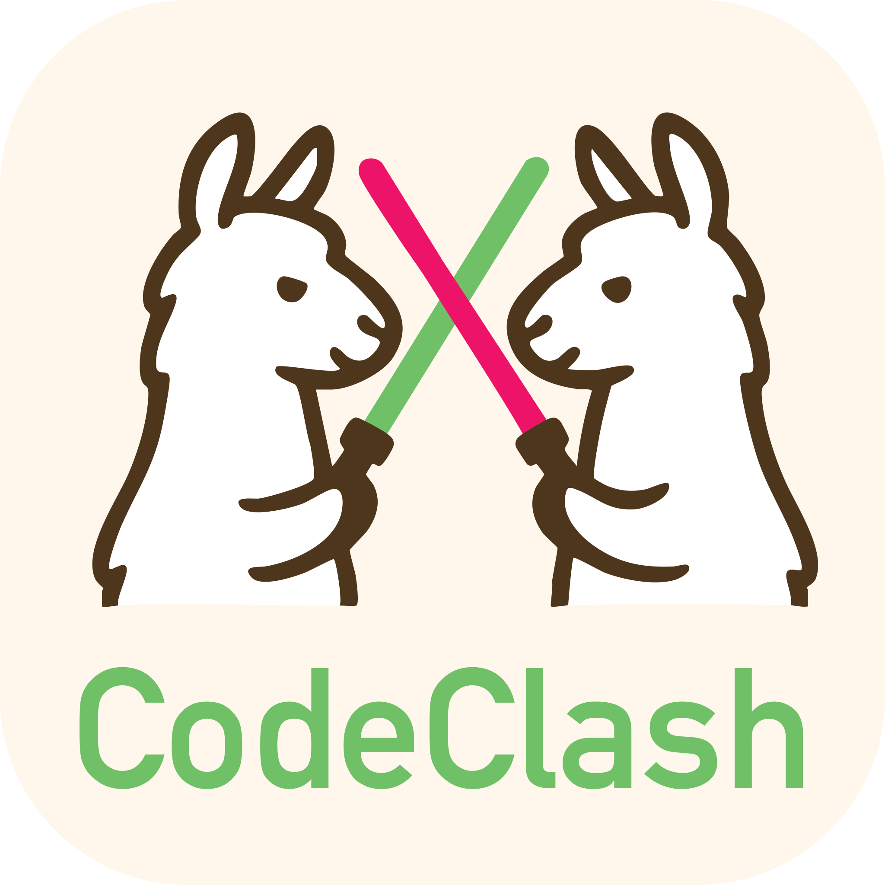
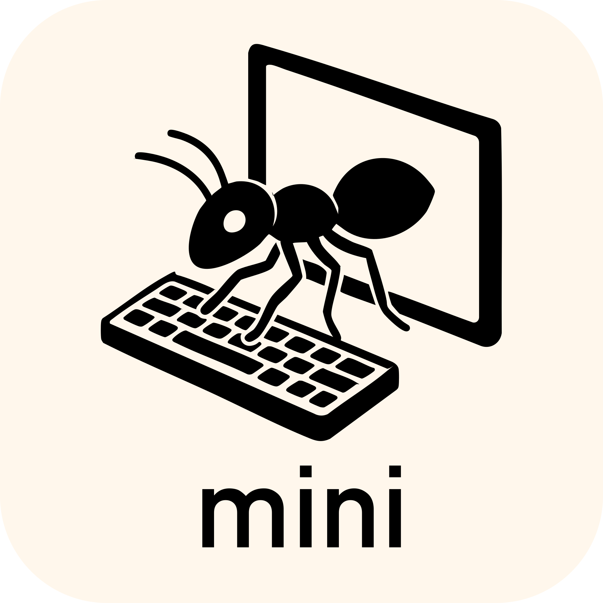

<p align="center">
  <a href="http://swe-bench.github.io">
    
  </a>
</p>

<p align="center"><strong>[&nbsp;<a href="https://swebench.com/SWE-bench/">阅读文档</a>&nbsp;]</strong></p>

<p align="center">
  <a href="docs/other_languages/README_JP.md">日本語</a> |
  <a href="docs/other_languages/README_CN.md">中文简体</a> |
  <a href="docs/other_languages/README_TW.md">中文繁體</a>
</p>

<p align="center">
    <a href="https://www.python.org/">
        
    </a>
    <a href="https://copyright.princeton.edu/policy">
        
    </a>
    <a href="https://badge.fury.io/py/swebench">
        
    </a>
</p>

---

以下工作的代码和数据：
* [ICLR 2025] <a href="https://arxiv.org/abs/2410.03859">SWE-bench Multimodal: Do AI Systems Generalize to Visual Software Domains?</a>
* [ICLR 2024 Oral] <a href="https://arxiv.org/abs/2310.06770">SWE-bench: Can Language Models Resolve Real-World GitHub Issues?</a>

## 📰 新闻
* **[Jan. 13, 2025]**：我们已将 [SWE-bench Multimodal](https://swebench.com/multimodal)（[论文](https://arxiv.org/abs/2410.03859)，[数据集](https://huggingface.co/datasets/SWE-bench/SWE-bench_Multimodal)）集成到此仓库中！与 SWE-bench 不同，我们将测试集的评测保持为*私有*。请使用 [sb-cli](https://github.com/swe-bench/sb-cli/tree/main) 提交到排行榜，这是我们新的基于云的评测工具。
* **[Jan. 11, 2025]**：感谢 [Modal](https://modal.com/)，你现在可以完全在云端运行评测了！更多细节请参见[这里](https://github.com/swe-bench/SWE-bench/blob/main/docs/assets/evaluation.md#%EF%B8%8F-evaluation-with-modal)。
* **[Aug. 13, 2024]**：介绍 *SWE-bench Verified*！这是我们与 [OpenAI Preparedness](https://openai.com/preparedness/) 合作的第二部分。它包含 500 个已被真实软件工程师确认可解的问题子集。更多内容请查看[报告](https://openai.com/index/introducing-swe-bench-verified/)！
* **[Jun. 27, 2024]**：SWE-bench 迎来一项令人振奋的更新，在 [OpenAI Preparedness](https://openai.com/preparedness/) 团队支持下：我们正在迁移到使用 Docker 的全容器化评测框架，以实现更可复现的评测！更多信息请阅读我们的[报告](https://github.com/swe-bench/SWE-bench/blob/main/docs/20240627_docker/README.md)。
* **[Apr. 2, 2024]**：我们发布了 [SWE-agent](https://github.com/SWE-agent/SWE-agent)，它在完整 SWE-bench 测试集上达到了当前最佳结果！([Tweet 🔗](https://twitter.com/jyangballin/status/1775114444370051582))
* **[Jan. 16, 2024]**：SWE-bench 已被 ICLR 2024 接收为口头报告！([OpenReview 🔗](https://openreview.net/forum?id=VTF8yNQM66))

## 👋 概述
SWE-bench 是一个用于在从 GitHub 收集的真实软件问题上评估大语言模型的基准。
给定一个*代码库*和一个*issue*，语言模型的任务是生成一个*补丁*来解决所描述的问题。


要访问 SWE-bench，请复制并运行以下代码：
```python
from datasets import load_dataset
swebench = load_dataset('princeton-nlp/SWE-bench', split='test')
```

## 🚀 设置
SWE-bench 使用 Docker 来实现可复现的评测。
请按照 [Docker setup guide](https://docs.docker.com/engine/install/) 中的说明在你的机器上安装 Docker。
如果你在 Linux 上进行设置，我们也建议查看 [post-installation steps](https://docs.docker.com/engine/install/linux-postinstall/)。

最后，如需从源码构建 SWE-bench，请按照以下步骤操作：
```bash
git clone git@github.com:princeton-nlp/SWE-bench.git
cd SWE-bench
pip install -e .
```

通过运行以下命令测试你的安装：
```bash
python -m swebench.harness.run_evaluation \
    --predictions_path gold \
    --max_workers 1 \
    --instance_ids sympy__sympy-20590 \
    --run_id validate-gold
```
> [!NOTE]
> 如果使用 macOS M 系列或其他基于 ARM 的系统，请在上述脚本中添加 `--namespace ''`。
> 默认情况下，评测脚本会从 [DockerHub](https://hub.docker.com/u/swebench) 拉取镜像（为 Linux 构建）。
> 添加 `--namespace ''` 会改为在本地构建评测镜像。

## 💽 用法
使用以下命令在 SWE-bench Lite 上评估补丁预测：
```bash
python -m swebench.harness.run_evaluation \
    --dataset_name princeton-nlp/SWE-bench_Lite \
    --predictions_path <path_to_predictions> \
    --max_workers <num_workers> \
    --run_id <run_id>
    # use --predictions_path 'gold' to verify the gold patches
    # use --run_id to name the evaluation run
    # use --modal true to run on Modal
```

此命令将在当前目录中生成 Docker 构建日志（`logs/build_images`）和评测日志（`logs/run_evaluation`）。

最终评测结果将保存在 `evaluation_results` 目录中。

> [!WARNING]
> SWE-bench 评测可能非常消耗资源
> 我们建议在具有至少 120GB 可用存储、16GB 内存和 8 个 CPU 核心的 `x86_64` 机器上运行。
> 我们建议 `--max_workers` 使用不超过 `min(0.75 * os.cpu_count(), 24)` 的值。
>
> 如果使用 Docker Desktop 运行，请确保将虚拟磁盘空间增加到约 120GB 可用空间。对于 Docker 可用的 CPU，请将 `max_workers` 设置为与上述建议一致。
>
> 对 `arm64` 机器的支持仍处于实验阶段。

要查看评测框架的完整参数列表，请运行：
```bash
python -m swebench.harness.run_evaluation --help
```

有关可评测数据集的完整说明，请参阅[评测教程](docs/guides/evaluation.md)。
如果你在寻找非本地、基于云的评测，请查看……
* [sb-cli](https://github.com/swe-bench/sb-cli)，我们的工具，可在 AWS 上自动运行评测，或者……
* 在 [Modal](https://modal.com/) 上运行 SWE-bench 评测。详见[这里](docs/guides/evaluation.md#Cloud-Based-Evaluation)

此外，你还可以：
* 在我们预处理的数据集上[训练](https://github.com/swe-bench/SWE-bench/tree/main/swebench/inference/make_datasets)你自己的模型。（🆕 欢迎查看 [SWE-smith](https://swesmith.com/)，这是一个专门用于创建 SWE 训练数据的工具包。）
* 在现有模型（本地模型和 API 模型）上运行[inference](docs/reference/inference.md)。推理步骤是指你向模型提供一个仓库 + issue，并让它生成修复方案。
*  在你自己的仓库上运行 SWE-bench 的[数据收集流程](https://github.com/swe-bench/SWE-bench/blob/main/swebench/collect/)（[教程](docs/guides/collection.md)），以创建新的 SWE-Bench 任务。
    * ⚠️ 我们暂时暂停了对创建 SWE-bench 实例相关问题的支持。请参阅教程中的说明。

## ⬇️ 下载
| Datasets | Models | RAG |
| - | - | - |
| [💿 SWE-bench](https://huggingface.co/datasets/SWE-bench/SWE-bench) | [🦙 SWE-Llama 13b](https://huggingface.co/princeton-nlp/SWE-Llama-13b) | [🤗 "Oracle" Retrieval](https://huggingface.co/datasets/princeton-nlp/SWE-bench_oracle) |
| [💿 SWE-bench Lite](https://huggingface.co/datasets/SWE-bench/SWE-bench_Lite) | [🦙 SWE-Llama 13b (PEFT)](https://huggingface.co/princeton-nlp/SWE-Llama-13b-peft) | [🤗 BM25 Retrieval 13K](https://huggingface.co/datasets/princeton-nlp/SWE-bench_bm25_13K) |
| [💿 SWE-bench Verified](https://huggingface.co/datasets/SWE-bench/SWE-bench_Verified) | [🦙 SWE-Llama 7b](https://huggingface.co/princeton-nlp/SWE-Llama-7b) | [🤗 BM25 Retrieval 27K](https://huggingface.co/datasets/princeton-nlp/SWE-bench_bm25_27K) |
| [💿 SWE-bench Multimodal](https://huggingface.co/datasets/SWE-bench/SWE-bench_Multimodal) | [🦙 SWE-Llama 7b (PEFT)](https://huggingface.co/princeton-nlp/SWE-Llama-7b-peft) | [🤗 BM25 Retrieval 40K](https://huggingface.co/datasets/princeton-nlp/SWE-bench_bm25_40K) |
| | | [🤗 BM25 Retrieval 50K (Llama tokens)](https://huggingface.co/datasets/princeton-nlp/SWE-bench_bm25_50k_llama) |

## 💫 贡献
我们非常希望听到更广泛的 NLP、机器学习和软件工程研究社区的声音，也欢迎任何贡献、pull request 或 issue！
如需参与，请提交新的 pull request 或 issue，并填写相应模板。我们会尽快跟进！

联系人：[Carlos E. Jimenez](http://www.carlosejimenez.com/) 和 [John Yang](https://john-b-yang.github.io/)（Email: carlosej@princeton.edu, johnby@stanford.edu）。

## ✍️ 引用与许可证
MIT 许可证。请查看 `LICENSE.md`。

如果你觉得我们的工作有帮助，请使用以下引用。

SWE-bench（Verified）的引用：
```bibtex
@inproceedings{
    jimenez2024swebench,
    title={{SWE}-bench: Can Language Models Resolve Real-world Github Issues?},
    author={Carlos E Jimenez and John Yang and Alexander Wettig and Shunyu Yao and Kexin Pei and Ofir Press and Karthik R Narasimhan},
    booktitle={The Twelfth International Conference on Learning Representations},
    year={2024},
    url={https://openreview.net/forum?id=VTF8yNQM66}
}
```

SWE-bench Multimodal 的引用：
```bibtex
@inproceedings{
    yang2024swebenchmultimodal,
    title={{SWE}-bench Multimodal: Do AI Systems Generalize to Visual Software Domains?},
    author={John Yang and Carlos E. Jimenez and Alex L. Zhang and Kilian Lieret and Joyce Yang and Xindi Wu and Ori Press and Niklas Muennighoff and Gabriel Synnaeve and Karthik R. Narasimhan and Diyi Yang and Sida I. Wang and Ofir Press},
    booktitle={The Thirteenth International Conference on Learning Representations},
    year={2025},
    url={https://openreview.net/forum?id=riTiq3i21b}
}
```

SWE-bench Multilingual 的引用：
```bibtex
@misc{yang2025swesmith,
    title={SWE-smith: Scaling Data for Software Engineering Agents},
    author={John Yang and Kilian Lieret and Carlos E. Jimenez and Alexander Wettig and Kabir Khandpur and Yanzhe Zhang and Binyuan Hui and Ofir Press and Ludwig Schmidt and Diyi Yang},
    year={2025},
    eprint={2504.21798},
    archivePrefix={arXiv},
    primaryClass={cs.SE},
    url={https://arxiv.org/abs/2504.21798},
}
```

## 我们的其他项目

<div align="center">
  <a href="https://github.com/SWE-bench/sb-cli"></a>
   &nbsp;&nbsp;
  <a href="https://github.com/SWE-bench/SWE-smith"></a>
   &nbsp;&nbsp;
  <a href="https://github.com/SWE-agent/SWE-agent"></a>
   &nbsp;&nbsp;
  <a href="https://github.com/codeclash-ai/codeclash"></a>
  &nbsp;&nbsp;
  <a href="https://github.com/SWE-agent/Mini-SWE-Agent"></a>
  &nbsp;&nbsp;
  <a href="https://github.com/SWE-agent/SWE-ReX"></a>
</div>
