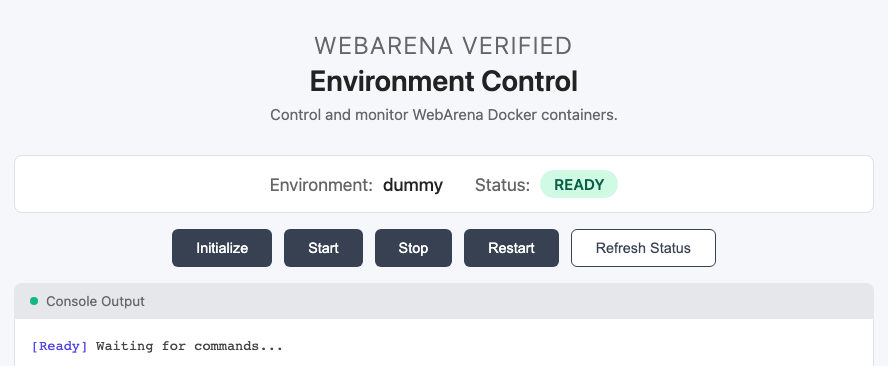

# WebArena-Verified

<p align="center">
  <a href="https://pypi.org/project/webarena-verified/"></a>
  <a href="https://github.com/ServiceNow/webarena-verified/pkgs/container/webarena-verified"></a>
  <a href="pyproject.toml"></a>
  <a href="tests"></a>
  <a href="https://servicenow.github.io/webarena-verified/"></a>
  <a href="https://huggingface.co/datasets/AmineHA/WebArena-Verified"></a>
</p>

WebArena-Verified 是 WebArena 基准测试的验证发布版本。它提供了一套经过整理并受版本控制的 Web 任务数据集，以及基于代理响应和捕获的网络跟踪进行判定的确定性评测器。该项目专为 Web 代理的可复现基准测试而设计，提供了用于单任务调试和批量评估的工具。

<p align="center">
  <a href="https://servicenow.github.io/webarena-verified/">📖 文档</a>
</p>

## 📢 公告

- **2026 年 2 月 2 日**：所有 WebArena 环境的优化 Docker 镜像现已在 [Docker Hub](https://hub.docker.com/u/am1n3e) 上可用！镜像比原始版本缩小高达 92%，包含自动登录请求头，以及 Map（beta）的单容器方案（之前需要 5 个独立容器）。请参阅[环境文档](https://servicenow.github.io/webarena-verified/environments/)。
- **2026 年 2 月 2 日**：WebArena-Verified 现已通过 Docker 和 uvx 可用！运行 `uvx webarena-verified --help` 或 `docker run ghcr.io/servicenow/webarena-verified:latest --help` 即可开始使用。
- **2026 年 1 月 7 日**：WebArena-Verified 现已在 PyPI 上可用！可通过 `pip install webarena-verified` 轻松安装。
- **2025 年 12 月 2 日**：我们将于 12 月 7 日在圣地亚哥的 NeurIPS 2025 [Scaling Environments for Agents (SEA) Workshop](https://sea-workshop.github.io/) 上展示 WebArena-Verified。欢迎来看看！
- **2024 年 11 月 12 日**：开始向协作者发布初始版本以收集早期反馈、发现问题并完善文档。**公开发布定于 2025 年 12 月 4 日。**

## 🎯 亮点

- **完全审计的基准测试**：每个任务、参考答案和评估器都经过人工审核和修正
- **离线评估**：使用网络跟踪回放评估代理运行，无需在线 Web 环境
- **确定性评分**：移除了 LLM-as-a-judge 评估和子串匹配，改用类型感知的归一化和结构化比较
- **WebArena-Verified Hard 子集**：一个按难度优先排序的 258 个任务的子集，用于高性价比评估

## 使用方法

### uvx（无需安装）

```bash
uvx webarena-verified COMMAND [ARGS]
```

### pip / uv（项目依赖）

```bash
# 设置（选择一种方式）
pip install webarena-verified
# uv add webarena-verified

# 使用
webarena-verified COMMAND [ARGS]
# 或（在 uv 管理的项目中）
uv run webarena-verified COMMAND [ARGS]
```

### Docker

```bash
# 使用
docker run --rm ghcr.io/servicenow/webarena-verified:latest COMMAND [ARGS]
```

示例：

```bash
uvx webarena-verified eval-tasks --task-ids 108 --output-dir examples/agent_logs/demo
```

## 数据集

WebArena-Verified 提供：

- 完整数据集：包含所有 812 个经验证任务（覆盖支持的网站）的完整基准测试。
- Hard 子集：一个按难度优先排序的 258 个任务子集，用于更快、更低成本的评估。

### 完整数据集

```bash
# 从仓库
cat assets/dataset/webarena-verified.json > webarena-verified.json

# 从 CLI
webarena-verified dataset-get --output webarena-verified.json

# 从 Docker
docker run --rm \
  -v "$PWD:/data" \
  ghcr.io/servicenow/webarena-verified:latest \
  dataset-get --output /data/webarena-verified.json
```

从 Hugging Face 数据集获取：

```python
from datasets import load_dataset

dataset = load_dataset("AmineHA/WebArena-Verified", split="full")
```

### Hard 子集

```bash
# 从 CLI
webarena-verified subset-export --name webarena-verified-hard --output webarena-verified-hard.json

# 从 Docker
docker run --rm \
  -v "$PWD:/data" \
  ghcr.io/servicenow/webarena-verified:latest \
  subset-export --name webarena-verified-hard --output /data/webarena-verified-hard.json
```

从 Hugging Face 数据集获取：

```python
from datasets import load_dataset

dataset = load_dataset("AmineHA/WebArena-Verified", split="hard")
```

## 🌐 环境

> 注意：我们已修复多个环境中的已知问题。有关修复和当前行为的详情，请参阅[环境文档](https://servicenow.github.io/webarena-verified/environments/)。

### 启动和停止网站

使用内置 CLI 运行网站，或直接使用 Docker 运行网站容器。

```bash
# CLI
webarena-verified env start --site <site>  # 站点：shopping, shopping_admin, reddit, gitlab, wikipedia, map
webarena-verified env setup init --site wikipedia --data-dir ./downloads  # 需要下载数据
webarena-verified env start --site wikipedia --data-dir ./downloads
webarena-verified env setup init --site map --data-dir ./downloads  # 需要下载数据
webarena-verified env start --site map
webarena-verified env stop --site <site>
webarena-verified env stop-all

# Docker
docker run -d --name webarena-verified-shopping -p 7770:80 -p 7771:8877 am1n3e/webarena-verified-shopping
docker run -d --name webarena-verified-shopping_admin -p 7780:80 -p 7781:8877 am1n3e/webarena-verified-shopping_admin
docker run -d --name webarena-verified-reddit -p 9999:80 -p 9998:8877 am1n3e/webarena-verified-reddit
docker run -d --name webarena-verified-gitlab -p 8023:8023 -p 8024:8877 am1n3e/webarena-verified-gitlab

# Wikipedia：需要 --data-dir 设置和挂载数据卷
docker run -d --name webarena-verified-wikipedia \
  -p 8888:8080 -p 8889:8874 \
  -v /path/to/downloads:/data:ro \
  am1n3e/webarena-verified-wikipedia

# Map：先运行设置（webarena-verified env setup init --site map --data-dir ./downloads）
docker run -d --name webarena-verified-map \
  -p 3030:3000 -p 3031:8877 \
  -v webarena-verified-map-tile-db:/data/database \
  -v webarena-verified-map-routing-car:/data/routing/car \
  -v webarena-verified-map-routing-bike:/data/routing/bike \
  -v webarena-verified-map-routing-foot:/data/routing/foot \
  -v webarena-verified-map-nominatim-db:/data/nominatim/postgres \
  -v webarena-verified-map-nominatim-flatnode:/data/nominatim/flatnode \
  -v webarena-verified-map-website-db:/var/lib/postgresql/14/main \
  -v webarena-verified-map-tiles:/data/tiles \
  -v webarena-verified-map-style:/data/style \
  am1n3e/webarena-verified-map
```

### 环境控制

通过 env-ctrl 使用 CLI 或 HTTP API 检查状态和初始化环境。

```bash
# CLI（在运行中的站点容器内）
docker exec <container> env-ctrl status
docker exec <container> env-ctrl init

# HTTP
curl http://localhost:8877/status
curl -X POST http://localhost:8877/init
```

<p align="center">
  
</p>

各站点的 Docker 命令、端口和凭据请参阅[环境文档](https://servicenow.github.io/webarena-verified/environments/)和[环境控制文档](https://servicenow.github.io/webarena-verified/environments/environment_control/)。

## 🧪 评估任务

使用 CLI 或编程方式评估任务：

**CLI：**
```bash
webarena-verified eval-tasks \
  --task-ids 108 \
  --output-dir examples/agent_logs/demo \
  --config examples/configs/config.example.json
```

**库：**

首先创建一个带有环境配置的 `WebArenaVerified` 实例：

```python
from pathlib import Path
from webarena_verified.api import WebArenaVerified
from webarena_verified.types.config import WebArenaVerifiedConfig

# Initialize with configuration
config = WebArenaVerifiedConfig(
    environments={
        "__GITLAB__": {
            "urls": ["http://localhost:8012"],
            "credentials": {"username": "root", "password": "demopass"}
        }
    }
)
wa = WebArenaVerified(config=config)

# Get a single task
task = wa.get_task(44)
print(f"Task intent: {task.intent}")
```

获取代理输出后，根据任务定义对其进行评估：

**使用文件：**
```python
# Evaluate a task with file paths
result = wa.evaluate_task(
    task_id=44,
    agent_response=Path("output/44/agent_response_44.json"),
    network_trace=Path("output/44/network_44.har")
)

print(f"Score: {result.score}, Status: {result.status}")
```

**使用内联响应：**
```python
# Evaluate a task with inline response
result = wa.evaluate_task(
    task_id=44,
    agent_response={
        "task_type": "NAVIGATE",
        "status": "SUCCESS",
        "retrieved_data": None
    },
    network_trace=Path("output/44/network_44.har")
)

print(f"Score: {result.score}, Status: {result.status}")
```

使用示例任务日志的完整演练请参阅[快速开始指南](https://servicenow.github.io/webarena-verified/)。

## 📊 数据集

- WebArena Verified 数据集位于 `assets/dataset/webarena-verified.json`
- 原始 WebArena 数据集位于 `assets/dataset/test.raw.json`（保留作参考）
- WebArena Verified Hard 子集的任务 ID 位于 `assets/dataset/subsets/webarena-verified-hard.json`

要导出 Hard 子集的任务数据：

```bash
webarena-verified subset-export --name webarena-verified-hard --output webarena-verified-hard.json
```

更多信息请参阅[文档](https://servicenow.github.io/webarena-verified/)。

## 🤝 贡献

我们欢迎对数据集和评估工具的改进。请参阅[贡献指南](CONTRIBUTING.md)了解准则、本地开发技巧和数据集更新工作流。

## 📄 引用

如果您在研究中使用 WebArena-Verified，请引用我们的论文：

```bibtex
@inproceedings{
hattami2025webarena,
title={WebArena Verified: Reliable Evaluation for Web Agents},
author={Amine El hattami and Megh Thakkar and Nicolas Chapados and Christopher Pal},
booktitle={Workshop on Scaling Environments for Agents},
year={2025},
url={https://openreview.net/forum?id=94tlGxmqkN}
}
```

## 🙏 致谢

我们感谢 [Prof. Shuyan Zhou](https://scholars.duke.edu/person/shuyan.zhou) 和 [Prof. Graham Neubig](https://miis.cs.cmu.edu/people/222215657/graham-neubig) 提供的宝贵指导和反馈。
