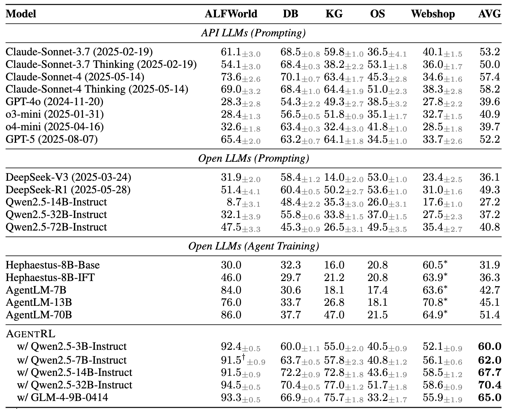

# AgentBench


<p align="center">
   <a href="https://docs.google.com/spreadsheets/d/e/2PACX-1vRR3Wl7wsCgHpwUw1_eUXW_fptAPLL3FkhnW_rua0O1Ji_GIVrpTjY5LaKAhwO-WeARjnY_KNw0SYNJ/pubhtml" target="_blank">🌐 排行榜（最新）</a> | <a href="https://twitter.com/thukeg" target="_blank">🐦 Twitter</a> | <a href="mailto:agentbench@googlegroups.com">✉️ Google Group</a> | <a href="https://arxiv.org/abs/2308.03688" target="_blank">📃 论文 </a>
</p>

<p align="center">
👋 欢迎加入我们的 <a href="https://join.slack.com/t/agentbenchcol-huw1944/shared_invite/zt-20ixabcuv-31cFLBAkqGQxQkJqrWVEVg" target="_blank">Slack</a>  进行<i>问答交流</i>或<i><b>协作开发</b> AgentBench 下一版本</i>！
</p>

## 🔥[2025.10.10] 推出基于 [AgentRL](https://github.com/THUDM/AgentRL) 的 **AgentBench FC（函数调用）**

当前仓库包含 AgentBench 的函数调用版本，已与 [AgentRL](https://github.com/THUDM/AgentRL) 集成，后者是一个端到端的多任务、多轮次 LLM 代理强化学习框架。
如需使用旧版本，可以切换到 [v0.1](https://github.com/THUDM/AgentBench/tree/v0.1) 和 [v0.2](https://github.com/THUDM/AgentBench/tree/v0.2)。

与原始 AgentBench 相比，此版本采用函数调用风格的提示词，
并为以下任务添加了完全容器化的部署支持：

- `alfworld` (AF)
- `dbbench` (DB)
- `knowledgegraph` (KG)
- `os_interaction` (OS)
- `webshop` (WS)

### 快速开始

我们支持使用 Docker Compose 一条命令快速设置上述所有任务。

开始之前，请下载或构建以下任务所需的 Docker 镜像：

```shell
# dbbench
docker pull mysql:8

# os_interaction
docker build -t local-os/default -f ./data/os_interaction/res/dockerfiles/default data/os_interaction/res/dockerfiles
docker build -t local-os/packages -f ./data/os_interaction/res/dockerfiles/packages data/os_interaction/res/dockerfiles
docker build -t local-os/ubuntu -f ./data/os_interaction/res/dockerfiles/ubuntu data/os_interaction/res/dockerfiles
```

要运行 KG freebase 服务器，你还需要从[这里](https://github.com/dki-lab/Freebase-Setup)获取一份数据副本。
下载、解压后将数据放置在 `./virtuoso_db/virtuoso.db`（或修改 `extra/docker-compose.yml` 并将挂载点设置为你的数据位置）。

然后，你可以使用以下命令启动服务栈：

```shell
docker compose -f extra/docker-compose.yml up
```

此命令将下载或构建所需的 Docker 镜像，并在 Docker 中启动以下服务：

- AgentRL 控制器
- `alfworld` 任务工作节点（x1，可按需增加）
- `dbbench` 任务工作节点（x1，可按需增加）
- `knowledgegraph` 任务工作节点（x1，可按需增加）
- `os_interaction` 任务工作节点（x1，可按需增加）
- `webshop` 任务工作节点（x1，可按需增加）
- freebase 服务器（用于 `knowledgegraph` 任务）
- Redis 服务器（用于容器分配）

如果你的机器已经在运行 Redis（7+ 版本），可以从 `docker-compose.yml` 中移除 Redis 服务。

> [!WARNING]
> 请注意 `webshop` 环境启动时需要约 16GB 内存，
> 而 `alfworld` 的当前实现在任务工作节点重启之前会持续泄漏内存和磁盘空间。
> 运行前请确保机器有充足的资源。

### 基准测试结果

我们报告了各模型在 AgentBench FC 测试集上的结果。



完整结果请查看我们的[排行榜](https://docs.google.com/spreadsheets/d/e/2PACX-1vRR3Wl7wsCgHpwUw1_eUXW_fptAPLL3FkhnW_rua0O1Ji_GIVrpTjY5LaKAhwO-WeARjnY_KNw0SYNJ/pubhtml)。
如有任何问题或希望贡献你的结果，请联系 [agentbench_fc&#64;googlegroups.com](mailto:agentbench_fc@googlegroups.com)。

---

## 🔥[2024.08.13] 推出 [VisualAgentBench](https://github.com/THUDM/VisualAgentBench)

VisualAgentBench 旨在基于大型多模态模型（LMMs）评估和训练视觉基础代理。我们引入了 5 种不同的环境，涵盖

* 具身：VAB-OmniGibson、VAB-Minecraft
* GUI：VAB-Mobile、VAB-WebArena-Lite
* 视觉设计：VAB-CSS

系统性基准测试了 17 个 LMM（包括商业模型和开源 LMM）。我们还提供了用于开源 LMM 行为克隆训练的轨迹数据集，供你开发自己的视觉基础代理！

---

以下是原始 AgentBench (v0.2) 的介绍。

# AgentBench：将 LLM 作为代理进行评估

https://github.com/THUDM/AgentBench/assets/129033897/656eed6e-d9d9-4d07-b568-f43f5a451f04

**AgentBench** 是首个旨在跨多种不同环境评估 **LLM-as-Agent** 的基准测试。它包含 8 种不同的环境，以更全面地评估 LLM 在各种场景下作为自主代理运行的能力。这些环境包括 5 个全新创建的领域：

-   操作系统 (OS)
-   数据库 (DB)
-   知识图谱 (KG)
-   数字卡牌游戏 (DCG)
-   横向思维谜题 (LTP)

以及 3 个从已发布数据集重新编译的领域：

-   家务 (HH) ([ALFWorld](https://github.com/alfworld/alfworld))
-   网络购物 (WS) ([WebShop](https://github.com/princeton-nlp/webshop))
-   网页浏览 (WB) ([Mind2Web](https://github.com/OSU-NLP-Group/Mind2Web))


## 目录

-   [数据集概览](#数据集概览)
-   [排行榜](#排行榜)
-   [快速开始](#快速开始)
-   [后续步骤](#后续步骤)
-   [引用](#引用)

## 数据集概览

我们为每个数据集提供两个划分：开发集（Dev）和测试集（Test）。多轮交互分别需要 LLM 生成约 4k 和 13k 次。


## 排行榜

以下是 AgentBench 测试集（标准）结果的评分。


虽然 LLM 开始展现出其作为代理的能力，但模型之间的差距以及距离实际可用性仍有显著距离。


## 快速开始

本节将指导你如何快速使用 gpt-3.5-turbo-0613 作为代理来启动 `dbbench-std` 和 `os-std` 任务。
有关具体的框架结构，请参阅[框架介绍](docs/Introduction_en.md)。
有关更详细的配置和启动方法，请查看[配置指南](docs/Config_en.md)
和[程序入口指南](docs/Entrance_en.md)。

### 第 1 步：前置条件

克隆此仓库并安装依赖。

> **Python 版本说明：** AgentBench 固定了较旧的科学计算 Python 依赖（如 `numpy~=1.23.x`）。
> 使用推荐的 **Python 3.9**（通过 conda）是安装依赖最可靠的方式。

```bash
cd AgentBench
conda create -n agent-bench python=3.9
conda activate agent-bench
pip install -r requirements.txt
```

确保已正确安装 [Docker](https://www.docker.com/)。

```bash
docker ps
```

为 `dbbench-std` 和 `os-std` 构建所需的镜像。

```bash
docker pull mysql
docker pull ubuntu
docker build -f data/os_interaction/res/dockerfiles/default data/os_interaction/res/dockerfiles --tag local-os/default
docker build -f data/os_interaction/res/dockerfiles/packages data/os_interaction/res/dockerfiles --tag local-os/packages
docker build -f data/os_interaction/res/dockerfiles/ubuntu data/os_interaction/res/dockerfiles --tag local-os/ubuntu
```

### 第 2 步：配置代理

在 `configs/agents/openai-chat.yaml` 中的正确位置填入你的 OpenAI API Key。（例如 `gpt-3.5-turbo-0613`）

你可以尝试使用 `python -m src.client.agent_test` 来检查代理是否配置正确。

默认情况下，将启动 `gpt-3.5-turbo-0613`。你可以通过修改参数替换为其他代理：

```bash
python -m src.client.agent_test --config configs/agents/api_agents.yaml --agent gpt-3.5-turbo-0613
```

### 第 3 步：启动任务服务器

启动任务工作节点涉及特定任务。手动启动可能比较繁琐；因此，我们提供了自动化脚本。

此步骤的前提是端口 5000 到 5015 可用。对于 Mac OS 系统，你可能需要按照[这里](https://stackoverflow.com/questions/69955686/why-cant-i-run-the-project-on-port-5000)的说明释放端口 5000。

```bash
python -m src.start_task -a
```

这将为 `dbbench-std` 和 `os-std` 任务各启动五个任务工作节点，并自动将它们连接到端口 5000 上的控制器。**执行此命令后，请等待约 1 分钟以完成任务设置。** 如果终端显示 ".... 200 OK"，你可以打开另一个终端继续第 4 步。

#### 轻量预设（笔记本电脑 / 内存有限）

如果你想以最小并发度（每个任务 1 个工作节点）启动，请使用轻量预设：

```bash
python -m src.start_task -a --config configs/start_task_lite.yaml
```

### 第 4 步：启动分配器

此步骤用于实际启动任务。

如果到目前为止一切配置正确，你现在可以发起任务测试。

```bash
python -m src.assigner
```

如果你使用轻量预设启动了任务服务器，也可以运行轻量评估预设：

```bash
python -m src.assigner --config configs/assignments/lite.yaml
```

## 后续步骤

如果你想启动更多任务或使用其他模型，可以参考[配置指南](docs/Config_en.md)和[程序入口指南](docs/Entrance_en.md)中的内容。

对于其余五个任务的环境，你需要下载我们提供的 Docker 镜像。

```
longinyu/agentbench-ltp
longinyu/agentbench-webshop
longinyu/agentbench-mind2web
longinyu/agentbench-card_game
longinyu/agentbench-alfworld
```

八个任务中单个任务工作节点的资源消耗大致如下，请在启动时予以考虑：

| 任务名称 | 启动速度 | 内存消耗 |
| --------- | -------- | -------- |
| webshop   | ~3 分钟  | ~15G     |
| mind2web  | ~5 分钟  | ~1G      |
| db        | ~20 秒   | < 500M   |
| alfworld  | ~10 秒   | < 500M   |
| card_game | ~5 秒    | < 500M   |
| ltp       | ~5 秒    | < 500M   |
| os        | ~5 秒    | < 500M   |
| kg        | ~5 秒    | < 500M   |

### 本地部署 KnowledgeGraph 服务
KnowledgeGraph 任务依赖于一个在线服务，该服务目前不够稳定。如果你想本地部署此服务，可以按照以下步骤操作：

**第 1 步。** <br />
下载数据库并设置服务 [freebase-setup](https://github.com/dki-lab/Freebase-Setup)。

**第 2 步。** <br />
将 `/configs/tasks/kg.yaml` 中的 `sparql_url: "http://164.107.116.56:3093/sparql"` 修改为 `sparql_url: "<你的 sparql 服务 API>"`。

**注意：** 你应该在启动代理任务服务之前先启动 KG 服务。

## 扩展 AgentBench

如果你想向 AgentBench 添加新任务，可以参考[扩展指南](docs/Extension_en.md)。

## 参考

Avalon 任务合并自 [AvalonBench](https://github.com/jonathanmli/Avalon-LLM/)，后者实现了一个多代理框架。

## 引用

```
@article{liu2023agentbench,
  title   = {AgentBench: Evaluating LLMs as Agents},
  author  = {Xiao Liu and Hao Yu and Hanchen Zhang and Yifan Xu and Xuanyu Lei and Hanyu Lai and Yu Gu and Hangliang Ding and Kaiwen Men and Kejuan Yang and Shudan Zhang and Xiang Deng and Aohan Zeng and Zhengxiao Du and Chenhui Zhang and Sheng Shen and Tianjun Zhang and Yu Su and Huan Sun and Minlie Huang and Yuxiao Dong and Jie Tang},
  year    = {2023},
  journal = {arXiv preprint arXiv: 2308.03688}
}
```
