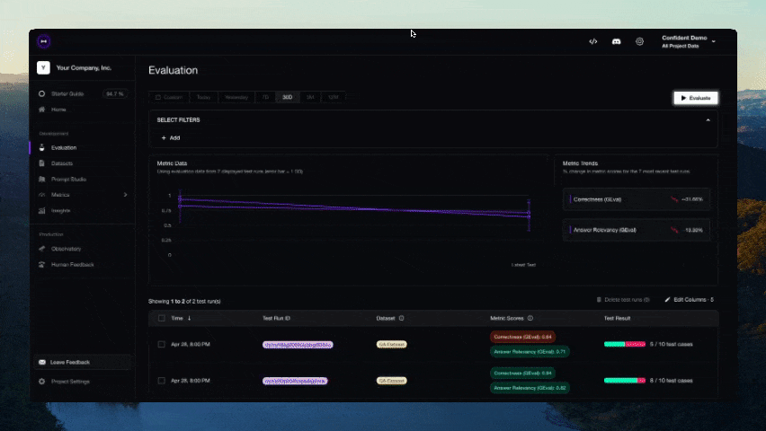

<p align="center">
    
</p>

<p align="center">
    <h1 align="center">LLM 评估框架</h1>
</p>

<p align="center">
<a href="https://trendshift.io/repositories/5917" target="_blank"></a>
</p>

<p align="center">
    <a href="https://discord.gg/3SEyvpgu2f">
        
    </a>
</p>

<h4 align="center">
    <p>
        <a href="https://deepeval.com/docs/getting-started?utm_source=GitHub">文档</a> |
        <a href="#-指标与功能">指标与功能</a> |
        <a href="#-快速开始">快速开始</a> |
        <a href="#-集成">集成</a> |
        <a href="https://confident-ai.com?utm_source=GitHub">Confident AI</a>
    <p>
</h4>

<p align="center">
    <a href="https://github.com/confident-ai/deepeval/releases">
        
    </a>
    <a href="https://colab.research.google.com/drive/1PPxYEBa6eu__LquGoFFJZkhYgWVYE6kh?usp=sharing">
        
    </a>
    <a href="https://github.com/confident-ai/deepeval/blob/master/LICENSE.md">
        
    </a>
    <a href="https://x.com/deepeval">
        
    </a>
</p>

<p align="center">
    <!-- Keep these links. Translations will automatically update with the README. -->
    <a href="https://www.readme-i18n.com/confident-ai/deepeval?lang=de">Deutsch</a> | 
    <a href="https://www.readme-i18n.com/confident-ai/deepeval?lang=es">Español</a> | 
    <a href="https://www.readme-i18n.com/confident-ai/deepeval?lang=fr">français</a> | 
    <a href="https://www.readme-i18n.com/confident-ai/deepeval?lang=ja">日本語</a> | 
    <a href="https://www.readme-i18n.com/confident-ai/deepeval?lang=ko">한국어</a> | 
    <a href="https://www.readme-i18n.com/confident-ai/deepeval?lang=pt">Português</a> | 
    <a href="https://www.readme-i18n.com/confident-ai/deepeval?lang=ru">Русский</a> | 
    <a href="https://www.readme-i18n.com/confident-ai/deepeval?lang=zh">中文</a>
</p>

**DeepEval** 是一个简单易用的开源 LLM 评估框架，用于评估大语言模型系统。它类似于 Pytest，但专门针对 LLM 应用的单元测试而设计。DeepEval 融合了最新研究成果，通过 G-Eval、任务完成度、答案相关性、幻觉等指标运行评估，这些指标依托 LLM-as-a-judge 和其他**在本地机器上运行**的 NLP 模型。

无论你是在构建 AI 代理、RAG 管道还是聊天机器人，使用 LangChain 或 OpenAI 实现，DeepEval 都能满足你的需求。借助它，你可以轻松确定最优的模型、提示词和架构来提升 AI 质量，防止提示词漂移，甚至可以放心地从 OpenAI 切换到 Claude。

> [!IMPORTANT]
> 需要一个地方来存放你的 DeepEval 测试数据 🏡❤️？[注册 DeepEval 平台](https://confident-ai.com?utm_source=GitHub)，可以比较 LLM 应用的不同迭代版本、生成并分享测试报告，以及更多功能。
>
> 

> 想讨论 LLM 评估、需要帮助选择指标，或者只是想打个招呼？[来加入我们的 Discord。](https://discord.com/invite/3SEyvpgu2f)

<br />

# 🔥 指标与功能

- 📐 丰富多样的开箱即用 LLM 评估指标（均附带说明），由你选择的**任意** LLM、统计方法或**在本地机器上运行**的 NLP 模型驱动，覆盖所有使用场景：

  - **自定义通用指标：**

    - [G-Eval](https://deepeval.com/docs/metrics-llm-evals) — 基于研究的 LLM-as-a-judge 指标，可基于任意自定义标准，以接近人工的准确度进行评估
    - [DAG](https://deepeval.com/docs/metrics-dag) — DeepEval 基于图的确定性 LLM-as-a-judge 指标构建器

  - <details>
    <summary><b>代理指标</b></summary>

    - [Task Completion](https://deepeval.com/docs/metrics-task-completion) — 评估代理是否完成了目标
    - [Tool Correctness](https://deepeval.com/docs/metrics-tool-correctness) — 检查是否以正确的参数调用了正确的工具
    - [Goal Accuracy](https://deepeval.com/docs/metrics-goal-accuracy) — 衡量代理达成预期目标的准确程度
    - [Step Efficiency](https://deepeval.com/docs/metrics-step-efficiency) — 评估代理是否执行了不必要的步骤
    - [Plan Adherence](https://deepeval.com/docs/metrics-plan-adherence) — 检查代理是否遵循了预期的计划
    - [Plan Quality](https://deepeval.com/docs/metrics-plan-quality) — 评估代理计划的质量
    - [Tool Use](https://deepeval.com/docs/metrics-tool-use) — 衡量工具使用的质量
    - [Argument Correctness](https://deepeval.com/docs/metrics-argument-correctness) — 验证工具调用参数的正确性

    </details>

  - <details>
    <summary><b>RAG 指标</b></summary>

    - [Answer Relevancy](https://deepeval.com/docs/metrics-answer-relevancy) — 衡量 RAG 管道的输出与输入的相关程度
    - [Faithfulness](https://deepeval.com/docs/metrics-faithfulness) — 评估 RAG 管道的输出是否在事实上与检索上下文一致
    - [Contextual Recall](https://deepeval.com/docs/metrics-contextual-recall) — 衡量 RAG 管道的检索上下文与预期输出的匹配程度
    - [Contextual Precision](https://deepeval.com/docs/metrics-contextual-precision) — 评估 RAG 管道检索上下文中的相关节点是否排在更前面
    - [Contextual Relevancy](https://deepeval.com/docs/metrics-contextual-relevancy) — 衡量 RAG 管道检索上下文与输入的整体相关性
    - [RAGAS](https://deepeval.com/docs/metrics-ragas) — 答案相关性、忠实度、上下文精确度和上下文召回率的平均值

    </details>

  - <details>
    <summary><b>多轮对话指标</b></summary>

    - [Knowledge Retention](https://deepeval.com/docs/metrics-knowledge-retention) — 评估聊天机器人在整个对话过程中是否保留了事实信息
    - [Conversation Completeness](https://deepeval.com/docs/metrics-conversation-completeness) — 衡量聊天机器人在整个对话过程中是否满足了用户需求
    - [Turn Relevancy](https://deepeval.com/docs/metrics-turn-relevancy) — 评估聊天机器人在整个对话过程中是否生成了一致相关的回复
    - [Turn Faithfulness](https://deepeval.com/docs/metrics-turn-faithfulness) — 检查聊天机器人的回复在各轮对话中是否在事实上基于检索上下文
    - [Role Adherence](https://deepeval.com/docs/metrics-role-adherence) — 评估聊天机器人是否在整个对话过程中遵循了其被分配的角色

    </details>

  - <details>
    <summary><b>MCP 指标</b></summary>

    - [MCP Task Completion](https://deepeval.com/docs/metrics-mcp-task-completion) — 评估基于 MCP 的代理完成任务的有效程度
    - [MCP Use](https://deepeval.com/docs/metrics-mcp-use) — 衡量代理使用其可用 MCP 服务器的有效程度
    - [Multi-Turn MCP Use](https://deepeval.com/docs/metrics-multi-turn-mcp-use) — 评估在多轮对话中的 MCP 服务器使用情况

    </details>

  - <details>
    <summary><b>多模态指标</b></summary>

    - [Text to Image](https://deepeval.com/docs/multimodal-metrics-text-to-image) — 基于语义一致性和感知质量评估图像生成质量
    - [Image Editing](https://deepeval.com/docs/multimodal-metrics-image-editing) — 基于语义一致性和感知质量评估图像编辑质量
    - [Image Coherence](https://deepeval.com/docs/multimodal-metrics-image-coherence) — 衡量图像与配套文本的一致程度
    - [Image Helpfulness](https://deepeval.com/docs/multimodal-metrics-image-helpfulness) — 评估图像对用户理解文本的有效程度
    - [Image Reference](https://deepeval.com/docs/multimodal-metrics-image-reference) — 评估图像被配套文本引用或解释的准确程度

    </details>

  - <details>
    <summary><b>其他指标</b></summary>

    - [Hallucination](https://deepeval.com/docs/metrics-hallucination) — 检查 LLM 是否根据提供的上下文生成了事实正确的信息
    - [Summarization](https://deepeval.com/docs/metrics-summarization) — 评估摘要是否事实正确且包含必要细节
    - [Bias](https://deepeval.com/docs/metrics-bias) — 检测 LLM 输出中的性别、种族或政治偏见
    - [Toxicity](https://deepeval.com/docs/metrics-toxicity) — 评估 LLM 输出中的毒性
    - [JSON Correctness](https://deepeval.com/docs/metrics-json-correctness) — 检查输出是否匹配预期的 JSON 模式
    - [Prompt Alignment](https://deepeval.com/docs/metrics-prompt-alignment) — 衡量输出是否与提示词模板中的指令一致

    </details>

- 🎯 支持端到端和组件级别的 LLM 评估。
- 🧩 构建自定义指标，自动集成到 DeepEval 生态系统中。
- 🔮 生成单轮和多轮合成数据集用于评估。
- 🔗 无缝集成到**任意** CI/CD 环境。
- 🧬 基于评估结果自动优化提示词。
- 🏆 [只需不到 10 行代码](https://deepeval.com/docs/benchmarks-introduction?utm_source=GitHub)即可在流行的 LLM 基准测试上轻松对**任意** LLM 进行基准测试，包括 MMLU、HellaSwag、DROP、BIG-Bench Hard、TruthfulQA、HumanEval、GSM8K。

<br />

# 🔌 集成

DeepEval 可以接入任何 LLM 框架 — OpenAI Agents、LangChain、CrewAI 等。要在团队中扩展评估，或让任何人无需编写代码即可运行评估，**Confident AI** 为你提供原生平台集成。

## 框架

- [OpenAI](https://www.deepeval.com/integrations/frameworks/openai?utm_source=GitHub) — 通过客户端包装器评估和追踪 OpenAI 应用
- [OpenAI Agents](https://www.deepeval.com/integrations/frameworks/openai-agents?utm_source=GitHub) — 在不到一分钟内端到端评估 OpenAI Agents
- [LangChain](https://www.deepeval.com/integrations/frameworks/langchain?utm_source=GitHub) — 通过回调处理器评估 LangChain 应用
- [LangGraph](https://www.deepeval.com/integrations/frameworks/langgraph?utm_source=GitHub) — 通过回调处理器评估 LangGraph 代理
- [Pydantic AI](https://www.deepeval.com/integrations/frameworks/pydanticai?utm_source=GitHub) — 通过类型安全的验证评估 Pydantic AI 代理
- [CrewAI](https://www.deepeval.com/integrations/frameworks/crewai?utm_source=GitHub) — 评估 CrewAI 多代理系统
- [Anthropic](https://www.deepeval.com/integrations/frameworks/anthropic?utm_source=GitHub) — 通过客户端包装器评估和追踪 Claude 应用
- [AWS AgentCore](https://www.deepeval.com/integrations/frameworks/agentcore?utm_source=GitHub) — 评估部署在 Amazon AgentCore 上的代理
- [LlamaIndex](https://www.deepeval.com/integrations/frameworks/llamaindex?utm_source=GitHub) — 评估使用 LlamaIndex 构建的 RAG 应用

## ☁️ 平台与生态系统

[Confident AI](https://confident-ai.com?utm_source=GitHub) 是一个与 DeepEval 原生集成的一体化平台。

- 管理数据集、追踪 LLM 应用、运行评估，以及监控生产环境中的响应 — 全部在一个平台上完成。
- 不需要 UI？Confident AI 也可以作为你的数据持久层 — 通过 Confident AI 的 [MCP 服务器](https://github.com/confident-ai/confident-mcp-server)，直接在 Claude Code、Cursor 中运行评估、拉取数据集和检查追踪记录。

<p align="center">
  
</p>

<br />

# 🚀 快速开始

假设你的 LLM 应用是一个基于 RAG 的客户支持聊天机器人，以下是 DeepEval 如何帮助你测试所构建的内容。

## 安装

DeepEval 需要 **Python>=3.9+**。

```
pip install -U deepeval
```

## 创建账户（强烈推荐）

使用 `deepeval` 平台可以在云端生成可分享的测试报告。它是免费的，无需额外代码即可设置，我们强烈建议你试一试。

要登录，请运行：

```
deepeval login
```

按照 CLI 中的说明创建账户、复制你的 API 密钥并粘贴到 CLI 中。所有测试用例将自动记录（在[此处](https://deepeval.com/docs/data-privacy?utm_source=GitHub)查找有关数据隐私的更多信息）。

## 编写你的第一个测试用例

创建一个测试文件：

```bash
touch test_chatbot.py
```

打开 `test_chatbot.py`，编写你的第一个测试用例，使用 DeepEval 运行**端到端**评估，将你的 LLM 应用视为黑盒：

```python
import pytest
from deepeval import assert_test
from deepeval.metrics import GEval
from deepeval.test_case import LLMTestCase, LLMTestCaseParams

def test_case():
    correctness_metric = GEval(
        name="Correctness",
        criteria="Determine if the 'actual output' is correct based on the 'expected output'.",
        evaluation_params=[LLMTestCaseParams.ACTUAL_OUTPUT, LLMTestCaseParams.EXPECTED_OUTPUT],
        threshold=0.5
    )
    test_case = LLMTestCase(
        input="What if these shoes don't fit?",
        # Replace this with the actual output from your LLM application
        actual_output="You have 30 days to get a full refund at no extra cost.",
        expected_output="We offer a 30-day full refund at no extra costs.",
        retrieval_context=["All customers are eligible for a 30 day full refund at no extra costs."]
    )
    assert_test(test_case, [correctness_metric])
```

将 `OPENAI_API_KEY` 设置为环境变量（你也可以使用自定义模型进行评估，详情请访问[文档的此部分](https://deepeval.com/docs/metrics-introduction#using-a-custom-llm?utm_source=GitHub)）：

```
export OPENAI_API_KEY="..."
```

最后，在 CLI 中运行 `test_chatbot.py`：

```
deepeval test run test_chatbot.py
```

**恭喜！你的测试用例应该已经通过了 ✅** 让我们来拆解一下发生了什么。

- 变量 `input` 模拟用户输入，`actual_output` 是你的应用基于该输入应该输出的内容的占位符。
- 变量 `expected_output` 代表给定 `input` 的理想答案，[`GEval`](https://deepeval.com/docs/metrics-llm-evals) 是 `deepeval` 提供的基于研究的指标，可基于任意自定义标准，以接近人工的准确度评估你的 LLM 输出。
- 在这个示例中，指标的 `criteria` 是基于提供的 `expected_output` 判断 `actual_output` 的正确性。
- 所有指标分数范围为 0 - 1，`threshold=0.5` 阈值最终决定你的测试是否通过。

[阅读我们的文档](https://deepeval.com/docs/getting-started?utm_source=GitHub)了解更多信息！

<br />

## 评估嵌套组件

使用 `@observe` 装饰器追踪组件（LLM 调用、检索器、工具调用、代理）并在组件级别应用指标 — 无需重写你的代码库：

```python
from deepeval.tracing import observe, update_current_span
from deepeval.test_case import LLMTestCase, LLMTestCaseParams
from deepeval.dataset import EvaluationDataset, Golden
from deepeval.metrics import GEval

correctness = GEval(
    name="Correctness",
    criteria="Determine if the 'actual output' is correct based on the 'expected output'.",
    evaluation_params=[LLMTestCaseParams.ACTUAL_OUTPUT, LLMTestCaseParams.EXPECTED_OUTPUT],
)

@observe(metrics=[correctness])
def inner_component():
    update_current_span(test_case=LLMTestCase(input="...", actual_output="..."))
    return "result"

@observe()
def llm_app(input: str):
    return inner_component()

dataset = EvaluationDataset(goldens=[Golden(input="Hi!")])
for golden in dataset.evals_iterator():
    llm_app(golden.input)
```

在[此处](https://www.deepeval.com/docs/evaluation-component-level-llm-evals)了解更多关于组件级别评估的信息。

<br />

## 不使用 Pytest 集成进行评估

或者，你可以在不使用 Pytest 的情况下进行评估，这更适合在笔记本环境中使用。

```python
from deepeval import evaluate
from deepeval.metrics import AnswerRelevancyMetric
from deepeval.test_case import LLMTestCase

answer_relevancy_metric = AnswerRelevancyMetric(threshold=0.7)
test_case = LLMTestCase(
    input="What if these shoes don't fit?",
    # Replace this with the actual output from your LLM application
    actual_output="We offer a 30-day full refund at no extra costs.",
    retrieval_context=["All customers are eligible for a 30 day full refund at no extra costs."]
)
evaluate([test_case], [answer_relevancy_metric])
```

## 使用独立指标

DeepEval 非常模块化，任何人都可以轻松使用我们的任何指标。继续上面的示例：

```python
from deepeval.metrics import AnswerRelevancyMetric
from deepeval.test_case import LLMTestCase

answer_relevancy_metric = AnswerRelevancyMetric(threshold=0.7)
test_case = LLMTestCase(
    input="What if these shoes don't fit?",
    # Replace this with the actual output from your LLM application
    actual_output="We offer a 30-day full refund at no extra costs.",
    retrieval_context=["All customers are eligible for a 30 day full refund at no extra costs."]
)

answer_relevancy_metric.measure(test_case)
print(answer_relevancy_metric.score)
# All metrics also offer an explanation
print(answer_relevancy_metric.reason)
```

请注意，某些指标适用于 RAG 管道，而另一些适用于微调。请务必使用我们的文档来选择适合你使用场景的正确指标。

## 评估数据集 / 批量测试用例

在 DeepEval 中，数据集就是测试用例的集合。以下是批量评估的方法：

```python
import pytest
from deepeval import assert_test
from deepeval.dataset import EvaluationDataset, Golden
from deepeval.metrics import AnswerRelevancyMetric
from deepeval.test_case import LLMTestCase

dataset = EvaluationDataset(goldens=[Golden(input="What's the weather like today?")])

for golden in dataset.goldens:
    test_case = LLMTestCase(
        input=golden.input,
        actual_output=your_llm_app(golden.input)
    )
    dataset.add_test_case(test_case)

@pytest.mark.parametrize(
    "test_case",
    dataset.test_cases,
)
def test_customer_chatbot(test_case: LLMTestCase):
    answer_relevancy_metric = AnswerRelevancyMetric(threshold=0.5)
    assert_test(test_case, [answer_relevancy_metric])
```

```bash
# Run this in the CLI, you can also add an optional -n flag to run tests in parallel
deepeval test run test_<filename>.py -n 4
```

<br/>

或者，虽然我们推荐使用 `deepeval test run`，但你也可以在不使用我们 Pytest 集成的情况下评估数据集/测试用例：

```python
from deepeval import evaluate
...

evaluate(dataset, [answer_relevancy_metric])
```

## 关于环境变量的说明（.env / .env.local）

DeepEval 在**导入时**从当前工作目录自动加载 `.env.local`，然后加载 `.env`。
**优先级：** 进程环境变量 -> `.env.local` -> `.env`。
通过设置 `DEEPEVAL_DISABLE_DOTENV=1` 可禁用此行为。

```bash
cp .env.example .env.local
# then edit .env.local (ignored by git)
```

# DeepEval 与 Confident AI

[Confident AI](https://confident-ai.com?utm_source=GitHub) 是一个用于管理数据集、追踪 LLM 应用以及在生产环境中运行评估的一体化平台。从 CLI 登录即可开始：

```bash
deepeval login
```

然后像往常一样运行测试 — 结果会自动同步到平台：

```bash
deepeval test run test_chatbot.py
```


更喜欢待在 IDE 中？通过 [Confident AI 的 MCP 服务器](https://github.com/confident-ai/confident-mcp-server) 将 DeepEval 用作持久化层来运行评估、拉取数据集和检查追踪记录，无需离开你的编辑器。

<p align="center">
  
</p>

Confident AI 上的所有功能可在[此处](https://www.confident-ai.com/docs?utm_source=GitHub)查看。

<br />

# 贡献

请阅读 [CONTRIBUTING.md](https://github.com/confident-ai/deepeval/blob/main/CONTRIBUTING.md) 了解我们的行为准则以及向我们提交 Pull Request 的流程。

<br />

# 路线图

功能：

- [x] 集成 Confident AI
- [x] 实现 G-Eval
- [x] 实现 RAG 指标
- [x] 实现对话指标
- [x] 评估数据集创建
- [x] 红队测试
- [ ] DAG 自定义指标
- [ ] Guardrails

<br />

# 作者

由 Confident AI 的创始人构建。如有任何咨询，请联系 jeffreyip@confident-ai.com。

<br />

# 许可证

DeepEval 基于 Apache 2.0 许可证授权 - 详情请参阅 [LICENSE.md](https://github.com/confident-ai/deepeval/blob/main/LICENSE.md) 文件。
