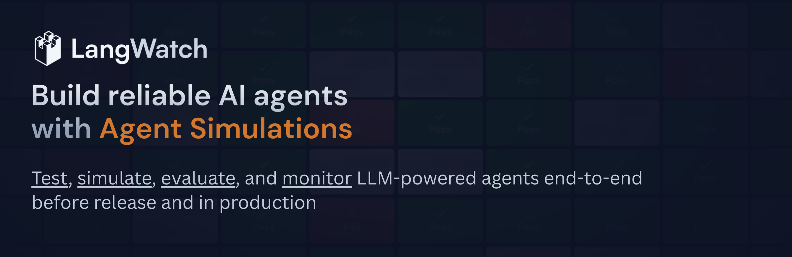

<h3 align="center">
    <a href="https://langwatch.ai">网站</a> · <a href="https://docs.langwatch.ai">文档</a> · <a href="https://discord.gg/kT4PhDS2gH">Discord</a> · <a href="https://docs.langwatch.ai/self-hosting/overview">自托管</a>
</h3>

<p align="center">
<a href="https://discord.gg/kT4PhDS2gH" target="_blank"></a>
<a href="https://pypi.python.org/pypi/langwatch" target="_blank"></a>
<a href="https://www.npmjs.com/package/langwatch" target="_blank"></a>
<a href="https://twitter.com/intent/follow?screen_name=langwatchai" target="_blank">
   </a>
</p>

<video src="https://github.com/user-attachments/assets/ff49882d-4e9d-4b7c-819b-be690fba9387" autoplay loop muted playsinline width="100%" style="display: block; aspect-ratio: 16 / 9;"></video>

## 为什么选择 LangWatch？

LLM 评估和 AI 代理测试平台。
我们帮助团队端到端地测试、模拟、评估和监控基于 LLM 的代理——涵盖发布前和生产环境。
专为需要回归测试、模拟和生产可观测性但不想自行构建定制工具的团队而设计。

- [**端到端代理模拟**](https://langwatch.ai/scenario/)
  针对你的**完整技术栈**（工具、状态、用户模拟器、评判器）运行真实场景，精确定位代理在哪里出错以及为什么出错，深入到每一个决策。

- **评估 + 可观测性 + 提示词一体化闭环**
  [追踪](https://docs.langwatch.ai/integration/overview) → [数据集](https://docs.langwatch.ai/datasets/overview) → [评估](https://docs.langwatch.ai/llm-evaluation/offline-evaluation) → [优化提示词/模型](https://docs.langwatch.ai/optimization-studio/overview) → 重新测试。无需粘合代码，无需工具泛滥。

- [**开放标准，无锁定**](https://docs.langwatch.ai/integration/opentelemetry/guide)
  原生基于 OpenTelemetry/OTLP。设计上与框架和 LLM 提供商无关。

- [**不影响交付速度的协作**](https://docs.langwatch.ai/features/annotations)
  审查运行结果、标注失败案例、更快地发布修复。让领域专家通过[标注和队列](https://docs.langwatch.ai/features/annotations)标记边缘案例，通过 [GitHub 集成](https://docs.langwatch.ai/prompt-management/features/essential/github-integration)将提示词保存在 Git 中，并[将提示词版本链接到追踪记录](https://docs.langwatch.ai/prompt-management/features/advanced/link-to-traces)。

LangWatch 为你提供代理行为的完整可见性，以及系统性提升可靠性、性能和成本效率的工具，同时让你始终掌控自己的 AI 系统

## 入门

### 云端 ☁️

开始使用 LangWatch 最简单的方式。

[创建免费账户](https://app.langwatch.ai) → 创建项目 → 开始使用并复制你的 API 密钥。

### 本地设置 💻

使用 docker compose 在你自己的机器上启动运行：

```bash
git clone https://github.com/langwatch/langwatch.git
cd langwatch
cp langwatch/.env.example langwatch/.env
docker compose up -d --wait --build
```
运行后，LangWatch 将在 `http://localhost:5560` 可用，你可以在那里创建第一个项目和 API 密钥。

### 部署选项 ⚓️

在你自己的基础设施上运行 LangWatch：

- [Docker Compose](https://docs.langwatch.ai/self-hosting/open-source#docker-compose) - 在你自己的机器上运行 LangWatch。
- [Kubernetes (Helm)](https://docs.langwatch.ai/self-hosting/open-source#helm-chart-for-langwatch) - 使用 Helm 在 Kubernetes 集群上运行 LangWatch。
- [OnPrem](https://docs.langwatch.ai/self-hosting/onprem) - 适用于 AWS、Google Cloud 和 Azure 的特定云部署方案。

<details>
<summary>混合模式（OnPrem 数据）🔀</summary>

适用于有严格数据驻留和控制要求、但不需要完全本地部署的公司。

在我们的[文档](https://docs.langwatch.ai/self-hosting/hybrid)中了解更多。

</details>

<details>
<summary>本地开发 👩‍💻</summary>

你也可以在不使用 docker 的情况下本地运行 LangWatch，以便开发和贡献此项目。

仅使用 docker 启动数据库并保持运行：

```bash
docker compose up redis postgres opensearch
```

然后，在另一个终端中，安装依赖并启动 LangWatch：

```bash
make install
make start
```

</details>

## 🚀 快速开始

在几分钟内交付更安全的代理。[创建免费账户](https://app.langwatch.ai)，然后深入了解以下指南：

- **[运行你的第一次代理模拟](https://langwatch.ai/scenario/introduction/getting-started)** - 在上线前针对真实场景测试代理
- **[设置评估](https://docs.langwatch.ai/llm-evaluation/offline-evaluation)** - 衡量质量、性能和可靠性
- **[发送你的第一次追踪](https://docs.langwatch.ai/integration/overview)** - 将 LangWatch 集成到你的技术栈中
- **[开始使用 LangWatch MCP](https://langwatch.ai/docs/integration/mcp)** - 在 Claude Desktop 和其他 MCP 客户端中使用 LangWatch

## 🗺️ 集成

LangWatch 构建并维护以下列出的多项集成。我们的追踪平台建立在 [OpenTelemetry](https://opentelemetry.io/) 之上，因此我们开箱即支持任何兼容 OpenTelemetry 的库。

**框架：**
[LangChain](https://langwatch.ai/docs/integration/python/integrations/langchain) ·
[LangGraph](https://langwatch.ai/docs/integration/python/integrations/langgraph) ·
[Vercel AI SDK](https://langwatch.ai/docs/integration/typescript/integrations/vercel-ai) ·
[Mastra](https://langwatch.ai/docs/integration/typescript/integrations/mastra) ·
[CrewAI](https://langwatch.ai/docs/integration/python/integrations/crewai) ·
[Google ADK](https://langwatch.ai/docs/integration/python/integrations/google-ai)

**模型提供商：**
[OpenAI](https://langwatch.ai/docs/integration/python/integrations/openai) ·
[Anthropic](https://langwatch.ai/docs/integration/python/integrations/anthropic) ·
[Azure](https://langwatch.ai/docs/integration/python/integrations/azure) ·
[Google Cloud](https://langwatch.ai/docs/integration/python/integrations/google-cloud) ·
[AWS](https://langwatch.ai/docs/integration/python/integrations/aws) ·
[Groq](https://langwatch.ai/docs/integration/python/integrations/groq) ·
[Ollama](https://langwatch.ai/docs/integration/python/integrations/ollama)

### 平台

[LangFlow](https://docs.langwatch.ai/integration/langflow) · [Flowise](https://docs.langwatch.ai/integration/flowise) · [n8n](https://docs.langwatch.ai/integration/n8n)

*以及更多…*

你正在使用的平台是否能从 LangWatch 的直接集成中受益？我们很乐意听取你的意见，请[**填写这份简短的表单**](https://www.notion.so/1e35e165d48280468247fcbdc3349077?pvs=21)。

## 💬 支持

有问题或需要帮助？我们通过多种方式为你提供支持：

- **文档：** 我们全面的[文档](https://docs.langwatch.ai)涵盖了从入门到高级功能的所有内容。
- **Discord 社区：** 加入我们的 [Discord 服务器](https://discord.gg/kT4PhDS2gH)，获取团队和社区的实时帮助。
- **X (Twitter)：** 在 [X](https://x.com/LangWatchAI) 上关注我们，获取更新和公告。
- **GitHub Issues：** 通过我们的 [GitHub 仓库](https://github.com/langwatch/langwatch)报告错误或请求功能。
- **企业支持：** 企业客户享有优先支持，包含专属响应时间。我们的[定价页面](https://langwatch.ai/pricing)包含更多信息。

## 🤝 协作

贡献使开源社区成为学习、启发和创造的绝佳之地。你所做的任何贡献都**深受感激**。

请阅读我们的[贡献指南](https://github.com/langwatch/langwatch/blob/main/CONTRIBUTING.md)，了解我们的行为准则和提交拉取请求的流程。

## ✍️ 许可证

请阅读我们的 [LICENSE.md](/LICENSE.md) 文件。

## 👮‍♀️ 安全与合规

作为一个可能接触到高度敏感数据的平台，我们极其重视安全问题，并将其视为我们文化的核心组成部分。

| 法律框架 | 当前状态 |
| --------------- | -------------- |
| GDPR            | 已合规。可应要求提供 DPA。 |
| ISO 27001       | 已认证。可在企业版方案中应要求提供认证报告。 |

请参阅我们的安全页面了解更多信息。如果你有任何进一步的问题，请通过 [security@langwatch.ai](mailto:security@langwatch.ai) 联系我们。

### 漏洞披露

如果你需要对安全漏洞进行负责任的披露，可以通过电子邮件发送至 [security@langwatch.ai](mailto:security@langwatch.ai)，或者如果你更愿意，可以在 [Discord](https://discord.com/invite/kT4PhDS2gH) 上私下联系我们的团队成员。
