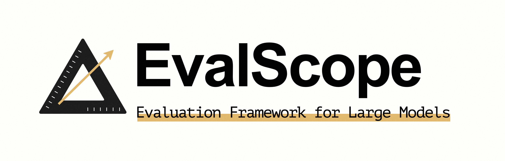
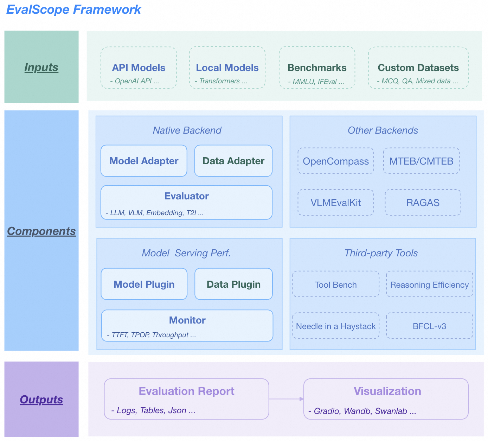
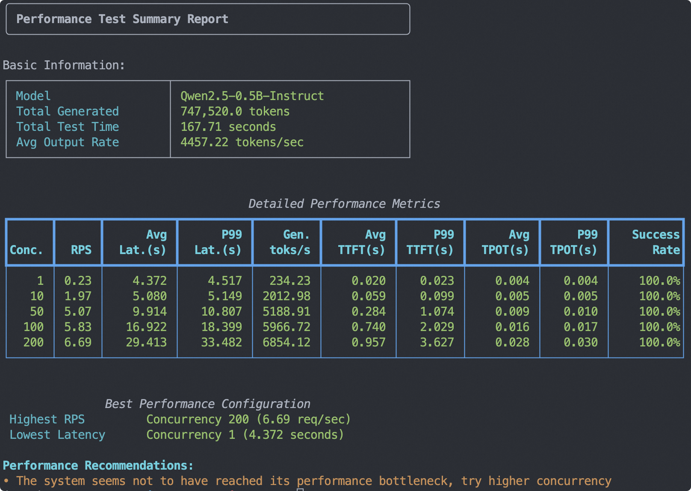
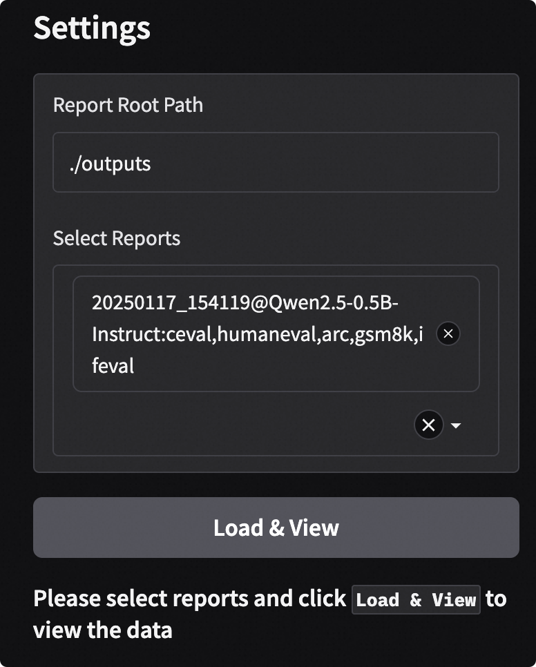
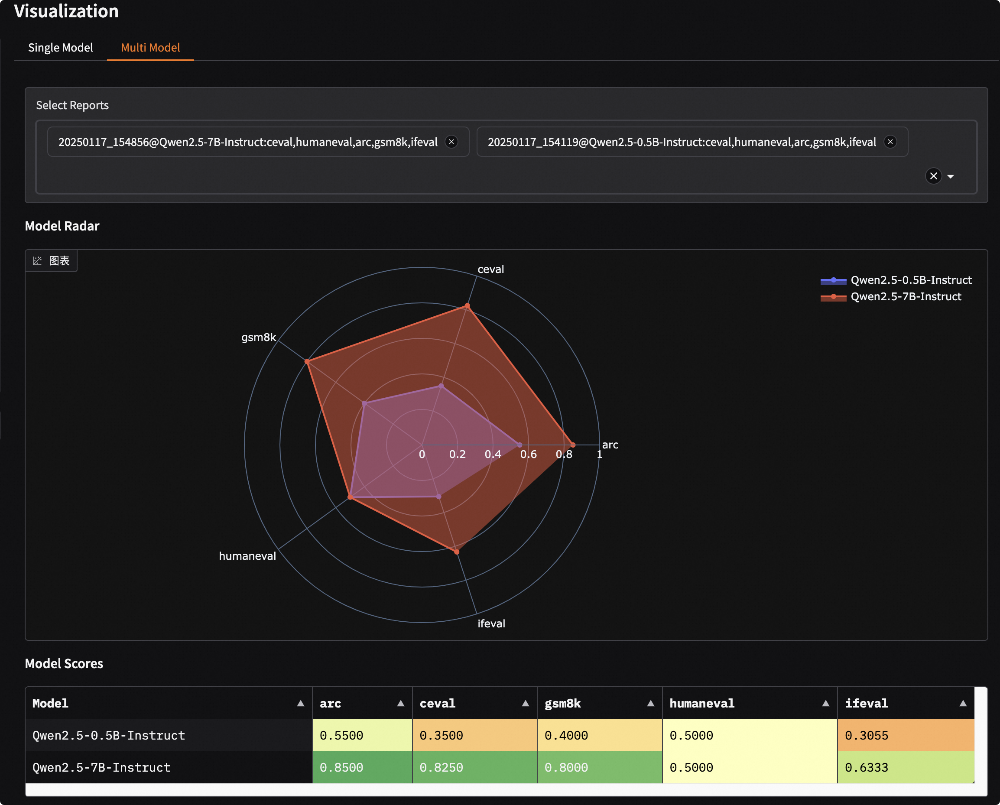
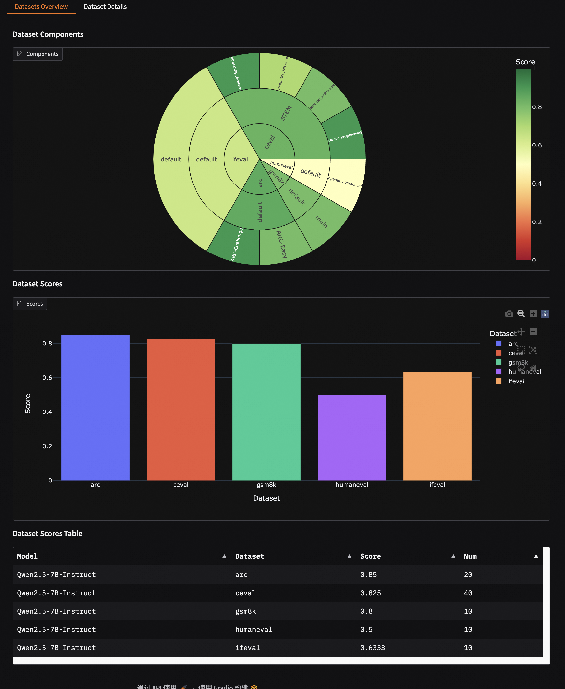
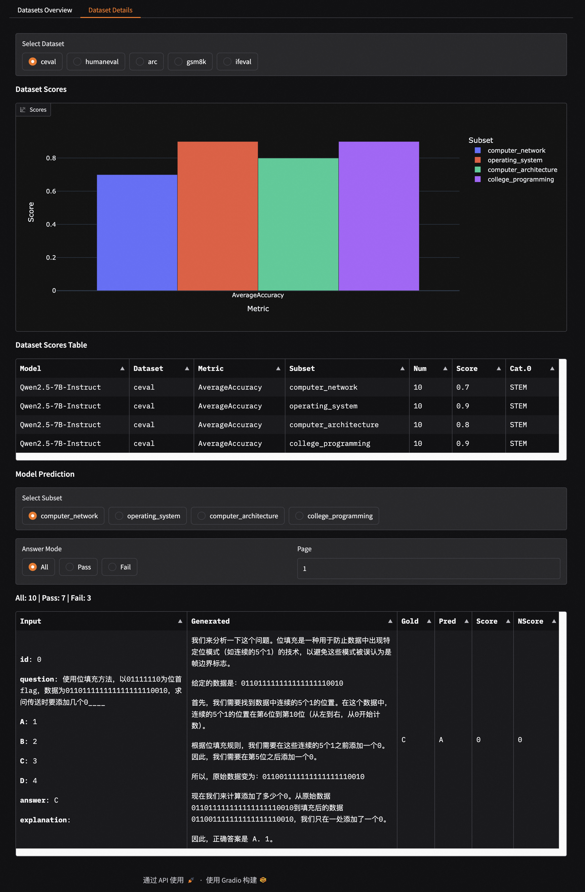
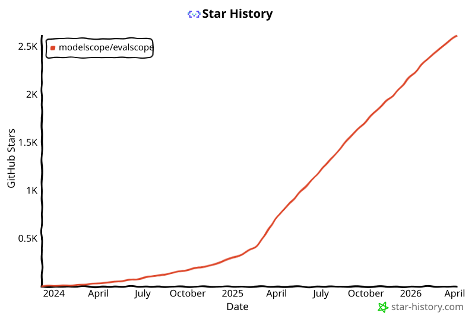

<p align="center">
    <br>
    
    <br>
<p>

<p align="center">
  中文 &nbsp ｜ &nbsp <a href="README.md">English</a> &nbsp
</p>

<p align="center">

<a href="https://badge.fury.io/py/evalscope"></a>
<a href="https://pypi.org/project/evalscope"></a>
<a href="https://github.com/modelscope/evalscope/pulls"></a>
<a href='https://evalscope.readthedocs.io/en/latest/?badge=latest'></a>
<p>

<p align="center">
<a href="https://evalscope.readthedocs.io/zh-cn/latest/"> 📖  中文文档</a> &nbsp ｜ &nbsp <a href="https://evalscope.readthedocs.io/en/latest/"> 📖  English Documentation</a>
<p>

> ⭐ 如果你喜欢这个项目，请点击右上角的"Star"按钮支持我们。你的支持是我们前进的动力！

## 📝 简介

EvalScope 是由 [ModelScope 社区](https://modelscope.cn/) 创建的强大且易于扩展的模型评估框架，旨在为大模型开发者提供一站式评估解决方案。

无论你是想评估模型的通用能力、进行多模型性能比较，还是需要对模型进行压力测试，EvalScope 都能满足你的需求。

## ✨ 核心特性

- **📚 全面的评估基准测试**：内置多个业界公认的评估基准测试，包括 MMLU、C-Eval、GSM8K 等。
- **🧩 多模态和多领域支持**：支持评估各类模型，包括大型语言模型（LLM）、视觉语言模型（VLM）、Embedding、Reranker、AIGC 等。
- **🚀 多后端集成**：无缝集成多个评估后端，包括 OpenCompass、VLMEvalKit、RAGEval，满足不同评估需求。
- **⚡ 推理性能测试**：提供强大的模型服务压力测试工具，支持 TTFT、TPOT 等多种性能指标。
- **📊 交互式报告**：提供 WebUI 可视化界面，支持多维度的模型比较、报告总览和详细检查。
- **⚔️ Arena 模式**：支持多模型对战（两两对战），直观地对模型进行排名和评估。
- **🔧 高度可扩展**：开发者可以轻松添加自定义数据集、模型和评估指标。

<details><summary>🏛️ 整体架构</summary>

<p align="center">
    
    <br>EvalScope 整体架构。
</p>

1.  **输入层**
    - **模型来源**：API 模型（OpenAI API）、本地模型（ModelScope）
    - **数据集**：标准评估基准测试（MMLU/GSM8k 等）、自定义数据（MCQ/QA）

2.  **核心功能**
    - **多后端评估**：原生后端、OpenCompass、MTEB、VLMEvalKit、RAGAS
    - **性能监控**：支持多种模型服务 API 和数据格式，追踪 TTFT/TPOP 等指标
    - **工具扩展**：集成 Tool-Bench、Needle-in-a-Haystack 等

3.  **输出层**
    - **结构化报告**：支持 JSON、Table、Logs
    - **可视化平台**：支持 Gradio、Wandb、SwanLab

</details>

## 🎉 最新动态

> [!IMPORTANT]
> **1.0 版本重构**
>
> 1.0 版本对评估框架进行了重大改造，在 `evalscope/api` 下建立了全新的、更加模块化和可扩展的 API 层。主要改进包括：基准测试、样本和结果的标准化数据模型；基准测试和指标等组件的注册机制设计；以及重写了核心评估器以编排新架构。现有的基准测试适配器已迁移到此 API，实现了更清晰、更一致且更易于维护的实现。

- 🔥 **[2026.03.24]** 新增 Agent Skill 支持。任何支持 Skill/工具调用的代理模型都可以使用自然语言驱动 EvalScope 进行模型评估、性能基准测试和结果可视化。安装 EvalScope Skill 后，只需用自然语言描述你的需求（例如"evaluate Qwen2.5-7B on gsm8k"），Skill 将自动生成并执行相应的 `evalscope eval` / `evalscope perf` 命令。参见[使用文档](skills/evalscope/SKILL.md)。OpenClaw Skill 地址：[https://clawhub.ai/yunnglin/skill-evalscope](https://clawhub.ai/yunnglin/skill-evalscope)。
- 🔥 **[2026.03.09]** 新增评估进度追踪和 HTML 格式可视化报告生成支持。
- 🔥 **[2026.03.02]** 新增 Anthropic Claude API 评估支持。使用 `--eval-type anthropic_api` 通过 Anthropic API 服务评估模型。
- 🔥 **[2026.02.03]** 全面更新数据集文档，新增数据统计、数据样本、使用说明等内容。参见[支持的数据集](https://evalscope.readthedocs.io/en/latest/get_started/supported_dataset/llm.html)
- 🔥 **[2026.01.13]** 新增 Embedding 和 Rerank 模型服务压力测试支持。参见[使用文档](https://evalscope.readthedocs.io/en/latest/user_guides/stress_test/examples.html#embedding)。
- 🔥 **[2025.12.26]** 新增 Terminal-Bench-2.0 支持，用于评估 AI 代理在 89 个真实多步终端任务上的表现。参见[使用文档](https://evalscope.readthedocs.io/en/latest/third_party/terminal_bench.html)。
- 🔥 **[2025.12.18]** 新增 SLA 自动调优模型 API 服务支持，可在特定延迟、TTFT 和吞吐量条件下自动测试模型服务的最大并发数。参见[使用文档](https://evalscope.readthedocs.io/en/latest/user_guides/stress_test/sla_auto_tune.html)。
- 🔥 **[2025.12.16]** 新增 Fleurs、LibriSpeech 等音频评估基准测试支持；新增 MultiplE、MBPP 等多语言代码评估基准测试支持。
- 🔥 **[2025.12.02]** 新增自定义多模态 VQA 评估支持；参见[使用文档](https://evalscope.readthedocs.io/en/latest/advanced_guides/custom_dataset/vlm.html)。新增在 ClearML 中可视化模型服务压力测试支持；参见[使用文档](https://evalscope.readthedocs.io/en/latest/user_guides/stress_test/examples.html#clearml)。
- 🔥 **[2025.11.26]** 新增 OpenAI-MRCR、GSM8K-V、MGSM、MicroVQA、IFBench、SciCode 基准测试支持。
- 🔥 **[2025.11.18]** 新增自定义 Function-Call（工具调用）数据集支持，用于测试模型是否能及时、正确地调用工具。参见[使用文档](https://evalscope.readthedocs.io/en/latest/advanced_guides/custom_dataset/llm.html#function-calling-format-fc)。
- 🔥 **[2025.11.14]** 新增 SWE-bench_Verified、SWE-bench_Lite、SWE-bench_Verified_mini 代码评估基准测试支持。参见[使用文档](https://evalscope.readthedocs.io/en/latest/third_party/swe_bench.html)。
- 🔥 **[2025.11.12]** 新增 `pass@k`、`vote@k`、`pass^k` 等指标聚合方式；新增 A_OKVQA、CMMU、ScienceQA、V*Bench 等多模态评估基准测试支持。
- 🔥 **[2025.11.07]** 新增 τ²-bench 支持，这是 τ-bench 的扩展增强版，包含一系列代码修复并新增电信领域故障排查场景。参见[使用文档](https://evalscope.readthedocs.io/en/latest/third_party/tau2_bench.html)。
- 🔥 **[2025.10.30]** 新增 BFCL-v4 支持，可评估包括网络搜索和长期记忆在内的代理能力。参见[使用文档](https://evalscope.readthedocs.io/en/latest/third_party/bfcl_v4.html)。
- 🔥 **[2025.10.27]** 新增 LogiQA、HaluEval、MathQA、MRI-QA、PIQA、QASC、CommonsenseQA 等评估基准测试支持。感谢 @[penguinwang96825](https://github.com/penguinwang96825) 的代码实现。
- 🔥 **[2025.10.26]** 新增 Conll-2003、CrossNER、Copious、GeniaNER、HarveyNER、MIT-Movie-Trivia、MIT-Restaurant、OntoNotes5、WNUT2017 等命名实体识别评估基准测试支持。感谢 @[penguinwang96825](https://github.com/penguinwang96825) 的代码实现。
- 🔥 **[2025.10.21]** 优化代码评估中的沙箱环境使用，支持本地和远程两种运行模式。详见[文档](https://evalscope.readthedocs.io/en/latest/user_guides/sandbox.html)。
- 🔥 **[2025.10.20]** 新增 PolyMath、SimpleVQA、MathVerse、MathVision、AA-LCR 等评估基准测试支持；优化 evalscope perf 性能以对齐 vLLM Bench。详见[文档](https://evalscope.readthedocs.io/en/latest/user_guides/stress_test/vs_vllm_bench.html)。
- 🔥 **[2025.10.14]** 新增 OCRBench、OCRBench-v2、DocVQA、InfoVQA、ChartQA 和 BLINK 多模态图文评估基准测试支持。
- 🔥 **[2025.09.22]** 代码评估基准测试（HumanEval、LiveCodeBench）现支持在沙箱环境中运行。使用此功能前请先安装 [ms-enclave](https://github.com/modelscope/ms-enclave)。
- 🔥 **[2025.09.19]** 新增 RealWorldQA、AI2D、MMStar、MMBench 和 OmniBench 等多模态图文评估基准测试，以及 Multi-IF、HealthBench 和 AMC 等纯文本评估基准测试支持。
- 🔥 **[2025.09.05]** 新增视觉-语言多模态模型评估任务支持，如 MathVista 和 MMMU。更多支持的数据集请[参见文档](https://evalscope.readthedocs.io/en/latest/get_started/supported_dataset/vlm.html)。
- 🔥 **[2025.09.04]** 新增图像编辑任务评估支持，包括 [GEdit-Bench](https://modelscope.cn/datasets/stepfun-ai/GEdit-Bench) 基准测试。使用说明参见[文档](https://evalscope.readthedocs.io/en/latest/user_guides/aigc/image_edit.html)。
- 🔥 **[2025.08.22]** 1.0 版本重构。存在破坏性变更，请[参见](https://evalscope.readthedocs.io/en/latest/get_started/basic_usage.html#switching-to-version-v1-0)。
<details><summary>更多</summary>

- 🔥 **[2025.07.18]** 模型压力测试现支持随机生成图文数据用于多模态模型评估。使用说明参见[文档](https://evalscope.readthedocs.io/en/latest/user_guides/stress_test/examples.html#id4)。
- 🔥 **[2025.07.16]** 新增 [τ-bench](https://github.com/sierra-research/tau-bench) 支持，用于评估 AI 代理在涉及动态用户和工具交互的真实场景中的表现和可靠性。使用说明参见[文档](https://evalscope.readthedocs.io/en/latest/get_started/supported_dataset/llm.html#bench)。
- 🔥 **[2025.07.14]** 新增"人类最后一场考试"([Humanity's-Last-Exam](https://modelscope.cn/datasets/cais/hle))支持，这是一个极具挑战性的评估基准测试。使用说明参见[文档](https://evalscope.readthedocs.io/en/latest/get_started/supported_dataset/llm.html#humanity-s-last-exam)。
- 🔥 **[2025.07.03]** 重构 Arena 模式：现支持自定义模型对战，输出模型排行榜，并提供对战结果可视化。详见[参考](https://evalscope.readthedocs.io/en/latest/user_guides/arena.html)。
- 🔥 **[2025.06.28]** 优化自定义数据集评估：现支持无参考答案评估。增强 LLM 评判器使用，内置"无参考答案直接评分"和"检查答案与参考答案一致性"模式。详见[参考](https://evalscope.readthedocs.io/en/latest/advanced_guides/custom_dataset/llm.html#qa)。
- 🔥 **[2025.06.19]** 新增 [BFCL-v3](https://modelscope.cn/datasets/AI-ModelScope/bfcl_v3) 基准测试支持，旨在评估模型在各种场景下的函数调用能力。更多信息参见[文档](https://evalscope.readthedocs.io/en/latest/third_party/bfcl_v3.html)。
- 🔥 **[2025.06.02]** 新增 Needle-in-a-Haystack 测试支持。只需指定 `needle_haystack` 即可进行测试，并在 `outputs/reports` 文件夹中生成相应的热力图，直观展示模型的表现。更多详情参见[文档](https://evalscope.readthedocs.io/en/latest/third_party/needle_haystack.html)。
- 🔥 **[2025.05.29]** 新增两个长文档评估基准测试：[DocMath](https://modelscope.cn/datasets/yale-nlp/DocMath-Eval/summary) 和 [FRAMES](https://modelscope.cn/datasets/iic/frames/summary)。使用指南请参见[文档](https://evalscope.readthedocs.io/en/latest/get_started/supported_dataset/index.html)。
- 🔥 **[2025.05.16]** 模型服务性能压力测试现支持设置多种并发级别并输出性能测试报告。[参考示例](https://evalscope.readthedocs.io/en/latest/user_guides/stress_test/quick_start.html#id3)。
- 🔥 **[2025.05.13]** 新增 [ToolBench-Static](https://modelscope.cn/datasets/AI-ModelScope/ToolBench-Static) 数据集支持，用于评估模型的工具调用能力。使用说明参见[文档](https://evalscope.readthedocs.io/en/latest/third_party/toolbench.html)。同时新增 [DROP](https://modelscope.cn/datasets/AI-ModelScope/DROP/dataPeview) 和 [Winogrande](https://modelscope.cn/datasets/AI-ModelScope/winogrande_val) 基准测试，用于评估模型的推理能力。
- 🔥 **[2025.04.29]** 新增 Qwen3 评估最佳实践，[欢迎阅读 📖](https://evalscope.readthedocs.io/en/latest/best_practice/qwen3.html)
- 🔥 **[2025.04.27]** 文生图评估支持：支持 MPS、HPSv2.1Score 等 8 项指标，以及 EvalMuse、GenAI-Bench 等评估基准测试。详见[用户文档](https://evalscope.readthedocs.io/en/latest/user_guides/aigc/t2i.html)。
- 🔥 **[2025.04.10]** 模型服务压力测试工具现支持 `/v1/completions` 端点（vLLM 基准测试的默认端点）
- 🔥 **[2025.04.08]** 新增评估兼容 OpenAI API 的 Embedding 模型服务支持。更多详情请查看[用户指南](https://evalscope.readthedocs.io/en/latest/user_guides/backend/rageval_backend/mteb.html#configure-evaluation-parameters)。
- 🔥 **[2025.03.27]** 新增 [AlpacaEval](https://www.modelscope.cn/datasets/AI-ModelScope/alpaca_eval/dataPeview) 和 [ArenaHard](https://modelscope.cn/datasets/AI-ModelScope/arena-hard-auto-v0.1/summary) 评估基准测试支持。使用说明请参见[文档](https://evalscope.readthedocs.io/en/latest/get_started/supported_dataset/index.html)
- 🔥 **[2025.03.20]** 模型推理服务压力测试现支持使用随机值生成指定长度的提示词。更多详情参见[用户指南](https://evalscope.readthedocs.io/en/latest/user_guides/stress_test/examples.html#using-the-random-dataset)。
- 🔥 **[2025.03.13]** 新增 [LiveCodeBench](https://www.modelscope.cn/datasets/AI-ModelScope/code_generation_lite/summary) 代码评估基准测试支持，可通过指定 `live_code_bench` 使用。支持在 LiveCodeBench 上评估 QwQ-32B，参见[最佳实践](https://evalscope.readthedocs.io/en/latest/best_practice/eval_qwq.html)。
- 🔥 **[2025.03.11]** 新增 [SimpleQA](https://modelscope.cn/datasets/AI-ModelScope/SimpleQA/summary) 和 [Chinese SimpleQA](https://modelscope.cn/datasets/AI-ModelScope/Chinese-SimpleQA/summary) 评估基准测试支持。这些用于评估模型的事实准确性，可通过指定 `simple_qa` 和 `chinese_simpleqa` 使用。还支持指定评判模型。更多详情参见[相关参数文档](https://evalscope.readthedocs.io/en/latest/get_started/parameters.html)。
- 🔥 **[2025.03.07]** 新增 [QwQ-32B](https://modelscope.cn/models/Qwen/QwQ-32B/summary) 模型支持，评估模型的推理能力和推理效率，详见[📖 QwQ-32B 评估最佳实践](https://evalscope.readthedocs.io/en/latest/best_practice/eval_qwq.html)。
- 🔥 **[2025.03.04]** 新增 [SuperGPQA](https://modelscope.cn/datasets/m-a-p/SuperGPQA/summary) 数据集支持，涵盖 13 个大类、72 个一级学科、285 个二级学科，共计 26,529 道题目。可通过指定 `super_gpqa` 使用。
- 🔥 **[2025.03.03]** 新增模型智商和情商评估支持。参见[📖 智商和情商评估最佳实践](https://evalscope.readthedocs.io/en/latest/best_practice/iquiz.html)，看看你的 AI 有多聪明！
- 🔥 **[2025.02.27]** 新增模型推理效率评估支持。参见[📖 推理效率评估最佳实践](https://evalscope.readthedocs.io/en/latest/best_practice/think_eval.html)。此实现灵感来自 [Overthinking](https://doi.org/10.48550/arXiv.2412.21187) 和 [Underthinking](https://doi.org/10.48550/arXiv.2501.18585) 的工作。
- 🔥 **[2025.02.25]** 新增两个模型推理相关的评估基准测试：[MuSR](https://modelscope.cn/datasets/AI-ModelScope/MuSR) 和 [ProcessBench](https://www.modelscope.cn/datasets/Qwen/ProcessBench/summary)。使用时只需在 datasets 参数中分别指定 `musr` 和 `process_bench` 即可。
- 🔥 **[2025.02.18]** 支持 AIME25 数据集，包含 15 道题目（Grok3 在该数据集上得分 93）。
- 🔥 **[2025.02.13]** 新增 DeepSeek 蒸馏模型评估支持，包括 AIME24、MATH-500 和 GPQA-Diamond 数据集，参见[最佳实践](https://evalscope.readthedocs.io/en/latest/best_practice/deepseek_r1_distill.html)；新增支持指定 `eval_batch_size` 参数，以加速模型评估。
- 🔥 **[2025.01.20]** 支持可视化评估结果，包括单模型评估结果和多模型比较，详见[📖 可视化评估结果](https://evalscope.readthedocs.io/en/latest/get_started/visualization.html)；新增 [`iquiz`](https://modelscope.cn/datasets/AI-ModelScope/IQuiz/summary) 评估示例，评估模型的智商和情商。
- 🔥 **[2025.01.07]** 原生后端：现已支持模型 API 评估。详见[📖 模型 API 评估指南](https://evalscope.readthedocs.io/en/latest/get_started/basic_usage.html#api)。此外，新增 `ifeval` 评估基准测试支持。
- 🔥🔥 **[2024.12.31]** 支持添加基准测试评估，参见[📖 基准测试评估添加指南](https://evalscope.readthedocs.io/en/latest/advanced_guides/add_benchmark.html)；支持自定义混合数据集评估，以更少的数据进行更全面的模型评估，参见[📖 混合数据集评估指南](https://evalscope.readthedocs.io/en/latest/advanced_guides/collection/index.html)。
- 🔥 **[2024.12.13]** 模型评估优化：无需再传递 `--template-type` 参数；支持通过 `evalscope eval --args` 启动评估。详见[📖 用户指南](https://evalscope.readthedocs.io/en/latest/get_started/basic_usage.html)。
- 🔥 **[2024.11.26]** 模型推理服务性能评估器已全面重构：现支持本地推理服务启动和 Speed Benchmark；优化了异步调用错误处理。更多详情参见[📖 用户指南](https://evalscope.readthedocs.io/en/latest/user_guides/stress_test/index.html)。
- 🔥 **[2024.10.31]** 多模态 RAG 评估最佳实践已更新，详见[📖 博客](https://evalscope.readthedocs.io/zh-cn/latest/blog/RAG/multimodal_RAG.html#multimodal-rag)。
- 🔥 **[2024.10.23]** 支持多模态 RAG 评估，包括使用 [CLIP_Benchmark](https://evalscope.readthedocs.io/en/latest/user_guides/backend/rageval_backend/clip_benchmark.html) 评估图文检索，以及扩展 [RAGAS](https://evalscope.readthedocs.io/en/latest/user_guides/backend/rageval_backend/ragas.html) 支持端到端多模态指标评估。
- 🔥 **[2024.10.8]** 支持 RAG 评估，包括使用 [MTEB/CMTEB](https://evalscope.readthedocs.io/en/latest/user_guides/backend/rageval_backend/mteb.html) 独立评估 Embedding 模型和 Reranker，以及使用 [RAGAS](https://evalscope.readthedocs.io/en/latest/user_guides/backend/rageval_backend/ragas.html) 进行端到端评估。
- 🔥 **[2024.09.18]** 文档已更新，新增博客模块，包含一些与评估相关的技术研究和讨论。欢迎[📖 阅读](https://evalscope.readthedocs.io/en/refact_readme/blog/index.html)。
- 🔥 **[2024.09.12]** 支持 LongWriter 评估，支持 10,000+ 字生成。可使用 [LongBench-Write](evalscope/third_party/longbench_write/README.md) 基准测试来衡量长输出质量和输出长度。
- 🔥 **[2024.08.30]** 支持自定义数据集评估，包括文本数据集和多模态图文数据集。
- 🔥 **[2024.08.20]** 更新官方文档，包括入门指南、最佳实践和常见问题。欢迎[📖在此阅读](https://evalscope.readthedocs.io/en/latest/)！
- 🔥 **[2024.08.09]** 简化安装流程，支持通过 pypi 安装 vlmeval 依赖；优化多模态模型评估体验，基于 OpenAI API 评估链实现最高 10 倍加速。
- 🔥 **[2024.07.31]** 重要变更：包名 `llmuses` 已更改为 `evalscope`。请相应更新你的代码。
- 🔥 **[2024.07.26]** 支持使用 **VLMEvalKit** 作为第三方评估框架发起多模态模型评估任务。
- 🔥 **[2024.06.29]** 支持使用 **OpenCompass** 作为第三方评估框架，我们进行了更高层的封装，支持 pip 安装并简化了评估任务配置。
- 🔥 **[2024.06.13]** EvalScope 与微调框架 SWIFT 无缝集成，提供从 LLM 训练到评估的全链路支持。
- 🔥 **[2024.06.13]** 集成代理评估数据集 ToolBench。

</details>

## ❤️ 社区与支持

欢迎加入我们的社区，与其他开发者交流并获取帮助。

[Discord 群组](https://discord.com/invite/D27yfEFVz5)              |  微信群 | 钉钉群
:-------------------------:|:-------------------------:|:-------------------------:
  |   | 

## 🛠️ 环境配置

我们推荐使用 `conda` 创建虚拟环境，并使用 `pip` 安装。

1.  **创建并激活 Conda 环境**（推荐 Python 3.10）
    ```shell
    conda create -n evalscope python=3.10
    conda activate evalscope
    ```

2.  **安装 EvalScope**

    - **方式一：通过 PyPI 安装（推荐）**
      ```shell
      pip install evalscope
      ```

    - **方式二：从源码安装（用于开发）**
      ```shell
      git clone https://github.com/modelscope/evalscope.git
      cd evalscope
      pip install -e .
      ```

3.  **安装额外依赖**（可选）
    根据你的需要安装相应的功能扩展：
    ```shell
    # 性能测试
    pip install 'evalscope[perf]'

    # 可视化应用
    pip install 'evalscope[app]'

    # 其他评估后端
    pip install 'evalscope[opencompass]'
    pip install 'evalscope[vlmeval]'
    pip install 'evalscope[rag]'

    # 安装所有依赖
    pip install 'evalscope[all]'
    ```
    > 如果你从源码安装，请将 `evalscope` 替换为 `.`，例如 `pip install '.[perf]'`。

> [!NOTE]
> 本项目原名 `llmuses`。如果你需要使用 `v0.4.3` 或更早版本，请运行 `pip install llmuses<=0.4.3` 并使用 `from llmuses import ...` 进行导入。

## 🚀 快速开始

你可以通过两种方式启动评估任务：**命令行**或 **Python 代码**。

### 方式一：使用命令行

在任何路径下执行 `evalscope eval` 命令即可启动评估。以下命令将在 `gsm8k` 和 `arc` 数据集上评估 `Qwen/Qwen2.5-0.5B-Instruct` 模型，每个数据集仅取 5 个样本。

```bash
evalscope eval \
 --model Qwen/Qwen2.5-0.5B-Instruct \
 --datasets gsm8k arc \
 --limit 5
```

### 方式二：使用 Python 代码

使用 `run_task` 函数和 `TaskConfig` 对象配置并启动评估任务。

```python
from evalscope import run_task, TaskConfig

# 配置评估任务
task_cfg = TaskConfig(
    model='Qwen/Qwen2.5-0.5B-Instruct',
    datasets=['gsm8k', 'arc'],
    limit=5
)

# 启动评估
run_task(task_cfg)
```

<details><summary><b>💡 提示：</b>`run_task` 也支持字典、YAML 或 JSON 文件作为配置。</summary>

**使用 Python 字典**

```python
from evalscope.run import run_task

task_cfg = {
    'model': 'Qwen/Qwen2.5-0.5B-Instruct',
    'datasets': ['gsm8k', 'arc'],
    'limit': 5
}
run_task(task_cfg=task_cfg)
```

**使用 YAML 文件** (`config.yaml`)
```yaml
model: Qwen/Qwen2.5-0.5B-Instruct
datasets:
  - gsm8k
  - arc
limit: 5
```
```python
from evalscope.run import run_task

run_task(task_cfg="config.yaml")
```
</details>

### 输出结果
评估完成后，你将在终端看到以下格式的报告：
```text
+-----------------------+----------------+-----------------+-----------------+---------------+-------+---------+
| Model Name            | Dataset Name   | Metric Name     | Category Name   | Subset Name   |   Num |   Score |
+=======================+================+=================+=================+===============+=======+=========+
| Qwen2.5-0.5B-Instruct | gsm8k          | AverageAccuracy | default         | main          |     5 |     0.4 |
+-----------------------+----------------+-----------------+-----------------+---------------+-------+---------+
| Qwen2.5-0.5B-Instruct | ai2_arc        | AverageAccuracy | default         | ARC-Easy      |     5 |     0.8 |
+-----------------------+----------------+-----------------+-----------------+---------------+-------+---------+
| Qwen2.5-0.5B-Instruct | ai2_arc        | AverageAccuracy | default         | ARC-Challenge |     5 |     0.4 |
+-----------------------+----------------+-----------------+-----------------+---------------+-------+---------+
```

## 📈 进阶用法

### 自定义评估参数

你可以通过命令行参数精细调整模型加载、推理和数据集配置。

```shell
evalscope eval \
 --model Qwen/Qwen3-0.6B \
 --model-args '{"revision": "master", "precision": "torch.float16", "device_map": "auto"}' \
 --generation-config '{"do_sample":true,"temperature":0.6,"max_tokens":512}' \
 --dataset-args '{"gsm8k": {"few_shot_num": 0, "few_shot_random": false}}' \
 --datasets gsm8k \
 --limit 10
```

- `--model-args`：模型加载参数，如 `revision`、`precision` 等。
- `--generation-config`：模型生成参数，如 `temperature`、`max_tokens` 等。
- `--dataset-args`：数据集配置参数，如 `few_shot_num` 等。

详见[📖 完整参数指南](https://evalscope.readthedocs.io/en/latest/get_started/parameters.html)。

### 评估在线模型 API

EvalScope 支持评估通过 API 部署的模型服务（如使用 vLLM 部署的服务）。只需指定服务地址和 API Key。

1.  **启动模型服务**（以 vLLM 为例）
    ```shell
    export VLLM_USE_MODELSCOPE=True
    python -m vllm.entrypoints.openai.api_server \
      --model Qwen/Qwen2.5-0.5B-Instruct \
      --served-model-name qwen2.5 \
      --port 8801
    ```

2.  **运行评估**
    ```shell
    evalscope eval \
     --model qwen2.5 \
     --eval-type openai_api \
     --api-url http://127.0.0.1:8801/v1 \
     --api-key EMPTY \
     --datasets gsm8k \
     --limit 10
    ```

### ⚔️ Arena 模式

Arena 模式通过模型之间的两两对战来评估模型表现，提供胜率和排名，非常适合多模型的横向比较。

```text
# 示例评估结果
Model           WinRate (%)  CI (%)
------------  -------------  ---------------
qwen2.5-72b            69.3  (-13.3 / +12.2)
qwen2.5-7b             50    (+0.0 / +0.0)
qwen2.5-0.5b            4.7  (-2.5 / +4.4)
```
详见[📖 Arena 模式使用指南](https://evalscope.readthedocs.io/en/latest/user_guides/arena.html)。

### 🖊️ 自定义数据集评估

EvalScope 允许你轻松添加和评估自己的数据集。详见[📖 自定义数据集评估指南](https://evalscope.readthedocs.io/en/latest/advanced_guides/custom_dataset/index.html)。

## 🧪 其他评估后端
EvalScope 支持通过第三方评估框架（我们称之为"后端"）启动评估任务，以满足多样化的评估需求。

- **原生（Native）**：EvalScope 的默认评估框架，功能全面。
- **OpenCompass**：专注于纯文本评估。[📖 使用指南](https://evalscope.readthedocs.io/en/latest/user_guides/backend/opencompass_backend.html)
- **VLMEvalKit**：专注于多模态评估。[📖 使用指南](https://evalscope.readthedocs.io/en/latest/user_guides/backend/vlmevalkit_backend.html)
- **RAGEval**：专注于 RAG 评估，支持 Embedding 和 Reranker 模型。[📖 使用指南](https://evalscope.readthedocs.io/en/latest/user_guides/backend/rageval_backend/index.html)
- **第三方评估工具**：支持 [ToolBench](https://evalscope.readthedocs.io/en/latest/third_party/toolbench.html) 等评估任务。

## ⚡ 推理性能评估工具
EvalScope 提供强大的压力测试工具，用于评估大型语言模型服务的性能。

- **核心指标**：支持吞吐量（Tokens/s）、首令牌延迟（TTFT）、令牌生成延迟（TPOT）等。
- **结果记录**：支持将结果记录到 `wandb` 和 `swanlab`。
- **速度基准测试**：可生成类似官方报告的速度基准测试结果。

详见[📖 性能测试使用指南](https://evalscope.readthedocs.io/en/latest/user_guides/stress_test/index.html)。

示例输出如下：
<p align="center">
    
</p>

## 📊 可视化评估结果

EvalScope 提供基于 Gradio 的 WebUI，用于交互式分析和比较评估结果。

1.  **安装依赖**
    ```bash
    pip install 'evalscope[app]'
    ```

2.  **启动服务**
    ```bash
    evalscope app
    ```
    访问 `http://127.0.0.1:7861` 打开可视化界面。

<table>
  <tr>
    <td style="text-align: center;">
      
      <p>设置界面</p>
    </td>
    <td style="text-align: center;">
      
      <p>模型比较</p>
    </td>
  </tr>
  <tr>
    <td style="text-align: center;">
      
      <p>报告总览</p>
    </td>
    <td style="text-align: center;">
      
      <p>报告详情</p>
    </td>
  </tr>
</table>

详见[📖 可视化评估结果](https://evalscope.readthedocs.io/en/latest/get_started/visualization.html)。

## 👷‍♂️ 参与贡献

我们欢迎社区的任何贡献！如果你想添加新的评估基准测试、模型或功能，请参阅我们的[贡献指南](https://evalscope.readthedocs.io/en/latest/advanced_guides/add_benchmark.html)。

感谢所有为 EvalScope 做出贡献的开发者！

<a href="https://github.com/modelscope/evalscope/graphs/contributors" target="_blank">
  <table>
    <tr>
      <th colspan="2">
        <br><br><br>
      </th>
    </tr>
  </table>
</a>

## 📚 引用

如果你在研究中使用了 EvalScope，请引用我们的工作：
```bibtex
@misc{evalscope_2024,
    title={{EvalScope}: Evaluation Framework for Large Models},
    author={ModelScope Team},
    year={2024},
    url={https://github.com/modelscope/evalscope}
}
```

## ⭐ Star 历史

[](https://star-history.com/#modelscope/evalscope&Date)
